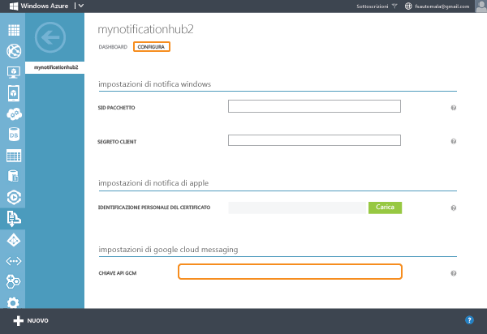
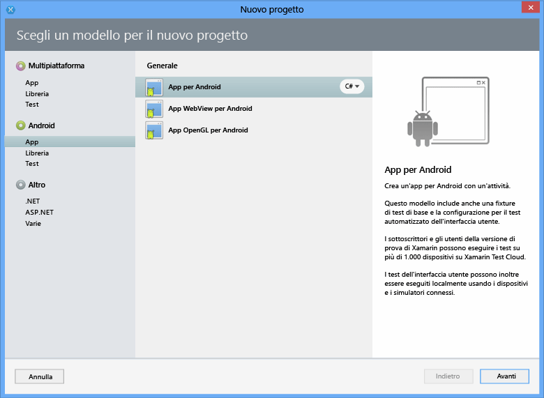
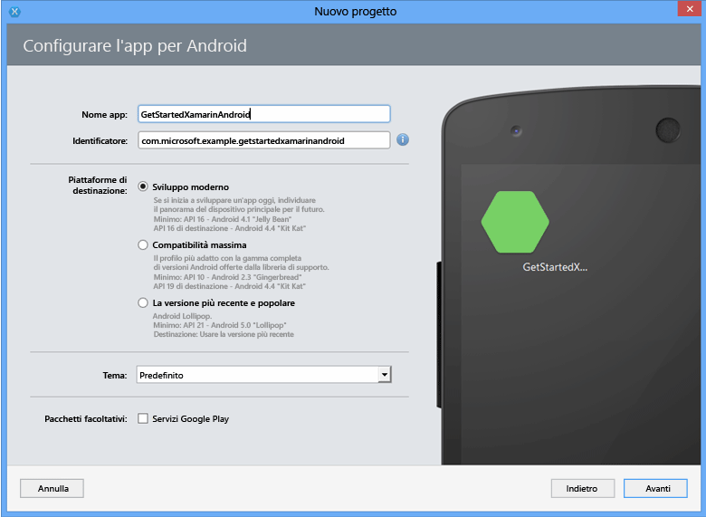
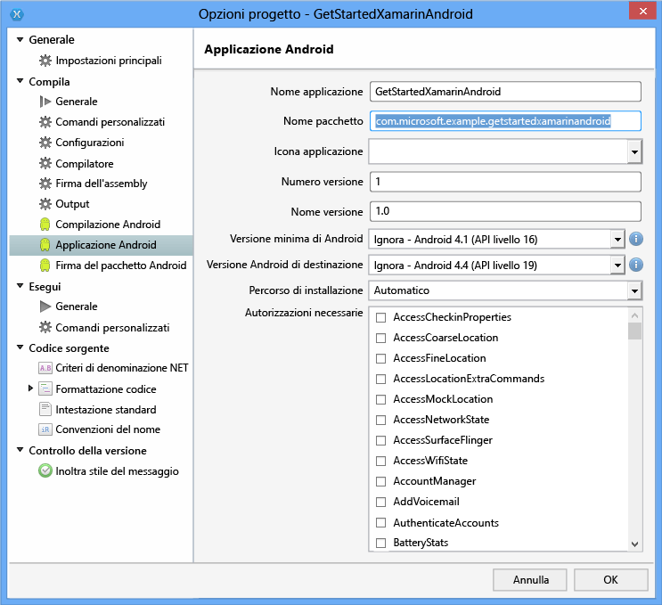
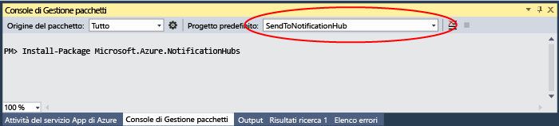

<properties
	pageTitle="Introduzione ad Hub di notifica per le app per Xamarin.Android | Microsoft Azure"
	description="Questa esercitazione contiene informazioni su come usare Hub di notifica di Azure per inviare notifiche push a un'applicazione per Xamarin Android."
	authors="wesmc7777"
	manager="dwrede"
	editor=""
	services="notification-hubs"
	documentationCenter="xamarin"/>

<tags
	ms.service="notification-hubs"
	ms.workload="mobile"
	ms.tgt_pltfrm="mobile-xamarin-android"
	ms.devlang="dotnet"
	ms.topic="hero-article"
	ms.date="11/17/2015"
	ms.author="wesmc"/>

# Introduzione ad Hub di notifica con Xamarin per Android

[AZURE.INCLUDE [notification-hubs-selector-get-started](../../includes/notification-hubs-selector-get-started.md)]

##Panoramica

In questa esercitazione viene illustrato come usare Hub di notifica di Azure per inviare notifiche push a un'applicazione di Xamarin.Android. Verrà creata un'app per Xamarin.Android vuota che riceve notifiche push tramite il servizio Google Cloud Messaging (GCM). Al termine, sarà possibile usare l’hub di notifica per trasmettere le notifiche push a tutti i dispositivi che eseguono l'app. Il codice compilato è disponibile nell'esempio di [app NotificationHubs][GitHub].

Questa esercitazione illustra uno scenario di trasmissione semplice tramite hub di notifica.

## Prima di iniziare

[AZURE.INCLUDE [notification-hubs-hero-slug](../../includes/notification-hubs-hero-slug.md)]

Il codice completo per questa esercitazione è disponibile su GitHub [qui](https://github.com/Azure/azure-notificationhubs-samples/tree/master/dotnet/Xamarin/GetStartedXamarinAndroid).

##Prerequisiti

Per completare questa esercitazione, è necessario disporre di:

+ [Xamarin.Android]
+ Un account Google attivo
+ [Componente Servizi mobili di Azure]
+ [Componente di messaggistica di Azure]
+ [Componente client di Google Cloud Messaging]

Il completamento di questa esercitazione costituisce un prerequisito per tutte le altre esercitazioni di Hub di notifica relative ad app per Xamarin.Android.

> [AZURE.IMPORTANT]Per completare l'esercitazione, è necessario disporre di un account Azure attivo. Se non si dispone di un account, è possibile creare un account di valutazione gratuita in pochi minuti. Per informazioni dettagliate, vedere la pagina relativa alla [versione di valutazione gratuita di Azure](http://azure.microsoft.com/pricing/free-trial/?WT.mc_id=A9C9624B5&amp;returnurl=http%3A%2F%2Fazure.microsoft.com%2Fit-IT%2Fdocumentation%2Farticles%2Fpartner-xamarin-notification-hubs-android-get-started%2F).

##Abilitare Google Cloud Messaging

[AZURE.INCLUDE [mobile-services-enable-Google-cloud-messaging](../../includes/mobile-services-enable-google-cloud-messaging.md)]

##Configurare l'hub di notifica

[AZURE.INCLUDE [notification-hubs-portal-create-new-hub](../../includes/notification-hubs-portal-create-new-hub.md)]

<ol start="7">
<li>
Fare clic sulla scheda <b>Configure</b> nella parte superiore, immettere il valore <b>API Key</b> ottenuto nella sezione precedente, quindi fare clic su <b>Save</b>.

</li>
</ol>
&emsp;&emsp;

L'hub di notifica è ora configurato per l'uso con GCM e si dispone delle stringhe di connessione per registrare l'app in modo da ricevere e inviare le notifiche push.

##Connettere l'app all'hub di notifica

###Creare un nuovo progetto

1. In Xamarin Studio fare clic su **New Solution**, **Android App** e quindi su **Next**.

   	

2. Compilare i campi **App Name** e **Identifier**. In **Target Plaforms** selezionare la piattaforma che si vuole supportare e quindi fare clic su **Next** e su **Create**.

   	

	In questo modo viene creato un nuovo progetto Android.

2. Aprire le proprietà del progetto facendo clic con il pulsante destro del mouse sul nuovo progetto nella visualizzazione Solution e scegliendo **Options**. Selezionare la voce **Android Application** nella sezione **Build**.

	Verificare che la prima lettera di **Package name** sia minuscola.

	> [AZURE.IMPORTANT]La prima lettera del nome del pacchetto deve essere minuscola. In caso contrario, verranno visualizzati errori del manifesto dell'applicazione al momento della registrazione di **BroadcastReceiver** e **IntentFilter** per le notifiche push più avanti.

   	

3. Impostare facoltativamente **Minimum Android version** su un altro livello API.

4. Facoltativamente, impostare **Target Android version** sulla versione dell'API di destinazione (deve essere almeno API livello 8 o superiore).

Fare clic su **OK** e chiudere la finestra di dialogo Project Options.

###Aggiungere i componenti necessari al progetto

Il client Google Cloud Messaging disponibile in Xamarin Component Store semplifica il processo di supporto delle notifiche push in Xamarin.Android.

1. Fare clic con il pulsante destro del mouse sulla cartella Components nell'app Xamarin.Android e scegliere **Get More Components**.

2. Cercare il componente **Messaggistica di Azure** e aggiungerlo al progetto.

3. Cercare il componente **Client Google Cloud Messaging** e aggiungerlo al progetto.

###Configurare Hub di notifica nel progetto

1. Raccogliere le informazioni seguenti per l'app Android e l'hub di notifica:

	- **GoogleProjectNumber**: ottenere il valore Project Number dalla panoramica dell'app nel portale di sviluppo di Google. Prendere nota di questo valore in precedenza, durante la creazione dell'app nel portale.
	- **Listen connection string**: nel dashboard del [portale di Azure classico] fare clic su **Visualizza stringhe di connessione**. Copiare la stringa di connessione *DefaultListenSharedAccessSignature* per questo valore.
	- **Hub name**: si tratta del nome dell'hub del [portale di Azure classico]. Ad esempio, *mynotificationhub2*.

	Creare una classe **Constants.cs** per il progetto Xamarin e definire i valori costanti seguenti nella classe. Sostituire i segnaposto con i valori.

		public static class Constants
		{
			public const string SenderID = "<GoogleProjectNumber>"; // Google API Project Number
			public const string ListenConnectionString = "<Listen connection string>";
			public const string NotificationHubName = "<hub name>";
		}

2. Aggiungere le istruzioni using seguenti a **MainActivity.cs**:

		using Android.Util;
		using Gcm.Client;

3. Aggiungere una variabile di istanza alla classe `MainActivity` che verrà usata per visualizzare una finestra di dialogo di avviso quando l'app è in esecuzione:

		public static MainActivity instance;

3. Creare il metodo seguente nella classe **MainActivity**:

		private void RegisterWithGCM()
		{
			// Check to ensure everything's set up right
			GcmClient.CheckDevice(this);
			GcmClient.CheckManifest(this);

			// Register for push notifications
			Log.Info("MainActivity", "Registering...");
			GcmClient.Register(this, Constants.SenderID);
		}

4. Nel metodo `OnCreate` di **MainActivity.cs** inizializzare la variabile `instance` e aggiungere una chiamata a `RegisterWithGCM`:

		protected override void OnCreate (Bundle bundle)
		{
			instance = this;

			base.OnCreate (bundle);

			// Set your view from the "main" layout resource
			SetContentView (Resource.Layout.Main);

			// Get your button from the layout resource,
			// and attach an event to it
			Button button = FindViewById<Button> (Resource.Id.myButton);

			RegisterWithGCM();
		}

4. Creare una nuova classe **MyBroadcastReceiver**.

	> [AZURE.NOTE]Di seguito è illustrata in dettaglio la creazione da zero di una classe **BroadcastReceiver**. Esiste tuttavia un'alternativa più rapida alla creazione manuale di **MyBroadcastReceiver.cs**, che consiste nel fare riferimento al file **GcmService.cs** disponibile nel progetto Xamarin.Android di esempio incluso negli [esempi di NotificationHubs][GitHub]. Anche duplicare il file **GcmService.cs** e modificare i nomi delle classi può essere un ottimo punto di partenza.

5. Aggiungere le istruzioni using seguenti a **MyBroadcastReceiver.cs**, facendo riferimento al componente e all'assembly aggiunti in precedenza:

		using System.Collections.Generic;
		using System.Text;
		using Android.App;
		using Android.Content;
		using Android.Util;
		using Gcm.Client;
		using WindowsAzure.Messaging;

5. In **MyBroadcastReceiver.cs** aggiungere le richieste di autorizzazione seguenti tra le istruzioni **using** e la dichiarazione **namespace**:

		[assembly: Permission(Name = "@PACKAGE_NAME@.permission.C2D_MESSAGE")]
		[assembly: UsesPermission(Name = "@PACKAGE_NAME@.permission.C2D_MESSAGE")]
		[assembly: UsesPermission(Name = "com.google.android.c2dm.permission.RECEIVE")]

		//GET_ACCOUNTS is needed only for Android versions 4.0.3 and below
		[assembly: UsesPermission(Name = "android.permission.GET_ACCOUNTS")]
		[assembly: UsesPermission(Name = "android.permission.INTERNET")]
		[assembly: UsesPermission(Name = "android.permission.WAKE_LOCK")]

6. In **MyBroadcastReceiver.cs** modificare la classe **MyBroadcastReceiver** in modo che corrisponda all'esempio seguente:

    	[BroadcastReceiver(Permission=Gcm.Client.Constants.PERMISSION_GCM_INTENTS)]
        [IntentFilter(new string[] { Gcm.Client.Constants.INTENT_FROM_GCM_MESSAGE },
			Categories = new string[] { "@PACKAGE_NAME@" })]
        [IntentFilter(new string[] { Gcm.Client.Constants.INTENT_FROM_GCM_REGISTRATION_CALLBACK },
			Categories = new string[] { "@PACKAGE_NAME@" })]
        [IntentFilter(new string[] { Gcm.Client.Constants.INTENT_FROM_GCM_LIBRARY_RETRY },
			Categories = new string[] { "@PACKAGE_NAME@" })]
        public class MyBroadcastReceiver : GcmBroadcastReceiverBase<PushHandlerService>
        {
            public static string[] SENDER_IDS = new string[] { Constants.SenderID };

            public const string TAG = "MyBroadcastReceiver-GCM";
        }

7. Aggiungere un'altra classe in **MyBroadcastReceiver.cs** denominata **PushHandlerService** che deriva da **GcmServiceBase**. Assicurarsi di applicare l'attributo **Service** alla classe:

    	[Service] // Must use the service tag
    	public class PushHandlerService : GcmServiceBase
    	{
        	public static string RegistrationID { get; private set; }
        	private NotificationHub Hub { get; set; }

        	public PushHandlerService() : base(Constants.SenderID)
       		{
            	Log.Info(MyBroadcastReceiver.TAG, "PushHandlerService() constructor");
        	}
    	}

8. **GcmServiceBase** implementa i metodi **OnRegistered()**, **OnUnRegistered()**, **OnMessage()**, **OnRecoverableError()** e **OnError()**. La classe di implementazione **PushHandlerService** deve eseguire l'override di questi metodi, che si attiveranno in risposta all'interazione con l'hub di notifica.

9. Eseguire l'override del metodo **OnRegistered()** in **PushHandlerService** con il codice seguente:

		protected override void OnRegistered(Context context, string registrationId)
		{
			Log.Verbose(MyBroadcastReceiver.TAG, "GCM Registered: " + registrationId);
			RegistrationID = registrationId;

			createNotification("PushHandlerService-GCM Registered...",
								"The device has been Registered!");

			Hub = new NotificationHub(Constants.NotificationHubName, Constants.ListenConnectionString,
										context);
			try
			{
				Hub.UnregisterAll(registrationId);
			}
			catch (Exception ex)
			{
				Log.Error(MyBroadcastReceiver.TAG, ex.Message);
			}

			//var tags = new List<string>() { "falcons" }; // create tags if you want
			var tags = new List<string>() {};

			try
			{
				var hubRegistration = Hub.Register(registrationId, tags.ToArray());
			}
			catch (Exception ex)
			{
				Log.Error(MyBroadcastReceiver.TAG, ex.Message);
			}
		}

	> [AZURE.NOTE]Nel codice **OnRegistered()** precedente notare la capacità di specificare tag per la registrazione a canali di messaggistica specifici.

10. Eseguire l'override del metodo **OnMessage** in **PushHandlerService** con il codice seguente:

		protected override void OnMessage(Context context, Intent intent)
		{
			Log.Info(MyBroadcastReceiver.TAG, "GCM Message Received!");

			var msg = new StringBuilder();

			if (intent != null && intent.Extras != null)
			{
				foreach (var key in intent.Extras.KeySet())
					msg.AppendLine(key + "=" + intent.Extras.Get(key).ToString());
			}

			string messageText = intent.Extras.GetString("message");
			if (!string.IsNullOrEmpty (messageText))
			{
				createNotification ("New hub message!", messageText);
			}
			else
			{
				createNotification ("Unknown message details", msg.ToString ());
			}
		}

11. Aggiungere i metodi **createNotification** e **dialogNotify** seguenti a **PushHandlerService** per informare gli utenti quando viene ricevuta una notifica.

	>[AZURE.NOTE]La progettazione di notifiche in Android versione 5.0 e successive rappresenta un'importante variazione rispetto alle versioni precedenti. Se si testa in Android 5.0 o versioni successive, l'app deve essere in esecuzione per poter ricevere la notifica. Per altre informazioni, vedere [Notifiche di Android](http://go.microsoft.com/fwlink/?LinkId=615880).

        void createNotification(string title, string desc)
        {
            //Create notification
            var notificationManager = GetSystemService(Context.NotificationService) as NotificationManager;

            //Create an intent to show UI
            var uiIntent = new Intent(this, typeof(MainActivity));

            //Create the notification
            var notification = new Notification(Android.Resource.Drawable.SymActionEmail, title);

            //Auto-cancel will remove the notification once the user touches it
            notification.Flags = NotificationFlags.AutoCancel;

            //Set the notification info
            //we use the pending intent, passing our ui intent over, which will get called
            //when the notification is tapped.
            notification.SetLatestEventInfo(this, title, desc, PendingIntent.GetActivity(this, 0, uiIntent, 0));

            //Show the notification
            notificationManager.Notify(1, notification);
			dialogNotify (title, desc);
        }

		protected void dialogNotify(String title, String message)
		{

			MainActivity.instance.RunOnUiThread(() => {
				AlertDialog.Builder dlg = new AlertDialog.Builder(MainActivity.instance);
				AlertDialog alert = dlg.Create();
				alert.SetTitle(title);
				alert.SetButton("Ok", delegate {
					alert.Dismiss();
				});
				alert.SetMessage(message);
				alert.Show();
			});
		}

12. Eseguire l'override dei membri astratti **OnUnRegistered()**, **OnRecoverableError()** e **OnError()** per consentire la compilazione del codice:

		protected override void OnUnRegistered(Context context, string registrationId)
		{
			Log.Verbose(MyBroadcastReceiver.TAG, "GCM Unregistered: " + registrationId);

			createNotification("GCM Unregistered...", "The device has been unregistered!");
		}

		protected override bool OnRecoverableError(Context context, string errorId)
		{
			Log.Warn(MyBroadcastReceiver.TAG, "Recoverable Error: " + errorId);

			return base.OnRecoverableError (context, errorId);
		}

		protected override void OnError(Context context, string errorId)
		{
			Log.Error(MyBroadcastReceiver.TAG, "GCM Error: " + errorId);
		}

##Eseguire l'app nell'emulatore

Se si esegue l'app nell'emulatore, assicurarsi di usare un emulatore Android Virtual Device (AVD) con il supporto per Google APIs.

> [AZURE.IMPORTANT]Per ricevere notifiche push, è necessario impostare un account Google in Android Virtual Device. Nell'emulatore passare a **Settings** e fare clic su **Add Account**. Assicurarsi inoltre che l'emulatore sia connesso a Internet.

>[AZURE.NOTE]La progettazione di notifiche in Android versione 5.0 e successive rappresenta un'importante variazione rispetto alle versioni precedenti. Per altre informazioni, vedere [Notifiche di Android](http://go.microsoft.com/fwlink/?LinkId=615880).

1. In **Tools** fare clic su **Open Android Emulator Manager**, selezionare il dispositivo e quindi fare clic su **Edit**.

   	![][18]

2. Selezionare **Google APIs** in **Target** e quindi fare clic su **OK**.

   	![][19]

3. Fare clic su **Run** sulla barra degli strumenti nella parte superiore della schermata e selezionare l'app. In questo modo l'emulatore viene avviato e l'app eseguita.

  L'app recupera la proprietà *registrationId* da GCM ed esegue la registrazione con l'hub di notifica.

##Inviare notifiche dal back-end

È possibile testare la ricezione delle notifiche nell'app inviando notifiche nel [portale di Azure classico] tramite la scheda Debug nell'hub di notifica, come illustrato nella schermata seguente.

![][30]

Le notifiche push vengono in genere inviate in un servizio back-end come Servizi mobili o ASP.NET usando una libreria compatibile. È anche possibile utilizzare l'API REST direttamente per inviare messaggi di notifica se una libreria non è disponibile per il back-end.

Di seguito è riportato un elenco di altre esercitazioni, che è possibile esaminare per l'invio di notifiche:

- ASP.NET: vedere [Uso di Hub di notifica di Azure per inviare notifiche agli utenti].
- Azure Notification Hubs Java SDK: vedere [Come usare Hub di notifica da Java](notification-hubs-java-backend-how-to.md) per l'invio di notifiche da Java. È stato testato in Eclipse per lo sviluppo per Android.
- PHP: vedere [Come usare Hub di notifica da PHP](notification-hubs-php-backend-how-to.md).

Nelle sezioni secondarie successive di questa esercitazione vengono inviate notifiche con un'app console .NET e con un servizio mobile tramite uno script node.

####(Facoltativo) Inviare notifiche tramite un'app .NET

In questa sezione si invieranno notifiche con un'app console .NET.

1. Creare una nuova applicazione console in Visual C#:

   	![][20]

2. In Visual Studio fare clic su **Strumenti**, selezionare **Gestione pacchetti NuGet** e quindi **Console di Gestione pacchetti**.

	In questo modo viene visualizzata la console di Gestione pacchetti in Visual Studio.

3. Nella finestra Console di Gestione pacchetti impostare **Progetto predefinito** sul nuovo progetto di applicazione console e quindi eseguire il comando seguente nella finestra della console:

        Install-Package Microsoft.Azure.NotificationHubs

	Verrà aggiunto un riferimento ad Azure Notification Hubs SDK usando il <a href="http://www.nuget.org/packages/Microsoft.Azure.NotificationHubs/">pacchetto NuGet Microsoft.Azure.Notification Hubs</a>.

	

4. Aprire il file Program.cs e aggiungere l'istruzione `using` seguente:

        using Microsoft.Azure.NotificationHubs;

5. Nella classe `Program` aggiungere il metodo seguente. Aggiornare il testo segnaposto con la stringa di connessione *DefaultFullSharedAccessSignature* e il nome dell'hub dal [portale di Azure classico].

        private static async void SendNotificationAsync()
        {
            NotificationHubClient hub = NotificationHubClient.CreateClientFromConnectionString("<connection string with full access>", "<hub name>");
            await hub.SendGcmNativeNotificationAsync("{ "data" : {"message":"Hello from Azure!"}}");
        }

6. Aggiungere le righe seguenti nel metodo **Main**:

         SendNotificationAsync();
		 Console.ReadLine();

7. Premere F5 per eseguire l'app. Si dovrebbe ricevere una notifica nell’app.

   	![][21]

####(Facoltativo) Inviare notifiche tramite un servizio mobile

1. Guardare [Introduzione a Servizi mobili].

1. Accedere al [portale di Azure classico] e selezionare il servizio mobile.

2. Selezionare la scheda **Utilità di pianificazione** in alto.

   	![][22]

3. Creare un nuovo processo pianificato, immettere un nome, quindi scegliere **On demand**.

   	![][23]

4. Una volta creato il processo, fare clic sul relativo nome. Fare quindi clic sulla scheda **Script** nella barra superiore.

5. Inserire lo script seguente all'interno della funzione dell'utilità di pianificazione. Assicurarsi di sostituire i segnaposto con il nome dell'hub di notifica e la stringa di connessione associata a *DefaultFullSharedAccessSignature* ottenuti nel passaggio precedente. Fare clic su **Save**.

        var azure = require('azure');
		var notificationHubService = azure.createNotificationHubService('<hub name>', '<connection string>');
		notificationHubService.gcm.send(null,'{"data":{"message" : "Hello from Mobile Services!"}}',
    	  function (error)
    	  {
        	if (!error) {
               console.warn("Notification successful");
            }
            else
            {
              console.warn("Notification failed" + error);
            }
          }
	    );

6. Fare clic su **Run Once** sulla barra inferiore. Si dovrebbe ricevere una notifica di tipo avviso popup.

##Passaggi successivi

In questo semplice esempio le notifiche sono state trasmesse a tutti i dispositivi Android. Per rivolgersi a utenti specifici, fare riferimento all'esercitazione [Usare Hub di notifica per inviare notifiche push agli utenti]. Se si desidera segmentare gli utenti per gruppi di interesse, consultare [Uso di Hub di notifica per inviare le ultime notizie]. Per altre informazioni sull'uso di Hub di notifica, vedere [Panoramica dell'Hub di notifica] e [Procedura: Hub di notifica di Azure (App per Android)].

<!-- Anchors. -->
[Enable Google Cloud Messaging]: #register
[Configure your Notification Hub]: #configure-hub
[Connecting your app to the Notification Hub]: #connecting-app
[Run your app with the emulator]: #run-app
[Send notifications from your back-end]: #send
[Next steps]: #next-steps

<!-- Images. -->

[11]: ./media/partner-xamarin-notification-hubs-android-get-started/notification-hub-configure-android.png

[13]: ./media/partner-xamarin-notification-hubs-android-get-started/notification-hub-create-xamarin-android-app1.png
[15]: ./media/partner-xamarin-notification-hubs-android-get-started/notification-hub-create-xamarin-android-app3.png

[18]: ./media/partner-xamarin-notification-hubs-android-get-started/notification-hub-create-android-app7.png
[19]: ./media/partner-xamarin-notification-hubs-android-get-started/notification-hub-create-android-app8.png

[20]: ./media/partner-xamarin-notification-hubs-android-get-started/notification-hub-create-console-app.png
[21]: ./media/partner-xamarin-notification-hubs-android-get-started/notification-hub-android-toast.png
[22]: ./media/partner-xamarin-notification-hubs-android-get-started/notification-hub-scheduler1.png
[23]: ./media/partner-xamarin-notification-hubs-android-get-started/notification-hub-scheduler2.png

[30]: ./media/partner-xamarin-notification-hubs-android-get-started/notification-hubs-debug-hub-gcm.png

<!-- URLs. -->
[Submit an app page]: http://go.microsoft.com/fwlink/p/?LinkID=266582
[My Applications]: http://go.microsoft.com/fwlink/p/?LinkId=262039
[Live SDK for Windows]: http://go.microsoft.com/fwlink/p/?LinkId=262253
[Introduzione a Servizi mobili]: /develop/mobile/tutorials/get-started-xamarin-android/#create-new-service
[JavaScript and HTML]: /develop/mobile/tutorials/get-started-with-push-js

[portale di Azure classico]: https://manage.windowsazure.com/
[wns object]: http://go.microsoft.com/fwlink/p/?LinkId=260591
[Panoramica dell'Hub di notifica]: http://msdn.microsoft.com/library/jj927170.aspx
[Procedura: Hub di notifica di Azure (App per Android)]: http://msdn.microsoft.com/library/dn282661.aspx

[Usare Hub di notifica per inviare notifiche push agli utenti]: /manage/services/notification-hubs/notify-users-aspnet
[Uso di Hub di notifica di Azure per inviare notifiche agli utenti]: /manage/services/notification-hubs/notify-users-aspnet
[Uso di Hub di notifica per inviare le ultime notizie]: /manage/services/notification-hubs/breaking-news-dotnet
[GCMClient Component page]: http://components.xamarin.com/view/GCMClient
[Xamarin.NotificationHub GitHub page]: https://github.com/SaschaDittmann/Xamarin.NotificationHub
[GitHub]: http://go.microsoft.com/fwlink/p/?LinkId=331329
[Xamarin.Android]: http://xamarin.com/download/
[Componente Servizi mobili di Azure]: http://components.xamarin.com/view/azure-mobile-services/
[Componente client di Google Cloud Messaging]: http://components.xamarin.com/view/GCMClient/
[Componente di messaggistica di Azure]: http://components.xamarin.com/view/azure-messaging

<!---HONumber=AcomDC_1210_2015-->