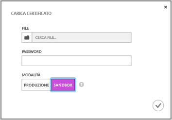
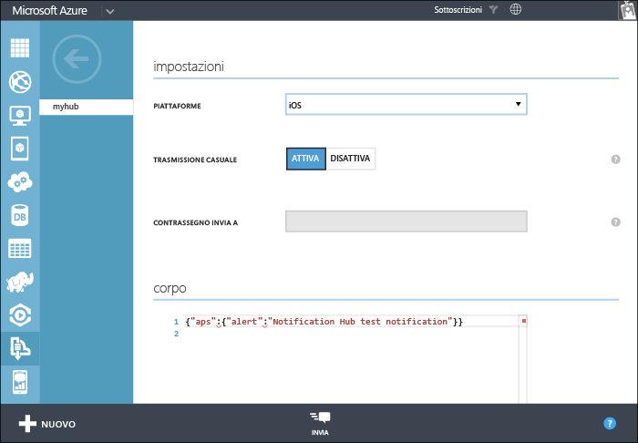

<properties
	pageTitle="Introduzione ad Hub di notifica per le app per Xamarin iOS | Microsoft Azure"
	description="In questa esercitazione, sono presenti informazioni su come usare Hub di notifica di Azure per inviare notifiche push a un'applicazione per Xamarin iOS."
	services="notification-hubs"
	documentationCenter="xamarin"
	authors="ysxu"
	manager="dwrede"
	editor=""/>

<tags
	ms.service="notification-hubs"
	ms.workload="mobile"
	ms.tgt_pltfrm="mobile-xamarin-ios"
	ms.devlang="dotnet"
	ms.topic="hero-article"
	ms.date="11/03/2015"
	ms.author="yuaxu"/>

# Introduzione ad Hub di notifica

[AZURE.INCLUDE [notification-hubs-selector-get-started](../../includes/notification-hubs-selector-get-started.md)]

##Panoramica

Questa esercitazione illustra come usare Hub di notifica di Azure per inviare notifiche push a un'applicazione per iOS. Si creerà un'app per Xamarin.iOS vuota che riceve notifiche push tramite Apple Push Notification Service (APN). Al termine, sarà possibile usare l’hub di notifica per trasmettere le notifiche push a tutti i dispositivi che eseguono l'app. Il codice compilato è disponibile nell'esempio di [app NotificationHubs][GitHub].

Questa esercitazione illustra uno scenario di trasmissione semplice tramite hub di notifica.

##Prerequisiti

Per completare questa esercitazione, è necessario disporre di:

+ [Xcode 6.0][Install Xcode]
+ Dispositivo con iOS 7.0 o versione successiva
+ Iscrizione a iOS Developer Program
+ [Xamarin.iOS]
+ [Componente Servizi mobili di Azure]

   >[AZURE.NOTE]Considerati i requisiti di configurazione delle notifiche push, è necessario distribuire e testare le notifiche push su un dispositivo con iOS (iPhone o iPad) anziché su un simulatore.

Il completamento di questa esercitazione costituisce un prerequisito per tutte le altre esercitazioni degli Hub di notifica relative ad app per Xamarin.iOS.

> [AZURE.IMPORTANT]Per completare l'esercitazione, è necessario disporre di un account Azure attivo. Se non si dispone di un account, è possibile creare un account di valutazione gratuita in pochi minuti. Per informazioni dettagliate, vedere la pagina relativa alla [versione di valutazione gratuita di Azure](http://azure.microsoft.com/pricing/free-trial/?WT.mc_id=A643EE910&amp;returnurl=http%3A%2F%2Fazure.microsoft.com%2Fit-IT%2Fdocumentation%2Farticles%2Fpartner-xamarin-notification-hubs-ios-get-started).

[AZURE.INCLUDE [Hub di notifica - Abilita notifiche Push di Apple](../../includes/notification-hubs-enable-apple-push-notifications.md)]

##Configurare l'hub di notifica

Questa sezione illustra come creare un nuovo hub di notifica e configurare l'autenticazione con il servizio APN usando il certificato push **.p12** creato in precedenza. Se si vuole usare un hub di notifica che è già stato creato, è possibile ignorare il passaggio 5.

[AZURE.INCLUDE [notification-hubs-portal-create-new-hub](../../includes/notification-hubs-portal-create-new-hub.md)]

<ol start="7">
<li>

Fare clic sulla scheda <b>Configura</b> in alto e quindi scegliere il pulsante <b>Carica</b> nelle impostazioni di notifica di Apple per caricare l'identificazione digitale del certificato. Selezionare quindi il certificato <b>.p12</b> esportato in precedenza e la password per il certificato.

Assicurarsi di selezionare la modalità <b>Sandbox</b>, essendo destinata allo sviluppo. Usare la modalità <b>Produzione</b> solo se si vuole inviare notifiche push agli utenti che hanno acquistato l'app dallo Store.

</li>
</ol>
&emsp;&emsp;

&emsp;&emsp;

L'hub di notifica è ora configurato per l'uso con Servizi notifica Push Apple e si dispone delle stringhe di connessione per registrare l'app e inviare le notifiche.

##Connettere l'app all'hub di notifica

#### Creare un nuovo progetto

1. In Xamarin Studio creare un nuovo progetto iOS e selezionare il modello **Unified API** > **Single View Application**.

   	![][31]

2. È necessario aggiungere un riferimento al componente di messaggistica di Azure. Nella visualizzazione Solution fare clic con il pulsante destro del mouse sulla cartella **Components** del progetto e scegliere **Get More Components**. Cercare il componente <3>Messaggistica di Azure</3> e aggiungerlo al progetto.

3. In **AppDelegate.cs** aggiungere l'istruzione using seguente:

    	using WindowsAzure.Messaging;

4. Dichiarare un'istanza di **SBNotificationHub**:

		private SBNotificationHub Hub { get; set; }

5. Creare una classe **Constants.cs** con le variabili seguenti:

        // Azure app-specific connection string and hub path
        public const string ConnectionString = "<Azure connection string>";
        public const string NotificationHubPath = "<Azure hub path>";

6. In **AppDelegate.cs** aggiornare **FinishedLaunching()** in base all'esempio seguente:

        public override bool FinishedLaunching(UIApplication application, NSDictionary launchOptions)
        {
            if (UIDevice.CurrentDevice.CheckSystemVersion (8, 0)) {
    			var pushSettings = UIUserNotificationSettings.GetSettingsForTypes (
                       UIUserNotificationType.Alert | UIUserNotificationType.Badge | UIUserNotificationType.Sound,
                       new NSSet ());

			    UIApplication.SharedApplication.RegisterUserNotificationSettings (pushSettings);
			    UIApplication.SharedApplication.RegisterForRemoteNotifications ();
			} else {
			    UIRemoteNotificationType notificationTypes = UIRemoteNotificationType.Alert | UIRemoteNotificationType.Badge | UIRemoteNotificationType.Sound;
			    UIApplication.SharedApplication.RegisterForRemoteNotificationTypes (notificationTypes);
			}

            return true;
        }

7. In **AppDelegate.cs** eseguire l'override dell'evento **RegisteredForRemoteNotifications()**:

        public override void RegisteredForRemoteNotifications(UIApplication application, NSData deviceToken)
        {
            Hub = new SBNotificationHub(Constants.ConnectionString, Constants.NotificationHubPath);

            Hub.UnregisterAllAsync (deviceToken, (error) => {
                if (error != null)
                {
                    Console.WriteLine("Error calling Unregister: {0}", error.ToString());
                    return;
                }

                NSSet tags = null; // create tags if you want
                Hub.RegisterNativeAsync(deviceToken, tags, (errorCallback) => {
                    if (errorCallback != null)
                        Console.WriteLine("RegisterNativeAsync error: " + errorCallback.ToString());
                });
            });
        }

8. In **AppDelegate.cs** eseguire l'override dell'evento **ReceivedRemoteNotification()**:

        public override void ReceivedRemoteNotification(UIApplication application, NSDictionary userInfo)
        {
            ProcessNotification(userInfo, false);
        }

9. Creare il metodo **ProcessNotification()** seguente in **AppDelegate.cs**:

        void ProcessNotification(NSDictionary options, bool fromFinishedLaunching)
        {
            // Check to see if the dictionary has the aps key.  This is the notification payload you would have sent
            if (null != options && options.ContainsKey(new NSString("aps")))
            {
                //Get the aps dictionary
                NSDictionary aps = options.ObjectForKey(new NSString("aps")) as NSDictionary;

                string alert = string.Empty;

                //Extract the alert text
                // NOTE: If you're using the simple alert by just specifying
                // "  aps:{alert:"alert msg here"}  ", this will work fine.
                // But if you're using a complex alert with Localization keys, etc.,
                // your "alert" object from the aps dictionary will be another NSDictionary.
                // Basically the JSON gets dumped right into a NSDictionary,
                // so keep that in mind.
                if (aps.ContainsKey(new NSString("alert")))
                    alert = (aps [new NSString("alert")] as NSString).ToString();

                //If this came from the ReceivedRemoteNotification while the app was running,
                // we of course need to manually process things like the sound, badge, and alert.
                if (!fromFinishedLaunching)
                {
                    //Manually show an alert
                    if (!string.IsNullOrEmpty(alert))
                    {
                        UIAlertView avAlert = new UIAlertView("Notification", alert, null, "OK", null);
                        avAlert.Show();
                    }
                }
            }
        }

    > [AZURE.NOTE]È possibile scegliere di eseguire l'override di **FailedToRegisterForRemoteNotifications()** per gestire situazioni quali l'assenza di una connessione di rete.

10. Eseguire l'app sul dispositivo.

## Invio di notifiche

È possibile testare la ricezione delle notifiche nell'app mediante l'invio di notifiche nel portale di Azure, usando la scheda Debug nell'hub di notifica, come illustrato nella schermata seguente.

Le notifiche push vengono in genere inviate in un servizio back-end come Servizi mobili o ASP.NET usando una libreria compatibile. È anche possibile utilizzare l'API REST direttamente per inviare messaggi di notifica se una libreria non è disponibile per il back-end.

In questa esercitazione verrà usata un'app semplice e verrà illustrato solo il test dell'app client mediante l'invio di notifiche tramite .NET SDK per gli hub di notifica in un'applicazione console, invece che in un servizio back-end. Come passaggio successivo per l'invio di notifiche da un back-end ASP.NET, è consigliabile vedere l'esercitazione [Uso di Hub di notifica di Azure per inviare notifiche agli utenti](notification-hubs-aspnet-backend-ios-notify-users.md). Si possono tuttavia usare gli approcci seguenti per l'invio di notifiche:

* **Interfaccia REST**: è possibile supportare la notifica su qualsiasi piattaforma back-end tramite l'[interfaccia REST](http://msdn.microsoft.com/library/windowsazure/dn223264.aspx).

* **Microsoft Azure Notification Hubs .NET SDK**: in Gestione pacchetti NuGet per Visual Studio eseguire [Install-Package Microsoft.Azure.NotificationHubs](https://www.nuget.org/packages/Microsoft.Azure.NotificationHubs/).

* **Node.js**: [Come usare Hub di notifica da Node.js](notification-hubs-nodejs-how-to-use-notification-hubs.md).

* **Servizi mobili di Azure**: per un esempio di invio di notifiche da un back-end di Servizi mobili di Azure integrato con Hub di notifica, vedere "Introduzione alle notifiche push in Servizi mobili" ([Back-end .NET](../mobile-services/mobile-services-javascript-backend-windows-store-dotnet-get-started-push.md) | [Back-end JavaScript](../mobile-services/mobile-services-javascript-backend-windows-store-dotnet-get-started-push.md)).

* **Java/PHP**: per un esempio di invio di notifiche con le API REST, vedere "Come usare Hub di notifica da Java/PHP" ([Java](notification-hubs-java-backend-how-to.md) | [PHP](notification-hubs-php-backend-how-to.md)).

####(Facoltativo) Inviare notifiche da un'app console .NET.

In questa sezione si invieranno notifiche con un'app console .NET.

1. Creare una nuova applicazione console in Visual C#:

   	![][213]

2. In Visual Studio fare clic su **Strumenti**, selezionare **Gestione pacchetti NuGet** e quindi **Console di Gestione pacchetti**.

	In questo modo viene visualizzata la console di Gestione pacchetti in Visual Studio.

3. Nella finestra Console di Gestione pacchetti impostare **Progetto predefinito** sul nuovo progetto di applicazione console, quindi eseguire il comando seguente nella finestra della console:

        Install-Package Microsoft.Azure.NotificationHubs

	Verrà aggiunto un riferimento ad Azure Notification Hubs SDK tramite il <a href="http://www.nuget.org/packages/Microsoft.Azure.NotificationHubs/">pacchetto Microsoft.Azure.Notification Hubs NuGet</a>.

	

4. Aprire il file Program.cs e aggiungere l'istruzione `using` seguente:

        using Microsoft.Azure.NotificationHubs;

3. Nella classe `Program` aggiungere il metodo seguente:

        private static async void SendNotificationAsync()
        {
            NotificationHubClient hub = NotificationHubClient.CreateClientFromConnectionString("<connection string with full access>", "<hub name>");
            var alert = "{"aps":{"alert":"Hello from .NET!"}}";
            await hub.SendAppleNativeNotificationAsync(alert);
        }

4. Aggiungere le righe seguenti nel metodo `Main`:

         SendNotificationAsync();
		 Console.ReadLine();

5. Premere F5 per eseguire l'app. Si dovrebbe ricevere un avviso sul dispositivo. Se si usa una connessione Wi-Fi, accertarsi che la connessione sia funzionante.

È possibile trovare tutti i payload disponibili nella [guida alla programmazione di notifiche push e locali] di Apple.

####(Facoltativo) Inviare notifiche da un servizio mobile

In questa sezione si invieranno notifiche tramite un servizio mobile con uno script node.

Per inviare una notifica tramite un servizio mobile, eseguire quanto descritto in [Introduzione a Servizi mobili], quindi eseguire le operazioni seguenti:

1. Accedere al [portale di Azure] e selezionare il servizio mobile.

2. Selezionare la scheda **Utilità di pianificazione** in alto.

   	![][215]

3. Creare un nuovo processo pianificato, immettere un nome, quindi scegliere **On demand**.

   	![][216]

4. Una volta creato il processo, fare clic sul relativo nome. Fare quindi clic sulla scheda **Script** nella barra superiore.

5. Inserire lo script seguente all'interno della funzione dell'utilità di pianificazione. Assicurarsi di sostituire i segnaposto con il nome dell'hub di notifica e la stringa di connessione associata a *DefaultFullSharedAccessSignature* ottenuti nel passaggio precedente. Fare clic su **Save**.

		var azure = require('azure');
		var notificationHubService = azure.createNotificationHubService('<Hubname>', '<SAS Full access >');
		notificationHubService.apns.send(
	    	null,
    		{"aps":
        		{
          		"alert": "Hello from Mobile Services!"
        		}
    		},
    		function (error)
    		{
	        	if (!error) {
    	        	console.warn("Notification successful");
        		}
    		}
		);

6. Fare clic su **Run Once** sulla barra inferiore. Si dovrebbe ricevere un avviso sul dispositivo.

##Passaggi successivi

In questo semplice esempio le notifiche verranno trasmesse a tutti i dispositivi iOS. Per rivolgersi a utenti specifici, fare riferimento all'esercitazione [Usare Hub di notifica per inviare notifiche push agli utenti]. Se si desidera segmentare gli utenti per gruppi di interesse, consultare [Uso di Hub di notifica per inviare le ultime notizie]. Per altre informazioni sull'uso di Hub di notifica, vedere [Panoramica dell'Hub di notifica] e [Procedure di Hub di notifica per iOS].

<!-- Images. -->

[213]: ./media/partner-xamarin-notification-hubs-ios-get-started/notification-hub-create-console-app.png

[215]: ./media/partner-xamarin-notification-hubs-ios-get-started/notification-hub-scheduler1.png
[216]: ./media/partner-xamarin-notification-hubs-ios-get-started/notification-hub-scheduler2.png

[31]: ./media/partner-xamarin-notification-hubs-ios-get-started/notification-hub-create-ios-app.png

<!-- URLs. -->
[Mobile Services iOS SDK]: http://go.microsoft.com/fwLink/?LinkID=266533
[Submit an app page]: http://go.microsoft.com/fwlink/p/?LinkID=266582
[My Applications]: http://go.microsoft.com/fwlink/p/?LinkId=262039
[Live SDK for Windows]: http://go.microsoft.com/fwlink/p/?LinkId=262253

[Introduzione a Servizi mobili]: /develop/mobile/tutorials/get-started-xamarin-ios
[portale di Azure]: https://manage.windowsazure.com/
[Panoramica dell'Hub di notifica]: http://msdn.microsoft.com/library/jj927170.aspx
[Procedure di Hub di notifica per iOS]: http://msdn.microsoft.com/library/jj927168.aspx
[Install Xcode]: https://go.microsoft.com/fwLink/p/?LinkID=266532
[iOS Provisioning Portal]: http://go.microsoft.com/fwlink/p/?LinkId=272456

[Usare Hub di notifica per inviare notifiche push agli utenti]: /manage/services/notification-hubs/notify-users-aspnet
[Uso di Hub di notifica per inviare le ultime notizie]: /manage/services/notification-hubs/breaking-news-dotnet

[guida alla programmazione di notifiche push e locali]: http://developer.apple.com/library/mac/#documentation/NetworkingInternet/Conceptual/RemoteNotificationsPG/Chapters/ApplePushService.html#//apple_ref/doc/uid/TP40008194-CH100-SW1
[Apple Push Notification Service]: http://go.microsoft.com/fwlink/p/?LinkId=272584

[Componente Servizi mobili di Azure]: http://components.xamarin.com/view/azure-mobile-services/
[GitHub]: http://go.microsoft.com/fwlink/p/?LinkId=331329
[Xamarin.iOS]: http://xamarin.com/download
[WindowsAzure.Messaging]: https://github.com/infosupport/WindowsAzure.Messaging.iOS

<!---HONumber=Nov15_HO3-->