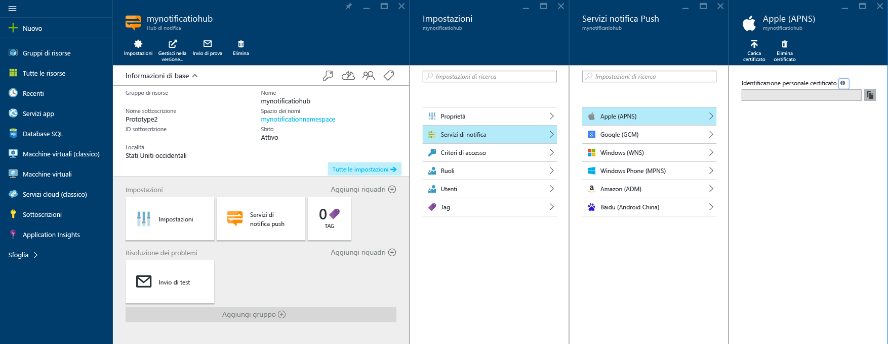
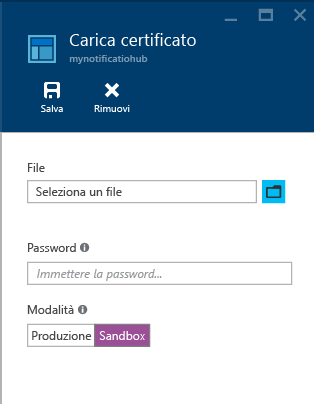

# Notifiche push di iOS con Hub di notifica per app Xamarin
[!INCLUDE [notification-hubs-selector-get-started](../../includes/notification-hubs-selector-get-started.md)]

## Panoramica
> [!IMPORTANT]
> Per completare l'esercitazione, è necessario disporre di un account Azure attivo. Se non si dispone di un account, è possibile creare un account di valutazione gratuita in pochi minuti. Per informazioni dettagliate, vedere la pagina relativa alla [versione di valutazione gratuita di Azure](https://azure.microsoft.com/pricing/free-trial/?WT.mc_id=A643EE910&amp;returnurl=http%3A%2F%2Fazure.microsoft.com%2Fen-us%2Fdocumentation%2Farticles%2Fpartner-xamarin-notification-hubs-ios-get-started).
> 
> 

Questa esercitazione illustra come usare Hub di notifica di Azure per inviare notifiche push a un'applicazione per iOS.
Si creerà un'app Xamarin.iOS vuota che riceve notifiche push attraverso [Apple Push Notification Service (APNS)](https://developer.apple.com/library/content/documentation/NetworkingInternet/Conceptual/RemoteNotificationsPG/APNSOverview.html). Al termine, sarà possibile usare l’hub di notifica per trasmettere le notifiche push a tutti i dispositivi che eseguono l'app. Il codice compilato è disponibile nell'esempio di [app NotificationHubs][GitHub].

Questa esercitazione illustra un semplice scenario di trasmissione di un messaggio push con Hub di notifica.

## Prerequisiti
Per completare questa esercitazione, è necessario disporre di:

* [Xcode 6.0][Install Xcode]
* Dispositivo compatibile con iOS 7.0 o versione successiva
* Iscrizione a iOS Developer Program
* [Xamarin Studio]
  
  > [!NOTE]
  > Considerati i requisiti di configurazione delle notifiche push di iOS, è necessario distribuire e testare l'applicazione di esempio in un dispositivo iOS, iPhone o iPad, anziché in un simulatore.
  > 
  > 

Il completamento di questa esercitazione costituisce un prerequisito per tutte le altre esercitazioni di Hub di notifica relative ad app per Xamarin.iOS.

[!INCLUDE [Notification Hubs Enable Apple Push Notifications](../../includes/notification-hubs-enable-apple-push-notifications.md)]

## Configurare l'hub di notifica
Questa sezione illustra come creare un nuovo hub di notifica e configurare l'autenticazione con il servizio APN usando il certificato push **.p12** creato in precedenza. Se si vuole usare un hub di notifica che è già stato creato, è possibile ignorare il passaggio 5.

[!INCLUDE [notification-hubs-portal-create-new-hub](../../includes/notification-hubs-portal-create-new-hub.md)]

<ol start="7">

<li>

Per configurare la connessione del servizio APN, nel portale di Azure aprire le impostazioni dell'hub di notifica, fare clic su <b>Notification Services</b> e quindi fare clic sull'elemento <b>Apple (APNS)</b> nell'elenco. Successivamente, fare clic su <b>Carica certificato</b> e selezionare il certificato con estensione <b>p12</b> esportato in precedenza, nonché la password per tale certificato.

Assicurarsi di selezionare la modalità <b>Sandbox</b> perché verranno inviati messaggi push in un ambiente di sviluppo. Usare l'impostazione <b>Produzione</b> solo se si vogliono inviare notifiche push agli utenti che hanno già acquistato l'app dallo Store.

</li>
</ol>
&emsp;&emsp;

&emsp;&emsp;

L'hub di notifica è ora configurato per l'uso con il servizio APN e sono disponibili le stringhe di connessione per la registrazione dell'app e l'invio di notifiche push.

## Connettere l'app all'hub di notifica
#### Creare un nuovo progetto
1. In Xamarin Studio creare un nuovo progetto iOS e selezionare il modello **Unified API** > **Single View Application**.
   
     ![Xamarin Studio: selezionare il tipo di applicazione][31]
2. È necessario aggiungere un riferimento al componente di messaggistica di Azure. Nella visualizzazione Solution fare clic con il pulsante destro del mouse sulla cartella **Components** del progetto e scegliere **Get More Components**. Cercare il componente **Messaggistica di Azure** e aggiungerlo al progetto.
3. In **AppDelegate.cs**aggiungere l'istruzione using seguente:
   
        using WindowsAzure.Messaging;
4. Dichiarare un'istanza di **SBNotificationHub**:
   
        private SBNotificationHub Hub { get; set; }
5. Creare una classe **Constants.cs** con le variabili seguenti:
   
        // Azure app-specific connection string and hub path
        public const string ConnectionString = "<Azure connection string>";
        public const string NotificationHubPath = "<Azure hub path>";
6. In **AppDelegate.cs** aggiornare **FinishedLaunching()** in base all'esempio seguente:
   
        public override bool FinishedLaunching(UIApplication application, NSDictionary launchOptions)
        {
            if (UIDevice.CurrentDevice.CheckSystemVersion (8, 0)) {
                var pushSettings = UIUserNotificationSettings.GetSettingsForTypes (
                       UIUserNotificationType.Alert | UIUserNotificationType.Badge | UIUserNotificationType.Sound,
                       new NSSet ());
   
                UIApplication.SharedApplication.RegisterUserNotificationSettings (pushSettings);
                UIApplication.SharedApplication.RegisterForRemoteNotifications ();
            } else {
                UIRemoteNotificationType notificationTypes = UIRemoteNotificationType.Alert | UIRemoteNotificationType.Badge | UIRemoteNotificationType.Sound;
                UIApplication.SharedApplication.RegisterForRemoteNotificationTypes (notificationTypes);
            }
   
            return true;
        }
7. Eseguire l'override del metodo **RegisteredForRemoteNotifications()** in **AppDelegate.cs**:
   
        public override void RegisteredForRemoteNotifications(UIApplication application, NSData deviceToken)
        {
            Hub = new SBNotificationHub(Constants.ConnectionString, Constants.NotificationHubPath);
   
            Hub.UnregisterAllAsync (deviceToken, (error) => {
                if (error != null)
                {
                    Console.WriteLine("Error calling Unregister: {0}", error.ToString());
                    return;
                }
   
                NSSet tags = null; // create tags if you want
                Hub.RegisterNativeAsync(deviceToken, tags, (errorCallback) => {
                    if (errorCallback != null)
                        Console.WriteLine("RegisterNativeAsync error: " + errorCallback.ToString());
                });
            });
        }
8. Eseguire l'override del metodo **ReceivedRemoteNotification()** in **AppDelegate.cs**:
   
        public override void ReceivedRemoteNotification(UIApplication application, NSDictionary userInfo)
        {
            ProcessNotification(userInfo, false);
        }
9. Creare il metodo **ProcessNotification()** seguente in **AppDelegate.cs**:
   
        void ProcessNotification(NSDictionary options, bool fromFinishedLaunching)
        {
            // Check to see if the dictionary has the aps key.  This is the notification payload you would have sent
            if (null != options && options.ContainsKey(new NSString("aps")))
            {
                //Get the aps dictionary
                NSDictionary aps = options.ObjectForKey(new NSString("aps")) as NSDictionary;
   
                string alert = string.Empty;
   
                //Extract the alert text
                // NOTE: If you're using the simple alert by just specifying
                // "  aps:{alert:"alert msg here"}  ", this will work fine.
                // But if you're using a complex alert with Localization keys, etc.,
                // your "alert" object from the aps dictionary will be another NSDictionary.
                // Basically the JSON gets dumped right into a NSDictionary,
                // so keep that in mind.
                if (aps.ContainsKey(new NSString("alert")))
                    alert = (aps [new NSString("alert")] as NSString).ToString();
   
                //If this came from the ReceivedRemoteNotification while the app was running,
                // we of course need to manually process things like the sound, badge, and alert.
                if (!fromFinishedLaunching)
                {
                    //Manually show an alert
                    if (!string.IsNullOrEmpty(alert))
                    {
                        UIAlertView avAlert = new UIAlertView("Notification", alert, null, "OK", null);
                        avAlert.Show();
                    }
                }
            }
        }
   
   > [!NOTE]
   > È possibile scegliere di eseguire l'override di **FailedToRegisterForRemoteNotifications()** per gestire situazioni quali l'assenza di una connessione di rete. Questo risulta particolarmente importante nei casi in cui l'utente può avviare l'applicazione in modalità offline, ad esempio in aereo, e si vuole gestire scenari di messaggistica push specifici per l'applicazione.
   > 
   > 
10. Eseguire l'app sul dispositivo.

## Invio di notifiche push
È possibile testare la ricezione delle notifiche push nell'app inviando notifiche nel [portale di Azure] con la funzionalità **Invio di prova** nel set di strumenti **Risoluzione dei problemi**, nella pagina dell'hub di notifica, come illustrato nella schermata seguente.

Le notifiche push vengono in genere inviate attraverso un servizio back-end come Servizi mobili o ASP.NET usando una libreria compatibile. È anche possibile usare direttamente l'API REST per l'invio di messaggi push se non è disponibile una libreria nello scenario. 

In questa esercitazione verrà usata un'app semplice e verrà illustrato solo il test dell'app client mediante l'invio di notifiche tramite .NET SDK per gli hub di notifica in un'applicazione console, invece che in un servizio back-end. Come passaggio successivo per l'invio di notifiche da un back-end ASP.NET, è consigliabile vedere l'esercitazione [Uso di Hub di notifica di Azure per inviare notifiche agli utenti](notification-hubs-aspnet-backend-ios-apple-apns-notification.md) . Si possono tuttavia usare gli approcci seguenti per l'invio di notifiche:

* **Interfaccia REST**: è possibile supportare la notifica push su qualsiasi piattaforma back-end usando l'[interfaccia REST](http://msdn.microsoft.com/library/windowsazure/dn223264.aspx).
* **Microsoft Azure Notification Hubs .NET SDK**: in Gestione pacchetti NuGet per Visual Studio eseguire [Install-Package Microsoft.Azure.NotificationHubs](https://www.nuget.org/packages/Microsoft.Azure.NotificationHubs/).
* **Node.js** : vedere [Come usare Hub di notifica da Node.js](notification-hubs-nodejs-push-notification-tutorial.md).

**App per dispositivi mobili**: per un esempio di come inviare notifiche da un back-end di app per dispositivi mobili del servizio app di Azure integrato in Hub di notifica, vedere [Aggiungere notifiche push all'app iOS](../app-service-mobile/app-service-mobile-ios-get-started-push.md).

* **Java/PHP**: per un esempio di invio di notifiche push con le API REST, vedere [Come usare Hub di notifica da Java](notification-hubs-java-push-notification-tutorial.md) | [Come usare Hub di notifica da PHP](notification-hubs-php-push-notification-tutorial.md).

#### (Facoltativo) Inviare notifiche push da un'app console .NET.
In questa sezione si invieranno notifiche push con una semplice app console .NET. Ai fini di questo esempio, si passerà a un ambiente di sviluppo Windows in cui Visual Studio è già installato.

1. In Visual Studio creare una nuova applicazione console in Visual C#:
   
       ![Visual Studio - Create a new console application][213]
2. In Visual Studio fare clic su **Strumenti**, selezionare **Gestione pacchetti NuGet** e quindi **Console di Gestione pacchetti**.
   
    La console di gestione pacchetti viene visualizzata ancorata alla parte inferiore dell'area di lavoro di Visual Studio.
3. Nella finestra Console di Gestione pacchetti impostare **Progetto predefinito** sul nuovo progetto di applicazione console, quindi eseguire il comando seguente nella finestra della console:
   
        Install-Package Microsoft.Azure.NotificationHubs
   
    Verrà aggiunto un riferimento all’SDK dell’Hub di notifica di Azure mediante il <a href="http://www.nuget.org/packages/Microsoft.Azure.NotificationHubs/">pacchetto NuGet Microsoft.Azure.NotificationHubs</a>.
   
    
4. Aprire il file `Program.cs` e aggiungere l'istruzione `using` seguente, assicurandosi che sia possibile usare le classi e le funzioni di Azure all'interno della classe principale:
   
        using Microsoft.Azure.NotificationHubs;
5. Nella classe `Program` aggiungere il metodo seguente senza tralasciare di sostituire la **stringa di connessione** e il **nome dell'hub**:
   
        private static async void SendNotificationAsync()
        {
            NotificationHubClient hub = NotificationHubClient.CreateClientFromConnectionString("<connection string with full access>", "<hub name>");
            var alert = "{\"aps\":{\"alert\":\"Hello from .NET!\"}}";
            await hub.SendAppleNativeNotificationAsync(alert);
        }
6. Aggiungere le righe seguenti nel metodo `Main` :
   
         SendNotificationAsync();
         Console.ReadLine();
7. Premere F5 per eseguire l'app. Entro pochi secondi dovrebbe essere visualizzata una notifica push nel dispositivo. Se si usa una rete dati cellulare o il Wi-Fi, assicurarsi di avere una connessione Internet attiva nel dispositivo.

È possibile trovare tutti i payload disponibili nella [guida alla programmazione di notifiche push e locali]di Apple.

#### (Facoltativo) Inviare notifiche da un servizio mobile
In questa sezione si invieranno notifiche push usando un servizio mobile con uno script node.

Per inviare una notifica tramite un servizio mobile, vedere [Introduzione a Servizi mobili]e quindi seguire questa procedura:

1. Accedere al [portale di Azure classico]e selezionare il servizio mobile.
2. Selezionare la scheda **Utilità di pianificazione** in alto.
   
       ![Azure Classic Portal - Scheduler][215]
3. Creare un nuovo processo pianificato, immettere un nome, quindi scegliere **On demand**.
   
       ![Azure Classic Portal - Create new job][216]
4. Una volta creato il processo, fare clic sul relativo nome. Fare quindi clic sulla scheda **Script** nella barra superiore.
5. Inserire lo script seguente all'interno della funzione dell'utilità di pianificazione. Assicurarsi di sostituire i segnaposto con il nome dell'hub di notifica e la stringa di connessione associata a *DefaultFullSharedAccessSignature* ottenuti nel passaggio precedente. Fare clic su **Save**.
   
        var azure = require('azure');
        var notificationHubService = azure.createNotificationHubService('<Hubname>', '<SAS Full access >');
        notificationHubService.apns.send(
            null,
            {"aps":
                {
                  "alert": "Hello from Mobile Services!"
                }
            },
            function (error)
            {
                if (!error) {
                    console.warn("Notification successful");
                }
            }
        );
6. Fare clic su **Run Once** sulla barra inferiore. Si dovrebbe ricevere un avviso sul dispositivo.

## Passaggi successivi
In questo semplice esempio le notifiche push vengono trasmesse a tutti i dispositivi iOS. Per rivolgersi a utenti specifici, fare riferimento all'esercitazione [Usare Hub di notifica per inviare notifiche push agli utenti]. Se si desidera segmentare gli utenti per gruppi di interesse, consultare [Uso di Hub di notifica per inviare le ultime notizie]. Per altre informazioni sull'uso di Hub di notifica, vedere [Panoramica dell'Hub di notifica] e [Procedure di Hub di notifica per iOS].

<!-- Images. -->

[213]: ./media/partner-xamarin-notification-hubs-ios-get-started/notification-hub-create-console-app.png

[215]: ./media/partner-xamarin-notification-hubs-ios-get-started/notification-hub-scheduler1.png
[216]: ./media/partner-xamarin-notification-hubs-ios-get-started/notification-hub-scheduler2.png

[31]: ./media/partner-xamarin-notification-hubs-ios-get-started/notification-hub-create-ios-app.png

<!-- URLs. -->
[Mobile Services iOS SDK]: http://go.microsoft.com/fwLink/?LinkID=266533
[Submit an app page]: http://go.microsoft.com/fwlink/p/?LinkID=266582
[My Applications]: http://go.microsoft.com/fwlink/p/?LinkId=262039
[Live SDK for Windows]: http://go.microsoft.com/fwlink/p/?LinkId=262253

[Introduzione a Servizi mobili]: /develop/mobile/tutorials/get-started-xamarin-ios
[portale di Azure classico]: https://manage.windowsazure.com/
[Panoramica dell'Hub di notifica]: http://msdn.microsoft.com/library/jj927170.aspx
[Procedure di Hub di notifica per iOS]: http://msdn.microsoft.com/library/jj927168.aspx
[Install Xcode]: https://go.microsoft.com/fwLink/p/?LinkID=266532
[iOS Provisioning Portal]: http://go.microsoft.com/fwlink/p/?LinkId=272456

[Usare Hub di notifica per inviare notifiche push agli utenti]: /manage/services/notification-hubs/notify-users-aspnet
[Uso di Hub di notifica per inviare le ultime notizie]: /manage/services/notification-hubs/breaking-news-dotnet

[guida alla programmazione di notifiche push e locali]:https://developer.apple.com/library/content/documentation/NetworkingInternet/Conceptual/RemoteNotificationsPG/HandlingRemoteNotifications.html#//apple_ref/doc/uid/TP40008194-CH6-SW1
[Apple Push Notification Service]: http://go.microsoft.com/fwlink/p/?LinkId=272584

[Azure Mobile Services Component]: http://components.xamarin.com/view/azure-mobile-services/
[GitHub]: http://go.microsoft.com/fwlink/p/?LinkId=331329
[Xamarin Studio]: http://xamarin.com/download
[WindowsAzure.Messaging]: https://github.com/infosupport/WindowsAzure.Messaging.iOS
[portale di Azure]: https://portal.azure.com

