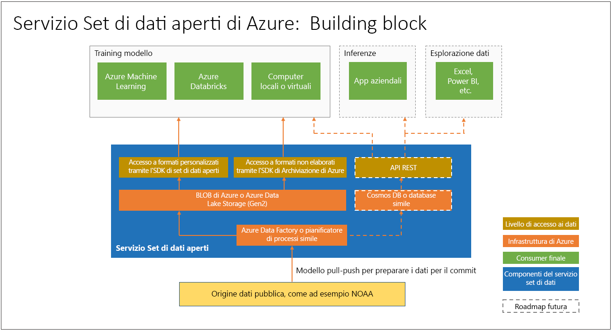

# Cos'è il servizio Azure Open Datasets (anteprima) e come è possibile usarlo?

[Azure Open Datasets](https://azure.microsoft.com/services/open-datasets/) include set di dati pubblici curati che è possibile usare per aggiungere caratteristiche specifiche dello scenario alle soluzioni di Machine Learning e realizzare modelli più accurati. I set di dati aperti si trovano nel cloud in Microsoft Azure e sono immediatamente disponibili per l'uso in Azure Databricks, nel servizio Machine Learning e in Machine Learning Studio. È anche possibile accedere ai set di dati tramite API e usarli in altri prodotti, come Power BI e Azure Data Factory.

I set di dati includono dati di pubblico dominio relativi a meteo, censimento, festività, sicurezza pubblica e posizione, che consentono di eseguire il training di modelli di Machine Learning e arricchire le soluzioni predittive. È anche possibile condividere i propri set di dati pubblici in Azure Open Datasets. 

## Set di dati preparati e curati
I set di dati pubblici, aperti e curati disponibili in Azure Open Datasets sono ottimizzati per l'utilizzo in flussi di lavoro di Machine Learning. 

Gli scienziati dei dati dedicano spesso la maggior parte del loro tempo a pulire e preparare i dati per l'analisi avanzata. I set di dati aperti vengono copiati nel cloud di Azure e pre-elaborati per far risparmiare tempo. I dati vengono prelevati a intervalli regolari dalle origini, ad esempio tramite una connessione FTP a National Oceanic and Atmospheric Administration (NOAA), analizzati in un formato strutturato e quindi arricchiti con caratteristiche appropriate come il codice postale o l'indirizzo della stazione meteo più vicina.

I set di dati sono co-ospitati con risorse di calcolo del cloud in Azure, semplificandone l'accesso e la manipolazione.  

Di seguito sono riportati alcuni esempi di set di dati disponibili. 

### Dati meteo
 
|Set di dati         | Notebooks     | DESCRIZIONE                                    |
|----------------|---------------|------------------------------------------------|
|[ISD (Integrated Surface Data) NOAA](https://azure.microsoft.com/services/open-datasets/catalog/noaa-integrated-surface-data/) | [Azure Notebooks](https://azure.microsoft.com/services/open-datasets/catalog/noaa-integrated-surface-data/?tab=data-access#AzureNotebooks)   [Azure Databricks](https://azure.microsoft.com/services/open-datasets/catalog/noaa-integrated-surface-data/?tab=data-access#AzureDatabricks) | Dati meteo orari a livello mondiale di NOAA, con la migliore copertura spaziale in America del Nord, Europa, Australia e parti dell'Asia. Vengono aggiornati quotidianamente. |
|[GFS (Global Forecast System) NOAA](https://azure.microsoft.com/services/open-datasets/catalog/noaa-global-forecast-system/) | [Azure Notebooks](https://azure.microsoft.com/services/open-datasets/catalog/noaa-global-forecast-system/?tab=data-access#AzureNotebooks)   [Azure Databricks](https://azure.microsoft.com/services/open-datasets/catalog/noaa-global-forecast-system/?tab=data-access#AzureDatabricks) | Dati di 15 giorni di previsioni meteo orarie degli USA provenienti da NOAA. Vengono aggiornati quotidianamente. |

### Dati di calendario

|Set di dati         | Notebooks     | DESCRIZIONE                                    |
|----------------|---------------|------------------------------------------------|
|[Festività pubbliche](https://azure.microsoft.com/services/open-datasets/catalog/public-holidays/) | [Azure Notebooks](https://azure.microsoft.com/services/open-datasets/catalog/public-holidays/?tab=data-access#AzureNotebooks)   [Azure Databricks](https://azure.microsoft.com/services/open-datasets/catalog/public-holidays/?tab=data-access#AzureDatabricks) | Dati sulle festività pubbliche di tutto il mondo, con copertura di 41 paesi o aree geografiche dal 1970 al 2099, che includono il paese e indicano se si tratta o meno di ferie retribuite per la maggior parte delle persone. |

## Accedere ai set di dati  
Con un account Azure è possibile accedere ai set di dati aperti usando codice o tramite l'interfaccia dei servizi di Azure. I dati sono co-ospitati con risorse di calcolo del cloud di Azure per l'uso nelle soluzioni di Machine Learning.  

Il servizio Open Datasets rende disponibili notebook di Azure Notebooks e di Azure Databricks che è possibile usare per connettere i dati al servizio Azure Machine Learning e ad Azure Databricks. I set di dati sono accessibili anche tramite Python SDK. 

Tuttavia, non è necessario un account Azure per accedere ai set di dati aperti, che sono accessibili in qualsiasi ambiente Python con o senza Spark.

## Richiedere o aggiungere set di dati

Se i dati desiderati non sono disponibili, è possibile inviarci un messaggio di posta elettronica per [richiedere un set di dati](mailto:aod@microsoft.com?Subject=Contribute%20dataset%3A%20%3Creplace%20with%20dataset%20name%3E&Body=%0AYour%20name%20and%20institution%3A%20%0A%0ADataset%20name%3A%0A%20%0ADataset%20description%3A%20%0A%3Cfill%20in%20a%20brief%20description%20and%20share%20any%20web%20links%20of%20the%20dataset%3E%20%0A%0ADataset%20size%3A%20%0A%3Chow%20much%20space%20does%20the%20dataset%20need%20today%20and%20how%20much%20is%20it%20expected%20to%20grow%20each%20year%3E%20%0A%0ADataset%20file%20formats%3A%20%0A%3Ccurrent%20dataset%20file%20formats%2C%20and%20optionally%2C%20any%20formats%20that%20the%20dataset%20must%20be%20transformed%20to%20for%20easy%20access%3E%0A%0ALicense%3A%20%0A%3Cwhat%20is%20the%20license%20or%20terms%20and%20conditions%20governing%20the%20distribution%20of%20this%20dataset%3E%0A%0AUse%20cases%3A%20%0A%3CExplain%20some%20common%20use%20of%20the%20dataset.%20E.g.%20weather%20dataset%20can%20be%20useful%20in%20demand%20forecasting%20and%20predictive%20maintenance%20scenarios%3E%20%0A%0AAny%20additional%20information%20you%20want%20us%20to%20know%3A%0A) o [aggiungere un set di dati](mailto:aod@microsoft.com?Subject=Request%20dataset%3A%20%3Creplace%20with%20dataset%20name%3E&Body=%0AYour%20name%20and%20institution%3A%20%0A%0ADataset%20name%3A%0A%20%0ADataset%20description%3A%20%0A%3Cfill%20in%20a%20brief%20description%20and%20share%20any%20web%20links%20of%20the%20dataset%3E%20%0A%0ADataset%20size%3A%20%0A%3Chow%20much%20space%20does%20the%20dataset%20need%20today%20and%20how%20much%20is%20it%20expected%20to%20grow%20each%20year%3E%20%0A%0ADataset%20file%20formats%3A%20%0A%3Ccurrent%20dataset%20file%20formats%2C%20and%20optionally%2C%20any%20formats%20that%20the%20dataset%20must%20be%20transformed%20to%20for%20easy%20access%3E%0A%0ALicense%3A%20%0A%3Cwhat%20is%20the%20license%20or%20terms%20and%20conditions%20governing%20the%20distribution%20of%20this%20dataset%3E%0A%0AUse%20cases%3A%20%0A%3CExplain%20some%20common%20use%20of%20the%20dataset.%20E.g.%20weather%20dataset%20can%20be%20useful%20in%20demand%20forecasting%20and%20predictive%20maintenance%20scenarios%3E%20%0A%0AAny%20additional%20information%20you%20want%20us%20to%20know%3A%0A). 

## Passaggi successivi
* [Notebook di esempio](samples.md)
* [Esercitazione: Creare modelli di regressione con i dati sui taxi di New York](tutorial-opendatasets-automl.md)
* [Python SDK per Open Datasets](https://aka.ms/open-datasets-api)
