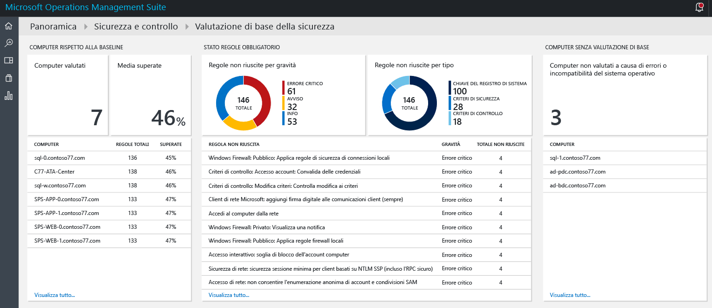
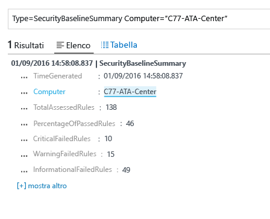
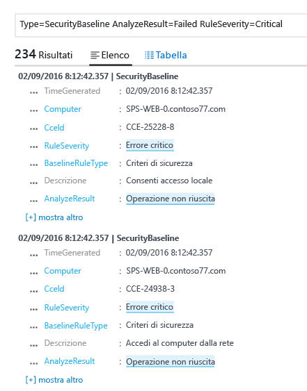

# Valutazione baseline nella soluzione Sicurezza e controllo di Operations Management Suite
Questo documento illustra come usare le funzionalità della valutazione baseline nella [Soluzione Sicurezza e controllo di Operations Management Suite (OMS)](operations-management-suite-overview.md) per accedere allo stato di protezione delle risorse monitorate.

## Informazioni sulla valutazione baseline
Microsoft, insieme ad altre organizzazioni del settore e governative in tutto il mondo, definisce una configurazione di Windows che rappresenta distribuzioni server a sicurezza elevata. Questa configurazione è un set di chiavi del Registro di sistema, impostazioni dei criteri di controllo e impostazioni di criteri di sicurezza, oltre ai valori consigliati di Microsoft per queste impostazioni. Questo set di regole è noto come baseline sicurezza. La funzionalità per la valutazione baseline della soluzione Sicurezza e controllo di OMS consente di analizzare con facilità tutti i computer per verificarne la conformità. 

Esistono tre tipi di regole:

* **Regole del Registro di sistema**: verificare che le chiavi del Registro di sistema siano impostate in modo corretto.
* **Regole dei criteri di controllo**: regole relative ai criteri di controllo.
* **Regole dei criteri di sicurezza**: regole relative alle autorizzazioni dell'utente nel computer.

> [!NOTE]
> Per una breve panoramica di questa funzionalità, vedere [Use OMS Security to assess the Security Configuration Baseline](https://blogs.technet.microsoft.com/msoms/2016/08/12/use-oms-security-to-assess-the-security-configuration-baseline/) (Usare la sicurezza di OMS per valutare la baseline di configurazione della sicurezza).
> 
> 

## Valutazione baseline sicurezza
È possibile verificare la valutazione baseline sicurezza corrente per tutti i computer monitorati da Sicurezza e controllo di OMS usando il dashboard. Seguire questa procedura per accedere al dashboard della valutazione baseline sicurezza:

1. Nel dashboard principale di **Microsoft Operations Management Suite** fare clic sul riquadro **Sicurezza e controllo**.
2. Nel dashboard **Sicurezza e controllo** fare clic su **Valutazione baseline** in **Domini di sicurezza**. Il dashboard **Valutazione baseline sicurezza** viene visualizzato come mostrato nell'immagine seguente:
   
    

Questo dashboard è suddiviso in tre aree principali:

* **Computer rispetto alla baseline**: questa sezione offre un riepilogo del numero di computer a cui è stato eseguito l'accesso e la percentuale di computer che hanno superato la valutazione. Vengono indicati anche i primi 10 computer e il risultato, sotto forma di percentuale, per la valutazione.
* **Stato regole necessario**: questa sezione indica le regole non riuscite in base a gravità e in base a tipo. Esaminando il primo grafico, è possibile identificare rapidamente se la maggior parte delle regole non riuscite è critica o meno. È disponibile anche un elenco delle prime 10 regole non riuscite e della rispettiva gravità. Il secondo grafico mostra il tipo di regole non riuscite durante la valutazione. 
* **Computer senza valutazione baseline**: questa sezione elenca i computer a cui non è stato eseguito l'accesso a causa di incompatibilità o errori del sistema operativo. 

### Accesso a computer rispetto alla baseline
Tutti i computer sono idealmente conformi alla valutazione baseline sicurezza. È tuttavia previsto che in alcune circostanze non tutti i computer siano conformi. Come parte del processo di gestione della sicurezza, è importante includere la verifica dei computer che non hanno superato tutti i test di valutazione della sicurezza. Un modo rapido per visualizzare queste informazioni consiste nel selezionare l'opzione **Computer a cui è stato eseguito l'accesso** nella sezione **Computer rispetto alla baseline**. Vengono visualizzati i risultati della ricerca nel log, con un elenco dei computer, come illustrato nella schermata seguente:

I risultati della ricerca vengono visualizzati in un formato di tabella, in cui la prima colonna contiene il nome del computer e la seconda colonna include il numero di regole non riuscite. Per recuperare le informazioni relative al tipo di regole non riuscite, fare clic sul numero di regole non riuscite accanto al nome del computer. Viene visualizzato un risultato analogo a quello illustrato nell'immagine seguente:

In questi risultati della ricerca è disponibile il totale delle regole a cui è stato eseguito l'accesso, il numero delle regole critiche non riuscite, le regole di avviso e le informazioni sulle regole non riuscite.

### Accesso allo stato delle regole necessarie
Dopo avere ottenuto le informazioni relative alla percentuale del numero di computer che ha superato la valutazione, è possibile che si vogliano ottenere altre informazioni sulle regole non riuscite in base alla criticità. Questa visualizzazione consente di assegnare priorità ai computer da gestire per primi, in modo da assicurare che risulteranno conformi alla valutazione successiva. Passare il mouse sulla parte Critica del grafico disponibile nel riquadro **Regole non riuscite per gravità** in **Stato regole necessario** e farvi clic. Viene visualizzato un risultato analogo alla schermata seguente:

 

Nei risultati di questo log viene visualizzato il tipo di regola baseline non riuscita, la descrizione della regola e l'ID CCE (Common Configuration Enumeration) di questa regola di sicurezza. Questi attributi devono essere sufficienti per eseguire un'azione correttiva per risolvere il problema nel computer di destinazione.

> [!NOTE]
> Per altre informazioni su CCE, accedere al [National Vulnerability Database](https://nvd.nist.gov/cce/index.cfm).
> 
> 

### Accesso ai computer senza valutazione baseline
OMS supporta il profilo baseline dei membri di dominio e del controller di dominio in Windows Server 2008 R2 fino a Windows Server 2012 R2. La baseline di Windows Server 2016 non è ancora definitiva e verrà aggiunta non appena pubblicata. Tutti i sistemi operativi analizzati tramite la valutazione baseline della Sicurezza e controllo di OMS vengono visualizzati nella sezione **Computer senza valutazione baseline**.

## Vedere anche 
In questo documento sono disponibili informazioni sulla valutazione baseline della Sicurezza e controllo di OMS. Per altre informazioni sulle funzionalità di OMS per la sicurezza, vedere gli articoli seguenti:

* [Panoramica di Operations Management Suite (OMS)](operations-management-suite-overview.md)
* [Monitoraggio e gestione degli avvisi di sicurezza nella soluzione Operations Management Suite per la sicurezza e il controllo](oms-security-responding-alerts.md)
* [Monitoraggio delle risorse nella soluzione Operations Management Suite per la sicurezza e il controllo](oms-security-monitoring-resources.md)

