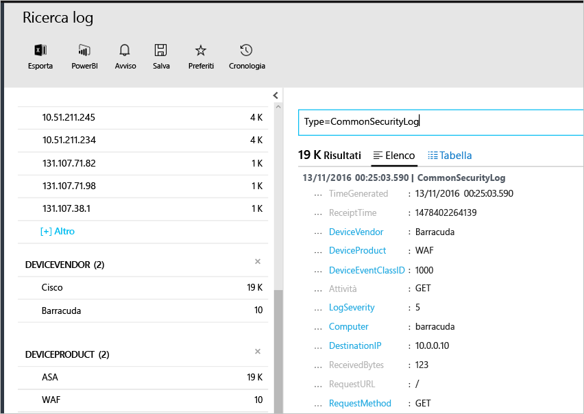

# <a name="connecting-your-security-products-to-the-operations-management-suite-oms-security-and-audit-solution"></a>Connessione dei prodotti per la sicurezza alla soluzione Sicurezza e controllo per Operations Management Suite (OMS) 
Questo documento consente di connettere i prodotti per la sicurezza alla soluzione Sicurezza e controllo per OMS. Sono supportate le origini seguenti:

- Eventi Common Event Format (CEF)
- Eventi ASA Cisco


## <a name="what-is-cef"></a>Informazioni su CEF
Common Event Format (CEF) è un formato standard di settore su messaggi Syslog, usato da molti fornitori di soluzioni per la sicurezza per consentire l'interoperabilità degli eventi tra piattaforme diverse. La soluzione Sicurezza e controllo per OMS supporta l'inserimento dei dati tramite CEF, che consente di connettere i prodotti per la sicurezza a OMS. 

Tramite la connessione dell'origine dati a OMS, è possibile sfruttare le funzionalità seguenti che fanno parte della piattaforma:

- Ricerca e controllo
- Controllo
- Avviso
- Intelligence per le minacce
- Errori rilevanti

## <a name="collection-of-security-solution-logs"></a>Raccolta di log di soluzioni per la sicurezza

La soluzione per la sicurezza per OMS supporta la raccolta di log tramite CEF sui log Syslog e [ASA Cisco](https://blogs.technet.microsoft.com/msoms/2016/08/25/add-your-cisco-asa-logs-to-oms-security/). In questo esempio, l'origine (ossia il computer che genera i log) è un computer Linux che esegue il daemon syslog-ng e la destinazione è la soluzione per la sicurezza per OMS. Per preparare il computer Linux, è necessario eseguire le attività seguenti:

- Scaricare l'agente OMS per Linux, versione 1.2.0-25 o versione successiva.
- Per installare e caricare l'agente nell'area di lavoro, consultare la sezione **Quick Install Guide** (Guida all'installazione rapida) di [questo articolo](https://github.com/Microsoft/OMS-Agent-for-Linux/blob/master/docs/OMS-Agent-for-Linux.md#steps-to-install-the-oms-agent-for-linux).

In genere, l'agente è installato in un computer diverso da quello in cui vengono generati i log. Per inoltrare i log al computer agente, vengono in genere richiesti i passaggi seguenti:

- Configurare il prodotto/computer di registrazione per inoltrare gli eventi necessari al daemon syslog (rsyslog o syslog-ng) nel computer agente.
- Abilitare il daemon syslog nel computer agente per ricevere messaggi da un sistema remoto.

Nel computer agente gli eventi devono essere inviati dal daemon syslog alla porta UDP 25226 locale. L'agente è in attesa di eventi in ingresso su questa porta. Di seguito è riportata una configurazione di esempio per l'invio di tutti gli eventi dal sistema locale all'agente (è possibile modificare la configurazione per adattarla alle proprie impostazioni locali):

1. Aprire la finestra del terminale e passare alla directory */etc/syslog-ng/* 
2. Creare un nuovo file *security-config-omsagent.conf* e aggiungere il contenuto seguente: OMS_facility = local4
    
    filter f_local4_oms { facility(local4); };

    destination security_oms { tcp("127.0.0.1" port(25226)); };

    log { source(src); filter(f_local4_oms); destination(security_oms); };
    
3. Scaricare il file *security_events.conf* e posizionarlo in */etc/opt/microsoft/omsagent/conf/omsagent.d/* nel computer agente OMS.
4. Digitare il comando seguente per riavviare il daemon syslog:  *Per eseguire syslog-ng:*
    
    ```
    sudo service rsyslog restart
    ```

    *Per eseguire rsyslog:*
    
    ```
    /etc/init.d/syslog-ng restart
    ```
5. Digitare il comando seguente per riavviare l'agente OMS:

    *Per eseguire syslog-ng:*
    
    ```
    sudo service omsagent restart
    ```

    *Per eseguire rsyslog:*
    
    ```
    systemctl restart omsagent
    ```
6. Digitare il comando seguente ed esaminare il risultato per verificare che non siano presenti errori nel log dell'agente OMS:

    ``` 
    tail /var/opt/microsoft/omsagent/log/omsagent.log
    ```

## <a name="reviewing-collected-security-events"></a>Esaminare gli eventi di sicurezza raccolti

[!include[log-analytics-log-search-nextgeneration](../../includes/log-analytics-log-search-nextgeneration.md)]

Al termine della configurazione, gli eventi di sicurezza inizieranno a essere acquisiti dalla soluzione per la sicurezza per OMS. Per visualizzare tali eventi, aprire Ricerca log, digitare il comando *Type=CommonSecurityLog* nel campo di ricerca e premere INVIO. Nell'esempio seguente viene illustrato il risultato di questo comando. Si noti che la soluzione per la sicurezza per OMS in questo caso ha già acquisito i log per la sicurezza da più fornitori:
   


È possibile perfezionare la ricerca per un unico fornitore. Ad esempio, per visualizzare i log online di Cisco, digitare: *Type=CommonSecurityLog DeviceVendor=Cisco*. "CommonSecurityLog" ha campi predefiniti per qualsiasi intestazione CEF che include le estensioni di base, mentre un'altra estensione "Estensione personalizzata" o meno, verrà inserita nel campo "AdditionalExtensions". È possibile usare la funzionalità Campi personalizzati per recuperare i campi dedicati. 

### <a name="accessing-computers-missing-baseline-assessment"></a>Accesso ai computer senza valutazione baseline
OMS supporta il profilo baseline dei membri di dominio in Windows Server 2008 R2 fino a Windows Server 2012 R2. La baseline di Windows Server 2016 non è ancora definitiva e verrà aggiunta non appena pubblicata. Tutti i sistemi operativi analizzati tramite la valutazione baseline della soluzione Sicurezza e controllo per OMS vengono visualizzati nella sezione **Computer senza valutazione baseline**.

## <a name="see-also"></a>Vedere anche
In questo documento è stato descritto come connettere la soluzione CEF a OMS. Per altre informazioni sulle funzionalità di OMS per la sicurezza, vedere gli articoli seguenti:

* [Panoramica di Operations Management Suite (OMS)](operations-management-suite-overview.md)
* [Monitoraggio e gestione degli avvisi di sicurezza nella soluzione Operations Management Suite per la sicurezza e il controllo](oms-security-responding-alerts.md)
* [Monitoraggio delle risorse nella soluzione Operations Management Suite per la sicurezza e il controllo](oms-security-monitoring-resources.md)


