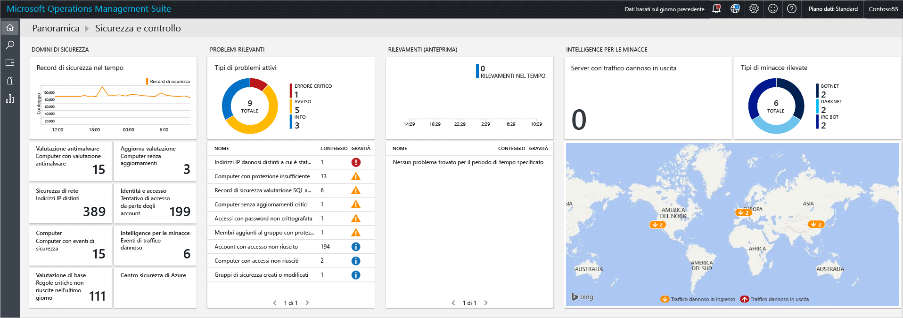
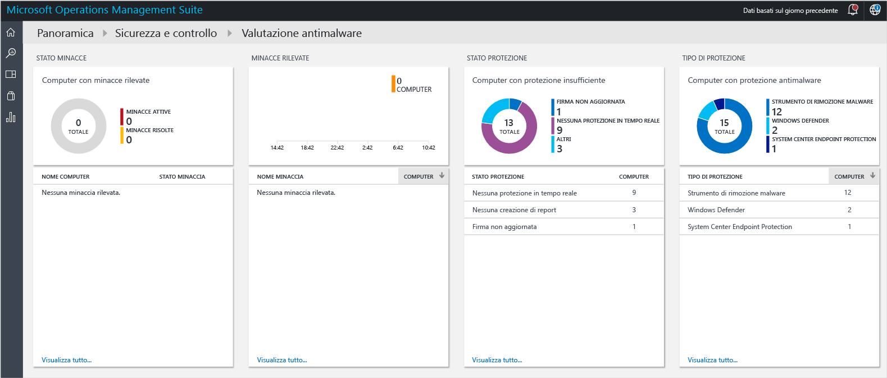
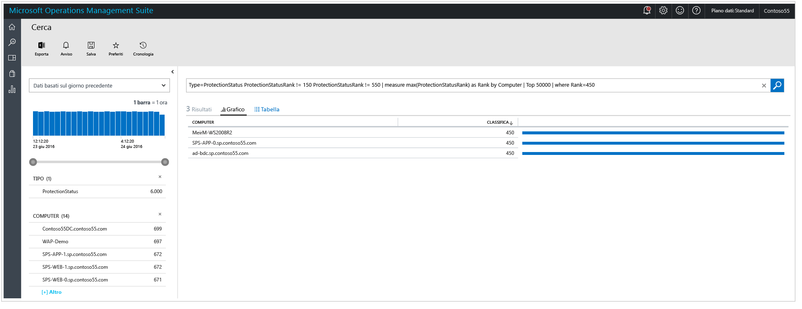
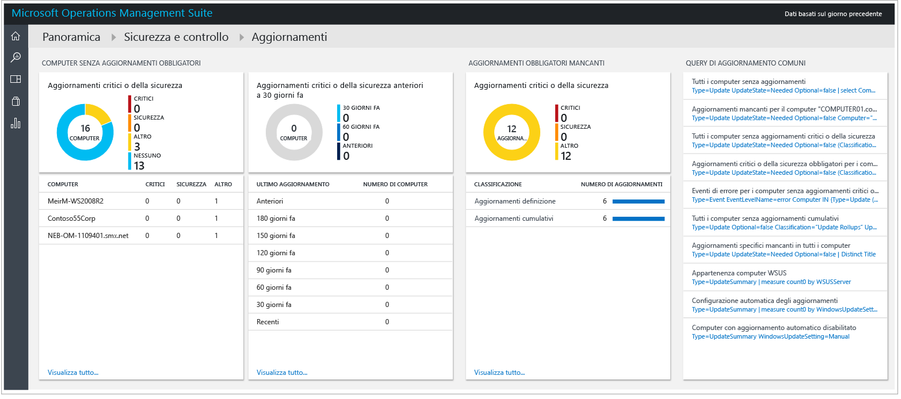
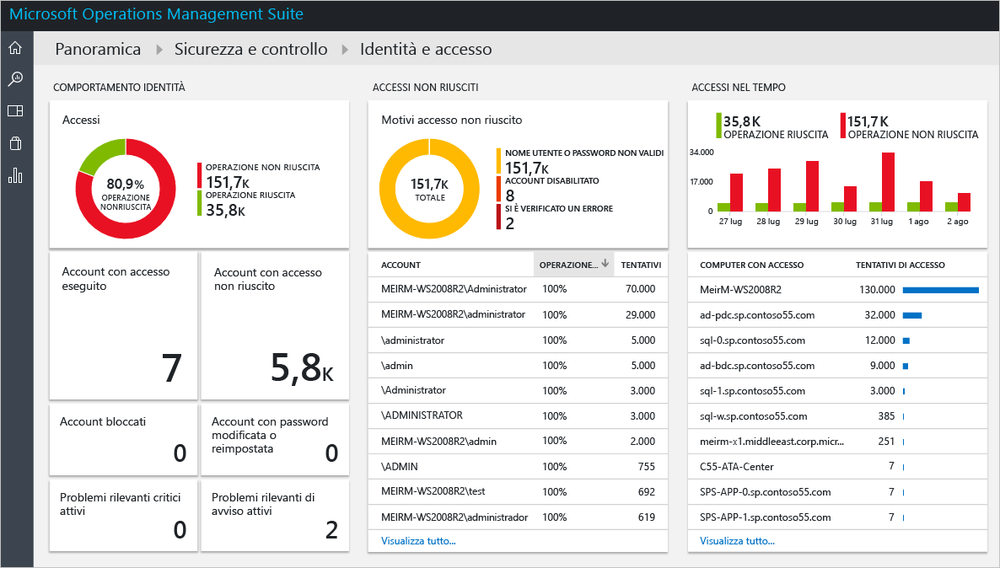
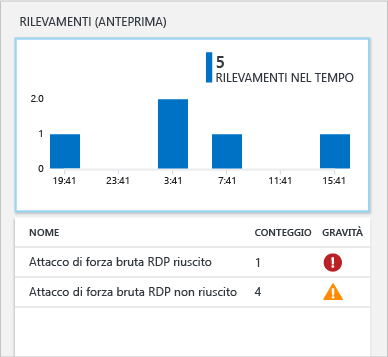
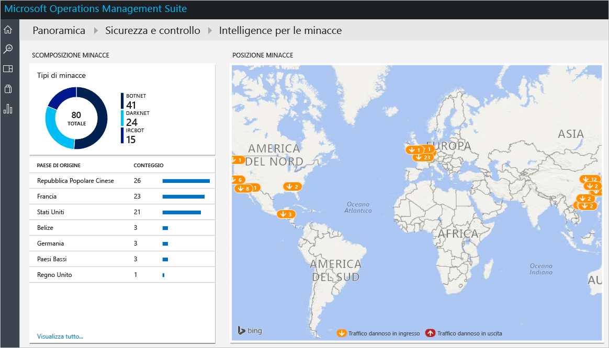

# Introduzione alla soluzione Sicurezza e controllo di Operations Management Suite
Questo documento consente di iniziare rapidamente a usare le funzionalità della soluzione Sicurezza e controllo di Operations Management Suite (OMS), illustrando ogni opzione.

## Cos'è OMS?
Microsoft Operations Management Suite (OMS) è la soluzione Microsoft per la gestione IT basata sul cloud che consente di gestire e proteggere l'infrastruttura locale e cloud. Per altre informazioni su OMS, leggere l'articolo [Operations Management Suite](https://technet.microsoft.com/library/mt484091.aspx).

## Dashboard di Sicurezza e controllo di OMS
La soluzione Sicurezza e controllo di OMS consente di ottenere una panoramica completa dell'infrastruttura di sicurezza IT dell'organizzazione, grazie alla disponibilità di query di ricerca predefinite per i problemi rilevanti che richiedono l'attenzione dell'utente. Il dashboard **Sicurezza e controllo** è la schermata iniziale per tutti gli elementi correlati alla sicurezza in OMS. Fornire una visione generale lo stato di sicurezza dei computer. Consente anche di visualizzare tutti gli eventi delle ultime 24 ore, di 7 giorni o di qualsiasi altro intervallo di tempo personalizzato. Per accedere al dashboard **Sicurezza e controllo**, seguire questa procedura:

1. Nel dashboard principale di **Microsoft Operations Management Suite** fare clic sul riquadro **Impostazioni** a sinistra.
2. Nel pannello **Impostazioni** fare clic sull'opzione **Sicurezza e controllo** in **Soluzioni**.
3. Verrà visualizzato il dashboard **Sicurezza e controllo**:
   
    

Se si accede a questo dashboard per la prima volta e non ci sono dispositivi monitorati da OMS, i riquadri non saranno popolati con i dati ottenuti dall'agente. Dopo l'installazione dell'agente, il popolamento può richiedere alcuni minuti, quindi le informazioni disponibili inizialmente potrebbero non includere alcuni dati che sono ancora in fase di caricamento nel cloud.  In questo caso è normale che alcuni riquadri siano privi di informazioni tangibili. Vedere [Connettere computer Windows direttamente a OMS](https://technet.microsoft.com/library/mt484108.aspx) per altre informazioni su come installare l'agente OMS in un sistema Windows e [Connettere computer Linux a OMS](https://technet.microsoft.com/library/mt622052.aspx) per altre informazioni su come eseguire questa attività in un sistema Linux.

> [!NOTE]
> L'agente raccoglierà le informazioni in base agli eventi correnti abilitati, ad esempio nome computer, indirizzo IP e nome utente. Non vengono tuttavia raccolti documenti o file, nomi del database o dati personali.   
> 
> 

Le soluzioni sono una raccolta di regole di logica, visualizzazione e acquisizione dei dati che permettono di risolvere le principali problematiche dei clienti. Sicurezza e controllo è una soluzione, altre possono essere aggiunte separatamente. Per altre informazioni su come aggiungere una nuova soluzione, vedere l'articolo [Aggiungere soluzioni](https://technet.microsoft.com/library/mt674635.aspx) .

Il dashboard Sicurezza e controllo di OMS è organizzato in quattro categorie principali:

* **Domini di sicurezza**: in questa area si possono esplorare ulteriormente i record di sicurezza nel tempo, accedere alla valutazione della presenza di malware, aggiornare la valutazione, verificare la sicurezza della rete, controllare identità e accesso alle informazioni, visualizzare i computer con eventi di sicurezza e accedere rapidamente al dashboard del Centro sicurezza di Azure.
* **Errori rilevanti**: questa opzione consente di identificare rapidamente il numero di problemi attivi e la relativa gravità.
* **Rilevamenti (anteprima)**: consente di identificare i modelli di attacco visualizzando gli avvisi di sicurezza non appena vengono generati per le risorse.
* **Intelligence per le minacce**: consente di identificare i modelli di attacco visualizzando il numero totale di server con traffico IP dannoso in uscita, il tipo di minaccia e una mappa che mostra la provenienza di questi indirizzi IP. 
* **Query comuni sulla sicurezza**: questa opzione fornisce un elenco delle query di sicurezza più comuni che è possibile usare per monitorare l'ambiente. Quando si fa clic in una di queste query, viene aperto il pannello **Ricerca** con i risultati della query.

> [!NOTE]
> Per altre informazioni sulla modalità di protezione dei dati in OMS, vedere l'articolo che illustra come OMS protegge i dati.
> 
> 

## Domini di sicurezza
Durante il monitoraggio delle risorse, è importante poter accedere rapidamente allo stato corrente dell'ambiente. Tuttavia, è importante anche poter risalire agli eventi che si sono verificati in passato, per comprendere meglio ciò che accade nell'ambiente locale in un determinato momento. 

> [!NOTE]
> La conservazione dei dati avviene in base al piano tariffario di OMS. Per altre informazioni vedere la pagina dei prezzi di [Microsoft Operations Management Suite](https://www.microsoft.com/server-cloud/operations-management-suite/pricing.aspx) .
> 
> 

Gli scenari di risposta agli eventi imprevisti e indagini per scopi legali potranno trarre vantaggio direttamente dai risultati disponibili nel riquadro **Record di sicurezza nel tempo** .

Quando si fa clic su questo riquadro, viene aperto il pannello **Ricerca** che mostra il risultato di una query per gli **Eventi di sicurezza** (Type=SecurityEvents) con dati basati sugli ultimi sette giorni, come illustrato di seguito:

Il risultato della ricerca è diviso in due riquadri: il riquadro sinistro fornisce una descrizione dettagliata del numero di eventi di sicurezza trovati, i computer in cui sono stati trovati questi eventi, il numero di account individuati in tali computer e i tipi di attività. Il riquadro destro fornisce i risultati totali e una visualizzazione cronologica degli eventi di sicurezza con l'attività dell'evento e il nome del computer. È anche possibile fare clic su **Dettagli** per visualizzare altri dettagli sull'evento, ad esempio i dati dell'evento, l'ID evento e l'origine dell'evento.

> [!NOTE]
> Per altre informazioni sulle query di ricerca di OMS, vedere [Informazioni di riferimento sulla ricerca in OMS](https://technet.microsoft.com/library/mt450427.aspx).
> 
> 

### Antimalware Assessment
Questa opzione consente di identificare rapidamente i computer con protezione insufficiente e quelli compromessi da un malware. Viene eseguita la lettura dello stato di valutazione della presenza di malware e delle minacce rilevate nei server monitorati , quindi i dati vengono inviati al servizio OMS nel cloud per l'elaborazione. I server con minacce rilevate e quelli con protezione insufficiente vengono visualizzati nel dashboard di valutazione della presenza di malware, accessibile dopo aver fatto clic sul riquadro **Antimalware Assessment**. 

Come qualsiasi altro riquadro animato disponibile nel dashboard di OMS, quando si fa clic su di esso, viene aperto il pannello **Ricerca** con il risultato della query. Per questa opzione, se si fa clic sull'opzione **Segnalazioni non inviate** in **Stato di protezione**, verrà visualizzato il risultato della query che mostra questa singola voce contenente il nome del computer e la classificazione, come illustrato di seguito:

> [!NOTE]
> *classificazione* è un grado specificato per riflettere lo stato di protezione (sì, no, aggiornata e così via) e le minacce trovate. La disponibilità di questa informazione come numero facilita le aggregazioni.
> 
> 

Se si fa clic sul nome del computer, si ottiene la visualizzazione cronologica dello stato di protezione per questo computer. Ciò è molto utile per gli scenari in cui è necessario sapere se l'antimalware è stato installato e se a un certo punto che è stato rimosso.   

### Valutazione aggiornamenti
Questa opzione consente di determinare rapidamente l'esposizione complessiva a potenziali problemi di sicurezza e se o in che modo questi aggiornamenti sono critici per l'ambiente. La soluzione Sicurezza e controllo di OMS fornisce solo la visualizzazione di questi aggiornamenti, mentre i dati reali provengono dalle [soluzioni di aggiornamento del sistema](https://technet.microsoft.com/library/mt484096.aspx), ovvero un modulo diverso all'interno di OMS. Di seguito è riportato un esempio degli aggiornamenti:

> [!NOTE]
> Per altre informazioni sulla soluzione Aggiornamenti, vedere [Aggiornare i server con la soluzione Aggiornamenti di sistema](https://technet.microsoft.com/library/mt484096.aspx).
> 
> 

### Identità e accesso
L'identità deve essere il piano di controllo per l'organizzazione e alla protezione dell'identità deve attribuita la massima priorità. Mentre in passato le organizzazioni erano protette da perimetri che costituivano uno dei limiti di difesa principali, oggi con la quantità sempre più ampia di dati e app trasferiti nel cloud l'identità diventa il nuovo perimetro. 

> [!NOTE]
> Attualmente i dati sono basati solo sui dati account di accesso degli eventi di sicurezza (evento ID 4624). In futuro saranno inclusi anche gli account di accesso di Office 365 e i dati di Azure AD.
> 
> 

Il monitoraggio delle attività relative all'identità consentirà di intraprendere azioni proattive prima che un evento imprevisto si verifichi o azioni reattive per interrompere un tentativo di attacco. Il dashboard **Identità e accesso** fornisce una panoramica dello stato dell'identità, che include il numero di tentativi di accesso, l'account utente usato durante i tentativi, gli account bloccati, gli account con password modificata o reimpostata e il numero attuale di account connessi. 

Quando si fa clic sul riquadro **Identità e accesso**, viene visualizzato il dashboard seguente:

Le informazioni disponibili in questo dashboard consentono di identificare immediatamente una potenziale attività sospetta. Ad esempio, sono presenti 338 tentativi di accesso come **Amministratore** e il 100% di questi tentativi non sono riusciti. Questo può essere dovuto a un attacco di forza bruta verso questo account. Se si fa clic su questo account, vengono visualizzate informazioni che consentono di determinare la risorsa di destinazione di questo attacco potenziale:

Il report dettagliato fornisce importanti informazioni su questo evento, tra cui il computer di destinazione, il tipo di accesso (in questo caso accesso alla rete), l'attività (in questo caso l'evento 4625) e una sequenza temporale completa di ogni tentativo. 

### Computer
Questo riquadro può essere usato per accedere a tutti i computer che presentano attivamente eventi di sicurezza. Quando si fa clic su questo riquadro, viene visualizzato l'elenco dei computer con eventi di sicurezza e il numero di eventi in ogni computer:

È possibile continuare l'analisi facendo clic su ogni computer ed esaminando gli eventi di sicurezza contrassegnati.

### Centro sicurezza di Azure
Questo riquadro è fondamentalmente un collegamento per accedere ai dashboard del Centro sicurezza di Azure. Per altre informazioni su questa soluzione, vedere [Introduzione al Centro sicurezza Azure](../security-center/security-center-get-started.md) .

## Errori rilevanti
Lo scopo principale di questo gruppo di opzioni consiste nel fornire una visualizzazione rapida dei problemi presenti nell'ambiente locale, suddividendoli in Critico, Avviso e Messaggio informativo. Il riquadro del tipo problema Attivo è una visualizzazione dei problemi, ma non consente di esplorare altri dettagli. A questo scopo è necessario usare la parte inferiore di questo riquadro che riprende il nome del problema (NOME), il numero di oggetti che l'hanno causato (CONTEGGIO) e la criticità (GRAVITÀ).

È possibile vedere che questi problemi sono stati già illustrati in aree diverse del gruppo **Domini di sicurezza** che conferma lo scopo di questa visualizzazione: mostrare i problemi più importanti nell'ambiente locale da un'unica posizione.

## Rilevamenti (anteprima)
Questa opzione consente principalmente al reparto IT di identificare rapidamente le potenziali minacce all'ambiente e la gravità delle minacce.

È possibile usare questa opzione anche durante l'[analisi della risposta agli eventi imprevisti](https://blogs.msdn.microsoft.com/azuresecurity/2016/11/30/investigating-suspicious-activity-in-a-hybrid-cloud-with-oms-security/) per eseguire la valutazione e ottenere altre informazioni sull'attacco.

> [!NOTE]
> Per altre informazioni su come usare OMS per la risposta agli eventi imprevisti, guardare il video [How to Leverage the Azure Security Center & Microsoft Operations Management Suite for an Incident Response](https://channel9.msdn.com/Blogs/Taste-of-Premier/ToP1703) (Come sfruttare le funzionalità del Centro sicurezza di Azure e di Microsoft Operations Management Suite per rispondere agli eventi imprevisti).
> 
> 

## Intelligence per le minacce
La nuova sezione Intelligence per le minacce della soluzione Sicurezza e controllo consente di identificare i modelli di attacco in diversi modi, visualizzando il numero totale di server con traffico IP dannoso in uscita, il tipo di minaccia e una mappa che mostra la provenienza di questi indirizzi IP. È possibile interagire con la mappa e fare clic sugli indirizzi IP per altre informazioni.

Le puntine da disegno gialle sulla mappa indicano il traffico in ingresso da indirizzi IP dannosi. Non è insolito che per i server esposti a Internet venga visualizzato traffico dannoso in ingresso, ma è consigliabile esaminare questi tentativi per assicurarsi che nessuno abbia avuto esito positivo. Questi indicatori sono basati sui log di IIS, WireData e i registri di Windows Firewall.  

## Query comuni sulla sicurezza
L'elenco di query comuni sulla sicurezza disponibili può essere utile per accedere rapidamente alle informazioni sulle risorse e personalizzarle in base alle esigenze dell'ambiente. Queste query comuni sono:

* Tutte le attività di sicurezza
* Attività di sicurezza nel compute "computer01.contoso.com" (sostituire con il nome computer desiderato)
* Attività di sicurezza nel computer "computer01.contoso.com" per l'account "Administrator" (sostituire con il nome computer e il nome account desiderati)
* Attività di accesso per computer
* Account che hanno terminato il servizio Microsoft Antimalware in qualsiasi computer
* Computer in cui il processo di Microsoft Antimalware è stato terminato
* Computer in cui è stato eseguito il processo "hash.exe" (sostituire con il nome di processo desiderato)
* Tutti i nomi dei processi eseguiti
* Attività di accesso per account
* Account che hanno eseguito l'accesso in modalità remota al computer "computer01.contoso.com" (sostituire con il nome computer desiderato)

## Vedere anche
In questo documento è stata introdotta la soluzione Sicurezza e controllo di OMS. Per altre informazioni sulle funzionalità di sicurezza di OMS, vedere gli articoli seguenti:

* [Panoramica di Operations Management Suite (OMS)](operations-management-suite-overview.md)
* [Monitoraggio e gestione degli avvisi di sicurezza nella soluzione Operations Management Suite per la sicurezza e il controllo](oms-security-responding-alerts.md)
* [Monitoraggio delle risorse nella soluzione Operations Management Suite per la sicurezza e il controllo](oms-security-monitoring-resources.md)

