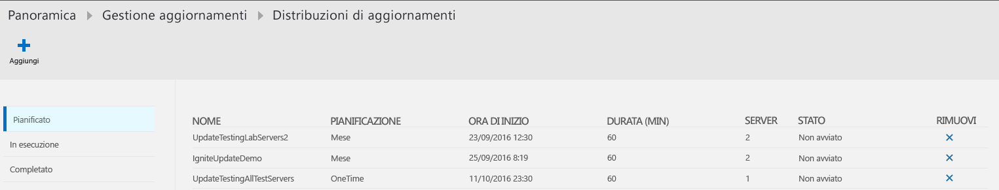
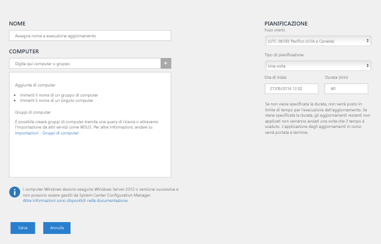
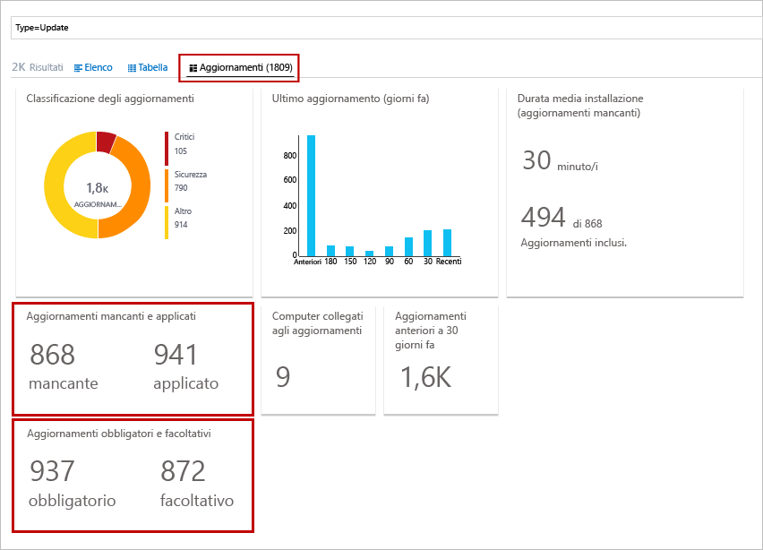
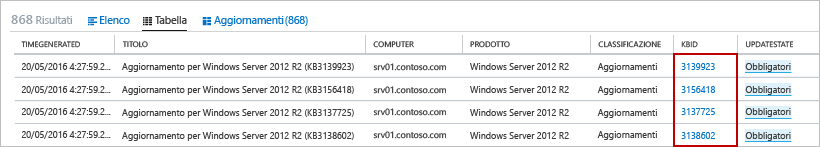
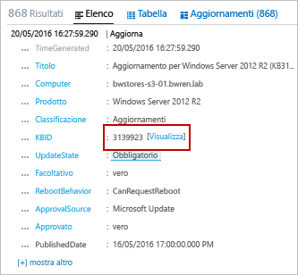

# Soluzione Gestione aggiornamenti in OMS

La soluzione Gestione aggiornamenti in OMS consente di gestire gli aggiornamenti della sicurezza del sistema operativo per i computer Windows e Linux distribuiti in Azure, in ambienti locali o in altri provider di servizi cloud.  È possibile valutare rapidamente lo stato degli aggiornamenti disponibili in tutti i computer agente e gestire il processo di installazione degli aggiornamenti necessari per i server.

## Gestione aggiornamenti in Automazione di Azure

È possibile abilitare Gestione aggiornamenti per le macchine virtuali direttamente dall'account [Automazione di Azure](../automation/automation-offering-get-started.md).
Per informazioni su come abilitare la Gestione aggiornamenti per le macchine virtuali dall'account Automazione, vedere [Gestire gli aggiornamenti per più macchine virtuali](../automation/manage-update-multi.md).

## Panoramica della soluzione
I computer gestiti da OMS usano i componenti seguenti per le valutazioni e le distribuzioni degli aggiornamenti:

* Agente OMS per Windows o Linux
* PowerShell DSC (Desired State Configuration) per Linux
* Ruolo di lavoro ibrido per runbook di Automazione
* Microsoft Update o Windows Server Update Services per computer Windows

I diagrammi seguenti offrono una visualizzazione concettuale del comportamento e del flusso dei dati e indicano in che modo la soluzione valuta e applica gli aggiornamenti della sicurezza a tutti i computer Windows Server e Linux connessi in un'area di lavoro.    

#### Windows Server

#### Linux

Quando il computer ha completato l'analisi di conformità degli aggiornamenti, l'agente OMS inoltra le informazioni in blocco a OMS. In un computer Windows, l'analisi della conformità viene eseguita ogni 12 ore per impostazione predefinita.  Oltre all'analisi pianificata, l'analisi di conformità degli aggiornamenti viene avviata entro 15 minuti in caso di riavvio di Microsoft Monitoring Agent (MMA) e prima e dopo l'installazione degli aggiornamenti.  Con un computer Linux, l'analisi di conformità viene eseguita ogni 3 ore per impostazione predefinita e avviata entro 15 minuti in caso di riavvio dell'agente MMA.  

Le informazioni di conformità vengono quindi elaborate e riepilogate nei dashboard inclusi nella soluzione oppure possono essere cercate tramite query predefinite o definite dall'utente.  La soluzione genera report sullo stato di aggiornamento del computer in base all'origine configurata per la sincronizzazione.  Se il computer Windows è configurato per l'invio di report a WSUS, a seconda della data/ora in cui WSUS ha eseguito l'ultima sincronizzazione con Microsoft Update i risultati possono differire da quanto visualizzato da Microsoft Update.  Lo stesso vale per i computer Linux configurati per l'invio di report a un repository locale rispetto a un repository pubblico.   

È possibile distribuire e installare gli aggiornamenti software nei computer che richiedono gli aggiornamenti creando una distribuzione pianificata.  A differenza degli aggiornamenti obbligatori, gli aggiornamenti classificati come *facoltativi* non sono inclusi nell'ambito della distribuzione per i computer Windows.  La distribuzione pianificata definisce quali computer di destinazione riceveranno gli aggiornamenti applicabili, specificando i computer in modo esplicito oppure selezionando un [gruppo di computer](../log-analytics/log-analytics-computer-groups.md) in base alle ricerche log di un determinato set di computer.  Si specifica anche una pianificazione per approvare e definire un periodo di tempo entro il quale è possibile installare gli aggiornamenti.  Gli aggiornamenti vengono installati da runbook in Automazione di Azure.  Questi runbook non richiedono alcuna configurazione e non possono essere visualizzati.  Quando si crea una distribuzione degli aggiornamenti, viene creata una pianificazione che avvia un runbook di aggiornamento master alla data e ora specificata per i computer inclusi.  Questo runbook master avvia un runbook figlio in ogni agente che esegue l'installazione degli aggiornamenti necessari.       

Alla data e ora specificate nella distribuzione degli aggiornamenti, i computer di destinazione eseguono la distribuzione in parallelo.  Viene prima di tutto eseguita un'analisi per verificare che gli aggiornamenti siano ancora necessari, quindi viene eseguita l'installazione.  È importante notare che per i computer client WSUS, la distribuzione degli aggiornamenti avrà esito negativo se gli aggiornamenti non sono approvati in WSUS.  I risultati degli aggiornamenti applicati vengono inoltrati a OMS e saranno elaborati e riepilogati nei dashboard oppure saranno disponibili tramite ricerche negli eventi.     

## Prerequisiti
* La soluzione supporta l'esecuzione delle valutazioni degli aggiornamenti in Windows Server 2008 e versioni successive e le distribuzioni degli aggiornamenti in Windows Server 2008 R2 SP1 e versioni successive.  Le opzioni di installazione Server Core e Nano Server non sono supportate.

    > [!NOTE]
    > Il supporto per la distribuzione degli aggiornamenti in Windows Server 2008 R2 SP1 richiede .NET Framework 4.5 e WMF 5.0 o versioni successive.
    >  
* I sistemi operativi client di Windows non sono supportati.  
* Gli agenti Windows devono essere configurati per comunicare con un server Windows Server Update Services (WSUS) o avere accesso a Microsoft Update.  

    > [!NOTE]
    > L'agente Windows non può essere gestito contemporaneamente da System Center Configuration Manager.  
    >
* CentOS 6 (x86/x64) e 7 (x64)  
* Red Hat Enterprise 6 (x86/x64) e 7 (x64)  
* SUSE Linux Enterprise Server 11 (x86/x64) e 12 (x64)  
* Ubuntu 12.04 LTS e versioni x86/x64 più recenti   
    > [!NOTE]  
    > Per evitare che gli aggiornamenti vengano applicati di fuori di una finestra di manutenzione in Ubuntu, riconfigurare il pacchetto Unattended-Upgrade per disabilitare gli aggiornamenti automatici. Per informazioni sulla configurazione, vedere l'[argomento Aggiornamenti automatici nella Guida a Ubuntu Server](https://help.ubuntu.com/lts/serverguide/automatic-updates.html).

* Gli agenti Linux devono avere accesso a un repository degli aggiornamenti.  

    > [!NOTE]
    > Un agente OMS per Linux configurato per l'invio di report a più aree di lavoro OMS non è supportato con questa soluzione.  
    >

Per altre informazioni su come installare l'agente OMS per Linux e scaricare la versione più recente, vedere l'[agente Operations Management Suite per Linux](https://github.com/microsoft/oms-agent-for-linux).  Per informazioni su come installare l'agente OMS per Windows, vedere l'[agente Operations Management Suite per Windows](../log-analytics/log-analytics-windows-agents.md).  

### autorizzazioni
Per creare distribuzioni di aggiornamenti, è necessario avere il ruolo Collaboratore sia nell'account di Automazione che nell'area di lavoro di Log Analytics.  

## Componenti della soluzione
Questa soluzione è costituita dalle risorse seguenti che vengono aggiunte all'account di Automazione e agli agenti direttamente connessi o al gruppo di gestione connesso di Operations Manager.

### Management Pack
Se il gruppo di gestione di System Center Operations Manager è connesso all'area di lavoro di OMS, in Operations Manager verranno installati i Management Pack seguenti.  Questi Management Pack vengono installati anche su computer Windows direttamente connessi dopo l'aggiunta di questa soluzione. Non sono richieste attività di configurazione o gestione con questi Management Pack.

* Microsoft System Center Advisor Update Assessment Intelligence Pack (Microsoft.IntelligencePacks.UpdateAssessment)
* Microsoft.IntelligencePack.UpdateAssessment.Configuration (Microsoft.IntelligencePack.UpdateAssessment.Configuration)
* Update Deployment MP

Per maggiori informazioni sulla modalità di aggiornamento dei Management Pack, vedere [Connettere Operations Manager a Log Analytics](../log-analytics/log-analytics-om-agents.md).

### Gruppi di ruoli di lavoro ibridi
Dopo aver abilitato questa soluzione, qualsiasi computer Windows direttamente connesso all'area di lavoro OMS viene configurato automaticamente come ruolo di lavoro ibrido per runbook per supportare i runbook che fanno parte di questa soluzione.  Per ogni computer Windows gestito dalla soluzione, il ruolo di lavoro sarà elencato nel pannello dei gruppi di ruoli di lavoro ibridi per runbook dell'account di Automazione secondo la convenzione di denominazione *Hostname FQDN_GUID*.  Non è possibile applicare runbook a questi gruppi nell'account perché avranno esito negativo. Questi gruppi servono solo per supportare la soluzione di gestione.   

È tuttavia possibile aggiungere i computer Windows a un gruppo di ruoli di lavoro ibridi per runbook nell'account di Automazione per supportare i runbook di Automazione, purché si usi lo stesso account sia per la soluzione che per l'appartenenza al gruppo di ruoli di lavoro ibridi per runbook.  Questa funzionalità è stata aggiunta alla versione 7.2.12024.0 del ruolo di lavoro ibrido per runbook.  

## Configurazione
Eseguire questa procedura per aggiungere la soluzione Gestione aggiornamenti nell'area di lavoro di OMS e verificare che gli agenti inviino report. Gli agenti Windows già connessi all'area di lavoro vengono aggiunti automaticamente senza alcuna configurazione aggiuntiva.

Per distribuire la soluzione è possibile usare i metodi seguenti:

* Da Azure Marketplace nel portale di Azure, selezionando l'offerta Automation & Control o la soluzione Gestione aggiornamenti
* Dalla Raccolta soluzioni di OMS nell'area di lavoro di OMS

Se un account di Automazione e un'area di lavoro OMS sono già collegati tra loro nello stesso gruppo di risorse e nella stessa area, Automation & Control, se selezionato, verificherà la configurazione e si limiterà a installare e configurare la soluzione in entrambi i servizi.  Selezionando la soluzione Update Management da Azure Marketplace si avrà lo stesso comportamento.  Se questi servizi non sono distribuiti nella sottoscrizione, seguire la procedura nel pannello **Crea nuova soluzione** e confermare che si vogliono installare le altre soluzioni preselezionate consigliate.  È possibile aggiungere la soluzione Update Management all'area di lavoro di OMS usando la procedura descritta in [Aggiungere soluzioni OMS](../log-analytics/log-analytics-add-solutions.md) nella raccolta soluzioni.  

### Verificare gli agenti OMS e il gruppo di gestione di Operations Manager connesso a OMS

Per verificare che gli agenti OMS direttamente connessi per Linux e Windows comunichino con OMS, dopo alcuni minuti è possibile eseguire la ricerca log seguente:

* Linux - `Type=Heartbeat OSType=Linux | top 500000 | dedup SourceComputerId | Sort Computer | display Table`.  

* Windows - `Type=Heartbeat OSType=Windows | top 500000 | dedup SourceComputerId | Sort Computer | display Table`

In un computer Windows, la connettività degli agenti con OMS può essere verificata nel modo seguente:

1.  Aprire Microsoft Monitoring Agent nel Pannello di controllo. Nella scheda **Analisi dei log di Azure (OMS)** l'agente visualizza il messaggio **The Microsoft Monitoring Agent has successfully connected to the Microsoft Operations Management Suite service** (Microsoft Monitoring Agent ha eseguito la connessione al servizio Microsoft Operations Management Suite).   
2.  Aprire il registro eventi di Windows, passare a **Registri applicazioni e servizi\Operations Manager** e cercare gli ID evento 3000 e 5002 del connettore del servizio di origine.  Questi eventi indicano che il computer ha eseguito la registrazione all'area di lavoro OMS e sta ricevendo la configurazione.  

Se l'agente non può comunicare con il servizio OMS ed è configurato per la comunicazione con Internet tramite firewall o server proxy, verificare che il firewall o il server proxy sia configurato correttamente come descritto nei paragrafi relativi alla [configurazione di rete per l'agente Windows](../log-analytics/log-analytics-windows-agents.md#network) o alla [configurazione di rete per l'agente Linux](../log-analytics/log-analytics-agent-linux.md#network).

> [!NOTE]
> Se i sistemi Linux sono configurati per la comunicazione con un proxy o il gateway OMS e si sta eseguendo il caricamento di questa soluzione, aggiornare le autorizzazioni *proxy.conf* per concedere al gruppo omiuser le necessarie autorizzazioni di lettura per il file eseguendo i comandi seguenti:  
> `sudo chown omsagent:omiusers /etc/opt/microsoft/omsagent/proxy.conf`  
> `sudo chmod 644 /etc/opt/microsoft/omsagent/proxy.conf`

Gli agenti Linux appena aggiunti visualizzeranno lo stato **Aggiornato** dopo l'esecuzione di una valutazione.  Il processo può richiedere fino a 6 ore.

Per verificare che un gruppo di gestione di Operations Manager comunichi con OMS, vedere [Convalidare l'integrazione di Operations Manager con OMS](../log-analytics/log-analytics-om-agents.md#validate-operations-manager-integration-with-oms).

## Raccolta dei dati
### Agenti supportati
La tabella seguente descrive le origini connesse che sono supportate da questa soluzione.

| Origine connessa | Supportato | Descrizione |
| --- | --- | --- |
| Agenti di Windows |Sì |La soluzione raccoglie informazioni sugli aggiornamenti del sistema dagli agenti Windows e avvia l'installazione degli aggiornamenti necessari. |
| Agenti Linux |Sì |La soluzione raccoglie informazioni sugli aggiornamenti del sistema dagli agenti Linux e avvia l'installazione degli aggiornamenti necessari nelle distribuzioni supportate. |
| Gruppo di gestione di Operations Manager |Sì |La soluzione raccoglie informazioni sugli aggiornamenti del sistema dagli agenti in un gruppo di gestione connesso. Non è necessaria una connessione diretta dall'agente Operations Manager a Log Analytics. I dati vengono inoltrati dal gruppo di gestione al repository OMS. |
| Account di archiviazione di Azure |No |Archiviazione di Azure non include informazioni sugli aggiornamenti del sistema. |

### Frequenza della raccolta
Per ogni computer Windows gestito viene eseguita un'analisi due volte al giorno. Ogni 15 minuti, l'API Windows viene chiamata per eseguire una query per la data/ora dell'ultimo aggiornamento e determinare se lo stato è stato modificato. In caso affermativo viene avviata un'analisi di conformità.  Per ogni computer Linux gestito viene eseguita un'analisi ogni 3 ore.

La visualizzazione dei dati aggiornati dei computer gestiti nel dashboard può richiedere da 30 minuti a 6 ore.   

## Uso della soluzione
Quando si aggiunge la soluzione Gestione aggiornamenti all'area di lavoro di OMS, il riquadro **Gestione aggiornamenti** viene aggiunto al dashboard OMS. Il riquadro visualizza un conteggio e la rappresentazione grafica del numero di computer nell'ambiente con la relativa conformità degli aggiornamenti.  
  

## Visualizzazione della valutazione degli aggiornamenti
Fare clic sul riquadro **Gestione aggiornamenti** per aprire il dashboard **Gestione aggiornamenti**.    

Questo dashboard offre una descrizione dettagliata dello stato di aggiornamento in base al tipo di sistema operativo e alla classificazione dell'aggiornamento, ovvero critico, di sicurezza o altro, ad esempio un aggiornamento delle definizioni. I risultati in ogni riquadro di questo dashboard rispecchiano solo gli aggiornamenti approvati per la distribuzione, che si basa sull'origine della sincronizzazione dei computer.   Quando è selezionato, il riquadro **Distribuzioni di aggiornamento** reindirizza alla pagina Distribuzioni di aggiornamento in cui è possibile visualizzare le pianificazioni e le distribuzioni in esecuzione e completate oppure pianificare una nuova distribuzione.  

È possibile eseguire una ricerca log che restituisce tutti i record facendo clic sul riquadro specifico. Per eseguire una query di una determinata categoria e con criteri predefiniti, selezionarne una dall'elenco disponibile nella colonna **Query comuni sugli aggiornamenti**.    

## Installazione degli aggiornamenti
Dopo aver valutato gli aggiornamenti per tutti i computer Linux e Windows nell'area di lavoro, è possibile installare gli aggiornamenti necessari creando una *distribuzione degli aggiornamenti*.  Una distribuzione degli aggiornamenti è un'installazione pianificata di aggiornamenti necessari per uno o più computer.  Specificare la data e l'ora della distribuzione, oltre a un computer o gruppo di computer da includere nell'ambito della distribuzione.  Per altre informazioni sui gruppi di computer, vedere [Gruppi di computer in Log Analytics](../log-analytics/log-analytics-computer-groups.md).  Quando si includono gruppi di computer nella distribuzione degli aggiornamenti, l'appartenenza ai gruppi viene valutata una sola volta al momento della creazione della pianificazione.  Le modifiche successive a un gruppo non vengono riflesse.  Per risolvere questo problema, eliminare la distribuzione degli aggiornamenti pianificata e ricrearla.

> [!NOTE]
> Per impostazione predefinita, le VM di Windows distribuite da Azure Marketplace ricevono aggiornamenti automatici dal servizio Windows Update.  Questo comportamento rimane invariato dopo l'aggiunta di questa soluzione o delle VM di Windows all'area di lavoro.  Se gli aggiornamenti non vengono gestiti attivamente con questa soluzione, sarà applicabile il comportamento predefinito, ovvero gli aggiornamenti verranno applicati automaticamente.  

Le macchine virtuali create dalle immagini di Red Hat Enterprise Linux (RHEL) su richiesta disponibili in Azure Marketplace vengono registrate per accedere al servizio [Red Hat Update Infrastructure (RHUI)](../virtual-machines/virtual-machines-linux-update-infrastructure-redhat.md) distribuito in Azure.  Altre distribuzioni di Linux devono essere aggiornate dal repository di file online per le distribuzioni seguendo i metodi supportati.  

### Visualizzazione delle distribuzioni degli aggiornamenti
Fare clic sul riquadro **Distribuzione aggiornamento** per visualizzare l'elenco delle distribuzioni degli aggiornamenti esistenti.  Le distribuzioni sono raggruppate per stato, ovvero **Pianificato**, **In esecuzione** e **Completato**.      

La tabella seguente descrive le proprietà visualizzate per ogni distribuzione degli aggiornamenti.

| Proprietà | Descrizione |
| --- | --- |
| Nome |Nome della distribuzione degli aggiornamenti. |
| Pianificazione |Tipo di pianificazione.  Le opzioni disponibili sono *Una sola volta*, *Ricorrenza settimanale* o *Ricorrenza mensile*. |
| Ora di inizio |Data e ora pianificata per l'avvio della distribuzione degli aggiornamenti. |
| Durata |Numero di minuti consentiti per l'esecuzione della distribuzione degli aggiornamenti.  Se non tutti gli aggiornamenti vengono installati entro questo periodo di tempo, gli aggiornamenti rimanenti dovranno attendere la distribuzione successiva. |
| Server |Numero di computer interessati dalla distribuzione degli aggiornamenti.  |
| Status |Stato corrente della distribuzione degli aggiornamenti.  I valori possibili sono: - Non avviato - In esecuzione - Operazione terminata |

Selezionare una distribuzione degli aggiornamenti completata per visualizzare la schermata dei dettagli che include le colonne della tabella seguente.  Queste colonne non verranno popolate se la distribuzione degli aggiornamenti non è ancora iniziata.   

| Colonna | Descrizione |
| --- | --- |
| **Vista Computer** | |
| Computer Windows |Elenca il numero di computer Windows nella distribuzione degli aggiornamenti in base allo stato.  Fare clic su uno stato per eseguire una ricerca log e ottenere tutti i record di aggiornamento con tale stato per la distribuzione degli aggiornamenti. |
| Computer Linux |Elenca il numero di computer Linux nella distribuzione degli aggiornamenti in base allo stato.  Fare clic su uno stato per eseguire una ricerca log e ottenere tutti i record di aggiornamento con tale stato per la distribuzione degli aggiornamenti. |
| Stato di installazione del computer |Elenca i computer interessati dalla distribuzione degli aggiornamenti e la percentuale degli aggiornamenti installati correttamente. Fare clic su una delle voci per eseguire una ricerca log e ottenere tutti gli aggiornamenti critici e mancanti. |
| **Vista Aggiornamenti** | |
| Aggiornamenti di Windows |Elenca gli aggiornamenti di Windows inclusi nella distribuzione degli aggiornamenti e il relativo stato di installazione per ogni aggiornamento.  Selezionare un aggiornamento per eseguire una ricerca nei log che restituirà tutti i record per lo specifico aggiornamento oppure fare clic sullo stato per eseguire una ricerca nei log che restituirà tutti i record di aggiornamento per la distribuzione. |
| Aggiornamenti Linux |Elenca gli aggiornamenti di Linux inclusi nella distribuzione degli aggiornamenti e il relativo stato di installazione per ogni aggiornamento.  Selezionare un aggiornamento per eseguire una ricerca nei log che restituirà tutti i record per lo specifico aggiornamento oppure fare clic sullo stato per eseguire una ricerca nei log che restituirà tutti i record di aggiornamento per la distribuzione. |

### Creazione di una distribuzione degli aggiornamenti
Creare una nuova distribuzione degli aggiornamenti facendo clic sul pulsante **Aggiungi** nella parte superiore della schermata per aprire la pagina **Nuova distribuzione aggiornamenti**.  È necessario specificare i valori per le proprietà nella tabella seguente.

| Proprietà | Descrizione |
| --- | --- |
| Nome |Nome univoco che identifica la distribuzione degli aggiornamenti. |
| Fuso orario |Fuso orario da usare per l'ora di inizio. |
| Tipo di pianificazione | Tipo di pianificazione.  Le opzioni disponibili sono *Una sola volta*, *Ricorrenza settimanale* o *Ricorrenza mensile*.  
| Ora di inizio |Data e ora di inizio della distribuzione degli aggiornamenti. **Nota:** il primo momento possibile per la distribuzione è 30 minuti dall'ora corrente, se è necessario eseguire la distribuzione immediatamente. |
| Durata |Numero di minuti consentiti per l'esecuzione della distribuzione degli aggiornamenti.  Se non tutti gli aggiornamenti vengono installati entro questo periodo di tempo, gli aggiornamenti rimanenti dovranno attendere la distribuzione successiva. |
| Computer |Nomi di computer o gruppi di computer da includere come destinazioni nella distribuzione degli aggiornamenti.  Selezionare una o più voci dall'elenco a discesa. |

   

### Intervallo di tempo
Per impostazione predefinita, l'ambito dei dati analizzati nella soluzione Gestione aggiornamenti riguarda tutti i gruppi di gestione connessi generati nell'ultimo giorno.

Per modificare l'intervallo di tempo dei dati, selezionare **Dati basati su** nella parte superiore del dashboard. È possibile selezionare i record creati o aggiornati negli ultimi 7 giorni, nell'ultimo giorno o nelle ultime 6 ore. In alternativa, è possibile selezionare **Personalizzato** e specificare un intervallo di date personalizzato.

## Record di Log Analytics
La soluzione Gestione aggiornamenti crea due tipi di record nel repository OMS.

### Record di aggiornamento
Viene creato un record di tipo **Aggiornamento** per ogni aggiornamento installato o necessario in ogni computer. I record di aggiornamento hanno le proprietà elencate nella tabella seguente.

| Proprietà | Descrizione |
| --- | --- |
| Tipo |*Aggiornamento* |
| SourceSystem |Origine che ha approvato l'installazione dell'aggiornamento. I valori possibili sono: - Microsoft Update - Windows Update - SCCM - Server Linux recuperati da Gestione pacchetti |
| Approved |Specifica se l'aggiornamento è stato approvato per l'installazione.  Per i server Linux è attualmente facoltativo perché l'applicazione di patch non è gestita da OMS. |
| Classificazione per Windows |Classificazione dell'aggiornamento. I valori possibili sono: - Applicazioni - Aggiornamenti critici - Aggiornamenti della definizione - Feature Pack - Aggiornamenti della sicurezza - Service Pack - Aggiornamenti cumulativi - Aggiornamenti |
| Classificazione per Linux |Classificazione dell'aggiornamento. I valori possibili sono: - Aggiornamenti critici - Aggiornamenti della sicurezza - Altri aggiornamenti |
| Computer |Nome del computer. |
| InstallTimeAvailable |Specifica se il tempo di installazione è disponibile in base agli altri agenti che hanno installato lo stesso aggiornamento. |
| InstallTimePredictionSeconds |Tempo di installazione stimato in secondi in base agli altri agenti che hanno installato lo stesso aggiornamento. |
| KBID |ID dell'articolo della Knowledge Base che descrive l'aggiornamento. |
| ManagementGroupName |Nome del gruppo di gestione per gli agenti SCOM.  Per gli altri agenti corrisponde a AOI-<workspace ID>. |
| MSRCBulletinID |ID del bollettino Microsoft sulla sicurezza che descrive l'aggiornamento. |
| MSRCSeverity |Gravità del bollettino Microsoft sulla sicurezza. I valori possibili sono: - Critico - Importante - Moderato |
| Facoltativo |Specifica se l'aggiornamento è facoltativo. |
| Prodotto |Nome del prodotto a cui è destinato l'aggiornamento.  Fare clic su **Visualizza** per aprire l'articolo in un browser. |
| PackageSeverity |Gravità della vulnerabilità risolta in questo aggiornamento, indicata dai fornitori della distribuzione Linux. |
| PublishDate |Data e ora di installazione dell'aggiornamento. |
| RebootBehavior |Specifica se l'aggiornamento forza un riavvio. I valori possibili sono: - canrequestreboot - neverreboots |
| RevisionNumber |Numero di revisione dell'aggiornamento. |
| SourceComputerId |GUID che identifica il computer in modo univoco. |
| TimeGenerated |Data e ora dell'ultimo aggiornamento del record. |
| Titolo |Titolo dell'aggiornamento. |
| UpdateID |GUID che identifica l'aggiornamento in modo univoco. |
| UpdateState |Specifica se l'aggiornamento è installato nel computer. I valori possibili sono: - Installato: l'aggiornamento è installato nel computer. - Necessario: l'aggiornamento non è installato ed è necessario nel computer. |

Quando si esegue una ricerca log che restituisce record di tipo **Aggiornamento**, è possibile selezionare la visualizzazione **Aggiornamenti** che presenta una serie di riquadri di riepilogo degli aggiornamenti restituiti dalla ricerca. È possibile fare clic sulle voci nei riquadri **Aggiornamenti mancanti e applicati** e **Aggiornamenti obbligatori e facoltativi** per definire l'ambito della visualizzazione del set di aggiornamenti. Selezionare la visualizzazione **Elenco** o **Tabella** per ottenere i singoli record. 

  

Nella visualizzazione **Tabella** è possibile fare clic sull'**ID KB** di un record per aprire un browser con l'articolo della Knowledge Base. Ciò consente di vedere rapidamente i dettagli dell'aggiornamento specifico. 

Nella visualizzazione **Elenco**, fare clic sul collegamento **Visualizza** accanto all'ID KB per visualizzare l'articolo della Knowledge Base. 

### UpdateSummary records
Viene creato un record di tipo **UpdateSummary** per ogni computer agente Windows. Questo record viene aggiornato ogni volta che il computer viene analizzato per verificare la disponibilità di aggiornamenti. I record **UpdateSummary** hanno le proprietà elencate nella tabella seguente.

| Proprietà | Descrizione |
| --- | --- |
| Tipo |UpdateSummary |
| SourceSystem |OpsManager |
| Computer |Nome del computer. |
| CriticalUpdatesMissing |Numero di aggiornamenti critici mancanti nel computer. |
| ManagementGroupName |Nome del gruppo di gestione per gli agenti SCOM. Per gli altri agenti corrisponde a AOI-<workspace ID>. |
| NETRuntimeVersion |Versione del runtime .NET installato nel computer. |
| OldestMissingSecurityUpdateBucket |Bucket che classifica il tempo trascorso dalla pubblicazione dell'aggiornamento della sicurezza mancante meno recente. I valori possibili sono: - Meno recente - 180 giorni fa - 150 giorni fa - 120 giorni fa - 90 giorni fa - 60 giorni fa - 30 giorni fa - Recente |
| OldestMissingSecurityUpdateInDays |Numero di giorni trascorsi dalla pubblicazione dell'aggiornamento della sicurezza mancante meno recente per questo computer. |
| OsVersion |Versione del sistema operativo installato nel computer. |
| OtherUpdatesMissing |Numero degli altri aggiornamenti mancanti nel computer. |
| SecurityUpdatesMissing |Numero degli aggiornamenti della sicurezza mancanti nel computer. |
| SourceComputerId |GUID che identifica il computer in modo univoco. |
| TimeGenerated |Data e ora dell'ultimo aggiornamento del record. |
| TotalUpdatesMissing |Numero totale degli aggiornamenti mancanti nel computer. |
| WindowsUpdateAgentVersion |Numero di versione dell'agente di Windows Update nel computer. |
| WindowsUpdateSetting |Impostazione della modalità di installazione degli aggiornamenti importanti nel computer. I valori possibili sono: - Disabilitato - Notifica prima dell'installazione - Installazione pianificata |
| WSUSServer |URL del server WSUS se il computer è configurato per l'uso di un server WSUS. |

## Ricerche di log di esempio
La tabella seguente contiene esempi di ricerche log per i record di aggiornamento raccolti da questa soluzione.

| Query | Descrizione |
| --- | --- |
| Type:Update OSType!=Linux UpdateState=Needed Optional=false Approved!=false &#124; measure count() by Computer |Computer server basati su Windows che richiedono aggiornamenti |
| Type:Update OSType=Linux UpdateState!="Not needed" &#124; measure count() by Computer |Server Linux che richiedono aggiornamenti | 
| Type=Update UpdateState=Needed Optional=false &#124; select Computer,Title,KBID,Classification,UpdateSeverity,PublishedDate |Tutti i computer con aggiornamenti mancanti |
| Type=Update UpdateState=Needed Optional=false Computer="COMPUTER01.contoso.com" &#124; select Computer,Title,KBID,Product,UpdateSeverity,PublishedDate |Aggiornamenti mancanti per un computer specifico. Sostituire il valore con il nome computer.|
| Type=Update UpdateState=Needed Optional=false (Classification="Security Updates" OR Classification="Critical Updates") |Tutti i computer con aggiornamenti critici o della sicurezza mancanti | 
| Type=Update UpdateState=Needed Optional=false (Classification="Security Updates" OR Classification="Critical Updates") Computer IN {Type=UpdateSummary WindowsUpdateSetting=Manual &#124; Distinct Computer} &#124; Distinct KBID |Aggiornamenti critici o della sicurezza necessari nei computer in cui gli aggiornamenti vengono applicati manualmente |
| Type=Event EventLevelName=error Computer IN {Type=Update (Classification="Security Updates" OR Classification="Critical Updates") UpdateState=Needed Optional=false &#124; Distinct Computer} |Eventi di errore per computer con aggiornamenti critici o della sicurezza necessari mancanti |
| Type=Update Optional=false Classification="Update Rollups" UpdateState=Needed &#124; select Computer,Title,KBID,Classification,UpdateSeverity,PublishedDate |Tutti i computer con aggiornamenti cumulativi mancanti | 
| Type=Update UpdateState=Needed Optional=false &#124; Distinct Title |Aggiornamenti distinti mancanti tra tutti i computer | 
| Type:UpdateRunProgress InstallationStatus=failed &#124; measure count() by Computer, Title, UpdateRunName |Computer server basati su Windows con aggiornamenti non riusciti in un'operazione di aggiornamento | 
| Type:UpdateRunProgress InstallationStatus=failed &#124; measure count() by Computer, Product, UpdateRunName |Server Linux con aggiornamenti non riusciti in un'operazione di aggiornamento | 
| Type=UpdateSummary &#124; measure count() by WSUSServer |Appartenenza computer WSUS | 
| Type=UpdateSummary &#124; measure count() by WindowsUpdateSetting |Configurazione dell'aggiornamento automatico | 
| Type=UpdateSummary WindowsUpdateSetting=Manual |Computer con aggiornamento automatico disabilitato | 
| Type=Update and OSType=Linux and UpdateState!="Not needed" &#124; measure count() by Computer |Elenco di tutti i computer Linux con un aggiornamento pacchetto disponibile | 
| Type=Update and OSType=Linux and UpdateState!="Not needed" and (Classification="Critical Updates" OR Classification="Security Updates") &#124; measure count() by Computer |Elenco di tutti i computer Linux con un aggiornamento pacchetto critico o della sicurezza disponibile | 
| Type=Update and OSType=Linux and UpdateState!="Not needed" |Elenco di tutti i pacchetti con un aggiornamento disponibile | 
| Type=Update  and OSType=Linux and UpdateState!="Not needed" and (Classification="Critical Updates" OR Classification="Security Updates") |Elenco di tutti i pacchetti con un aggiornamento critico o della sicurezza disponibile | 
| Type:UpdateRunProgress &#124; measure Count() by UpdateRunName |Elencare quali distribuzioni degli aggiornamenti hanno modificato i computer | 
| Type:UpdateRunProgress UpdateRunName="DeploymentName" &#124; measure Count() by Computer |Computer che sono stati aggiornati in questa operazione di aggiornamento. Sostituire il valore con il nome della distribuzione degli aggiornamenti | 
| Type=Update and OSType=Linux and OSName = Ubuntu &#124; measure count() by Computer |Elenco di tutti i computer "Ubuntu" con aggiornamenti disponibili |

## Integrazione con System Center Configuration Manager

I clienti che hanno investito in System Center Configuration Manager per gestire PC, server e dispositivi mobili si affidano alle caratteristiche potenti e avanzate di questa soluzione anche per gestire gli aggiornamenti software come parte del loro ciclo di Gestione aggiornamenti software.

Per informazioni su come integrare la soluzione Gestione aggiornamenti di OMS con Sytem Center Configuration Manager, vedere [Integrare System Center Configuration Manager con Gestione aggiornamenti OMS](../automation/oms-solution-updatemgmt-sccmintegration.md).

## Risoluzione dei problemi

Questa sezione fornisce informazioni sulla risoluzione dei problemi della soluzione Gestione aggiornamenti.

### Risoluzione dei problemi di onboarding
Se si riscontrano problemi durante il tentativo di caricare la soluzione o un macchina virtuale, cercare nel log eventi di **Registri applicazioni e servizi\Operations Manager** gli eventi con ID 4502 e il messaggio di evento contenente **Microsoft.EnterpriseManagement.HealthService.AzureAutomation.HybridAgent**.  La tabella seguente evidenzia i messaggi di errore specifici e una possibile risoluzione per ognuno.  

| Message | Motivo | Soluzione |   
|----------|----------|----------|  
| Unable to Register Machine for Patch Management, Registration Failed with Exception System.InvalidOperationException: {"Message":"Machine is already registered to a different account. "} | Il computer è già caricato in un'altra area di lavoro per Gestione aggiornamenti | Eseguire la pulizia degli elementi obsoleti [eliminando il gruppo di runbook ibridi](../automation/automation-hybrid-runbook-worker.md#remove-hybrid-worker-groups)|  
| Unable to  Register Machine for Patch Management, Registration Failed with Exception System.Net.Http.HttpRequestException: An error occurred while sending the request. ---> System.Net.WebException: The underlying connection was closed: An unexpected error occurred on a receive. ---> System.ComponentModel.Win32Exception: The client and server cannot communicate, because they do not possess a common algorithm | Proxy/Gateway/Firewall che blocca la comunicazione | [Esaminare i requisiti di rete](../automation/automation-offering-get-started.md#network-planning)|  
| Unable to Register Machine for Patch Management, Registration Failed with Exception Newtonsoft.Json.JsonReaderException: Error parsing positive infinity value. | Proxy/Gateway/Firewall che blocca la comunicazione | [Esaminare i requisiti di rete](../automation/automation-offering-get-started.md#network-planning)| 
| The certificate presented by the service <wsid>.oms.opinsights.azure.com was not issued by a certificate authority used for Microsoft services. Please contact your network administrator to see if they are running a proxy that intercepts TLS/SSL communication. |Proxy/Gateway/Firewall che blocca la comunicazione | [Esaminare i requisiti di rete](../automation/automation-offering-get-started.md#network-planning)|  
| Unable to Register Machine for Patch Management, Registration Failed with Exception AgentService.HybridRegistration. PowerShell.Certificates.CertificateCreationException: Failed to create a self-signed certificate. ---> System.UnauthorizedAccessException: Access is denied. | Errore di generazione del certificato autofirmato | Verificare che l'account di sistema abbia l'accesso in lettura alla cartella: **C:\ProgramData\Microsoft\** **Crypto\RSA**|  

### Come si risolvono i problemi con le distribuzioni degli aggiornamenti?
È possibile visualizzare i risultati del runbook responsabile della distribuzione degli aggiornamenti inclusi nella distribuzione degli aggiornamenti pianificata dal pannello Processi dell'account di Automazione collegato all'area di lavoro di OMS che supporta questa soluzione.  Il runbook **Patch-MicrosoftOMSComputer** è un runbook figlio destinato a un computer gestito specifico. Il flusso dettagliato presenta informazioni dettagliate relative alla distribuzione.  L'output visualizzerà gli aggiornamenti necessari applicabili, lo stato del download e dell'installazione e altri dettagli.    

Per altre informazioni, vedere [Output e messaggi dei runbook in Automazione di Azure](../automation/automation-runbook-output-and-messages.md).   

## Passaggi successivi
* Usare le ricerche log in [Log Analytics](../log-analytics/log-analytics-log-searches.md) per visualizzare dati dettagliati sugli aggiornamenti.
* [Creare dashboard personalizzati](../log-analytics/log-analytics-dashboards.md) che indicano la conformità degli aggiornamenti per i computer gestiti.
* [Creare avvisi](../log-analytics/log-analytics-alerts.md) quando aggiornamenti critici vengono rilevati come mancanti nei computer oppure quando gli aggiornamenti automatici sono disabilitati per un computer.  
