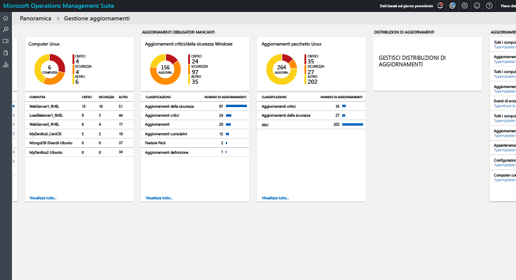
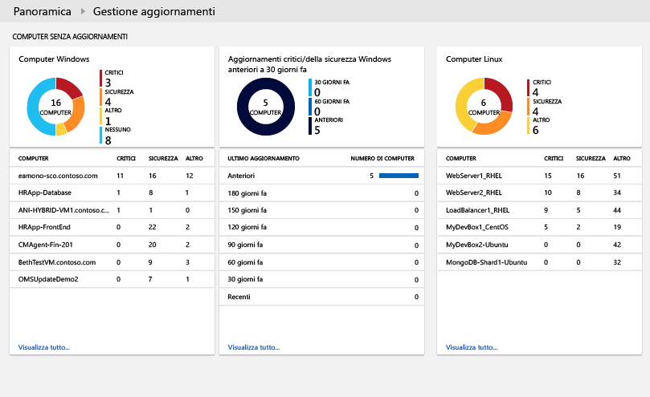
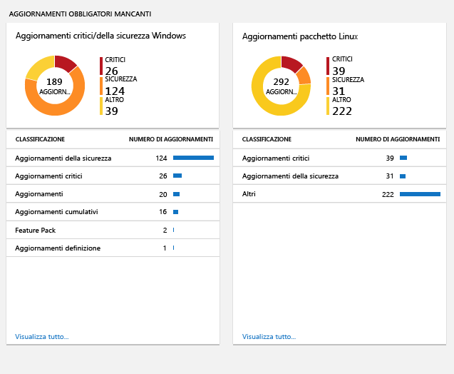
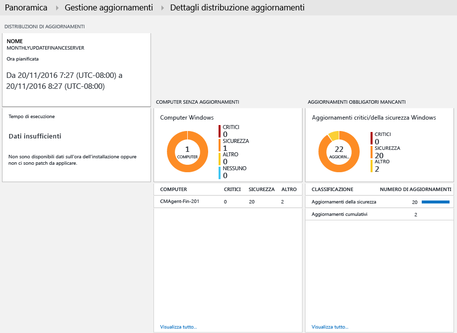

# Soluzione Gestione aggiornamenti in OMS
La soluzione Gestione aggiornamenti in OMS consente di gestire gli aggiornamenti per i computer Windows e Linux.  È possibile valutare rapidamente lo stato degli aggiornamenti disponibili in tutti i computer agente e avviare il processo di installazione degli aggiornamenti necessari per i server. 

## Prerequisiti
* Gli agenti Windows devono essere configurati per comunicare con un server Windows Server Update Services (WSUS) o avere accesso a Microsoft Update.  
  
  > [!NOTE]
  > L'agente Windows non può essere gestito contemporaneamente da System Center Configuration Manager.  
  > 
  > 
* Gli agenti Linux devono avere accesso a un repository degli aggiornamenti.  L'agente OMS per Linux può essere scaricato da [GitHub](https://github.com/microsoft/oms-agent-for-linux). 

## Configurazione
Eseguire questa procedura per aggiungere la soluzione Gestione aggiornamenti nell'area di lavoro di OMS e aggiungere gli agenti Linux. Gli agenti Windows vengono aggiunti automaticamente senza alcuna configurazione aggiuntiva.

> [!NOTE]
> Attualmente se si abilita questa soluzione, qualsiasi computer Windows connesso all'area di lavoro OMS verrà automaticamente configurato come ruolo di lavoro ibrido per runbook per supportare i runbook che fanno parte di questa soluzione.  Tuttavia, la soluzione non è registrata con tutti i gruppi del ruolo di lavoro ibrido creati nell'account di Automazione e non è possibile aggiungerla a un gruppo di lavoro ibrido per l'esecuzione dei runbook personalizzati.  Se un computer Windows è già definito come ruolo di lavoro ibrido per runbook e connesso all'area di lavoro OMS, è necessario rimuoverlo dall'area di lavoro OMS prima di aggiungere la soluzione per evitare che i runbook non funzionino come previsto.  

1. Aggiungere la soluzione Gestione aggiornamenti all'area di lavoro di OMS usando la procedura descritta in [Aggiungere soluzioni OMS](../log-analytics/log-analytics-add-solutions.md) nella raccolta soluzioni.  
2. Nel portale OMS selezionare **Impostazioni** e quindi **Origini connesse**.  Prendere nota del valore di **ID area di lavoro** e di **Chiave primaria** o **Chiave secondaria**.
3. Eseguire questa procedura per ogni computer Linux.
   
   a.    Installare la versione più recente dell'agente OMS per Linux usando i comandi seguenti.  Sostituire <Workspace ID> con l'ID area di lavoro e <Key> con la chiave primaria o secondaria.
   
        cd ~
        wget https://github.com/Microsoft/OMS-Agent-for-Linux/releases/download/v1.2.0-75/omsagent-1.2.0-75.universal.x64.sh  
        sudo bash omsagent-1.2.0-75.universal.x64.sh --upgrade -w <Workspace ID> -s <Key>

   b. Per rimuovere l'agente, usare il comando seguente.
   
        sudo bash omsagent-1.2.0-75.universal.x64.sh --purge

## Management Pack
Se il gruppo di gestione di System Center Operations Manager è connesso all'area di lavoro di OMS, in Operations Manager verranno installati i Management Pack seguenti quando si aggiunge questa soluzione. Per questi Management Pack non è richiesta alcuna configurazione o manutenzione. 

* Microsoft System Center Advisor Update Assessment Intelligence Pack (Microsoft.IntelligencePacks.UpdateAssessment)
* Microsoft.IntelligencePack.UpdateAssessment.Configuration (Microsoft.IntelligencePack.UpdateAssessment.Configuration)
* Update Deployment MP

Per altre informazioni sulla modalità di aggiornamento dei Management Pack, vedere [Connettere Operations Manager a Log Analytics](../log-analytics/log-analytics-om-agents.md).

## Raccolta dei dati
### Agenti supportati
La tabella seguente descrive le origini connesse che sono supportate da questa soluzione.

| Origine connessa | Supportato | Descrizione |
| --- | --- | --- |
| Agenti di Windows |Sì |La soluzione raccoglie informazioni sugli aggiornamenti del sistema dagli agenti Windows e avvia l'installazione degli aggiornamenti necessari. |
| Agenti Linux |Sì |La soluzione raccoglie informazioni sugli aggiornamenti del sistema dagli agenti Linux. |
| Gruppo di gestione di Operations Manager |Sì |La soluzione raccoglie informazioni sugli aggiornamenti del sistema dagli agenti in un gruppo di gestione connesso. Non è necessaria una connessione diretta dall'agente Operations Manager a Log Analytics. I dati vengono inoltrati dal gruppo di gestione al repository OMS. |
| Account di archiviazione di Azure |No |Archiviazione di Azure non include informazioni sugli aggiornamenti del sistema. |

### Frequenza della raccolta
Per ogni computer Windows gestito viene eseguita un'analisi due volte al giorno.  Quando viene installato un aggiornamento, le relative informazioni vengono aggiornate entro 15 minuti.  

Per ogni computer Linux gestito viene eseguita un'analisi ogni 3 ore.  

## Uso della soluzione
Quando si aggiunge la soluzione Gestione aggiornamenti all'area di lavoro di OMS, il riquadro **Gestione aggiornamenti** viene aggiunto al dashboard OMS. Il riquadro visualizza un conteggio e la rappresentazione grafica del numero di computer nell'ambiente che richiedono attualmente aggiornamenti del sistema.  
  

## Visualizzazione della valutazione degli aggiornamenti
Fare clic sul riquadro **Gestione aggiornamenti** per aprire il dashboard **Gestione aggiornamenti**. Il dashboard include le colonne nella tabella seguente. Ogni colonna elenca fino a dieci elementi corrispondenti ai criteri della colonna per l'ambito e l'intervallo di tempo specificati. È possibile eseguire una ricerca log per ottenere tutti i record facendo clic su **Vedi tutto** nella parte inferiore della colonna o facendo clic sull'intestazione di colonna.

| Colonna | Descrizione |
| --- | --- |
| **Computer con aggiornamenti mancanti** | |
| Aggiornamenti critici o della sicurezza |Elenca i primi dieci computer con aggiornamenti mancanti, ordinati in base al numero di aggiornamenti mancanti. Fare clic sul nome di un computer per eseguire una ricerca log e ottenere tutti i record di aggiornamento per quel computer. |
| Aggiornamenti critici o della sicurezza più vecchi di 30 giorni |Identifica il numero di computer con aggiornamenti critici o della sicurezza mancanti, raggruppati in base al tempo trascorso dalla pubblicazione dell'aggiornamento. Fare clic su una delle voci per eseguire una ricerca log e ottenere tutti gli aggiornamenti critici e mancanti. |
| **Aggiornamenti mancanti necessari** | |
| Aggiornamenti critici o della sicurezza |Elenca le classificazioni degli aggiornamenti mancanti nei computer, ordinati in base al numero di computer nei quali mancano gli aggiornamenti di quella categoria. Fare clic su una classificazione per eseguire una ricerca log e ottenere tutti i record di aggiornamento per quella classificazione. |
| **Distribuzioni di aggiornamento** | |
| Distribuzioni di aggiornamento |Numero di distribuzioni di aggiornamento attualmente pianificate e tempo mancante alla successiva esecuzione pianificata.  Fare clic sul riquadro per visualizzare gli aggiornamenti pianificati, in esecuzione e completati o per pianificare una nuova distribuzione. |

   
   
 
   
 
   

## Installazione degli aggiornamenti
Dopo aver valutato gli aggiornamenti per tutti i computer Windows nell'ambiente, è possibile installare gli aggiornamenti necessari creando una *distribuzione degli aggiornamenti*.  Una distribuzione degli aggiornamenti è un'installazione pianificata di aggiornamenti necessari per uno o più computer Windows.  Specificare la data e l'ora della distribuzione, oltre a un computer o gruppo di computer da includere.  

Gli aggiornamenti vengono installati da runbook in Automazione di Azure.  Questi runbook non richiedono alcuna configurazione e non possono essere attualmente visualizzati.  Quando si crea una distribuzione degli aggiornamenti, viene creata una pianificazione che avvia un runbook di aggiornamento master alla data e ora specificata per i computer inclusi.  Questo runbook master avvia un runbook figlio in ogni agente Windows che esegue l'installazione degli aggiornamenti necessari.  

### Visualizzazione delle distribuzioni degli aggiornamenti
Fare clic sul riquadro **Distribuzione aggiornamento** per visualizzare l'elenco delle distribuzioni degli aggiornamenti esistenti.  Le distribuzioni sono raggruppate per stato, ovvero **Pianificato**, **In esecuzione** e **Completato**.      

La tabella seguente descrive le proprietà visualizzate per ogni distribuzione degli aggiornamenti.

| Proprietà | Descrizione |
| --- | --- |
| Nome |Nome della distribuzione degli aggiornamenti. |
| Pianificazione |Tipo di pianificazione.  *Una sola volta* è attualmente l'unico valore possibile. |
| Ora di inizio |Data e ora pianificata per l'avvio della distribuzione degli aggiornamenti. |
| Durata |Numero di minuti consentiti per l'esecuzione della distribuzione degli aggiornamenti.  Se non tutti gli aggiornamenti vengono installati entro questo periodo di tempo, gli aggiornamenti rimanenti dovranno attendere la distribuzione successiva. |
| Server |Numero di computer interessati dalla distribuzione degli aggiornamenti. |
| Status |Stato corrente della distribuzione degli aggiornamenti.  I valori possibili sono: - Non avviato - In esecuzione - Operazione terminata |

Fare clic su una distribuzione degli aggiornamenti per visualizzare la schermata dei dettagli che include le colonne della tabella seguente.  Queste colonne non verranno popolate se la distribuzione degli aggiornamenti non è ancora iniziata. 

| Colonna | Description |
| --- | --- |
| **Risultati computer** | |
| Operazione completata |Elenca il numero di computer nella distribuzione degli aggiornamenti in base allo stato.  Fare clic su uno stato per eseguire una ricerca log e ottenere tutti i record di aggiornamento con tale stato per la distribuzione degli aggiornamenti. |
| Stato di installazione del computer |Elenca i computer interessati dalla distribuzione degli aggiornamenti e la percentuale degli aggiornamenti installati correttamente. Fare clic su una delle voci per eseguire una ricerca log e ottenere tutti gli aggiornamenti critici e mancanti. |
| **Risultati aggiornamento istanza** | |
| Stato di installazione dell'istanza |Elenca le classificazioni degli aggiornamenti mancanti nei computer, ordinati in base al numero di computer nei quali mancano gli aggiornamenti di quella categoria. Fare clic su un computer per eseguire una ricerca log e ottenere tutti i record di aggiornamento per quel computer. |

   

### Creazione di una distribuzione degli aggiornamenti
Creare una nuova distribuzione degli aggiornamenti facendo clic sul pulsante **Aggiungi** nella parte superiore della schermata per aprire la pagina **Nuova distribuzione aggiornamenti**.  È necessario specificare i valori per le proprietà nella tabella seguente.

| Proprietà | Descrizione |
| --- | --- |
| Nome |Nome univoco che identifica la distribuzione degli aggiornamenti. |
| Fuso orario |Fuso orario da usare per l'ora di inizio. |
| Ora di inizio |Data e ora di inizio della distribuzione degli aggiornamenti. |
| Durata |Numero di minuti consentiti per l'esecuzione della distribuzione degli aggiornamenti.  Se non tutti gli aggiornamenti vengono installati entro questo periodo di tempo, gli aggiornamenti rimanenti dovranno attendere la distribuzione successiva. |
| Computer |Nomi di computer o gruppi di computer da includere nella distribuzione degli aggiornamenti.  Selezionare una o più voci dall'elenco a discesa. |

   

### Intervallo di tempo
Per impostazione predefinita, l'ambito dei dati analizzati nella soluzione Gestione aggiornamenti riguarda tutti i gruppi di gestione connessi generati nell'ultimo giorno. 

Per modificare l'intervallo di tempo dei dati, selezionare **Dati basati su** nella parte superiore del dashboard. È possibile selezionare i record creati o aggiornati negli ultimi 7 giorni, nell'ultimo giorno o nelle ultime 6 ore. In alternativa, è possibile selezionare **Personalizzato** e specificare un intervallo di date personalizzato.     

## Record di Log Analytics
La soluzione Gestione aggiornamenti crea due tipi di record nel repository OMS.

### Record di aggiornamento
Viene creato un record di tipo **Aggiornamento** per ogni aggiornamento installato o necessario in ogni computer. I record di aggiornamento hanno le proprietà elencate nella tabella seguente.

| Proprietà | Descrizione |
| --- | --- |
| Tipo |*Aggiornamento* |
| SourceSystem |Origine che ha approvato l'installazione dell'aggiornamento. I valori possibili sono: - Microsoft Update - Windows Update - SCCM - Server Linux recuperati da Gestione pacchetti |
| Approved |Specifica se l'aggiornamento è stato approvato per l'installazione.  Per i server Linux è attualmente facoltativo perché l'applicazione di patch non è gestita da OMS. |
| Classificazione per Windows |Classificazione dell'aggiornamento. I valori possibili sono: - Applicazioni - Aggiornamenti critici - Aggiornamenti della definizione - Feature Pack - Aggiornamenti della sicurezza - Service Pack - Aggiornamenti cumulativi - Aggiornamenti |
| Classificazione per Linux |Classificazione dell'aggiornamento. I valori possibili sono: - Aggiornamenti critici - Aggiornamenti della sicurezza - Altri aggiornamenti |
| Computer |Nome del computer. |
| InstallTimeAvailable |Specifica se il tempo di installazione è disponibile in base agli altri agenti che hanno installato lo stesso aggiornamento. |
| InstallTimePredictionSeconds |Tempo di installazione stimato in secondi in base agli altri agenti che hanno installato lo stesso aggiornamento. |
| KBID |ID dell'articolo della Knowledge Base che descrive l'aggiornamento. |
| ManagementGroupName |Nome del gruppo di gestione per gli agenti SCOM.  Per gli altri agenti corrisponde a AOI-<workspace ID>. |
| MSRCBulletinID |ID del bollettino Microsoft sulla sicurezza che descrive l'aggiornamento. |
| MSRCSeverity |Gravità del bollettino Microsoft sulla sicurezza. I valori possibili sono: - Critico - Importante - Moderato |
| Facoltativo |Specifica se l'aggiornamento è facoltativo. |
| Prodotto |Nome del prodotto a cui è destinato l'aggiornamento.  Fare clic su **Visualizza** per aprire l'articolo in un browser. |
| PackageSeverity |Gravità della vulnerabilità risolta in questo aggiornamento, indicata dai fornitori della distribuzione Linux. |
| PublishDate |Data e ora di installazione dell'aggiornamento. |
| RebootBehavior |Specifica se l'aggiornamento forza un riavvio. I valori possibili sono: - canrequestreboot - neverreboots |
| RevisionNumber |Numero di revisione dell'aggiornamento. |
| SourceComputerId |GUID che identifica il computer in modo univoco. |
| TimeGenerated |Data e ora dell'ultimo aggiornamento del record. |
| Titolo |Titolo dell'aggiornamento. |
| UpdateID |GUID che identifica l'aggiornamento in modo univoco. |
| UpdateState |Specifica se l'aggiornamento è installato nel computer. I valori possibili sono: - Installato: l'aggiornamento è installato nel computer. - Necessario: l'aggiornamento non è installato ed è necessario nel computer. |

 
Quando si esegue una ricerca log che restituisce record di tipo **Aggiornamento**, è possibile selezionare la visualizzazione **Aggiornamenti** che presenta una serie di riquadri di riepilogo degli aggiornamenti restituiti dalla ricerca. È possibile fare clic sulle voci nei riquadri **Aggiornamenti mancanti e applicati** e **Aggiornamenti obbligatori e facoltativi** per definire l'ambito della visualizzazione del set di aggiornamenti. Selezionare la visualizzazione **Elenco** o **Tabella** per ottenere i singoli record.  

  

Nella visualizzazione **Tabella** è possibile fare clic sull'**ID KB** di un record per aprire un browser con l'articolo della Knowledge Base. Ciò consente di vedere rapidamente i dettagli dell'aggiornamento specifico.  

Nella visualizzazione **Elenco**, fare clic sul collegamento **Visualizza** accanto all'ID KB per visualizzare l'articolo della Knowledge Base. 

### UpdateSummary records
Viene creato un record di tipo **UpdateSummary** per ogni computer agente Windows. Questo record viene aggiornato ogni volta che il computer viene analizzato per verificare la disponibilità di aggiornamenti. I record **UpdateSummary** hanno le proprietà elencate nella tabella seguente.

| Proprietà | Descrizione |
| --- | --- |
| Tipo |UpdateSummary |
| SourceSystem |OpsManager |
| Computer |Nome del computer. |
| CriticalUpdatesMissing |Numero di aggiornamenti critici mancanti nel computer. |
| ManagementGroupName |Nome del gruppo di gestione per gli agenti SCOM. Per gli altri agenti corrisponde a AOI-<workspace ID>. |
| NETRuntimeVersion |Versione del runtime .NET installato nel computer. |
| OldestMissingSecurityUpdateBucket |Bucket che classifica il tempo trascorso dalla pubblicazione dell'aggiornamento della sicurezza mancante meno recente. I valori possibili sono: - Meno recente - 180 giorni fa - 150 giorni fa - 120 giorni fa - 90 giorni fa - 60 giorni fa - 30 giorni fa - Recente |
| OldestMissingSecurityUpdateInDays |Numero di giorni trascorsi dalla pubblicazione dell'aggiornamento della sicurezza mancante meno recente per questo computer. |
| OsVersion |Versione del sistema operativo installato nel computer. |
| OtherUpdatesMissing |Numero degli altri aggiornamenti mancanti nel computer. |
| SecurityUpdatesMissing |Numero degli aggiornamenti della sicurezza mancanti nel computer. |
| SourceComputerId |GUID che identifica il computer in modo univoco. |
| TimeGenerated |Data e ora dell'ultimo aggiornamento del record. |
| TotalUpdatesMissing |Numero totale degli aggiornamenti mancanti nel computer. |
| WindowsUpdateAgentVersion |Numero di versione dell'agente di Windows Update nel computer. |
| WindowsUpdateSetting |Impostazione della modalità di installazione degli aggiornamenti importanti nel computer. I valori possibili sono: - Disabilitato - Notifica prima dell'installazione - Installazione pianificata |
| WSUSServer |URL del server WSUS se il computer è configurato per l'uso di un server WSUS. |

## Ricerche di log di esempio
La tabella seguente contiene esempi di ricerche log per i record di aggiornamento raccolti da questa soluzione. 

| Query | Descrizione |
| --- | --- |
| Tutti i computer con aggiornamenti mancanti |Type=Update UpdateState=Needed Optional=false &#124; select Computer,Title,KBID,Classification,UpdateSeverity,PublishedDate |
| Missing updates for computer "COMPUTER01.contoso.com" (sostituire con il nome del computer) |Type=Update UpdateState=Needed Optional=false Computer="COMPUTER01.contoso.com" &#124; select Computer,Title,KBID,Product,UpdateSeverity,PublishedDate |
| Tutti i computer con aggiornamenti critici o della sicurezza mancanti |Type=Update UpdateState=Needed Optional=false (Classification="Security Updates" OR Classification="Critical Updates") |
| Aggiornamenti critici o della sicurezza necessari nei computer in cui gli aggiornamenti vengono applicati manualmente |Type=Update UpdateState=Needed Optional=false (Classification="Security Updates" OR Classification="Critical Updates") Computer IN {Type=UpdateSummary WindowsUpdateSetting=Manual &#124; Distinct Computer} &#124; Distinct KBID |
| Eventi di errore per computer con aggiornamenti critici o della sicurezza necessari mancanti |Type=Event EventLevelName=error Computer IN {Type=Update (Classification="Security Updates" OR Classification="Critical Updates") UpdateState=Needed Optional=false &#124; Distinct Computer} |
| Tutti i computer con aggiornamenti cumulativi mancanti |Type=Update Optional=false Classification="Update Rollups" UpdateState=Needed &#124; select Computer,Title,KBID,Classification,UpdateSeverity,PublishedDate |
| Aggiornamenti distinti mancanti tra tutti i computer |Type=Update UpdateState=Needed Optional=false &#124; Distinct Title |
| Appartenenza computer WSUS |Type=UpdateSummary &#124; measure count() by WSUSServer |
| Configurazione dell'aggiornamento automatico |Type=UpdateSummary &#124; measure count() by WindowsUpdateSetting |
| Computer con aggiornamento automatico disabilitato |Type=UpdateSummary WindowsUpdateSetting=Manual |
| Elenco di tutti i computer Linux con un aggiornamento pacchetto disponibile |Type=Update and OSType=Linux and UpdateState!="Not needed" &#124; measure count() by Computer |
| Elenco di tutti i computer Linux con un aggiornamento pacchetto critico o della sicurezza disponibile |Type=Update and OSType=Linux and UpdateState!="Not needed" and (Classification="Critical Updates" OR Classification="Security Updates") &#124; measure count() by Computer |
| Elenco di tutti i pacchetti con un aggiornamento disponibile |Type=Update and OSType=Linux and UpdateState!="Not needed" |
| Elenco di tutti i pacchetti con un aggiornamento critico o della sicurezza disponibile |Type=Update  and OSType=Linux and UpdateState!="Not needed" and (Classification="Critical Updates" OR Classification="Security Updates") |
| Elenco di tutti i computer "Ubuntu" con aggiornamenti disponibili |Type=Update and OSType=Linux and OSName = Ubuntu &#124; measure count() by Computer |

## Passaggi successivi
* Usare le ricerche log in [Log Analytics](../log-analytics/log-analytics-log-searches.md) per visualizzare dati dettagliati sugli aggiornamenti.
* [Creare dashboard personalizzati](../log-analytics/log-analytics-dashboards.md) che indicano la conformità degli aggiornamenti per i computer gestiti.
* [Creare avvisi](../log-analytics/log-analytics-alerts.md) quando aggiornamenti critici vengono rilevati come mancanti nei computer oppure quando gli aggiornamenti automatici sono disabilitati per un computer.  

<!--HONumber=Dec16_HO1-->

