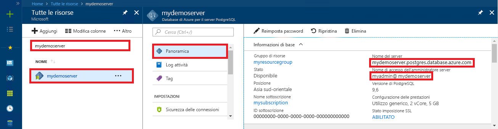

# <a name="azure-database-for-postgresql-use-net-c-to-connect-and-query-data"></a>Database di Azure per PostgreSQL: usare .NET (C#) per connettersi ai dati ed eseguire query
Questa guida introduttiva illustra come connettersi a un database di Azure per PostgreSQL usando un'applicazione C#. Spiega come usare le istruzioni SQL per eseguire query, inserire, aggiornare ed eliminare dati nel database. Le procedure descritte in questo articolo presuppongono che si abbia familiarità con lo sviluppo con C#, ma non con Database di Azure per PostgreSQL.

## <a name="prerequisites"></a>Prerequisiti
Questa guida introduttiva usa le risorse create in una delle guide seguenti come punto di partenza:
- [Creare un database: portale](quickstart-create-server-database-portal.md)
- [Creare un database: interfaccia della riga di comando](quickstart-create-server-database-azure-cli.md)

È anche necessario:
- Installare [.NET Framework](https://www.microsoft.com/net/download)
- Installare [Visual Studio](https://www.visualstudio.com/downloads/)
- Installare [Npgsql](http://www.npgsql.org/doc/index.html) 

## <a name="install-visual-studio-and-net"></a>Installare Visual Studio e .NET
La procedura descritta in questa sezione presuppone che si abbia familiarità con lo sviluppo con .NET.

### <a name="windows-net-framework-and-net-core"></a>**Windows .NET Framework e .NET Core**
Visual Studio 2017 Community è un IDE gratuito, con funzionalità complete ed estendibile per creare applicazioni moderne per Android, iOS, Windows, oltre ad applicazioni Web e database e servizi cloud. È possibile installare solo la versione completa di .NET Framework o solamente .NET Core. I frammenti di codice nella guida introduttiva sono compatibili con entrambe le versioni. Se Visual Studio è già installato nel computer, ignorare i passaggi successivi.

1. Scaricare il [programma di installazione di Visual Studio 2017](https://www.visualstudio.com/thank-you-downloading-visual-studio/?sku=Community&rel=15). 
2. Eseguire il programma di installazione e seguire le richieste di installazione per completare l'operazione.

### <a name="mac-os"></a>**Mac OS**
Aprire il terminale in uso e passare alla directory in cui si prevede di creare il progetto .NET Core. Immettere i comandi seguenti per installare **brew**, **OpenSSL** e **.NET Core**. 

```bash
ruby -e "$(curl -fsSL https://raw.githubusercontent.com/Homebrew/install/master/install)"
brew update
brew install openssl
mkdir -p /usr/local/lib
ln -s /usr/local/opt/openssl/lib/libcrypto.1.0.0.dylib /usr/local/lib/
ln -s /usr/local/opt/openssl/lib/libssl.1.0.0.dylib /usr/local/lib/
```

Installare .NET Core in macOS. Scaricare il [programma di installazione ufficiale](https://go.microsoft.com/fwlink/?linkid=843444). Il programma di installazione installa gli strumenti e li inserisce nella posizione specificata da PATH, per consentire di eseguire dotnet dalla console.

### <a name="linux-ubuntu"></a>**Linux (Ubuntu)**
Aprire il terminale in uso e passare alla directory in cui si prevede di creare il progetto .NET Core. Immettere i comandi seguenti per installare **.NET Core**.

```bash
sudo sh -c 'echo "deb [arch=amd64] https://apt-mo.trafficmanager.net/repos/dotnet-release/ xenial main" > /etc/apt/sources.list.d/dotnetdev.list'
sudo apt-key adv --keyserver hkp://keyserver.ubuntu.com:80 --recv-keys 417A0893
sudo apt-get update
sudo apt-get install dotnet-dev-1.0.1
```

## <a name="install-npgsql-references-into-your-visual-studio-solution"></a>Installare i riferimenti Npgsql nella soluzione di Visual Studio
Per stabilire la connessione dall'applicazione C# a PostgreSQL, usare la libreria open source ADO.NET denominata Npgsql. NuGet consente di scaricare e gestire facilmente i riferimenti.

1. Creare una nuova soluzione C# o aprirne una esistente: 
   - In Visual Studio creare una soluzione scegliendo **Nuovo** > **Progetto** dal menu File.
   - Nella finestra di dialogo Nuovo progetto espandere **Modelli** > **Visual C#**. 
   - Scegliere un modello appropriato, ad esempio **Console App (.NET Core)** (App console - .NET Core).

2. Usare Gestione pacchetti NuGet per installare Npgsql:
   - Scegliere **Gestione pacchetti NuGet** dal menu **Strumenti** > **Console di Gestione pacchetti**.
   - In **Console di Gestione pacchetti** digitare `Install-Package Npgsql`
   - Il comando di installazione scarica Npgsql.dll e gli assembly correlati e li aggiunge come dipendenze nella soluzione.

## <a name="get-connection-information"></a>Ottenere informazioni di connessione
Ottenere le informazioni di connessione necessarie per connettersi al database di Azure per PostgreSQL. Sono necessari il nome del server completo e le credenziali di accesso.

1. Accedere al [Portale di Azure](https://portal.azure.com/).
2. Nel menu a sinistra nel portale di Azure fare clic su **Tutte le risorse** e cercare il server creato, ad esempio **mypgserver-20170401**.
3. Fare clic sul nome del server **mypgserver-20170401**.
4. Selezionare la pagina **Panoramica** del server. Annotare il **Nome server** e il **nome di accesso dell'amministratore del server**.
 
5. Se si dimenticano le informazioni di accesso per il server, passare alla pagina **Panoramica** per visualizzare il nome di accesso dell'amministratore del server e, se necessario, reimpostare la password.

## <a name="connect-create-table-and-insert-data"></a>Connettersi, creare tabelle e inserire dati
Usare il codice seguente per connettersi e caricare i dati usando le istruzioni SQL **CREATE TABLE** e **INSERT INTO**. Il codice usa la classe NpgsqlCommand con il metodo [Open()](http://www.npgsql.org/api/Npgsql.NpgsqlConnection.html#Npgsql_NpgsqlConnection_Open) per stabilire una connessione a PostgreSQL. Il codice usa quindi il metodo [CreateCommand()](http://www.npgsql.org/api/Npgsql.NpgsqlConnection.html#Npgsql_NpgsqlConnection_CreateCommand), imposta la proprietà CommandText e chiama il metodo [ExecuteNonQuery()](http://www.npgsql.org/api/Npgsql.NpgsqlCommand.html#Npgsql_NpgsqlCommand_ExecuteNonQuery) per eseguire i comandi di database. 

Sostituire i parametri Host, DBName, User e Password con i valori specificati al momento della creazione del server e del database. 

```csharp
using System;
using System.Collections.Generic;
using System.Linq;
using System.Text;
using System.Threading.Tasks;
using Npgsql;

namespace Driver
{
    public class AzurePostgresCreate
    {
        // Obtain connection string information from the portal
        //
        private static string Host = "mypgserver-20170401.postgres.database.azure.com";
        private static string User = "mylogin@mypgserver-20170401";
        private static string DBname = "mypgsqldb";
        private static string Password = "<server_admin_password>";
        private static string Port = "5432";

        static void Main(string[] args)
        {
            // Build connection string using parameters from portal
            //
            string connString =
                String.Format(
                    "Server={0}; User Id={1}; Database={2}; Port={3}; Password={4}; SSL Mode=Prefer; Trust Server Certificate=true",
                    Host,
                    User,
                    DBname,
                    Port,
                    Password);

            var conn = new NpgsqlConnection(connString);

            Console.Out.WriteLine("Opening connection");
            conn.Open();

            var command = conn.CreateCommand();
            command.CommandText = "DROP TABLE IF EXISTS inventory;";
            command.ExecuteNonQuery();
            Console.Out.WriteLine("Finished dropping table (if existed)");

            command.CommandText = "CREATE TABLE inventory (id serial PRIMARY KEY, name VARCHAR(50), quantity INTEGER);";
            command.ExecuteNonQuery();
            Console.Out.WriteLine("Finished creating table");

            command.CommandText =
                String.Format(
                    @"
                                INSERT INTO inventory (name, quantity) VALUES ({0}, {1});
                                INSERT INTO inventory (name, quantity) VALUES ({2}, {3});
                                INSERT INTO inventory (name, quantity) VALUES ({4}, {5});
                            ",
                    "\'banana\'", 150,
                    "\'orange\'", 154,
                    "\'apple\'", 100
                    );

            int nRows = command.ExecuteNonQuery();
            Console.Out.WriteLine(String.Format("Number of rows inserted={0}", nRows));

            Console.Out.WriteLine("Closing connection");
            conn.Close();

            Console.WriteLine("Press RETURN to exit");
            Console.ReadLine();
        }
    }
}
```

## <a name="read-data"></a>Leggere i dati
Usare il codice seguente per connettersi e leggere i dati usando un'istruzione SQL **SELECT**. Il codice usa la classe NpgsqlCommand con il metodo [Open()](http://www.npgsql.org/api/Npgsql.NpgsqlConnection.html#Npgsql_NpgsqlConnection_Open) per stabilire una connessione a PostgreSQL. Il codice usa quindi il metodo [CreateCommand()](http://www.npgsql.org/api/Npgsql.NpgsqlConnection.html#Npgsql_NpgsqlConnection_CreateCommand) e il metodo [ExecuteReader()](http://www.npgsql.org/api/Npgsql.NpgsqlCommand.html#Npgsql_NpgsqlCommand_ExecuteReader) per eseguire i comandi di database. Il codice usa poi [Read()](http://www.npgsql.org/api/Npgsql.NpgsqlDataReader.html#Npgsql_NpgsqlDataReader_Read) per passare ai record nei risultati. Il codice usa quindi [GetInt32()](http://www.npgsql.org/api/Npgsql.NpgsqlDataReader.html#Npgsql_NpgsqlDataReader_GetInt32_System_Int32_) e [GetString()](http://www.npgsql.org/api/Npgsql.NpgsqlDataReader.html#Npgsql_NpgsqlDataReader_GetString_System_Int32_) per analizzare i valori nel record.

Sostituire i parametri Host, DBName, User e Password con i valori specificati al momento della creazione del server e del database. 

```csharp
using System;
using System.Collections.Generic;
using System.Linq;
using System.Text;
using System.Threading.Tasks;
using Npgsql;

namespace Driver
{
    public class AzurePostgresRead
    {
        // Obtain connection string information from the portal
        //
        private static string Host = "mypgserver-20170401.postgres.database.azure.com";
        private static string User = "mylogin@mypgserver-20170401";
        private static string DBname = "mypgsqldb";
        private static string Password = "<server_admin_password>";
        private static string Port = "5432";

        static void Main(string[] args)
        {
            // Build connection string using parameters from portal
            //
            string connString =
                String.Format(
                    "Server={0}; User Id={1}; Database={2}; Port={3}; Password={4};",
                    Host,
                    User,
                    DBname,
                    Port,
                    Password);

            var conn = new NpgsqlConnection(connString);

            Console.Out.WriteLine("Opening connection");
            conn.Open();

            var command = conn.CreateCommand();
            command.CommandText = "SELECT * FROM inventory;";

            var reader = command.ExecuteReader();
            while (reader.Read())
            {
                Console.WriteLine(
                    string.Format(
                        "Reading from table=({0}, {1}, {2})",
                        reader.GetInt32(0).ToString(),
                        reader.GetString(1),
                        reader.GetInt32(2).ToString()
                        )
                    );
            }

            Console.Out.WriteLine("Closing connection");
            conn.Close();

            Console.WriteLine("Press RETURN to exit");
            Console.ReadLine();
        }
    }
}
```


## <a name="update-data"></a>Aggiornare i dati
Usare il codice seguente per connettersi e leggere i dati usando un'istruzione SQL **UPDATE**. Il codice usa la classe NpgsqlCommand con il metodo [Open()](http://www.npgsql.org/api/Npgsql.NpgsqlConnection.html#Npgsql_NpgsqlConnection_Open) per stabilire una connessione a PostgreSQL. Il codice usa quindi il metodo [CreateCommand()](http://www.npgsql.org/api/Npgsql.NpgsqlConnection.html#Npgsql_NpgsqlConnection_CreateCommand), imposta la proprietà CommandText e chiama il metodo [ExecuteNonQuery()](http://www.npgsql.org/api/Npgsql.NpgsqlCommand.html#Npgsql_NpgsqlCommand_ExecuteNonQuery) per eseguire i comandi di database.

Sostituire i parametri Host, DBName, User e Password con i valori specificati al momento della creazione del server e del database. 

```csharp
using System;
using System.Collections.Generic;
using System.Linq;
using System.Text;
using System.Threading.Tasks;
using Npgsql;

namespace Driver
{
    public class AzurePostgresUpdate
    {
        // Obtain connection string information from the portal
        //
        private static string Host = "mypgserver-20170401.postgres.database.azure.com";
        private static string User = "mylogin@mypgserver-20170401";
        private static string DBname = "mypgsqldb";
        private static string Password = "<server_admin_password>";
        private static string Port = "5432";

        static void Main(string[] args)
        {
            // Build connection string using parameters from portal
            //
            string connString =
                String.Format(
                    "Server={0}; User Id={1}; Database={2}; Port={3}; Password={4};",
                    Host,
                    User,
                    DBname,
                    Port,
                    Password);

            var conn = new NpgsqlConnection(connString);

            Console.Out.WriteLine("Opening connection");
            conn.Open();

            var command = conn.CreateCommand();
            command.CommandText =
            String.Format("UPDATE inventory SET quantity = {0} WHERE name = {1};",
                200,
                "\'banana\'"
                );

            int nRows = command.ExecuteNonQuery();
            Console.Out.WriteLine(String.Format("Number of rows updated={0}", nRows));

            Console.Out.WriteLine("Closing connection");
            conn.Close();

            Console.WriteLine("Press RETURN to exit");
            Console.ReadLine();
        }
    }
}
```


## <a name="delete-data"></a>Eliminare i dati
Usare il codice seguente per connettersi e leggere i dati usando un'istruzione SQL **DELETE**. 

 Il codice usa la classe NpgsqlCommand con il metodo [Open()](http://www.npgsql.org/api/Npgsql.NpgsqlConnection.html#Npgsql_NpgsqlConnection_Open) per stabilire una connessione a PostgreSQL. Il codice usa quindi il metodo [CreateCommand()](http://www.npgsql.org/api/Npgsql.NpgsqlConnection.html#Npgsql_NpgsqlConnection_CreateCommand), imposta la proprietà CommandText e chiama il metodo [ExecuteNonQuery()](http://www.npgsql.org/api/Npgsql.NpgsqlCommand.html#Npgsql_NpgsqlCommand_ExecuteNonQuery) per eseguire i comandi di database.

Sostituire i parametri Host, DBName, User e Password con i valori specificati al momento della creazione del server e del database. 

```csharp
using System;
using System.Collections.Generic;
using System.Linq;
using System.Text;
using System.Threading.Tasks;
using Npgsql;

namespace Driver
{
    public class AzurePostgresDelete
    {
        // Obtain connection string information from the portal
        //
        private static string Host = "mypgserver-20170401.postgres.database.azure.com";
        private static string User = "mylogin@mypgserver-20170401";
        private static string DBname = "mypgsqldb";
        private static string Password = "<server_admin_password>";
        private static string Port = "5432";

        static void Main(string[] args)
        {
            // Build connection string using parameters from portal
            //
            string connString =
                String.Format(
                    "Server={0}; User Id={1}; Database={2}; Port={3}; Password={4};",
                    Host,
                    User,
                    DBname,
                    Port,
                    Password);

            var conn = new NpgsqlConnection(connString);

            Console.Out.WriteLine("Opening connection");
            conn.Open();

            var command = conn.CreateCommand();
            command.CommandText =
            String.Format("DELETE FROM inventory WHERE name = {0};",
                "\'orange\'");
            int nRows = command.ExecuteNonQuery();
            Console.Out.WriteLine(String.Format("Number of rows deleted={0}", nRows));

            Console.Out.WriteLine("Closing connection");
            conn.Close();

            Console.WriteLine("Press RETURN to exit");
            Console.ReadLine();
        }
    }
}
```

## <a name="next-steps"></a>Passaggi successivi
> [!div class="nextstepaction"]
> [Eseguire la migrazione del database usando le funzionalità di esportazione e importazione](./howto-migrate-using-export-and-import.md)

