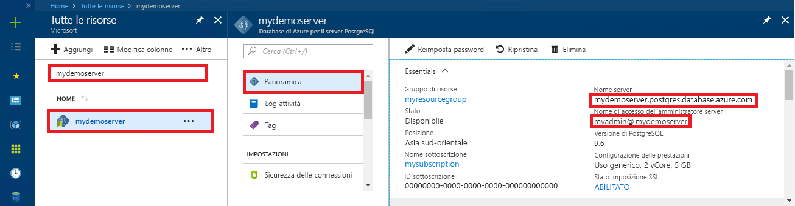

# <a name="quickstart-use-java-to-connect-to-and-query-data-in-azure-database-for-postgresql---single-server"></a>Guida introduttiva: Usare Java per connettersi ed eseguire query sui dati in Database di Azure per PostgreSQL - Server singolo
Questa guida introduttiva illustra come connettersi a un database di Azure per PostgreSQL usando un'applicazione Java. Spiega come usare le istruzioni SQL per eseguire query, inserire, aggiornare ed eliminare dati nel database. Le procedure descritte in questo articolo presuppongono che si abbia familiarità con lo sviluppo con Java, ma non con Database di Azure per PostgreSQL.

## <a name="prerequisites"></a>Prerequisiti
Questa guida introduttiva usa le risorse create in una delle guide seguenti come punto di partenza:
- [Creare un database: portale](quickstart-create-server-database-portal.md)
- [Creare un database: interfaccia della riga di comando di Azure](quickstart-create-server-database-azure-cli.md)

È anche necessario:
- Scaricare il [driver JDBC PostgreSQL](https://jdbc.postgresql.org/download.html) corrispondente alla versione di Java e Java Development Kit.
- Includere il file JAR JDBC PostgreSQL (ad esempio postgresql-42.1.1.jar) nel classpath dell'applicazione. Per altre informazioni, vedere i [dettagli sul classpath](https://jdbc.postgresql.org/documentation/head/classpath.html).

## <a name="get-connection-information"></a>Ottenere informazioni di connessione
Ottenere le informazioni di connessione necessarie per connettersi al database di Azure per PostgreSQL. Sono necessari il nome del server completo e le credenziali di accesso.

1. Accedere al [Portale di Azure](https://portal.azure.com/).
2. Dal menu a sinistra nel portale di Azure scegliere **Tutte le risorse** e quindi cercare il server creato, ad esempio **mydemoserver**.
3. Selezionare il nome del server.
4. Nel pannello **Panoramica** del server prendere nota dei valori riportati in **Nome server** e **Nome di accesso dell'amministratore server**. Se si dimentica la password, in questo pannello è anche possibile reimpostarla.
 

## <a name="connect-create-table-and-insert-data"></a>Connettersi, creare tabelle e inserire dati
Usare il codice seguente per connettersi e caricare i dati nel database usando la funzione con un'istruzione SQL **INSERT**. I metodi [getConnection()](https://www.postgresql.org/docs/7.4/static/jdbc-use.html), [createStatement()](https://jdbc.postgresql.org/documentation/head/query.html) ed [executeQuery()](https://jdbc.postgresql.org/documentation/head/query.html) vengono usati per connettersi al database ed eliminare e creare la tabella. L'oggetto [prepareStatement](https://jdbc.postgresql.org/documentation/head/query.html) viene usato per compilare i comandi di inserimento, con setString() e setInt() per associare i valori dei parametri. Il metodo [executeUpdate()](https://jdbc.postgresql.org/documentation/head/update.html) esegue il comando per ogni set di parametri. 

Sostituire i parametri host, database, user e password con i valori specificati al momento della creazione del server e del database.

```java
import java.sql.*;
import java.util.Properties;

public class CreateTableInsertRows {

    public static void main (String[] args)  throws Exception
    {

        // Initialize connection variables.
        String host = "mydemoserver.postgres.database.azure.com";
        String database = "mypgsqldb";
        String user = "mylogin@mydemoserver";
        String password = "<server_admin_password>";

        // check that the driver is installed
        try
        {
            Class.forName("org.postgresql.Driver");
        }
        catch (ClassNotFoundException e)
        {
            throw new ClassNotFoundException("PostgreSQL JDBC driver NOT detected in library path.", e);
        }

        System.out.println("PostgreSQL JDBC driver detected in library path.");

        Connection connection = null;

        // Initialize connection object
        try
        {
            String url = String.format("jdbc:postgresql://%s/%s", host, database);
            
            // set up the connection properties
            Properties properties = new Properties();
            properties.setProperty("user", user);
            properties.setProperty("password", password);
            properties.setProperty("ssl", "true");

            // get connection
            connection = DriverManager.getConnection(url, properties);
        }
        catch (SQLException e)
        {
            throw new SQLException("Failed to create connection to database.", e);
        }
        if (connection != null) 
        { 
            System.out.println("Successfully created connection to database.");
        
            // Perform some SQL queries over the connection.
            try
            {
                // Drop previous table of same name if one exists.
                Statement statement = connection.createStatement();
                statement.execute("DROP TABLE IF EXISTS inventory;");
                System.out.println("Finished dropping table (if existed).");
    
                // Create table.
                statement.execute("CREATE TABLE inventory (id serial PRIMARY KEY, name VARCHAR(50), quantity INTEGER);");
                System.out.println("Created table.");
    
                // Insert some data into table.
                int nRowsInserted = 0;
                PreparedStatement preparedStatement = connection.prepareStatement("INSERT INTO inventory (name, quantity) VALUES (?, ?);");
                preparedStatement.setString(1, "banana");
                preparedStatement.setInt(2, 150);
                nRowsInserted += preparedStatement.executeUpdate();

                preparedStatement.setString(1, "orange");
                preparedStatement.setInt(2, 154);
                nRowsInserted += preparedStatement.executeUpdate();

                preparedStatement.setString(1, "apple");
                preparedStatement.setInt(2, 100);
                nRowsInserted += preparedStatement.executeUpdate();
                System.out.println(String.format("Inserted %d row(s) of data.", nRowsInserted));
    
                // NOTE No need to commit all changes to database, as auto-commit is enabled by default.
    
            }
            catch (SQLException e)
            {
                throw new SQLException("Encountered an error when executing given sql statement.", e);
            }       
        }
        else {
            System.out.println("Failed to create connection to database.");
        }
        System.out.println("Execution finished.");
    }
}
```

## <a name="read-data"></a>Leggere i dati
Usare il codice seguente per leggere i dati con un'istruzione SQL **SELECT**. I metodi [getConnection()](https://www.postgresql.org/docs/7.4/static/jdbc-use.html), [createStatement()](https://jdbc.postgresql.org/documentation/head/query.html) ed [executeQuery()](https://jdbc.postgresql.org/documentation/head/query.html) vengono usati per connettersi al database, creare ed eseguire l'istruzione select. I risultati vengono elaborati usando un oggetto [ResultSet](https://www.postgresql.org/docs/7.4/static/jdbc-query.html). 

Sostituire i parametri host, database, user e password con i valori specificati al momento della creazione del server e del database.

```java
import java.sql.*;
import java.util.Properties;

public class ReadTable {

    public static void main (String[] args)  throws Exception
    {

        // Initialize connection variables.
        String host = "mydemoserver.postgres.database.azure.com";
        String database = "mypgsqldb";
        String user = "mylogin@mydemoserver";
        String password = "<server_admin_password>";

        // check that the driver is installed
        try
        {
            Class.forName("org.postgresql.Driver");
        }
        catch (ClassNotFoundException e)
        {
            throw new ClassNotFoundException("PostgreSQL JDBC driver NOT detected in library path.", e);
        }

        System.out.println("PostgreSQL JDBC driver detected in library path.");

        Connection connection = null;

        // Initialize connection object
        try
        {
            String url = String.format("jdbc:postgresql://%s/%s", host, database);
            
            // set up the connection properties
            Properties properties = new Properties();
            properties.setProperty("user", user);
            properties.setProperty("password", password);
            properties.setProperty("ssl", "true");

            // get connection
            connection = DriverManager.getConnection(url, properties);
        }
        catch (SQLException e)
        {
            throw new SQLException("Failed to create connection to database.", e);
        }
        if (connection != null) 
        { 
            System.out.println("Successfully created connection to database.");
        
            // Perform some SQL queries over the connection.
            try
            {
    
                Statement statement = connection.createStatement();
                ResultSet results = statement.executeQuery("SELECT * from inventory;");
                while (results.next())
                {
                    String outputString = 
                        String.format(
                            "Data row = (%s, %s, %s)",
                            results.getString(1),
                            results.getString(2),
                            results.getString(3));
                    System.out.println(outputString);
                }
            }
            catch (SQLException e)
            {
                throw new SQLException("Encountered an error when executing given sql statement.", e);
            }       
        }
        else {
            System.out.println("Failed to create connection to database.");
        }
        System.out.println("Execution finished.");
    }
}

```

## <a name="update-data"></a>Aggiornare i dati
Usare il codice seguente per modificare i dati con un'istruzione SQL **UPDATE**. I metodi[getConnection()](https://www.postgresql.org/docs/7.4/static/jdbc-use.html), [prepareStatement()](https://jdbc.postgresql.org/documentation/head/query.html) ed [executeUpdate()](https://jdbc.postgresql.org/documentation/head/update.html) vengono usati per connettersi al database, preparare ed eseguire l'istruzione update. 

Sostituire i parametri host, database, user e password con i valori specificati al momento della creazione del server e del database.

```java
import java.sql.*;
import java.util.Properties;

public class UpdateTable {
    public static void main (String[] args)  throws Exception
    {

        // Initialize connection variables.
        String host = "mydemoserver.postgres.database.azure.com";
        String database = "mypgsqldb";
        String user = "mylogin@mydemoserver";
        String password = "<server_admin_password>";

        // check that the driver is installed
        try
        {
            Class.forName("org.postgresql.Driver");
        }
        catch (ClassNotFoundException e)
        {
            throw new ClassNotFoundException("PostgreSQL JDBC driver NOT detected in library path.", e);
        }

        System.out.println("PostgreSQL JDBC driver detected in library path.");

        Connection connection = null;

        // Initialize connection object
        try
        {
            String url = String.format("jdbc:postgresql://%s/%s", host, database);
            
            // set up the connection properties
            Properties properties = new Properties();
            properties.setProperty("user", user);
            properties.setProperty("password", password);
            properties.setProperty("ssl", "true");

            // get connection
            connection = DriverManager.getConnection(url, properties);
        }
        catch (SQLException e)
        {
            throw new SQLException("Failed to create connection to database.", e);
        }
        if (connection != null) 
        { 
            System.out.println("Successfully created connection to database.");
        
            // Perform some SQL queries over the connection.
            try
            {
                // Modify some data in table.
                int nRowsUpdated = 0;
                PreparedStatement preparedStatement = connection.prepareStatement("UPDATE inventory SET quantity = ? WHERE name = ?;");
                preparedStatement.setInt(1, 200);
                preparedStatement.setString(2, "banana");
                nRowsUpdated += preparedStatement.executeUpdate();
                System.out.println(String.format("Updated %d row(s) of data.", nRowsUpdated));
    
                // NOTE No need to commit all changes to database, as auto-commit is enabled by default.
            }
            catch (SQLException e)
            {
                throw new SQLException("Encountered an error when executing given sql statement.", e);
            }       
        }
        else {
            System.out.println("Failed to create connection to database.");
        }
        System.out.println("Execution finished.");
    }
}
```
## <a name="delete-data"></a>Eliminare i dati
Usare il codice seguente per rimuovere i dati con un'istruzione SQL **DELETE**. I metodi[getConnection()](https://www.postgresql.org/docs/7.4/static/jdbc-use.html), [prepareStatement()](https://jdbc.postgresql.org/documentation/head/query.html) ed [executeUpdate()](https://jdbc.postgresql.org/documentation/head/update.html) vengono usati per connettersi al database, preparare ed eseguire l'istruzione delete. 

Sostituire i parametri host, database, user e password con i valori specificati al momento della creazione del server e del database.

```java
import java.sql.*;
import java.util.Properties;

public class DeleteTable {
    public static void main (String[] args)  throws Exception
    {

        // Initialize connection variables.
        String host = "mydemoserver.postgres.database.azure.com";
        String database = "mypgsqldb";
        String user = "mylogin@mydemoserver";
        String password = "<server_admin_password>";

        // check that the driver is installed
        try
        {
            Class.forName("org.postgresql.Driver");
        }
        catch (ClassNotFoundException e)
        {
            throw new ClassNotFoundException("PostgreSQL JDBC driver NOT detected in library path.", e);
        }

        System.out.println("PostgreSQL JDBC driver detected in library path.");

        Connection connection = null;

        // Initialize connection object
        try
        {
            String url = String.format("jdbc:postgresql://%s/%s", host, database);
            
            // set up the connection properties
            Properties properties = new Properties();
            properties.setProperty("user", user);
            properties.setProperty("password", password);
            properties.setProperty("ssl", "true");

            // get connection
            connection = DriverManager.getConnection(url, properties);
        }
        catch (SQLException e)
        {
            throw new SQLException("Failed to create connection to database.", e);
        }
        if (connection != null) 
        { 
            System.out.println("Successfully created connection to database.");
        
            // Perform some SQL queries over the connection.
            try
            {
                // Delete some data from table.
                int nRowsDeleted = 0;
                PreparedStatement preparedStatement = connection.prepareStatement("DELETE FROM inventory WHERE name = ?;");
                preparedStatement.setString(1, "orange");
                nRowsDeleted += preparedStatement.executeUpdate();
                System.out.println(String.format("Deleted %d row(s) of data.", nRowsDeleted));
    
                // NOTE No need to commit all changes to database, as auto-commit is enabled by default.
            }
            catch (SQLException e)
            {
                throw new SQLException("Encountered an error when executing given sql statement.", e);
            }       
        }
        else {
            System.out.println("Failed to create connection to database.");
        }
        System.out.println("Execution finished.");
    }
}
```

## <a name="next-steps"></a>Passaggi successivi
> [!div class="nextstepaction"]
> [Eseguire la migrazione del database usando le funzionalità di esportazione e importazione](./howto-migrate-using-export-and-import.md)
