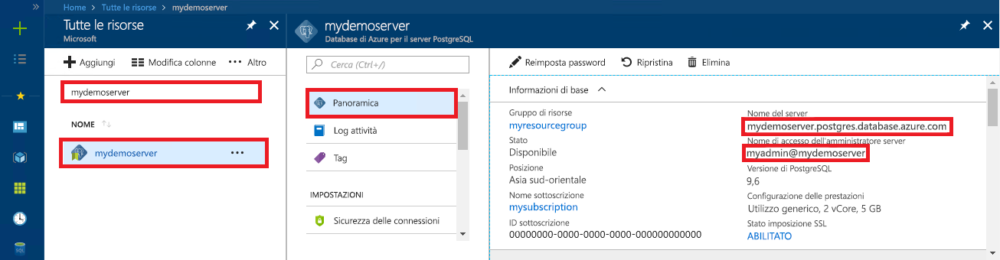

# <a name="azure-database-for-postgresql-use-nodejs-to-connect-and-query-data"></a>Database di Azure per PostgreSQL: usare Node.js per connettersi ai dati ed eseguire query
Questa guida introduttiva illustra come connettersi a un database di Azure per PostgreSQL usando un'applicazione [Node.js](https://nodejs.org/). Spiega come usare le istruzioni SQL per eseguire query, inserire, aggiornare ed eliminare dati nel database. Le procedure descritte in questo articolo presuppongono che si abbia familiarità con lo sviluppo con Node.js, ma non con Database di Azure per PostgreSQL.

## <a name="prerequisites"></a>prerequisiti
Questa guida introduttiva usa le risorse create in una delle guide seguenti come punto di partenza:
- [Creare un database: portale](quickstart-create-server-database-portal.md)
- [Creare un database: interfaccia della riga di comando](quickstart-create-server-database-azure-cli.md)

È anche necessario:
- Installare [Node.js](https://nodejs.org)

## <a name="install-pg-client"></a>Installare il client pg
Installare [pg](https://www.npmjs.com/package/pg), un client PostgreSQL per Node.js.

A tale scopo, eseguire Node Package Manager (npm) per JavaScript dalla riga di comando per installare il client pg.
```bash
npm install pg
```

Verificare l'installazione elencando i pacchetti installati.
```bash
npm list
```

## <a name="get-connection-information"></a>Ottenere informazioni di connessione
Ottenere le informazioni di connessione necessarie per connettersi al database di Azure per PostgreSQL. Sono necessari il nome del server completo e le credenziali di accesso.

1. Accedere al [Portale di Azure](https://portal.azure.com/).
2. Nel menu a sinistra nel portale di Azure fare clic su **Tutte le risorse** e quindi cercare il server creato, ad esempio **mydemoserver**.
3. Fare clic sul nome del server.
4. Nel pannello **Panoramica** del server prendere nota dei valori riportati in **Nome server** e **Nome di accesso dell'amministratore server**. Se si dimentica la password, in questo pannello è anche possibile reimpostarla.
 

## <a name="running-the-javascript-code-in-nodejs"></a>Esecuzione del codice JavaScript in Node.js
È possibile avviare Node.js dalla shell Bash, da Terminal o dal Prompt dei comandi di Windows digitando `node`, quindi eseguire l'esempio di codice JavaScript in modo interattivo copiandolo e incollandolo nel prompt. In alternativa è possibile salvare il codice JavaScript in un file di testo e avviare `node filename.js` con il nome del file come parametro per l'esecuzione.

## <a name="connect-create-table-and-insert-data"></a>Connettersi, creare tabelle e inserire dati
Usare il codice seguente per connettersi e caricare i dati usando le istruzioni SQL **CREATE TABLE** e **INSERT INTO**.
L'oggetto [pg.Client](https://github.com/brianc/node-postgres/wiki/Client) viene usato per l'interfaccia con il server PostgreSQL. La funzione [pg.Client.connect()](https://github.com/brianc/node-postgres/wiki/Client#method-connect) viene usata per stabilire la connessione al server. La funzione [pg.Client.query()](https://github.com/brianc/node-postgres/wiki/Query) viene usata per eseguire la query SQL sul database PostgreSQL. 

Sostituire i parametri host, dbname, user e password con i valori specificati al momento della creazione del server e del database.

```javascript
const pg = require('pg');

const config = {
    host: '<your-db-server-name>.postgres.database.azure.com',
    // Do not hard code your username and password.
    // Consider using Node environment variables.
    user: '<your-db-username>',     
    password: '<your-password>',
    database: '<name-of-database>',
    port: 5432,
    ssl: true
};

const client = new pg.Client(config);

client.connect(err => {
    if (err) throw err;
    else {
        queryDatabase();
    }
});

function queryDatabase() {
    const query = `
        DROP TABLE IF EXISTS inventory;
        CREATE TABLE inventory (id serial PRIMARY KEY, name VARCHAR(50), quantity INTEGER);
        INSERT INTO inventory (name, quantity) VALUES ('banana', 150);
        INSERT INTO inventory (name, quantity) VALUES ('orange', 154);
        INSERT INTO inventory (name, quantity) VALUES ('apple', 100);
    `;

    client
        .query(query)
        .then(() => {
            console.log('Table created successfully!');
            client.end(console.log('Closed client connection'));
        })
        .catch(err => console.log(err))
        .then(() => {
            console.log('Finished execution, exiting now');
            process.exit();
        });
}
```

## <a name="read-data"></a>Leggere i dati
Usare il codice seguente per connettersi e leggere i dati usando un'istruzione SQL **SELECT**. L'oggetto [pg.Client](https://github.com/brianc/node-postgres/wiki/Client) viene usato per l'interfaccia con il server PostgreSQL. La funzione [pg.Client.connect()](https://github.com/brianc/node-postgres/wiki/Client#method-connect) viene usata per stabilire la connessione al server. La funzione [pg.Client.query()](https://github.com/brianc/node-postgres/wiki/Query) viene usata per eseguire la query SQL sul database PostgreSQL. 

Sostituire i parametri host, dbname, user e password con i valori specificati al momento della creazione del server e del database. 

```javascript
const pg = require('pg');

const config = {
    host: '<your-db-server-name>.postgres.database.azure.com',
    // Do not hard code your username and password.
    // Consider using Node environment variables.
    user: '<your-db-username>',     
    password: '<your-password>',
    database: '<name-of-database>',
    port: 5432,
    ssl: true
};

const client = new pg.Client(config);

client.connect(err => {
    if (err) throw err;
    else { queryDatabase(); }
});

function queryDatabase() {
  
    console.log(`Running query to PostgreSQL server: ${config.host}`);

    const query = 'SELECT * FROM inventory;';

    client.query(query)
        .then(res => {
            const rows = res.rows;

            rows.map(row => {
                console.log(`Read: ${JSON.stringify(row)}`);
            });

            process.exit();
        })
        .catch(err => {
            console.log(err);
        });
}
```

## <a name="update-data"></a>Aggiornare i dati
Usare il codice seguente per connettersi e leggere i dati usando un'istruzione SQL **UPDATE**. L'oggetto [pg.Client](https://github.com/brianc/node-postgres/wiki/Client) viene usato per l'interfaccia con il server PostgreSQL. La funzione [pg.Client.connect()](https://github.com/brianc/node-postgres/wiki/Client#method-connect) viene usata per stabilire la connessione al server. La funzione [pg.Client.query()](https://github.com/brianc/node-postgres/wiki/Query) viene usata per eseguire la query SQL sul database PostgreSQL. 

Sostituire i parametri host, dbname, user e password con i valori specificati al momento della creazione del server e del database. 

```javascript
const pg = require('pg');

const config = {
    host: '<your-db-server-name>.postgres.database.azure.com',
    // Do not hard code your username and password.
    // Consider using Node environment variables.
    user: '<your-db-username>',     
    password: '<your-password>',
    database: '<name-of-database>',
    port: 5432,
    ssl: true
};

const client = new pg.Client(config);

client.connect(err => {
    if (err) throw err;
    else {
        queryDatabase();
    }
});

function queryDatabase() {
    const query = `
        UPDATE inventory 
        SET quantity= 1000 WHERE name='banana';
    `;

    client
        .query(query)
        .then(result => {
            console.log('Update completed');
            console.log(`Rows affected: ${result.rowCount}`);
        })
        .catch(err => {
            console.log(err);
            throw err;
        });
}
```

## <a name="delete-data"></a>Eliminare i dati
Usare il codice seguente per connettersi e leggere i dati usando un'istruzione SQL **DELETE**. L'oggetto [pg.Client](https://github.com/brianc/node-postgres/wiki/Client) viene usato per l'interfaccia con il server PostgreSQL. La funzione [pg.Client.connect()](https://github.com/brianc/node-postgres/wiki/Client#method-connect) viene usata per stabilire la connessione al server. La funzione [pg.Client.query()](https://github.com/brianc/node-postgres/wiki/Query) viene usata per eseguire la query SQL sul database PostgreSQL. 

Sostituire i parametri host, dbname, user e password con i valori specificati al momento della creazione del server e del database. 

```javascript
const pg = require('pg');

const config = {
    host: '<your-db-server-name>.postgres.database.azure.com',
    // Do not hard code your username and password.
    // Consider using Node environment variables.
    user: '<your-db-username>',     
    password: '<your-password>',
    database: '<name-of-database>',
    port: 5432,
    ssl: true
};

const client = new pg.Client(config);

client.connect(err => {
    if (err) {
        throw err;
    } else {
        queryDatabase();
    }
});

function queryDatabase() {
    const query = `
        DELETE FROM inventory 
        WHERE name = 'apple';
    `;

    client
        .query(query)
        .then(result => {
            console.log('Delete completed');
            console.log(`Rows affected: ${result.rowCount}`);
        })
        .catch(err => {
            console.log(err);
            throw err;
        });
}
```

## <a name="next-steps"></a>Passaggi successivi
> [!div class="nextstepaction"]
> [Eseguire la migrazione del database usando le funzionalità di esportazione e importazione](./howto-migrate-using-export-and-import.md)
