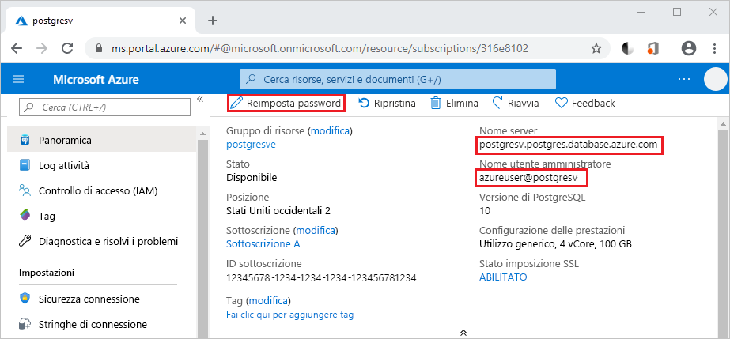

# <a name="azure-database-for-postgresql-use-python-to-connect-and-query-data"></a>Database di Azure per PostgreSQL: usare Python per connettersi ai dati ed eseguire query
Questa guida introduttiva illustra come usare [Python](https://python.org) per connettersi a un database di Azure per PostgreSQL e quindi usare istruzioni SQL per eseguire query e inserire, aggiornare ed eliminare dati nel database da piattaforme Mac OS, Ubuntu Linux e Windows. Le procedure descritte in questo articolo presuppongono che si abbia familiarità con lo sviluppo con Python, ma non con Database di Azure per PostgreSQL.

## <a name="prerequisites"></a>Prerequisiti
Questa guida introduttiva usa le risorse create in una delle guide seguenti come punto di partenza:
- [Creare un database: portale](quickstart-create-server-database-portal.md)
- [Creare un database: interfaccia della riga di comando](quickstart-create-server-database-azure-cli.md)

Altri elementi necessari:
- [Python](https://www.python.org/downloads/) installato
- Pacchetto [pip](https://pip.pypa.io/en/stable/installing/) installato. Pip è già installato se si usano i file binari Python 2 >=2.7.9 o Python 3 >=3.4 scaricati da [python.org](https://python.org), ma è necessario aggiornare pip.

## <a name="install-the-python-connection-libraries-for-postgresql"></a>Installare le raccolte di connessioni Python per PostgreSQL
Installare il pacchetto [psycopg2](http://initd.org/psycopg/docs/install.html) che consente di connettersi ed eseguire query sul database. psycopg2 è [disponibile in PyPI](https://pypi.python.org/pypi/psycopg2/) sotto forma di pacchetti [wheel](http://pythonwheels.com/) per le piattaforme più comuni (Linux, OSX e Windows), quindi è possibile usare pip install per ottenere la versione binaria del modulo con tutte le dipendenze:

```cmd
pip install psycopg2
```
Assicurarsi di usare una versione aggiornata di pip. È possibile aggiornare pip con un comando simile a `pip install -U pip`

## <a name="get-connection-information"></a>Ottenere informazioni di connessione
Ottenere le informazioni di connessione necessarie per connettersi al database di Azure per PostgreSQL. Sono necessari il nome del server completo e le credenziali di accesso.

1. Accedere al [Portale di Azure](https://portal.azure.com/).
2. Nel menu a sinistra nel portale di Azure fare clic su **Tutte le risorse** e cercare il server appena creato, **mypgserver-20170401**.
3. Fare clic sul nome del server **mypgserver-20170401**.
4. Selezionare la pagina **Panoramica** del server. Annotare il **Nome server** e il **nome di accesso dell'amministratore del server**.
 
5. Se si dimenticano le informazioni di accesso per il server, passare alla pagina **Panoramica** per visualizzare il nome di accesso dell'amministratore del server e, se necessario, reimpostare la password.

## <a name="how-to-run-python-code"></a>Come eseguire codice Python
- Usando un editor di testo, creare un nuovo file denominato postgres.py e salvarlo in una cartella di progetto. Copiare e incollare l'esempio di codice seguente nel file di testo e salvarlo. Assicurarsi di selezionare la codifica UTF-8 quando si salva il file nel sistema operativo Windows. 
- Per eseguire il codice, avviare il prompt dei comandi o la shell Bash. Passare alla cartella del progetto, ad esempio `cd postgresql`. Digitare quindi il comando python seguito dal nome del file, ad esempio `python postgres.py`.

> [!NOTE]
> A partire da Python versione 3, potrebbe essere visualizzato l'errore `SyntaxError: Missing parentheses in call to 'print'` quando si eseguono i blocchi di codice seguenti. In tal caso, sostituire ogni chiamata al comando `print "string"` con una chiamata di funzione con parentesi, ad esempio `print("string")`.

## <a name="connect-create-table-and-insert-data"></a>Connettersi, creare tabelle e inserire dati
Usare il codice seguente per connettersi e caricare i dati usando la funzione [psycopg2.connect](http://initd.org/psycopg/docs/connection.html) con un'istruzione SQL **INSERT**. La funzione [cursor.execute](http://initd.org/psycopg/docs/cursor.html#execute) viene usata per eseguire la query SQL sul database PostgreSQL. Sostituire i parametri host, dbname, user e password con i valori specificati al momento della creazione del server e del database.

```Python
import psycopg2

# Update connection string information obtained from the portal
host = "mypgserver-20170401.postgres.database.azure.com"
user = "mylogin@mypgserver-20170401"
dbname = "mypgsqldb"
password = "<server_admin_password>"
sslmode = "require"

# Construct connection string
conn_string = "host={0} user={1} dbname={2} password={3} sslmode={4}".format(host, user, dbname, password, sslmode)
conn = psycopg2.connect(conn_string) 
print "Connection established"

cursor = conn.cursor()

# Drop previous table of same name if one exists
cursor.execute("DROP TABLE IF EXISTS inventory;")
print "Finished dropping table (if existed)"

# Create table
cursor.execute("CREATE TABLE inventory (id serial PRIMARY KEY, name VARCHAR(50), quantity INTEGER);")
print "Finished creating table"

# Insert some data into table
cursor.execute("INSERT INTO inventory (name, quantity) VALUES (%s, %s);", ("banana", 150))
cursor.execute("INSERT INTO inventory (name, quantity) VALUES (%s, %s);", ("orange", 154))
cursor.execute("INSERT INTO inventory (name, quantity) VALUES (%s, %s);", ("apple", 100))
print "Inserted 3 rows of data"

# Cleanup
conn.commit()
cursor.close()
conn.close()
```

## <a name="read-data"></a>Leggere i dati
Usare il codice seguente per leggere i dati inseriti usando la funzione [cursor.execute](http://initd.org/psycopg/docs/cursor.html#execute) con un'istruzione SQL **SELECT**. Questa funzione accetta una query e restituisce un set di risultati su cui è possibile eseguire l'iterazione tramite [cursor.fetchall()](http://initd.org/psycopg/docs/cursor.html#cursor.fetchall). Sostituire i parametri host, dbname, user e password con i valori specificati al momento della creazione del server e del database.

```Python
import psycopg2

# Update connection string information obtained from the portal
host = "mypgserver-20170401.postgres.database.azure.com"
user = "mylogin@mypgserver-20170401"
dbname = "mypgsqldb"
password = "<server_admin_password>"
sslmode = "require"

# Construct connection string
conn_string = "host={0} user={1} dbname={2} password={3} sslmode={4}".format(host, user, dbname, password, sslmode)
conn = psycopg2.connect(conn_string) 
print "Connection established"

cursor = conn.cursor()

# Fetch all rows from table
cursor.execute("SELECT * FROM inventory;")
rows = cursor.fetchall()

# Print all rows
for row in rows:
    print "Data row = (%s, %s, %s)" %(str(row[0]), str(row[1]), str(row[2]))

# Cleanup
conn.commit()
cursor.close()
conn.close()
```

## <a name="update-data"></a>Aggiornare i dati
Usare il codice seguente per aggiornare la riga d'inventario inserita in precedenza tramite la funzione [cursor.execute](http://initd.org/psycopg/docs/cursor.html#execute) con l'istruzione SQL **UPDATE**. Sostituire i parametri host, dbname, user e password con i valori specificati al momento della creazione del server e del database.

```Python
import psycopg2

# Update connection string information obtained from the portal
host = "mypgserver-20170401.postgres.database.azure.com"
user = "mylogin@mypgserver-20170401"
dbname = "mypgsqldb"
password = "<server_admin_password>"
sslmode = "require"

# Construct connection string
conn_string = "host={0} user={1} dbname={2} password={3} sslmode={4}".format(host, user, dbname, password, sslmode)
conn = psycopg2.connect(conn_string) 
print "Connection established"

cursor = conn.cursor()

# Update a data row in the table
cursor.execute("UPDATE inventory SET quantity = %s WHERE name = %s;", (200, "banana"))
print "Updated 1 row of data"

# Cleanup
conn.commit()
cursor.close()
conn.close()
```

## <a name="delete-data"></a>Eliminare i dati
Usare il codice seguente per eliminare un articolo di magazzino inserito in precedenza tramite la funzione [cursor.execute](http://initd.org/psycopg/docs/cursor.html#execute) con l'istruzione SQL **DELETE**. Sostituire i parametri host, dbname, user e password con i valori specificati al momento della creazione del server e del database.

```Python
import psycopg2

# Update connection string information obtained from the portal
host = "mypgserver-20170401.postgres.database.azure.com"
user = "mylogin@mypgserver-20170401"
dbname = "mypgsqldb"
password = "<server_admin_password>"
sslmode = "require"

# Construct connection string
conn_string = "host={0} user={1} dbname={2} password={3} sslmode={4}".format(host, user, dbname, password, sslmode)
conn = psycopg2.connect(conn_string) 
print "Connection established"

cursor = conn.cursor()

# Delete data row from table
cursor.execute("DELETE FROM inventory WHERE name = %s;", ("orange",))
print "Deleted 1 row of data"

# Cleanup
conn.commit()
cursor.close()
conn.close()
```

## <a name="next-steps"></a>Passaggi successivi
> [!div class="nextstepaction"]
> [Eseguire la migrazione del database usando le funzionalità di esportazione e importazione](./howto-migrate-using-export-and-import.md)

