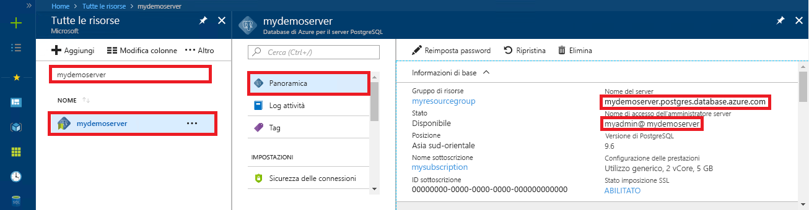

# <a name="azure-database-for-postgresql-use-ruby-to-connect-and-query-data"></a>Database di Azure per PostgreSQL: usare Ruby per connettersi ai dati ed eseguire query
Questa guida introduttiva illustra come connettersi a un database di Azure per PostgreSQL usando un'applicazione [Ruby](https://www.ruby-lang.org). Spiega come usare le istruzioni SQL per eseguire query, inserire, aggiornare ed eliminare dati nel database. Le procedure descritte in questo articolo presuppongono che si abbia familiarità con lo sviluppo con Ruby, ma non con Database di Azure per PostgreSQL.

## <a name="prerequisites"></a>Prerequisiti
Questa guida introduttiva usa le risorse create in una delle guide seguenti come punto di partenza:
- [Creare un database: portale](quickstart-create-server-database-portal.md)
- [Creare un database: interfaccia della riga di comando di Azure](quickstart-create-server-database-azure-cli.md)

## <a name="install-ruby"></a>Installare Ruby
Installare Ruby nel computer. 

### <a name="windows"></a>Windows
- Scaricare e installare la versione più recente di [Ruby](http://rubyinstaller.org/downloads/).
- Nella schermata finale del programma di installazione MSI selezionare la casella "Run 'ridk install' to install MSYS2 and development toolchain" (Esegui 'ridk install' per installare MSYS2 e la toolchain di sviluppo). Fare quindi clic su **Finish** (Fine) per avviare il programma di installazione successivo.
- Viene avviato il programma di installazione di RubyInstaller2 per Windows. Digitare 2 per installare l'aggiornamento del repository MSYS2. Dopo avere terminato ed essere tornati alla richiesta di installazione, chiudere la finestra di comando.
- Avviare un nuovo prompt dei comandi (cmd) dal menu Start.
- Testare l'installazione di Ruby `ruby -v` per visualizzare la versione installata.
- Testare l'installazione di Gem `gem -v` per visualizzare la versione installata.
- Eseguire il comando `gem install pg` per compilare il modulo PostgreSQL per Ruby usando Gem.

### <a name="macos"></a>MacOS
- Eseguire il comando `brew install ruby` per installare Ruby usando Homebrew. Per altre opzioni di installazione, vedere la [documentazione sull'installazione](https://www.ruby-lang.org/en/documentation/installation/#homebrew) di Ruby.
- Testare l'installazione di Ruby `ruby -v` per visualizzare la versione installata.
- Testare l'installazione di Gem `gem -v` per visualizzare la versione installata.
- Eseguire il comando `gem install pg` per compilare il modulo PostgreSQL per Ruby usando Gem.

### <a name="linux-ubuntu"></a>Linux (Ubuntu)
- Installare Ruby eseguendo il comando `sudo apt-get install ruby-full`. Per altre opzioni di installazione, vedere la [documentazione sull'installazione](https://www.ruby-lang.org/en/documentation/installation/) di Ruby.
- Testare l'installazione di Ruby `ruby -v` per visualizzare la versione installata.
- Installare gli aggiornamenti più recenti per Gem eseguendo il comando `sudo gem update --system`.
- Testare l'installazione di Gem `gem -v` per visualizzare la versione installata.
- Installare gcc, make e altri strumenti di compilazione eseguendo il comando `sudo apt-get install build-essential`.
- Installare le librerie PostgreSQL eseguendo il comando `sudo apt-get install libpq-dev`.
- Eseguire il comando `sudo gem install pg` per compilare il modulo pg di Ruby usando Gem.

## <a name="run-ruby-code"></a>Eseguire il codice Ruby 
- Salvare il codice in un file di testo con estensione rb e salvare il file in una cartella di progetto, ad esempio `C:\rubypostgres\read.rb` o `/home/username/rubypostgres/read.rb`
- Per eseguire il codice, avviare il prompt dei comandi o la shell Bash. Sostituire la directory con la cartella del progetto `cd rubypostgres`, quindi digitare il comando `ruby read.rb` per eseguire l'applicazione.

## <a name="get-connection-information"></a>Ottenere informazioni di connessione
Ottenere le informazioni di connessione necessarie per connettersi al database di Azure per PostgreSQL. Sono necessari il nome del server completo e le credenziali di accesso.

1. Accedere al [Portale di Azure](https://portal.azure.com/).
2. Nel menu a sinistra nel portale di Azure fare clic su **Tutte le risorse** e cercare il server creato, ad esempio **mypgserver-20170401**.
3. Fare clic sul nome del server **mypgserver-20170401**.
4. Selezionare la pagina **Panoramica** del server. Annotare il **Nome server** e il **nome di accesso dell'amministratore del server**.
 
5. Se si dimenticano le informazioni di accesso per il server, passare alla pagina **Panoramica** per visualizzare il nome di accesso dell'amministratore del server. Se necessario, reimpostare la password.

## <a name="connect-and-create-a-table"></a>Connettersi e creare una tabella
Usare il codice seguente per connettersi e creare una tabella usando l'istruzione SQL **CREATE TABLE**, seguita dalle istruzioni SQL **INSERT INTO** per aggiungere righe nella tabella.

Il codice usa un oggetto [PG::Connection](http://www.rubydoc.info/gems/pg/PG/Connection) con il costruttore [new()](http://www.rubydoc.info/gems/pg/PG%2FConnection:initialize) per la connessione a Database di Azure per PostgreSQL. Chiama quindi il metodo [exec()](http://www.rubydoc.info/gems/pg/PG/Connection#exec-instance_method) per eseguire i comandi DROP, CREATE TABLE e INSERT INTO. Il codice cerca gli errori usando la classe [PG::Error](http://www.rubydoc.info/gems/pg/PG/Error). Chiama infine il metodo [close()](http://www.rubydoc.info/gems/pg/PG/Connection#lo_close-instance_method) per chiudere la connessione prima di terminare.

Sostituire le stringhe `host`, `database`, `user` e `password` con valori personalizzati. 
```ruby
require 'pg'

begin
    # Initialize connection variables.
    host = String('mypgserver-20170401.postgres.database.azure.com')
    database = String('postgres')
    user = String('mylogin@mypgserver-20170401')
    password = String('<server_admin_password>')

    # Initialize connection object.
    connection = PG::Connection.new(:host => host, :user => user, :dbname => database, :port => '5432', :password => password)
    puts 'Successfully created connection to database'

    # Drop previous table of same name if one exists
    connection.exec('DROP TABLE IF EXISTS inventory;')
    puts 'Finished dropping table (if existed).'

    # Drop previous table of same name if one exists.
    connection.exec('CREATE TABLE inventory (id serial PRIMARY KEY, name VARCHAR(50), quantity INTEGER);')
    puts 'Finished creating table.'

    # Insert some data into table.
    connection.exec("INSERT INTO inventory VALUES(1, 'banana', 150)")
    connection.exec("INSERT INTO inventory VALUES(2, 'orange', 154)")
    connection.exec("INSERT INTO inventory VALUES(3, 'apple', 100)")
    puts 'Inserted 3 rows of data.'

rescue PG::Error => e
    puts e.message 
    
ensure
    connection.close if connection
end
```

## <a name="read-data"></a>Leggere i dati
Usare il codice seguente per connettersi e leggere i dati usando un'istruzione SQL **SELECT**. 

Il codice usa un oggetto [PG::Connection](http://www.rubydoc.info/gems/pg/PG/Connection) con il costruttore [new()](http://www.rubydoc.info/gems/pg/PG%2FConnection:initialize) per la connessione a Database di Azure per PostgreSQL. Chiama quindi il metodo [exec()](http://www.rubydoc.info/gems/pg/PG/Connection#exec-instance_method) per eseguire il comando SELECT, mantenendo i risultati in un set di risultati. Viene eseguita l'iterazione della raccolta di set di risultati usando il ciclo `resultSet.each do`, mantenendo i valori della riga corrente nella variabile `row`. Il codice cerca gli errori usando la classe [PG::Error](http://www.rubydoc.info/gems/pg/PG/Error). Chiama infine il metodo [close()](http://www.rubydoc.info/gems/pg/PG/Connection#lo_close-instance_method) per chiudere la connessione prima di terminare.

Sostituire le stringhe `host`, `database`, `user` e `password` con valori personalizzati. 

```ruby
require 'pg'

begin
    # Initialize connection variables.
    host = String('mypgserver-20170401.postgres.database.azure.com')
    database = String('postgres')
    user = String('mylogin@mypgserver-20170401')
    password = String('<server_admin_password>')

    # Initialize connection object.
    connection = PG::Connection.new(:host => host, :user => user, :database => dbname, :port => '5432', :password => password)
    puts 'Successfully created connection to database.'

    resultSet = connection.exec('SELECT * from inventory;')
    resultSet.each do |row|
        puts 'Data row = (%s, %s, %s)' % [row['id'], row['name'], row['quantity']]
    end

rescue PG::Error => e
    puts e.message 
    
ensure
    connection.close if connection
end
```

## <a name="update-data"></a>Aggiornare i dati
Usare il codice seguente per connettersi e aggiornare i dati usando un'istruzione SQL **UPDATE**.

Il codice usa un oggetto [PG::Connection](http://www.rubydoc.info/gems/pg/PG/Connection) con il costruttore [new()](http://www.rubydoc.info/gems/pg/PG%2FConnection:initialize) per la connessione a Database di Azure per PostgreSQL. Chiama quindi il metodo [exec()](http://www.rubydoc.info/gems/pg/PG/Connection#exec-instance_method) per eseguire il comando UPDATE. Il codice cerca gli errori usando la classe [PG::Error](http://www.rubydoc.info/gems/pg/PG/Error). Chiama infine il metodo [close()](http://www.rubydoc.info/gems/pg/PG/Connection#lo_close-instance_method) per chiudere la connessione prima di terminare.

Sostituire le stringhe `host`, `database`, `user` e `password` con valori personalizzati. 

```ruby
require 'pg'

begin
    # Initialize connection variables.
    host = String('mypgserver-20170401.postgres.database.azure.com')
    database = String('postgres')
    user = String('mylogin@mypgserver-20170401')
    password = String('<server_admin_password>')

    # Initialize connection object.
    connection = PG::Connection.new(:host => host, :user => user, :dbname => database, :port => '5432', :password => password)
    puts 'Successfully created connection to database.'

    # Modify some data in table.
    connection.exec('UPDATE inventory SET quantity = %d WHERE name = %s;' % [200, '\'banana\''])
    puts 'Updated 1 row of data.'

rescue PG::Error => e
    puts e.message 
    
ensure
    connection.close if connection
end
```


## <a name="delete-data"></a>Eliminare i dati
Usare il codice seguente per connettersi e leggere i dati usando un'istruzione SQL **DELETE**. 

Il codice usa un oggetto [PG::Connection](http://www.rubydoc.info/gems/pg/PG/Connection) con il costruttore [new()](http://www.rubydoc.info/gems/pg/PG%2FConnection:initialize) per la connessione a Database di Azure per PostgreSQL. Chiama quindi il metodo [exec()](http://www.rubydoc.info/gems/pg/PG/Connection#exec-instance_method) per eseguire il comando UPDATE. Il codice cerca gli errori usando la classe [PG::Error](http://www.rubydoc.info/gems/pg/PG/Error). Chiama infine il metodo [close()](http://www.rubydoc.info/gems/pg/PG/Connection#lo_close-instance_method) per chiudere la connessione prima di terminare.

Sostituire le stringhe `host`, `database`, `user` e `password` con valori personalizzati. 

```ruby
require 'pg'

begin
    # Initialize connection variables.
    host = String('mypgserver-20170401.postgres.database.azure.com')
    database = String('postgres')
    user = String('mylogin@mypgserver-20170401')
    password = String('<server_admin_password>')

    # Initialize connection object.
    connection = PG::Connection.new(:host => host, :user => user, :dbname => database, :port => '5432', :password => password)
    puts 'Successfully created connection to database.'

    # Modify some data in table.
    connection.exec('DELETE FROM inventory WHERE name = %s;' % ['\'orange\''])
    puts 'Deleted 1 row of data.'

rescue PG::Error => e
    puts e.message 
    
ensure
    connection.close if connection
end
```

## <a name="next-steps"></a>Passaggi successivi
> [!div class="nextstepaction"]
> [Eseguire la migrazione del database usando le funzionalità di esportazione e importazione](./howto-migrate-using-export-and-import.md)
