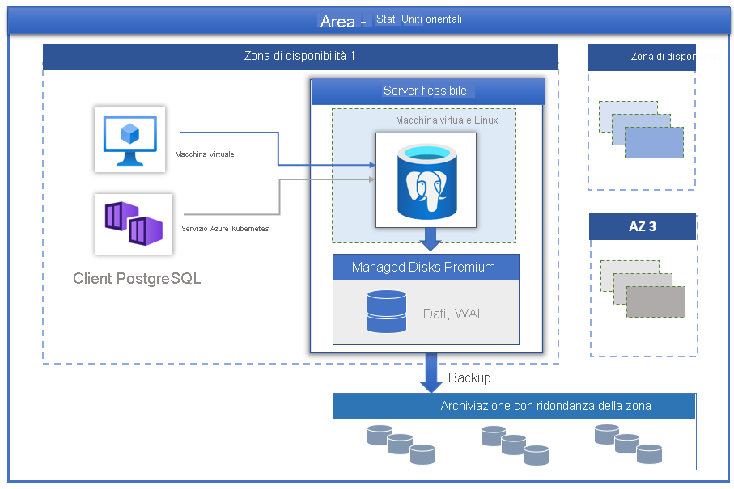

# Server flessibile di Database di Azure per PostgreSQL

[Database di Azure per PostgreSQL](../overview.md) basato su PostgreSQL Community Edition è disponibile in tre modalità di distribuzione:

- [Server singolo](../overview-single-server.md)
- Server flessibile (anteprima)
- Hyperscale (Citus)

In questo articolo verrà fornita una panoramica e un'introduzione ai concetti di base del modello di distribuzione flessibile del server.

> [!IMPORTANT]
> Il server flessibile di Database di Azure per PostgreSQL è disponibile in anteprima

## Panoramica

Database di Azure per PostgreSQL: un server flessibile è un servizio di database completamente gestito progettato per offrire un controllo più granulare e una maggiore flessibilità rispetto alle funzioni di gestione e alle impostazioni di configurazione del database. In generale, il servizio offre maggiore flessibilità e personalizzazioni della configurazione del server in base ai requisiti dell'utente. L'architettura del server flessibile consente agli utenti di collocare il motore di database con il livello client per una latenza più bassa, scegliere la disponibilità elevata all'interno di una singola zona di disponibilità e in più zone di disponibilità. I server flessibili forniscono anche controlli di ottimizzazione dei costi migliori con la possibilità di arrestare/avviare il server e il livello di calcolo della possibilità di burst ideale per i carichi di lavoro che non necessitano di capacità di calcolo completa in modo continuo. Il servizio supporta attualmente la versione community di PostgreSQL 11 e 12. Il servizio è attualmente disponibile in anteprima, in un'ampia gamma di [aree di Azure](https://azure.microsoft.com/global-infrastructure/services/).

I server flessibili sono ideali per

- Sviluppi di applicazioni che richiedono un controllo e personalizzazioni migliori.
- Disponibilità elevata di ridondanza della zona
- Finestre di manutenzione gestite
  
## Disponibilità elevata

Il modello di distribuzione di server flessibili è progettato per supportare la disponibilità elevata all'interno di una singola zona di disponibilità e tra più zone di disponibilità. L'architettura separa il calcolo e l'archiviazione. Il motore di database viene eseguito in una macchina virtuale Linux, mentre i file di dati risiedono in archiviazione di Azure. L'archiviazione gestisce localmente tre copie sincrone con ridondanza dei file di database garantendo la durabilità dei dati.

Durante gli eventi di failover pianificati o non pianificati, se il server diventa inattivo, il servizio mantiene la disponibilità elevata dei server utilizzando la procedura automatizzata seguente:

1. Viene eseguito il provisioning di una nuova VM Linux di calcolo.
2. Viene eseguito il mapping della risorsa di archiviazione con i file di dati alla nuova macchina virtuale
3. Il motore di database PostgreSQL viene portato online sulla nuova macchina virtuale.

L'immagine seguente mostra la transizione per le macchine virtuali e gli errori di archiviazione.

 :::image type="content" source="./media/overview/overview-azure-postgres-flex-virtualmachine.png" alt-text="Server flessibili: errori di archiviazione e di macchine virtuali":::

Se è configurata la disponibilità elevata con ridondanza della zona, il servizio effettua il provisioning e gestisce un server hot standby nella zona di disponibilità all'interno della stessa area di Azure. Le modifiche dei dati nel server di origine vengono replicate in modo sincrono nel server di standby per garantire una perdita di dati pari a zero. Con la disponibilità elevata con ridondanza della zona, dopo l'attivazione dell'evento di failover pianificato o non pianificato, il server di standby viene portato online immediatamente ed è disponibile per l'elaborazione delle transazioni in ingresso. Ciò consente la resilienza del servizio dall'errore della zona di disponibilità all'interno di un'area di Azure che supporta più zone di disponibilità, come illustrato nell'immagine seguente.

 :::image type="content" source="./media/business-continuity/concepts-zone-redundant-high-availability-architecture.png" alt-text="Server flessibili: errori di archiviazione e di macchine virtuali":::

 Per ulteriori informazioni, vedere il [documento relativo alla disponibilità elevata](./concepts-high-availability.md).

## Applicazione automatica delle patch con la finestra di manutenzione gestita

Il servizio esegue l'applicazione automatica di patch dell'hardware, del sistema operativo e del motore di database sottostanti. L'applicazione di patch include aggiornamenti della sicurezza e dei software. Per il motore PostgreSQL gli aggiornamenti della versione secondaria sono inclusi anche come parte della versione di manutenzione pianificata. Gli utenti possono configurare la pianificazione dell'applicazione di patch in modo che sia gestita dal sistema o definire la pianificazione personalizzata. Durante la pianificazione della manutenzione, viene applicata la patch e potrebbe essere necessario riavviare il server come parte del processo di applicazione delle patch per completare l'aggiornamento. Con la pianificazione personalizzata gli utenti possono prevedere il ciclo di applicazione delle patch e scegliere una finestra di manutenzione con un impatto minimo sull'attività. Il servizio segue in genere la pianificazione di rilascio mensile come parte del processo continuo di integrazione e rilascio.

## Backup automatici

Il servizio del server flessibile crea automaticamente backup del server e li archivia in utenti configurati localmente con ridondanza della zona. I backup possono essere utilizzati per ripristinare il server in modo temporizzato entro il periodo di conservazione. Il periodo di conservazione dei backup predefinito è di sette giorni. La conservazione può essere configurata facoltativamente fino a 35 giorni. Tutti i backup vengono crittografati con crittografia AES a 256 bit. Per informazioni dettagliate, vedere [Backup](./concepts-backup-restore.md).

## Regolare prestazioni e scalabilità in pochi secondi

Il servizio server flessibile è disponibile in tre livelli di calcolo: Con possibilità di burst, Per utilizzo generico e Con ottimizzazione per la memoria. Il livello Con possibilità di burst è particolarmente adatto per lo sviluppo a basso costo e per carichi di lavoro di concorrenza bassi che non necessitano di capacità di calcolo completa in modo continuo. Per utilizzo generico e Con ottimizzazione per la memoria sono più adatti per i carichi di lavoro di produzione che richiedono concorrenza, scalabilità e prevedibilità delle prestazioni. È possibile compilare la prima applicazione in un database di piccole dimensioni con un costo mensile minimo, quindi regolare in tutta semplicità la scalabilità in base alle esigenze della soluzione.

## Arrestare/avviare il server per ridurre il costo totale di proprietà

Il servizio server flessibile consente di arrestare e avviare il server su richiesta per ridurre il costo totale di proprietà. La fatturazione del livello di calcolo viene arrestata immediatamente quando il server viene arrestato. Ciò consente un notevole risparmio sui costi durante lo sviluppo, il test e i carichi di lavoro di produzione prevedibili con limiti temporali. Se non riavviato prima, il server rimane in stato di interruzione per sette giorni.

## Sicurezza di livello aziendale

Il servizio server flessibile usa il modulo crittografico convalidato FIPS 140-2 per la crittografia dei dati archiviati inattivi. I dati, inclusi i backup e i file temporanei creati durante l'esecuzione di query, sono crittografati. Il servizio usa la crittografia AES a 256 bit inclusa nella crittografia di archiviazione di Azure e le chiavi possono essere gestite dal sistema (predefinito). Il servizio crittografa i dati in movimento con Transport Layer Security (SSL/TLS) applicati per impostazione predefinita. Il servizio applica e supporta solo TLS 1.2.

I server flessibili consentono l'accesso privato completo ai server tramite la rete virtuale di Azure (integrazione VNet). I server nella rete virtuale di Azure possono essere raggiunti e connessi solo tramite indirizzi IP privati. Con l'integrazione di VNet, l'accesso pubblico viene negato e non è possibile raggiungere i server usando gli endpoint pubblici.

## Monitoraggio e avviso

Il servizio server flessibile è dotato di funzionalità predefinite di monitoraggio delle prestazioni e di avviso. Tutte le metriche di Azure hanno una frequenza di un minuto e offrono una cronologia di 30 giorni. È possibile configurare avvisi in base alle metriche. Il servizio espone le metriche del server host per monitorare l'utilizzo delle risorse e consente la configurazione di log di query lente. Grazie a questi strumenti è possibile ottimizzare rapidamente i carichi di lavoro e configurare il server per ottenere prestazioni ottimali.

## Migrazione

Il servizio esegue la versione community di PostgreSQL. Questo consente la compatibilità completa delle applicazioni e richiede un costo di refactoring minimo per eseguire la migrazione di un'applicazione esistente sviluppata sul motore PostgreSQL a un server flessibile. 

- **Dump e ripristino**: per le migrazioni offline, in cui gli utenti possono permettersi un certo tempo di inattività, eseguire il dump e il ripristino usando strumenti della community come pg_dump e pg_restore può fornire una soluzione più rapida per la migrazione. Per ulteriori dettagli vedere [Eseguire la migrazione con dump e ripristino](https://docs.microsoft.com/azure/postgresql/howto-migrate-using-dump-and-restore).
- **Servizio Migrazione del database di Azure**: per migrazioni semplici e semplificate verso server flessibili con tempi di inattività minimi è possibile sfruttare il Servizio Migrazione del database di Azure. Vedere [Servizio Migrazione del database tramite portale](https://docs.microsoft.com/azure/dms/tutorial-postgresql-azure-postgresql-online-portal) e [Servizio Migrazione del database tramite interfaccia della riga di comando](https://docs.microsoft.com/azure/dms/tutorial-postgresql-azure-postgresql-online). È possibile eseguire la migrazione dal Database di Azure per PostgreSQL: da server singolo a server flessibile. Per informazioni dettagliate, vedere l'[articolo Servizio Migrazione del database](https://docs.microsoft.com/azure/dms/tutorial-azure-postgresql-to-azure-postgresql-online-portal).

## Passaggi successivi

A questo punto, dopo aver letto un'introduzione alla modalità di distribuzione flessibile del server flessibile di Database di Azure per PostgreSQL, si è pronti per creare il primo server: [Creare un server flessibile di Database di Azure per PostgreSQL tramite il portale di Azure](./quickstart-create-server-portal.md)

