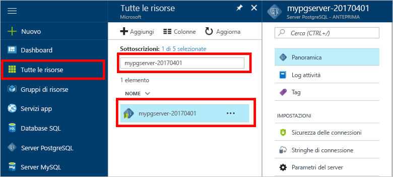

# Come eseguire la procedura di backup e ripristino di un server nel Database di Azure per PostgreSQL usando il portale di Azure

## Il backup viene eseguito automaticamente
Quando si usa Database di Azure per PostgreSQL, il servizio di database esegue automaticamente il backup del servizio ogni 5 minuti. 

La disponibilità dei backup è di 7 giorni per il livello Basic e 35 giorni per il livello Standard. Per altre informazioni, vedere [Livelli di servizio del Database di Azure per PostgreSQL](concepts-service-tiers.md)

L'uso di questa funzionalità di backup automatico permette di ripristinare il server e tutti i suoi database in un nuovo server a un precedente punto temporizzato.

## Ripristino nel portale di Azure
Il Database di Azure per PostgreSQL consente di ripristinare il server a un punto temporizzato e in una nuova copia del server. È possibile usare questo nuovo server per ripristinare i dati. 

Ad esempio, se oggi una tabella è stata accidentalmente eliminata a mezzogiorno, è possibile eseguire il ripristino a un'ora prima di mezzogiorno per recuperare la tabella e i dati mancanti dalla nuova copia del server.

La procedura seguente consente di ripristinare il server di esempio ad un punto temporizzato.
1. Accedere al [portale di Azure](https://portal.azure.com/)
2. Individuare il Database di Azure per il server PostgreSQL. Nel portale di Azure fare clic su **Tutte le risorse** dal menu a sinistra e digitare il nome, ad esempio **mypgserver-20170401**, per cercare il server esistente. Fare clic sul nome del server elencato nei risultati della ricerca. Si apre la pagina **Panoramica** relativa al server, con le opzioni per un'ulteriore configurazione.

   

3. Nella parte superiore del pannello Panoramica server, fare clic su **Ripristina** nella barra degli strumenti. Viene aperto il pannello Ripristina.

   

4. Compilare il modulo Ripristina con le informazioni obbligatorie:

   
  - **Punto di ripristino**: selezionare un punto nel tempo precedente alla modifica del server
  - **Server di destinazione**: fornire un nuovo nome del server che si desidera ripristinare
  - **Percorso**: non è possibile selezionare l'area, per impostazione predefinita è la stessa del server di origine
  - **Piano tariffario**: non è possibile modificare questo valore quando si ripristina un server. È uguale al server di origine. 

5. Fare clic su **OK** per ripristinare il server al punto di ripristino temporizzato. 

6. Al termine del ripristino, individuare il nuovo server creato per verificare che il ripristino dei dati sia avvenuto come previsto.

## Passaggi successivi
- [Raccolte connessioni per il Database di Azure per PostgreSQL](concepts-connection-libraries.md)

