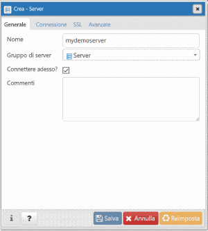
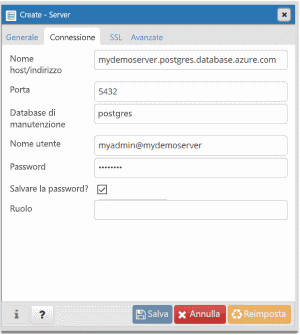
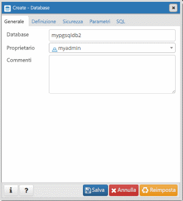

# <a name="quickstart-create-an-azure-database-for-postgresql---single-server-using-powershell"></a>Avvio rapido: Creare un database di Azure per PostgreSQL - Server singolo usando PowerShell

Questa guida di avvio rapido illustra come usare PowerShell per creare un server di database di Azure per PostgreSQL in un gruppo di risorse di Azure. È possibile usare PowerShell per creare e gestire le risorse di Azure in modo interattivo o negli script.

## <a name="prerequisites"></a>Prerequisiti

Se non si ha una sottoscrizione di Azure, creare un account [gratuito](https://azure.microsoft.com/free/) prima di iniziare.

Se si sceglie di usare PowerShell in locale, per questo articolo è necessario installare il modulo Az PowerShell e connettersi all'account di Azure usando il cmdlet [Connect-AzAccount](https://docs.microsoft.com/powershell/module/az.accounts/connect-azaccount). Per altre informazioni sull'installazione del modulo Az PowerShell, vedere [Installare Azure PowerShell](https://docs.microsoft.com/powershell/azure/install-az-ps).

> [!IMPORTANT]
> Poiché il modulo Az.PostgreSql di PowerShell è in fase di anteprima, è necessario installarlo separatamente dal modulo Az PowerShell usando il comando seguente: `Install-Module -Name Az.PostgreSql -AllowPrerelease`.
> Quando il modulo Az.PostgreSql di PowerShell sarà disponibile a livello generale, diventerà parte delle future versioni del modulo Az PowerShell e sarà disponibile in modo nativo dall'interno di Azure Cloud Shell.

Se è la prima volta che si usa il servizio Database di Azure per PostgreSQL, è necessario registrare il provider di risorse **Microsoft.DBforPostgreSQL**.

```azurepowershell-interactive
Register-AzResourceProvider -ProviderNamespace Microsoft.DBforPostgreSQL
```

[!INCLUDE [cloud-shell-try-it](../../includes/cloud-shell-try-it.md)]

Se si possiedono più sottoscrizioni di Azure, scegliere quella appropriata in cui verranno fatturate le risorse. Selezionare un ID sottoscrizione specifico usando il cmdlet [Set-AzContext](https://docs.microsoft.com/powershell/module/az.accounts/set-azcontext).

```azurepowershell-interactive
Set-AzContext -SubscriptionId 00000000-0000-0000-0000-000000000000
```

## <a name="create-a-resource-group"></a>Creare un gruppo di risorse

Creare un [gruppo di risorse di Azure](https://docs.microsoft.com/azure/azure-resource-manager/resource-group-overview) con il cmdlet [New-AzResourceGroup](https://docs.microsoft.com/powershell/module/az.resources/new-azresourcegroup). Un gruppo di risorse è un contenitore logico in cui le risorse di Azure vengono distribuite e gestite come gruppo.

L'esempio seguente crea un gruppo di risorse denominato **myResourceGroup** nell'area **Stati Uniti occidentali**.

```azurepowershell-interactive
New-AzResourceGroup -Name myresourcegroup -Location westus
```

## <a name="create-an-azure-database-for-postgresql-server"></a>Creare un database di Azure per il server PostgreSQL

Creare un server di Database di Azure per PostgreSQL con il cmdlet `New-AzPostgreSqlServer`. Un server può gestire più database. In genere, viene usato un database separato per ogni progetto o per ogni utente.

La tabella seguente contiene un elenco di parametri e valori di esempio usati di frequente per il cmdlet `New-AzPostgreSqlServer`.

|        **Impostazione**         | **Valore di esempio** |                                                                                                                                                             **Descrizione**                                                                                                                                                              |
| -------------------------- | ---------------- | ---------------------------------------------------------------------------------------------------------------------------------------------------------------------------------------------------------------------------------------------------------------------------------------------------------------------------------------- |
| Nome                       | mydemoserver     | Scegliere un nome univoco a livello globale in Azure per identificare il server di Database di Azure per PostgreSQL. Il nome può contenere solo lettere, numeri e trattini. I caratteri maiuscoli specificati vengono automaticamente convertiti in minuscoli durante il processo di creazione. e deve avere una lunghezza compresa tra 3 e 63 caratteri. |
| ResourceGroupName          | myresourcegroup  | Specificare il nome del gruppo di risorse di Azure.                                                                                                                                                                                                                                                                                            |
| Sku                        | GP_Gen5_2        | Il nome della SKU. Segue la convenzione **piano tariffario\_generazione di calcolo\_vCore** in sintassi abbreviata. Per altre informazioni sul parametro Sku, vedere le informazioni disponibili dopo questa tabella.                                                                                                                                           |
| BackupRetentionDay         | 7                | Specifica per quanto tempo deve essere conservato un backup. L'unità è giorni. L'intervallo è da 7 a 35.                                                                                                                                                                                                                                                                       |
| GeoRedundantBackup         | Attivato          | Indica se abilitare i backup con ridondanza geografica per questo server. Questo valore non può essere abilitato per i server nel piano tariffario Basic e non può essere modificato dopo la creazione del server. Valori consentiti: Enabled, Disabled.                                                                                                      |
| Location                   | westus           | Area di Azure per il server.                                                                                                                                                                                                                                                                                                         |
| SslEnforcement             | Attivato          | Indica se abilitare SSL per questo server. Valori consentiti: Enabled, Disabled.                                                                                                                                                                                                                                                 |
| StorageInMb                | 51200            | Capacità di archiviazione del server (l'unità è MB). Per essere valido, StorageInMb deve essere di almeno 5120 MB con aumenti in incrementi di 1024 MB. Per altre informazioni sui limiti delle dimensioni di archiviazione, vedere [Piani tariffari di Database di Azure per PostgreSQL](./concepts-pricing-tiers.md).                                                                               |
| Versione                    | 9,6              | La versione principale di PostgreSQL.                                                                                                                                                                                                                                                                                                                 |
| AdministratorUserName      | myadmin          | Nome utente per l'account di accesso dell'amministratore. Non può essere **azure_superuser**, **admin**, **administrator**, **root**, **guest** o **public**'.                                                                                                                                                                                            |
| AdministratorLoginPassword | `<securestring>` | Password dell'utente amministratore sotto forma di stringa sicura. Deve contenere tra 8 e 128 caratteri. La password deve contenere caratteri di tre delle categorie seguenti: lettere maiuscole, lettere minuscole, numeri e caratteri non alfanumerici.                                       |

Il valore del parametro **Sku** segue la convenzione **piano tariffario\_generazione calcolo\_vCore** come illustrato negli esempi seguenti.

- `-Sku B_Gen5_1` esegue il mapping a Basic, Gen 5 e 1 vCore. Questa opzione corrisponde allo SKU più piccolo disponibile.
- `-Sku GP_Gen5_32` esegue il mapping a utilizzo generico, Gen 5 e 32 vCore.
- `-Sku MO_Gen5_2` esegue il mapping a ottimizzazione per la memoria, Gen 5 e 2 vCore.

Per informazioni sui valori di **SKU** validi per aree e livelli, vedere [Piani tariffari di Database di Azure per PostgreSQL](./concepts-pricing-tiers.md).

Nell'esempio seguente nell'area **Stati Uniti occidentali** viene creato un server PostgreSQL denominato **mydemoserver** nel gruppo di risorse **myresourcegroup** con l'account di accesso di amministratore del server **myadmin**. Si tratta di un server di quinta generazione nel piano tariffario per utilizzo generico con 2 vCore e con i backup con ridondanza geografica abilitati. Prendere nota della password usata nella prima riga dell'esempio, perché si tratta della password per l'account amministratore del server PostgreSQL.

> [!TIP]
> Il nome del server è associato a un nome DNS e deve essere univoco a livello globale.

```azurepowershell-interactive
$Password = Read-Host -Prompt 'Please enter your password' -AsSecureString
New-AzPostgreSqlServer -Name mydemoserver -ResourceGroupName myresourcegroup -Sku GP_Gen5_2 -GeoRedundantBackup Enabled -Location westus -AdministratorUsername myadmin -AdministratorLoginPassword $Password
```

È consigliabile usare il piano tariffario Basic se le esigenze di calcolo e di prestazioni di I/O sono adeguate per il carico di lavoro.

> [!IMPORTANT]
> Si noti che per i server creati nel piano tariffario Basic non è possibile aumentare le prestazioni in un secondo momento passando a un piano per utilizzo generico o con ottimizzazione della memoria e non è possibile abilitare la replica geografica.

## <a name="configure-a-firewall-rule"></a>Configurare una regola del firewall

Creare una regola del firewall a livello di server di Database di Azure per PostgreSQL usando il cmdlet `New-AzPostgreSqlFirewallRule`. Una regola del firewall a livello di server consente a un'applicazione esterna, ad esempio lo strumento della riga di comando `psql` o PostgreSQL Workbench, di connettersi al server tramite il firewall del servizio Database di Azure per PostgreSQL.

L'esempio seguente crea una regola del firewall denominata **AllowMyIP** che consente connessioni da un indirizzo IP specifico, 192.168.0.1. Sostituire con un indirizzo IP o un intervallo di indirizzi IP corrispondente alla posizione da cui ci si connette.

```azurepowershell-interactive
New-AzPostgreSqlFirewallRule -Name AllowMyIP -ResourceGroupName myresourcegroup -ServerName mydemoserver -StartIPAddress 192.168.0.1 -EndIPAddress 192.168.0.1
```

> [!NOTE]
> Le connessioni a Database di Azure per PostgreSQL comunicano sulla porta 5432. Se si prova a connettersi da una rete aziendale, il traffico in uscita sulla porta 5432 potrebbe non essere consentito. In questo scenario è possibile connettersi al server solo se il reparto IT apre la porta 5432.

## <a name="get-the-connection-information"></a>Ottenere le informazioni di connessione

Per connettersi al server, è necessario specificare le informazioni sull'host e le credenziali di accesso. Usare questo esempio per determinare le informazioni di connessione. Prendere nota dei valori per **FullyQualifiedDomainName** e **AdministratorLogin**.

```azurepowershell-interactive
Get-AzPostgreSqlServer -Name mydemoserver -ResourceGroupName myresourcegroup |
  Select-Object -Property FullyQualifiedDomainName, AdministratorLogin
```

```Output
FullyQualifiedDomainName                    AdministratorLogin
------------------------                    ------------------
mydemoserver.postgres.database.azure.com       myadmin
```

## <a name="connect-to-postgresql-database-using-psql"></a>Connettersi al database PostgreSQL tramite psql

Se nel computer client è installato PostgreSQL, è possibile usare un'istanza locale di [psql](https://www.postgresql.org/docs/current/static/app-psql.html) per connettersi a un server PostgreSQL Azure. È anche possibile accedere a una versione preinstallata dello strumento da riga di comando `psql` in Azure Cloud Shell selezionando il pulsante **Prova** in un esempio di codice in questo articolo. In alternativa, per accedere ad Azure Cloud Shell è possibile selezionare il pulsante **>_** sulla barra degli strumenti in alto a destra nel portale di Azure oppure visitare la pagina [shell.azure.com](https://shell.azure.com/).

1. Connettersi al server PostgreSQL di Azure usando l'utilità da riga di comando `psql`.

   ```azurepowershell-interactive
   psql --host=<servername> --port=<port> --username=<user@servername> --dbname=<dbname>
   ```

   Ad esempio, il comando seguente permette di connettersi al database predefinito chiamato **postgres** nel server PostgreSQL `mydemoserver.postgres.database.azure.com` usando le credenziali di accesso. Immettere il valore di `<server_admin_password>` scelto quando viene chiesta la password.

   ```azurepowershell-interactive
   psql --host=mydemoserver.postgres.database.azure.com --port=5432 --username=myadmin@mydemoserver --dbname=postgres
   ```

   > [!TIP]
   > Se si preferisce usare un percorso URL per connettersi a Postgres, l'URL codifica il segno @ nel nome utente con `%40`. Ad esempio, la stringa di connessione per psql sarà `psql postgresql://myadmin%40mydemoserver@mydemoserver.postgres.database.azure.com:5432/postgres`

1. Dopo aver eseguito la connessione al server, creare un database vuoto nel prompt.

   ```sql
   CREATE DATABASE mypgsqldb;
   ```

1. Nel prompt, eseguire il comando seguente per cambiare la connessione nel database appena creato **mypgsqldb**:

   ```sql
   \c mypgsqldb
   ```

## <a name="connect-to-the-postgresql-server-using-pgadmin"></a>Connettersi al server PostgreSQL usando pgAdmin

pgAdmin è uno strumento open source usato con PostgreSQL. È possibile installare pgAdmin dal [sito Web pgadmin](https://www.pgadmin.org/). La versione di pgAdmin può essere diversa da quella usata in questa guida introduttiva. Se è necessario altro materiale sussidiario, vedere la documentazione di pgAdmin.

1. Aprire l'applicazione pgAdmin nel computer client.

1. Dalla barra degli strumenti passare a **Object** (Oggetto), passare il puntatore del mouse su **Create** (Crea) e selezionare **Server**.

1. Nella finestra di dialogo **Create - Server** (Creazione server) immettere un nome descrittivo univoco per il server nella scheda **General** (Generale), ad esempio **mydemoserver**.

   

1. Nella finestra di dialogo **Create - Server** (Creazione server) compilare la tabella delle impostazioni nella scheda **Connection** (Connessione).

   

    Parametro di pgAdmin |valore|Descrizione
    ---|---|---
    Host name/address (Nome host/indirizzo) | Nome server | Nome del server usato in precedenza al momento della creazione del database di Azure per il server PostgreSQL. Il server di esempio è **mydemoserver.postgres.database.azure.com**. Usare il nome di dominio completo ( **\*.postgres.database.azure.com**) come nell'esempio. Se non si ricorda il nome del server, seguire la procedura descritta nella sezione precedente per ottenere le informazioni di connessione.
    Porta | 5432 | Porta da usare quando ci si connette al database di Azure per il server PostgreSQL.
    Maintenance Database (Database manutenzione) | *postgres* | Nome del database predefinito generato dal sistema.
    Username | Nome di accesso amministratore server | Nome utente di accesso amministratore del server specificato in precedenza al momento della creazione del database di Azure per il server PostgreSQL. Se non si ricorda il nome utente, seguire la procedura descritta nella sezione precedente per ottenere le informazioni di connessione. Il formato è *nome utente\@nome server*.
    Password | Password amministratore dell'utente | Password scelta in precedenza in questa guida introduttiva durante la creazione del server.
    Ruolo | Lasciare vuoto | Non è necessario specificare un nome di ruolo in questa fase. Lasciare vuoto questo campo.
    SSL Mode (Modalità SSL) | *Require* (Richiedi) | La modalità TLS/SSL può essere impostata nella scheda SSL di pgAdmin. Per impostazione predefinita, tutti i server di database di Azure per PostgreSQL vengono creati con l'opzione di applicazione del protocollo TLS attivata. Per disattivare l'imposizione di TLS, vedere [Configurare l'imposizione di TLS](./concepts-ssl-connection-security.md#configure-enforcement-of-tls).

1. Selezionare **Salva**.

1. Nel riquadro **Browser** a sinistra espandere il nodo **Servers** (Server). Selezionare il server, ad esempio **mydemoserver**. Fare clic per connettersi.

1. Espandere il nodo del server e quindi il nodo **Databases** (Database) sottostante. L'elenco includerà il database *postgres* esistente e qualsiasi altro database creato. Con Database di Azure per PostgreSQL è possibile creare più database per ogni server.

1. Fare clic con il pulsante destro del mouse su **Databases** (Database), scegliere il menu **Create** (Crea) e quindi selezionare **Database**.

1. Digitare un nome di database a scelta nel campo **Database**, ad esempio **mypgsqldb2**.

1. Selezionare il **proprietario** del database nella casella di riepilogo. Scegliere il nome di accesso amministratore server, ad esempio **myadmin**.

   

1. Selezionare **Save** (Salva) per creare un nuovo database vuoto.

1. Il database creato verrà visualizzato nel riquadro **Browser** nell'elenco dei database sotto il nome del server.

## <a name="clean-up-resources"></a>Pulire le risorse

Se le risorse usate in questa guida di avvio rapido non sono necessarie per un'altra guida o esercitazione, è possibile eliminarle usando il comando seguente.

> [!CAUTION]
> L'esempio seguente elimina il gruppo di risorse specificato e tutte le risorse al suo interno.
> Se nel gruppo di risorse specificato sono presenti anche risorse diverse da quelle usate in questa guida di avvio rapido, verranno eliminate.

```azurepowershell-interactive
Remove-AzResourceGroup -Name myresourcegroup
```

Per eliminare solo il server creato in questa guida di avvio rapido senza eliminare il gruppo di risorse, usare il cmdlet `Remove-AzPostgreSqlServer`.

```azurepowershell-interactive
Remove-AzPostgreSqlServer -Name mydemoserver -ResourceGroupName myresourcegroup
```

## <a name="next-steps"></a>Passaggi successivi

> [!div class="nextstepaction"]
> [Progettare un'istanza di Database di Azure per PostgreSQL con PowerShell](tutorial-design-database-using-powershell.md)
