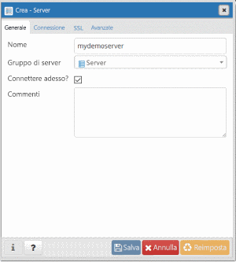
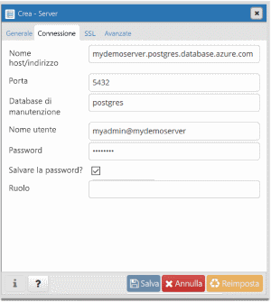
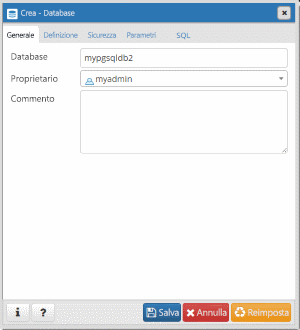

# <a name="quickstart-create-an-azure-database-for-postgresql-using-the-azure-cli"></a>Guida introduttiva: Creare un'istanza di Database di Azure per PostgreSQL con l'interfaccia della riga di comando di Azure
Il database di Azure per PostgreSQL è un servizio gestito che consente di eseguire, gestire e ridimensionare database PostgreSQL a disponibilità elevata nel cloud. L'interfaccia della riga di comando di Azure viene usata per creare e gestire le risorse di Azure dalla riga di comando o negli script. Questa guida di avvio rapido mostra come creare un database di Azure per il server PostgreSQL in un [gruppo di risorse di Azure](https://docs.microsoft.com/azure/azure-resource-manager/resource-group-overview) tramite l'interfaccia della riga di comando di Azure.

Se non si ha una sottoscrizione di Azure, creare un account [gratuito](https://azure.microsoft.com/free/) prima di iniziare.

[!INCLUDE [cloud-shell-try-it](../../includes/cloud-shell-try-it.md)]

Se si sceglie di installare e usare l'interfaccia della riga di comando in locale, per questo articolo è necessario eseguire la versione 2.0 o successiva dell'interfaccia della riga di comando di Azure. Per vedere la versione installata, eseguire il comando `az --version`. Se è necessario eseguire l'installazione o l'aggiornamento, vedere [Installare l'interfaccia della riga di comando di Azure 2.0]( /cli/azure/install-azure-cli). 

Se si esegue l'interfaccia della riga di comando in locale, è necessario accedere al proprio account con il comando [az login](/cli/azure/authenticate-azure-cli?view=interactive-log-in). Si noti la proprietà **id** dell'output del comando per il nome della sottoscrizione corrispondente.
```azurecli-interactive
az login
```

Se si possiedono più sottoscrizioni, scegliere quella appropriata in cui verrà fatturata la risorsa. Selezionare l'ID sottoscrizione specifico sotto l'account tramite il comando [az account set](/cli/azure/account#az_account_set). Sostituire la proprietà **id** dell'output **az login** per la sottoscrizione nel segnaposto dell'ID sottoscrizione.
```azurecli-interactive
az account set --subscription <subscription id>
```

## <a name="create-a-resource-group"></a>Creare un gruppo di risorse

Creare un [gruppo di risorse di Azure](../azure-resource-manager/resource-group-overview.md) con il comando [az group create](/cli/azure/group#az_group_create). Un gruppo di risorse è un contenitore logico in cui le risorse di Azure vengono distribuite e gestite come gruppo. È necessario specificare un nome univoco. Nell'esempio seguente viene creato un gruppo di risorse denominato `myresourcegroup` nella posizione `westus`.
```azurecli-interactive
az group create --name myresourcegroup --location westus
```
## <a name="add-the-extension"></a>Aggiungere l'estensione
Aggiungere l'estensione di gestione di Database di Azure per PostgreSQL aggiornata con il comando seguente:
```azurecli-interactive
az extension add --name rdbms
``` 

Verificare che sia installata la versione dell'estensione corretta. 
```azurecli-interactive
az extension list
```

Il codice JSON restituito includerà gli elementi seguenti: 
```json
{
    "extensionType": "whl",
    "name": "rdbms",
    "version": "0.0.3"
}
```

Se non viene restituita la versione 0.0.3, eseguire questo comando per aggiornare l'estensione: 
```azurecli-interactive
az extension update --name rdbms
```

## <a name="create-an-azure-database-for-postgresql-server"></a>Creare un database di Azure per il server PostgreSQL

Creare un [database di Azure per il server PostgreSQL](overview.md) tramite il comando [az postgres server create](/cli/azure/postgres/server#az_postgres_server_create). Un server contiene un gruppo di database gestiti come gruppo. 

L'esempio seguente crea negli Stati Uniti occidentali un server denominato `mydemoserver` nel gruppo di risorse `myresourcegroup` con l'account di accesso amministratore server `myadmin`. Questo è un server per **utilizzo generico** di **generazione 4** con 2 **vCore**. Poiché viene eseguito il mapping del nome di un server a un nome DNS, il nome deve essere univoco a livello globale in Azure. Sostituire `<server_admin_password>` con il proprio valore.
```azurecli-interactive
az postgres server create --resource-group myresourcegroup --name mydemoserver  --location westus --admin-user myadmin --admin-password <server_admin_password> --sku-name GP_Gen4_2 --version 9.6
```

> [!IMPORTANT]
> L'account di accesso amministratore server e la password qui specificati sono necessari per accedere al server e ai relativi database più avanti in questa guida di avvio rapido. Prendere nota di queste informazioni per usarle in seguito.

Per impostazione predefinita, il database **postgres** viene creato al di sotto del server. Il database [postgres](https://www.postgresql.org/docs/9.6/static/app-initdb.html) è un database predefinito che può essere usato da utenti, utilità e applicazioni di terze parti. 


## <a name="configure-a-server-level-firewall-rule"></a>Configurare una regola del firewall a livello di server

Creare una regola del firewall a livello di server per PostgreSQL Azure tramite il comando [az postgres server firewall-rule create](/cli/azure/postgres/server/firewall-rule#az_postgres_server_firewall_rule_create). Una regola del firewall a livello di server consente a un'applicazione esterna, ad esempio [psql](https://www.postgresql.org/docs/9.2/static/app-psql.html) o [PgAdmin](https://www.pgadmin.org/), di connettersi al server tramite il firewall del servizio PostgreSQL Azure. 

È possibile impostare una regola del firewall relativa a un intervallo IP per consentire la connessione dalla rete. L'esempio seguente usa [az postgres server firewall-rule create](/cli/azure/postgres/server/firewall-rule#az_postgres_server_firewall_rule_create) per creare una regola del firewall `AllowAllIps` per un intervallo di indirizzi IP. Per aprire tutti gli indirizzi IP, usare 0.0.0.0 come indirizzo IP iniziale e 255.255.255.255 come indirizzo finale.
```azurecli-interactive
az postgres server firewall-rule create --resource-group myresourcegroup --server mydemoserver --name AllowAllIps --start-ip-address 0.0.0.0 --end-ip-address 255.255.255.255
```

> [!NOTE]
> Il server PostgreSQL Azure comunica sulla porta 5432. Quando si esegue la connessione da una rete aziendale, il traffico in uscita sulla porta 5432 potrebbe non essere consentito dal firewall della rete. Richiedere al reparto IT di aprire la porta 5432 per connettersi al server di database SQL di Azure.

## <a name="get-the-connection-information"></a>Ottenere le informazioni di connessione

Per connettersi al server, è necessario specificare le informazioni sull'host e le credenziali di accesso.
```azurecli-interactive
az postgres server show --resource-group myresourcegroup --name mydemoserver
```

Il risultato è in formato JSON. Annotare i valori di **administratorLogin** e **fullyQualifiedDomainName**.
```json
{
  "administratorLogin": "myadmin",
  "earliestRestoreDate": null,
  "fullyQualifiedDomainName": "mydemoserver.postgres.database.azure.com",
  "id": "/subscriptions/00000000-0000-0000-0000-000000000000/resourceGroups/myresourcegroup/providers/Microsoft.DBforPostgreSQL/servers/mydemoserver",
  "location": "westus",
  "name": "mydemoserver",
  "resourceGroup": "myresourcegroup",
  "sku": {
    "capacity": 2,
    "family": "Gen4",
    "name": "GP_Gen4_2",
    "size": null,
    "tier": "GeneralPurpose"
  },
  "sslEnforcement": "Enabled",
  "storageProfile": {
    "backupRetentionDays": 7,
    "geoRedundantBackup": "Disabled",
    "storageMb": 5120
  },
  "tags": null,
  "type": "Microsoft.DBforPostgreSQL/servers",
  "userVisibleState": "Ready",
  "version": "9.6"
}
```

## <a name="connect-to-postgresql-database-using-psql"></a>Connettersi al database PostgreSQL tramite psql

Se nel computer client è installato PostgreSQL, è possibile usare un'istanza locale di [psql](https://www.postgresql.org/docs/9.6/static/app-psql.html) per connettersi a un server PostgreSQL Azure. È ora possibile usare l'utilità della riga di comando psql per connettersi al server PostgreSQL Azure.

1. Eseguire il comando psql seguente per connettersi a un database di Azure per il server PostgreSQL
```azurecli-interactive
psql --host=<servername> --port=<port> --username=<user@servername> --dbname=<dbname>
```

  Ad esempio, il comando seguente consente di connettersi al database predefinito denominato **postgres** nel server PostgreSQL **mydemoserver.postgres.database.azure.com** usando le credenziali di accesso. Immettere il valore di `<server_admin_password>` scelto quando viene chiesta la password.
  
  ```azurecli-interactive
psql --host=mydemoserver.postgres.database.azure.com --port=5432 --username=myadmin@mydemoserver --dbname=postgres
```

2.  Dopo aver eseguito la connessione al server, creare un database vuoto nel prompt.
```sql
CREATE DATABASE mypgsqldb;
```

3.  Nel prompt, eseguire il comando seguente per cambiare la connessione nel database appena creato **mypgsqldb**:
```sql
\c mypgsqldb
```

## <a name="connect-to-the-postgresql-server-using-pgadmin"></a>Connettersi al server PostgreSQL usando pgAdmin

pgAdmin è uno strumento open source usato con PostgreSQL. È possibile installare pgAdmin dal [sito Web pgadmin](http://www.pgadmin.org/). La versione di pgAdmin può essere diversa da quella usata in questa guida introduttiva. Se è necessario altro materiale sussidiario, vedere la documentazione di pgAdmin.

1. Aprire l'applicazione pgAdmin nel computer client.

2. Dalla barra degli strumenti passare a **Object** (Oggetto), passare il puntatore del mouse su **Create** (Crea) e selezionare **Server**.

3. Nella finestra di dialogo **Create - Server** (Creazione server) immettere un nome descrittivo univoco per il server nella scheda **General** (Generale), ad esempio **mydemoserver**.

   

4. Nella finestra di dialogo **Create - Server** (Creazione server) compilare la tabella delle impostazioni nella scheda **Connection** (Connessione).

   

    Parametro di pgAdmin |Valore|DESCRIZIONE
    ---|---|---
    Host name/address (Nome host/indirizzo) | Nome server | Nome del server usato in precedenza al momento della creazione del database di Azure per il server PostgreSQL. Il server di esempio è **mydemoserver.postgres.database.azure.com**. Usare il nome di dominio completo (**\*.postgres.database.azure.com**) come nell'esempio. Se non si ricorda il nome del server, seguire la procedura descritta nella sezione precedente per ottenere le informazioni di connessione. 
    Porta | 5432 | Porta da usare quando ci si connette al database di Azure per il server PostgreSQL. 
    Maintenance Database (Database manutenzione) | *postgres* | Nome del database predefinito generato dal sistema.
    Username | Nome di accesso amministratore server | Nome utente di accesso amministratore del server specificato in precedenza al momento della creazione del database di Azure per il server PostgreSQL. Se non si ricorda il nome utente, seguire la procedura descritta nella sezione precedente per ottenere le informazioni di connessione. Il formato è *username@servername*.
    Password | Password amministratore dell'utente | Password scelta in precedenza in questa guida introduttiva durante la creazione del server.
    Ruolo | Lasciare vuoto | Non è necessario specificare un nome di ruolo in questa fase. Lasciare vuoto questo campo.
    SSL Mode (Modalità SSL) | *Require* (Richiedi) | La modalità SSL può essere impostata nella scheda SSL di pgAdmin. Per impostazione predefinita, tutti i server Database di Azure per PostgreSQL vengono creati con l'opzione di applicazione del protocollo SSL attivata. Per disattivare l'applicazione del protocollo SSL, vedere [Applicazione delle connessioni SSL](./concepts-ssl-connection-security.md).
    
5. Selezionare **Salva**.

6. Nel riquadro **Browser** a sinistra espandere il nodo **Servers** (Server). Selezionare il server, ad esempio **mydemoserver**. Fare clic per connettersi.

7. Espandere il nodo del server e quindi il nodo **Databases** (Database) sottostante. L'elenco includerà il database *postgres* esistente e qualsiasi altro database creato. Con Database di Azure per PostgreSQL è possibile creare più database per ogni server.

8. Fare clic con il pulsante destro del mouse su **Databases** (Database), scegliere il menu **Create** (Crea) e quindi selezionare **Database**.

9. Digitare un nome di database a scelta nel campo **Database**, ad esempio **mypgsqldb2**.

10. Selezionare il **proprietario** del database nella casella di riepilogo. Scegliere il nome di accesso amministratore server, ad esempio **myadmin**.

   

11. Selezionare **Save** (Salva) per creare un nuovo database vuoto.

12. Il database creato verrà visualizzato nel riquadro **Browser** nell'elenco dei database sotto il nome del server.


## <a name="clean-up-resources"></a>Pulire le risorse

Pulire tutte le risorse create nella guida di avvio rapido eliminando il [gruppo di risorse di Azure](../azure-resource-manager/resource-group-overview.md).

> [!TIP]
> Altre guide di avvio rapido di questa raccolta si basano sulla presente guida di avvio rapido. Se si prevede di continuare a usare le guide di avvio rapido successive, non pulire le risorse create in questa guida di avvio rapido. Se non si prevede di continuare, seguire questa procedura per eliminare tutte le risorse create da questa guida di avvio rapido nell'interfaccia della riga di comando di Azure.

```azurecli-interactive
az group delete --name myresourcegroup
```

Se si vuole eliminare solo il server appena creato, è possibile eseguire il comando [az postgres server delete](/cli/azure/postgres/server#az_postgres_server_delete).
```azurecli-interactive
az postgres server delete --resource-group myresourcegroup --name mydemoserver
```

## <a name="next-steps"></a>Passaggi successivi
> [!div class="nextstepaction"]
> [Eseguire la migrazione del database usando le funzionalità di esportazione e importazione](./howto-migrate-using-export-and-import.md)

