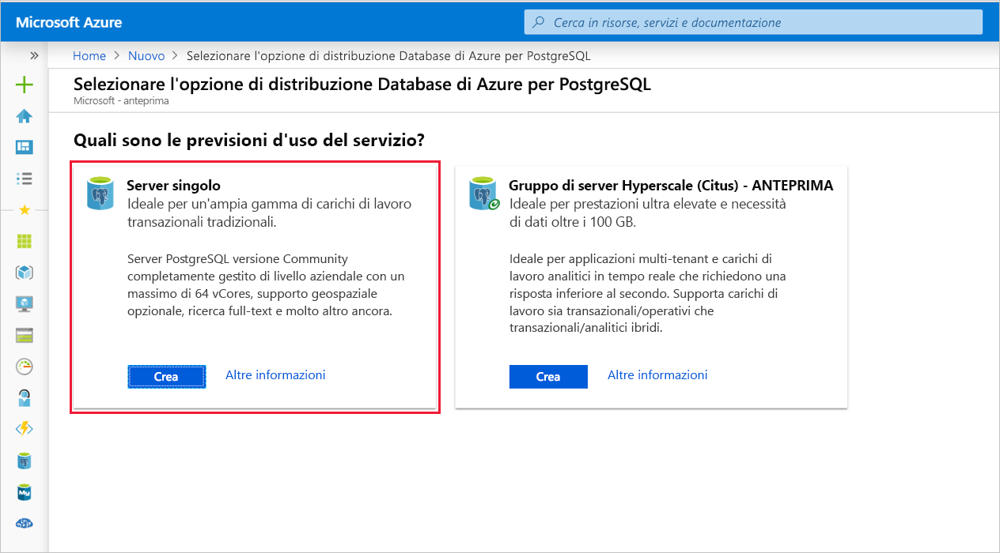
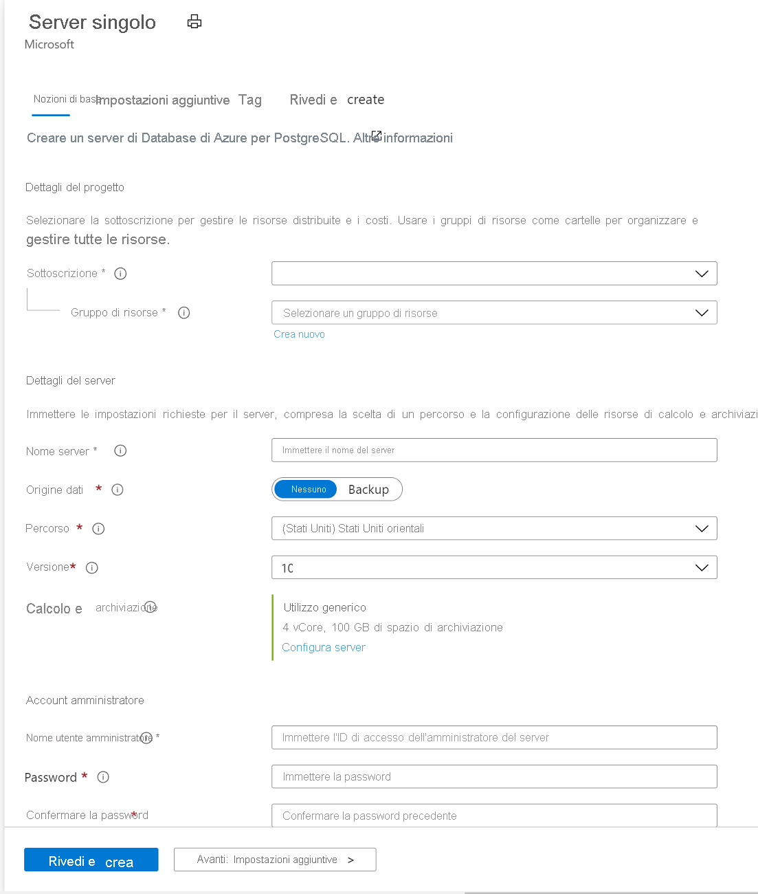

# <a name="quickstart-create-an-azure-database-for-postgresql-server-in-the-azure-portal"></a>Guida introduttiva: Creare un database di Azure per il server PostgreSQL nel portale di Azure

Il database di Azure per PostgreSQL è un servizio gestito usato per eseguire, gestire e ridimensionare database PostgreSQL a disponibilità elevata nel cloud. Questa guida introduttiva illustra come creare un server Database di Azure per PostgreSQL in circa cinque minuti con il portale di Azure.

Se non si ha una sottoscrizione di Azure, creare un [account Azure gratuito](https://azure.microsoft.com/free/) prima di iniziare.

## <a name="sign-in-to-the-azure-portal"></a>Accedere al portale di Azure
Aprire il Web browser e passare al [portale](https://portal.azure.com/). Immettere le credenziali per accedere al portale. La visualizzazione predefinita è il dashboard del servizio.

## <a name="create-an-azure-database-for-postgresql-server"></a>Creare un database di Azure per il server PostgreSQL

Un server Database di Azure per PostgreSQL viene creato con un set definito di [risorse di calcolo e di archiviazione](./concepts-pricing-tiers.md). Il server viene creato all'interno di un [gruppo di risorse di Azure](../azure-resource-manager/management/overview.md).

Per creare un database di Azure per il server PostgreSQL, seguire questa procedura:
1. Nell'angolo in alto a sinistra del portale selezionare **Crea una risorsa** (+).

2. Selezionare **Database** > **Database di Azure per PostgreSQL**.

   > [!div class="mx-imgBorder"]
   > 

3. Selezionare l'opzione di distribuzione **Server singolo**.

   > [!div class="mx-imgBorder"]
   > 

4. Compilare il modulo **Informazioni di base** con le informazioni seguenti:

   > [!div class="mx-imgBorder"]
   > 

   Impostazione|Valore consigliato|Descrizione
   ---|---|---
   Subscription|Nome della sottoscrizione utente|Sottoscrizione di Azure da usare per il server. Se si hanno più sottoscrizioni, scegliere quella in cui viene fatturata la risorsa.
   Resource group|*myresourcegroup*| Nuovo nome di gruppo di risorse o uno esistente nella sottoscrizione.
   Nome server |*mydemoserver*|Nome univoco per identificare il database di Azure per il server PostgreSQL. Al nome del server specificato viene aggiunto il nome di dominio *postgres.database.azure.com*. Il server può contenere solo lettere minuscole, numeri e il segno meno (-). Deve contenere almeno da 3 a 63 caratteri.
   Origine dati | *Nessuno* | Selezionare *Nessuno* per creare un nuovo server da zero. Si selezionerebbe *Backup* se si stesse creando un server da un backup geografico di un server Database di Azure per PostgreSQL esistente.
   Nome utente amministratore |*myadmin*| Account di accesso da usare per la connessione al server. Il nome di accesso dell'amministratore non può essere **azure_superuser**, **azure_pg_admin**, **admin**, **administrator**, **root**, **guest** o **public**. Non può iniziare con **pg_** .
   Password |Password| Nuova password per l'account amministratore del server. Deve contenere tra 8 e 128 caratteri. La password deve contenere caratteri di tre delle categorie seguenti: lettere maiuscole, lettere minuscole, numeri (da 0 a 9) e caratteri non alfanumerici (!, $, #, % e così via).
   Location|Area più vicina ai propri utenti| Località più vicina agli utenti.
   Versione|La versione principale più recente| La versione principale più recente di PostgreSQL, a meno che non si abbiano requisiti specifici diversi.
   Calcolo e archiviazione | **Utilizzo generico**, **Generazione 5**, **2 vCore**, **5 GB**, **7 giorni**, **Con ridondanza geografica** | Configurazioni di calcolo, archiviazione e backup per il nuovo server. Selezionare **Configura server**. Quindi, selezionare il piano tariffario appropriato. Per altre informazioni, vedere [Dettagli sui prezzi](https://azure.microsoft.com/pricing/details/postgresql/server/). Per abilitare l'archiviazione con ridondanza geografica dei backup del server, selezionare **Con ridondanza geografica** in **Opzioni di ridondanza per il backup**. Selezionare **OK**.

   > [!NOTE]
   > È consigliabile usare il piano tariffario Basic se le esigenze di calcolo e di prestazioni I/O sono adeguate per il carico di lavoro. Si noti che i server creati nel piano tariffario Basic non possono essere scalati in un secondo momento per utilizzo generico o ottimizzati per la memoria. 
   
5. Selezionare **Revisione e creazione** per rivedere le selezioni effettuate. Selezionare **Crea** per effettuare il provisioning del server. Questa operazione può richiedere qualche minuto.

6. Sulla barra degli strumenti selezionare l'icona **Notifiche** a forma di campana per monitorare il processo di distribuzione. Una volta completata la distribuzione, selezionare **Vai alla risorsa** per aprire la pagina **Panoramica** del server.

Viene creato un database vuoto, **postgres**. Sarà inoltre disponibile il database **azure_maintenance** usato per separare i processi del servizio gestito dalle azioni dell'utente. Non è possibile accedere al database **azure_maintenance**.

## <a name="configure-a-server-level-firewall-rule"></a>Configurare una regola del firewall a livello di server
Per impostazione predefinita, il server creato non è accessibile pubblicamente ed è necessario concedere le autorizzazioni all'indirizzo IP. Per concedere l'accesso all'indirizzo IP, passare alla risorsa server nel portale di Azure e selezionare **Sicurezza delle connessioni** dal menu a sinistra per la risorsa server. Se non si è certi di come trovare una risorsa, vedere [Come aprire una risorsa](https://docs.microsoft.com/azure/azure-resource-manager/management/manage-resources-portal#open-resources).

> [!div class="mx-imgBorder"]
> 
  
Selezionare ora **Aggiungi indirizzo IP client corrente** e quindi selezionare **Salva**. È possibile aggiungere altri indirizzi IP o fornire un intervallo IP per la connessione al server da tali IP. Per altre informazioni, vedere [Come gestire le regole del firewall](./concepts-firewall-rules.md)
   
> [!NOTE]
> Controllare se la rete consente il traffico in uscita sulla porta 5432 usata dal Database di Azure per PostgreSQL per evitare problemi di connettività.  

## <a name="connect-to-azure-database-for-postgresql-server-using-psql"></a>Connettersi al Database di Azure per PostgreSQL tramite psql

È possibile usare [psql](http://postgresguide.com/utilities/psql.html) o [pgAdmin](https://www.pgadmin.org/docs/pgadmin4/latest/connecting.html), che sono i client PostgreSQL più diffusi. Per questo argomento di avvio rapido si effettuerà la connessione usando psql in [Azure Cloud Shell](https://docs.microsoft.com/azure/cloud-shell/overview) all'interno del portale di Azure.

1. Annotare il nome del server, il nome dell'account di accesso dell'amministratore del server, la password e l'ID sottoscrizione per il server appena creato dalla sezione **Panoramica** del server come illustrato nell'immagine seguente.

2. Avviare Azure Cloud Shell nel portale selezionando l'icona in alto a sinistra come evidenziato nell'immagine seguente.

   > [!NOTE]
   > Se si avvia Cloud Shell per la prima volta, verrà richiesto di creare un gruppo di risorse e un account di archiviazione. Questo passaggio è occasionale e verrà automaticamente collegato per tutte le sessioni. 

   > [!div class="mx-imgBorder"]
   > 

3. Eseguire questo comando nel terminale Azure Cloud Shell. Sostituire i valori con il nome effettivo del server e il nome di accesso dell'utente amministratore. Usare il database vuoto **postgres** con l'utente amministratore nel formato '<admin-username>@<servername> come illustrato di seguito per il Database di Azure per PostgreSQL.

   ```azurecli-interactive
   psql --host=mydemoserver.postgres.database.azure.com --port=5432 --username=myadmin@mydemoserver --dbname=postgres
   ```
 
   Ecco come si presenta l'esperienza nel terminale Cloud Shell
   
   ```bash
    Requesting a Cloud Shell.Succeeded.
    Connecting terminal...

    Welcome to Azure Cloud Shell
 
    Type "az" to use Azure CLI
    Type "help" to learn about Cloud Shell

    user@Azure:~$psql --host=mydemoserver.postgres.database.azure.com --port=5432 --username=myadmin@mydemoserver --dbname=postgres
    Password for user myadmin@mydemoserver.postgres.database.azure.com:
    psql (12.2 (Ubuntu 12.2-2.pgdg16.04+1), server 11.6)
    SSL connection (protocol: TLSv1.2, cipher: ECDHE-RSA-AES256-GCM-SHA384, bits: 256, compression: off)
    Type "help" for help.

    postgres=>
    ```
4. Nello stesso terminale Azure Cloud Shell creare un database **guest**
   ```bash
   postgres=> CREATE DATABASE guest;
   ```

5. Cambiare ora le connessioni passando al database **guest** appena creato

   ```bash
   \c guest
   ```
6. Digitare `\q` e quindi premere INVIO per uscire da psql. 

## <a name="clean-up-resources"></a>Pulire le risorse
La creazione di un Database di Azure per il server PostgreSQL in un gruppo di risorse è stata completata.  Se non si prevede di aver bisogno di queste risorse in futuro, è possibile eliminarle eliminando il gruppo di risorse o è possibile eliminare semplicemente il server PostgreSQL. Per rimuovere il gruppo di risorse, seguire questa procedura:

1. Accedere al portale di Azure e selezionare **Gruppi di risorse**. 
2. Nell'elenco dei gruppi di risorse scegliere il nome del gruppo di risorse.
3. Nella pagina Panoramica del gruppo di risorse selezionare **Elimina gruppo di risorse**.
4. Nella finestra di dialogo di conferma, digitare il nome del gruppo di risorse e quindi selezionare **Elimina**.

Per eliminare il server, è possibile fare clic sul pulsante **Elimina** nella pagina **Panoramica** del server come illustrato di seguito:
> [!div class="mx-imgBorder"]
> 

## <a name="next-steps"></a>Passaggi successivi
> [!div class="nextstepaction"]
> [Eseguire la migrazione del database usando le funzionalità di esportazione e importazione](./howto-migrate-using-export-and-import.md)
