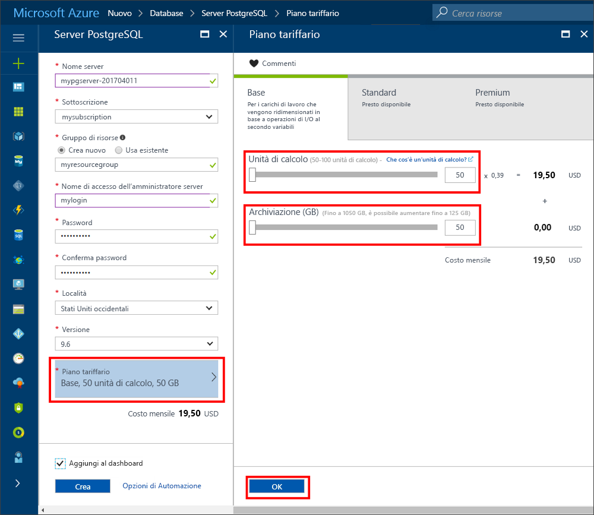

# <a name="create-an-azure-database-for-postgresql-in-the-azure-portal"></a>Creare un database di Azure per PostgreSQL nel portale di Azure

Il database di Azure per PostgreSQL è un servizio gestito che consente di eseguire, gestire e ridimensionare database PostgreSQL a disponibilità elevata nel cloud. Questa guida di avvio rapido mostra come creare un database di Azure per il server PostgreSQL usando il portale di Azure.

Se non si ha una sottoscrizione di Azure, creare un account [gratuito](https://azure.microsoft.com/free/) prima di iniziare.

## <a name="log-in-to-the-azure-portal"></a>Accedere al Portale di Azure.

Accedere al [Portale di Azure](https://portal.azure.com).

## <a name="create-an-azure-database-for-postgresql"></a>Creare un database di Azure per PostgreSQL

Verrà creato un database di Azure per il server PostgreSQL con un set definito di [risorse di calcolo e di archiviazione](./concepts-compute-unit-and-storage.md). Il server viene creato all'interno di un [gruppo di risorse di Azure](../azure-resource-manager/resource-group-overview.md).

Seguire questa procedura per creare un database di Azure per il server PostgreSQL:
1.  Fare clic sul pulsante **Nuovo** nell'angolo superiore sinistro del portale di Azure.
2.  Selezionare **Database** nella pagina **Nuovo** e selezionare **Database di Azure per PostgreSQL** nella pagina **Database**.
 

3.  Compilare il modulo per i dettagli del nuovo server con le informazioni seguenti, come illustrato nell'immagine precedente:
    - Nome server: **mypgserver 20170401**. Scegliere un nome univoco globale, dal momento che questo nome è associato al nome DNS
    - Sottoscrizione: se si hanno più sottoscrizioni, scegliere la sottoscrizione appropriata in cui si trova o viene fatturata la risorsa.
    - Gruppo di risorse: **myresourcegroup**
    - L'accesso dell'amministratore del server e la password scelta
    - Località: selezionare la località più vicina.
    - Versione di PostgreSQL: scegliere la versione più recente.

  > [!IMPORTANT]
  > L'account di accesso amministratore server e la password qui specificati sono necessari per accedere al server e ai relativi database più avanti in questa guida introduttiva. Prendere nota di queste informazioni per usarle in seguito.

4.  Fare clic su **Piano tariffario** per specificare il livello di servizio e il livello delle prestazioni per il nuovo database. Per questa guida di avvio rapido, selezionare il livello **Basic**, **50 unità di calcolo** e **50 GB** di spazio di archiviazione incluso.
 
5.  Fare clic su **OK**.
6.  Fare clic su **Crea** per eseguire il provisioning del server. Il provisioning richiede alcuni minuti.

  > [!TIP]
  > Selezionare l'opzione **Aggiungi al dashboard** per tenere facilmente traccia delle distribuzioni.

7.  Sulla barra degli strumenti fare clic su **Notifiche** per monitorare il processo di distribuzione.
 
   
  Per impostazione predefinita, il database **postgres** viene creato nel server. Il database [postgres](https://www.postgresql.org/docs/9.6/static/app-initdb.html) è un database predefinito che può essere usato da utenti, utilità e applicazioni di terze parti. 

## <a name="configure-a-server-level-firewall-rule"></a>Configurare una regola del firewall a livello di server

Il database di Azure per il servizio PostgreSQL crea un firewall a livello di server. Questo firewall impedisce alle applicazioni e agli strumenti esterni di connettersi al server e ai database nel server, a meno che non venga creata una regola del firewall per aprire il firewall per indirizzi IP specifici. 

1.  Al termine della distribuzione, fare clic su **Tutte le risorse** nel menu a sinistra e digitare il nome **mypgserver-20170401** per la ricerca del server appena creato. Fare clic sul nome del server elencato nei risultati della ricerca. Si apre la pagina **Panoramica** del server in cui vengono fornite le opzioni per una configurazione aggiuntiva.
 
 

2.  Nel pannello del server, selezionare **Sicurezza connessione**. 
3.  Fare clic nella casella di testo in **Nome regola** e aggiungere una nuova regola del firewall per inserire l'intervallo IP nell'elenco elementi consentiti per la connettività. Per questa guida di avvio rapido, consentire tutti gli IP digitando **Nome regola = AllowAllIps**, **Indirizzo IP iniziale = 0.0.0.0** e **Indirizzo IP finale = 255.255.255.255** e quindi fare clic su **Salva**. È possibile impostare una regola del firewall che copra un intervallo di indirizzi IP per consentire la connessione dalla rete in uso.

 

4.  Fare clic su **Salva** e quindi fare clic su **X** per chiudere la pagina **Sicurezza connessione**.

  > [!NOTE]
  > Il server PostgreSQL Azure comunica sulla porta 5432. Se si sta cercando di connettersi da una rete aziendale, il traffico in uscita sulla porta 5432 potrebbe non essere consentito dal firewall della rete. In tal caso, non sarà possibile connettersi al server del database SQL di Azure, a meno che il reparto IT non apra la porta 5432.
  >

## <a name="get-the-connection-information"></a>Ottenere le informazioni di connessione

Quando si crea il database di Azure per il server PostgreSQL, viene creato anche il database **postgres** predefinito. Per connettersi al server del database, è necessario fornire le informazioni sull'host e le credenziali di accesso.

1. Nel menu a sinistra nel portale di Azure fare clic su **Tutte le risorse** e cercare il server appena creato, **mypgserver-20170401**.

  

2. Fare clic sul nome del server **mypgserver-20170401**.
3. Selezionare la pagina **Panoramica** del server. Annotare il **Nome server** e il **nome di accesso dell'amministratore del server**.

 

## <a name="connect-to-postgresql-database-using-psql-in-cloud-shell"></a>Connettersi al database PostgreSQL tramite psql in Cloud Shell

Si usi ora l'utilità della riga di comando psql per connettersi al Database di Azure per il server PostgreSQL. 
1. Avviare Azure Cloud Shell tramite l'icona del terminale nel riquadro di spostamento in alto.

   

2. Azure Cloud Shell si apre nel browser, consentendo di digitare i comandi bash.

   

3. Al prompt di Cloud Shell connettersi al database di Azure per il server PostgreSQL digitando la riga di comandi psql. Il formato seguente è usato per connettersi a un Database di Azure per il server PostgreSQL con l'utilità [psql](https://www.postgresql.org/docs/9.6/static/app-psql.html):
   ```bash
   psql --host=<myserver> --port=<port> --username=<server admin login> --dbname=<database name>
   ```

   Ad esempio, il comando seguente permette di connettersi al database predefinito chiamato **postgres** nel server PostgreSQL **mypgserver-20170401.postgres.database.azure.com** usando le credenziali di accesso. Usare sempre la porta **5432** per la connessione. Quando richiesto, immettere la password di amministratore del server. Usare spazi tra le opzioni -- nel comando come illustrato, ma non usare spazi tra i segni di uguale e i valori dei parametri.

   ```bash
   psql --host=mypgserver-20170401.postgres.database.azure.com --port=5432 --username=mylogin@mypgserver-20170401 --dbname=postgres
   ```
4.  Dopo aver eseguito la connessione al server, creare un database vuoto al prompt.
```bash
CREATE DATABASE mypgsqldb;
```

5.  Al prompt eseguire il comando seguente per cambiare la connessione passando al database appena creato **mypgsqldb**.
```bash
\c mypgsqldb
```

## <a name="connect-to-postgresql-database-using-pgadmin"></a>Connettersi al database PostgreSQL tramite pgAdmin

Per connettersi al server PostgreSQL Azure tramite lo strumento dell'interfaccia utente grafica _pgAdmin_
1.  Avviare l'applicazione _pgAdmin_ nel computer client. È possibile installare _pgAdmin_ da http://www.pgadmin.org/.
2.  Scegliere **Add New Server** (Aggiungi nuovo server) dal menu **Quick Links** (Collegamenti rapidi).
3.  Nella finestra di dialogo **Create - Server** (Creazione server), nella scheda **General** (Generale), immettere un nome descrittivo univoco per il server, ad esempio **Azure PostgreSQL Server**.

4.  Nella finestra di dialogo **Create - Server** (Creazione server), nella scheda **Connection** (Connessione), usare le impostazioni specificate e fare clic su **Save** (Salva).
   
    - **Host Name/Address** (Nome host/Indirizzo): mypgserver-20170401.postgres.database.azure.com 
        - Nome completo del server.
    - **Port** (Porta): 5432
        - Il numero di porta usato dal server di database è 5432.
    - **Maintenance Database** (Database manutenzione): postgres 
        - Nome del database predefinito generato dal sistema.
    - **User Name** (Nome utente): mylogin@mypgserver-20170401 
        - L'account di accesso amministratore server (user@mypgserver) ottenuto in precedenza in questa guida di avvio rapido.
    - **Password**: password scelta al momento della creazione del server in precedenza in questa guida di avvio rapido.
    - **SSL Mode** (Modalità SSL): Require (Richiesta)
        - Per impostazione predefinita, tutti i server PostgreSQL Azure vengono creati con l'opzione di applicazione del protocollo SSL attivata. Per disattivare questa opzione, vedere le informazioni dettagliate nell'argomento relativo all'[applicazione di SSL](./concepts-ssl-connection-security.md).
5.  Fare clic su **Salva**.
6.  Nel riquadro sinistro Browser espandere i gruppi **Server**. Scegliere il server **Azure PostgreSQL Server**.
7.  In **Server** scegliere il server a cui si è connessi e quindi scegliere **Databases** (Database) sotto il server. 
8.  Fare clic con il pulsante destro del mouse su **Databases** (Database) per creare un database.
9.  Scegliere il nome di database **mypgsqldb** e il proprietario, rappresentato dall'account di accesso dell'amministratore del server **mylogin**.
10. Fare clic su **Save** (Salva) per creare un database vuoto.
11. In **Browser**, espandere **Server**. Espandere il server creato e visualizzare il database **mypgsqldb** sotto di esso.
 


## <a name="clean-up-resources"></a>Pulire le risorse
Pulire tutte le risorse create nella guida di avvio rapido eliminando il [gruppo di risorse di Azure](../azure-resource-manager/resource-group-overview.md).

> [!TIP]
> Altre guide di avvio rapido di questa raccolta si basano sulla presente guida di avvio rapido. Se si prevede di continuare a usare le guide di avvio rapido successive, non pulire le risorse create in questa guida di avvio rapido. Se non si prevede di continuare, seguire questa procedura per eliminare tutte le risorse create da questa guida di avvio rapido nel portale di Azure.

1.  Scegliere **Gruppi di risorse** dal menu a sinistra nel portale di Azure e quindi fare clic su **myresourcegroup**.
2.  Nella pagina del gruppo di risorse fare clic su **Elimina**, digitare **myresourcegroup** nella casella di testo e quindi fare clic su Elimina.

Se si vuole eliminare solo il server appena creato:
1.  Nel menu a sinistra nel portale di Azure fare clic su Server PostgreSQL e quindi cercare il server appena creato
2.  Nella pagina Panoramica fare clic sul pulsante Elimina nel riquadro superiore 
3.  Verificare il nome del server che si vuole eliminare e visualizzare i database interessati sotto al server. Digitare **mypgserver-20170401** nella casella di testo e quindi fare clic su Elimina.

## <a name="next-steps"></a>Passaggi successivi
> [!div class="nextstepaction"]
> [Eseguire la migrazione del database usando le funzionalità di esportazione e importazione](./howto-migrate-using-export-and-import.md)

