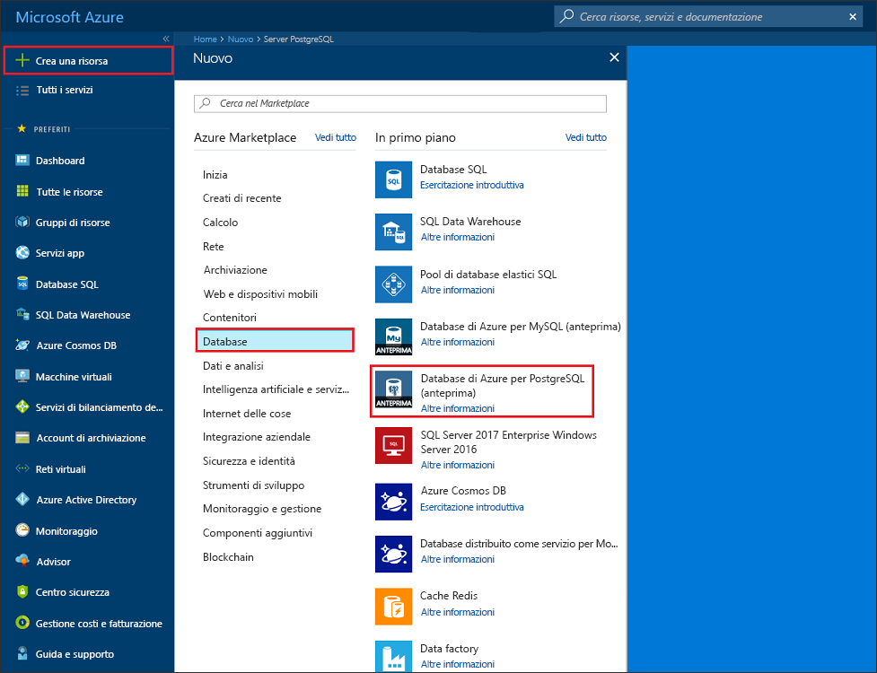
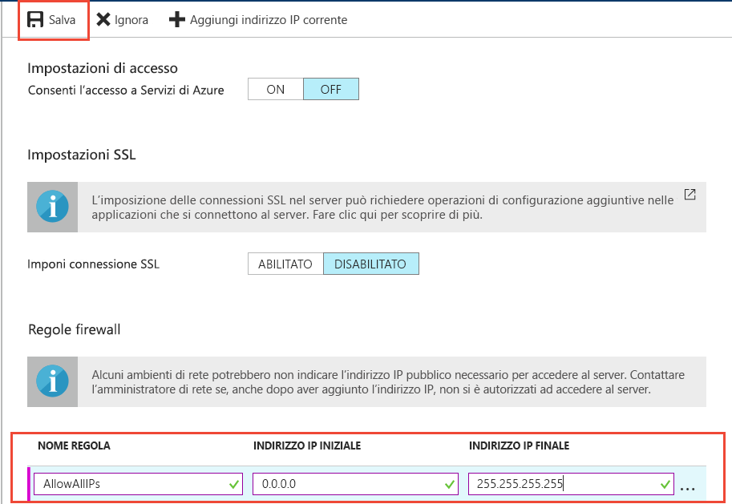
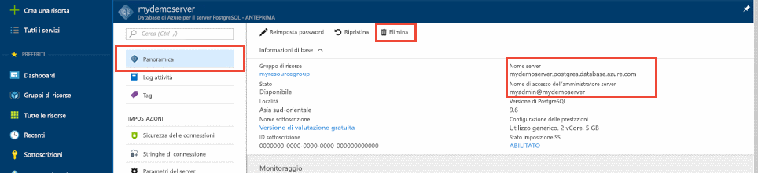

# <a name="design-your-first-azure-database-for-postgresql-using-the-azure-portal"></a>Progettare il primo Database di Azure per PostgreSQL tramite il portale di Azure

Il Database di Azure per PostgreSQL è un servizio gestito che consente di eseguire, gestire e scalare i database PostgreSQL a disponibilità elevata nel cloud. Tramite il portale di Azure, è possibile gestire facilmente il server e progettare un database.

In questa esercitazione si userà il portale di Azure per imparare a:
> [!div class="checklist"]
> * Creare un database di Azure per il server PostgreSQL
> * Configurare il firewall del server
> * Usare l'utilità [**psql**](https://www.postgresql.org/docs/9.6/static/app-psql.html) per creare un database
> * Caricare dati di esempio
> * Eseguire query sui dati
> * Aggiornare i dati
> * Ripristinare i dati

## <a name="prerequisites"></a>Prerequisiti
Se non si ha una sottoscrizione di Azure, creare un account [gratuito](https://azure.microsoft.com/free/) prima di iniziare.

## <a name="log-in-to-the-azure-portal"></a>Accedere al Portale di Azure.
Accedere al [Portale di Azure](https://portal.azure.com).

## <a name="create-an-azure-database-for-postgresql"></a>Creare un database di Azure per PostgreSQL

Verrà creato un database di Azure per il server PostgreSQL con un set definito di [risorse di calcolo e di archiviazione](./concepts-compute-unit-and-storage.md). Il server viene creato all'interno di un [gruppo di risorse di Azure](../azure-resource-manager/resource-group-overview.md).

Seguire questi passaggi per creare un database di Azure per il server PostgreSQL:
1.  Fare clic sul pulsante **+ Nuovo** nell'angolo superiore sinistro del portale di Azure.
2.  Selezionare **Database** nella pagina **Nuovo** e selezionare il **Database di Azure per PostgreSQL** nella pagina **Database**.
 

3.  Compilare il modulo per i dettagli del nuovo server con le informazioni seguenti, come illustrato nell'immagine precedente:
    - Nome server: **mypgserver-20170401** (il nome di un server esegue il mapping al nome DNS e quindi deve essere univoco a livello globale) 
    - Sottoscrizione: se si hanno più sottoscrizioni, scegliere la sottoscrizione appropriata in cui si trova o viene fatturata la risorsa.
    - Gruppo di risorse: **myresourcegroup**
    - L'accesso dell'amministratore del server e la password scelta
    - Località
    - Versione di PostgreSQL

  > [!IMPORTANT]
  > L'account di accesso amministratore server e la password qui specificati sono necessari per accedere al server e ai relativi database più avanti in questa guida di avvio rapido. Prendere nota di queste informazioni per usarle in seguito.

4.  Fare clic su **Piano tariffario** per specificare il livello di servizio e il livello delle prestazioni per il nuovo database. Per questa guida di avvio rapido, selezionare il livello **Basic**, **50 unità di calcolo** e **50 GB** di spazio di archiviazione incluso.
 
5.  Fare clic su **OK**.
6.  Fare clic su **Crea** per eseguire il provisioning del server. Il provisioning richiede alcuni minuti.

  > [!TIP]
  > Selezionare l'opzione **Aggiungi al dashboard** per tenere facilmente traccia delle distribuzioni.

7.  Sulla barra degli strumenti fare clic su **Notifiche** per monitorare il processo di distribuzione.
 
   
  Per impostazione predefinita, il database **postgres** viene creato nel server. Il database [postgres](https://www.postgresql.org/docs/9.6/static/app-initdb.html) è un database predefinito che può essere usato da utenti, utilità e applicazioni di terze parti. 

## <a name="configure-a-server-level-firewall-rule"></a>Configurare una regola del firewall a livello di server

Il database di Azure per il servizio PostgreSQL crea un firewall a livello di server. Per impostazione predefinita, questo firewall impedisce alle applicazioni e agli strumenti esterni di connettersi al server e ai database nel server, a meno che non venga creata una regola del firewall per aprire il firewall per un intervallo di indirizzi IP specifici. 

1.  Al termine della distribuzione, fare clic su **Tutte le risorse** nel menu a sinistra e digitare il nome **mypgserver-20170401** per la ricerca del server appena creato. Fare clic sul nome del server elencato nei risultati della ricerca. Si apre la pagina **Panoramica** del server in cui vengono fornite le opzioni per una configurazione aggiuntiva.
 
 

2.  Nel pannello del server, selezionare **Sicurezza connessione**. 
3.  Fare clic nella casella di testo in **Nome regola** e aggiungere una nuova regola del firewall per inserire l'intervallo IP nell'elenco elementi consentiti per la connettività. Per questa esercitazione, consentire tutti gli indirizzi IP digitando **Rule Name = AllowAllIps**, **IP iniziale = 0.0.0.0** e **IP finale = 255.255.255.255** e quindi fare clic su **Salva**. È possibile impostare una regola del firewall specifica che copra un intervallo di indirizzi IP minore per consentire la connessione dalla rete in uso.
 
 

4.  Fare clic su **Salva** e quindi fare clic su **X** per chiudere la pagina **Sicurezza connessione**.

  > [!NOTE]
  > Il server PostgreSQL Azure comunica sulla porta 5432. Se si sta cercando di connettersi da una rete aziendale, il traffico in uscita sulla porta 5432 potrebbe non essere consentito dal firewall della rete. In tal caso, non sarà possibile connettersi al server del database SQL di Azure, a meno che il reparto IT non apra la porta 5432.
  >


## <a name="get-the-connection-information"></a>Ottenere le informazioni di connessione

Quando si crea il database di Azure per il server PostgreSQL, viene creato anche il database **postgres** predefinito. Per connettersi al server del database, è necessario fornire le informazioni sull'host e le credenziali di accesso.

1. Nel menu a sinistra nel portale di Azure fare clic su **Tutte le risorse** e cercare il server appena creato, **mypgserver-20170401**.

  

3. Fare clic sul nome del server **mypgserver-20170401**.
4. Selezionare la pagina **Panoramica** del server. Annotare il **Nome server** e il **nome di accesso dell'amministratore del server**.

 


## <a name="connect-to-postgresql-database-using-psql-in-cloud-shell"></a>Connettersi al database PostgreSQL tramite psql in Cloud Shell

Si usi ora l'utilità della riga di comando [psql](https://www.postgresql.org/docs/9.6/static/app-psql.html) per connettersi al Database di Azure per il server PostgreSQL. 
1. Avviare Azure Cloud Shell tramite l'icona del terminale nel riquadro di spostamento in alto.

   

2. Azure Cloud Shell si apre nel browser, consentendo di digitare i comandi bash.

   

3. Al prompt di Cloud Shell connettersi al database di Azure per il server PostgreSQL usando i comandi psql. Il formato seguente è usato per connettersi a un Database di Azure per il server PostgreSQL con l'utilità [psql](https://www.postgresql.org/docs/9.6/static/app-psql.html):
   ```bash
   psql --host=<myserver> --port=<port> --username=<server admin login> --dbname=<database name>
   ```

   Ad esempio, il comando seguente consente di connettersi al database predefinito denominato **postgres** nel server PostgreSQL **mypgserver-20170401.postgres.database.azure.com** usando le credenziali di accesso. Immettere la password dell'amministratore del server quando viene richiesto.

   ```bash
   psql --host=mypgserver-20170401.postgres.database.azure.com --port=5432 --username=mylogin@mypgserver-20170401 --dbname=postgres
   ```

## <a name="create-a-new-database"></a>Creare un nuovo database
Dopo aver eseguito la connessione al server, creare un database vuoto al prompt.
```bash
CREATE DATABASE mypgsqldb;
```

Nel prompt, eseguire il comando seguente per cambiare la connessione nel database appena creato **mypgsqldb**.
```bash
\c mypgsqldb
```
## <a name="create-tables-in-the-database"></a>Creare tabelle nel database
Dopo aver appreso come connettersi al Database di Azure per PostgreSQL, si può passare al completamento di alcune attività di base.

In primo luogo, è possibile creare una tabella e caricarla con alcuni dati. Creare una tabella che tiene traccia delle informazioni riguardanti l'inventario.
```sql
CREATE TABLE inventory (
    id serial PRIMARY KEY, 
    name VARCHAR(50), 
    quantity INTEGER
);
```

È possibile visualizzare ora la tabella appena creata nell'elenco di tabelle digitando:
```sql
\dt
```

## <a name="load-data-into-the-tables"></a>Caricare i dati nelle tabelle
Ora che abbiamo una tabella, possiamo inserire alcuni dati al suo interno. Nella finestra del prompt dei comandi aperta, eseguire la query seguente per inserire alcune righe di dati.
```sql
INSERT INTO inventory (id, name, quantity) VALUES (1, 'banana', 150); 
INSERT INTO inventory (id, name, quantity) VALUES (2, 'orange', 154);
```

A questo punto sono presenti due righe di dati di esempio nella tabella di inventario creata in precedenza.

## <a name="query-and-update-the-data-in-the-tables"></a>Eseguire una query e aggiornare i dati nelle tabelle
Eseguire la query seguente per recuperare informazioni dalla tabella di inventario del database. 
```sql
SELECT * FROM inventory;
```

Si possono anche aggiornare query e dati nelle tabelle.
```sql
UPDATE inventory SET quantity = 200 WHERE name = 'banana';
```

Quando si recuperano i dati, è possibile visualizzare i valori aggiornati.
```sql
SELECT * FROM inventory;
```

## <a name="restore-data-to-a-previous-point-in-time"></a>Ripristinare i dati a un punto precedente nel tempo
Si supponga di aver eliminato accidentalmente questa tabella. Questa situazione non è facile da ripristinare. Il Database di Azure per PostgreSQL consente di tornare in qualsiasi punto nel tempo (negli ultimi 7 giorni (Basic) e 35 giorni (Standard)) e ripristinare questo punto nel tempo in un nuovo server. È possibile usare questo nuovo server per ripristinare i dati eliminati. La procedura seguente consente di ripristinare il server **mypgserver-20170401** in un punto precedente all'aggiunta della tabella di inventario.

1.  Nella pagina **Panoramica** del server Database di Azure per PostgreSQL, fare clic su **Ripristino** sulla barra degli strumenti. Si apre la pagina **Ripristina** .
  
2.  Compilare il modulo **Ripristina** con le informazioni obbligatorie:

  
  - **Punto di ripristino**: selezionare un punto nel tempo precedente alla modifica del server
  - **Server di destinazione**: fornire un nuovo nome del server che si desidera ripristinare
  - **Posizione**: non è possibile selezionare l'area, per impostazione predefinita è la stessa del server di origine
  - **Piano tariffario**: non è possibile modificare questo valore quando si ripristina un server. È uguale al server di origine. 
3.  Fare clic su **OK** [per ripristinare il server in un punto nel tempo](./howto-restore-server-portal.md) precedente all'eliminazione della tabella. Il ripristino di un server in un altro punto nel tempo crea un duplicato del nuovo server come il server originale nel punto nel tempo specificato, purché sia entro il periodo di conservazione per il [livello di servizio](./concepts-service-tiers.md) applicato.

## <a name="next-steps"></a>Passaggi successivi
In questa esercitazione si apprenderà come usare il portale di Azure e altre utilità per:
> [!div class="checklist"]
> * Creare un database di Azure per il server PostgreSQL
> * Configurare il firewall del server
> * Usare l'utilità [**psql**](https://www.postgresql.org/docs/9.6/static/app-psql.html) per creare un database
> * Caricare dati di esempio
> * Eseguire query sui dati
> * Aggiornare i dati
> * Ripristinare i dati

Successivamente, per informazioni su come usare l'Interfaccia della riga di comando di Azure per eseguire attività simili, esaminare questa esercitazione: [Progettare il primo Database di Azure per PostgreSQL tramite l'Interfaccia della riga di comando di Azure](tutorial-design-database-using-azure-cli.md)
