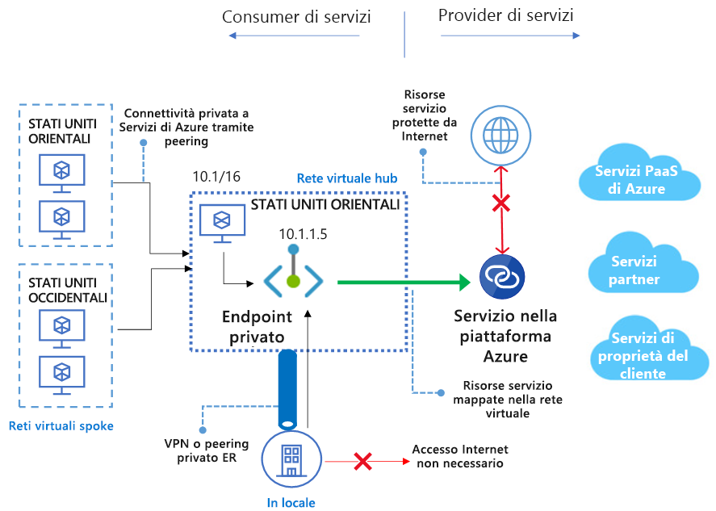

# Che cos'è Collegamento privato di Azure? 
Collegamento privato di Azure consente di accedere ai servizi PaaS di Azure, ad esempio Archiviazione di Azure, Azure Cosmos DB e Database SQL, e ai servizi di clienti/partner ospitati in Azure tramite un [endpoint privato](private-endpoint-overview.md) nella rete virtuale. Il traffico tra la rete virtuale e il servizio attraversa la rete backbone Microsoft, impedendone l'esposizione alla rete Internet pubblica. È anche possibile creare un proprio [servizio Collegamento privato](private-link-service-overview.md) nella rete virtuale e distribuirlo privatamente ai clienti. Collegamento privato di Azure offre un'esperienza di configurazione e utilizzo coerente per i servizi PaaS di Azure, i servizi di proprietà dei clienti e quelli condivisi dei partner.

> [!IMPORTANT]
> Collegamento privato di Azure è ora una funzionalità disponibile a livello generale. L'endpoint privato e Collegamento privato (il servizio alla base di Load Balancer Standard) sono disponibili a livello generale. L'onboarding di soluzioni Azure PaaS diverse in Collegamento privato di Azure verrà eseguito in base a pianificazioni diverse. Per informazioni precise sullo stato di Azure PaaS in Collegamento privato, vedere [Disponibilità](https://docs.microsoft.com/azure/private-link/private-link-overview#availability). Per informazioni sulle limitazioni note, vedere [Endpoint privato](private-endpoint-overview.md#limitations) e [Servizio Collegamento privato](private-link-service-overview.md#limitations). 

## Vantaggi principali
Collegamento privato di Azure offre i vantaggi descritti di seguito.  
- **Accesso privato ai servizi nella piattaforma Azure**: è possibile connettere la rete virtuale ai servizi in esecuzione in Azure privatamente senza che sia necessario un indirizzo IP pubblico nell'origine o nella destinazione. I provider di servizi possono offrirli privatamente nella propria rete virtuale e gli utenti possono accedere a tali servizi privatamente nella rete virtuale locale. La piattaforma di Collegamento privato gestirà la connettività tra l'utente e i servizi tramite la rete backbone di Azure. 
 
- **Reti locali e con peering**: è possibile accedere ai servizi in esecuzione in Azure dall'ambiente locale tramite peering privato ExpressRoute/tunnel VPN (da locale) e reti virtuali con peering usando endpoint privati. Non è necessario configurare il peering pubblico o attraversare Internet per raggiungere il servizio. Questa possibilità offre un modo sicuro per eseguire la migrazione dei carichi di lavoro ad Azure.
 
- **Protezione dall'esfiltrazione di dati**:  con Collegamento privato di Azure, l'endpoint privato nella rete virtuale viene associato a un'istanza specifica della risorsa PaaS del cliente anziché all'intero servizio. Usando l'endpoint privato, gli utenti possono connettersi solo alla risorsa specifica e non a qualsiasi altra risorsa nel servizio. Questo meccanismo predefinito offre protezione contro i rischi di esfiltrazione di dati. 
 
- **Copertura globale**: è possibile connettersi privatamente a servizi in esecuzione in altre aree. La rete virtuale dell'utente può pertanto trovarsi nell'area A e connettersi a servizi con Collegamento privato nell'area B.  
 
- **Estensione a servizi personalizzati**: la stessa esperienza e le stesse funzionalità possono essere sfruttate per offrire privatamente un servizio personalizzato agli utenti in Azure. Posizionando un servizio dietro Load Balancer Standard, è possibile abilitare tale servizio per Collegamento privato. L'utente potrà quindi connettersi direttamente al servizio usando un endpoint privato nella propria rete virtuale. È possibile gestire queste richieste di connessione con un semplice flusso di chiamate di approvazione. Collegamento privato di Azure funziona anche per utenti e servizi appartenenti a tenant di Active Directory diversi. 

## Disponibilità 
 La tabella seguente elenca i servizi Collegamento privato e le aree in cui sono disponibili. 

|Scenario  |Servizi supportati  |Aree disponibili | Stato  |
|:---------|:-------------------|:-----------------|:--------|
|Collegamento privato per servizi di proprietà dei clienti|Servizi Collegamento privato dietro Load Balancer Standard | Tutte le aree pubbliche  | GA   [Altre informazioni](https://docs.microsoft.com/azure/private-link/private-link-service-overview) |
|Collegamento privato per servizi PaaS di Azure   | Archiviazione di Azure        |  Tutte le aree pubbliche      | Anteprima   [Altre informazioni](/azure/storage/common/storage-private-endpoints)  |
|  | Azure Data Lake Storage Gen2        |  Tutte le aree pubbliche      | Anteprima   [Altre informazioni](/azure/storage/common/storage-private-endpoints)  |
|  |  database SQL di Azure         | Tutte le aree pubbliche      |   Anteprima   [Altre informazioni](https://docs.microsoft.com/azure/sql-database/sql-database-private-endpoint-overview)      |
||Azure SQL Data Warehouse| Tutte le aree pubbliche |Anteprima   [Altre informazioni](https://docs.microsoft.com/azure/sql-database/sql-database-private-endpoint-overview)|
||Azure Cosmos DB| Stati Uniti centro-occidentali, Stati Uniti occidentali, Stati Uniti centro-settentrionali |Anteprima   [Altre informazioni](https://docs.microsoft.com/azure/cosmos-db/how-to-configure-private-endpoints)|
|  |  Database di Azure per PostgreSQL - Server singolo         | Tutte le aree pubbliche      |   Anteprima   [Altre informazioni](https://docs.microsoft.com/azure/postgresql/concepts-data-access-and-security-private-link)      |
|  |  Database di Azure per MySQL         | Tutte le aree pubbliche      |   Anteprima   [Altre informazioni](https://docs.microsoft.com/azure/mysql/concepts-data-access-security-private-link)     |
|  |  Database di Azure per MariaDB         | Tutte le aree pubbliche      |   Anteprima   [Altre informazioni](https://docs.microsoft.com/azure/mariadb/concepts-data-access-security-private-link)      |
|  |  Insieme di credenziali chiave di Azure         | Tutte le aree pubbliche      |   Anteprima     [Altre informazioni](https://docs.microsoft.com/azure/key-vault/private-link-service)   |

Per le notifiche più aggiornate, vedere la [pagina degli aggiornamenti relativi a Rete virtuale di Azure](https://azure.microsoft.com/updates/?product=virtual-network).

## Registrazione e monitoraggio

Collegamento privato di Azure viene integrato con Monitoraggio di Azure per consentire di archiviare i log in un account di archiviazione, di trasmettere eventi all'hub eventi o di inviarli ai log di Monitoraggio di Azure. In Monitoraggio di Azure è possibile accedere alle informazioni seguenti. 
- **Endpoint privato**: dati elaborati dall'endpoint privato (IN/OUT)
 
- **Servizio Collegamento privato**:
    - Dati elaborati dal servizio Collegamento privato (IN/OUT)
    - Disponibilità di porte NAT  
 
## Prezzi   
Per informazioni dettagliate sui prezzi, vedere [Prezzi di Collegamento privato di Azure](https://azure.microsoft.com/pricing/details/private-link/).
 
## Domande frequenti  
Per domande frequenti, vedere [Domande frequenti su Collegamento privato di Azure](private-link-faq.md).
 
## Limiti  
Per informazioni sui limiti, vedere [Limiti di Collegamento privato di Azure](../azure-resource-manager/management/azure-subscription-service-limits.md#private-link-limits).

## Contratto di servizio
Per informazioni, vedere [Contratto di servizio per Collegamento privato di Azure](https://azure.microsoft.com/support/legal/sla/private-link/v1_0/).

## Passaggi successivi
- [Creare un endpoint privato per il server di database SQL con il portale ](create-private-endpoint-portal.md)
- [Creare un endpoint privato per il server di database SQL con PowerShell ](create-private-endpoint-powershell.md)
- [Creare un endpoint privato per il server di database SQL con l'interfaccia della riga di comando ](create-private-endpoint-cli.md)
- [Creare un endpoint privato per l'account di archiviazione con il portale ](create-private-endpoint-storage-portal.md)
- [Creare un endpoint privato per l'account Azure Cosmos con il portale ](../cosmos-db/how-to-configure-private-endpoints.md)
- [Creare un servizio Collegamento privato con Azure PowerShell](create-private-link-service-powershell.md)

 
