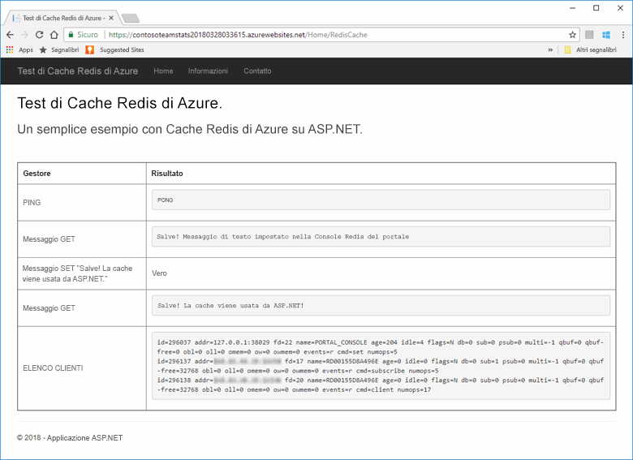
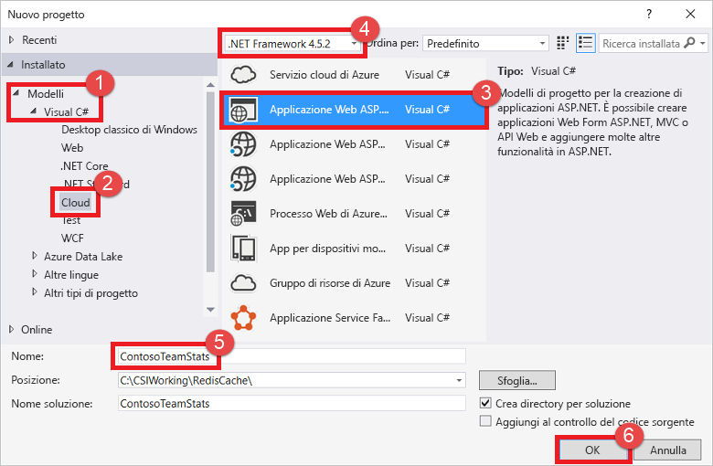
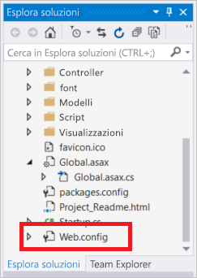
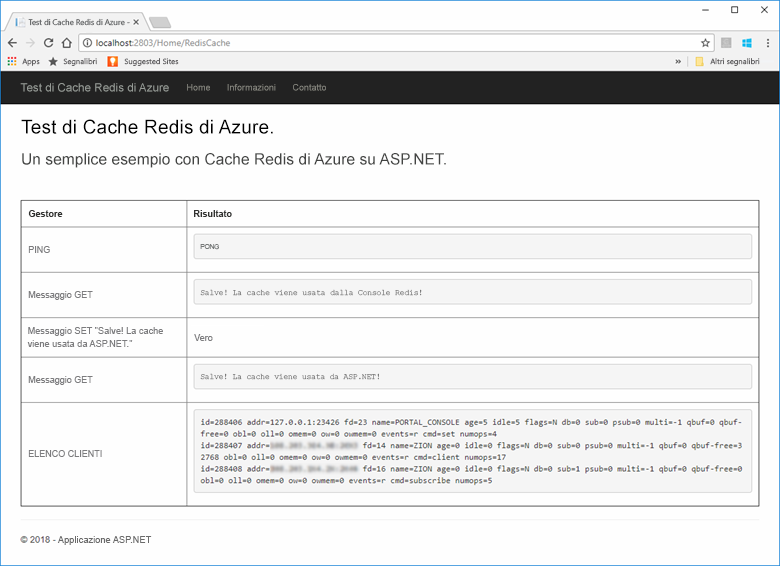
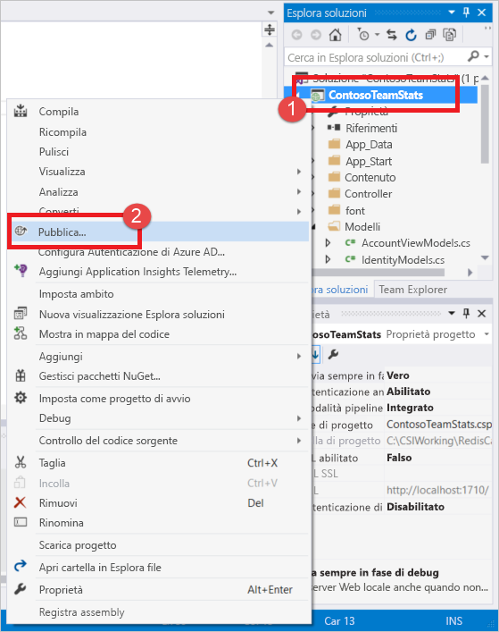
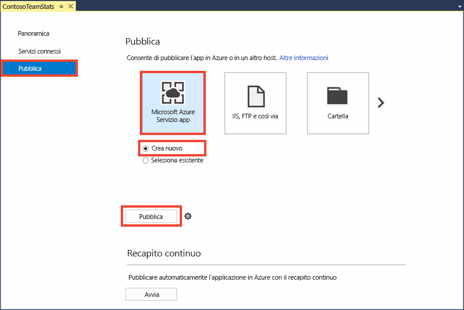
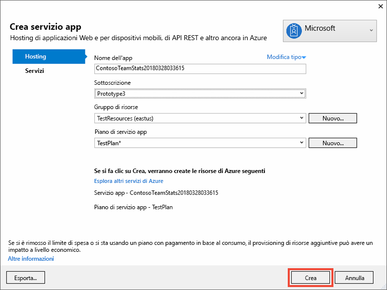
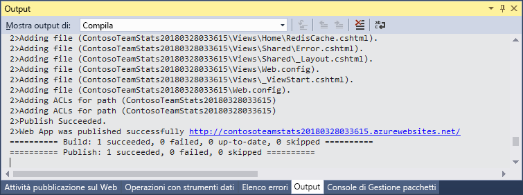
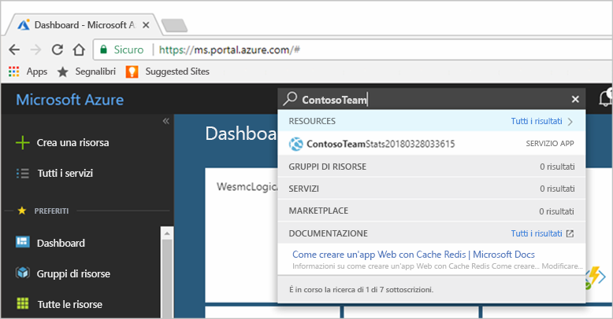
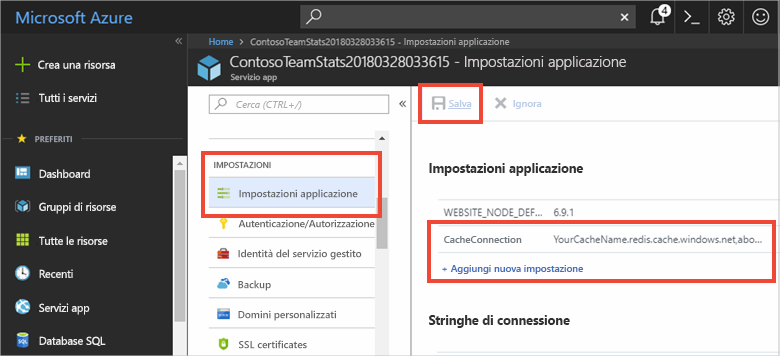

# <a name="quickstart-create-an-aspnet-web-app"></a>Guida introduttiva: Creare un'app Web ASP.NET 

## <a name="introduction"></a>Introduzione

Questa guida introduttiva illustra come creare e distribuire un'applicazione Web ASP.NET in Servizio app di Azure usando Visual Studio 2017. L'applicazione di esempio si connette a Cache Redis di Azure per archiviare e recuperare i dati dalla cache. Al termine della guida introduttiva, si avrà un'app Web in esecuzione, ospitata in Azure, che legge e scrive in Cache Redis di Azure.



[!INCLUDE [quickstarts-free-trial-note](../../includes/quickstarts-free-trial-note.md)]

## <a name="prerequisites"></a>Prerequisiti

Per completare questa guida introduttiva, è necessario installare [Visual Studio 2017](https://www.visualstudio.com/downloads/) con gli ambienti seguenti:
* Sviluppo Web e ASP.NET
* Sviluppo di Azure

## <a name="create-the-visual-studio-project"></a>Creare il progetto di Visual Studio

1. Aprire Visual Studio e quindi selezionare **File** >**Nuovo** > **Progetto**.

2. Nella finestra di dialogo **Nuovo progetto** seguire questa procedura:

    

    a. Nell'elenco **Modelli** espandere il nodo **Visual C#**.

    b. Selezionare **Cloud**.

    c. Selezionare **Applicazione Web ASP.NET**.

    d. Verificare che sia selezionata l'opzione **.NET Framework 4.5.2** o versione successiva.

    e. Nella casella **Nome** digitare un nome per il progetto. Per questo esempio è stato usato il nome **ContosoTeamStats**.

    f. Selezionare **OK**.
   
3. Selezionare **MVC** come tipo di progetto.

4. Assicurarsi che per l'impostazione **Autenticazione** sia selezionata l'opzione **Nessuna autenticazione**. A seconda della versione di Visual Studio, il valore predefinito dell'impostazione **Autenticazione** può essere diverso. Per modificarlo, selezionare **Modifica autenticazione** e quindi **Nessuna autenticazione**.

5. Selezionare **OK** per creare il progetto.

## <a name="create-a-cache"></a>Creare una cache

A questo punto creare la cache per l'app.

[!INCLUDE [redis-cache-create](../../includes/redis-cache-create.md)]

[!INCLUDE [redis-cache-access-keys](../../includes/redis-cache-access-keys.md)]

#### <a name="to-edit-the-cachesecretsconfig-file"></a>Per modificare il file *CacheSecrets.config*

3. Creare un file nel computer denominato *CacheSecrets.config*. Inserirlo in una posizione in cui non verrà archiviato con il codice sorgente dell'applicazione di esempio. Per questa guida introduttiva, il file *CacheSecrets.config* si trova in *C:\AppSecrets\CacheSecrets.config*.

4. Modificare il file *CacheSecrets.config*. Aggiungere quindi il contenuto seguente:

    ```xml
    <appSettings>
        <add key="CacheConnection" value="<cache-name>.redis.cache.windows.net,abortConnect=false,ssl=true,password=<access-key>"/>
    </appSettings>
    ```

5. Sostituire `<cache-name>` con il nome host della cache.

6. Sostituire `<access-key>` con la chiave primaria per la cache.

    > [!TIP]
    > È possibile usare la chiave di accesso secondaria durante la rotazione delle chiavi come chiave alternativa mentre si rigenera la chiave di accesso primaria.
>
7. Salvare il file.

## <a name="update-the-mvc-application"></a>Aggiornare l'applicazione MVC

In questa sezione si aggiorna l'applicazione per supportare una nuova visualizzazione con un semplice test su Cache Redis di Azure.

* [Aggiornare il file web.config con un'impostazione di app per la cache](#Update-the-webconfig-file-with-an-app-setting-for-the-cache)
* [Configurare l'applicazione per l'uso del client StackExchange.Redis](#configure-the-application-to-use-stackexchangeredis)
* [Aggiornare HomeController e Layout](#update-the-homecontroller-and-layout)
* [Aggiungere una nuova visualizzazione di RedisCache](#add-a-new-rediscache-view)

### <a name="update-the-webconfig-file-with-an-app-setting-for-the-cache"></a>Aggiornare il file web.config con un'impostazione di app per la cache

Quando si esegue l'applicazione in locale, queste informazioni in *CacheSecrets.config* vengono usate per connettersi all'istanza di Cache Redis di Azure. In un secondo momento si distribuirà l'applicazione in Azure. A quel punto si configurerà un'impostazione dell'app in Azure usata dall'applicazione per recuperare le informazioni di connessione alla cache al posto di questo file. 

Poiché il file *CacheSecrets.config* non viene distribuito in Azure con l'applicazione, lo si usa solo quando si testa l'applicazione in locale. Conservare queste informazioni nel modo più sicuro possibile per impedire l'accesso ai dati della cache da parte di utenti malintenzionati.

#### <a name="to-update-the-webconfig-file"></a>Per aggiornare il file *web.config*
1. In **Esplora soluzioni** aprire il file *web.config* facendo doppio clic su di esso.

    

2. Nel file *web.config* individuare l'elemento `<appSetting>`. Aggiungere quindi l'attributo `file` seguente. Se è stato usato un nome o un percorso di file diverso, sostituire i valori dell'esempio con questi valori.

* Prima: `<appSettings>`
* Dopo: ` <appSettings file="C:\AppSecrets\CacheSecrets.config">`

Il runtime ASP.NET unisce il contenuto del file esterno con il markup nell'elemento `<appSettings>` . Il runtime ignora l'attributo file, se non è possibile trovare il file specificato. I segreti, ovvero la stringa di connessione alla cache, non sono inclusi come parte del codice sorgente per l'applicazione. Quando si distribuisce l'app Web in Azure, il file *CacheSecrests.config* non viene distribuito.

### <a name="to-configure-the-application-to-use-stackexchangeredis"></a>Per configurare l'applicazione per l'uso di StackExchange.Redis

1. Per configurare l'app per usare il pacchetto NuGet [StackExchange.Redis](https://github.com/StackExchange/StackExchange.Redis) per Visual Studio, selezionare **Strumenti > Gestione pacchetti NuGet > Console di Gestione pacchetti**.

2. Eseguire questo comando nella finestra `Package Manager Console`:

    ```powershell
    Install-Package StackExchange.Redis
    ```

3. Il pacchetto NuGet scarica e aggiunge i riferimenti ad assembly necessari per consentire all'applicazione client di accedere a Cache Redis di Azure con il client della cache StackExchange.Redis. Se si preferisce usare una versione con nome sicuro della libreria client `StackExchange.Redis`, installare il pacchetto `StackExchange.Redis.StrongName`.

### <a name="to-update-the-homecontroller-and-layout"></a>Per aggiornare la classe HomeController e il layout

1. In **Esplora soluzioni** espandere la cartella **Controllers** e aprire il file *HomeController.cs*.

2. Aggiungere le due istruzioni `using` seguenti all'inizio del file per supportare le impostazioni dell'app e del client della cache.

    ```csharp
    using System.Configuration;
    using StackExchange.Redis;
    ```

3. Aggiungere il metodo seguente alla classe `HomeController` per supportare una nuova azione `RedisCache` che esegue alcuni comandi sulla nuova cache.

    ```csharp
        public ActionResult RedisCache()
        {
            ViewBag.Message = "A simple example with Azure Redis Cache on ASP.NET.";

            var lazyConnection = new Lazy<ConnectionMultiplexer>(() =>
            {
                string cacheConnection = ConfigurationManager.AppSettings["CacheConnection"].ToString();
                return ConnectionMultiplexer.Connect(cacheConnection);
            });

            // Connection refers to a property that returns a ConnectionMultiplexer
            // as shown in the previous example.
            IDatabase cache = lazyConnection.Value.GetDatabase();

            // Perform cache operations using the cache object...

            // Simple PING command
            ViewBag.command1 = "PING";
            ViewBag.command1Result = cache.Execute(ViewBag.command1).ToString();

            // Simple get and put of integral data types into the cache
            ViewBag.command2 = "GET Message";
            ViewBag.command2Result = cache.StringGet("Message").ToString();

            ViewBag.command3 = "SET Message \"Hello! The cache is working from ASP.NET!\"";
            ViewBag.command3Result = cache.StringSet("Message", "Hello! The cache is working from ASP.NET!").ToString();

            // Demostrate "SET Message" executed as expected...
            ViewBag.command4 = "GET Message";
            ViewBag.command4Result = cache.StringGet("Message").ToString();

            // Get the client list, useful to see if connection list is growing...
            ViewBag.command5 = "CLIENT LIST";
            ViewBag.command5Result = cache.Execute("CLIENT", "LIST").ToString().Replace(" id=", "\rid=");

            lazyConnection.Value.Dispose();

            return View();
        }
    ```

4. In **Esplora soluzioni** espandere la cartella **Views** > **Shared**. Aprire quindi il file *_Layout.cshtml*.

    Sostituire:

        ```csharp
        @Html.ActionLink("Application name", "Index", "Home", new { area = "" }, new { @class = "navbar-brand" })
        ```

    con:

        ```csharp
        @Html.ActionLink("Azure Redis Cache Test", "RedisCache", "Home", new { area = "" }, new { @class = "navbar-brand" })
        ```

### <a name="to-add-a-new-rediscache-view"></a>Per aggiungere una nuova visualizzazione RedisCache

1. In **Esplora soluzioni** espandere la cartella **Views** e fare clic con il pulsante destro del mouse sula cartella **Home**. Scegliere **Aggiungi** > **Visualizza...** .

2. Nella finestra di dialogo **Aggiungi visualizzazione** immettere **RedisCache** per Nome visualizzazione. Quindi selezionare **Aggiungi**.

3. Sostituire il codice nel file *RedisCache.cshtml* con il codice seguente:

    ```csharp
    @{
        ViewBag.Title = "Azure Redis Cache Test";
    }

    <h2>@ViewBag.Title.</h2>
    <h3>@ViewBag.Message</h3>
    <br /><br />
    <table border="1" cellpadding="10">
        <tr>
            <th>Command</th>
            <th>Result</th>
        </tr>
        <tr>
            <td>@ViewBag.command1</td>
            <td><pre>@ViewBag.command1Result</pre></td>
        </tr>
        <tr>
            <td>@ViewBag.command2</td>
            <td><pre>@ViewBag.command2Result</pre></td>
        </tr>
        <tr>
            <td>@ViewBag.command3</td>
            <td><pre>@ViewBag.command3Result</pre></td>
        </tr>
        <tr>
            <td>@ViewBag.command4</td>
            <td><pre>@ViewBag.command4Result</pre></td>
        </tr>
        <tr>
            <td>@ViewBag.command5</td>
            <td><pre>@ViewBag.command5Result</pre></td>
        </tr>
    </table>
    ```

## <a name="run-the-app-locally"></a>Eseguire l'app in locale

Per impostazione predefinita, il progetto è configurato per ospitare l'app in locale in [IIS Express](https://docs.microsoft.com/iis/extensions/introduction-to-iis-express/iis-express-overview) per i test e il debug.

### <a name="to-run-the-app-locally"></a>Per eseguire l'app in locale
1. In Visual Studio, selezionare **Debug** > **Avvia debug** per compilare e avviare l'app in locale per i test e il debug.

2. Nel browser selezionare **Azure Redis Cache Test** (Test di Cache Redis di Azure) sulla barra di spostamento.

3. Nell'esempio seguente la chiave `Message` in precedenza aveva un valore memorizzato nella cache, impostato usando la console di Cache Redis di Azure nel portale. L'app ha aggiornato questo valore memorizzato nella cache. L'app ha anche eseguito i comandi `PING` e `CLIENT LIST`.

    

## <a name="publish-and-run-in-azure"></a>Pubblicare ed eseguire l'app in Azure

Dopo avere testato correttamente l'app in locale, è possibile distribuirla in Azure ed eseguirla nel cloud.

### <a name="to-publish-the-app-to-azure"></a>Per pubblicare l'app in Azure

1. In Visual Studio fare clic con il pulsante destro del mouse sul nodo di progetto in Esplora soluzioni. Scegliere quindi **Pubblica**.

    

2. Selezionare **Servizio app di Microsoft Azure**, quindi **Crea nuovo** e infine **Pubblica**.

    

3. Nella finestra di dialogo **Crea servizio app** apportare le modifiche seguenti:

    | Impostazione | Valore consigliato | DESCRIZIONE |
    | ------- | :---------------: | ----------- |
    | **Nome app** | Usare il valore predefinito. | Il nome dell'app è il nome host per l'app quando viene distribuita in Azure. Se necessario, per rendere il nome univoco è possibile aggiungere un suffisso timestamp. |
    | **Sottoscrizione** | Scegliere la sottoscrizione di Azure. | Eventuali costi di hosting correlati vengono addebitati in questa sottoscrizione. Se si hanno più sottoscrizioni di Azure, verificare che sia selezionata la sottoscrizione desiderata.|
    | **Gruppo di risorse** | Usare lo stesso gruppo di risorse in cui è stata creata la cache, ad esempio *TestResourceGroup*. | Il gruppo di risorse consente di gestire tutte le risorse come gruppo. Successivamente, quando si vuole eliminare l'app, è sufficiente eliminare il gruppo. |
    | **Piano di servizio app** | Selezionare **Nuovo** e quindi creare un nuovo piano di servizio app denominato *TestingPlan*. <br />Usare lo stesso **percorso** usato durante la creazione della cache. <br />Scegliere il livello **Gratuito** per le dimensioni. | Un piano di servizio app definisce un set di risorse di calcolo per l'esecuzione di un'app Web. |

    

4. Dopo aver configurato le impostazioni di hosting del servizio app, selezionare **Crea**.

5. Monitorare la finestra **Output** in Visual Studio per esaminare lo stato della pubblicazione. Dopo che l'app è stata pubblicata, viene registrato il relativo URL:

    

### <a name="add-the-app-setting-for-the-cache"></a>Aggiungere l'impostazione dell'app per la cache

Dopo che la nuova app è stata pubblicata, aggiungere una nuova impostazione dell'app. Questa impostazione viene usata per archiviare le informazioni di connessione alla cache. 

#### <a name="to-add-the-app-setting"></a>Per aggiungere l'impostazione dell'app 

1. Digitare il nome dell'app nella barra di ricerca nella parte superiore del portale di Azure per trovare l'app appena creata.

    

2. Aggiungere una nuova impostazione dell'app denominata **CacheConnection** per l'app da usare per connettersi alla cache. Usare lo stesso valore configurato per `CacheConnection` nel file *CacheSecrets.config*. Il valore contiene la chiave di accesso e il nome host della cache.

    

### <a name="run-the-app-in-azure"></a>Eseguire l'app in Azure

Nel browser passare all'URL per l'app. L'URL viene visualizzato nei risultati dell'operazione di pubblicazione nella finestra dell'output di Visual Studio. È disponibile anche nel portale di Azure nella pagina di panoramica dell'app creata.

Selezionare **Azure Redis Cache Test** (Test di Cache Redis di Azure) sulla barra di spostamento per testare l'accesso alla cache.


## <a name="clean-up-resources"></a>Pulire le risorse

Se si prosegue con l'esercitazione successiva, è possibile conservare le risorse create in questa guida introduttiva e riutilizzarle.

In caso contrario, se si è terminato il lavoro con l'applicazione di esempio della guida introduttiva, è possibile eliminare le risorse di Azure create in questa guida introduttiva per evitare i costi correlati. 

> [!IMPORTANT]
> L'eliminazione di un gruppo di risorse è irreversibile. Quando si elimina un gruppo di risorse, tutte le risorse in esso contenute vengono eliminate in modo permanente. Assicurarsi di non eliminare accidentalmente il gruppo di risorse sbagliato o le risorse errate. Se le risorse per questo esempio sono state create all'interno di un gruppo di risorse esistente che contiene anche elementi da mantenere, è possibile eliminare ogni elemento singolarmente dai rispettivi pannelli anziché eliminare il gruppo di risorse.

### <a name="to-delete-a-resource-group"></a>Per eliminare un gruppo di risorse

1. Accedere al [portale di Azure](https://portal.azure.com) e selezionare **Gruppi di risorse**.

2. Nella casella **Filtra per nome** immettere il nome del gruppo di risorse. Le istruzioni di questo articolo usano un gruppo di risorse denominato *TestResources*. Nel gruppo di risorse, nell'elenco dei risultati, selezionare **...** e quindi **Elimina gruppo di risorse**.

    

Verrà chiesto di confermare l'eliminazione del gruppo di risorse. Digitare il nome del gruppo di risorse per confermare e quindi selezionare **Elimina**.

Dopo qualche istante, il gruppo di risorse e tutte le risorse che contiene vengono eliminati.

## <a name="next-steps"></a>Passaggi successivi

Nell'esercitazione successiva si userà Cache Redis di Azure in uno scenario più realistico per migliorare le prestazioni di un'app. L'applicazione viene aggiornata per memorizzare nella cache i risultati del tabellone punteggi usando il modello cache-aside con ASP.NET e un database.

> [!div class="nextstepaction"]
> [Creare un tabellone punteggi cache-aside in ASP.NET](cache-web-app-cache-aside-leaderboard.md)
