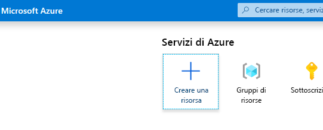
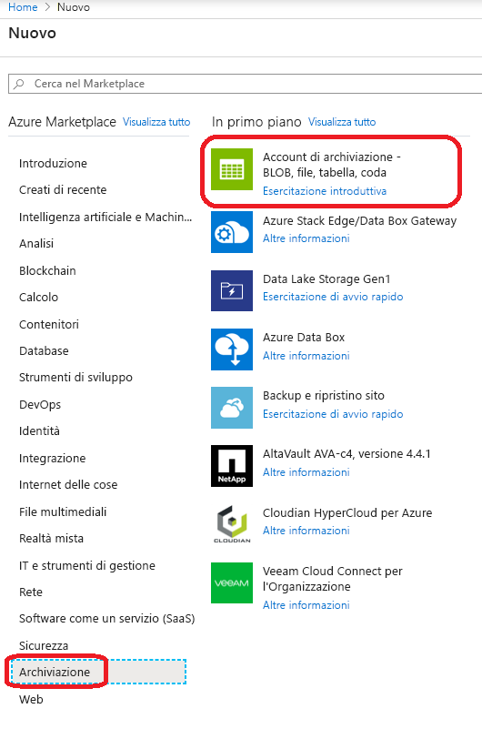
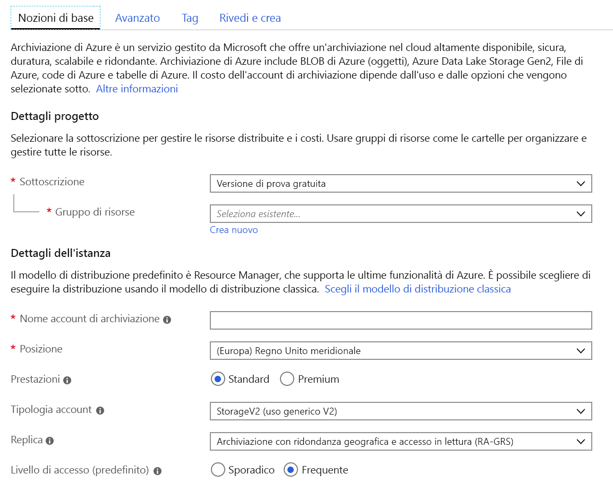
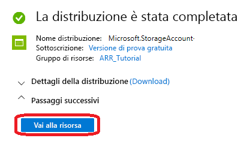
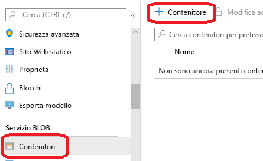
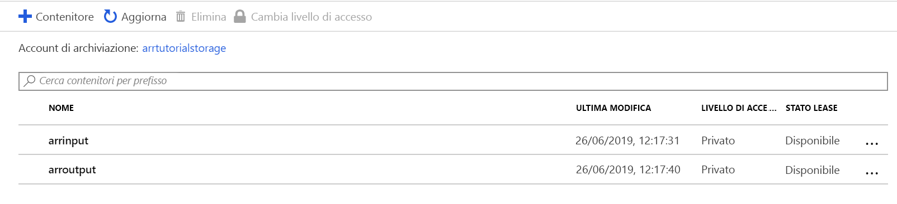
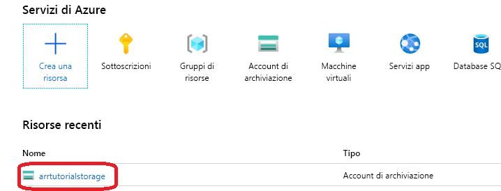
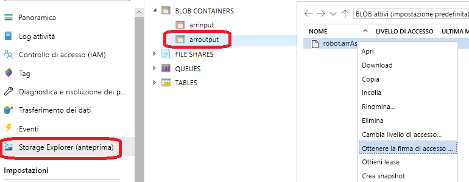

# <a name="quickstart-convert-a-model-for-rendering"></a>Avvio rapido: Convertire un modello per il rendering

Nell'argomento di [Avvio rapido: Eseguire il rendering di un modello con Unity](render-model.md) è stato descritto come usare il progetto di esempio di Unity per eseguire il rendering di un modello predefinito. Questa guida illustra come convertire i propri modelli.

Si apprenderà come:

> [!div class="checklist"]
>
> * Configurare un account di archiviazione BLOB di Azure per l'input e l'output
> * Caricare e convertire un modello 3D per l'uso con Rendering remoto di Azure
> * Includere il modello 3D convertito in un'applicazione per il rendering

## <a name="prerequisites"></a>Prerequisiti

* Completare [Avvio rapido: Eseguire il rendering di un modello con Unity](render-model.md)
* Installare Azure PowerShell [(documentazione)](https://docs.microsoft.com/powershell/azure/)
  * Aprire una sessione di PowerShell con diritti di amministratore
  * Eseguire: `Install-Module -Name Az -AllowClobber`

## <a name="overview"></a>Panoramica

Il renderer sul server non può funzionare direttamente con i formati di modello di origine, ad esempio FBX o GLTF. Al contrario, richiede che il modello sia in un formato binario proprietario.
Il servizio di conversione usa i modelli presenti nell'archiviazione BLOB di Azure e scrive i modelli convertiti in un contenitore di archiviazione BLOB di Azure fornito.

È necessario:

* Una sottoscrizione di Azure.
* Un account 'Archiviazione V2' nella sottoscrizione
* Un contenitore di archiviazione BLOB per il modello di input
* Un contenitore di archiviazione BLOB per i dati di output
* Un modello da convertire, vedere [modelli di esempio](../samples/sample-model.md)
  * Vedere l'elenco di [formati di origine supportati](../how-tos/conversion/model-conversion.md#supported-source-formats)
  * Per usare lo script di conversione di esempio, assicurarsi di preparare una cartella di input che contenga il modello e tutte le dipendenze esterne (ad esempio, trame esterne o geometria)

## <a name="azure-setup"></a>Configurazione di Azure

Se non si dispone ancora di un account, passare a [https://azure.microsoft.com/get-started/](https://azure.microsoft.com/get-started/), fare clic sull'opzione account gratuito e seguire le istruzioni.

Dopo aver creato un account Azure, passare a [https://ms.portal.azure.com/#home](https://ms.portal.azure.com/#home).

### <a name="storage-account-creation"></a>Creazione di un account di archiviazione

Per creare l'archiviazione BLOB, è necessario prima di tutto un account di archiviazione.
Per crearne uno, fare clic sul pulsante "Crea una risorsa":



Nella nuova schermata scegliere **Archiviazione** sul lato sinistro, quindi **Account di archiviazione - BLOB, file, tabella, coda** dalla colonna successiva:



Se si fa clic su questo pulsante, verrà visualizzata la schermata seguente con le proprietà di archiviazione da compilare:



Compilare il modulo nel modo seguente:

* Creare un nuovo gruppo di risorse dal collegamento sotto la casella di riepilogo a discesa e denominarlo **ARR_Tutorial**
* Immettere un nome univoco in **Nome account di archiviazione**. **Questo nome deve essere univoco a livello globale**. In caso contrario, verrà visualizzato un messaggio che informa che il nome è già in uso. Nell'ambito di questo avvio rapido verrà usato il nome **arrtutorialstorage**. Di conseguenza, è necessario sostituirlo con il proprio nome per qualsiasi occorrenza in questo avvio rapido.
* Selezionare una **posizione** nelle vicinanze. Idealmente, usare la stessa posizione usata per configurare il rendering nell'altro argomento di avvio rapido.
* **Prestazioni** deve essere impostato su 'Standard'.
* **Tipo di account** deve essere impostato su 'Archiviazione V2 (utilizzo generico v2)'
* **Replica** deve essere impostato su 'Archiviazione con ridondanza geografica e accesso in lettura'
* **Livello di accesso** deve essere impostato su 'Accesso frequente'

Non è necessario modificare le proprietà nelle altre schede, quindi è possibile procedere con **"Rivedi e crea"** e quindi seguire i passaggi per completare la configurazione.

Il sito Web informa ora lo stato di avanzamento della distribuzione e riporta infine "La distribuzione è stata completata". Fare clic sul pulsante **"Vai alla risorsa"** per i passaggi successivi:



### <a name="blob-storage-creation"></a>Creazione dell'archiviazione BLOB

Sono quindi necessari due contenitori BLOB, uno per l'input e uno per l'output.

Dal pulsante **"Vai alla risorsa"** mostrato sopra, si accede a una pagina con un pannello a sinistra che contiene un menu elenco. In tale elenco sotto la categoria "**servizio BLOB**" fare clic sul pulsante **"Contenitori"** :



Premere il pulsante **"+ Contenitore"** per creare il contenitore di archiviazione BLOB di **input**.
Usare le impostazioni seguenti durante la creazione:
  
* Nome = arrInput
* Livello di accesso pubblico = Privato

Dopo aver creato il contenitore, fare di nuovo clic su **+ Contenitore** e ripetere con queste impostazioni per il contenitore di **output**:

* Nome = arroutput
* Livello di accesso pubblico = Privato

A questo punto dovrebbero essere presenti due contenitori di archiviazione BLOB:



## <a name="run-the-conversion"></a>Eseguire la conversione

Per semplificare la chiamata al servizio di conversione degli asset, viene fornito uno script di utilità. Si trova nella cartella *Script* e viene chiamato **Conversion.ps1**.

In particolare, questo script

1. carica tutti i file di una determinata directory dal disco locale al contenitore di archiviazione di input
1. chiama [l'API REST per la conversione di asset](../how-tos/conversion/conversion-rest-api.md) che recupererà i dati dal contenitore di archiviazione di input e avvierà una conversione che restituirà un ID conversione
1. esegue il polling dell'API di stato della conversione con l'ID conversione recuperato fino a quando il processo di conversione non termina con esito positivo o negativo
1. recupera un collegamento all'asset convertito nell'archiviazione di output

Lo script legge la configurazione dal file *Scripts\arrconfig.json*. Aprire il file JSON in un editor di testo.

```json
{
    "accountSettings": {
        "arrAccountId": "8*******-****-****-****-*********d7e",
        "arrAccountKey": "R***************************************l04=",
        "region": "<your-region>"
    },
    "renderingSessionSettings": {
        "vmSize": "standard",
        "maxLeaseTime": "1:00:00"
    },
    "assetConversionSettings": {
        "localAssetDirectoryPath": "D:\\tmp\\robot",
        "resourceGroup": "ARR_Tutorial",
        "storageAccountName": "arrexamplestorage",
        "blobInputContainerName": "arrinput",
        "inputFolderPath": "robotConversion",
        "inputAssetPath": "robot.fbx",
        "blobOutputContainerName": "arroutput",
        "outputFolderPath":"converted/robot",
        "outputAssetFileName": "robot.arrAsset"
    }
}
```

La configurazione all'interno del gruppo **accountSettings** (ID e chiave dell'account) deve essere compilata in modo analogo alle credenziali nell'argomento di [avvio rapido Eseguire il rendering di un modello con Unity](render-model.md).

All'interno del gruppo **assetConversionSettings** assicurarsi di modificare **resourceGroup**, **blobInputContainerName** e **blobOutputContainerName** come illustrato in precedenza.
Si noti che il valore **arrtutorialstorage** deve essere sostituito con il nome univoco scelto durante la creazione dell'account di archiviazione.

Modificare **localAssetDirectoryPath** in modo che punti alla directory sul disco che contiene il modello che si intende convertire. Assicurarsi di inserire correttamente le barre rovesciate di escape ("\\") nel percorso usando due barre rovesciate ("\\\\").

Tutti i dati del percorso specificato in **localAssetDirectoryPath** verranno caricati nel contenitore BLOB **blobInputContainerName** in un sottopercorso specificato da **inputFolderPath**. Quindi, nella configurazione di esempio illustrata sopra il contenuto della directory "D:\\tmp\\robot" verrà caricato nel contenitore BLOB "arrInput" dell'account di archiviazione "arrtutorialstorage" nel percorso "robotConversion". I file già esistenti verranno sovrascritti.

Modificare **inputAssetPath** nel percorso del modello da convertire. Il percorso è relativo a localAssetDirectoryPath. Usare "/" invece di "\\" come separatore di percorso. Quindi, per un file "robot.fbx" che si trova direttamente in "D:\\tmp\\robot" usare "robot.fbx".

Una volta convertito, il modello verrà scritto di nuovo nel contenitore di archiviazione fornito da **blobOutputContainerName**. È possibile specificare un sottopercorso fornendo il valore **outputFolderPath** facoltativo. Nell'esempio precedente l'oggetto "robot. arrAsset" risultante verrà copiato nel contenitore BLOB di output in "converted/robot".

L'impostazione di configurazione **outputAssetFileName** determina il nome dell'asset convertito. Il parametro è facoltativo e in caso contrario il nome del file di output verrà dedotto dal nome del file di input.

Aprire una sessione di PowerShell, assicurarsi di aver installato *Azure PowerShell* come indicato nei [prerequisiti](#prerequisites). Accedere quindi alla sottoscrizione con il comando seguente e seguire le istruzioni visualizzate:

```PowerShell
Connect-AzAccount
```

> [!NOTE]
> Se l'organizzazione ha più di una sottoscrizione, può essere necessario specificare gli argomenti SubscriptionId e Tenant. Per i dettagli, vedere la [documentazione di Connect-AzAccount](https://docs.microsoft.com/powershell/module/az.accounts/connect-azaccount).

Passare alla directory `azure-remote-rendering\Scripts` ed eseguire lo script di conversione:

```PowerShell
.\Conversion.ps1 -UseContainerSas
```

Verrà visualizzata una schermata analoga alla seguente: 

## <a name="insert-new-model-into-quickstart-sample-app"></a>Inserire un nuovo modello nell'app di esempio della guida di avvio rapido

Lo script di conversione genera un URI di *firma di accesso condiviso* per il modello convertito. È ora possibile copiare questo URI come **Nome modello** nell'app di esempio dell'avvio rapido (vedere [Avvio rapido: Eseguire il rendering di un modello con Unity](render-model.md)).


 L'esempio dovrebbe ora caricare ed eseguire il rendering del modello personalizzato.

## <a name="optional-re-creating-a-sas-uri"></a>Facoltativo: Ricreazione di un URI di firma di accesso condiviso

L'URI di firma di accesso condiviso creato dallo script di conversione sarà valido solo per 24 ore. Tuttavia, dopo la scadenza non è necessario ripetere la conversione del modello. È invece possibile creare una nuova firma di accesso condiviso nel portale, come descritto nei passaggi successivi:

1. Accedere al [portale di Azure](https://www.portal.azure.com)
1. Fare clic sulla risorsa **Account di archiviazione**: 
1. Nella schermata seguente fare clic su **Storage Explorer** nel pannello a sinistra e trovare il modello di output (file *.arrAsset*) nel contenitore di archiviazione BLOB *arroutput*. Fare clic con il pulsante destro del mouse sul file e scegliere **Ottieni firma di accesso condiviso** nel menu di scelta rapida: 
1. Verrà visualizzata una nuova schermata in cui è possibile selezionare una data di scadenza. Premere **Crea** e copiare l'URI visualizzato nella finestra di dialogo successiva. Questo nuovo URI sostituisce l'URI temporaneo creato dallo script.

## <a name="next-steps"></a>Passaggi successivi

Ora che si conoscono le nozioni di base, vedere le esercitazioni per ottenere una conoscenza più approfondita.

Per informazioni dettagliate sulla conversione dei modelli, vedere [Usare l'API REST per la conversione di modelli](../how-tos/conversion/conversion-rest-api.md).

> [!div class="nextstepaction"]
> [Esercitazione: Visualizzazione di un modello di cui è stato eseguito il rendering in remoto](../tutorials/unity/view-remote-models/view-remote-models.md)
