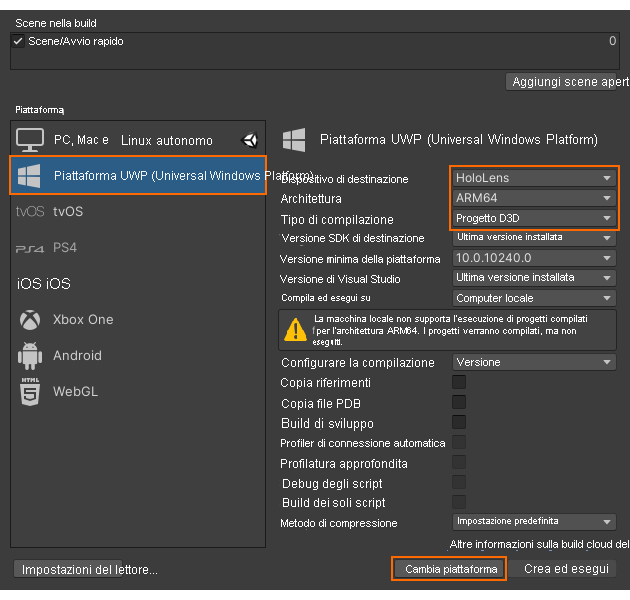

# Guida introduttiva: Distribuire un esempio di Unity in HoloLens

Questo argomento di avvio rapido illustra come distribuire ed eseguire l'app di esempio dell'avvio rapido per Unity in un HoloLens 2.

In questo argomento di avvio rapido si apprenderà come:

> [!div class="checklist"]
>
>* Compilare l'app di esempio dell'avvio rapido per HoloLens
>* Distribuire l'esempio nel dispositivo
>* Eseguire l'esempio nel dispositivo

## Prerequisiti

In questo argomento di avvio rapido verrà distribuito il progetto di esempio creato nell'argomento [Avvio rapido: Eseguire il rendering di un modello con Unity](render-model.md).

Assicurarsi che le credenziali vengano salvate correttamente con la scena e che sia possibile connettersi a una sessione dall'editor di Unity.

## Compilare il progetto di esempio

1. Aprire *File -> Build Settings* (File -> Impostazioni compilazione).
1. Impostare *Platform* (Piattaforma) su **Universal Windows Platform** (Piattaforma UWP)
1. Impostare *Target Device* (Dispositivo di destinazione) su **HoloLens**
1. Impostare *Architecture* (Architettura) su **ARM64**
1. Impostare *Build Type* (Tipo di compilazione) su **D3D Project** 
1. Selezionare **Switch to Platform** (Passa alla piattaforma)
1. Quando si preme **Build** (Compila) o 'Build And Run' (Compila ed esegui), verrà richiesto di selezionare una cartella in cui archiviare la soluzione
1. Aprire il file **Quickstart.sln** generato con Visual Studio
1. Impostare la configurazione su **Release** e **ARM64**
1. Impostare la modalità del debugger su **Remote Machine** (Computer remoto) 
1. Compilare la soluzione (F7)
1. Per il progetto 'QuickStart' passare a *Properties > Debugging* (Proprietà > Debug)
    1. Assicurarsi che la configurazione *Release* sia attiva
    1. Impostare *Debugger to Launch* (Debugger da avviare) su **Remote Machine** (Computer remoto)
    1. Impostare *Machine Name* (Nome computer) su **IP of your HoleLens** (IP HoleLens)

## Avviare il progetto di esempio

1. Connettere il dispositivo HoloLens con un cavo USB al PC.
1. Avviare il debugger in Visual Studio (F5). L'app verrà distribuita automaticamente nel dispositivo.

L'app di esempio dovrebbe avviarsi e quindi avviare una nuova sessione. Dopo qualche istante la sessione sarà pronta e il modello di cui è stato eseguito il rendering in remoto verrà visualizzato in primo piano.
Se si vuole avviare l'esempio una seconda volta in seguito, è possibile trovarlo anche nel menu Start di HoloLens.

## Passaggi successivi

Nell'argomento di avvio rapido successivo si esaminerà la conversione di un modello personalizzato.

> [!div class="nextstepaction"]
> [Avvio rapido: Convertire un modello per il rendering](convert-model.md)
