<properties
   pageTitle="Eseguire qualsiasi app su qualsiasi dispositivo con RemoteApp"
   description="Informazioni su come condividere con gli utenti qualsiasi applicazione tramite RemoteApp."
   services="remoteapp"
   documentationCenter=""
   authors="lizap"
   manager="mbaldwin"
   editor=""/>

<tags
   ms.service="remoteapp"
   ms.devlang="na"
   ms.topic="hero-article"
   ms.tgt_pltfrm="na"
   ms.workload="compute"
   ms.date="05/28/2015"
   ms.author="elizapo"/>

# Eseguire qualsiasi app su qualsiasi dispositivo con RemoteApp

Questa esercitazione illustrerà come eseguire un'applicazione Windows ovunque e veramente su qualsiasi dispositivo. Che si tratti di Internet Explorer 6, un'applicazione personalizzata scritta 10 anni fa, o di un'app di Office, gli utenti non saranno più vincolati a uno specifico sistema operativo (come Windows XP) per quelle poche applicazioni.

Grazie a RemoteApp, gli utenti possono usare dispositivi Android o Apple e usufruire della stessa esperienza che ottengono in Windows (o con i dispositivi Windows Phone). A questo scopo, occorre ospitare l'applicazione Windows in una raccolta di macchine virtuali Windows in Azure, dove gli utenti possono ottenere l'accesso ovunque sia disponibile una connessione Internet. Ecco come procedere.

Per questa esercitazione si condividerà Access con tutti gli utenti. Poiché Access è un database e come tale è necessario che sia utile, si eseguiranno alcuni passaggi aggiuntivi per consentire agli utenti di accedere alla condivisione dei dati di Access.

[AZURE.INCLUDE [free-trial-note](../../includes/free-trial-note.md)]

## Creare una raccolta in RemoteApp

Iniziare con la creazione di una raccolta, che servirà come contenitore per le app e gli utenti. Ogni raccolta si basa su un'immagine. È possibile creare un'immagine personalizzata o usarne una fornita con la sottoscrizione. Per questa esercitazione si userà l'immagine di valutazione di Office 2013 che contiene l'app da condividere.

1. Nel portale di gestione di Azure scorrere verso il basso il pannello di navigazione sinistro fino a visualizzare Azure RemoteApp. Aprire la pagina.
2. Fare clic su **Crea una raccolta RemoteApp**.
3. Fare clic su **Creazione rapida** e immettere un nome per la raccolta.
4. Selezionare l'area da usare per creare la raccolta. Per un'esperienza ottimale, selezionare l'area geograficamente più vicina alla località in cui gli utenti accederanno all'app. Ad esempio, in questa esercitazione gli utenti risiederanno a Redmond, Washington. L'area di Azure più vicina è **Stati Uniti occidentali**.
5. Selezionare il piano di fatturazione da usare. Il piano di fatturazione di base prevede 16 utenti in una macchina virtuale di Azure di grandi dimensioni, mentre il piano di fatturazione standard include 10 in una macchina virtuale di Azure di grandi dimensioni. Come esempio generale, il piano di base è un'ottima soluzione per un flusso di lavoro di tipo immissione dati. Per un'app di produttività come Office è consigliabile il piano standard.
6. Infine selezionare l'immagine di Office 2013 Professional. Questa immagine contiene le app di Office 2013.  
7. Fare clic su **Crea raccolta RemoteApp**.

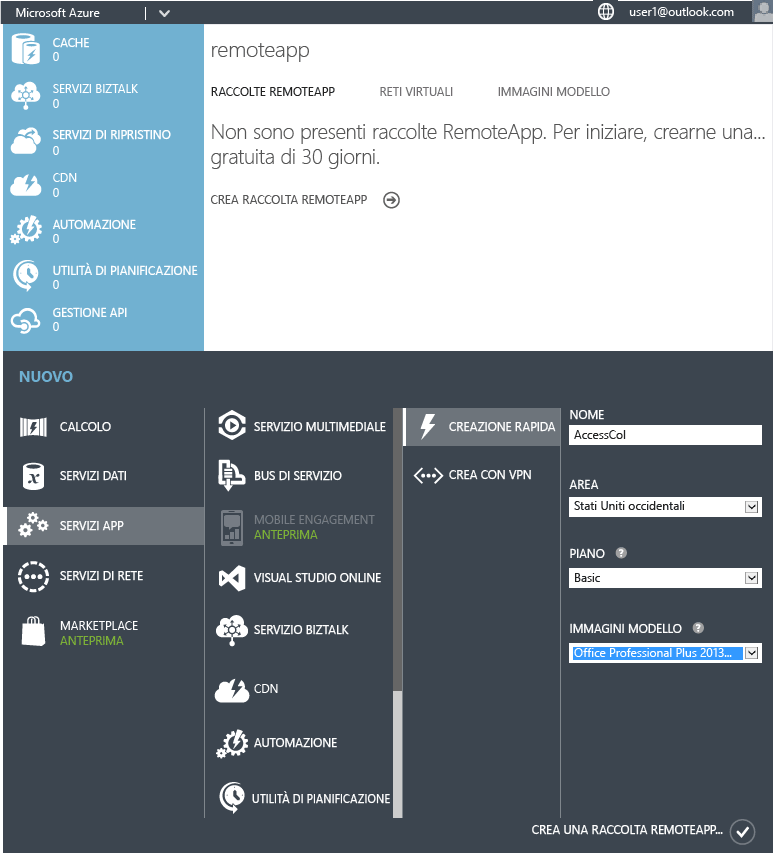

Viene avviata la creazione della raccolta che potrebbe richiedere fino a un'ora.

A questo punto è possibile aggiungere gli utenti.

## Condividere l'app con gli utenti

Dopo la creazione della raccolta, pubblicare Access per gli utenti e aggiungere gli utenti che devono potervi accedere.

Se durante la creazione della raccolta ci si è spostati dal nodo di Azure RemoteApp, ecco come ritornarvi dalla home page di Azure.

1. Fare clic su **RemoteApp** nel pannello di navigazione sinistro.
2. Fare clic sulla raccolta creata in precedenza per accedere ad altre opzioni e configurare la raccolta. 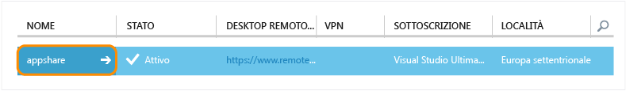
3. Nella scheda **Pubblicazione** fare clic su **Pubblica** nella parte inferiore della schermata e quindi fare clic su **Pubblica programmi del menu Start**. 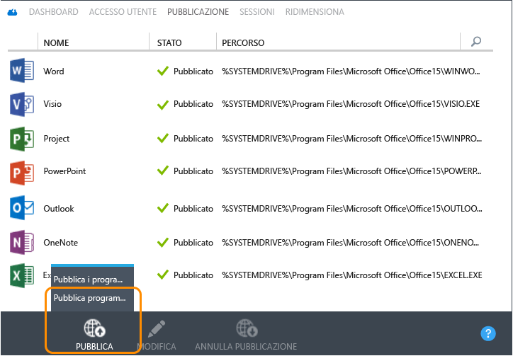
4. Selezionare dall'elenco le app da pubblicare. Per questa esercitazione si è scelto Access. Fare clic su **Operazione completata**. Attendere che venga completata la pubblicazione delle app. 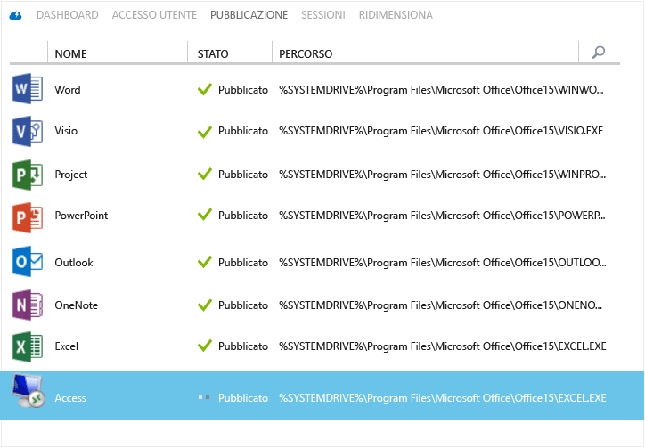

1. Al termine della pubblicazione dell'app, passare alla scheda **Accesso utente** per aggiungere tutti gli utenti che richiedono l'accesso alle app. Immettere i nomi utente (indirizzo di posta elettronica) degli utenti e quindi fare clic su **Salva**. 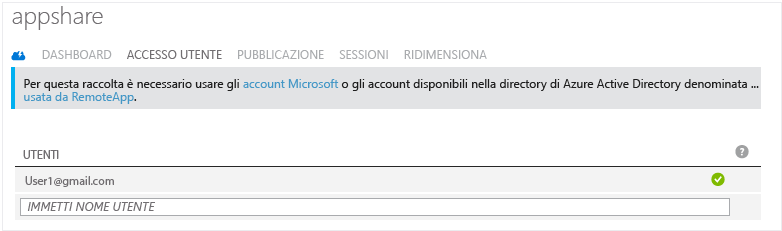

1. A questo punto, è necessario informare gli utenti che sono disponibili nuove app e indicare come accedervi. Per eseguire questa operazione, inviare agli utenti un messaggio di posta elettronica che punta all'URL di download del client Desktop remoto. 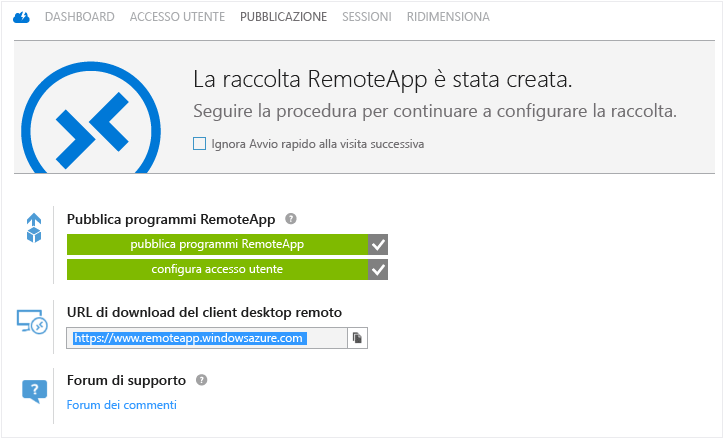

## Configurare l'accesso ad Access

Alcune app richiedono una configurazione aggiuntiva dopo la distribuzione tramite RemoteApp. In particolare, per Access si creerà una condivisione file in Azure a cui qualsiasi utente può accedere. Se non si vuole eseguire questa operazione, è possibile creare una [raccolta ibrida](remoteapp-create-hybrid-deployment.md) [invece della raccolta nel cloud], che consente agli utenti di accedere ai file e alle informazioni nella rete locale. Sarà quindi necessario comunicare agli utenti di connettere un'unità locale del computer al file system di Azure.

La prima parte viene eseguita come amministratore, quindi alcuni passaggi dovranno essere eseguiti dagli utenti.

1. Iniziare con la pubblicazione dell'interfaccia della riga di comando (cmd.exe). Nella scheda **Pubblicazione** selezionare **cmd** e quindi fare clic su **Pubblica > Pubblica i programmi usando il percorso**.
2. Immettere il nome dell'app e il percorso. Per questa esercitazione, usare "Esplora file" come nome e "%SYSTEMDRIVE%\windows\explorer.exe" come percorso. 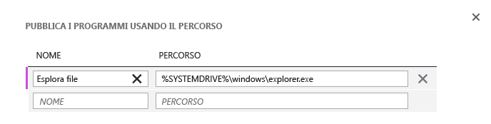
3. È necessario creare un [account di archiviazione](../storage-create-storage-account.md) di Azure. In questo caso è stato denominato "accessstorage", perciò selezionare un nome significativo (può essere presente un solo archivio "accessstorage"). 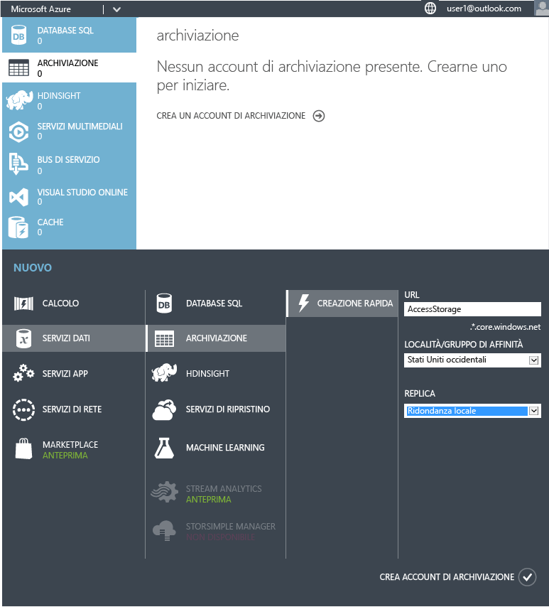
4. Tornare al dashboard per ottenere il percorso dell'account di archiviazione (percorso dell'endpoint), che verrà usato tra poco, quindi assicurarsi di copiarlo.

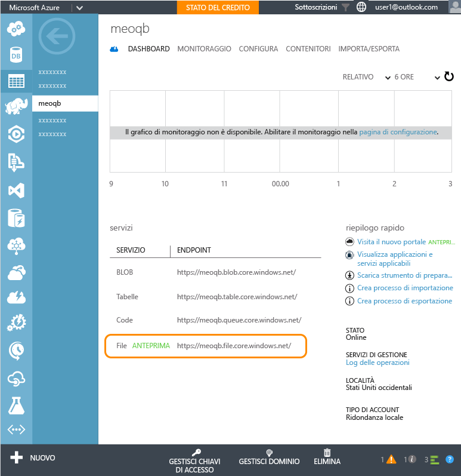 5. Dopo avere creato l'account di archiviazione, è necessaria la chiave di accesso primaria. Fare clic su **Gestisci chiavi di accesso** e quindi copiare la chiave di accesso primaria. 6. Impostare il contesto dell'account di archiviazione e creare una nuova condivisione file per Access. Eseguire i cmdlet seguenti in una finestra di Windows PowerShell con privilegi elevati:

        $ctx=New-AzureStorageContext <account name> <account key>
    	$s = New-AzureStorageShare <share name> -Context $ctx

	So for our share, these are the cmdlets we run:

	    $ctx=New-AzureStorageContext accessstorage <key>
    	$s = New-AzureStorageShare <share name> -Context $ctx

Di seguito sono elencati i passaggi che dovrà eseguire l'utente. Innanzitutto chiedere agli utenti di installare un [client RemoteApp](remoteapp-clients.md). Dovranno quindi connettere un'unità dall'account alla condivisione file di Azure creata dall'amministratore e aggiungere i file di Access. Ecco come eseguire questa operazione:

1. Nel client RemoteApp accedere alle app pubblicate. Avviare il programma cmd.exe.
2. Eseguire il comando seguente per eseguire il mapping di un'unità dal computer alla condivisione file:

		net use z: \<accountname>.file.core.windows.net<share name> /u:<user name> <account key>

	Se si imposta il parametro **/persistent** su Sì, l'unità mappata verrà mantenuta tra le sessioni.
1. Avviare l'app Esplora file da RemoteApp. Copiare i file di Access che si desidera usare nell'app condivisa nella condivisione file. 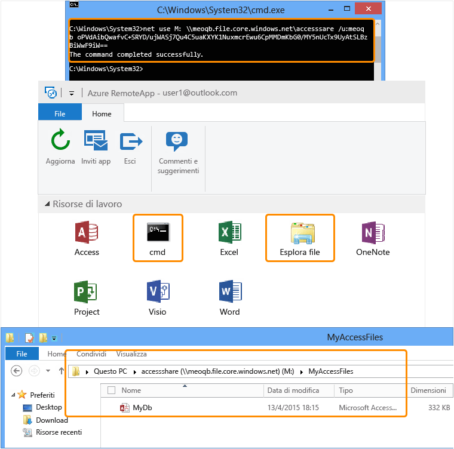
1. Infine aprire Access e quindi il database appena condiviso. I dati saranno visualizzati in Access in esecuzione nel cloud. 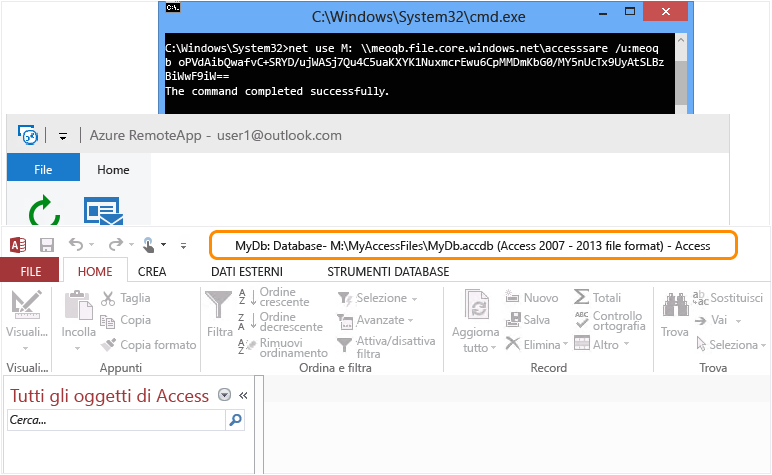

A questo punto è possibile usare Access su qualsiasi dispositivo, basta avere installato un client RemoteApp.

<!--Every topic should have next steps and links to the next logical set of content to keep the customer engaged-->
## Passaggi successivi

Dopo avere appreso come si crea una raccolta, provare a creare una [raccolta che usa Office 365](remoteapp-tutorial-o365anywhere.md). In alternativa è possibile creare una [raccolta ibrida](remoteapp-create-hybrid-deployment.md) in grado di accedere alla rete locale.

<!--Image references-->

<!---HONumber=July15_HO4-->