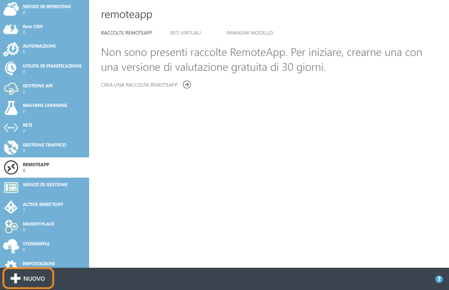
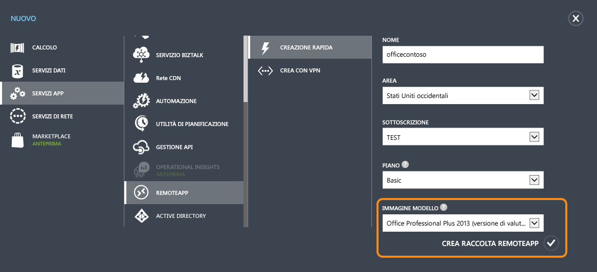
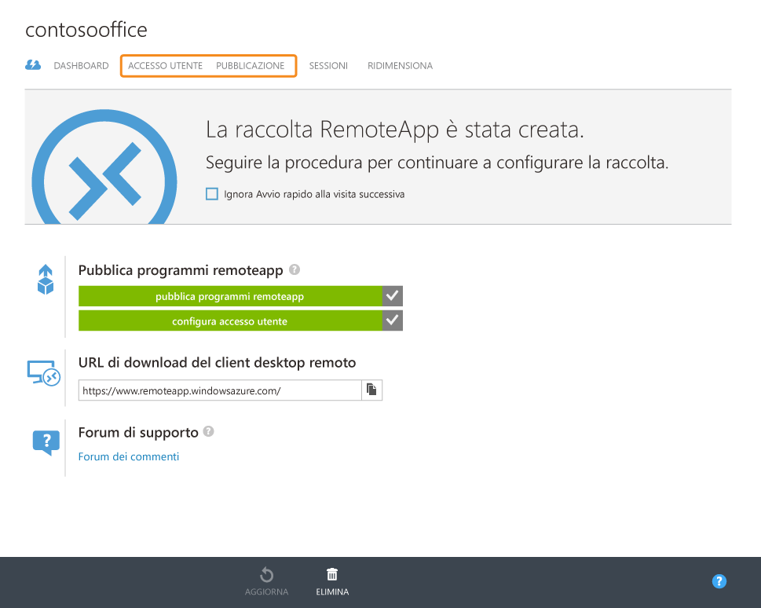
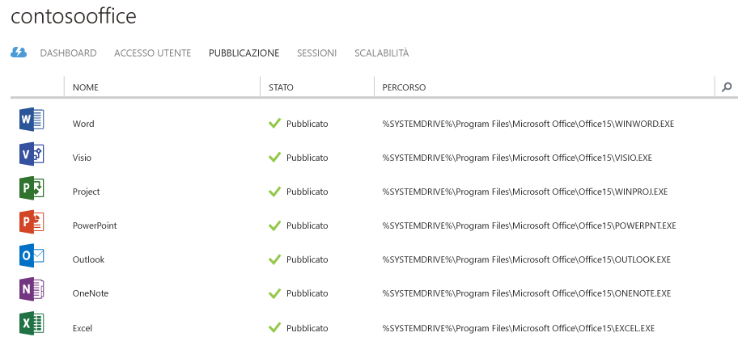
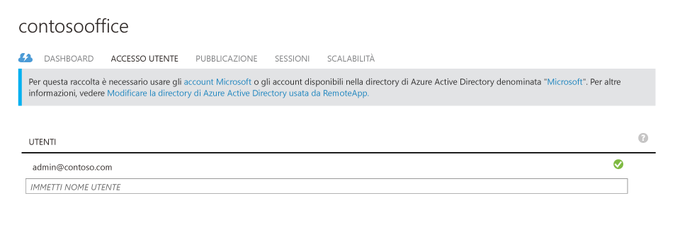
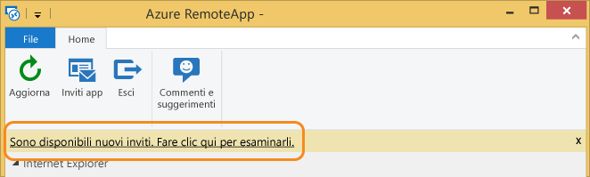
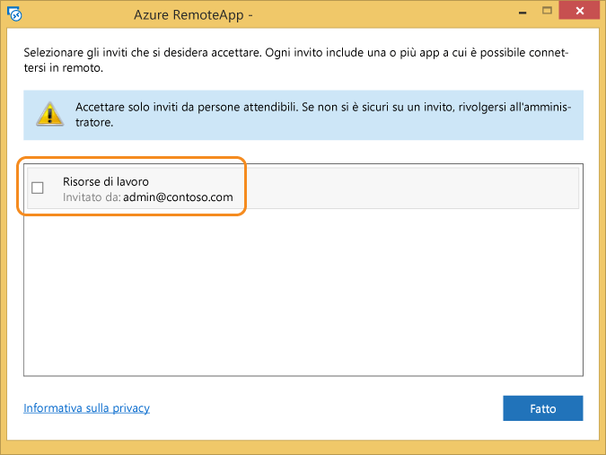
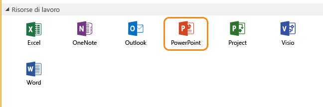
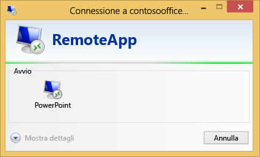
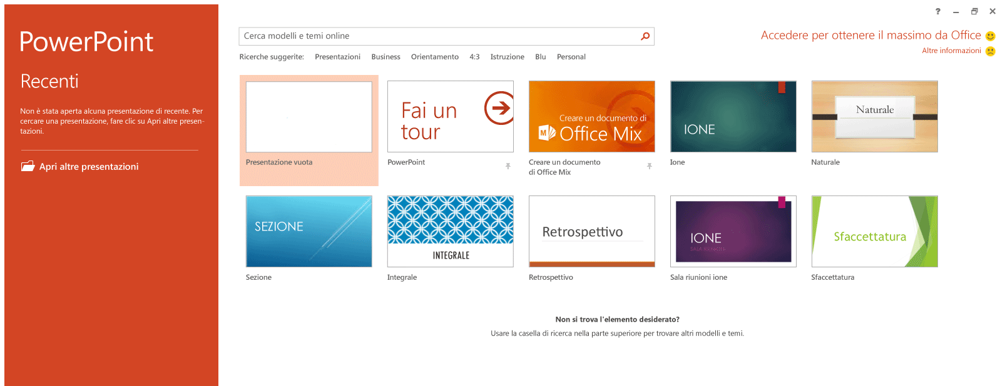

# Ottenere la stessa esperienza di Office 365 su qualsiasi dispositivo con Azure RemoteApp
> [!IMPORTANT]
> Azure RemoteApp verrà sospeso a partire dal 31 agosto 2017. Per i dettagli, vedere l' [annuncio](https://go.microsoft.com/fwlink/?linkid=821148) .
> 
> 

Questo articolo illustra come distribuire Office 365 in qualsiasi dispositivo della società. Gli utenti possono ottenere le stesse funzionalità e la stessa esperienza dell'interfaccia utente su Android, Apple e Windows.

A questo scopo, si userà Azure RemoteApp mediante l’hosting di Office 365 in macchine virtuali scalabili di Azure a cui gli utenti possono connettersi. Questo set di macchine virtuali è detto "raccolta nel cloud".

## Creare una raccolta nel cloud
Subito dopo aver creato un account Azure passare a **RemoteApp** facendo clic sul collegamento presente sul lato sinistro.

Continuare facendo clic su **Nuovo** nella parte inferiore e quindi su "Creazione rapida" di una raccolta. Specificare un nome, l'area, la sottoscrizione, il piano e l'immagine di "Office Professional 2013" fornita.

Dopo aver completato il form, verrà avviato il processo di creazione della raccolta. L'operazione potrebbe richiedere un'ora circa.

Al termine del processo, la schermata sarà simile alla seguente. Se si fa clic su **Pubblicazione** , si noterà che la maggior parte delle applicazioni di Office è già stata pubblicata.

A questo punto è anche possibile aggiungere altri utenti che potranno accedere a questa raccolta facendo clic su **Accesso utente**.

Ora si proverà a connettersi a Office 365.

## Connettersi a Office 365
Accedere a [https://www.remoteapp.windowsazure.com/](https://www.remoteapp.windowsazure.com/), scorrere verso il basso e fare clic su **Download clients** (Scarica client) per installare il client di Azure RemoteApp nel dispositivo attivo. Le schermate seguenti si riferiscono a Windows.

Dopo l'avvio dell'applicazione verrà chiesto di accedere con il proprio account Microsoft (in precedenza denominato Live ID) . Per ora, usare lo stesso account usato per accedere ad Azure. Dopo avere eseguito l'accesso dovrebbe essere visualizzata una notifica relativa a nuovi inviti. Fare clic sulla notifica per visualizzare un elenco come il seguente. Accettare l'invito corrispondente all'indirizzo di posta elettronica del proprietario dell'account Azure.

Ecco come appare la schermata quando sono presenti nuovi inviti.

Dopo avere accettato l'invito verranno visualizzate tutte le app di Office nel client Azure RemoteApp.

Quando si fa clic su una di esse, l'applicazione verrà avviata nella macchina virtuale di Azure, Buon lavoro.

