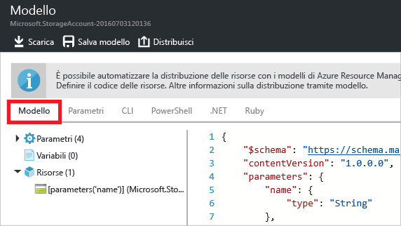

<properties
	pageTitle="Esportare il modello di Azure Resource Manager | Microsoft Azure"
	description="Usare Azure Resource Manager per esportare un modello da un gruppo di risorse esistente."
	services="azure-resource-manager"
	documentationCenter=""
	authors="tfitzmac"
	manager="timlt"
	editor="tysonn"/>



<tags
	ms.service="azure-resource-manager"
	ms.workload="multiple"
	ms.tgt_pltfrm="na"
	ms.devlang="na"
	ms.topic="get-started-article"
	ms.date="08/03/2016"
	ms.author="tomfitz"/>



# Esportare un modello di Azure Resource Manager da risorse esistenti

Resource Manager consente di esportare un modello di Resource Manager dalle risorse esistenti nella sottoscrizione. Il modello generato può essere usato per ottenere informazioni sulla sintassi del modello o per automatizzare la ridistribuzione della soluzione in base alle esigenze.

È importante notare che è possibile esportare un modello in due modi diversi:

- È possibile esportare il modello vero e proprio usato per una distribuzione. Il modello esportato include tutti i parametri e le variabili uguali a quelli visualizzati nel modello originale. Questo approccio è utile quando si distribuiscono risorse tramite il portale e in seguito si vuole costruire il modello per creare tali risorse.
- È possibile esportare un modello che rappresenta lo stato attuale del gruppo di risorse. Il modello esportato non si basa su un modello qualsiasi usato per la distribuzione, ma crea un modello che è uno snapshot del gruppo di risorse. Il modello esportato ha diversi valori hardcoded e probabilmente meno parametri di quelli che si definiscono in genere. Questo approccio è utile quando si modifica il gruppo di risorse nel portale o negli script e in seguito è necessario acquisire il gruppo di risorse come modello.

Questo argomento illustra entrambi gli approcci. L'articolo [Personalizzare un modello di Azure Resource Manager esportato](resource-manager-customize-template.md) illustra come sfruttare un modello generato dallo stato corrente del gruppo di risorse per la ridistribuzione della soluzione.

In questa esercitazione si esegue l'accesso al portale di Azure, si crea un account di archiviazione e si esporta il modello per tale account di archiviazione. Si aggiunge una rete virtuale per modificare il gruppo di risorse e infine si esporta un nuovo modello che ne rappresenta lo stato corrente. Anche se questo articolo è incentrato su un'infrastruttura semplificata, è possibile usare la stessa procedura per esportare un modello per una soluzione più complessa.

## Creare un account di archiviazione

1. Nel [portale di Azure](https://portal.azure.com) selezionare **Nuovo** > **Dati e archiviazione** > **Account di archiviazione**.

      



2. Creare un account di archiviazione usando il nome **storage**, le proprie iniziali e la data. Il nome dell'account di archiviazione deve essere univoco in Azure. Se il nome iniziale è già usato, provare con una variante. Per il gruppo di risorse specificare il valore **ExportGroup**. È possibile usare i valori predefiniti per le altre proprietà. Selezionare **Crea**.

      



Al termine della distribuzione, la sottoscrizione contiene l'account di archiviazione.

## Esportare il modello dalla cronologia della distribuzione

1. Passare al pannello Gruppo di risorse per il nuovo gruppo di risorse. Si noti che il pannello visualizza il risultato dell'ultima distribuzione. Selezionare questo collegamento.

      



2. Viene visualizzata la cronologia delle distribuzioni per il gruppo. In questo caso il pannello probabilmente elenca solo una distribuzione. Selezionare questa distribuzione.

     



3. Il pannello visualizza un riepilogo della distribuzione. Il riepilogo include lo stato della distribuzione e le relative operazioni e i valori specificati per i parametri. Per visualizzare il modello usato per la distribuzione, selezionare **Visualizza modello**.

     



4. Resource Manager recupera i sei file seguenti:

   1. **Modello**: modello che definisce l'infrastruttura per la soluzione. Quando è stato creato l'account di archiviazione tramite il portale, Resource Manager ha usato un modello per distribuirlo e ha salvato tale modello come riferimento futuro.
   2. **Parametri**: file dei parametri che può essere usato per passare i valori durante la distribuzione. Contiene i valori specificati durante la prima distribuzione, ma è possibile modificare qualsiasi valore durante la ridistribuzione del modello.
   3. **Interfaccia della riga di comando**: file di script dell'interfaccia della riga di comando di Azure che può essere usato per distribuire il modello.
   4. **PowerShell**: file di script di Azure PowerShell che può essere usato per distribuire il modello.
   5. **.NET**: classe .NET che può essere usata per distribuire il modello.
   6. **Ruby**: classe Ruby che può essere usata per distribuire il modello.

     I file sono disponibili mediante collegamenti nel pannello. Per impostazione predefinita, il pannello visualizza il modello.

       



     Occorre prestare particolare attenzione al modello. Il modello deve avere un aspetto analogo al seguente:

        {
          "$schema": "https://schema.management.azure.com/schemas/2015-01-01/deploymentTemplate.json#",
          "contentVersion": "1.0.0.0",
          "parameters": {
            "name": {
              "type": "String"
            },
            "accountType": {
              "type": "String"
            },
            "location": {
              "type": "String"
            },
            "encryptionEnabled": {
              "defaultValue": false,
              "type": "Bool"
            }
          },
          "resources": [
            {
              "type": "Microsoft.Storage/storageAccounts",
              "sku": {
                "name": "[parameters('accountType')]"
              },
              "kind": "Storage",
              "name": "[parameters('name')]",
              "apiVersion": "2016-01-01",
              "location": "[parameters('location')]",
              "properties": {
                "encryption": {
                  "services": {
                    "blob": {
                      "enabled": "[parameters('encryptionEnabled')]"
                    }
                  },
                  "keySource": "Microsoft.Storage"
                }
              }
            }
          ]
        }
 
Questo è il modello effettivo usato per creare l'account di archiviazione. Si noti che contiene parametri che consentono di distribuire tipi diversi di account di archiviazione. Per altre informazioni sulla struttura del modello, vedere [Creazione di modelli di Azure Resource Manager](resource-group-authoring-templates.md). Per l'elenco completo delle funzioni che è possibile usare in un modello, vedere [Funzioni del modello di Azure Resource Manager](resource-group-template-functions.md).


## Aggiungere una rete virtuale

Il modello scaricato nella sezione precedente rappresentava l'infrastruttura per tale distribuzione originale, ma non tiene conto di eventuali modifiche apportate dopo la distribuzione. Per illustrare questo problema, modificare il gruppo di risorse aggiungendo una rete virtuale tramite il portale.

1. Nel pannello del gruppo di risorse selezionare **Aggiungi**.

      



2. Selezionare **Rete virtuale** tra le risorse disponibili.

      

2. Specificare il nome **VNET** per la rete virtuale e usare i valori predefiniti per le altre proprietà. Selezionare **Crea**.

      



3. Al termine della distribuzione della rete virtuale nel gruppo di risorse, esaminare ancora la cronologia di distribuzione. Vengono visualizzate due distribuzioni. Se la seconda distribuzione non viene visualizzata, potrebbe essere necessario chiudere il pannello del gruppo di risorse e riaprirlo. Selezionare la distribuzione più recente.

      



4. Esaminare il modello per tale distribuzione. Si noti che definisce solo le modifiche apportate per aggiungere la rete virtuale.

In genere è consigliabile usare un modello che distribuisce tutta l'infrastruttura per la soluzione in una singola operazione. Questo approccio è più affidabile che non dovere ricordare molti modelli diversi da distribuire.


## Esportare il modello da un gruppo di risorse

Anche se ogni distribuzione mostra solo le modifiche apportate al gruppo di risorse, è possibile esportare in qualsiasi momento un modello per mostrare gli attributi dell'intero gruppo di risorse.

1. Per visualizzare il modello per un gruppo di risorse, selezionare **Script di automazione**.

      



     Non tutti i tipi di risorse supportano la funzione di esportazione del modello. Se il gruppo di risorse contiene solo l'account di archiviazione e la rete virtuale illustrati in questo articolo, non verranno visualizzati errori. Se invece sono stati creati altri tipi di risorse, è possibile che venga visualizzato un errore che informa di un problema con l'esportazione. Per informazioni su come gestire tali problemi, vedere la sezione [Risolvere i problemi di esportazione](#fix-export-issues).

      

2. Vengono visualizzati di nuovo i sei file che è possibile usare per ridistribuire la soluzione, ma questa volta il modello è leggermente diverso. Questo modello ha solo due parametri, uno per il nome dell'account di archiviazione e uno per il nome della rete virtuale.

        "parameters": {
          "virtualNetworks_VNET_name": {
            "defaultValue": "VNET",
            "type": "String"
          },
          "storageAccounts_storagetf05092016_name": {
            "defaultValue": "storagetf05092016",
            "type": "String"
          }
        },

     Resource Manager non ha recuperato i modelli usati durante la distribuzione. Ha generato invece un nuovo modello basato sulla configurazione corrente delle risorse. Ad esempio, il modello imposta la posizione dell'account di archiviazione e il valore di replica su:

        "location": "northeurope",
        "tags": {},
        "properties": {
            "accountType": "Standard_RAGRS"
        },

3. Scaricare il modello per poterlo modificare in locale.

      

4. Trovare il file con estensione zip scaricato ed estrarne i contenuti. È possibile usare il modello scaricato per ridistribuire l'infrastruttura.

## Risolvere i problemi di esportazione

Non tutti i tipi di risorse supportano la funzione di esportazione del modello. Resource Manager non esporta alcuni tipi specifici di risorse per evitare l'esposizione di dati sensibili. Ad esempio, se si ha una stringa di connessione nel file di configurazione del sito, probabilmente non si vuole che venga visualizzata in modo esplicito in un modello esportato. Per risolvere il problema, aggiungere manualmente le risorse mancanti al modello.

> [AZURE.NOTE] Si verificano problemi di esportazione solo quando si esporta da un gruppo di risorse invece che dalla cronologia della distribuzione. Se la distribuzione più recente rappresenta con precisione lo stato corrente del gruppo di risorse, è consigliabile esportare il modello dalla cronologia della distribuzione invece che dal gruppo di risorse. Eseguire l'esportazione da un gruppo di risorse solo quando sono state apportate al gruppo di risorse modifiche non definite in un singolo modello.

Ad esempio, se si esporta un modello per gruppo di risorse che contiene un'app Web, un database SQL e una stringa di connessione nella configurazione del sito, verrà visualizzato il messaggio seguente.


Selezionando il messaggio, vengono visualizzati esattamente i tipi di risorse non esportati.
     


Questo argomento illustra le correzioni comuni seguenti. Per implementare queste risorse, è necessario aggiungere parametri al modello. Per altre informazioni, vedere [Personalizzare un modello di Azure Resource Manager esportato](resource-manager-customize-template.md).

### Stringa di connessione

Nella risorsa dei siti Web aggiungere una definizione per la stringa di connessione al database:

```
{
  "type": "Microsoft.Web/sites",
  ...
  "resources": [
    {
      "apiVersion": "2015-08-01",
      "type": "config",
      "name": "connectionstrings",
      "dependsOn": [
          "[concat('Microsoft.Web/Sites/', parameters('<site-name>'))]"
      ],
      "properties": {
          "DefaultConnection": {
            "value": "[concat('Data Source=tcp:', reference(concat('Microsoft.Sql/servers/', parameters('<database-server-name>'))).fullyQualifiedDomainName, ',1433;Initial Catalog=', parameters('<database-name>'), ';User Id=', parameters('<admin-login>'), '@', parameters('<database-server-name>'), ';Password=', parameters('<admin-password>'), ';')]",
              "type": "SQLServer"
          }
      }
    }
  ]
}
```    

### Estensione del sito Web

Nella risorsa del sito Web aggiungere una definizione per il codice da installare:

```
{
  "type": "Microsoft.Web/sites",
  ...
  "resources": [
    {
      "name": "MSDeploy",
      "type": "extensions",
      "location": "[resourceGroup().location]",
      "apiVersion": "2015-08-01",
      "dependsOn": [
        "[concat('Microsoft.Web/sites/', parameters('<site-name>'))]"
      ],
      "properties": {
        "packageUri": "[concat(parameters('<artifacts-location>'), '/', parameters('<package-folder>'), '/', parameters('<package-file-name>'), parameters('<sas-token>'))]",
        "dbType": "None",
        "connectionString": "",
        "setParameters": {
          "IIS Web Application Name": "[parameters('<site-name>')]"
        }
      }
    }
  ]
}
```

### Estensione macchina virtuale

Per esempi di estensioni macchina virtuale, vedere [Esempi di configurazione dell'estensione macchina virtuale Windows di Azure](./virtual-machines/virtual-machines-windows-extensions-configuration-samples.md).

### Gateway di rete virtuale

Aggiungere un tipo di risorsa gateway di rete virtuale.

```
{
  "type": "Microsoft.Network/virtualNetworkGateways",
  "name": "[parameters('<gateway-name>')]",
  "apiVersion": "2015-06-15",
  "location": "[resourceGroup().location]",
  "properties": {
    "gatewayType": "[parameters('<gateway-type>')]",
    "ipConfigurations": [
      {
        "name": "default",
        "properties": {
          "privateIPAllocationMethod": "Dynamic",
          "subnet": {
            "id": "[resourceId('Microsoft.Network/virtualNetworks/subnets', parameters('<vnet-name>'), parameters('<new-subnet-name>'))]"
          },
          "publicIpAddress": {
            "id": "[resourceId('Microsoft.Network/publicIPAddresses', parameters('<new-public-ip-address-Name>'))]"
          }
        }
      }
    ],
    "enableBgp": false,
    "vpnType": "[parameters('<vpn-type>')]"
  },
  "dependsOn": [
    "Microsoft.Network/virtualNetworks/codegroup4/subnets/GatewaySubnet",
    "[concat('Microsoft.Network/publicIPAddresses/', parameters('<new-public-ip-address-Name>'))]"
  ]
},
```

### Gateway di rete locale

Aggiungere un tipo di risorsa gateway di rete locale.

```
{
    "type": "Microsoft.Network/localNetworkGateways",
    "name": "[parameters('<local-network-gateway-name>')]",
    "apiVersion": "2015-06-15",
    "location": "[resourceGroup().location]",
    "properties": {
      "localNetworkAddressSpace": {
        "addressPrefixes": "[parameters('<address-prefixes>')]"
      }
    }
}
```

### Connessione

Aggiungere un tipo di risorsa connessione.

```
{
    "apiVersion": "2015-06-15",
    "name": "[parameters('<connection-name>')]",
    "type": "Microsoft.Network/connections",
    "location": "[resourceGroup().location]",
    "properties": {
        "virtualNetworkGateway1": {
        "id": "[resourceId('Microsoft.Network/virtualNetworkGateways', parameters('<gateway-name>'))]"
      },
      "localNetworkGateway2": {
        "id": "[resourceId('Microsoft.Network/localNetworkGateways', parameters('<local-gateway-name>'))]"
      },
      "connectionType": "IPsec",
      "routingWeight": 10,
      "sharedKey": "[parameters('<shared-key>')]"
    }
},
```


## Passaggi successivi

Congratulazioni. Si è appreso come esportare un modello da risorse create nel portale.

- Nella seconda parte di questa esercitazione viene personalizzato il modello scaricato con l'aggiunta di altri parametri e il modello viene ridistribuito tramite uno script. Vedere [Personalizzare un modello di Azure Resource Manager esportato](resource-manager-customize-template.md).
- Per informazioni su come esportare un modello tramite PowerShell, vedere [Uso di Azure PowerShell con Azure Resource Manager](powershell-azure-resource-manager.md).
- Per informazioni su come esportare un modello tramite l'interfaccia della riga di comando di Azure, vedere [Usare l'interfaccia della riga di comando di Azure per Mac, Linux e Windows con Azure Resource Manager](xplat-cli-azure-resource-manager.md).

<!---HONumber=AcomDC_0810_2016-->