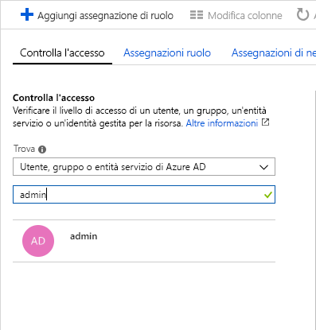
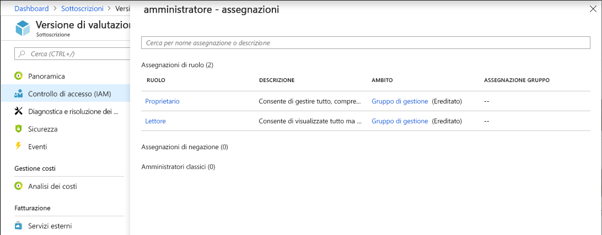

# Avvio rapido: Visualizzare l'accesso di un utente alle risorse di Azure

È possibile usare il pannello **Controllo di accesso (IAM)** in [Controllo degli accessi in base al ruolo](overview.md) per visualizzare l'accesso di un utente o di un'altra entità di sicurezza alle risorse di Azure. Tuttavia, a volte può essere necessario visualizzare rapidamente l'accesso di un singolo utente o di un'altra entità di sicurezza. Il modo più semplice per eseguire questa operazione è usare la funzionalità **Verifica l'accesso** nel portale di Azure.

## Visualizzare le assegnazioni di ruolo

 Il modo per visualizzare l'accesso di un utente consiste nell'elencare le relative assegnazioni di ruolo. Seguire questi passaggi per visualizzare le assegnazioni di ruolo per un singolo utente, gruppo, entità servizio o identità gestita nell'ambito della sottoscrizione.

1. Nel portale di Azure fare clic su **Tutti i servizi** e quindi **Sottoscrizioni**.

1. Fare clic sulla propria sottoscrizione.

1. Fare clic su **Controllo di accesso (IAM)**.

1. Fare clic sulla scheda **Verifica l'accesso**.

    

1. Nell'elenco **Trova**, selezionare il tipo di entità di sicurezza di cui si intende verificare l'accesso.

1. Nella casella di ricerca, immettere una stringa per eseguire ricerche nella directory in base ai nomi visualizzati, agli indirizzi di posta elettronica o agli identificatori di oggetto.

    

1. Fare clic sull'entità di sicurezza per aprire il riquadro **Assegnazioni**.

    

    In questo riquadro è possibile visualizzare i ruoli assegnati all'entità di sicurezza e all'ambito selezionati. Se sono presenti assegnazioni negate in questo ambito o ereditate da questo ambito, verranno elencate.

## Passaggi successivi

> [!div class="nextstepaction"]
> [Esercitazione: Concedere a un utente l'accesso alle risorse di Azure usando il controllo degli accessi in base al ruolo e il portale di Azure](quickstart-assign-role-user-portal.md)
