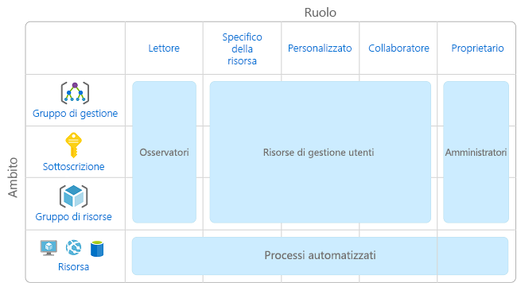
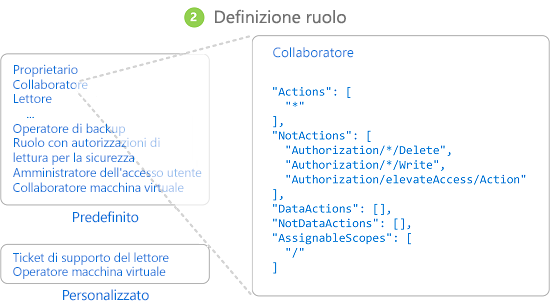
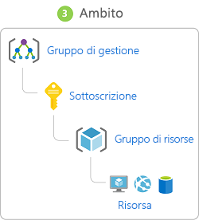
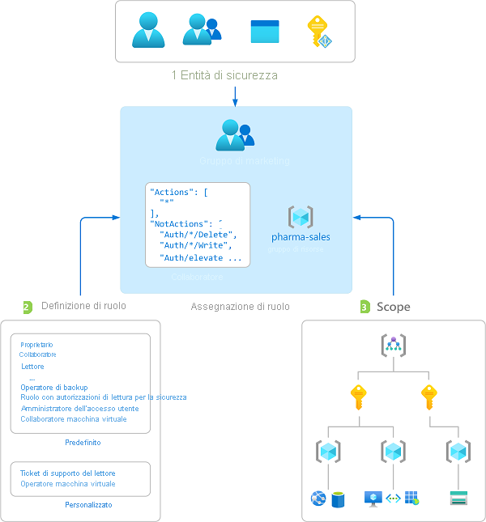
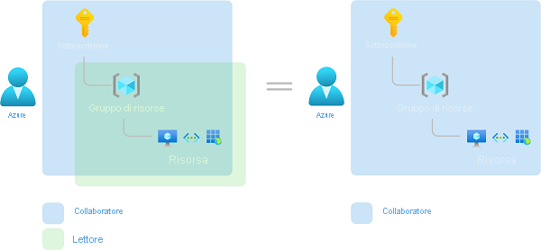

# Che cos'è il controllo degli accessi in base al ruolo per le risorse di Azure?

La gestione dell'accesso per le risorse cloud è una funzione essenziale per qualsiasi organizzazione che usa il cloud. Il controllo degli accessi in base al ruolo consente la gestione degli utenti autorizzati ad accedere alle risorse di Azure, delle operazioni che possono eseguire su tali risorse e delle aree a cui hanno accesso.

Il controllo degli accessi in base al ruolo è un sistema di autorizzazione basato su [Azure Resource Manager](../azure-resource-manager/resource-group-overview.md) che garantisce una gestione con granularità fine degli accessi delle risorse di Azure.

## Quali operazioni si possono eseguire con il controllo degli accessi in base al ruolo?

Di seguito sono riportati alcuni esempi di operazioni eseguibili con il controllo degli accessi in base al ruolo:

- Consentire a un utente di gestire le macchine virtuali in una sottoscrizione e un altro utente a gestire le reti virtuali
- Consentire a un gruppo di amministratori di database di gestire database SQL all'interno di una sottoscrizione
- Consentire a un utente di gestire tutte le risorse in un gruppo di risorse, ad esempio le macchine virtuali, i siti Web e le subnet
- Consentire a un'applicazione di accedere a tutte le risorse in un gruppo di risorse

## Procedure consigliate per l'uso del controllo degli accessi in base al ruolo

Usando il Controllo degli accessi in base al ruolo, è possibile separare i compiti all'interno del team e concedere agli utenti solo la quantità di accesso di cui hanno bisogno per svolgere il proprio lavoro. Invece di concedere a tutti autorizzazioni senza restrizioni per la sottoscrizione o le risorse di Azure, è possibile consentire solo determinate azioni in un particolare ambito.

Quando si pianifica la strategia di controllo degli accessi, è consigliabile concedere agli utenti almeno il privilegio per completare la propria sessione di lavoro. Il diagramma seguente mostra uno schema consigliato per l'uso del controllo degli accessi in base al ruolo.

## Come funziona il controllo degli accessi in base al ruolo

Il modo in cui si controlla l'accesso alle risorse utilizzando il controllo degli accessi in base al ruolo è quello di creare assegnazioni di ruolo. Questo è un concetto chiave da comprendere: si tratta di come sono applicate le autorizzazioni. Un'assegnazione di ruolo è costituita da tre elementi: entità di sicurezza, definizione del ruolo e ambito.

### Entità di sicurezza

Un'*entità di sicurezza* è un oggetto che rappresenta un utente, un gruppo, un'entità servizio o un'identità gestita che richiede l'accesso alle risorse di Azure.

- Utente: un soggetto che dispone di un profilo in Azure Active Directory. È anche possibile assegnare ruoli agli utenti in altri tenant. Per informazioni sugli utenti in altre organizzazioni, vedere [Azure Active Directory B2B](../active-directory/b2b/what-is-b2b.md).
- Gruppo: un set di utenti creato in Azure Active Directory. Quando si assegna un ruolo a un gruppo, tutti gli utenti all'interno di tale gruppo dispongono del ruolo appropriato. 
- Entità servizio: un'identità di sicurezza utilizzata da applicazioni o servizi per accedere a specifiche risorse di Azure. È possibile pensare a questo elemento come a un'*identità utente* (nome utente e password o certificato) per un'applicazione.
- Identità gestita: un'identità in Azure Active Directory che viene gestita automaticamente da Azure. Le [identità gestite](../active-directory/managed-identities-azure-resources/overview.md) vengono in genere usate durante lo sviluppo di applicazioni cloud per gestire le credenziali per l'autenticazione ai servizi di Azure.

### Definizione di ruolo

Una *definizione di ruolo* è una raccolta di autorizzazioni, talvolta semplicemente chiamata *ruolo*. Una definizione di ruolo elenca le operazioni che è possibile eseguire, ad esempio lettura, scrittura ed eliminazione, I ruoli possono essere di livello superiore, ad esempio quello di proprietario, o specifici, ad esempio quello di lettore di macchina virtuale.

Azure include diversi [ruoli predefiniti](built-in-roles.md) che è possibile usare. Di seguito sono elencati quattro fondamentali ruoli predefiniti. I primi tre si applicano a tutti i tipi di risorse.

- [Proprietario](built-in-roles.md#owner): ha accesso completo a tutte le risorse, compreso il diritto di delegare l'accesso ad altri utenti.
- [Collaboratore](built-in-roles.md#contributor): può creare e gestire tutti i tipi di risorse di Azure, ma non può concedere l'accesso ad altri.
- [Lettore](built-in-roles.md#reader): può visualizzare le risorse di Azure esistenti.
- [Amministratore Accesso utenti](built-in-roles.md#user-access-administrator): consente di gestire l'accesso degli utenti alle risorse di Azure.

Il resto dei ruoli predefiniti consente la gestione di risorse di Azure specifiche. Ad esempio, il ruolo [Collaboratore Macchina virtuale](built-in-roles.md#virtual-machine-contributor) consente a un utente di creare e gestire macchine virtuali. Se i ruoli predefiniti non soddisfano le esigenze specifiche dell'organizzazione, è possibile creare [ruoli personalizzati per le risorse di Azure](custom-roles.md).

Azure dispone di operazioni sui dati che consentono di concedere l'accesso ai dati all'interno di un oggetto. Ad esempio, se un utente dispone dell'accesso in lettura ai dati per un account di archiviazione, può leggere i BLOB o i messaggi all'interno di tale account. Per altre informazioni, vedere [Informazioni sulle definizioni del ruolo per le risorse di Azure](role-definitions.md).

### Scope

*Ambito* è il set di risorse a cui si applica l'accesso. Quando si assegna un ruolo, è possibile limitare ulteriormente le azioni consentite definendo un ambito. Ciò è utile se si intende creare un [collaboratore di siti Web](built-in-roles.md#website-contributor), ma solo per un gruppo di risorse.

In Azure, è possibile specificare un ambito su più livelli: [gruppo di gestione](../governance/management-groups/overview.md), sottoscrizione, gruppo di risorse o risorsa. Gli ambiti sono strutturati in una relazione padre-figlio.

Quando si concede l'accesso in un ambito padre, tali autorizzazioni vengono ereditate negli ambiti figlio. Ad esempio:

- Se si assegna il ruolo [Proprietario](built-in-roles.md#owner) a un utente nell'ambito del gruppo di gestione, tale utente può gestire tutto in tutte le sottoscrizioni nel gruppo di gestione.
- Se si assegna il ruolo [Lettore](built-in-roles.md#reader) a un gruppo nell'ambito di sottoscrizione, i membri di tale gruppo possono visualizzare ogni gruppo di risorse e risorsa nella sottoscrizione.
- Se si assegna il ruolo [Collaboratore](built-in-roles.md#contributor) a un'applicazione nell'ambito del gruppo di risorse, è possibile gestire risorse di tutti i tipi in quel gruppo di risorse, ma non altri gruppi di risorse nella sottoscrizione.

### Assegnazioni di ruoli

Un'*assegnazione di ruolo* è il processo di associazione di una definizione di ruolo a un utente, un gruppo, un'entità servizio o un'identità gestita in un determinato ambito allo scopo di concedere l'accesso. L'accesso viene concesso mediante la creazione di un'assegnazione di ruolo e viene revocato rimuovendo un'assegnazione di ruolo.

Lo schema seguente mostra un esempio di assegnazione di ruolo. In questo esempio, al gruppo marketing è stato assegnato il ruolo di [collaboratore](built-in-roles.md#contributor) per il gruppo di risorse pharma-sales. Ciò significa che gli utenti del gruppo marketing possono creare o gestire le risorse di Azure nel gruppo di risorse pharma-sales. Gli utenti marketing non hanno accesso alle risorse all'esterno del gruppo di risorse pharma-sales, a meno che non facciano parte di un'altra assegnazione di ruolo.

È possibile creare assegnazioni di ruolo nel portale di Azure, nell'interfaccia della riga di comando di Azure, in Azure PowerShell, tramite gli SDK Azure o le API REST. È possibile includere fino a **2000** assegnazioni di ruolo in ogni sottoscrizione e **500** assegnazioni di ruolo in ogni gruppo di gestione. Per creare e rimuovere assegnazioni di ruoli, l'utente deve disporre dell'autorizzazione `Microsoft.Authorization/roleAssignments/*`. Questa autorizzazione viene concessa tramite il ruolo [Proprietario](built-in-roles.md#owner) o [Amministratore accessi utente](built-in-roles.md#user-access-administrator).

## Più assegnazioni di ruolo

Cosa succede se si hanno più assegnazioni di ruolo sovrapposte? Il controllo degli accessi in base al ruolo è un modello additivo, quindi le autorizzazioni effettive corrispondono alla somma delle assegnazioni di ruolo. Nell'esempio seguente a un utente viene concesso il ruolo Collaboratore nell'ambito della sottoscrizione e il ruolo Lettore in un gruppo di risorse. La somma delle autorizzazioni di Collaboratore e di quelle di Lettore rende effettivo il ruolo di Collaboratore per il gruppo di risorse. Quindi, in questo caso, l'assegnazione del ruolo Lettore non ha alcun impatto.

## Assegnazioni di rifiuto

In precedenza, il controllo degli accessi in base al ruolo era un modello per il solo consenso, ma ora supporta in modo limitato le assegnazioni di rifiuto. Analogamente a un'assegnazione di ruolo, un'*assegnazione di rifiuto* associa un set di azioni di rifiuto a un utente, un gruppo, un'entità servizio o un'identità gestita in un determinato ambito allo scopo di rifiutare l'accesso. Un'assegnazione di ruolo definisce un set di azioni *consentite*, mentre un'assegnazione di rifiuto definisce un set di azioni *non consentite*. In altre parole, le assegnazioni di rifiuto impediscono agli utenti di eseguire azioni specificate, anche se un'assegnazione di ruolo concede loro l'accesso. Le assegnazioni di rifiuto hanno la precedenza sulle assegnazioni di ruolo. Per altre informazioni, vedere [Informazioni sulle assegnazioni di rifiuto per le risorse di Azure](deny-assignments.md).

## Come il controllo degli accessi in base al ruolo determina se un utente può accedere a una risorsa

Di seguito è indicata la procedura generale seguita dal controllo degli accessi in base al ruolo per determinare se l'utente ha accesso a una risorsa nel piano di gestione. Può essere utile se si sta tentando di risolvere un problema di accesso.

1. Un utente (o entità servizio) acquisisce un token per Azure Resource Manager.

    Il token include le appartenenze a gruppi dell'utente (incluse le appartenenze a gruppi transitive).

1. L'utente effettua una chiamata API REST ad Azure Resource Manager con il token associato.

1. Azure Resource Manager recupera tutte le assegnazioni di ruolo e le assegnazioni di rifiuto che si applicano alla risorsa su cui viene eseguita l'azione.

1. Azure Resource Manager restringe le assegnazioni di ruolo a quelle che si applicano all'utente o al gruppo corrispondente e determina i ruoli di cui l'utente dispone per questa risorsa.

1. Azure Resource Manager determina se l'azione nella chiamata API è inclusa nei ruoli di cui l'utente dispone per questa risorsa.

1. Se l'utente non ha un ruolo con l'azione nell'ambito richiesto, l'accesso non è consentito. In caso contrario, Azure Resource Manager controlla se si applica un'assegnazione di rifiuto.

1. Se si applica un'assegnazione di rifiuto, l'accesso viene bloccato. In caso contrario, l'accesso viene concesso.

## Requisiti relativi alle licenze

[!INCLUDE [Azure AD free license](../../includes/active-directory-free-license.md)]

## Passaggi successivi

- [Guida introduttiva: Visualizzare l'accesso di un utente alle risorse di Azure usando il portale di Azure](check-access.md)
- [Gestire l'accesso alle risorse di Azure usando il controllo degli accessi in base al ruolo e il portale di Azure](role-assignments-portal.md)
- [Comprendere i diversi ruoli in Azure](rbac-and-directory-admin-roles.md)
- [Adozione del cloud nell'organizzazione: gestione dell'accesso alle risorse in Azure](/azure/cloud-adoption-framework/govern/resource-consistency/resource-access-management)
