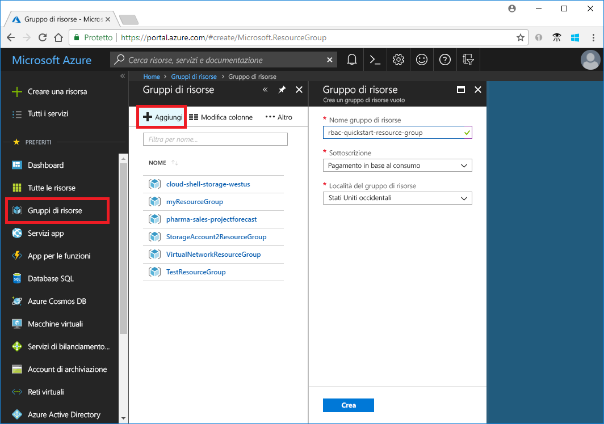
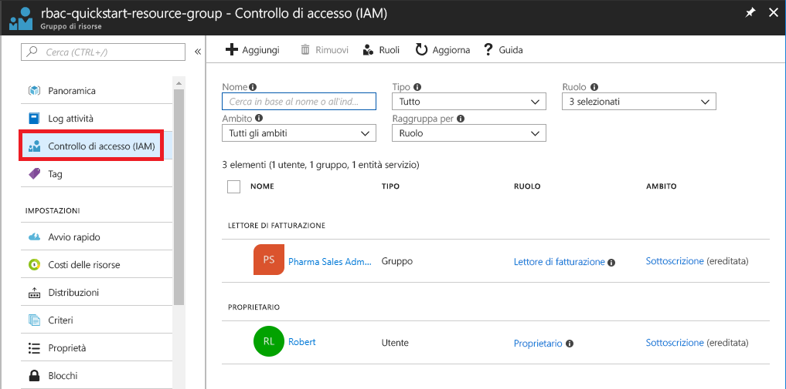
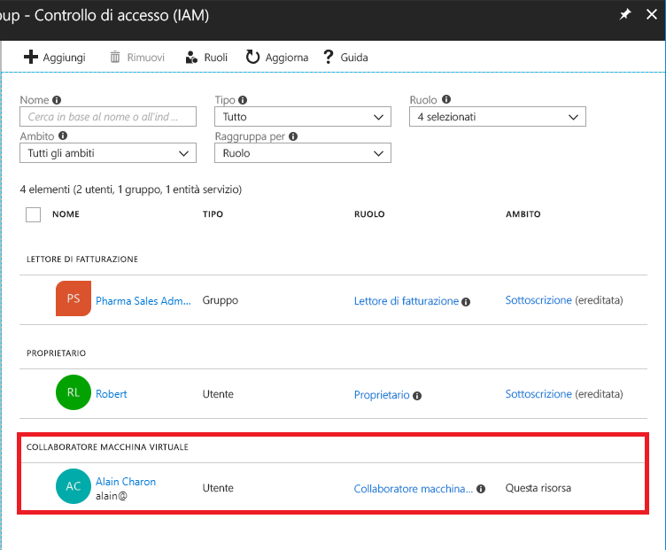
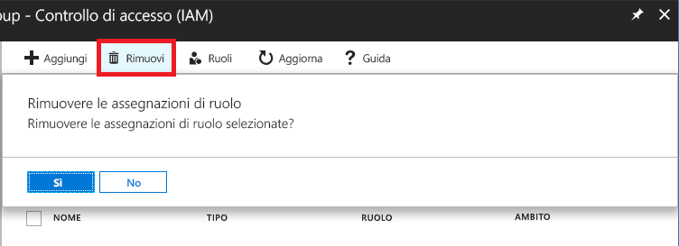
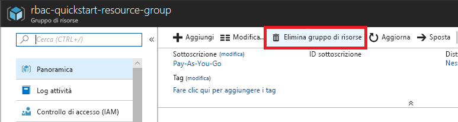

# Esercitazione: Concedere l'accesso alle risorse di Azure a un utente usando il controllo degli accessi in base al ruolo e il portale di Azure

Il [controllo degli accessi in base al ruolo](overview.md) è la modalità di gestione dell'accesso alle risorse di Azure. Questa esercitazione illustra come concedere un accesso a un utente in modo che possa creare e gestire macchine virtuali in un gruppo di risorse.

In questa esercitazione si apprenderà come:

> [!div class="checklist"]
> * Concedere l'accesso per un utente nell'ambito di un gruppo di risorse
> * Rimuovere un accesso

Se non si ha una sottoscrizione di Azure, creare un [account gratuito](https://azure.microsoft.com/free/?WT.mc_id=A261C142F) prima di iniziare.

## Accedere ad Azure

Accedere al portale di Azure all'indirizzo https://portal.azure.com.

## Creare un gruppo di risorse

1. Nell'elenco di spostamento fare clic su **Gruppi di risorse**.

1. Fare clic su **Aggiungi** per aprire il pannello **Gruppo di risorse**.

   

1. Per il **nome del gruppo di risorse**, immettere **rbac-resource-group**.

1. Selezionare una sottoscrizione e una posizione.

1. Fare clic su **Crea** per creare il gruppo di risorse.

1. Fare clic su **Aggiorna** per aggiornare l'elenco di gruppi di risorse.

   Il nuovo gruppo di risorse viene visualizzato nell'elenco dei gruppi di risorse.

   

## Concedere l'accesso

Per concedere l'accesso mediante il controllo degli accessi in base al ruolo, si crea un'assegnazione di ruolo.

1. Nell'elenco **Gruppi di risorse** fare clic sul nuovo gruppo di risorse **rbac-resource-group**.

1. Fare clic su **Controllo di accesso (IAM)**.

1. Fare clic sulla scheda **Assegnazioni di ruolo** per visualizzare l'elenco corrente di assegnazioni di ruolo.

   

1. Fare clic su **Aggiungi** > **Aggiungi assegnazione di ruolo** per aprire il riquadro Aggiungi assegnazione di ruolo.

   Se non si dispone delle autorizzazioni per assegnare ruoli, l'opzione Aggiungi assegnazione di ruolo verrà disabilitata.

   

   

1. Nell'elenco a discesa **Ruolo** selezionare un ruolo, ad esempio **Collaboratore macchina virtuale**.

1. Nell'elenco **Selezionare** selezionare sé stessi o un altro utente.

1. Fare clic su **Salva** per creare l'assegnazione di ruolo.

   Dopo qualche istante, all'utente verrà assegnato il ruolo Collaboratore macchina virtuale per il gruppo di risorse rbac-resource-group.

   

## Rimuovere un accesso

Per rimuovere un accesso mediante il controllo degli accessi in base al ruolo, si rimuove un'assegnazione di ruolo.

1. Nell'elenco delle assegnazioni di ruolo, aggiungere un segno di spunta accanto all'utente con il ruolo di Collaboratore macchina virtuale.

1. Fare clic su **Rimuovi**.

   

1. Nella finestra con il messaggio di rimozione dell'assegnazione di ruolo fare clic su **Sì**.

## Eseguire la pulizia

1. Nell'elenco di spostamento fare clic su **Gruppi di risorse**.

1. Fare clic su **rbac-resource-group** per aprire il gruppo di risorse.

1. Fare clic su **Elimina gruppo di risorse** per eliminare il gruppo di risorse.

   

1. Nel pannello **Eliminare** digitare il nome del gruppo di risorse: **rbac-resource-group**.

1. Fare clic su **Elimina** per eliminare il gruppo di risorse.

## Passaggi successivi

> [!div class="nextstepaction"]
> [Esercitazione: Concedere a un utente l'accesso alle risorse di Azure usando il controllo degli accessi in base al ruolo e Azure PowerShell](tutorial-role-assignments-user-powershell.md)

