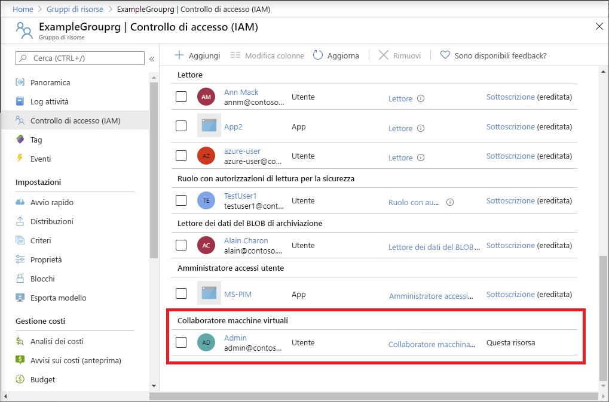

# <a name="quickstart-add-an-azure-role-assignment-using-an-arm-template"></a>Avvio rapido: Aggiungere un'assegnazione di ruolo di Azure con un modello di Resource Manager

Per gestire l'accesso alle risorse di Azure, si usa il [controllo degli accessi in base al ruolo Azure](overview.md). Questo argomento di avvio rapido illustra come creare un gruppo di risorse e come concedere l'accesso a un utente in modo che possa creare e gestire macchine virtuali nel gruppo di risorse. In questo argomento di avvio rapido si usa un modello di Azure Resource Manager (modello di Resource Manager) per concedere l'accesso.

[!INCLUDE [About Azure Resource Manager](../../includes/resource-manager-quickstart-introduction.md)]

Se l'ambiente soddisfa i prerequisiti e si ha familiarità con l'uso dei modelli di Resource Manager, selezionare il pulsante **Distribuisci in Azure**. Il modello verrà aperto nel portale di Azure.

[](https://portal.azure.com/#create/Microsoft.Template/uri/https%3A%2F%2Fraw.githubusercontent.com%2FAzure%2Fazure-quickstart-templates%2Fmaster%2F101-rbac-builtinrole-resourcegroup%2Fazuredeploy.json)

## <a name="prerequisites"></a>Prerequisiti

Per aggiungere assegnazioni di ruolo, è necessario disporre di

- Se non si ha una sottoscrizione di Azure, creare un [account gratuito](https://azure.microsoft.com/free/?WT.mc_id=A261C142F) prima di iniziare.
- autorizzazioni `Microsoft.Authorization/roleAssignments/write` e `Microsoft.Authorization/roleAssignments/delete`, ad esempio [Amministratore accesso utenti](built-in-roles.md#user-access-administrator) o [Proprietario](built-in-roles.md#owner)
- Per aggiungere un'assegnazione di ruolo, è necessario specificare tre elementi, ovvero entità di sicurezza, definizione del ruolo e ambito. Per questo argomento di avvio rapido, l'entità di sicurezza è l'utente o un altro utente nella directory, la definizione del ruolo è [Collaboratore macchina virtuale](built-in-roles.md#virtual-machine-contributor) e l'ambito è un gruppo di risorse specificato.

## <a name="review-the-template"></a>Rivedere il modello

Il modello usato in questo avvio rapido proviene dai [modelli di avvio rapido di Azure](https://azure.microsoft.com/resources/templates/101-rbac-builtinrole-resourcegroup/). Nel modello sono presenti tre parametri e una sezione relativa alle risorse. In tale sezione sono presenti i tre elementi di un'assegnazione di ruolo, ovvero l'entità di sicurezza, la definizione del ruolo e l'ambito.

:::code language="json" source="~/quickstart-templates/101-rbac-builtinrole-resourcegroup/azuredeploy.json":::

Nel modello è definita la risorsa seguente:

- [Microsoft.Authorization/roleAssignments](/azure/templates/Microsoft.Authorization/roleAssignments)

## <a name="deploy-the-template"></a>Distribuire il modello

1. Accedere al [portale di Azure](https://portal.azure.com).

1. Determinare l'indirizzo e-mail elettronica associato alla sottoscrizione di Azure. In alternativa, determinare l'indirizzo e-mail di un altro utente nella directory.

1. Aprire Azure Cloud Shell per PowerShell.

1. Copiare e incollare lo script seguente in Cloud Shell.

    ```azurepowershell
    $resourceGroupName = Read-Host -Prompt "Enter a resource group name (i.e. ExampleGrouprg)"
    $emailAddress = Read-Host -Prompt "Enter an email address for a user in your directory"
    $location = Read-Host -Prompt "Enter a location (i.e. centralus)"
    
    $roleAssignmentName = New-Guid
    $principalId = (Get-AzAdUser -Mail $emailAddress).id
    $roleDefinitionId = (Get-AzRoleDefinition -name "Virtual Machine Contributor").id
    $templateUri = "https://raw.githubusercontent.com/Azure/azure-quickstart-templates/master/101-rbac-builtinrole-resourcegroup/azuredeploy.json"
    
    New-AzResourceGroup -Name $resourceGroupName -Location $location
    New-AzResourceGroupDeployment -ResourceGroupName $resourceGroupName -TemplateUri $templateUri -roleAssignmentName $roleAssignmentName -roleDefinitionID $roleDefinitionId -principalId $principalId
    ```

1. Immettere un nome per il gruppo di risorse, ad esempio ExampleGrouprg.

1. Immettere un indirizzo e-mail per se stessi o per un altro utente nella directory.

1. Immettere un percorso per il gruppo di risorse, ad esempio centralus.

1. Se necessario, premere INVIO per eseguire il comando New-AzResourceGroupDeployment.

    Il comando [New-AzResourceGroup](/powershell/module/az.resources/new-azresourcegroup) command crea un nuovo gruppo di risorse, mentre il comando [New-AzResourceGroupDeployment](/powershell/module/az.resources/new-azresourcegroupdeployment) distribuisce il modello per aggiungere l'assegnazione di ruolo.

    L'output dovrebbe essere simile al seguente:

    ```azurepowershell
    PS> New-AzResourceGroupDeployment -ResourceGroupName $resourceGroupName -TemplateUri $templateUri -roleAssignmentName $roleAssignmentName -roleDefinitionID $roleDefinitionId -principalId $principalId
    
    DeploymentName          : azuredeploy
    ResourceGroupName       : ExampleGrouprg
    ProvisioningState       : Succeeded
    Timestamp               : 5/22/2020 9:01:30 PM
    Mode                    : Incremental
    TemplateLink            :
                              Uri            : https://raw.githubusercontent.com/Azure/azure-quickstart-templates/master/101-rbac-builtinrole-resourcegroup/azuredeploy.json
                              ContentVersion : 1.0.0.0
    
    Parameters              :
                              Name                  Type                       Value
                              ====================  =========================  ==========
                              roleAssignmentName    String                     {roleAssignmentName}
                              roleDefinitionID      String                     9980e02c-c2be-4d73-94e8-173b1dc7cf3c
                              principalId           String                     {principalId}
    
    Outputs                 :
    DeploymentDebugLogLevel :
    ```

## <a name="review-deployed-resources"></a>Esaminare le risorse distribuite

1. Nel portale di Azure aprire il gruppo di risorse creato.

1. Nel menu a sinistra fare clic su **Controllo di accesso (IAM)** .

1. Fare clic sulla scheda **Assegnazioni di ruolo**.

1. Verificare che il ruolo **Collaboratore macchina virtuale** sia assegnato all'utente specificato.

   

## <a name="clean-up-resources"></a>Pulire le risorse

Per rimuovere l'assegnazione di ruolo e il gruppo di risorse creato, eseguire queste operazioni.

1. Copiare e incollare lo script seguente in Cloud Shell.

    ```azurepowershell
    $emailAddress = Read-Host -Prompt "Enter the email address of the user with the role assignment to remove"
    $resourceGroupName = Read-Host -Prompt "Enter the resource group name to remove (i.e. ExampleGrouprg)"
    
    $principalId = (Get-AzAdUser -Mail $emailAddress).id
    
    Remove-AzRoleAssignment -ObjectId $principalId -RoleDefinitionName "Virtual Machine Contributor" -ResourceGroupName $resourceGroupName
    Remove-AzResourceGroup -Name $resourceGroupName
    ```
    
1. Immettere l'indirizzo e-mail dell'utente con l'assegnazione di ruolo da rimuovere.

1. Immettere il nome del gruppo di risorse da rimuovere, ad esempio ExampleGrouprg.

1. Se necessario, premere INVIO per eseguire il comando Remove-AzResourceGroup.

1. Immettere **Y** per confermare che si intende rimuovere il gruppo di risorse.

## <a name="next-steps"></a>Passaggi successivi

> [!div class="nextstepaction"]
> [Esercitazione: Concedere a un utente l'accesso alle risorse di Azure con Azure PowerShell](tutorial-role-assignments-user-powershell.md)