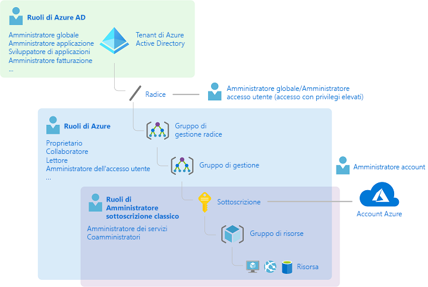
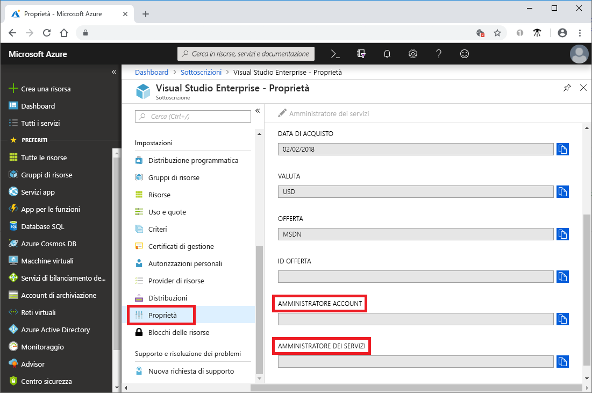
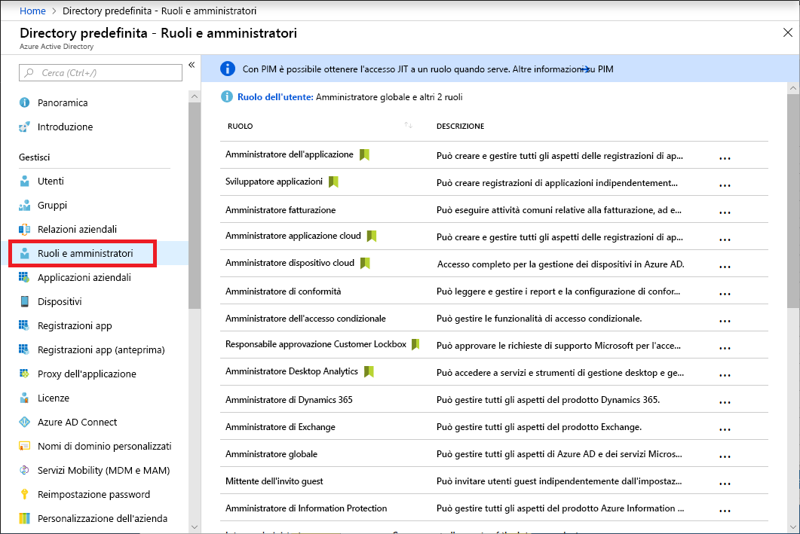

# Ruoli di amministratore sottoscrizione classico, ruoli di controllo degli accessi in base al ruolo di Azure e ruoli di amministratore di Azure AD

Se non si ha familiarità con Azure, può risultare un difficile comprendere i diversi ruoli disponibili in Azure. Questo articolo descrive i ruoli seguenti e il loro utilizzo:
- Ruoli di amministratore sottoscrizione classica
- Ruoli di controllo degli accessi in base al ruolo di Azure
- Ruoli di amministratore di Azure Active Directory (Azure AD)

## Correlazione tra i ruoli

Per comprendere meglio i ruoli in Azure, può essere utile conoscere parte della loro evoluzione. Nelle prime versioni di Azure l'accesso alle risorse veniva gestito con solo tre ruoli di amministratore: amministratore account, amministratore del servizio e coamministratore. In seguito venne aggiunto il controllo degli accessi in base al ruolo (RBAC) per le risorse di Azure. Il controllo degli accessi in base al ruolo (RBAC) di Azure è un sistema di autorizzazione più recente che offre una gestione degli accessi alle risorse di Azure più specifica. Il controllo degli accessi in base al ruolo (RBAC) include diversi ruoli predefiniti, può essere assegnato in ambiti diversi e consente di creare ruoli personalizzati. Per la gestione delle risorse in Azure AD, ad esempio utenti, gruppi e domini, sono disponibili diversi ruoli di amministratore di Azure AD.

L'illustrazione seguente offre una panoramica generale della correlazione tra i ruoli di amministratore sottoscrizione classica, di controllo degli accessi in base al ruolo (RBAC) di Azure e di amministratore di Azure AD.

## Ruoli di amministratore sottoscrizione classica

Amministratore account, Amministratore del servizio e Coamministratore sono i tre ruoli di amministratore per una sottoscrizione classica in Azure. I ruoli di amministratore sottoscrizione classica hanno accesso completo alla sottoscrizione di Azure e possono gestire le risorse con il portale di Azure, con le API di Azure Resource Manager e con le API del modello di distribuzione classica. L'account usato per iscriversi a Azure viene impostato automaticamente come amministratore account e amministratore del servizio. I coamministratori possono essere aggiunti in seguito. L'amministratore del servizio e i coamministratori dispongono di un accesso equivalente a quello degli utenti cui è stato assegnato il ruolo Proprietario (un ruolo Controllo degli accessi in base al ruolo di Azure) nell'ambito della sottoscrizione. La tabella seguente descrive le differenze tra questi tre ruoli di amministratore sottoscrizione classica.

| Amministratore sottoscrizione classica | Limite | Autorizzazioni | Note |
| --- | --- | --- | --- |
| Amministratore dell'account | 1 per ogni account di Azure | <ul><li>Accedere al [Centro account di Azure](https://account.azure.com/Subscriptions)</li><li>Gestire tutte le sottoscrizioni in un account</li><li>Creare nuove sottoscrizioni</li><li>Annullare le sottoscrizioni</li><li>Modificare la fatturazione per una sottoscrizione</li><li>Modificare l'amministratore del servizio</li></ul> | Concettualmente, il proprietario della fatturazione della sottoscrizione. L'amministratore account non ha accesso al portale di Azure. |
| Amministratore del servizio | 1 per ogni sottoscrizione di Azure | <ul><li>Gestire i servizi nel [portale di Azure](https://portal.azure.com)</li><li>Assegnare utenti al ruolo di coamministratore</li></ul> | Per impostazione predefinita, per una nuova sottoscrizione l'amministratore account è anche amministratore del servizio. L'amministratore del servizio ha un accesso equivalente a quello di un utente cui viene assegnato il ruolo di proprietario nell'ambito della sottoscrizione. L'amministratore del servizio ha accesso completo al portale di Azure. |
| Coamministratore | 200 per ogni sottoscrizione | <ul><li>Questo ruolo ha gli stessi privilegi di accesso dell'amministratore del servizio, ma non può modificare l'associazione di sottoscrizioni alle directory di Azure</li><li>Può assegnare utenti al ruolo di coamministratore, ma non può modificare l'amministratore del servizio</li></ul> | Il coamministratore ha un accesso equivalente a quello di un utente cui viene assegnato il ruolo di proprietario nell'ambito della sottoscrizione. |

Nel portale di Azure è possibile visualizzare gli utenti cui è assegnato il ruolo di amministratore account e amministratore del servizio visualizzando le proprietà della sottoscrizione.

Per informazioni su come aggiungere o modificare gli amministratori classici delle sottoscrizioni, vedere [Aggiungere o modificare gli amministratori delle sottoscrizioni di Azure](../billing/billing-add-change-azure-subscription-administrator.md) nella documentazione relativa alla fatturazione di Azure.

### Account e sottoscrizioni di Azure

Un account di Azure rappresenta una relazione di fatturazione. Un account di Azure include un'identità utente, una o più sottoscrizioni di Azure e un set associato di risorse di Azure. La persona che crea l'account è l'amministratore account di tutte le sottoscrizioni create nell'account. È anche l'amministratore del servizio predefinito per la sottoscrizione.

Le sottoscrizioni di Azure consentono di organizzare l'accesso alle risorse di Azure. Consentono inoltre di controllare come l'utilizzo delle risorse viene segnalato, fatturato e pagato. Ogni sottoscrizione può disporre di un’impostazione di fatturazione e pagamento diversa, in modo da poter avere sottoscrizioni e piani diversi per ufficio, reparto, progetto e così via. Ogni servizio appartiene a una sottoscrizione e l'ID sottoscrizione può essere necessario per le operazioni a livello di codice.

Gli account e le sottoscrizioni sono gestiti nel [Centro account di Azure](https://account.azure.com/Subscriptions).
## Ruoli di controllo degli accessi in base al ruolo di Azure

Il controllo degli accessi in base al ruolo di Azure è un sistema di autorizzazione basato su [Azure Resource Manager](../azure-resource-manager/resource-group-overview.md) che offre una gestione degli accessi dettagliata alle risorse in Azure, ad esempio alle risorse di calcolo e di archiviazione. Il controllo degli accessi in base al ruolo di Azure include oltre 70 ruoli predefiniti. Sono disponibili quattro ruoli principali di controllo degli accessi in base al ruolo. I primi tre si applicano a tutti i tipi di risorse:

| Ruolo Controllo degli accessi in base al ruolo di Azure | Autorizzazioni | Note |
| --- | --- | --- |
| [Proprietario](built-in-roles.md#owner) | <ul><li>Accesso completo a tutte le risorse</li><li>Delegare l'accesso ad altri utenti</li></ul> | All'amministratore del servizio e ai coamministratori viene assegnato il ruolo di proprietario nell'ambito della sottoscrizione. Si applica a tutti i tipi di risorsa. |
| [Collaboratore](built-in-roles.md#contributor) | <ul><li>Creare e gestire tutti i tipi di risorse di Azure</li><li>Non può concedere l'accesso ad altri utenti</li></ul> | Si applica a tutti i tipi di risorsa. |
| [Lettore](built-in-roles.md#reader) | <ul><li>Visualizzare le risorse di Azure</li></ul> | Si applica a tutti i tipi di risorsa. |
| [Amministratore accessi utente](built-in-roles.md#user-access-administrator) | <ul><li>Gestire l'accesso degli utenti alle risorse di Azure</li></ul> |  |

Gli altri ruoli predefiniti consentono la gestione di risorse di Azure specifiche. Ad esempio, il ruolo [Collaboratore Macchina virtuale](built-in-roles.md#virtual-machine-contributor) consente all'utente di creare e gestire macchine virtuali. Per un elenco di tutti i ruoli predefiniti, vedere [Ruoli predefiniti](built-in-roles.md).

Solo il portale di Azure e le API di Azure Resource Manager supportano il Controllo degli accessi in base al ruolo. Gli utenti, i gruppi e le applicazioni a cui vengono assegnati ruoli Controllo degli accessi in base al ruolo non possono usare le [API del modello di distribuzione classica di Azure](../azure-resource-manager/resource-manager-deployment-model.md).

Nel portale di Azure le assegnazioni di ruolo tramite il controllo degli accessi in base al ruolo sono visualizzate nel pannello **Controllo di accesso (IAM)**. Il pannello è disponibile in tutto il portale, ad esempio nelle sottoscrizioni, nei gruppi di risorse e in diverse risorse.

Quando si fa clic sull'opzione **Ruoli** viene visualizzato l'elenco dei ruoli predefiniti e personalizzati.

## Ruoli di amministratore di Azure AD

I ruoli di amministratore di Azure AD consentono di gestire le risorse di Azure AD in una directory, ad esempio di creare o modificare gli utenti, assegnare ruoli di amministratore ad altri utenti, reimpostare le password utente, gestire le licenze degli utenti e gestire i domini. La tabella seguente descrive alcuni dei ruoli di amministratore di Azure AD più importanti.

| Ruolo di amministratore di Azure AD | Autorizzazioni | Note |
| --- | --- | --- |
| [Amministratore globale](../active-directory/users-groups-roles/directory-assign-admin-roles.md#company-administrator) | <ul><li>Gestire l'accesso a tutte le funzionalità di amministrazione in Azure Active Directory, nonché ai servizi che attuano la federazione in Azure Active Directory</li><li>Assegnare i ruoli di amministratore ad altri utenti</li><li>Reimpostare la password per qualsiasi utente e per tutti gli altri amministratori</li></ul> | La persona che effettua l'iscrizione per il tenant di Azure Active Directory diventa amministratore globale. |
| [Amministratore utenti](../active-directory/users-groups-roles/directory-assign-admin-roles.md#user-account-administrator) | <ul><li>Creare e gestire tutti gli aspetti di utenti e gruppi</li><li>Gestire i ticket di supporto</li><li>Monitorare l'integrità dei servizi</li><li>Modificare le password degli utenti, degli amministratori del supporto tecnico e di altri amministratori degli utenti</li></ul> |  |
| [Amministratore fatturazione](../active-directory/users-groups-roles/directory-assign-admin-roles.md#billing-administrator) | <ul><li>Effettuare acquisti</li><li>Gestire le sottoscrizioni</li><li>Gestire i ticket di supporto</li><li>Monitorare l'integrità dei servizi</li></ul> |  |

Per un elenco di tutti i ruoli di amministratore di Azure AD, vedere [Assegnazione dei ruoli di amministratore in Azure Active Directory](/azure/active-directory/active-directory-assign-admin-roles-azure-portal).

Nel portale di Azure è possibile visualizzare l'elenco dei ruoli di amministratore di Azure AD nel pannello **Ruoli e amministratori**.

## Differenze tra i ruoli di controllo dell'accesso in base al ruolo di Azure e i ruoli di amministratore di Azure AD

A livello generale, i ruoli di controllo dell'accesso in base al ruolo di Azure controllano le autorizzazioni per gestire le risorse di Azure, mentre i ruoli di amministratore di Azure AD controllano le autorizzazioni per gestire le risorse di Azure Active Directory. La tabella seguente confronta alcune differenze.

| Ruoli di controllo degli accessi in base al ruolo di Azure | Ruoli di amministratore di Azure AD |
| --- | --- |
| Gestire l'accesso alle risorse di Azure | Gestire l'accesso alle risorse di Azure Active Directory |
| Supportano i ruoli personalizzati | Non consentono di creare ruoli personalizzati |
| È possibile specificare l'ambito a più livelli (gruppo di gestione, sottoscrizione, gruppo di risorse, risorsa) | L'ambito è a livello di tenant |
| Le informazioni sui ruoli sono accessibili nel portale di Azure, nell'interfaccia della riga di comando di Azure, in Azure PowerShell, nei modelli di Azure Resource Manager, nell'API REST | Le informazioni sui ruoli sono accessibili nel portale di amministrazione di Azure, nel portale di amministrazione di Office 365, in Microsoft Graph, in AzureAD PowerShell |

### I ruoli di controllo dell'accesso in base al ruolo di Azure e i ruoli di amministratore di Azure AD si sovrappongono?

Per impostazione predefinita, i ruoli di controllo dell'accesso in base al ruolo di Azure e i ruoli di amministratore di Azure AD non si estendono oltre Azure e Azure AD. Tuttavia, se un amministratore globale ne eleva l'accesso scegliendo l'opzione **Gli amministratori globali possono gestire le sottoscrizioni di Azure e i gruppi di gestione** nel portale di Azure, all'amministratore globale verrà assegnato il ruolo [Amministratore Accesso utenti](built-in-roles.md#user-access-administrator) (un ruolo di controllo degli accessi in base al ruolo) in tutte le sottoscrizioni di un tenant specifico. Il ruolo Amministratore Accesso utenti consente all'utente di assegnare ad altri utenti l'accesso alle risorse di Azure. Questa opzione può essere utile per ottenere nuovamente l'accesso a una sottoscrizione. Per altre informazioni, vedere [Elevate access as an Azure AD administrator](elevate-access-global-admin.md) (Elevare l'accesso come amministratore di Azure AD).

Diversi ruoli di amministratore di Azure si applicano ad Azure AD e a Microsoft Office 365, ad esempio i ruoli di amministratore globale e di amministratore utenti. Ad esempio, se si è un membro del ruolo Amministratore globale, si dispone delle autorizzazioni di amministratore globale in Azure AD e Office 365, ad esempio per effettuare modifiche in Microsoft Exchange e Microsoft SharePoint. Tuttavia, per impostazione predefinita, l'amministratore globale non ha accesso alle risorse di Azure.

## Passaggi successivi

- [Che cos'è il controllo degli accessi in base al ruolo?](overview.md)
- [Assegnazione dei ruoli di amministratore in Azure Active Directory](/azure/active-directory/active-directory-assign-admin-roles-azure-portal)
- [Aggiungere o modificare gli amministratori delle sottoscrizioni di Azure](/azure/billing/billing-add-change-azure-subscription-administrator)
