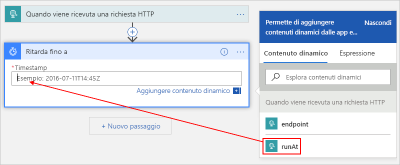
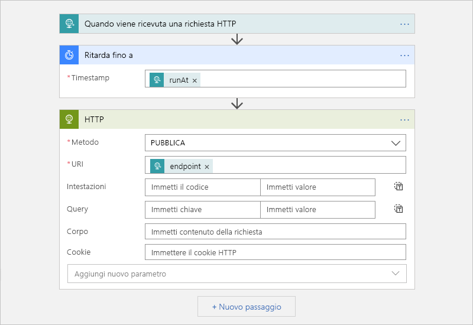

# Eseguire la migrazione da Utilità di pianificazione ad App per la logica di Azure

> [!IMPORTANT]
> App per la logica di Azure sostituirà Utilità di pianificazione di Azure di cui è in corso il ritiro. Per pianificare i processi, seguire le indicazioni di questo articolo per passare ad App per la logica di Azure.

Questo articolo illustra come pianificare processi unici e ricorrenti mediante la creazione di flussi di lavoro automatizzati con App per la logica di Azure anziché con l'Utilità di pianificazione di Microsoft Azure. Quando si creano processi pianificati con App per la logica, si ottengono questi vantaggi:

* Non è necessario preoccuparsi del concetto di *raccolta di processi*, perché ogni app per la logica è una risorsa di Azure separata.

* È possibile eseguire più processi unici usando una singola app per la logica.

* Il servizio App per la logica di Azure supporta i fusi orari e l'ora legale.

Per altre informazioni su Azure, vedere [Informazioni su App per la logica di Azure](../logic-apps/logic-apps-overview.md) In alternativa, provare a creare la prima app per la logica in questa Guida introduttiva: [Creare la prima app per la logica](../logic-apps/quickstart-create-first-logic-app-workflow.md).

## Prerequisiti

* Una sottoscrizione di Azure. Se non si ha una sottoscrizione di Azure, <a href="https://azure.microsoft.com/free/" target="_blank">iscriversi per creare un account Azure gratuito</a>.

* Per attivare l'app per la logica inviando richieste HTTP, usare uno strumento come l'[app desktop Postman](https://www.getpostman.com/apps).

## Pianificare processi unici

È possibile eseguire più processi unici creando una singola app per la logica. 

### Creare l'app per la logica

1. Nel [portale di Azure](https://portal.azure.com) creare o un'app per la logica vuota in Progettazione app per la logica. 

   Per i passaggi di base, seguire [Guida introduttiva: Creare la prima app per la logica](../logic-apps/quickstart-create-first-logic-app-workflow.md).

1. Nella casella di ricerca, digitare "in caso di richiesta http" come filtro. Nell'elenco di trigger selezionare questo trigger: **Quando viene ricevuta una richiesta HTTP** 

   

1. Per il trigger di richiesta, facoltativamente si può fornire uno schema JSON, che consente a Progettazione app per la logica di comprendere la struttura per gli input dalla richiesta in ingresso e semplifica la selezione degli output in un secondo momento nel flusso di lavoro.

   Per specificare uno schema, immetterlo nella casella **Schema JSON del corpo della richiesta**, ad esempio: 

   

   Se non si ha uno schema, ma si ha un payload di esempio in formato JSON, è possibile generare uno schema da tale payload.

   1. Nel trigger Richiesta selezionare **Usare il payload di esempio per generare lo schema**.

   1. In **Immettere o incollare un payload JSON di esempio** specificare il payload di esempio e quindi scegliere **Fine**, ad esempio:

      

1. Nel trigger scegliere **Passaggio successivo**. 

1. Nella casella di ricerca immettere "ritarda fino a" come filtro. Nell'elenco delle azioni selezionare questa azione: **Ritarda fino a**

   Questa azione sospende il flusso di lavoro dell'app per la logica fino a una data e un'ora specificate.

   

1. Immettere il timestamp per l'avvio dei flussi di lavoro dell'app per la logica. 

   Quando si fa clic all'interno della casella **Timestamp** compare l'elenco di contenuto dinamico, da cui si può facoltativamente selezionare un output dal trigger.

   

1. Aggiungere le eventuali altre azioni da eseguire scegliendo tra [circa 200 connettori](../connectors/apis-list.md). 

   Ad esempio, è possibile includere un'azione HTTP che invia una richiesta a un URL oppure azioni che funzionano con code di archiviazione, code del bus di servizio o argomenti del bus di servizio: 

   

1. Al termine, salvare l'app per la logica.

   

   Quando si salva l'app per la logica per la prima volta, l'URL dell'endpoint per il trigger di richiesta dell'app per la logica viene visualizzato nella casella **URL POST HTTP**. 
   Quando si vuole chiamare l'app per la logica e inviare input all'app per la logica per l'elaborazione, usare questo URL come destinazione della chiamata.

   

1. Copiare e salvare questo URL dell'endpoint in modo che in un secondo momento sia possibile inviare una richiesta manuale che attiva l'app per la logica. 

## Avviare un processo unico

Per eseguire o attivare manualmente un processo unico, inviare una chiamata all'URL dell'endpoint per il trigger di richiesta dell'app per la logica. Nella chiamata specificare l'input o il payload da inviare, che potrebbe essere stato descritto in precedenza specificando uno schema. 

Ad esempio, usando l'app Postman, è possibile creare una richiesta POST con impostazioni simili a questo esempio e quindi scegliere **Send** (Invia) per effettuare la richiesta.

| Metodo richiesta | URL | Corpo | Headers |
|----------------|-----|------|---------| 
| **POST** | <*endpoint-URL*> | **raw** 
**JSON(application/json)** 
Nella casella **raw** immettere il payload da inviare nella richiesta. 
**Nota**: Automaticamente questa impostazione consente di configurare il **intestazioni** valori. | **Chiave**: Content-Type  **Value (Valore)**: application/json
 |||| 

Dopo l'invio della chiamata, la risposta dell'app per la logica viene visualizzata sotto la casella **raw** nella scheda **Body** (Corpo). 

> [!IMPORTANT]
>
> Se in seguito si vuole annullare il processo, scegliere la scheda **Headers** (Intestazioni). Trovare e copiare il valore di intestazione **x-ms-workflow-run-id** nella risposta. 
>
> 

## Annullare un processo unico

In App per la logica, ogni processo unico viene eseguito come singola istanza di esecuzione dell'app per la logica. Per annullare un processo unico, è possibile usare l'operazione [Cancel](https://docs.microsoft.com/rest/api/logic/workflowruns/cancel) nell'API REST di App per la logica. Quando si invia una chiamata al trigger, specificare l'[ID di esecuzione del flusso di lavoro](#workflow-run-id).

## Pianificare processi ricorrenti

### Creare l'app per la logica

1. Nel [portale di Azure](https://portal.azure.com) creare o un'app per la logica vuota in Progettazione app per la logica. 

   Per i passaggi di base, seguire [Guida introduttiva: Creare la prima app per la logica](../logic-apps/quickstart-create-first-logic-app-workflow.md).

1. Nella casella di ricerca digitare "ricorrenza" come filtro. Nell'elenco di trigger selezionare questo trigger: **Ricorrenza** 

   

1. Configurare una pianificazione più avanzata, se si desidera.

   

   Per altre informazioni sulle opzioni di pianificazione avanzate, vedere [Creare ed eseguire le attività ricorrenti e flussi di lavoro con le App per la logica di Azure](../connectors/connectors-native-recurrence.md)

1. Aggiungere le altre azioni da eseguire scegliendo tra [oltre 200 connettori](../connectors/apis-list.md). Nel trigger scegliere **Passaggio successivo**. Trovare e selezionare le azioni desiderate.

   Ad esempio, è possibile includere un'azione HTTP che invia una richiesta a un URL oppure azioni che funzionano con code di archiviazione, code del bus di servizio o argomenti del bus di servizio: 

   

1. Al termine, salvare l'app per la logica.

   

## Configurazione avanzata

Ecco altri modi per personalizzare i processi.

### Criteri di ripetizione

Per controllare i tentativi di ripetizione di un'azione nell'app per la logica quando si verificano errori intermittenti, è possibile impostare [criteri di ripetizione](../logic-apps/logic-apps-exception-handling.md#retry-policies) nelle impostazioni di ogni azione, ad esempio:

1. Aprire il menu (**...**) dell'azione e selezionare **Impostazioni**.

   

1. Selezionare i criteri desiderati. Per altre informazioni, vedere [Criteri di ripetizione dei tentativi](../logic-apps/logic-apps-exception-handling.md#retry-policies).

   

## Gestire errori ed eccezioni

Nell'Utilità di pianificazione di Microsoft Azure, se l'azione predefinita non viene eseguita correttamente è possibile eseguire un'azione alternativa per risolvere la condizione di errore. In App per la logica di Azure si può eseguire la stessa attività.

1. In Progettazione App per la logica, sopra l'azione da gestire, spostare il puntatore del mouse sulla freccia tra i vari passaggi e selezionare **Aggiungi un ramo parallelo**. 

   

1. Trovare e selezionare l'azione da eseguire come azione alternativa.

   

1. Nell'azione alternativa aprire il menu (**...**) e selezionare **Configura azione Run after**.

   

1. Deselezionare la casella di controllo per la proprietà **è riuscita**. Selezionare queste proprietà: **non è riuscita**, **è stata ignorata** e **è scaduta**

   

1. Al termine, scegliere **Fine**.

Per altre informazioni sulla gestione delle eccezioni, vedere [Rilevare e gestire gli errori con la proprietà RunAfter](../logic-apps/logic-apps-exception-handling.md#catch-and-handle-failures-with-the-runafter-property).

## Domande frequenti

 

**D**: Quando è ritiro dell'utilità di pianificazione di Azure?  
**R**: Utilità di pianificazione di Azure è pianificato per ritirare il 30 settembre 2019.

**D**: Cosa accade ai processi e raccolte di processi dell'utilità di pianificazione dopo ritira il servizio?  
**R**: Tutti i processi e raccolte di processi dell'utilità di pianificazione verranno eliminati dal sistema.

**D**: È necessario eseguire il backup o eseguire altre attività prima della migrazione miei processi dell'utilità di pianificazione per App per la logica?  
**R**: Come procedura consigliata, eseguire il backup del lavoro. Prima di eliminare o disabilitare i processi dell'Utilità di pianificazione, verificare che le app per la logica create funzionino come previsto. 

**D**: È presente uno strumento che può risultare utile per eseguire la migrazione di processi personali dall'utilità di pianificazione per App per la logica?  
**R**: Ogni processo dell'utilità di pianificazione è univoco, in modo che non esiste un unico strumento. Tuttavia, saranno disponibili vari script modificabili in base alle proprie esigenze. Per la disponibilità di script, tornare a controllare più avanti.

**D**: Dove posso ottenere il supporto per la migrazione dei miei processi dell'utilità di pianificazione?  
**R**: Ecco alcuni modi per ottenere supporto: 

**Portale di Azure**

Se la sottoscrizione di Azure ha di un piano di supporto a pagamento, è possibile creare una richiesta di supporto tecnico nel portale di Azure. In caso contrario, è possibile selezionare un'opzione di supporto diversa.

1. Nel menu principale del [portale di Azure](https://portal.azure.com) selezionare **Guida e supporto**.

1. In **Supporto** selezionare **Nuova richiesta di supporto**. Fornire questi dettagli per la richiesta:

   | Impostazione | Value |
   |---------|-------|
   | **Tipo di problema** | **Tecnico** | 
   | **Sottoscrizione** | <*sottoscrizione-di-Azure*> | 
   | **Servizio** | In **Monitoraggio e gestione** selezionare **Utilità di pianificazione**. | 
   ||| 

1. Selezionare l'opzione di supporto desiderata. Se si ha un piano di supporto a pagamento, scegliere **Avanti**.

**Community**

* [Forum su App per la logica di Azure](https://social.msdn.microsoft.com/Forums/en-US/home?forum=azurelogicapps)
* [Stack Overflow](https://stackoverflow.com/questions/tagged/azure-scheduler)

## Passaggi successivi

* [Creare regolarmente attività in esecuzione e flussi di lavoro con App per la logica di Azure](../connectors/connectors-native-recurrence.md)
* [Esercitazione: Controllare il traffico con un'app per la logica basata su pianificazione](../logic-apps/tutorial-build-schedule-recurring-logic-app-workflow.md)