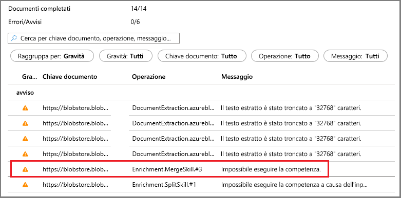
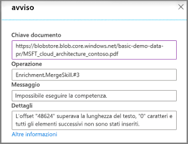

# Avvio rapido: Creare un set di competenze cognitive di Ricerca cognitiva di Azure nel portale di Azure

Un set di competenze è una funzionalità di intelligenza artificiale che estrae le informazioni e la struttura da file di testo o immagine non differenziati di grandi dimensioni e le rende indicizzabili e ricercabili per le query di ricerca full-text in Ricerca cognitiva di Azure. 

In questa guida di avvio rapido verranno combinati servizi e dati nel cloud di Azure per creare il set di competenze. Si userà quindi la procedura guidata **Importa dati** nel portale per riunire tutti i dati ottenuti. Il risultato finale è un indice ricercabile popolato con i dati creati dall'elaborazione di intelligenza artificiale su cui è possibile eseguire query nel portale ([Esplora ricerche](search-explorer.md)).

Se non si ha una sottoscrizione di Azure, creare un [account gratuito](https://azure.microsoft.com/free/?WT.mc_id=A261C142F) prima di iniziare.

## Creare i servizi e caricare i dati

Questa guida di avvio rapido usa Ricerca cognitiva di Azure, [Archiviazione BLOB di Azure](https://docs.microsoft.com/azure/storage/blobs/) e [Servizi cognitivi di Azure](https://azure.microsoft.com/services/cognitive-services/) per l'intelligenza artificiale. 

Poiché il carico di lavoro è molto ridotto, Servizi cognitivi lavora dietro le quinte per offrire un'elaborazione gratuita per un massimo di 20 transazioni al giorno per indicizzatore quando vengono richiamate da Ricerca cognitiva di Azure. Se i usano i dati di esempio forniti, è possibile evitare di creare o collegare una risorsa di Servizi cognitivi.

1. [Scaricare i dati di esempio](https://1drv.ms/f/s!As7Oy81M_gVPa-LCb5lC_3hbS-4) costituiti da un piccolo set di file di tipi diversi. Decomprimere i file.

1. [Creare un account di archiviazione di Azure](https://docs.microsoft.com/azure/storage/common/storage-quickstart-create-account?tabs=azure-portal) o [trovare un account esistente](https://ms.portal.azure.com/#blade/HubsExtension/BrowseResourceBlade/resourceType/Microsoft.Storage%2storageAccounts/). 

   Per evitare addebiti dovuti alla larghezza di banda, scegliere la stessa area di Ricerca cognitiva di Azure. 
   
   Scegliere il tipo di account Archiviazione V2 (utilizzo generico V2) se si vuole provare la funzionalità dell'archivio conoscenze in un secondo momento, in un'altra procedura dettagliata. In caso contrario, scegliere un tipo qualsiasi.

1. Aprire le pagine dei servizi BLOB e creare un contenitore. È possibile usare il livello di accesso pubblico predefinito. 

1. Nel contenitore fare clic su **Carica** per caricare i file di esempio scaricati nel primo passaggio. Si noti che è disponibile un'ampia gamma di tipi di contenuto, tra cui immagini e file di applicazioni che non sono disponibili per la ricerca full-text nei formati nativi.

   

1. [Creare un servizio di Ricerca cognitiva di Azure](search-create-service-portal.md) o [trovare un servizio esistente](https://ms.portal.azure.com/#blade/HubsExtension/BrowseResourceBlade/resourceType/Microsoft.Search%2FsearchServices). È possibile usare un servizio gratuito per questo avvio rapido.

A questo punto è possibile procedere con la procedura guidata Importa dati.

## Eseguire la procedura guidata Importa dati

Nella pagina Panoramica del servizio di ricerca fare clic su **Importa dati** sulla barra dei comandi per configurare l'arricchimento cognitivo in quattro passaggi.

  

### Passaggio 1: Creare un'origine dati

1. In **Definisci la connessione ai dati** scegliere **Archiviazione BLOB di Azure** e selezionare l'account di archiviazione e il contenitore creati. Assegnare un nome origine dati e utilizzare i valori predefiniti per il resto. 

   

    Passare alla pagina successiva.

### Passaggio 2: Aggiungere competenze cognitive

Configurare quindi l'arricchimento tramite intelligenza artificiale per richiamare OCR, l'analisi delle immagini e l'elaborazione del linguaggio naturale. 

1. Per questa guida di avvio rapido si usa la risorsa Servizi cognitivi **gratuita**. I dati di esempio sono costituiti da 14 file, pertanto l'allocazione gratuita di 20 transazioni su Servizi cognitivi è sufficiente per questa guida di avvio rapido. 

   

1. Espandere **Aggiungi arricchimenti** ed effettuare quattro selezioni. 

   Abilitare OCR per aggiungere le competenze di analisi delle immagini alla pagina della procedura guidata.

   Impostare la granularità su Pagine per suddividere il testo in blocchi più piccoli. Diverse competenze testuali sono limitate a input di 5 KB.

   Scegliere le competenze di riconoscimento entità (persone, organizzazioni e località) e di analisi delle immagini.

   

   Passare alla pagina successiva.

### Passaggio 3: Configurare l'indice

Un indice contiene il contenuto ricercabile e la procedura guidata **Importa dati** può in genere creare lo schema automaticamente eseguendo il campionamento dell'origine dati. In questo passaggio occorre esaminare lo schema generato e potenzialmente rivedere le impostazioni. Di seguito è riportato lo schema predefinito creato per il set di dati BLOB demo.

Per questa Guida introduttiva, la procedura guidata ha imposta valori predefiniti ragionevoli in modo efficace:  

+ I campi predefiniti sono basati sulle proprietà di BLOB esistenti, oltre a nuovi campi che contengono l'output di arricchimento, ad esempio `people`, `organizations``locations`. I tipi di dati vengono dedotti dai metadati e mediante il campionamento dei dati.

+ La chiave di documento predefinita è *metadata_storage_path* (selezionata perché il campo contiene valori univoci).

+ Gli attributi predefiniti sono **Recuperabile** e **Ricercabile**. L'attributo **Ricercabile** indica che è possibile eseguire ricerche full-text in un campo. L'attributo **Recuperabile** indica che i valori dei campi possono essere restituiti nei risultati. La procedura guidata presuppone che si voglia rendere questi campi recuperabili e ricercabili perché sono stati creati con un insieme di competenze.

  

Osservare il testo barrato e il punto interrogativo sull'attributo **Recuperabile** accanto al campo `content`. Per i documenti BLOB a elevato utilizzo di testo, il campo `content` contiene la maggior parte del contenuto del file, eseguito potenzialmente in migliaia di righe. Un campo come questo è scomodo nei risultati della ricerca ed è opportuno escluderlo per questa demo. 

Se però è necessario passare il contenuto del file al codice client, assicurarsi che l'attributo **Recuperabile** rimanga selezionato. In caso contrario, provare a cancellare questo attributo in `content` se gli elementi estratti (ad esempio `people`, `organizations` e `locations`) sono sufficienti per gli scopi desiderati.

Contrassegnare un campo come **Recuperabile** non significa che il campo *debba* essere presente nei risultati della ricerca. È possibile controllare con precisione la composizione dei risultati della ricerca usando il parametro di query **$select** per specificare i campi da includere. Per i campi con grandi quantità di testo come `content`, il parametro **$select** è la soluzione per fornire risultati della ricerca gestibili agli utenti umani dell'applicazione, garantendo allo stesso tempo che il codice abbia accesso a tutte le informazioni necessarie attraverso l'attributo **Recuperabile**.
  
Passare alla pagina successiva.

### Passaggio 4: Configurare l'indicizzatore

L'indicizzatore è una risorsa di alto livello che guida il processo di indicizzazione. Specifica il nome dell'origine dati, l'indice di destinazione e la frequenza di esecuzione. La procedura guidata **Importa dati** crea diversi oggetti, uno dei quali è sempre un indicizzatore che può essere eseguito ripetutamente.

1. Nella pagina **Indicizzatore** si può accettare il nome predefinito e fare clic sull'opzione di pianificazione **Una sola volta** per l'esecuzione immediata. 

   

1. Fare clic su **Invia** per creare e contemporaneamente eseguire l'indicizzatore.

## Monitorare lo stato

Il completamento dell'indicizzazione delle competenze cognitive richiede più tempo rispetto all'indicizzazione tipica basata su testo, in particolare nel caso dell'OCR e dell'analisi delle immagini. Per monitorare lo stato, passare alla pagina Panoramica e fare clic su **Indicizzatori** al centro della pagina.

  

Gli avvisi sono normali in considerazione all'ampia gamma di tipi di contenuto. Alcuni tipi di contenuto non sono validi per determinate competenze e a livelli più bassi è facile riscontrare [limiti dell'indicizzatore](search-limits-quotas-capacity.md#indexer-limits). Ad esempio, le notifiche di troncamento a 32.000 caratteri sono un limite dell'indicizzatore per il livello gratuito. Se si esegue la demo con un livello superiore, numerosi avvisi di troncamento non vengono visualizzati.

Per controllare avvisi o errori, fare clic sullo stato Avviso nell'elenco Indicizzatori per aprire la pagina Cronologia di esecuzione.

In questa pagina fare di nuovo clic sullo stato Avviso per visualizzare l'elenco di avvisi simile a quello mostrato di seguito. 

  

Quando si fa clic su una riga di stato specifica, vengono visualizzati i dettagli. Questo avviso indica che il merge è stato interrotto in seguito al raggiungimento di una soglia massima (le dimensioni di questo particolare PDF sono notevoli).

  

## Eseguire query in Esplora ricerche

Dopo aver creato un indice, è possibile eseguire query per la restituzione di risultati. Per questa attività usare **Esplora ricerche** nel portale. 

1. Nella pagina del dashboard del servizio di ricerca fare clic su **Esplora ricerche** sulla barra dei comandi.

1. Selezionare **Cambia indice** in alto per selezionare l'indice creato.

1. Immettere una stringa di ricerca per una query nell'indice, ad esempio `search=Microsoft&$select=people,organizations,locations,imageTags`.

I risultati vengono restituiti in formato JSON, che può essere dettagliato e difficile da leggere, soprattutto in documenti di grandi dimensioni derivanti da BLOB di Azure. Alcuni suggerimenti per la ricerca in questo strumento includono le tecniche seguenti:

+ Aggiungere `$select` per specificare i campi da includere nei risultati. 
+ Usare CTRL+F per cercare proprietà o termini specifici nel codice JSON.

Le stringhe di query fanno distinzione tra maiuscole e minuscole. Se quindi viene visualizzato un messaggio di campo sconosciuto, controllare **Campi** o **Definizione di indice (JSON)** per verificare il nome e l'uso delle maiuscole/minuscole. 

  

## Risultati

È stato creato il primo set di competenze e sono stati appresi importanti concetti utili per la creazione del prototipo di una soluzione di ricerca arricchita con i propri dati.

Alcuni concetti chiave ci auguriamo l'utente abbia compreso includono la dipendenza da origini dati di Azure. Un set di competenze è associato a un indicizzatore e gli indicizzatori sono specifici di Azure e dell'origine. Anche se in questa Guida introduttiva viene usato Archivio BLOB di Azure, sono possibili altre origini dati di Azure. Per altre informazioni, vedere [Indicizzatori in Ricerca cognitiva di Azure](search-indexer-overview.md). 

Un altro concetto importante è che le competenze operano sui tipi di contenuto e quando si lavora con contenuto eterogeneo, alcuni input verranno ignorati. File o campi di grandi dimensioni potrebbero inoltre superare i limiti dell'indicizzatore del livello di servizio. È quindi normale che vengano visualizzati avvisi quando si verificano questi eventi. 

L'output viene indirizzato a un indice di ricerca ed esiste un mapping tra le coppie nome-valore create durante l'indicizzazione e i singoli campi dell'indice. Internamente, il portale configura [annotazioni](cognitive-search-concept-annotations-syntax.md) e definisce un [set di competenze](cognitive-search-defining-skillset.md), stabilendo l'ordine delle operazioni e il flusso generale. Questi passaggi sono nascosti nel portale, ma quando si avvia la scrittura di codice, questi concetti diventano importanti.

Infine, si è appreso che è possibile verificare il contenuto eseguendo una query sull'indice. In ultima analisi, ciò che Ricerca cognitiva di Azure offre è un indice ricercabile in cui è possibile eseguire query usando la [sintassi di query semplice](https://docs.microsoft.com/rest/api/searchservice/simple-query-syntax-in-azure-search) o [completamente estesa](https://docs.microsoft.com/rest/api/searchservice/lucene-query-syntax-in-azure-search). Un indice che contiene campi arricchiti è come qualsiasi altro. Se si vuole incorporare [analizzatori personalizzati](search-analyzers.md) o standard, [profili di punteggio](https://docs.microsoft.com/rest/api/searchservice/add-scoring-profiles-to-a-search-index), [sinonimi](search-synonyms.md), [filtri con facet](search-filters-facets.md), ricerca geografica o qualsiasi altra funzionalità di Ricerca cognitiva di Azure, è possibile farlo.

## Pulire le risorse

Quando si lavora nella propria sottoscrizione, alla fine di un progetto è opportuno verificare se le risorse create sono ancora necessarie. L'esecuzione continua delle risorse può avere un costo. È possibile eliminare le singole risorse oppure il gruppo di risorse per eliminare l'intero set di risorse.

Per trovare e gestire le risorse nel portale, usare il collegamento **Tutte le risorse** o **Gruppi di risorse** nel riquadro di spostamento a sinistra.

Se si usa un servizio gratuito, tenere presente che il numero di indicizzatori e origini dati è limitato a tre. Per non superare il limite, è possibile eliminare i singoli elementi nel portale. 

> [!Tip]
> Se si vuole ripetere questo esercizio o provare un'altra procedura dettagliata per gli arricchimenti tramite intelligenza artificiale, eliminare l'indicizzatore nel portale. Eliminando l'indicizzatore, il contatore delle transazioni giornaliere gratuite viene azzerato per l'elaborazione di Servizi cognitivi.

## Passaggi successivi

È possibile creare set di competenze usando il portale, .NET SDK o l'API REST. Per approfondire le proprie conoscenze, provare l'API REST usando Postman e altri dati di esempio.

> [!div class="nextstepaction"]
> [Esercitazione: Estrarre testo e struttura da BLOB JSON usando le API REST ](cognitive-search-tutorial-blob.md)