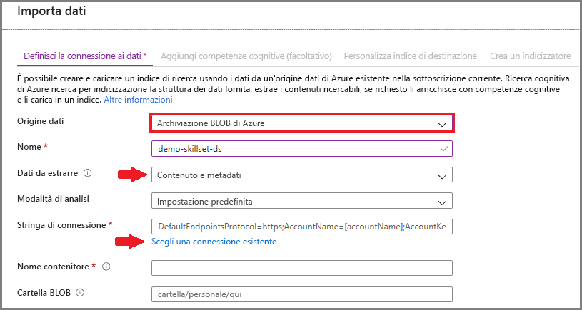
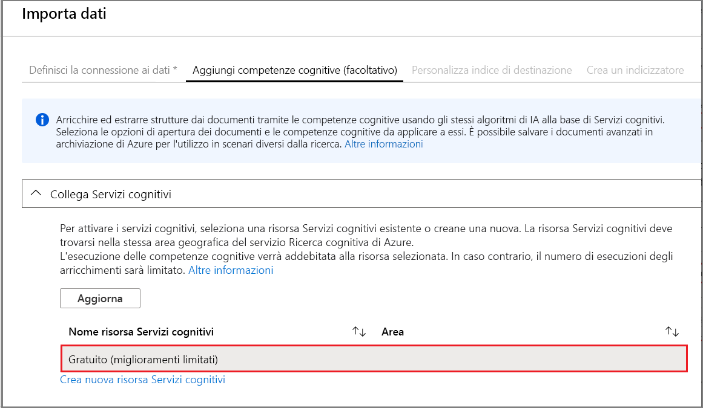
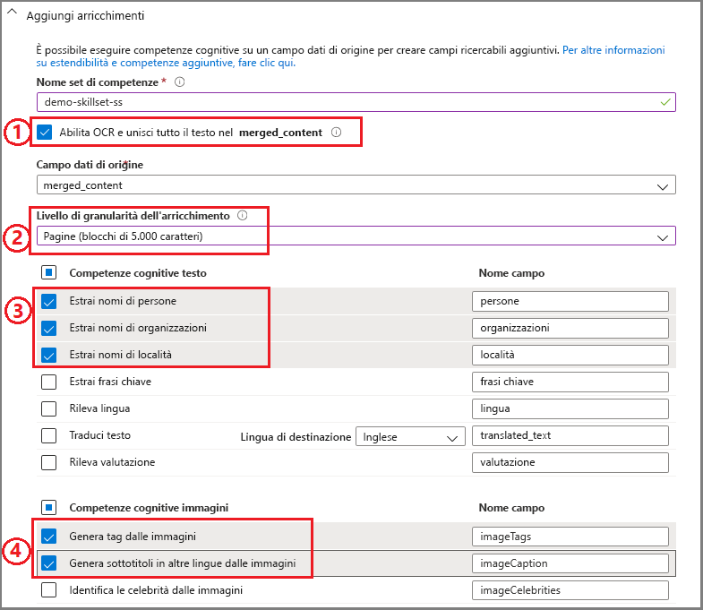
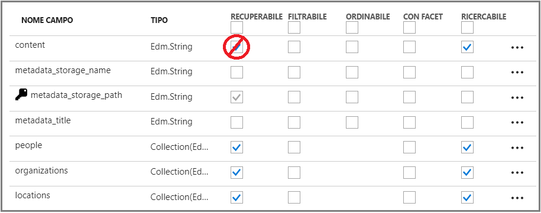
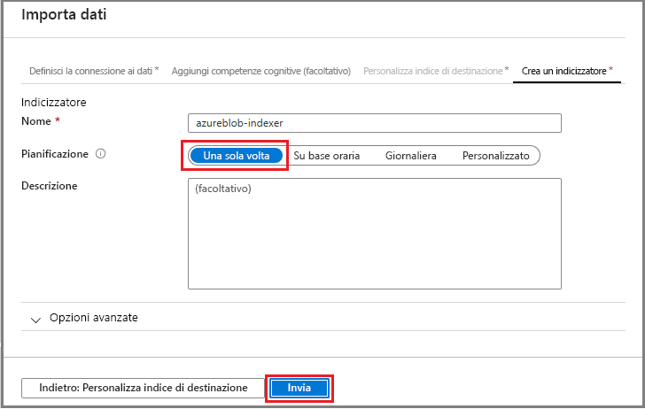
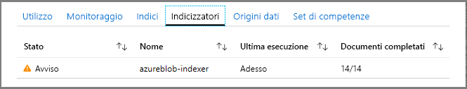
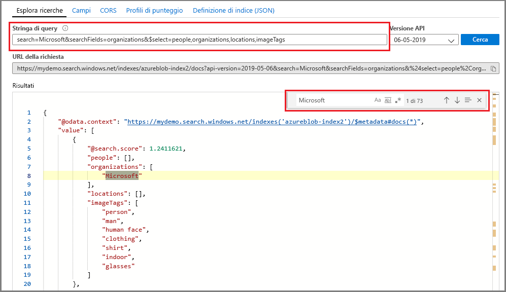

# Guida introduttiva: Creare un set di competenze cognitive di Ricerca cognitiva di Azure nel portale di Azure

Un set di competenze è una funzionalità di intelligenza artificiale che estrae le informazioni e la struttura da file di testo o immagine non differenziati di grandi dimensioni e le rende indicizzabili e ricercabili per le query di ricerca full-text in Ricerca cognitiva di Azure. 

In questa guida di avvio rapido verranno combinati servizi e dati nel cloud di Azure per creare il set di competenze. Si userà quindi la procedura guidata **Importa dati** nel portale per riunire tutti i dati ottenuti. Il risultato finale è un indice ricercabile popolato con i dati creati dall'elaborazione di intelligenza artificiale su cui è possibile eseguire query nel portale ([Esplora ricerche](search-explorer.md)).

Se non si ha una sottoscrizione di Azure, creare un [account gratuito](https://azure.microsoft.com/free/?WT.mc_id=A261C142F) prima di iniziare.

## Creare i servizi e caricare i dati

Questa guida di avvio rapido usa Ricerca cognitiva di Azure, Archiviazione BLOB di Azure e [Servizi cognitivi di Azure](https://azure.microsoft.com/services/cognitive-services/) per l'intelligenza artificiale. 

Poiché il carico di lavoro è molto ridotto, Servizi cognitivi lavora dietro le quinte per offrire un'elaborazione gratuita per un massimo di 20 transazioni al giorno quando vengono richiamate da Ricerca cognitiva di Azure. Se i usano i dati di esempio forniti, è possibile evitare di creare o collegare una risorsa di Servizi cognitivi.

1. [Scaricare i dati di esempio](https://1drv.ms/f/s!As7Oy81M_gVPa-LCb5lC_3hbS-4) costituiti da un piccolo set di file di tipi diversi. Decomprimere i file.

1. [Creare un account di archiviazione di Azure](https://docs.microsoft.com/azure/storage/common/storage-quickstart-create-account?tabs=azure-portal) o [trovare un account esistente](https://ms.portal.azure.com/#blade/HubsExtension/BrowseResourceBlade/resourceType/Microsoft.Storage%2storageAccounts/) nella sottoscrizione corrente. 

   Scegliere la stessa area di Ricerca cognitiva di Azure. Scegliere il tipo di account Archiviazione V2 (utilizzo generico V2) se si vuole provare la funzionalità dell'archivio conoscenze in un secondo momento, in un'altra procedura dettagliata. In caso contrario, scegliere un tipo qualsiasi.

1. Aprire le pagine dei servizi BLOB e creare un contenitore. È possibile usare il livello di accesso pubblico predefinito. 

1. Nel contenitore fare clic su **Carica** per caricare i file di esempio scaricati nel primo passaggio. Si noti che è disponibile un'ampia gamma di tipi di contenuto, tra cui immagini e file di applicazioni che non sono disponibili per la ricerca full-text nei formati nativi.

   

1. [Creare un servizio di ricerca cognitiva di Azure](search-create-service-portal.md) o [trovare un servizio esistente](https://ms.portal.azure.com/#blade/HubsExtension/BrowseResourceBlade/resourceType/Microsoft.Search%2FsearchServices) nella stessa sottoscrizione. È possibile usare un servizio gratuito per questo avvio rapido.

<!-- 1. You are almost done with this resource, but before you leave these pages, use a link on the left navigation pane to open the **Access Keys** page. In many tutorials, especially those that use the REST API, you will need a connection string to retrieve data from Blob storage. A connection string looks similar to the following example: `DefaultEndpointsProtocol=https;AccountName=<YOUR-ACCOUNT-NAME>;AccountKey=<YOUR-ACCOUNT-KEY>;EndpointSuffix=core.windows.net` -->

A questo punto è possibile procedere con la procedura guidata Importa dati.

## Eseguire la procedura guidata Importa dati

Nella pagina Panoramica del servizio di ricerca fare clic su **Importa dati** sulla barra dei comandi per configurare l'arricchimento cognitivo in quattro passaggi.

  

### Passaggio 1: Creare un'origine dati

1. In **Definisci la connessione ai dati** scegliere **Archiviazione BLOB di Azure** e selezionare l'account di archiviazione e il contenitore creati. Assegnare un nome origine dati e utilizzare i valori predefiniti per il resto. 

   

1. Passare alla pagina successiva.

### Passaggio 2: Aggiungere competenze cognitive

A questo punto occorre aggiungere le competenze cognitive per richiamare l'elaborazione del linguaggio naturale. I dati di esempio sono costituiti da 12 file, pertanto l'allocazione gratuita di 20 transazioni su Servizi cognitivi è sufficiente per questa guida di avvio rapido. Poiché non si sta usando l'OCR, in questo processo verranno conteggiati, sottoposti a cracking e usati solo i file non di immagine.

1. Per questa guida di avvio rapido si usa la risorsa Servizi cognitivi **gratuita**.

   

1. Espandere **Aggiungi competenze** e selezionare le competenze che eseguono l'elaborazione del linguaggio naturale. Per questa Guida introduttiva, scegliere il riconoscimento entità per gli utenti, le organizzazioni e i percorsi.

   

1. Accettare il campo di origine predefinito: `content`. Potrebbe sembrare una destinazione limitata, ma per i BLOB di Azure il campo `content` contiene la maggior parte del documento BLOB (ad esempio, un documento Word o una presentazione di PowerPoint) ed è pertanto un buon candidato.

1. Passare alla pagina successiva.

> [!NOTE]
> L'elaborazione del linguaggio naturale viene eseguita tramite il contenuto di testo nel set di dati di esempio. Poiché l'opzione OCR non è stata selezionata, i file JPEG e PNG trovati nel set di dati di esempio non verranno elaborati in questo argomento di avvio rapido. 

### Passaggio 3: Configurare l'indice

In Ricerca cognitiva di Azure un indice contiene il contenuto ricercabile e la procedura guidata **importa dati** in genere può creare lo schema automaticamente eseguendo il campionamento dell'origine dati. In questo passaggio occorre esaminare lo schema generato e potenzialmente rivedere le impostazioni. Di seguito è riportato lo schema predefinito creato per il set di dati BLOB demo.

Per questa Guida introduttiva, la procedura guidata ha imposta valori predefiniti ragionevoli in modo efficace: 

+ Il nome predefinito è *azureblob-index* in base al tipo di origine dati. 

+ I campi predefiniti si basano sul campo dati di origine originale (`content`) e sui campi di output ( `people`, `organizations` e `locations`) creati dalle competenze cognitive. I tipi di dati predefiniti vengono dedotti dai metadati e dal campionamento dei dati.

+ La chiave di documento predefinita è *metadata_storage_path* (selezionata perché il campo contiene valori univoci).

+ Gli attributi predefiniti per questi campi sono **Recuperabile** e **Ricercabile**. **Ricercabile** indica un campo in cui è possibile eseguire ricerche. **Recuperabile** significa che può essere restituito nei risultati. La procedura guidata presuppone che si voglia rendere questi campi recuperabili e ricercabili perché sono stati creati con un insieme di competenze.

  

Osservare il testo barrato e il punto interrogativo sull'attributo **Recuperabile** accanto al campo `content`. Per i documenti BLOB a elevato utilizzo di testo, il campo `content` contiene la maggior parte del contenuto del file, eseguito potenzialmente in migliaia di righe. Se è necessario passare il contenuto del file al codice client, assicurarsi che il campo **Recuperabile** resti selezionato. In caso contrario, prendere in considerazione la cancellazione di questo attributo in `content` se gli elementi estratti (`people`, `organizations` e `locations`) sono sufficienti per gli scopi desiderati.

Contrassegnare un campo come **Recuperabile** non significa che il campo *debba* essere presente nei risultati della ricerca. È possibile controllare con precisione la composizione dei risultati della ricerca usando il parametro di query **$select** per specificare i campi da includere. Per i campi con grandi quantità di testo come `content`, il parametro **$select** è la soluzione per fornire risultati della ricerca gestibili agli utenti umani dell'applicazione, garantendo allo stesso tempo che il codice abbia accesso a tutte le informazioni necessarie attraverso l'attributo **Recuperabile**.
  
Passare alla pagina successiva.

### Passaggio 4: Configurare l'indicizzatore

L'indicizzatore è una risorsa di alto livello che guida il processo di indicizzazione. Specifica il nome dell'origine dati, l'indice di destinazione e la frequenza di esecuzione. La procedura guidata **Importa dati** crea diversi oggetti, uno dei quali è sempre un indicizzatore che può essere eseguito ripetutamente.

1. Nella pagina **Indicizzatore** si può accettare il nome predefinito e fare clic sull'opzione di pianificazione **Una sola volta** per l'esecuzione immediata. 

   

1. Fare clic su **Invia** per creare e contemporaneamente eseguire l'indicizzatore.

## Monitorare lo stato

Il completamento dell'indicizzazione delle competenze cognitive richiede più tempo rispetto all'indicizzazione tipica basata su testo. Per monitorare lo stato, passare alla pagina Panoramica e fare clic su **Indicizzatori** al centro della pagina.

L'avviso viene visualizzato perché nell'origine dati sono presenti file di immagine JPG e PNG e la competenza OCR è stata omessa da questa pipeline. Verranno anche visualizzate notifiche di troncamento. L'estrazione è limitata a 32.000 caratteri nel livello gratuito.

  

L'indicizzazione e l'arricchimento possono richiedere tempo, per questo motivo sono consigliati set di dati più piccoli per l'esplorazione anticipata. 

Nel portale di Azure è anche possibile monitorare il log attività Notifiche per rilevare la presenza di un collegamento di stato **Notifica di Ricerca cognitiva di Azure** selezionabile. Il completamento dell'esecuzione può richiedere alcuni minuti.

## Eseguire query in Esplora ricerche

Dopo aver creato un indice, è possibile inviare query per la restituzione di documenti dall'indice. Nel portale usare **Esplora ricerche** per eseguire query e visualizzare i risultati. 

1. Nella pagina del dashboard del servizio di ricerca fare clic su **Esplora ricerche** sulla barra dei comandi.

1. Selezionare **Cambia indice** in alto per selezionare l'indice creato.

1. Immettere una stringa di ricerca per una query nell'indice, ad esempio `search=Microsoft&searchFields=Organizations`.

I risultati vengono restituiti in formato JSON, che può essere dettagliato e difficile da leggere, soprattutto in documenti di grandi dimensioni proveniente da BLOB di Azure. Se non è possibile analizzare facilmente i risultati, usare CTRL + F per cercare all'interno dei documenti. Per questa query, è possibile cercare termini specifici all'interno del codice JSON. 

CTRL + F consente inoltre di determinare il numero di documenti presenti in un determinato set di risultati. Per i BLOB di Azure, il portale sceglie "metadata_storage_path" come chiave perché ogni valore è univoco per il documento. Usando CTRL-F, cercare "metadata_storage_path" per ottenere il conteggio dei documenti. 

  

## Risultati

È stato creato il primo set di competenze e sono stati appresi importanti concetti utili per la creazione del prototipo di una soluzione di ricerca arricchita con i propri dati.

Alcuni concetti chiave ci auguriamo l'utente abbia compreso includono la dipendenza da origini dati di Azure. Un set di competenze è associato a un indicizzatore e gli indicizzatori sono specifici di Azure e dell'origine. Anche se in questa Guida introduttiva viene usato Archivio BLOB di Azure, sono possibili altre origini dati di Azure. Per altre informazioni, vedere [Indicizzatori in Ricerca cognitiva di Azure](search-indexer-overview.md).

Un altro concetto importante è che le competenze vengono eseguite tramite campi di input. Nel portale, è necessario scegliere un singolo campo di origine per tutte le competenze. Nel codice, gli input possono essere altri campi o l'output di una competenza upstream.

L'output viene indirizzato a un indice di ricerca ed esiste un mapping tra le coppie nome-valore create durante l'indicizzazione e i singoli campi dell'indice. Internamente, il portale configura [annotazioni](cognitive-search-concept-annotations-syntax.md) e definisce un [set di competenze](cognitive-search-defining-skillset.md), stabilendo l'ordine delle operazioni e il flusso generale. Questi passaggi sono nascosti nel portale, ma quando si avvia la scrittura di codice, questi concetti diventano importanti.

Infine, si è appreso che è possibile verificare il contenuto eseguendo una query sull'indice. In ultima analisi, ciò che Ricerca cognitiva di Azure offre è un indice ricercabile in cui è possibile eseguire query usando la [sintassi di query semplice](https://docs.microsoft.com/rest/api/searchservice/simple-query-syntax-in-azure-search) o [completamente estesa](https://docs.microsoft.com/rest/api/searchservice/lucene-query-syntax-in-azure-search). Un indice che contiene campi arricchiti è come qualsiasi altro. Se si vuole incorporare [analizzatori personalizzati](search-analyzers.md) o standard, [profili di punteggio](https://docs.microsoft.com/rest/api/searchservice/add-scoring-profiles-to-a-search-index), [sinonimi](search-synonyms.md), [filtri con facet](search-filters-facets.md), ricerca geografica o qualsiasi altra funzionalità di Ricerca cognitiva di Azure, è possibile farlo.

## Eseguire la pulizia

Quando si lavora nella propria sottoscrizione, alla fine di un progetto è opportuno verificare se le risorse create sono ancora necessarie. L'esecuzione continua delle risorse può avere un costo. È possibile eliminare le singole risorse oppure il gruppo di risorse per eliminare l'intero set di risorse.

Per trovare e gestire le risorse nel portale, usare il collegamento **Tutte le risorse** o **Gruppi di risorse** nel riquadro di spostamento a sinistra.

Se si usa un servizio gratuito, tenere presente che il numero di indicizzatori e origini dati è limitato a tre. Per non superare il limite, è possibile eliminare i singoli elementi nel portale. 

## Passaggi successivi

È possibile creare set di competenze usando il portale, .NET SDK o l'API REST. Per approfondire le proprie conoscenze, provare l'API REST usando Postman e altri dati di esempio.

> [!div class="nextstepaction"]
> [Esercitazione: Aggiungere struttura a "contenuto non strutturato" con l'arricchimento tramite intelligenza artificiale](cognitive-search-tutorial-blob.md)

> [!Tip]
> Se si vuole ripetere questo esercizio o provare un'altra procedura dettagliata per gli arricchimenti tramite intelligenza artificiale, eliminare l'indicizzatore nel portale. Eliminando l'indicizzatore, il contatore delle transazioni giornaliere gratuite viene azzerato per l'elaborazione di Servizi cognitivi.