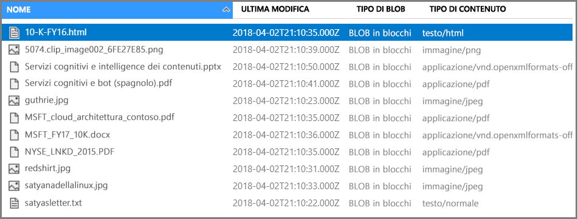

# <a name="c-tutorial-call-cognitive-services-apis-in-an-azure-search-indexing-pipeline"></a>Esercitazione per C#: Chiamare le API Servizi cognitivi in una pipeline di indicizzazione di Ricerca di Azure

In questa esercitazione vengono illustrati i meccanismi di programmazione dell'arricchimento dei dati in Ricerca di Azure usando *competenze cognitive*. Le competenze sono supportate da funzionalità di elaborazione del linguaggio naturale e analisi delle immagini in Servizi cognitivi. Tramite la composizione e la configurazione del set di competenze, è possibile estrarre testo e rappresentazioni di testo da un'immagine o da un file di documento digitalizzato. È anche possibile rilevare lingue, entità, frasi chiave e altro ancora. Il risultato finale è contenuto aggiuntivo elaborato in un indice di Ricerca di Azure, creato da una pipeline di indicizzazione basato intelligenza artificiale.

In questa esercitazione si usa .NET SDK per le attività seguenti:

> [!div class="checklist"]
> * Creare una pipeline di indicizzazione per l'arricchimento dei dati di esempio nel percorso verso un indice
> * Applicare competenze predefinite: riconoscimento ottico dei caratteri, unione testo, rilevamento della lingua, divisione del testo, riconoscimento di entità, estrazione di frasi chiave
> * Informazioni su come concatenare le competenze eseguendo il mapping di input a output in un set di competenze
> * Eseguire le richieste ed esaminare i risultati
> * Reimpostare l'indice e gli indicizzatori per ulteriore sviluppo

L'output è un indice di ricerca full-text in Ricerca di Azure. È possibile migliorare l'indice con altre funzionalità standard, ad esempio [sinonimi](search-synonyms.md), [profili di punteggio](https://docs.microsoft.com/rest/api/searchservice/add-scoring-profiles-to-a-search-index), [analizzatori](search-analyzers.md) e [filtri](search-filters.md).

Questa esercitazione viene eseguita con il servizio gratuito, ma il numero di transazioni gratuite è limitato a 20 documenti al giorno. Se si vuole eseguire l'esercitazione più di una volta al giorno, usare un set di file più piccolo in modo da far rientrare più esecuzioni.

> [!NOTE]
> Se si espande l'ambito aumentando la frequenza di elaborazione, aggiungendo più documenti oppure aggiungendo altri algoritmi di intelligenza artificiale, sarà necessario collegare una risorsa fatturabile di Servizi cognitivi. Gli addebiti si accumulano quando si chiamano le API in Servizi cognitivi e per l'estrazione di immagini come parte della fase di individuazione di documenti in Ricerca di Azure. Non sono previsti addebiti per l'estrazione di testo dai documenti.
>
> L'esecuzione delle competenze predefinite viene addebitata secondo gli attuali [prezzi con pagamento in base al consumo dei Servizi cognitivi](https://azure.microsoft.com/pricing/details/cognitive-services/). I prezzi per l'estrazione delle immagini sono descritti nella [pagina dei prezzi di Ricerca di Azure](https://go.microsoft.com/fwlink/?linkid=2042400).

Se non si ha una sottoscrizione di Azure, creare un [account gratuito](https://azure.microsoft.com/free/?WT.mc_id=A261C142F) prima di iniziare.

## <a name="prerequisites"></a>Prerequisiti

In questa esercitazione vengono usati i servizi, gli strumenti e i dati seguenti. 

+ [Creare un account di archiviazione di Azure](https://docs.microsoft.com/azure/storage/common/storage-quickstart-create-account) per l'archiviazione dei dati di esempio. Assicurarsi che l'account di archiviazione si trovi nella stessa area di Ricerca di Azure.

+ I [dati di esempio](https://1drv.ms/f/s!As7Oy81M_gVPa-LCb5lC_3hbS-4) sono costituiti da un piccolo set di file di tipi diversi. 

+ [Installare Visual Studio](https://visualstudio.microsoft.com/) da usare come IDE.

+ [Creare un servizio Ricerca di Azure](search-create-service-portal.md) o [trovare un servizio esistente](https://ms.portal.azure.com/#blade/HubsExtension/BrowseResourceBlade/resourceType/Microsoft.Search%2FsearchServices) nella sottoscrizione corrente. È possibile usare un servizio gratuito per questa esercitazione.

## <a name="get-a-key-and-url"></a>Ottenere una chiave e un URL

Per interagire con il servizio Ricerca di Azure sono necessari l'URL del servizio e una chiave di accesso. Con entrambi gli elementi viene creato un servizio di ricerca, quindi se si è aggiunto Ricerca di Azure alla sottoscrizione, seguire questi passaggi per ottenere le informazioni necessarie:

1. [Accedere al portale di Azure](https://portal.azure.com/) e ottenere l'URL nella pagina **Panoramica** del servizio di ricerca. Un endpoint di esempio potrebbe essere simile a `https://mydemo.search.windows.net`.

1. In **Impostazioni** > **Chiavi** ottenere una chiave amministratore per diritti completi sul servizio. Sono disponibili due chiavi amministratore interscambiabili, fornite per continuità aziendale nel caso in cui sia necessario eseguire il rollover di una di esse. È possibile usare la chiave primaria o secondaria nelle richieste per l'aggiunta, la modifica e l'eliminazione di oggetti.

   

La presenza di una chiave valida stabilisce una relazione di trust, in base alle singole richieste, tra l'applicazione che invia la richiesta e il servizio che la gestisce.

## <a name="prepare-sample-data"></a>Preparare i dati di esempio

La pipeline di arricchimento effettua il pull da origini dati di Azure. I dati di origine devono provenire da un tipo di origine dati supportato di un [indicizzatore di Ricerca di Azure](search-indexer-overview.md). Archiviazione tabelle di Azure non è supportato per la ricerca cognitiva. Per questo esercizio viene usato l'archivio BLOB per presentare più tipi di contenuto.

1. [Accedere al portale di Azure](https://portal.azure.com), passare all'account di archiviazione di Azure, fare clic su **BLOB** e quindi su **+ Contenitore**.

1. [Creare un contenitore BLOB](https://docs.microsoft.com/azure/storage/blobs/storage-quickstart-blobs-portal) per i dati di esempio. È possibile impostare il livello di accesso pubblico su uno qualsiasi dei relativi valori validi. Questa esercitazione presume che il nome del contenitore sia "basic-demo-data-pr".

1. Dopo aver creato il contenitore, aprirlo e selezionare **Carica** nella barra dei comandi per caricare i [dati di esempio](https://1drv.ms/f/s!As7Oy81M_gVPa-LCb5lC_3hbS-4).

   

1. Dopo aver caricato i file di esempio, ottenere il nome del contenitore e una stringa di connessione per l'archivio BLOB. È possibile eseguire questa operazione passando all'account di archiviazione nel portale di Azure, selezionando **Chiavi di accesso** e quindi copiando il campo **Stringa di connessione**.

   La stringa di connessione deve essere un URL con un aspetto simile al seguente:

      ```http
      DefaultEndpointsProtocol=https;AccountName=cogsrchdemostorage;AccountKey=<your account key>;EndpointSuffix=core.windows.net
      ```

Esistono altri modi per specificare la stringa di connessione, ad esempio una firma di accesso condiviso. Per altre informazioni sulle credenziali dell'origine dati, vedere [Indicizzazione in Archiviazione BLOB di Azure](search-howto-indexing-azure-blob-storage.md#Credentials).

## <a name="set-up-your-environment"></a>Configurazione dell'ambiente

Iniziare aprendo Visual Studio e creando un nuovo progetto di app console che può essere eseguito in .NET Core.

### <a name="install-nuget-packages"></a>Installare i pacchetti NuGet

[Azure Search .NET SDK](https://aka.ms/search-sdk) è costituito da alcune librerie client che consentono di gestire indici, origini dati, indicizzatori e set di competenze, nonché di caricare e gestire documenti ed eseguire query, senza doversi occupare dei dettagli di HTTP e JSON. Tutte queste librerie client vengono distribuite come pacchetti NuGet.

Per questo progetto è necessario installare la versione 9 del pacchetto NuGet `Microsoft.Azure.Search` e il pacchetto `Microsoft.Extensions.Configuration.Json` più recente.

Installare il pacchetto NuGet `Microsoft.Azure.Search` usando la console di Gestione pacchetti in Visual Studio. Per aprire la console di Gestione pacchetti, fare clic su **Strumenti** > **Gestione pacchetti NuGet** > **Console di Gestione pacchetti**. Per eseguire il comando, accedere alla [pagina del pacchetto NuGet Microsoft.Azure.Search](https://www.nuget.org/packages/Microsoft.Azure.Search), selezionare la versione 9 e copiare il comando di Gestione pacchetti. Nella console di Gestione pacchetti, eseguire questo comando.

Per installare il pacchetto NuGet `Microsoft.Extensions.Configuration.Json` in Visual Studio, selezionare **Strumenti** > **Gestione pacchetti NuGet** > **Gestisci pacchetti NuGet per la soluzione**. Seleziona Sfoglia e cerca il pacchetto NuGet `Microsoft.Extensions.Configuration.Json`. Dopo averlo trovato, selezionare il pacchetto, selezionare il progetto, verificare che la versione sia la versione stabile più recente, quindi selezionare Installa.

## <a name="add-azure-search-service-information"></a>Aggiungere informazioni sul servizio Ricerca di Azure

Per connettersi al servizio Ricerca di Azure è necessario aggiungere le informazioni del servizio di ricerca al progetto. Fare clic con il pulsante destro del mouse sul progetto in Esplora soluzioni e scegliere **Aggiungi** > **Nuovo elemento**. Assegnare un nome al file `appsettings.json` e selezionare **Aggiungi**. 

Questo file dovrà essere incluso nella directory di output. A tale scopo, fare clic con il pulsante destro su `appsettings.json` e scegliere **Proprietà**. Modificare il valore di **Copia nella directory di output** in **Copy of newer** (Copia del più recente).

Copiare il codice JSON seguente nel nuovo file JSON.

```json
{
  "SearchServiceName": "Put your search service name here",
  "SearchServiceAdminApiKey": "Put your primary or secondary API key here",
  "SearchServiceQueryApiKey": "Put your query API key here",
  "AzureBlobConnectionString": "Put your Azure Blob connection string here",
}
```

Aggiungere le informazioni dell'account per il servizio di ricerca e l'archivio BLOB.

È possibile ottenere le informazioni del servizio di ricerca dalla pagina dell'account di ricerca nel portale di Azure. Il nome dell'account si troverà sulla pagina principale e le chiavi possono essere trovate selezionando **Chiavi**.

È possibile ottenere la stringa di connessione BLOB passando all'account di archiviazione nel portale di Azure, selezionando **Chiavi di accesso** e quindi copiando il campo **Stringa di connessione**.

## <a name="add-namespaces"></a>Aggiungere spazi dei nomi

Questa esercitazione usa molti tipi diversi di vari spazi dei nomi. Per usare questi tipi, aggiungere quanto segue a `Program.cs`.

```csharp
using System;
using System.Collections.Generic;
using Microsoft.Azure.Search;
using Microsoft.Azure.Search.Models;
using Microsoft.Extensions.Configuration;
```

## <a name="create-a-client"></a>Creare un client

Creare un'istanza della classe `SearchServiceClient`.

```csharp
IConfigurationBuilder builder = new ConfigurationBuilder().AddJsonFile("appsettings.json");
IConfigurationRoot configuration = builder.Build();
SearchServiceClient serviceClient = CreateSearchServiceClient(configuration);
```

`CreateSearchServiceClient` crea un nuovo oggetto `SearchServiceClient` usando i valori archiviati nel file config dell'applicazione (appsettings.json).

```csharp
private static SearchServiceClient CreateSearchServiceClient(IConfigurationRoot configuration)
{
   string searchServiceName = configuration["SearchServiceName"];
   string adminApiKey = configuration["SearchServiceAdminApiKey"];

   SearchServiceClient serviceClient = new SearchServiceClient(searchServiceName, new SearchCredentials(adminApiKey));
   return serviceClient;
}
```

> [!NOTE]
> La classe `SearchServiceClient` gestisce le connessioni al servizio di ricerca. Per evitare l'apertura di un numero eccessivo di connessioni, se possibile è consigliabile provare a condividere una singola istanza di `SearchServiceClient` nell'applicazione. I metodi per abilitare tale condivisione sono thread-safe.
> 
> 

## <a name="create-a-data-source"></a>Creare un'origine dati

Creare una nuova istanza di `DataSource` chiamando `DataSource.AzureBlobStorage`. `DataSource.AzureBlobStorage` richiede di specificare il nome dell'origine dati, la stringa di connessione e il nome del contenitore BLOB.

Anche se non viene usato in questa esercitazione, viene anche definito un criterio di eliminazione temporanea usato per identificare i BLOB eliminati in base al valore di una colonna di eliminazione temporanea. Il criterio seguente considera un BLOB eliminato se ha una proprietà di metadati `IsDeleted` con il valore `true`.

```csharp
DataSource dataSource = DataSource.AzureBlobStorage(
    name: "demodata",
    storageConnectionString: configuration["AzureBlobConnectionString"],
    containerName: "basic-demo-data-pr",
    deletionDetectionPolicy: new SoftDeleteColumnDeletionDetectionPolicy(
        softDeleteColumnName: "IsDeleted",
        softDeleteMarkerValue: "true"),
    description: "Demo files to demonstrate cognitive search capabilities.");
```

Ora che è stato inizializzato l'oggetto `DataSource`, creare l'origine dati. `SearchServiceClient` include una proprietà `DataSources`. Questa proprietà fornisce tutti i metodi necessari per creare, elencare, aggiornare o eliminare le origini dati di Ricerca di Azure.

Per una richiesta corretta, il metodo restituirà l'origine dati che è stata creata. Se si verifica un problema con la richiesta, ad esempio un parametro non valido, il metodo genererà un'eccezione.

```csharp
try
{
    serviceClient.DataSources.CreateOrUpdate(dataSource);
}
catch (Exception e)
{
    // Handle the exception
}
```

Trattandosi della prima richiesta, controllare nel portale di Azure per verificare che l'origine dati sia stata creata in Ricerca di Azure. Nella pagina del dashboard del servizio di ricerca, verificare che nel riquadro Origini dati sia disponibile un nuovo elemento. Potrebbe essere necessario attendere alcuni minuti per l'aggiornamento della pagina del portale.

  

## <a name="create-a-skillset"></a>Creare un set di competenze

In questa sezione viene definito un set di passaggi di arricchimento da applicare ai dati. Ogni passaggio di arricchimento è noto come *competenza* e il set di passaggi di arricchimento è un *set di competenze*. Questa esercitazione usa [competenze cognitive predefinite](cognitive-search-predefined-skills.md) per il set di competenze:

+ [Riconoscimento ottico dei caratteri](cognitive-search-skill-ocr.md) per riconoscere testo stampato e scritto a mano nei file di immagine.

+ [Unione testo](cognitive-search-skill-textmerger.md) per consolidare il testo di una raccolta di campi in un unico campo.

+ [Rilevamento della lingua](cognitive-search-skill-language-detection.md) per identificare la lingua del contenuto.

+ [Divisione del testo](cognitive-search-skill-textsplit.md) per suddividere il contenuto di grandi dimensioni in blocchi più piccoli prima di chiamare la competenza di estrazione di frasi chiave e la competenza di riconoscimento di entità. L'estrazione di frasi chiave e il riconoscimento di entità accettano input composti al massimo da 50.000 caratteri. Alcuni dei file di esempio devono essere suddivisi per rispettare questo limite.

+ [Riconoscimento di entità](cognitive-search-skill-entity-recognition.md) per estrarre i nomi di organizzazioni dal contenuto nel contenitore BLOB.

+ [Estrazione di frasi chiave](cognitive-search-skill-keyphrases.md) per estrarre le frasi chiave principali.

Durante l'elaborazione iniziale, Ricerca di Azure analizza ogni documento per leggere il contenuto da formati di file diversi. Il testo trovato con origine nel file di origine viene inserito in un campo ```content``` generato, uno per ogni documento. Impostare quindi l'input come ```"/document/content"``` per usare questo testo. 

Gli output possono essere mappati a un indice, usati come input per una competenza a valle, o entrambi, come nel caso del codice di lingua. Nell'indice, un codice di lingua è utile per le operazioni di filtro. Come input, il codice di lingua viene usato dalle competenze di analisi del testo per la selezione delle regole linguistiche per la separazione delle parole.

Per altre informazioni sui concetti di base dei set di competenze, vedere [How to create a skillset](cognitive-search-defining-skillset.md) (Come creare un set di competenze).

### <a name="ocr-skill"></a>Competenza OCR

La competenza **OCR** estrae il testo dalle immagini. Questa competenza presuppone che esista un campo normalized_images. Per generare questo campo, più avanti nell'esercitazione si imposterà la configurazione ```"imageAction"``` nella definizione dell'indicizzatore su ```"generateNormalizedImages"```.

```csharp
List<InputFieldMappingEntry> inputMappings = new List<InputFieldMappingEntry>();
inputMappings.Add(new InputFieldMappingEntry(
    name: "image",
    source: "/document/normalized_images/*"));

List<OutputFieldMappingEntry> outputMappings = new List<OutputFieldMappingEntry>();
outputMappings.Add(new OutputFieldMappingEntry(
    name: "text",
    targetName: "text"));

OcrSkill ocrSkill = new OcrSkill(
    description: "Extract text (plain and structured) from image",
    context: "/document/normalized_images/*",
    inputs: inputMappings,
    outputs: outputMappings,
    defaultLanguageCode: OcrSkillLanguage.En,
    shouldDetectOrientation: true);
```

### <a name="merge-skill"></a>Competenza di unione

In questa sezione si creerà una competenza di **unione** che unisce il campo del contenuto del documento con il testo prodotto dalla competenza OCR.

```csharp
List<InputFieldMappingEntry> inputMappings = new List<InputFieldMappingEntry>();
inputMappings.Add(new InputFieldMappingEntry(
    name: "text",
    source: "/document/content"));
inputMappings.Add(new InputFieldMappingEntry(
    name: "itemsToInsert",
    source: "/document/normalized_images/*/text"));
inputMappings.Add(new InputFieldMappingEntry(
    name: "offsets",
    source: "/document/normalized_images/*/contentOffset"));

List<OutputFieldMappingEntry> outputMappings = new List<OutputFieldMappingEntry>();
outputMappings.Add(new OutputFieldMappingEntry(
    name: "mergedText",
    targetName: "merged_text"));

MergeSkill mergeSkill = new MergeSkill(
    description: "Create merged_text which includes all the textual representation of each image inserted at the right location in the content field.",
    context: "/document",
    inputs: inputMappings,
    outputs: outputMappings,
    insertPreTag: " ",
    insertPostTag: " ");
```

### <a name="language-detection-skill"></a>Competenza di rilevamento lingua

La competenza di **rilevamento lingua** rileva la lingua del testo di input e restituisce un codice lingua singolo per ogni documento inviato nella richiesta. Si userà l'output della competenza di **rilevamento lingua** come parte dell'input per la competenza di **divisione del testo**.

```csharp
List<InputFieldMappingEntry> inputMappings = new List<InputFieldMappingEntry>();
inputMappings.Add(new InputFieldMappingEntry(
    name: "text",
    source: "/document/merged_text"));

List<OutputFieldMappingEntry> outputMappings = new List<OutputFieldMappingEntry>();
outputMappings.Add(new OutputFieldMappingEntry(
    name: "languageCode",
    targetName: "languageCode"));

LanguageDetectionSkill languageDetectionSkill = new LanguageDetectionSkill(
    description: "Detect the language used in the document",
    context: "/document",
    inputs: inputMappings,
    outputs: outputMappings);
```

### <a name="text-split-skill"></a>Competenza di divisione del testo

La competenza di **divisione** divide il testo per pagine e limita la lunghezza della pagina a 4.000 caratteri, misurata da `String.Length`. L'algoritmo proverà a suddividere il testo in blocchi di dimensioni massime pari a `maximumPageLength`. In questo caso l'algoritmo cercherà di interrompere una frase al suo limite, quindi la dimensione del blocco potrebbe essere leggermente inferiore a `maximumPageLength`.

```csharp
List<InputFieldMappingEntry> inputMappings = new List<InputFieldMappingEntry>();
inputMappings.Add(new InputFieldMappingEntry(
    name: "text",
    source: "/document/merged_text"));
inputMappings.Add(new InputFieldMappingEntry(
    name: "languageCode",
    source: "/document/languageCode"));

List<OutputFieldMappingEntry> outputMappings = new List<OutputFieldMappingEntry>();
outputMappings.Add(new OutputFieldMappingEntry(
    name: "textItems",
    targetName: "pages"));

SplitSkill splitSkill = new SplitSkill(
    description: "Split content into pages",
    context: "/document",
    inputs: inputMappings,
    outputs: outputMappings,
    textSplitMode: TextSplitMode.Pages,
    maximumPageLength: 4000);
```

### <a name="entity-recognition-skill"></a>Competenza di riconoscimento entità

Questa istanza `EntityRecognitionSkill` è impostata per riconoscere il tipo di categoria `organization`. La competenza di **riconoscimento entità** può anche riconoscere i tipi di categoria `person` e `location`.

Si noti che il campo "context" è impostato su ```"/document/pages/*"``` con un asterisco. Questo significa che il passaggio di arricchimento viene chiamato per ogni pagina presente in ```"/document/pages"```.

```csharp
List<InputFieldMappingEntry> inputMappings = new List<InputFieldMappingEntry>();
inputMappings.Add(new InputFieldMappingEntry(
    name: "text",
    source: "/document/pages/*"));
    
List<OutputFieldMappingEntry> outputMappings = new List<OutputFieldMappingEntry>();
outputMappings.Add(new OutputFieldMappingEntry(
    name: "organizations",
    targetName: "organizations"));

List<EntityCategory> entityCategory = new List<EntityCategory>();
entityCategory.Add(EntityCategory.Organization);
    
EntityRecognitionSkill entityRecognitionSkill = new EntityRecognitionSkill(
    description: "Recognize organizations",
    context: "/document/pages/*",
    inputs: inputMappings,
    outputs: outputMappings,
    categories: entityCategory,
    defaultLanguageCode: EntityRecognitionSkillLanguage.En);
```

### <a name="key-phrase-extraction-skill"></a>Competenza di estrazione di frasi chiave

Come l'istanza `EntityRecognitionSkill` appena creata, viene chiamata la competenza di **estrazione di frase chiave** per ogni pagina del documento.

```csharp
List<InputFieldMappingEntry> inputMappings = new List<InputFieldMappingEntry>();
inputMappings.Add(new InputFieldMappingEntry(
    name: "text",
    source: "/document/pages/*"));
inputMappings.Add(new InputFieldMappingEntry(
    name: "languageCode",
    source: "/document/languageCode"));

List<OutputFieldMappingEntry> outputMappings = new List<OutputFieldMappingEntry>();
outputMappings.Add(new OutputFieldMappingEntry(
    name: "keyPhrases",
    targetName: "keyPhrases"));

KeyPhraseExtractionSkill keyPhraseExtractionSkill = new KeyPhraseExtractionSkill(
    description: "Extract the key phrases",
    context: "/document/pages/*",
    inputs: inputMappings,
    outputs: outputMappings);
```

### <a name="build-and-create-the-skillset"></a>Compilare e creare il set di competenze

Compilare lo `Skillset`​ ​usando le competenze create.

```csharp
List<Skill> skills = new List<Skill>();
skills.Add(ocrSkill);
skills.Add(mergeSkill);
skills.Add(languageDetectionSkill);
skills.Add(splitSkill);
skills.Add(entityRecognitionSkill);
skills.Add(keyPhraseExtractionSkill);

Skillset skillset = new Skillset(
    name: "demoskillset",
    description: "Demo skillset",
    skills: skills);
```

Creare il set di competenze nel servizio di ricerca.

```csharp
try
{
    serviceClient.Skillsets.CreateOrUpdate(skillset);
}
catch (Exception e)
{
    // Handle exception
}
```

## <a name="create-an-index"></a>Creare un indice

In questa sezione viene definito lo schema dell'indice specificando i campi da includere nell'indice di ricerca e gli attributi di ricerca per ogni campo. I campi hanno un tipo e possono accettare attributi che determinano il modo in cui viene usato il campo (searchable, sortable e così via). Non è necessario che i nomi dei campi in un indice corrispondano esattamente ai nomi dei campi nell'origine. In un passaggio successivo verranno aggiunti i mapping dei campi in un indicizzatore per collegare i campi di origine e destinazione. Per questo passaggio, definire l'indice usando le convenzioni di denominazione dei campi pertinenti per l'applicazione di ricerca in questione.

Questo esercizio usa i campi e i tipi di campi seguenti:

| field-names: | `id`       | content   | languageCode | keyPhrases         | organizations     |
|--------------|----------|-------|----------|--------------------|-------------------|
| field-types: | Edm.String|Edm.String| Edm.String| List<Edm.String>  | List<Edm.String>  |


### <a name="create-demoindex-class"></a>Creare una classe DemoIndex

I campi per questo indice vengono definiti usando una classe modello. Ogni proprietà della classe modello contiene attributi che determinano i comportamenti correlati alla ricerca del campo di indice corrispondente. 

La classe modello verrà aggiunta a un nuovo file C#. Fare clic con il pulsante destro del mouse sul progetto e scegliere **Aggiungi** > **Nuovo elemento**, selezionare "Classe", assegnare al file il nome `DemoIndex.cs` e quindi selezionare **Aggiungi**.

Indicare che si vogliono usare i tipi degli spazi dei nomi `Microsoft.Azure.Search` e `Microsoft.Azure.Search.Models`.

```csharp
using Microsoft.Azure.Search;
using Microsoft.Azure.Search.Models;
```

Aggiungere la definizione di classe modello seguente a `DemoIndex.cs` e includerla nello stesso spazio dei nomi in cui verrà creato l'indice.

```csharp
// The SerializePropertyNamesAsCamelCase attribute is defined in the Azure Search .NET SDK.
// It ensures that Pascal-case property names in the model class are mapped to camel-case
// field names in the index.
[SerializePropertyNamesAsCamelCase]
public class DemoIndex
{
    [System.ComponentModel.DataAnnotations.Key]
    [IsSearchable, IsSortable]
    public string Id { get; set; }

    [IsSearchable]
    public string Content { get; set; }

    [IsSearchable]
    public string LanguageCode { get; set; }

    [IsSearchable]
    public string[] KeyPhrases { get; set; }

    [IsSearchable]
    public string[] Organizations { get; set; }
}
```

Dopo aver definito una classe modello, di nuovo in `Program.cs` è possibile creare una definizione di indice in modo molto semplice. Il nome di questo indice sarà "demoindex".

```csharp
var index = new Index()
{
    Name = "demoindex",
    Fields = FieldBuilder.BuildForType<DemoIndex>()
};
```

Durante i test è possibile che si tenti di creare l'indice più di una volta. Per questo motivo verificare se l'indice che si sta per creare esiste già prima di tentare di crearlo.

```csharp
try
{
    bool exists = serviceClient.Indexes.Exists(index.Name);

    if (exists)
    {
        serviceClient.Indexes.Delete(index.Name);
    }

    serviceClient.Indexes.Create(index);
}
catch (Exception e)
{
    // Handle exception
}
```

Per altre informazioni sulla definizione di un indice, vedere [Create Index (Azure Search REST API)](https://docs.microsoft.com/rest/api/searchservice/create-index) (Creare un indice - API REST per Ricerca di Azure).

## <a name="create-an-indexer-map-fields-and-execute-transformations"></a>Creare un indicizzatore, mappare i campi ed eseguire le trasformazioni

Finora sono stati creati un'origine dati, un set di competenze e un indice. Questi tre componenti diventano parte di un [indicizzatore](search-indexer-overview.md) che riunisce tutti i dati in un'unica operazione in più fasi. Per unire questi elementi in un indicizzatore, è necessario definire mapping dei campi.

+ Gli oggetti fieldMappings vengono elaborati prima del set di competenze, eseguendo il mapping dei campi di origine dall'origine dati ai campi di destinazione in un indice. Se i nomi e i tipi di campo sono uguali alle due estremità, non è necessario alcun mapping.

+ Gli oggetti outputFieldMappings vengono elaborati dopo il set di competenze facendo riferimento agli oggetti sourceFieldNames che non esistono fino a quando non vengono creati dall'individuazione o dall'arricchimento dei documenti. L'oggetto targetFieldName è un campo in un indice.

Oltre ad associare gli input agli output, è anche possibile usare i mapping dei campi per rendere flat le strutture dei dati. Per altre informazioni, vedere [Come eseguire il mapping dei campi migliorati a un indice ricercabile](cognitive-search-output-field-mapping.md).

```csharp
IDictionary<string, object> config = new Dictionary<string, object>();
config.Add(
    key: "dataToExtract",
    value: "contentAndMetadata");
config.Add(
    key: "imageAction",
    value: "generateNormalizedImages");

List<FieldMapping> fieldMappings = new List<FieldMapping>();
fieldMappings.Add(new FieldMapping(
    sourceFieldName: "metadata_storage_path",
    targetFieldName: "id",
    mappingFunction: new FieldMappingFunction(
        name: "base64Encode")));
fieldMappings.Add(new FieldMapping(
    sourceFieldName: "content",
    targetFieldName: "content"));

List<FieldMapping> outputMappings = new List<FieldMapping>();
outputMappings.Add(new FieldMapping(
    sourceFieldName: "/document/pages/*/organizations/*",
    targetFieldName: "organizations"));
outputMappings.Add(new FieldMapping(
    sourceFieldName: "/document/pages/*/keyPhrases/*",
    targetFieldName: "keyPhrases"));
outputMappings.Add(new FieldMapping(
    sourceFieldName: "/document/languageCode",
    targetFieldName: "languageCode"));

Indexer indexer = new Indexer(
    name: "demoindexer",
    dataSourceName: dataSource.Name,
    targetIndexName: index.Name,
    description: "Demo Indexer",
    skillsetName: skillSet.Name,
    parameters: new IndexingParameters(
        maxFailedItems: -1,
        maxFailedItemsPerBatch: -1,
        configuration: config),
    fieldMappings: fieldMappings,
    outputFieldMappings: outputMappings);

try
{
    bool exists = serviceClient.Indexers.Exists(indexer.Name);

    if (exists)
    {
        serviceClient.Indexers.Delete(indexer.Name);
    }

    serviceClient.Indexers.Create(indexer);
}
catch (Exception e)
{
    // Handle exception
}
```

La creazione dell'indicizzatore richiederà del tempo. Anche se il set di dati è piccolo, le competenze analitiche prevedono un utilizzo elevato delle risorse di calcolo. Alcune competenze, ad esempio l'analisi delle immagini, hanno un'esecuzione prolungata.

> [!TIP]
> La creazione di un indicizzatore richiama la pipeline. Eventuali problemi a raggiungere i dati, per il mapping di input e output o nell'ordine delle operazioni vengono visualizzati in questa fase.

### <a name="explore-creating-the-indexer"></a>Esaminare la creazione dell'indicizzatore

Il codice imposta ```"maxFailedItems"``` su -1, che indica al motore di indicizzazione di ignorare gli errori durante l'importazione dei dati. Ciò è utile dato che l'origine dati di esempio include pochi documenti. Per un'origine dati più grande sarebbe necessario impostare un valore maggiore di 0.

Si noti inoltre che ```"dataToExtract"``` è impostato su ```"contentAndMetadata"```. Questa istruzione indica all'indicizzatore di estrarre automaticamente il contenuto dai vari formati di file, oltre ai metadati correlati a ogni file.

Quando viene estratto il contenuto, è possibile impostare `imageAction` per estrarre il testo dalle immagini trovate nell'origine dati. L'impostazione di ```"imageAction"``` su ```"generateNormalizedImages"```, unita alla competenza OCR e alla competenza di unione del testo, indica all'indicizzatore di estrarre il testo dalle immagini (ad esempio, la parola "stop" da un segnale stradale di stop) e incorporarlo come parte del campo del contenuto. Questo comportamento si applica sia alle immagini incorporate nei documenti, ad esempio un'immagine all'interno di un PDF, che alle immagini trovate nell'origine dati, ad esempio un file JPG.

## <a name="check-indexer-status"></a>Controllare lo stato dell'indicizzatore

Dopo averlo definito, l'indicizzatore viene eseguito automaticamente quando si invia la richiesta. A seconda delle competenze cognitive definite, l'indicizzazione può richiedere più tempo del previsto. Per scoprire se l'indicizzatore è ancora in esecuzione, usare il metodo `GetStatus`.

```csharp
try
{
    IndexerExecutionInfo demoIndexerExecutionInfo = serviceClient.Indexers.GetStatus(indexer.Name);

    switch (demoIndexerExecutionInfo.Status)
    {
        case IndexerStatus.Error:
            Console.WriteLine("Indexer has error status");
            break;
        case IndexerStatus.Running:
            Console.WriteLine("Indexer is running");
            break;
        case IndexerStatus.Unknown:
            Console.WriteLine("Indexer status is unknown");
            break;
        default:
            Console.WriteLine("No indexer information");
            break;
    }
}
catch (Exception e)
{
    // Handle exception
}
```

`IndexerExecutionInfo` rappresenta lo stato corrente e la cronologia di esecuzione di un indicizzatore.

Gli avvisi sono comuni con alcune combinazioni di file di origine e competenze e non sempre indicano un problema. In questa esercitazione, gli avvisi sono innocui (ad esempio, nessun input di testo dai file JPEG).
 
## <a name="query-your-index"></a>Eseguire query sull'indice

Al termine dell'indicizzazione, è possibile eseguire query che restituiscono il contenuto dei singoli campi. Per impostazione predefinita, Ricerca di Azure restituisce i primi 50 risultati. I dati di esempio sono piccoli, quindi l'impostazione predefinita è appropriata. Tuttavia, quando si opera su set di dati più grandi, potrebbe essere necessario includere parametri nella stringa di query per restituire più risultati. Per istruzioni, vedere [Come impaginare i risultati della ricerca in Ricerca di Azure](search-pagination-page-layout.md).

Come passaggio di verifica, eseguire una query sull'indice per tutti i campi.

```csharp
DocumentSearchResult<DemoIndex> results;

ISearchIndexClient indexClientForQueries = CreateSearchIndexClient(configuration);

try
{
    results = indexClientForQueries.Documents.Search<DemoIndex>("*");
}
catch (Exception e)
{
    // Handle exception
}
```

`CreateSearchIndexClient` crea un nuovo oggetto `SearchIndexClient` usando i valori archiviati nel file config dell'applicazione (appsettings.json). Si noti che viene usata la chiave API di query del servizio di ricerca e non la chiave di amministrazione.

```csharp
private static SearchIndexClient CreateSearchIndexClient(IConfigurationRoot configuration)
{
   string searchServiceName = configuration["SearchServiceName"];
   string queryApiKey = configuration["SearchServiceQueryApiKey"];

   SearchIndexClient indexClient = new SearchIndexClient(searchServiceName, "demoindex", new SearchCredentials(queryApiKey));
   return indexClient;
}
```

L'output è lo schema dell'indice, con nome, tipo e attributi di ogni campo.

Inviare una seconda query per `"*"` per restituire tutto il contenuto di un singolo campo, ad esempio `organizations`.

```csharp
SearchParameters parameters =
    new SearchParameters
    {
        Select = new[] { "organizations" }
    };

try
{
    results = indexClientForQueries.Documents.Search<DemoIndex>("*", parameters);
}
catch (Exception e)
{
    // Handle exception
}
```

Ripetere l'operazione per altri campi: content, languageCode, keyPhrases e organizations in questo esercizio. È possibile restituire più campi tramite `$select` usando un elenco delimitato da virgole.

<a name="reset"></a>

## <a name="reset-and-rerun"></a>Reimpostare ed eseguire di nuovo

Nelle prime fasi sperimentali dello sviluppo, l'approccio più pratico per le iterazioni di progettazione consiste nell'eliminare gli oggetti da Ricerca di Azure e consentire al codice di ricompilarli. I nomi di risorsa sono univoci. L'eliminazione di un oggetto consente di ricrearlo usando lo stesso nome.

In questa esercitazione sono stati cercati indicizzatori e indici esistenti al fine di eliminarli per poter rieseguire il codice.

È anche possibile usare il portale per eliminare indici, indicizzatori e set di competenze.

Con l'evoluzione del codice può risultare necessario perfezionare una strategia di ricompilazione. Per altre informazioni, vedere [How to rebuild an index](search-howto-reindex.md) (Come ricompilare un indice).

## <a name="takeaways"></a>Risultati

Questa esercitazione ha illustrato i passaggi di base per la creazione di una pipeline di indicizzazione arricchita tramite la creazione delle parti componenti: un'origine dati, un set di competenze, un indice e un indicizzatore.

Sono state presentate le [competenze predefinite](cognitive-search-predefined-skills.md), oltre alla definizione del set di competenze e ai meccanismi di concatenamento delle competenze tramite input e output. Si è inoltre appreso che `outputFieldMappings` nella definizione dell'indicizzatore è obbligatorio per indirizzare i valori arricchiti dalla pipeline in un indice di ricerca in un servizio Ricerca di Azure.

Infine, è stato descritto come testare i risultati e reimpostare il sistema per ulteriori iterazioni. Si è appreso che l'esecuzione di query sull'indice consente di restituire l'output creato dalla pipeline di indicizzazione arricchita. È stato inoltre descritto come controllare lo stato dell'indicizzatore e quali oggetti eliminare prima di eseguire di nuovo una pipeline.

## <a name="clean-up-resources"></a>Pulire le risorse

Il modo più veloce per pulire le risorse dopo un'esercitazione consiste nell'eliminare il gruppo di risorse contenente il servizio Ricerca di Azure e il servizio BLOB di Azure. Supponendo che entrambi i servizi siano stati inseriti nello stesso gruppo, eliminare il gruppo di risorse a questo punto per eliminare definitivamente tutti gli elementi in esso contenuti, inclusi i servizi e qualsiasi contenuto archiviato creato per questa esercitazione. Nel portale, il nome del gruppo di risorse è indicato nella pagina Panoramica di ciascun servizio.

## <a name="next-steps"></a>Passaggi successivi

Personalizzare o estendere la pipeline con competenze personalizzate. Creare una competenza personalizzata e aggiungerla a un set di competenze consente di caricare procedure di analisi del testo o delle immagini personalizzate.

> [!div class="nextstepaction"]
> [Esempio: Creare una competenza personalizzata per la ricerca cognitiva](cognitive-search-create-custom-skill-example.md)
