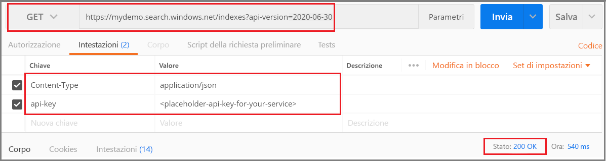

# <a name="tutorial-add-structure-to-unstructured-content-with-cognitive-search"></a>Esercitazione: Definire la struttura di "contenuto non strutturato" con la ricerca cognitiva

Se si dispone di contenuto di testo o immagine non strutturato, è possibile sfruttare la funzionalità di [ricerca cognitiva](cognitive-search-concept-intro.md) di Ricerca di Azure per estrarre informazioni e creare nuovi contenuti utili per gli scenari di ricerca full-text o di knowledge mining. Anche se la ricerca cognitiva consente di elaborare file di immagine (JPG, PNG, TIFF), questa esercitazione è incentrata sul contenuto basato su parole, sull'applicazione del rilevamento della lingua e dell'analisi del testo per creare nuovi campi e informazioni che è possibile sfruttare in query, facet e filtri.

> [!div class="checklist"]
> * Iniziare con documenti interi (testo non strutturato) come PDF, MD, DOCX e PPTX in Archiviazione BLOB di Azure.
> * Definire una pipeline che estrae il testo, rileva la lingua, riconosce le entità e rileva le frasi chiave.
> * Definire un indice per archiviare l'output (contenuto non elaborato, nonché coppie nome-valore generate dalla pipeline).
> * Eseguire la pipeline per avviare le trasformazioni e l'analisi, nonché per creare e caricare l'indice.
> * Esplorare i risultati tramite un ricerca full-text e una sintassi di query avanzata.

Per completare questa procedura dettagliata, sono necessari diversi servizi, oltre all'[app desktop Postman](https://www.getpostman.com/) o a un altro strumento di test Web per effettuare le chiamate all'API REST. 

Se non si ha una sottoscrizione di Azure, aprire un [account gratuito](https://azure.microsoft.com/free/?WT.mc_id=A261C142F) prima di iniziare.

## <a name="download-files"></a>Download dei file

1. Aprire questa [cartella OneDrive](https://1drv.ms/f/s!As7Oy81M_gVPa-LCb5lC_3hbS-4) e nell'angolo in alto a sinistra fare clic su **Scarica** per copiare i file nel computer. 

1. Fare clic con il pulsante destro del mouse sul file ZIP e selezionare **Estrai tutto**. Sono presenti 14 file di vari tipi. Per questo esercizio ne verranno usati 7.

## <a name="1---create-services"></a>1 - Creare i servizi

Questa procedura dettagliata usa Ricerca di Azure per l'indicizzazione e le query, Servizi cognitivi per l'arricchimento con intelligenza artificiale e Archiviazione BLOB di Azure per fornire i dati. Se possibile, creare tutti e tre i servizi nella stessa area e nello stesso gruppo di risorse per motivi di prossimità e gestibilità. In pratica, l'account di archiviazione di Azure può trovarsi in qualsiasi area.

### <a name="start-with-azure-storage"></a>Iniziare con Archiviazione di Azure

1. [Accedere al portale di Azure](https://portal.azure.com/) e fare clic su **+ Crea una risorsa**.

1. Cercare *account di archiviazione* e selezionare l'offerta Account di archiviazione di Microsoft.

   

1. Nella scheda Informazioni di base gli elementi seguenti sono obbligatori. Accettare le impostazioni predefinite per tutti gli altri elementi.

   + **Gruppo di risorse**. Selezionarne uno esistente o crearne uno nuovo, ma usare lo stesso gruppo per tutti i servizi in modo che sia possibile gestirli collettivamente.

   + **Nome account di archiviazione**. Se si ritiene che potrebbero esistere più risorse dello stesso tipo, usare il nome per distinguerle in base al tipo e all'area, ad esempio *blobstoragewestus*. 

   + **Località**. Se possibile, scegliere la stessa località usata per Ricerca di Azure e Servizi cognitivi. La scelta di un'unica località consente di azzerare i costi correlati alla larghezza di banda.

   + **Tipologia account**. Scegliere l'impostazione predefinita *Archiviazione (utilizzo generico v2)* .

1. Fare clic su **Rivedi e crea** per creare il servizio.

1. Al termine dell'operazione, fare clic su **Vai alla risorsa** per aprire la pagina Panoramica.

1. Fare clic sul servizio **BLOB**.

1. Fare clic su **+ Contenitore** per creare un contenitore e assegnargli il nome *cog-search-demo*.

1. Selezionare *cog-search-demo* e quindi fare clic su **Carica** per aprire la cartella in cui sono stati salvati i file di download. Selezionare tutti i file non di immagine. I file selezionati dovrebbero essere 7. Fare clic su **OK** per caricarli.

   

1. Prima di uscire da Archiviazione di Azure, ottenere una stringa di connessione in modo che sia possibile definire una connessione in Ricerca di Azure. 

   1. Tornare alla pagina Panoramica dell'account di archiviazione (come esempio è stato usato *blobstragewestus*). 
   
   1. Nel riquadro di spostamento sinistro selezionare **Chiavi di accesso** e copiare una delle stringhe di connessione. 

   La stringa di connessione è un URL simile all'esempio seguente:

      ```http
      DefaultEndpointsProtocol=https;AccountName=cogsrchdemostorage;AccountKey=<your account key>;EndpointSuffix=core.windows.net
      ```

1. Salvare la stringa di connessione nel Blocco note. Sarà necessaria più avanti durante la configurazione della connessione all'origine dati.

### <a name="cognitive-services"></a>Servizi cognitivi

L'arricchimento con intelligenza artificiale nella ricerca cognitiva è supportato da Servizi cognitivi, tra Analisi del testo e Visione artificiale per l'elaborazione del linguaggio naturale e delle immagini. Se l'obiettivo è quello di completare un prototipo o un progetto effettivo, a questo punto è necessario effettuare il provisioning di Servizi cognitivi (nella stessa area di Ricerca di Azure) in modo da poterlo collegare alle operazioni di indicizzazione.

Per questo esercizio è però possibile ignorare il provisioning delle risorse perché Ricerca di Azure riesce a connettersi a Servizi cognitivi in background e offre 20 transazioni gratuite per ogni esecuzione dell'indicizzatore. Dal momento che in questa esercitazione vengono usate 7 transazioni, l'allocazione gratuita è sufficiente. Per progetti di dimensioni maggiori, pianificare il provisioning di Servizi cognitivi al livello S0 con pagamento in base al consumo. Per altre informazioni, vedere [Collegare Servizi cognitivi](cognitive-search-attach-cognitive-services.md).

### <a name="azure-search"></a>Ricerca di Azure

Il terzo componente è Ricerca di Azure, che è [possibile creare nel portale](search-create-service-portal.md). Per completare questa procedura dettagliata, è possibile usare il livello gratuito. 

Come per Archiviazione BLOB di Azure dedicare qualche istante alla raccolta della chiave di accesso. Più avanti, quando si inizierà a strutturare le richieste, sarà necessario specificare l'endpoint e la chiave API di amministrazione usati per autenticare ogni richiesta.

### <a name="get-an-admin-api-key-and-url-for-azure-search"></a>Ottenere un URL e una chiave API di amministrazione per Ricerca di Azure

1. [Accedere al portale di Azure](https://portal.azure.com/) e ottenere il nome del servizio di ricerca nella relativa pagina **Panoramica**. È possibile verificare il nome del servizio esaminando l'URL dell'endpoint. Se l'URL dell'endpoint fosse `https://mydemo.search.windows.net`, il nome del servizio sarebbe `mydemo`.

2. In **Impostazioni** > **Chiavi** ottenere una chiave amministratore per diritti completi sul servizio. Sono disponibili due chiavi amministratore interscambiabili, fornite per continuità aziendale nel caso in cui sia necessario eseguire il rollover di una di esse. È possibile usare la chiave primaria o secondaria nelle richieste per l'aggiunta, la modifica e l'eliminazione di oggetti.

    Ottenere anche la chiave di query. È consigliabile inviare richieste di query con accesso di sola lettura.


Nell'intestazione di ogni richiesta inviata al servizio è necessario specificare una chiave API (api-key). La presenza di una chiave valida stabilisce una relazione di trust, in base a singole richieste, tra l'applicazione che invia la richiesta e il servizio che la gestisce.

## <a name="2---set-up-postman"></a>2 - Configurare Postman

Avviare Postman e configurare una richiesta HTTP. Se non si ha familiarità con questo strumento, vedere [Esplorare le API REST di Ricerca di Azure con Postman](search-get-started-postman.md) per altre informazioni.

I metodi di richiesta usati in questa esercitazione sono **POST**, **PUT** e **GET**. Questi metodi verranno usati per effettuare quattro chiamate API al servizio di ricerca e in particolare per creare un'origine dati, un set di competenze, un indice e un indicizzatore.

In Headers (Intestazioni) impostare "Content-type" su `application/json` e `api-key` sulla chiave API di amministrazione del servizio Ricerca di Azure. Dopo aver impostato le intestazioni, è possibile usarle per ogni richiesta in questo esercizio.

  

## <a name="3---create-the-pipeline"></a>3 - Creare la pipeline

In Ricerca di Azure l'elaborazione di intelligenza artificiale viene eseguita durante l'indicizzazione o l'inserimento dati. In questa parte della procedura dettagliata vengono creati quattro oggetti: origine dati, definizione dell'indice, set di competenze e indicizzatore. 

### <a name="step-1-create-a-data-source"></a>Passaggio 1: Creare un'origine dati

Un [oggetto origine dati](https://docs.microsoft.com/rest/api/searchservice/create-data-source) fornisce la stringa di connessione al contenitore BLOB che contiene i file.

1. Usare **POST** e l'URL seguente, sostituendo YOUR-SERVICE-NAME con il nome effettivo del servizio.

   ```http
   https://[YOUR-SERVICE-NAME].search.windows.net/datasources?api-version=2019-05-06
   ```

1. Nel **corpo** della richiesta copiare la definizione JSON seguente, sostituendo `connectionString` con la connessione effettiva dell'account di archiviazione. 

   Non dimenticare di modificare anche il nome del contenitore. In un passaggio precedente è stato suggerito "cog-search-demo" come nome del contenitore.

    ```json
    {
      "name" : "cog-search-demo-ds",
      "description" : "Demo files to demonstrate cognitive search capabilities.",
      "type" : "azureblob",
      "credentials" :
      { "connectionString" :
        "DefaultEndpointsProtocol=https;AccountName=<YOUR-STORAGE-ACCOUNT>;AccountKey=<YOUR-ACCOUNT-KEY>;"
      },
      "container" : { "name" : "<YOUR-BLOB-CONTAINER-NAME>" }
    }
    ```
1. Inviare la richiesta. Dovrebbe essere visualizzato il codice di stato 201 a conferma dell'esito positivo dell'operazione. 

Se si riceve l'errore 403 o 404, controllare la costruzione della richiesta: `api-version=2019-05-06` deve essere nell'endpoint `api-key` deve essere nell'intestazione dopo `Content-Type` e il relativo valore deve essere valido per un servizio di ricerca. Per assicurarsi che la sintassi sia corretta, è opportuno eseguire il documento JSON tramite un validator JSON online. 

### <a name="step-2-create-a-skillset"></a>Passaggio 2: Creare un set di competenze

Un [oggetto set di competenze](https://docs.microsoft.com/rest/api/searchservice/create-skillset) è costituito da un set di passaggi di arricchimento applicati al contenuto. 

1. Usare **PUT** e l'URL seguente, sostituendo YOUR-SERVICE-NAME con il nome effettivo del servizio.

    ```http
    https://[YOUR-SERVICE-NAME].search.windows.net/skillsets/cog-search-demo-ss?api-version=2019-05-06
    ```

1. Nel **corpo** della richiesta copiare la definizione JSON seguente. Il set di competenze è costituito dalle competenze predefinite seguenti.

   | Competenza                 | DESCRIZIONE    |
   |-----------------------|----------------|
   | [Riconoscimento delle entità](cognitive-search-skill-entity-recognition.md) | Estrae i nomi di persone, organizzazioni e località dal contenuto nel contenitore BLOB. |
   | [Rilevamento lingua](cognitive-search-skill-language-detection.md) | Rileva la lingua del contenuto. |
   | [Suddivisione del testo](cognitive-search-skill-textsplit.md)  | Suddivide il contenuto di grandi dimensioni in blocchi più piccoli prima di chiamare la competenza di estrazione delle frasi chiave. L'estrazione delle frasi chiave accetta input di al massimo 50.000 caratteri. Alcuni dei file di esempio devono essere suddivisi per rispettare questo limite. |
   | [Estrazione frasi chiave](cognitive-search-skill-keyphrases.md) | Estrae le frasi chiave principali. |

   Ogni competenza viene eseguita sul contenuto del documento. Durante l'elaborazione, Ricerca di Azure analizza ogni documento per leggere il contenuto da formati di file diversi. Il testo trovato con origine nel file di origine viene inserito in un campo ```content``` generato, uno per ogni documento. L'input diventa quindi ```"/document/content"```.

   Dal momento che per l'estrazione di frasi chiave si usa la competenza di suddivisione del testo per suddividere file più grandi in pagine, il contesto per la competenza di estrazione delle frasi chiave è ```"document/pages/*"``` (per ogni pagina del documento) invece di ```"/document/content"```.

    ```json
    {
      "description": "Extract entities, detect language and extract key-phrases",
      "skills":
      [
        {
          "@odata.type": "#Microsoft.Skills.Text.EntityRecognitionSkill",
          "categories": [ "Person", "Organization", "Location" ],
          "defaultLanguageCode": "en",
          "inputs": [
            { "name": "text", "source": "/document/content" }
          ],
          "outputs": [
            { "name": "persons", "targetName": "persons" },
            { "name": "organizations", "targetName": "organizations" },
            { "name": "locations", "targetName": "locations" }
          ]
        },
        {
          "@odata.type": "#Microsoft.Skills.Text.LanguageDetectionSkill",
          "inputs": [
            { "name": "text", "source": "/document/content" }
          ],
          "outputs": [
            { "name": "languageCode", "targetName": "languageCode" }
          ]
        },
        {
          "@odata.type": "#Microsoft.Skills.Text.SplitSkill",
          "textSplitMode" : "pages",
          "maximumPageLength": 4000,
          "inputs": [
            { "name": "text", "source": "/document/content" },
            { "name": "languageCode", "source": "/document/languageCode" }
          ],
          "outputs": [
            { "name": "textItems", "targetName": "pages" }
          ]
        },
        {
          "@odata.type": "#Microsoft.Skills.Text.KeyPhraseExtractionSkill",
          "context": "/document/pages/*",
          "inputs": [
            { "name": "text", "source": "/document/pages/*" },
            { "name":"languageCode", "source": "/document/languageCode" }
          ],
          "outputs": [
            { "name": "keyPhrases", "targetName": "keyPhrases" }
          ]
        }
      ]
    }
    ```
    Di seguito è riportata una rappresentazione grafica del set di competenze. 

    

1. Inviare la richiesta. Postman dovrebbe restituire un codice di stato 201 a conferma dell'esito positivo dell'operazione. 

> [!NOTE]
> Gli output possono essere mappati a un indice, usati come input per una competenza a valle, o entrambi, come nel caso del codice di lingua. Nell'indice, un codice di lingua è utile per le operazioni di filtro. Come input, il codice di lingua viene usato dalle competenze di analisi del testo per la selezione delle regole linguistiche per la separazione delle parole. Per altre informazioni sui concetti di base dei set di competenze, vedere [How to create a skillset](cognitive-search-defining-skillset.md) (Come creare un set di competenze).

### <a name="step-3-create-an-index"></a>Passaggio 3: Creare un indice

Un [indice](https://docs.microsoft.com/rest/api/searchservice/create-index) fornisce lo schema usato per creare l'espressione fisica del contenuto negli indici invertiti e in altri costrutti in Ricerca di Azure. Il componente più grande di un indice è la raccolta fields, in cui il tipo di dati e gli attributi determinano il contenuto e i comportamenti in Ricerca di Azure.

1. Usare **PUT** e l'URL seguente, sostituendo YOUR-SERVICE-NAME con il nome effettivo del servizio, per assegnare un nome all'indice.

   ```http
   https://[YOUR-SERVICE-NAME].search.windows.net/indexes/cog-search-demo-idx?api-version=2019-05-06
   ```

1. Nel **corpo** della richiesta copiare la definizione JSON seguente. Il campo `content` archivia il documento stesso. I campi aggiuntivi per `languageCode`, `keyPhrases`e `organizations` rappresentano le nuove informazioni (campi e valori) create dal set di competenze.

    ```json
    {
      "fields": [
        {
          "name": "id",
          "type": "Edm.String",
          "key": true,
          "searchable": true,
          "filterable": false,
          "facetable": false,
          "sortable": true
        },
        {
          "name": "metadata_storage_name",
          "type": "Edm.String",
          "searchable": false,
          "filterable": false,
          "facetable": false,
          "sortable": false
        },
        {
          "name": "content",
          "type": "Edm.String",
          "sortable": false,
          "searchable": true,
          "filterable": false,
          "facetable": false
        },
        {
          "name": "languageCode",
          "type": "Edm.String",
          "searchable": true,
          "filterable": false,
          "facetable": false
        },
        {
          "name": "keyPhrases",
          "type": "Collection(Edm.String)",
          "searchable": true,
          "filterable": false,
          "facetable": false
        },
        {
          "name": "persons",
          "type": "Collection(Edm.String)",
          "searchable": true,
          "sortable": false,
          "filterable": true,
          "facetable": true
        },
        {
          "name": "organizations",
          "type": "Collection(Edm.String)",
          "searchable": true,
          "sortable": false,
          "filterable": true,
          "facetable": true
        },
        {
          "name": "locations",
          "type": "Collection(Edm.String)",
          "searchable": true,
          "sortable": false,
          "filterable": true,
          "facetable": true
        }
      ]
    }
    ```

1. Inviare la richiesta. Postman dovrebbe restituire un codice di stato 201 a conferma dell'esito positivo dell'operazione. 

### <a name="step-4-create-and-run-an-indexer"></a>Passaggio 4: Creare ed eseguire un indicizzatore

Un [indicizzatore](https://docs.microsoft.com/rest/api/searchservice/create-indexer) consente di gestire la pipeline. I tre componenti creati finora (origine dati, set di competenze, indice) costituiscono i valori di input di un indicizzatore. La creazione dell'indicizzatore in Ricerca di Azure è l'evento che mette in moto l'intera pipeline. 

1. Usare **PUT** e l'URL seguente, sostituendo YOUR-SERVICE-NAME con il nome effettivo del servizio, per assegnare un nome all'indicizzatore.

   ```http
   https://[servicename].search.windows.net/indexers/cog-search-demo-idxr?api-version=2019-05-06
   ```

1. Nel **corpo** della richiesta copiare la definizione JSON seguente. Notare gli elementi di mapping dei campi. Questi mapping sono importanti perché definiscono il flusso di dati. 

   Gli oggetti `fieldMappings` vengono elaborati prima del set di competenze, inviando il contenuto dall'origine dati ai campi di destinazione in un indice. I mapping dei campi verranno usati per inviare all'indice contenuto esistente e non modificato. Se i nomi e i tipi di campo sono uguali alle due estremità, non è necessario alcun mapping.

   Gli oggetti `outputFieldMappings` vengono usati per i campi creati dalle competenze e di conseguenza vengono elaborati dopo l'esecuzione del set di competenze. I riferimenti a `sourceFieldNames` in `outputFieldMappings` non esistono fino a quando non vengono creati dal cracking o dall'arricchimento di documenti. L'oggetto `targetFieldName` è un campo in un indice, definito nello schema dell'indice.

    ```json
    {
      "name":"cog-search-demo-idxr",    
      "dataSourceName" : "cog-search-demo-ds",
      "targetIndexName" : "cog-search-demo-idx",
      "skillsetName" : "cog-search-demo-ss",
      "fieldMappings" : [
        {
          "sourceFieldName" : "metadata_storage_path",
          "targetFieldName" : "id",
          "mappingFunction" :
            { "name" : "base64Encode" }
        },
        {
          "sourceFieldName" : "metadata_storage_name",
          "targetFieldName" : "metadata_storage_name",
          "mappingFunction" :
            { "name" : "base64Encode" }
        },
        {
          "sourceFieldName" : "content",
          "targetFieldName" : "content"
        }
      ],
      "outputFieldMappings" :
      [
        {
          "sourceFieldName" : "/document/persons",
          "targetFieldName" : "persons"
        },
        {
          "sourceFieldName" : "/document/organizations",
          "targetFieldName" : "organizations"
        },
        {
          "sourceFieldName" : "/document/locations",
          "targetFieldName" : "locations"
        },
        {
          "sourceFieldName" : "/document/pages/*/keyPhrases/*",
          "targetFieldName" : "keyPhrases"
        },
        {
          "sourceFieldName": "/document/languageCode",
          "targetFieldName": "languageCode"
        }
      ],
      "parameters":
      {
        "maxFailedItems":-1,
        "maxFailedItemsPerBatch":-1,
        "configuration":
        {
          "dataToExtract": "contentAndMetadata",
          "parsingMode": "default",
          "firstLineContainsHeaders": false,
          "delimitedTextDelimiter": ","
        }
      }
    }
    ```

1. Inviare la richiesta. Postman dovrebbe restituire un codice di stato 201 a conferma del corretto completamento dell'elaborazione. 

   Il completamento di questa operazione può richiedere alcuni minuti. Anche se il set di dati è piccolo, le competenze analitiche prevedono un utilizzo elevato delle risorse di calcolo. 

> [!NOTE]
> La creazione di un indicizzatore richiama la pipeline. Eventuali problemi a raggiungere i dati, per il mapping di input e output o nell'ordine delle operazioni vengono visualizzati in questa fase. Per eseguire di nuovo la pipeline con modifiche per codice o script, potrebbe essere necessario eliminare prima gli oggetti. Per altre informazioni, vedere [Reimpostare ed eseguire di nuovo](#reset).

#### <a name="about-indexer-parameters"></a>Informazioni sui parametri dell'indicizzatore

Lo script imposta ```"maxFailedItems"``` su -1, che indica al motore di indicizzazione di ignorare gli errori durante l'importazione dei dati. Questo comportamento è accettabile perché nell'origine dati demo sono presenti pochissimi documenti. Per un'origine dati più grande sarebbe necessario impostare un valore maggiore di 0.

L'istruzione ```"dataToExtract":"contentAndMetadata"``` indica all'indicizzatore di estrarre automaticamente il contenuto dai vari formati di file, oltre ai metadati correlati a ogni file. 

Quando viene estratto il contenuto, è possibile impostare ```imageAction``` per estrarre il testo dalle immagini trovate nell'origine dati. La configurazione ```"imageAction":"generateNormalizedImages"```, unita alla competenza OCR e alla competenza di unione del testo, indica all'indicizzatore di estrarre il testo dalle immagini (ad esempio, la parola "stop" da un segnale stradale di stop) e incorporarlo come parte del campo del contenuto. Questo comportamento si applica sia alle immagini incorporate nei documenti, ad esempio un'immagine all'interno di un PDF, che alle immagini trovate nell'origine dati, ad esempio un file JPG.

## <a name="4---monitor-indexing"></a>4 - Monitorare l'indicizzazione

L'indicizzazione e l'arricchimento iniziano non appena si invia la richiesta Crea l'indicizzatore. A seconda delle competenze cognitive definite, l'indicizzazione può richiedere molto tempo. Per scoprire se l'indicizzatore è ancora in esecuzione, inviare la richiesta seguente per controllare lo stato dell'indicizzatore.

1. Usare **GET** e l'URL seguente, sostituendo YOUR-SERVICE-NAME con il nome effettivo del servizio, per assegnare un nome all'indicizzatore.

   ```http
   https://[YOUR-SERVICE-NAME].search.windows.net/indexers/cog-search-demo-idxr/status?api-version=2019-05-06
   ```

1. Esaminare la risposta per sapere se l'indicizzatore è in esecuzione o per visualizzare le informazioni su errori e avvisi.  

Se si usa il livello gratuito, dovrebbe essere visualizzato il messaggio seguente: `"Could not extract content or metadata from your document. Truncated extracted text to '32768' characters" (Non è stato possibile estrarre il contenuto o i metadati dal documento. Il testo estratto è stato troncato a 32768 caratteri). Questo messaggio viene visualizzato perché l'indicizzazione BLOB nel livello gratuito prevede un [limite di 32 KB per l'estrazione dei caratteri](search-limits-quotas-capacity.md#indexer-limits). Con livelli superiori questo messaggio non verrà visualizzato per il set di dati. 

> [!NOTE]
> Gli avvisi sono comuni in alcuni scenari e non sempre indicano un problema. Se, ad esempio, un contenitore BLOB include file di immagine e la pipeline non gestisce le immagini, verrà visualizzato un avviso che informa che le immagini non sono state elaborate.

## <a name="5---search"></a>5 - Eseguire ricerche

Ora che sono stati creati nuovi campi e informazioni, è possibile eseguire alcune query per comprendere il valore della ricerca cognitiva in relazione a uno scenario di ricerca tipico.

Ricordare che all'inizio è stato usato il contenuto del BLOB, in cui l'intero documento è incluso in un unico campo `content`. È possibile eseguire ricerche in questo campo per trovare corrispondenze alle query.

1. Usare **GET** e l'URL seguente, sostituendo YOUR-SERVICE-NAME con il nome effettivo del servizio, per cercare istanze di un termine o una frase, restituendo il campo `content` e un conteggio dei documenti corrispondenti.

   ```http
   https://[YOUR-SERVICE-NAME].search.windows.net/indexes/cog-search-demo-idx?search=*&$count=true&$select=content?api-version=2019-05-06
   ```
   
   I risultati di questa query restituiscono il contenuto del documento, ovvero lo stesso risultato che si otterrebbe usando l'indicizzatore BLOB senza la pipeline di ricerca cognitiva. Questo campo è ricercabile ma non funziona se si intende usare facet, filtri o il completamento automatico.

   
   
1. Per la seconda query restituire alcuni dei nuovi campi creati dalla pipeline (persons, organizations, locations, languageCode). Il campo keyPhrases viene omesso per brevità, ma è consigliabile includerlo se si intende visualizzare tali valori.

   ```http
   https://mydemo.search.windows.net/indexes/cog-search-demo-idx/docs?search=*&$count=true&$select=metadata_storage_name,persons,organizations,locations,languageCode&api-version=2019-05-06
   ```
   I campi nell'istruzione $select contengono nuove informazioni create dalle funzionalità di elaborazione del linguaggio naturale di Servizi cognitivi. Come è prevedibile, i risultati includono dati non necessari ed è possibile notare una certa variazione tra i documenti, ma in molti casi i modelli di analisi consentono di ottenere risultati accurati.

   L'immagine seguente mostra i risultati relativi alla lettera aperta di Satya Nadella inviata in occasione della sua nomina come amministratore di Microsoft.

   

1. Per scoprire come sfruttare al meglio questi campi, aggiungere un parametro facet che restituisca un'aggregazione di documenti corrispondenti in base alla località.

   ```http
   https://[YOUR-SERVICE-NAME].search.windows.net/indexes/cog-search-demo-idx/docs?search=*&facet=locations&api-version=2019-05-06
   ``` 

   In questo esempio per ogni località sono presenti 2 o 3 corrispondenze.

   
   

1. In questo esempio finale applicare un filtro alla raccolta organizations, che restituisce due corrispondenze per i criteri di filtro basati su NASDAQ.

   ```http
   cog-search-demo-idx/docs?search=*&$filter=organizations/any(organizations: organizations eq 'NASDAQ')&$select=metadata_storage_name,organizations&$count=true&api-version=2019-05-06
   ```

Queste query illustrano alcuni dei modi in cui è possibile usare la sintassi di query e i filtri nei nuovi campi creati dalla ricerca cognitiva. Per altri esempi di query, vedere gli [esempi nell'API REST di Ricerca documenti](https://docs.microsoft.com/rest/api/searchservice/search-documents#bkmk_examples), gli [esempi di query con sintassi semplice](search-query-simple-examples.md) e gli [esempi di query Lucene completi](search-query-lucene-examples.md).

<a name="reset"></a>

## <a name="reset-and-rerun"></a>Reimpostare ed eseguire di nuovo

Nelle prime fasi sperimentali dello sviluppo della pipeline, l'approccio più pratico per le iterazioni di progettazione consiste nell'eliminare gli oggetti da Ricerca di Azure e consentire al codice di ricompilarli. I nomi di risorsa sono univoci. L'eliminazione di un oggetto consente di ricrearlo usando lo stesso nome.

Per reindicizzare i documenti con le nuove definizioni:

1. Eliminare l'indicizzatore, l'indice e il set di competenze.
2. Modificare gli oggetti.
3. Ricrearli nel servizio per eseguire la pipeline. 

È possibile usare il portale per eliminare indici, indicizzatori e set di competenze oppure usare **DELETE** e specificare gli URL per ogni oggetto. Il comando seguente elimina un indicizzatore.

```http
DELETE https://[YOUR-SERVICE-NAME]].search.windows.net/indexers/cog-search-demo-idxr?api-version=2019-05-06
```

In caso di corretto completamento dell'eliminazione viene restituito il codice di stato 204.

Con l'evoluzione del codice può risultare necessario perfezionare una strategia di ricompilazione. Per altre informazioni, vedere [How to rebuild an index](search-howto-reindex.md) (Come ricompilare un indice).

## <a name="takeaways"></a>Risultati

Questa esercitazione illustra i passaggi di base per la compilazione di una pipeline di indicizzazione arricchita tramite la creazione delle parti componenti: un'origine dati, un set di competenze, un indice e un indicizzatore.

Sono state presentate le [competenze predefinite](cognitive-search-predefined-skills.md), oltre alla definizione del set di competenze e ai meccanismi di concatenamento delle competenze tramite input e output. Si è inoltre appreso che `outputFieldMappings` nella definizione dell'indicizzatore è obbligatorio per indirizzare i valori arricchiti dalla pipeline in un indice di ricerca in un servizio Ricerca di Azure.

Infine, è stato descritto come testare i risultati e reimpostare il sistema per ulteriori iterazioni. Si è appreso che l'esecuzione di query sull'indice consente di restituire l'output creato dalla pipeline di indicizzazione arricchita. 

## <a name="clean-up-resources"></a>Pulire le risorse

Il modo più veloce per pulire le risorse dopo un'esercitazione consiste nell'eliminare il gruppo di risorse contenente il servizio Ricerca di Azure e il servizio BLOB di Azure. Supponendo che entrambi i servizi siano stati inseriti nello stesso gruppo, eliminare il gruppo di risorse a questo punto per eliminare definitivamente tutti gli elementi in esso contenuti, inclusi i servizi e qualsiasi contenuto archiviato creato per questa esercitazione. Nel portale, il nome del gruppo di risorse è indicato nella pagina Panoramica di ciascun servizio.

## <a name="next-steps"></a>Passaggi successivi

Personalizzare o estendere la pipeline con competenze personalizzate. Creare una competenza personalizzata e aggiungerla a un set di competenze consente di caricare procedure di analisi del testo o delle immagini personalizzate. 

> [!div class="nextstepaction"]
> [Esempio: Creare una competenza personalizzata per la ricerca cognitiva](cognitive-search-create-custom-skill-example.md)