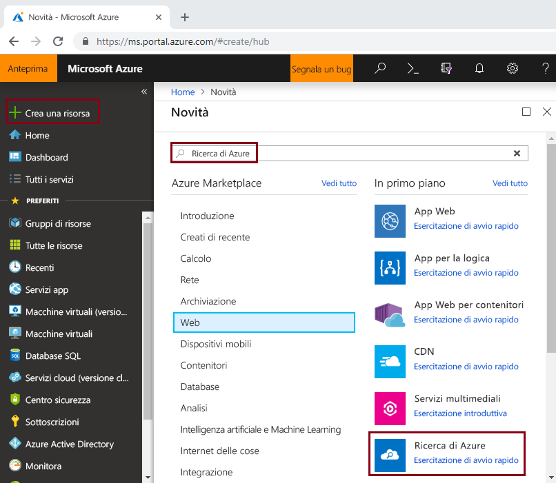
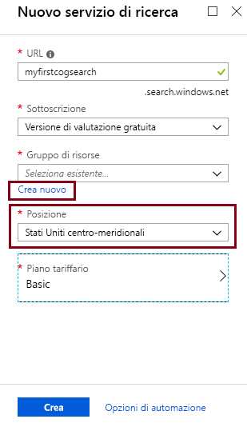
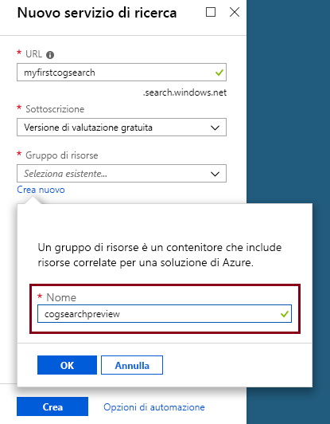

# <a name="tutorial-learn-how-to-call-cognitive-search-apis-preview"></a>Esercitazione: Informazioni su come chiamare le API di ricerca cognitiva (anteprima)

In questa esercitazione vengono illustrati i meccanismi di programmazione dell'arricchimento dei dati in Ricerca di Azure usando *competenze cognitive*. Le competenze cognitive sono l'elaborazione del linguaggio naturale e le operazioni di analisi delle immagini che consentono di estrarre testo e rappresentazioni di testo di un'immagine, rilevare la lingua, le entità, le frasi chiave e altro ancora. Il risultato finale è contenuto aggiuntivo elaborato in un indice di Ricerca di Azure, creato da una pipeline di indicizzazione di ricerca cognitiva. 

In questa esercitazione verranno eseguite chiamate API REST per eseguire le attività seguenti:

> [!div class="checklist"]
> * Creare una pipeline di indicizzazione per l'arricchimento dei dati di esempio nel percorso verso un indice
> * Applicare le competenze predefinite: riconoscimento delle entità, rilevamento della lingua, modifica del testo ed estrazione delle frasi chiave
> * Informazioni su come concatenare le competenze eseguendo il mapping di input a output in un set di competenze
> * Eseguire le richieste ed esaminare i risultati
> * Reimpostare l'indice e gli indicizzatori per ulteriore sviluppo

L'output è un indice di ricerca full-text in Ricerca di Azure. È possibile migliorare l'indice con altre funzionalità standard, ad esempio [sinonimi](search-synonyms.md), [profili di punteggio](https://docs.microsoft.com/rest/api/searchservice/add-scoring-profiles-to-a-search-index), [analizzatori](search-analyzers.md) e [filtri](search-filters.md).

Se non si ha una sottoscrizione di Azure, creare un [account gratuito](https://azure.microsoft.com/free/?WT.mc_id=A261C142F) prima di iniziare.

> [!NOTE]
> A partire dal 21 dicembre 2018 è possibile associare una risorsa dei Servizi cognitivi a un set di competenze della Ricerca di Azure. In questo modo sarà possibile iniziare ad addebitare per l'esecuzione del set di competenze. In questa data avrà inizio anche l'addebito dell'estrazione delle immagini come parte della fase di individuazione dei documenti. L'estrazione del testo dai documenti continuerà a essere offerta gratuitamente.
>
> L'esecuzione delle competenze predefinite verrà addebitata in base ai[prezzi con pagamento in base al consumo dei Servizi cognitivi](https://azure.microsoft.com/pricing/details/cognitive-services/). Per l'estrazione delle immagini verranno applicati i prezzi di anteprima, come illustrato nella [pagina dei prezzi di Ricerca di Azure](https://go.microsoft.com/fwlink/?linkid=2042400). [Altre informazioni](cognitive-search-attach-cognitive-services.md).

## <a name="prerequisites"></a>Prerequisiti

Se la ricerca cognitiva è una novità, è possibile leggere ["What is cognitive search?"](cognitive-search-concept-intro.md) (Che cos'è la ricerca cognitiva) per acquisire familiarità oppure provare la [guida introduttiva del portale](cognitive-search-quickstart-blob.md) per un'introduzione ai concetti importanti.

Per effettuare chiamate REST in Ricerca di Azure, usare PowerShell o uno strumento di test Web, come Telerik Fiddler o Postman per formulare richieste HTTP. Se questi strumenti non sono già noti, vedere [Esplorare le API REST di Ricerca di Azure con Fiddler o Postman](search-fiddler.md).

Usare il [portale di Azure](https://portal.azure.com/) per creare servizi usati in un flusso di lavoro end-to-end. 

### <a name="set-up-azure-search"></a>Configurare Ricerca di Azure

Prima di tutto, iscriversi al servizio Ricerca di Azure. 

1. Passare al [portale di Azure](https://portal.azure.com) e accedere con l'account di Azure.

1. Fare clic su **Crea una risorsa**, cercare Ricerca di Azure e fare clic su **Crea**. Vedere [Creare un servizio di Ricerca di Azure nel portale](search-create-service-portal.md) se è la prima volta che si configura un servizio di ricerca.

  

1. Per Gruppo di risorse creare un gruppo di risorse per contenere tutte le risorse che verranno create in questa esercitazione. In questo modo è più semplice pulire le risorse dopo aver completato l'esercitazione.

1. Per Località scegliere una delle [aree supportate](https://docs.microsoft.com/azure/search/cognitive-search-quickstart-blob#supported-regions) per la ricerca cognitiva.

1. Per Piano tariffario è possibile creare un servizio **Gratuito** per completare le esercitazioni e le guide introduttive. Per eseguire altre analisi usando dati personali, creare un [servizio a pagamento](https://azure.microsoft.com/pricing/details/search/), ad esempio **Basic** o **Standard**. 

  Un servizio Gratuito è limitato a 3 indici, dimensioni BLOB massime di 16 MB e 2 minuti di indicizzazione, capacità insufficienti per mettere alla prova tutte le funzionalità della ricerca cognitiva. Per esaminare i limiti per i diversi livelli, vedere [Limiti del servizio](search-limits-quotas-capacity.md).

  
  

 
1. Aggiungere il servizio al dashboard per un rapido accesso alle informazioni sul servizio.

  

1. Dopo che il servizio è stato creato, raccogliere le informazioni seguenti: **URL** dalla pagina di panoramica, e **chiave api** (primaria o secondaria) dalla pagina Chiavi.

  

### <a name="set-up-azure-blob-service-and-load-sample-data"></a>Configurare il servizio BLOB di Azure e caricare i dati di esempio

La pipeline di arricchimento effettua il pull da origini dati di Azure. I dati di origine devono provenire da un tipo di origine dati supportato di un [indicizzatore di Ricerca di Azure](search-indexer-overview.md). Nota bene: il servizio tabelle di Azure non è supportato per la ricerca cognitiva. Per questo esercizio viene usato l'archivio BLOB per presentare più tipi di contenuto.

1. [Scaricare i dati di esempio](https://1drv.ms/f/s!As7Oy81M_gVPa-LCb5lC_3hbS-4). I dati di esempio sono costituiti da un piccolo set di file di tipi diversi. 

1. Effettuare l'iscrizione per l'archivio BLOB di Azure, creare un account di archiviazione, accedere a Storage Explorer e creare un contenitore denominato `basicdemo`. Vedere la [guida introduttiva ad Azure Storage Explorer](../storage/blobs/storage-quickstart-blobs-storage-explorer.md) per istruzioni su tutti i passaggi.

1. Da Azure Storage Explorer, nel contenitore `basicdemo` creato, fare clic su **Carica** per caricare i file di esempio.

1. Dopo aver caricato i file di esempio, ottenere il nome del contenitore e una stringa di connessione per l'archivio BLOB. È possibile farlo passando all'account di archiviazione nel portale di Azure. In **Chiavi di accesso** copiare il contenuto del campo **Stringa di connessione**.

  La stringa di connessione deve essere un URL con un aspetto simile al seguente:

      ```http
      DefaultEndpointsProtocol=https;AccountName=cogsrchdemostorage;AccountKey=<your account key>;EndpointSuffix=core.windows.net
      ```

Esistono altri modi per specificare la stringa di connessione, ad esempio una firma di accesso condiviso. Per altre informazioni sulle credenziali dell'origine dati, vedere [Indicizzazione in Archiviazione BLOB di Azure](search-howto-indexing-azure-blob-storage.md#Credentials).

## <a name="create-a-data-source"></a>Creare un'origine dati

Ora che i servizi e i file di origine sono pronti, iniziare ad assemblare i componenti della pipeline di indicizzazione. Iniziare con un [oggetto origine dati](https://docs.microsoft.com/rest/api/searchservice/create-data-source) che indica a Ricerca di Azure come recuperare i dati di origine esterni.

Per questa esercitazione, usare l'API REST e uno strumento che consenta di formulare e inviare richieste HTTP, ad esempio PowerShell, Postman o Fiddler. Nell'intestazione della richiesta specificare il nome di servizio usato durante la creazione del servizio Ricerca di Azure e l'api-key generata per il servizio di ricerca. Nel corpo della richiesta specificare il nome e la stringa di connessione per il contenitore BLOB.

### <a name="sample-request"></a>Richiesta di esempio
```http
POST https://[service name].search.windows.net/datasources?api-version=2017-11-11-Preview
Content-Type: application/json  
api-key: [admin key]  
```
#### <a name="request-body-syntax"></a>Sintassi del corpo della richiesta
```json
{   
    "name" : "demodata",  
    "description" : "Demo files to demonstrate cognitive search capabilities.",  
    "type" : "azureblob",
    "credentials" :
    { "connectionString" :
      "DefaultEndpointsProtocol=https;AccountName=<your account name>;AccountKey=<your account key>;"
    },  
    "container" : { "name" : "<your blob container name>" }
}  
```
Inviare la richiesta. Lo strumento di test Web dovrebbe restituire un codice di stato 201 a conferma del corretto completamento dell'operazione. 

Trattandosi della prima richiesta, controllare nel portale di Azure per verificare che l'origine dati sia stata creata in Ricerca di Azure. Nella pagina del dashboard del servizio di ricerca, verificare che nel riquadro Origini dati sia disponibile un nuovo elemento. Potrebbe essere necessario attendere alcuni minuti per l'aggiornamento della pagina del portale. 

  

Se si riceve l'errore 403 o 404, controllare la costruzione della richiesta: `api-version=2017-11-11-Preview` deve essere nell'endpoint `api-key` deve essere nell'intestazione dopo `Content-Type` e il relativo valore deve essere valido per un servizio di ricerca. È possibile riutilizzare l'intestazione per i passaggi rimanenti in questa esercitazione.

> [!TIP]
> A questo punto, prima di eseguire numerose operazioni, è utile verificare che il servizio di ricerca sia in esecuzione in una delle località supportate che offre la funzionalità di anteprima: Stati Uniti centro-meridionali o Europa occidentale.

## <a name="create-a-skillset"></a>Creare un set di competenze

In questo passaggio viene definito un set di passaggi di arricchimento da applicare ai dati. Ogni passaggio di arricchimento è noto come *competenza* e il set di passaggi di arricchimento è un *set di competenze*. Questa esercitazione usa [competenze cognitive predefinite](cognitive-search-predefined-skills.md) per il set di competenze:

+ [Rilevamento della lingua](cognitive-search-skill-language-detection.md) per identificare la lingua del contenuto.

+ [Suddivisione del testo](cognitive-search-skill-textsplit.md) per suddividere il contenuto di grandi dimensioni in blocchi più piccoli prima di chiamare la competenza di estrazione delle frasi chiave. L'estrazione delle frasi chiave accetta input di al massimo 50.000 caratteri. Alcuni dei file di esempio devono essere suddivisi per rispettare questo limite.

+ [Riconoscimento di entità denominate](cognitive-search-skill-named-entity-recognition.md) per estrarre i nomi di organizzazioni dal contenuto nel contenitore BLOB.

+ [Estrazione di frasi chiave](cognitive-search-skill-keyphrases.md) per estrarre le frasi chiave principali. 

### <a name="sample-request"></a>Richiesta di esempio
Prima di effettuare questa chiamata REST, ricordarsi di sostituire il nome del servizio e la chiave di amministrazione nella richiesta di seguito, se lo strumento non consente di mantenere l'intestazione della richiesta tra le chiamate. 

Questa richiesta crea un set di competenze. Fare riferimento al nome del set di competenze ```demoskillset``` per il resto di questa esercitazione.

```http
PUT https://[servicename].search.windows.net/skillsets/demoskillset?api-version=2017-11-11-Preview
api-key: [admin key]
Content-Type: application/json
```
#### <a name="request-body-syntax"></a>Sintassi del corpo della richiesta
```json
{
  "description": 
  "Extract entities, detect language and extract key-phrases",
  "skills":
  [
    {
      "@odata.type": "#Microsoft.Skills.Text.NamedEntityRecognitionSkill",
      "categories": [ "Organization" ],
      "defaultLanguageCode": "en",
      "inputs": [
        {
          "name": "text", "source": "/document/content"
        }
      ],
      "outputs": [
        {
          "name": "organizations", "targetName": "organizations"
        }
      ]
    },
    {
      "@odata.type": "#Microsoft.Skills.Text.LanguageDetectionSkill",
      "inputs": [
        {
          "name": "text", "source": "/document/content"
        }
      ],
      "outputs": [
        {
          "name": "languageCode",
          "targetName": "languageCode"
        }
      ]
    },
    {
      "@odata.type": "#Microsoft.Skills.Text.SplitSkill",
      "textSplitMode" : "pages", 
      "maximumPageLength": 4000,
      "inputs": [
      {
        "name": "text",
        "source": "/document/content"
      },
      { 
        "name": "languageCode",
        "source": "/document/languageCode"
      }
    ],
    "outputs": [
      {
            "name": "textItems",
            "targetName": "pages"
      }
    ]
  },
  {
      "@odata.type": "#Microsoft.Skills.Text.KeyPhraseExtractionSkill",
      "context": "/document/pages/*",
      "inputs": [
        {
          "name": "text", "source": "/document/pages/*"
        },
        {
          "name":"languageCode", "source": "/document/languageCode"
        }
      ],
      "outputs": [
        {
          "name": "keyPhrases",
          "targetName": "keyPhrases"
        }
      ]
    }
  ]
}
```

Inviare la richiesta. Lo strumento di test Web dovrebbe restituire un codice di stato 201 a conferma del corretto completamento dell'operazione. 

#### <a name="about-the-request"></a>Informazioni sulla richiesta

Si noti come viene applicata la competenza di estrazione delle frasi chiave per ogni pagina. Impostando il contesto su ```"document/pages/*"``` si esegue questo meccanismo di arricchimento per ogni membro della matrice document/pages (per ogni pagina nel documento).

Ogni competenza viene eseguita sul contenuto del documento. Durante l'elaborazione, Ricerca di Azure analizza ogni documento per leggere il contenuto da formati di file diversi. Il testo trovato con origine nel file di origine viene inserito in un campo ```content``` generato, uno per ogni documento. Impostare quindi l'input come ```"/document/content"```.

Di seguito è riportata una rappresentazione grafica del set di competenze. 


Gli output possono essere mappati a un indice, usati come input per una competenza a valle, o entrambi, come nel caso del codice di lingua. Nell'indice, un codice di lingua è utile per le operazioni di filtro. Come input, il codice di lingua viene usato dalle competenze di analisi del testo per la selezione delle regole linguistiche per la separazione delle parole.

Per altre informazioni sui concetti di base dei set di competenze, vedere [How to create a skillset](cognitive-search-defining-skillset.md) (Come creare un set di competenze).

## <a name="create-an-index"></a>Creare un indice

In questa sezione viene definito lo schema dell'indice specificando i campi da includere nell'indice di ricerca e gli attributi di ricerca per ogni campo. I campi hanno un tipo e possono accettare attributi che determinano il modo in cui viene usato il campo (searchable, sortable e così via). Non è necessario che i nomi dei campi in un indice corrispondano esattamente ai nomi dei campi nell'origine. In un passaggio successivo verranno aggiunti i mapping dei campi in un indicizzatore per collegare i campi di origine e destinazione. Per questo passaggio, definire l'indice usando le convenzioni di denominazione dei campi pertinenti per l'applicazione di ricerca in questione.

Questo esercizio usa i campi e i tipi di campi seguenti:

| field-names: | id       | content   | languageCode | keyPhrases         | organizations     |
|--------------|----------|-------|----------|--------------------|-------------------|
| field-types: | Edm.String|Edm.String| Edm.String| List<Edm.String>  | List<Edm.String>  |


### <a name="sample-request"></a>Richiesta di esempio
Prima di effettuare questa chiamata REST, ricordarsi di sostituire il nome del servizio e la chiave di amministrazione nella richiesta di seguito, se lo strumento non consente di mantenere l'intestazione della richiesta tra le chiamate. 

Questa richiesta crea un indice. Usare il nome dell'indice ```demoindex``` per il resto di questa esercitazione.

```http
PUT https://[servicename].search.windows.net/indexes/demoindex?api-version=2017-11-11-Preview
api-key: [api-key]
Content-Type: application/json
```
#### <a name="request-body-syntax"></a>Sintassi del corpo della richiesta

```json
{
  "fields": [
    {
      "name": "id",
      "type": "Edm.String",
      "key": true,
      "searchable": true,
      "filterable": false,
      "facetable": false,
      "sortable": true
    },
    {
      "name": "content",
      "type": "Edm.String",
      "sortable": false,
      "searchable": true,
      "filterable": false,
      "facetable": false
    },
    {
      "name": "languageCode",
      "type": "Edm.String",
      "searchable": true,
      "filterable": false,
      "facetable": false
    },
    {
      "name": "keyPhrases",
      "type": "Collection(Edm.String)",
      "searchable": true,
      "filterable": false,
      "facetable": false
    },
    {
      "name": "organizations",
      "type": "Collection(Edm.String)",
      "searchable": true,
      "sortable": false,
      "filterable": false,
      "facetable": false
    }
  ]
}
```
Inviare la richiesta. Lo strumento di test Web dovrebbe restituire un codice di stato 201 a conferma del corretto completamento dell'operazione. 

Per altre informazioni sulla definizione di un indice, vedere [Create Index (Azure Search REST API)](https://docs.microsoft.com/rest/api/searchservice/create-index) (Creare un indice - API REST per Ricerca di Azure).


## <a name="create-an-indexer-map-fields-and-execute-transformations"></a>Creare un indicizzatore, mappare i campi ed eseguire le trasformazioni

Finora sono stati creati un'origine dati, un set di competenze e un indice. Questi tre componenti diventano parte di un [indicizzatore](search-indexer-overview.md) che riunisce tutti i dati in un'unica operazione in più fasi. Per unire questi elementi in un indicizzatore, è necessario definire mapping dei campi. I mapping dei campi fanno parte della definizione dell'indicizzatore ed eseguono le trasformazioni quando si invia la richiesta.

Per l'indicizzazione senza arricchimenti, la definizione dell'indicizzatore include una sezione facoltativa *fieldMappings* se i nomi dei campi o i tipi di dati non corrispondono esattamente o se si vuole usare una funzione.

Per i carichi di lavoro di ricerca cognitivi con una pipeline di arricchimento, l'indicizzatore richiede *outputFieldMappings*. Questi mapping vengono usati quando un processo interno (pipeline di arricchimento) è l'origine dei valori dei campi. I comportamenti univoci per *outputFieldMappings* includono la possibilità di gestire tipi complessi creati come parte dell'arricchimento (tramite la competenza shaper). Inoltre, possono essere presenti molti elementi per ogni documento (ad esempio, più organizzazioni in un documento). Il costrutto *outputFieldMappings* può indicare al sistema di rendere flat le raccolte di elementi in un singolo record.

### <a name="sample-request"></a>Richiesta di esempio

Prima di effettuare questa chiamata REST, ricordarsi di sostituire il nome del servizio e la chiave di amministrazione nella richiesta di seguito, se lo strumento non consente di mantenere l'intestazione della richiesta tra le chiamate. 

Specificare anche il nome dell'indicizzatore. È possibile farvi riferimento come ```demoindexer``` per il resto di questa esercitazione.

```http
PUT https://[servicename].search.windows.net/indexers/demoindexer?api-version=2017-11-11-Preview
api-key: [api-key]
Content-Type: application/json
```
#### <a name="request-body-syntax"></a>Sintassi del corpo della richiesta

```json
{
  "name":"demoindexer", 
  "dataSourceName" : "demodata",
  "targetIndexName" : "demoindex",
  "skillsetName" : "demoskillset",
  "fieldMappings" : [
        {
          "sourceFieldName" : "metadata_storage_path",
          "targetFieldName" : "id",
          "mappingFunction" : 
            { "name" : "base64Encode" }
        },
        {
          "sourceFieldName" : "content",
          "targetFieldName" : "content"
        }
   ],
  "outputFieldMappings" : 
  [
        {
          "sourceFieldName" : "/document/organizations", 
          "targetFieldName" : "organizations"
        },
        {
          "sourceFieldName" : "/document/pages/*/keyPhrases/*", 
          "targetFieldName" : "keyPhrases"
        },
        {
            "sourceFieldName": "/document/languageCode",
            "targetFieldName": "languageCode"
        }      
  ],
  "parameters":
  {
    "maxFailedItems":-1,
    "maxFailedItemsPerBatch":-1,
    "configuration": 
    {
        "dataToExtract": "contentAndMetadata",
        "imageAction": "generateNormalizedImages"
        }
  }
}
```

Inviare la richiesta. Lo strumento di test Web dovrebbe restituire un codice di stato 201 a conferma del corretto completamento dell'elaborazione. 

Il completamento di questa operazione può richiedere alcuni minuti. Anche se il set di dati è piccolo, le competenze analitiche prevedono un utilizzo elevato delle risorse di calcolo. Alcune competenze, ad esempio l'analisi delle immagini, hanno un'esecuzione prolungata.

> [!TIP]
> La creazione di un indicizzatore richiama la pipeline. Eventuali problemi a raggiungere i dati, per il mapping di input e output o nell'ordine delle operazioni vengono visualizzati in questa fase. Per eseguire di nuovo la pipeline con modifiche per codice o script, potrebbe essere necessario eliminare prima gli oggetti. Per altre informazioni, vedere [Reimpostare ed eseguire di nuovo](#reset).

### <a name="explore-the-request-body"></a>Esplorare il corpo della richiesta

Lo script imposta ```"maxFailedItems"``` su -1, che indica al motore di indicizzazione di ignorare gli errori durante l'importazione dei dati. Ciò è utile dato che l'origine dati di esempio include pochi documenti. Per un'origine dati più grande sarebbe necessario impostare un valore maggiore di 0.

Si noti inoltre l'istruzione ```"dataToExtract":"contentAndMetadata"``` nei parametri di configurazione. Questa istruzione indica all'indicizzatore di estrarre automaticamente il contenuto dai vari formati di file, oltre ai metadati correlati a ogni file. 

Quando viene estratto il contenuto, è possibile impostare ```imageAction``` per estrarre il testo dalle immagini trovate nell'origine dati. La configurazione ```"imageAction":"generateNormalizedImages"```, unita alla competenza OCR e alla competenza di unione del testo, indica all'indicizzatore di estrarre il testo dalle immagini (ad esempio, la parola "stop" da un segnale stradale di stop) e incorporarlo come parte del campo del contenuto. Questo comportamento si applica sia alle immagini incorporate nei documenti, ad esempio un'immagine all'interno di un PDF, che alle immagini trovate nell'origine dati, ad esempio un file JPG.

## <a name="check-indexer-status"></a>Controllare lo stato dell'indicizzatore

Dopo averlo definito, l'indicizzatore viene eseguito automaticamente quando si invia la richiesta. A seconda delle competenze cognitive definite, l'indicizzazione può richiedere più tempo del previsto. Per scoprire se l'indicizzatore è ancora in esecuzione, inviare la richiesta seguente per controllare lo stato dell'indicizzatore.

```http
GET https://[servicename].search.windows.net/indexers/demoindexer/status?api-version=2017-11-11-Preview
api-key: [api-key]
Content-Type: application/json
```

La risposta indica se l'indicizzatore è in esecuzione. Dopo il termine dell'indicizzazione, usare un'altra richiesta HTTP GET per l'endpoint STATUS (come sopra) per visualizzare i report di eventuali errori e avvisi che si sono verificati durante l'arricchimento.  

Gli avvisi sono comuni con alcune combinazioni di file di origine e competenze e non sempre indicano un problema. In questa esercitazione, gli avvisi sono innocui (ad esempio, nessun input di testo dai file JPEG). È possibile esaminare la risposta dello stato per ottenere informazioni dettagliate sugli avvisi generati durante l'indicizzazione.
 
## <a name="verify-content"></a>Verificare il contenuto

Dopo il termine dell'indicizzazione, eseguire le query che restituiscono il contenuto dei singoli campi. Per impostazione predefinita, Ricerca di Azure restituisce i primi 50 risultati. I dati di esempio sono piccoli, quindi l'impostazione predefinita è appropriata. Tuttavia, quando si opera su set di dati più grandi, potrebbe essere necessario includere parametri nella stringa di query per restituire più risultati. Per istruzioni, vedere [Come impaginare i risultati della ricerca in Ricerca di Azure](search-pagination-page-layout.md).

Come passaggio di verifica, eseguire una query sull'indice per tutti i campi.

```http
GET https://[servicename].search.windows.net/indexes/demoindex?api-version=2017-11-11-Preview
api-key: [api-key]
Content-Type: application/json
```

L'output è lo schema dell'indice, con nome, tipo e attributi di ogni campo.

Inviare una seconda query per `"*"` per restituire tutto il contenuto di un singolo campo, ad esempio `organizations`.

```http
GET https://[servicename].search.windows.net/indexes/demoindex/docs?search=*&$select=organizations&api-version=2017-11-11-Preview
api-key: [api-key]
Content-Type: application/json
```

Ripetere l'operazione per altri campi: content, languageCode, keyphrases e organizations in questo esercizio. È possibile restituire più campi tramite `$select` usando un elenco delimitato da virgole.

È possibile usare GET o POST, in base alla lunghezza e alla complessità della stringa di query. Per altre informazioni, vedere [Eseguire query su un indice di Ricerca di Azure con l'API REST](https://docs.microsoft.com/azure/search/search-query-rest-api).

<a name="access-enriched-document"></a>

## <a name="accessing-the-enriched-document"></a>Accesso al documento arricchito

La ricerca cognitiva consente di visualizzare la struttura del documento arricchito. I documenti arricchiti sono strutture temporanee create durante l'arricchimento e quindi eliminate al termine del processo.

Per acquisire uno snapshot del documento arricchito creato durante l'indicizzazione, aggiungere un campo denominato ```enriched``` all'indice. L'indicizzatore esegue automaticamente il dump nel campo di una rappresentazione stringa di tutti gli arricchimenti per il documento.

Il campo ```enriched``` conterrà una stringa che è una rappresentazione logica del documento in memoria arricchito in JSON.  Il valore del campo è tuttavia un documento JSON valido. Per le virgolette vengono usati caratteri di escape, quindi sarà necessario sostituire `\"` con `"` per visualizzare il documento in formato JSON.  

Il campo ```enriched``` è destinato esclusivamente al debugging, per comprendere meglio la forma logica del contenuto in base alla quale vengono valutate le espressioni. Può trattarsi di uno strumento utile per comprendere il set di competenze ed eseguirne il debug.

Ripetere l'esercizio precedente, includendo un campo `enriched` per acquisire il contenuto di un documento arricchito:

### <a name="request-body-syntax"></a>Sintassi del corpo della richiesta
```json
{
  "fields": [
    {
      "name": "id",
      "type": "Edm.String",
      "key": true,
      "searchable": true,
      "filterable": false,
      "facetable": false,
      "sortable": true
    },
    {
      "name": "content",
      "type": "Edm.String",
      "sortable": false,
      "searchable": true,
      "filterable": false,
      "facetable": false
    },
    {
      "name": "languageCode",
      "type": "Edm.String",
      "searchable": true,
      "filterable": false,
      "facetable": false
    },
    {
      "name": "keyPhrases",
      "type": "Collection(Edm.String)",
      "searchable": true,
      "filterable": false,
      "facetable": false
    },
    {
      "name": "organizations",
      "type": "Collection(Edm.String)",
      "searchable": true,
      "sortable": false,
      "filterable": false,
      "facetable": false
    },
    {
      "name": "enriched",
      "type": "Edm.String",
      "searchable": false,
      "sortable": false,
      "filterable": false,
      "facetable": false
    }
  ]
}
```
<a name="reset"></a>

## <a name="reset-and-rerun"></a>Reimpostare ed eseguire di nuovo

Nelle prime fasi sperimentali dello sviluppo della pipeline, l'approccio più pratico per le iterazioni di progettazione consiste nell'eliminare gli oggetti da Ricerca di Azure e consentire al codice di ricompilarli. I nomi di risorsa sono univoci. L'eliminazione di un oggetto consente di ricrearlo usando lo stesso nome.

Per reindicizzare i documenti con le nuove definizioni:

1. Eliminare l'indice per rimuovere i dati persistenti. Eliminare l'indicizzatore per ricrearlo nel servizio.
2. Modificare la definizione di un set di competenze e un indice.
3. Ricreare un indice e un indicizzatore nel servizio per eseguire la pipeline. 

È possibile usare il portale per eliminare indici, indicizzatori e set di competenze.

```http
DELETE https://[servicename].search.windows.net/skillsets/demoskillset?api-version=2017-11-11-Preview
api-key: [api-key]
Content-Type: application/json
```

In caso di corretto completamento dell'eliminazione viene restituito il codice di stato 204.

Con l'evoluzione del codice può risultare necessario perfezionare una strategia di ricompilazione. Per altre informazioni, vedere [How to rebuild an index](search-howto-reindex.md) (Come ricompilare un indice).

## <a name="takeaways"></a>Risultati

Questa esercitazione illustra i passaggi di base per la compilazione di una pipeline di indicizzazione arricchita tramite la creazione delle parti componenti: un'origine dati, un set di competenze, un indice e un indicizzatore.

Sono state presentate le [competenze predefinite](cognitive-search-predefined-skills.md), oltre alla definizione del set di competenze e ai meccanismi di concatenamento delle competenze tramite input e output. Si è inoltre appreso che `outputFieldMappings` nella definizione dell'indicizzatore è obbligatorio per indirizzare i valori arricchiti dalla pipeline in un indice di ricerca in un servizio Ricerca di Azure.

Infine, è stato descritto come testare i risultati e reimpostare il sistema per ulteriori iterazioni. Si è appreso che l'esecuzione di query sull'indice consente di restituire l'output creato dalla pipeline di indicizzazione arricchita. In questa versione, è disponibile un meccanismo per la visualizzazione dei costrutti interni (documenti arricchiti creati dal sistema). È stato inoltre descritto come controllare lo stato dell'indicizzatore e quali oggetti eliminare prima di eseguire di nuovo una pipeline.

## <a name="clean-up-resources"></a>Pulire le risorse

Il modo più veloce per pulire le risorse dopo un'esercitazione consiste nell'eliminare il gruppo di risorse contenente il servizio Ricerca di Azure e il servizio BLOB di Azure. Supponendo che entrambi i servizi siano stati inseriti nello stesso gruppo, eliminare il gruppo di risorse a questo punto per eliminare definitivamente tutti gli elementi in esso contenuti, inclusi i servizi e qualsiasi contenuto archiviato creato per questa esercitazione. Nel portale, il nome del gruppo di risorse è indicato nella pagina Panoramica di ciascun servizio.

## <a name="next-steps"></a>Passaggi successivi

Personalizzare o estendere la pipeline con competenze personalizzate. Creare una competenza personalizzata e aggiungerla a un set di competenze consente di caricare procedure di analisi del testo o delle immagini personalizzate. 

> [!div class="nextstepaction"]
> [Esempio: creare una competenza personalizzata](cognitive-search-create-custom-skill-example.md)
