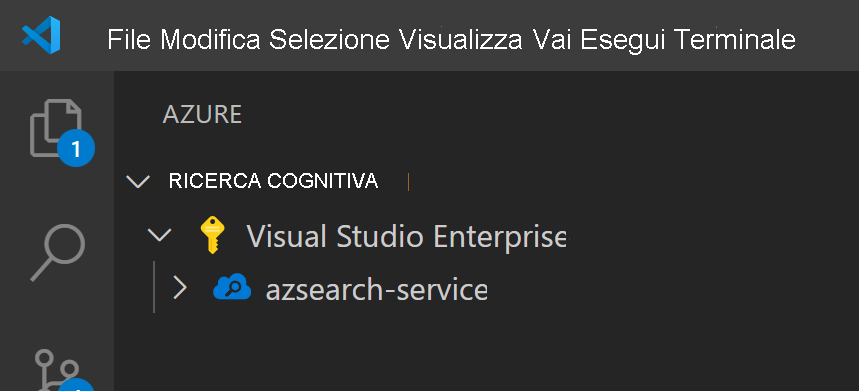
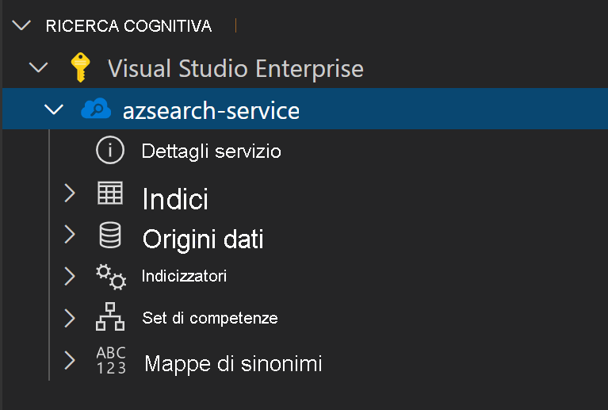
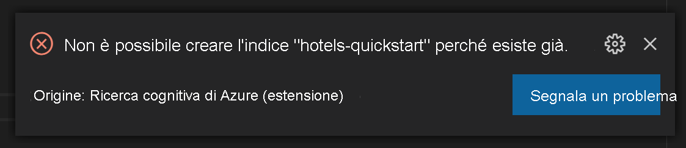
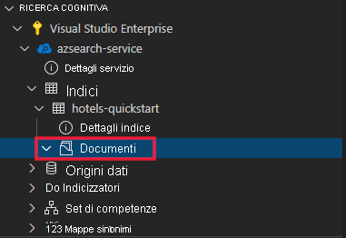
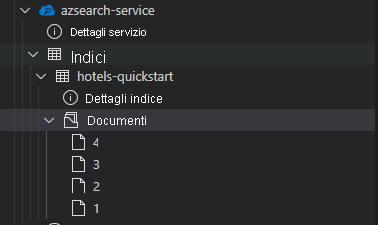

L'articolo usa l'estensione di Visual Studio Code (anteprima) per le API REST di Ricerca cognitiva di Azure.

> [!IMPORTANT] 
> Questa funzionalità è attualmente in anteprima pubblica. La funzionalità di anteprima viene fornita senza contratto di servizio e non è consigliata per i carichi di lavoro di produzione. Per altre informazioni, vedere [Condizioni supplementari per l'utilizzo delle anteprime di Microsoft Azure](https://azure.microsoft.com/support/legal/preview-supplemental-terms/). 

## <a name="prerequisites"></a>Prerequisiti

Per questa guida di avvio rapido sono richiesti i servizi e gli strumenti seguenti. 

+ [Visual Studio Code](https://code.visualstudio.com/download)

+ [Ricerca cognitiva di Azure per Visual Studio Code (anteprima)](https://marketplace.visualstudio.com/items?itemName=ms-azuretools.vscode-azurecognitivesearch)

+ [Creare un servizio di Ricerca cognitiva di Azure](../search-create-service-portal.md) o [trovare un servizio esistente](https://ms.portal.azure.com/#blade/HubsExtension/BrowseResourceBlade/resourceType/Microsoft.Search%2FsearchServices) nella sottoscrizione corrente. È possibile usare un servizio gratuito per questo avvio rapido. 

## <a name="copy-a-key-and-url"></a>Copiare una chiave e un URL

Le chiamate REST richiedono l'URL del servizio e una chiave di accesso per ogni richiesta. Con entrambi gli elementi viene creato un servizio di ricerca, quindi se il servizio Ricerca cognitiva di Azure è stato aggiunto alla sottoscrizione, seguire questi passaggi per ottenere le informazioni necessarie:

1. [Accedere al portale di Azure](https://portal.azure.com/) e ottenere l'URL nella pagina **Panoramica** del servizio di ricerca. Un endpoint di esempio potrebbe essere simile a `https://mydemo.search.windows.net`.

1. In **Impostazioni** > **Chiavi** ottenere una chiave amministratore per diritti completi sul servizio. Sono disponibili due chiavi amministratore interscambiabili, fornite per continuità aziendale nel caso in cui sia necessario eseguire il rollover di una di esse. È possibile usare la chiave primaria o secondaria nelle richieste per l'aggiunta, la modifica e l'eliminazione di oggetti.


Per ogni richiesta inviata al servizio è necessario specificare una chiave API. La presenza di una chiave valida stabilisce una relazione di trust, in base alle singole richieste, tra l'applicazione che invia la richiesta e il servizio che la gestisce.

## <a name="install-the-extension"></a>Installare l'estensione

Per iniziare, aprire [VS Code](https://code.visualstudio.com). Selezionare la scheda **Estensioni** sulla barra attività, quindi cercare *Ricerca cognitiva di Azure*. Individuare l'estensione nei risultati della ricerca e selezionare **Installa**.


In alternativa, è possibile installare l'[estensione Ricerca cognitiva di Azure](https://aka.ms/vscode-search) dal marketplace di VS Code in un Web browser.

Sulla barra attività verrà visualizzata una nuova scheda di Azure, se non è già presente.


## <a name="connect-to-your-subscription"></a>Eseguire la connessione alla sottoscrizione

Selezionare **Accedi ad Azure** e accedere all'account Azure.

Verranno visualizzate le proprie sottoscrizioni. Selezionare la sottoscrizione per visualizzare un elenco dei servizi di ricerca al suo interno.



Per limitare le sottoscrizioni visualizzate, aprire il riquadro comandi (CTRL+MAIUSC+P o CMD+MAIUSC+P) e cercare *Azure* o *Selezionare le sottoscrizioni*. Sono anche disponibili comandi per accedere e disconnettersi dall'account Azure.

Espandendo il servizio di ricerca, verranno visualizzati elementi di albero per ogni risorsa di Ricerca cognitiva, ovvero indici, origini dati, indicizzatori, set di competenze e mappe di sinonimi.



Questi elementi di albero possono essere espansi per mostrare le risorse incluse nel servizio di ricerca

## <a name="1---create-an-index"></a>1 - Creare un indice

Per iniziare a usare Ricerca cognitiva di Azure, è necessario prima di tutto creare un indice di ricerca. A questo scopo, usare l'[API REST di creazione indice](/rest/api/searchservice/create-index). 

Con l'estensione di VS Code, è necessario fare attenzione solo al corpo della richiesta. Questa guida di avvio rapido include una definizione di indice di esempio e i documenti corrispondenti.

### <a name="index-definition"></a>Definizione di indice

La definizione di indice seguente è uno schema di esempio per hotel fittizi.

La raccolta `fields` definisce la struttura dei documenti nell'indice di ricerca. Ogni campo include un tipo di dati e diversi attributi aggiuntivi che ne determinano i possibili utilizzi.

```json
{
    "name": "hotels-quickstart",
    "fields": [
        {
            "name": "HotelId",
            "type": "Edm.String",
            "key": true,
            "filterable": true
        },
        {
            "name": "HotelName",
            "type": "Edm.String",
            "searchable": true,
            "filterable": false,
            "sortable": true,
            "facetable": false
        },
        {
            "name": "Description",
            "type": "Edm.String",
            "searchable": true,
            "filterable": false,
            "sortable": false,
            "facetable": false,
            "analyzer": "en.lucene"
        },
        {
            "name": "Description_fr",
            "type": "Edm.String",
            "searchable": true,
            "filterable": false,
            "sortable": false,
            "facetable": false,
            "analyzer": "fr.lucene"
        },
        {
            "name": "Category",
            "type": "Edm.String",
            "searchable": true,
            "filterable": true,
            "sortable": true,
            "facetable": true
        },
        {
            "name": "Tags",
            "type": "Collection(Edm.String)",
            "searchable": true,
            "filterable": true,
            "sortable": false,
            "facetable": true
        },
        {
            "name": "ParkingIncluded",
            "type": "Edm.Boolean",
            "filterable": true,
            "sortable": true,
            "facetable": true
        },
        {
            "name": "LastRenovationDate",
            "type": "Edm.DateTimeOffset",
            "filterable": true,
            "sortable": true,
            "facetable": true
        },
        {
            "name": "Rating",
            "type": "Edm.Double",
            "filterable": true,
            "sortable": true,
            "facetable": true
        },
        {
            "name": "Address",
            "type": "Edm.ComplexType",
            "fields": [
                {
                    "name": "StreetAddress",
                    "type": "Edm.String",
                    "filterable": false,
                    "sortable": false,
                    "facetable": false,
                    "searchable": true
                },
                {
                    "name": "City",
                    "type": "Edm.String",
                    "searchable": true,
                    "filterable": true,
                    "sortable": true,
                    "facetable": true
                },
                {
                    "name": "StateProvince",
                    "type": "Edm.String",
                    "searchable": true,
                    "filterable": true,
                    "sortable": true,
                    "facetable": true
                },
                {
                    "name": "PostalCode",
                    "type": "Edm.String",
                    "searchable": true,
                    "filterable": true,
                    "sortable": true,
                    "facetable": true
                },
                {
                    "name": "Country",
                    "type": "Edm.String",
                    "searchable": true,
                    "filterable": true,
                    "sortable": true,
                    "facetable": true
                }
            ]
        }
    ],
    "suggesters": [
        {
            "name": "sg",
            "searchMode": "analyzingInfixMatching",
            "sourceFields": [
                "HotelName"
            ]
        }
    ]
}
```

Per creare un nuovo indice, fare clic con il pulsante destro del mouse su **Indici** e quindi scegliere **Crea nuovo indice**. Verrà visualizzato un editor con un nome simile a `indexes-new-28c972f661.azsindex`. 

Incollare la definizione di indice precedente nella finestra. Quando viene chiesto se aggiornare l'indice, salvare il file e selezionare **Carica**. L'indice verrà creato e sarà disponibile nella visualizzazione struttura ad albero.


Se la definizione di indice non è corretta, verrà visualizzato un popup con un messaggio di errore.



In questo caso, correggere il problema e salvare di nuovo il file.

## <a name="2---load-documents"></a>2 - Caricare i documenti

La creazione e il popolamento dell'indice sono passaggi distinti. In Ricerca cognitiva di Azure l'indice contiene tutti dati ricercabili. In questo scenario i dati vengono forniti come documenti JSON. Per questa attività viene usata l'[API REST di aggiunta, aggiornamento o eliminazione di documenti](/rest/api/searchservice/addupdate-or-delete-documents). 

Per aggiungere nuovi documenti in VS Code:

1. Espandere l'indice `hotels-quickstart` creato. Fare clic con il pulsante destro del mouse su **Documenti** e scegliere **Crea nuovo documento**.

    

2. Verrà visualizzato un editor JSON con lo schema dedotto dell'indice.

    

3. Incollare il codice JSON seguente e quindi salvare il file. Verrà visualizzata la richiesta di confermare le modifiche. Selezionare **Carica** per salvare le modifiche.

    ```json
    {
        "HotelId": "1",
        "HotelName": "Secret Point Motel",
        "Description": "The hotel is ideally located on the main commercial artery of the city in the heart of New York. A few minutes away is Time's Square and the historic centre of the city, as well as other places of interest that make New York one of America's most attractive and cosmopolitan cities.",
        "Category": "Boutique",
        "Tags": [ "pool", "air conditioning", "concierge" ],
        "ParkingIncluded": false,
        "LastRenovationDate": "1970-01-18T00:00:00Z",
        "Rating": 3.60,
        "Address": {
            "StreetAddress": "677 5th Ave",
            "City": "New York",
            "StateProvince": "NY",
            "PostalCode": "10022",
            "Country": "USA"
        } 
    }
    ```

4. Ripetere questa procedura per i tre documenti rimanenti

    Documento 2:
    ```json
    {
        "HotelId": "2",
        "HotelName": "Twin Dome Motel",
        "Description": "The hotel is situated in a  nineteenth century plaza, which has been expanded and renovated to the highest architectural standards to create a modern, functional and first-class hotel in which art and unique historical elements coexist with the most modern comforts.",
        "Category": "Boutique",
        "Tags": [ "pool", "free wifi", "concierge" ],
        "ParkingIncluded": false,
        "LastRenovationDate": "1979-02-18T00:00:00Z",
        "Rating": 3.60,
        "Address": {
            "StreetAddress": "140 University Town Center Dr",
            "City": "Sarasota",
            "StateProvince": "FL",
            "PostalCode": "34243",
            "Country": "USA"
        } 
    }
    ```

    Documento 3:
    ```json
    {
        "HotelId": "3",
        "HotelName": "Triple Landscape Hotel",
        "Description": "The Hotel stands out for its gastronomic excellence under the management of William Dough, who advises on and oversees all of the Hotel’s restaurant services.",
        "Category": "Resort and Spa",
        "Tags": [ "air conditioning", "bar", "continental breakfast" ],
        "ParkingIncluded": true,
        "LastRenovationDate": "2015-09-20T00:00:00Z",
        "Rating": 4.80,
        "Address": {
            "StreetAddress": "3393 Peachtree Rd",
            "City": "Atlanta",
            "StateProvince": "GA",
            "PostalCode": "30326",
            "Country": "USA"
        } 
    }
    ```

    Documento 4:
    ```json
    {
        "HotelId": "4",
        "HotelName": "Sublime Cliff Hotel",
        "Description": "Sublime Cliff Hotel is located in the heart of the historic center of Sublime in an extremely vibrant and lively area within short walking distance to the sites and landmarks of the city and is surrounded by the extraordinary beauty of churches, buildings, shops and monuments. Sublime Cliff is part of a lovingly restored 1800 palace.",
        "Category": "Boutique",
        "Tags": [ "concierge", "view", "24-hour front desk service" ],
        "ParkingIncluded": true,
        "LastRenovationDate": "1960-02-06T00:00:00Z",
        "Rating": 4.60,
        "Address": {
            "StreetAddress": "7400 San Pedro Ave",
            "City": "San Antonio",
            "StateProvince": "TX",
            "PostalCode": "78216",
            "Country": "USA"
        }
    }
    ```

A questo punto, tutti e quattro i documenti saranno disponibili nella sezione Documenti.



## <a name="3---search-an-index"></a>3 - Eseguire la ricerca in un indice

Ora che l'indice e il set di documenti sono stati caricati, è possibile sottoporli a query con l'[API REST di ricerca documenti](/rest/api/searchservice/search-documents).

Per eseguire questa operazione in VS Code:

1. Fare clic con il pulsante destro del mouse sull'indice da usare per la ricerca, quindi scegliere **Indice di ricerca**. Verrà visualizzato un editor con un nome simile a `sandbox-b946dcda48.azs`.

    

2. Viene automaticamente popolata una semplice query. Premere **CTRL+ALT+R** o **CMD+ALT+R** per inviare la query. In una finestra a sinistra verrà visualizzato il popup dei risultati.

    


### <a name="example-queries"></a>Query di esempio

Provare altri esempi di query per fare pratica con la sintassi. Di seguito sono riportate altre quattro query da provare. È possibile aggiungere più query nello stesso editor. Quando si preme **CTRL+ALT+R** o **CMD+ALT+R**, la linea del cursore determina quale query verrà inviata.


Nella prima query viene eseguita la ricerca di `boutique` e si imposta `select` per selezionare solo specifici campi. È consigliabile `select` solo i campi necessari, in quanto il pull di dati non necessari può aggiungere latenza alle query. La query imposta anche `$count=true` per restituire il numero totale di risultati della ricerca.

```
// Query example 1 - Search `boutique` with select and return count
search=boutique&$count=true&$select=HotelId,HotelName,Rating,Category
```

Nella query successiva viene specificato il termine di ricerca `wifi` e viene incluso anche un filtro per restituire solo i risultati in cui lo stato è uguale a `'FL'`. I risultati sono inoltre ordinati in base al `Rating` dell'hotel.

```
// Query example 2 - Search with filter, orderBy, select, and count
search=wifi&$filter=Address/StateProvince eq 'FL'&$select=HotelId,HotelName,Rating&$orderby=Rating desc
```

La ricerca viene quindi limitata a un singolo campo ricercabile con il parametro `searchFields`. È un'ottima opzione per rendere la query più efficiente, se si è interessati solo alle corrispondenze in determinati campi.

```
// Query example 3 - Limit searchFields
search=submlime cliff&$select=HotelId,HotelName,Rating&searchFields=HotelName
```

Un'altra opzione comune da includere in una query è `facets`. I facet consentono di creare filtri nell'interfaccia utente per consentire agli utenti di individuare più facilmente i valori che possono filtrare.

```
// Query example 4 - Take the top two results, and show only HotelName and Category in the results
search=*&$select=HotelId,HotelName,Rating&searchFields=HotelName&facet=Category
```

## <a name="open-index-in-the-portal"></a>Aprire l'indice nel portale

Per visualizzare l'indice di ricerca nel portale, fare clic con il pulsante destro del mouse sul nome del servizio di ricerca, quindi scegliere **Apri nel portale**. Si verrà indirizzati al servizio di ricerca nel portale di Azure.