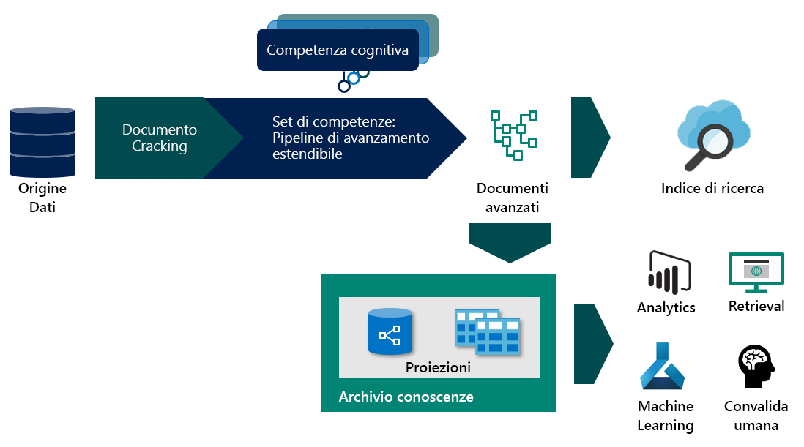

# <a name="what-is-knowledge-store-in-azure-search"></a>Che cos'è il knowledge store in Ricerca di Azure?

> [!Note]
> Il knowledge store è in anteprima e non ne è previsto l'uso in ambienti di produzione. Questa funzionalità viene fornita dall'[API REST versione 2019-05-06-Preview](search-api-preview.md). Non è attualmente disponibile alcun supporto di .NET SDK.
>

Il knowledge store è una funzionalità facoltativa di Ricerca di Azure che consente di salvare metadati e documenti arricchiti creati da una pipeline di indicizzazione basata su intelligenza artificiale [(ricerca cognitiva)](cognitive-search-concept-intro.md). Il knowledge store è supportato da un account di archiviazione di Azure configurato come parte della pipeline. Quando è abilitato, il servizio di ricerca usa questo account di archiviazione per memorizzare nella cache una rappresentazione di ogni documento arricchito. 

Se è stata usata la ricerca cognitiva in precedenza, si sa già che è possibile usare i set di competenze per spostare un documento attraverso una sequenza di arricchimenti. Il risultato può essere rappresentato da un indice di Ricerca di Azure o (novità in questa anteprima) da proiezioni in un knowledge store.

Le proiezioni sono un meccanismo per strutturare i dati per l'utilizzo in un'app downstream. È possibile usare [Storage Explorer](https://docs.microsoft.com/azure/vs-azure-tools-storage-manage-with-storage-explorer?tabs=windows) creato per l'archiviazione di Azure o per qualsiasi app che si connette all'archiviazione di Azure che apre nuove possibilità per l'utilizzo di documenti arricchiti. Alcuni esempi sono le pipeline di data science e le analisi personalizzate.



Per usare il knowledge store, aggiungere un elemento `knowledgeStore` a un set di competenze che definisce le operazioni graduali in una pipeline di indicizzazione. Durante l'esecuzione, Ricerca di Azure crea uno spazio nell'account di archiviazione di Azure e vi inserisce le definizioni e i contenuti creati dalla pipeline.

## <a name="benefits-of-knowledge-store"></a>Vantaggi del knowledge store

Un knowledge store offre una struttura, un contesto e un contenuto reale, ricavato da file di dati non strutturati e semi-strutturati come BLOB, file di immagini che sono stati sottoposti ad analisi, o anche dati strutturati che vengono rimodellati in nuove forme. In una [proceduta dettagliata](knowledge-store-howto.md) scritta per questa anteprima è possibile vedere come un documento JSON ad alta densità viene partizionato in sottostrutture, ricostituito in nuove strutture e reso altrimenti disponibile per processi downstream come carichi di lavoro di machine learning e data science.

Sebbene sia utile per vedere cosa può produrre una pipeline di indicizzazione basata su intelligenza artificiale, la vera forza del knowledge store è la capacità di rimodellare i dati. È possibile iniziare con un set di competenze di base e quindi iterarlo per aggiungere livelli crescenti di struttura, che è possibile combinare in nuove strutture, utilizzabili in altre app oltre a Ricerca di Azure.

Di seguito vengono elencati i vantaggi del knowledge store:

+ Utilizzare documenti arricchiti in [strumenti di analisi e creazione report](#tools-and-apps) diversi dalla ricerca. Power BI con Power Query è una scelta interessante, ma qualsiasi strumento o app che può connettersi all'archiviazione di Azure può eseguire il pull da un knowledge store creato.

+ Affinare una pipeline di indicizzazione basata su intelligenza artificiale mentre si eseguono il debug delle fasi e delle definizioni dei set di competenze. Un knowledge store mostra il prodotto di una definizione di set di competenze in una pipeline di indicizzazione basata su intelligenza artificiale. È possibile usare questi risultati per progettare un set di competenze migliori, perché è possibile vedere esattamente come sono gli arricchimenti. È possibile usare [Storage Explorer](https://docs.microsoft.com/azure/vs-azure-tools-storage-manage-with-storage-explorer?tabs=windows) nell'archiviazione di Azure per visualizzare il contenuto di un knowledge store.

+ Modellare i dati in nuove forme. Il rimodellamento è codificato in set di competenze, ma il punto è che un set di competenze può ora fornire questa funzionalità. La [competenza Shaper](cognitive-search-skill-shaper.md) in Ricerca di Azure è stata estesa per supportare questa attività. Il rimodellamento consente di definire una proiezione che si allinea con l'uso previsto dei dati, preservando al tempo stesso le relazioni.

> [!Note]
> Se non si familiarità con l'indicizzazione basata su intelligenza artificiale con Servizi Cognitivi, Ricerca di Azure si integra con le funzionalità Visione artificiale e Lingua di Servizi cognitivi per estrarre e arricchire i dati di origine con Riconoscimento ottico dei caratteri (OCR) su file di immagine, riconoscimento di entità ed estrazione di frasi chiave da file di testo e altro ancora. Per altre informazioni, vedere [Che cos'è la ricerca cognitiva?](cognitive-search-concept-intro.md).

## <a name="create-a-knowledge-store"></a>Creare un knowledge store

Un knowledge store fa parte di una definizione di set di competenze. In questa anteprima, la creazione richiede l'API REST con `api-version=2019-05-06-Preview` o l'**Importazione guidata dati** nel portale.

Il codice JSON seguente specifica un oggetto `knowledgeStore`, che fa parte di un set di competenze, che viene richiamato da un indicizzatore (non mostrato). La specifica di proiezioni all'interno di `knowledgeStore` determina se le tabelle o gli oggetti vengono creati nell'archiviazione di Azure.

Se si ha già familiarità con l'indicizzazione basata intelligenza artificiale, la definizione del set di competenze determina la creazione, l'organizzazione e la sostanza di ogni documento arricchito.

```json
{
  "name": "my-new-skillset",
  "description": 
  "Example showing knowledgeStore placement, supported in api-version=2019-05-06-Preview. You need at least one skill, most likely a Shaper skill if you are modulating data structures.",
  "skills":
  [
    {
    "@odata.type": "#Microsoft.Skills.Util.ShaperSkill",
    "context": "/document/content/phrases/*",
    "inputs": [
        {
        "name": "text",
        "source": "/document/content/phrases/*"
        },
        {
        "name": "sentiment",
        "source": "/document/content/phrases/*/sentiment"
        }
    ],
    "outputs": [
        {
        "name": "output",
        "targetName": "analyzedText"
        }
    ]
    },
  ],
  "cognitiveServices": 
    {
    "@odata.type": "#Microsoft.Azure.Search.CognitiveServicesByKey",
    "description": "mycogsvcs resource in West US 2",
    "key": "<your key goes here>"
    },
  "knowledgeStore": { 
    "storageConnectionString": "<your connection string goes here>", 
    "projections": [ 
        { 
            "tables": [  
            { "tableName": "Reviews", "generatedKeyName": "ReviewId", "source": "/document/Review" , "sourceContext": null, "inputs": []}, 
            { "tableName": "Sentences", "generatedKeyName": "SentenceId", "source": "/document/Review/Sentences/*", "sourceContext": null, "inputs": []}, 
            { "tableName": "KeyPhrases", "generatedKeyName": "KeyPhraseId", "source": "/document/Review/Sentences/*/KeyPhrases", "sourceContext": null, "inputs": []}, 
            { "tableName": "Entities", "generatedKeyName": "EntityId", "source": "/document/Review/Sentences/*/Entities/*" ,"sourceContext": null, "inputs": []} 

            ], 
            "objects": [ 
                { 
                "storageContainer": "Reviews", 
                "format": "json", 
                "source": "/document/Review", 
                "key": "/document/Review/Id" 
                } 
            ]      
        }    
    ]     
    } 
}
```

## <a name="components-backing-a-knowledge-store"></a>Componenti a sostegno di un knowledge store

Per creare un knowledge store, sono necessari i servizi e artefatti seguenti.

### <a name="1---source-data"></a>1 - Dati di origine

I dati o documenti che si vuole arricchire devono esistere in un'origine dati di Azure supportata dagli indicizzatori di Ricerca di Azure: 

* [SQL di Azure](search-howto-connecting-azure-sql-database-to-azure-search-using-indexers.md)

* [Azure Cosmos DB](search-howto-index-cosmosdb.md)

* [Archivio BLOB di Azure](search-howto-indexing-azure-blob-storage.md)

L'[archiviazione tabelle di Azure](search-howto-indexing-azure-tables.md) può essere usata per i dati in uscita in un knowledge store, ma non può essere usata come risorsa per i dati in ingresso in una pipeline di indicizzazione basata su intelligenza artificiale.

### <a name="2---azure-search-service"></a>2 - Servizio Ricerca di Azure

Sono inoltre necessari il servizio Ricerca di Azure e l'API REST per creare e configurare gli oggetti usati per l'arricchimento dei dati. L'API REST per la creazione di un knowledge store è `api-version=2019-05-06-Preview`.

Ricerca di Azure fornisce la funzione di indicizzatore, e gli indicizzatori vengono usati per controllare l'intero processo end-to-end generando documenti persistenti arricchiti nell'archiviazione di Azure. Gli indicizzatori usano un'origine dati, un indice e un set di competenze, tutti necessari per creare e popolare un knowledge store.

| Oggetto | API REST | DESCRIZIONE |
|--------|----------|-------------|
| Origine dati | [Creare un'origine dati](https://docs.microsoft.com/rest/api/searchservice/create-data-source)  | Risorsa che identifica un'origine dati esterna di Azure che fornisce dati di origine usati per creare documenti arricchiti.  |
| Set di competenze | [Creare un set di competenze (api-version=2019-05-06)](https://docs.microsoft.com/rest/api/searchservice/create-skillset)  | Risorsa che coordina l'utilizzo di [competenze predefinite](cognitive-search-predefined-skills.md) e [competenze cognitive personalizzate](cognitive-search-custom-skill-interface.md) usate in una pipeline di arricchimento durante l'indicizzazione. |
| index | [Creare un indice](https://docs.microsoft.com/rest/api/searchservice/create-index)  | Schema che esprime un indice di Ricerca di Azure. Viene eseguito il mapping dei campi nell'indice con i campi nei dati di origine o i campi prodotti durante la fase di arricchimento (ad esempio, un campo per i nomi dell'organizzazione creati dal riconoscimento entità). |
| Indicizzatore | [Creare un indicizzatore (api-version=2019-05-06)](https://docs.microsoft.com/rest/api/searchservice/create-skillset)  | Risorsa che definisce i componenti usati durante l'indicizzazione, incluso un'origine dati, un set di competenze, associazioni di campi dalle strutture dei dati di origine e intermedie all'indice di destinazione, oltre all'indice stesso. L'esecuzione dell'indicizzatore è il trigger di inserimento dati e arricchimento. L'output è un indice di ricerca basato sullo schema dell'indice, popolato con dati di origine e arricchito da set di competenze.  |

### <a name="3---cognitive-services"></a>3 - Servizi cognitivi

Gli arricchimenti specificati in un set di competenze si basano sulle funzionalità Visione artificiale e Lingua di Servizi cognitivi. Le funzionalità di Servizi cognitivi vengono usate durante l'indicizzazione tramite un set di competenze. Un set di competenze è una composizione di competenze, e le competenze sono associate alle funzionalità specifiche Visione artificiale e Lingua. Per integrare i Servizi Cognitivi, è possibile [collegare una risorsa Servizi cognitivi](cognitive-search-attach-cognitive-services.md) a un set di competenze.

### <a name="4---storage-account"></a>4 - Account di archiviazione

Nell'account di archiviazione di Azure Ricerca di Azure crea un contenitore BLOB o tabelle, a seconda di come si configura un set di competenze. Se i dati provengono da Archiviazione BLOB di Azure o da Archiviazione tabelle di Azure, non ci sono altre operazioni da eseguire. In caso contrario, sarà necessario creare un account di archiviazione di Azure. Le tabelle e gli oggetti nell'archiviazione di Azure contengono i documenti arricchiti creati dalla pipeline di indicizzazione basata su intelligenza artificiale.

L'account di archiviazione viene specificato nel set di competenze. In `api-version=2019-05-06-Preview`, una definizione di set di competenze include una definizione di knowledge store in modo da poter fornire le informazioni sull'account.

<a name="tools-and-apps"></a>

### <a name="5---access-and-consume"></a>5 - Accesso e utilizzo

Una volta che gli arricchimenti sono presenti nell'archiviazione, è possibile usare qualsiasi strumento o tecnologia che si connette ad Archiviazione BLOB di Azure o da Archiviazione tabelle di Azure per esplorare, analizzare o utilizzare i contenuti. È possibile iniziare con l'elenco seguente:

+ [Storage Explorer](https://docs.microsoft.com/azure/vs-azure-tools-storage-manage-with-storage-explorer?tabs=windows) per visualizzare la struttura e il contenuto dei documenti arricchiti. Considerare questo strumento come lo strumento di base per visualizzare i contenuti del knowledge store.

+ [Power BI con Power Query](https://support.office.com/article/connect-to-microsoft-azure-blob-storage-power-query-f8165faa-4589-47b1-86b6-7015b330d13e) per query in linguaggio naturale o usare gli strumenti di analisi e creazione report se si hanno dati numerici.

+ [Azure Data Factory](https://docs.microsoft.com/azure/data-factory/) per ulteriori elaborazioni.

+ Indice di Ricerca di Azure per la ricerca full-text nel contenuto indicizzato con la [ricerca cognitiva](cognitive-search-concept-intro.md).

## <a name="document-persistence"></a>Persistenza del documento

All'interno dell'account di archiviazione, gli arricchimenti possono essere espressi come tabelle all'interno di Archiviazione tabelle di Azure o come oggetti in Archiviazione BLOB di Azure Blob. È importante ricordare che gli arricchimenti, una volta archiviati, possono essere usati come origine per caricare dati in altri database e strumenti.

+ L'archiviazione tabelle è utile quando si vuole una rappresentazione dei dati con riconoscimento dello schema in formato tabulare. Se si vuole rimodellare o ricombinare gli elementi in modi nuovi, l'archiviazione tabelle fornisce la granularità necessaria.

+ L'archiviazione BLOB crea una rappresentazione JSON completa di ogni documento. È possibile usare entrambe le opzioni di archiviazione in un unico set di competenze per ottenere una gamma completa di espressioni.

+ Ricerca di Azure salva in modo permanente il contenuto in un indice. Se lo scenario non è legato alla ricerca, ad esempio se l'obiettivo è l'analisi in un altro strumento, è possibile eliminare l'indice che creato dalla pipeline. Ma è anche possibile mantenere l'indice e usare uno strumento incorporato come [Esplora ricerche](search-explorer.md) come supporto terzo (dietro Storage Explorer e un'app di analisi) per l'interazione con il contenuto.

Insieme ai contenuti dei documenti, i documenti arricchiti includono i metadati della versione del set di competenze che ha prodotto gli arricchimenti.  

## <a name="inside-a-knowledge-store"></a>All'interno di un knowledge store

Il knowledge store è costituito da una cache di annotazione e proiezioni. La *cache* viene usata dal servizio internamente per memorizzare nella cache i risultati delle competenze e tenere traccia delle modifiche. Una *proiezione* definisce lo schema e la struttura degli arricchimenti che corrispondono all'uso previsto. Esiste una cache per knowledge store, ma più proiezioni. 

La cache è sempre un contenitore BLOB, ma le proiezioni possono essere articolate come tabelle o oggetti:

+ Come oggetto, la proiezione esegue il mapping all'archiviazione BLOB, in cui la proiezione viene salvata in un contenitore, all'interno del quale di trovano gli oggetti o le rappresentazioni gerarchiche in formato JSON per scenari come ad esempio una pipeline di data science.

+ Come tabella, la proiezione esegue il mapping all'archiviazione tabelle. Una rappresentazione tabulare mantiene le relazioni per scenari come l'analisi dei dati o l'esportazione come frame di dati per machine learning. Le proiezioni arricchite possono quindi essere facilmente importate in altri archivi di dati. 

È possibile creare più proiezioni in un knowledge store per supportare le varie categorie all'interno dell'organizzazione. Uno sviluppatore potrebbe aver bisogno di accedere alla rappresentazione JSON completa di un documento arricchito, mentre data scientists o analisti di dati potrebbero volere strutture di dati granulari o modulari modellati in base a un set di competenze.

Ad esempio, se uno degli obiettivi del processo di arricchimento consiste nel creare anche un set di dati usato per eseguire il training di un modello, proiettare i dati nell'archivio oggetti sarebbe un modo per usare i dati nelle pipeline di data science. In alternativa, se si vuole creare un dashboard di Power BI rapido basato sui documenti arricchiti, la proiezione tabulare funziona bene.

<!---
## Data lifecycle and billing

Each time you run the indexer, the cache in Azure storage is updated if the skillset definition or underlying source data has changed. As input documents are edited or deleted, changes are propagated through the annotation cache to the projections, ensuring that your projected data is a current representation of your inputs at the end of the indexer run. 

Generally speaking, pipeline processing can be an all-or-nothing operation, but Azure Search can process incremental changes, which saves you time and money.

If a document is new or updated, all skills are run. If only the skillset changes, reprocessing is scoped to just those skills and documents affected by your edit.

### Changes to a skillset
Suppose that you have a pipeline composed of multiple skills, operating over a large body of static data (for example, scanned documents), that takes 8 hours and costs $200 to create the knowledge store. Now suppose you need to tweak one of the skills in the skillset. Rather than starting over, Azure Search can determine which skill is affected, and reprocess only that skill. Cached data and projections that are unaffected by the change remain intact in the knowledge store.

### Changes in the data
Scenarios can vary considerably, but let's suppose instead of static data, you have volatile data that changes between indexer invocations. Given no changes to the skillset, you are charged for processing the delta of new and modified document. The timestamp information varies by data source, but for illustration, in a Blob container, Azure Search looks at the `lastmodified` date to determine which blobs need to be ingested.

> [!Note]
> While you can edit the data in the projections, any edits will be overwritten on the next pipeline invocation, assuming the document in source data is updated. 

### Deletions

Although Azure Search creates and updates structures and content in Azure storage, it does not delete them. Projections and cached documents continue to exist even when the skillset is deleted. As the owner of the storage account, you should delete a projection if it is no longer needed. 

### Tips for development

+ Start small with a representative sample of your data as you make significant changes to skillset composition. As your design finalizes, you can slowly add more data during later-stage development, and then roll in the entire data set when you are comfortable with the pipeline composition.

+ Retain control over indexer invocation. Indexers can run on a schedule, which is helpful for solutions that are rolled into production, but less helpful if you are actively developing your pipeline. During development, avoid schedules so that you don’t lose track of cache or projection state. Once your solution is in production and skillset composition is static, you can put the indexer on a schedule to pick up routine changes in the external source data. 

-->

## <a name="where-do-i-start"></a>Dove iniziare?

Il servizio gratuito è consigliabile a scopi formativi, ma tenere presente che il numero di transazioni gratuite è limitato a 20 documenti al giorno per sottoscrizione.

Quando si usano più servizi, è possibile creare tutti i servizi nella stessa area per ottenere prestazioni ottimali e ridurre al minimo i costi. Non viene addebitata la larghezza di banda per i dati in ingresso o i dati in uscita che passano a un altro servizio nella stessa area.

**Passaggio 1: [Creare una risorsa Ricerca di Azure](search-create-service-portal.md)** 

**Passaggio 2: [Creare un account di archiviazione di Azure](https://docs.microsoft.com/azure/storage/common/storage-quickstart-create-account?tabs=azure-portal)** 

**Passaggio 3: [Creare una risorsa per Servizi cognitivi](https://docs.microsoft.com/azure/cognitive-services/cognitive-services-apis-create-account)** 

**Passaggio 4: [Introduzione al portale](cognitive-search-quickstart-blob.md) - oppure - [Introduzione ai dati di esempio con REST e Postman](knowledge-store-howto.md)** 

È possibile usare REST `api-version=2019-05-06-Preview` per costruire una pipeline basata su intelligenza artificiale che includa il knowledge store. Nell'ultima API di anteprima l'oggetto Skillset fornisce la definizione di `knowledgeStore`.

## <a name="takeaways"></a>Risultati

Il knowledge store offre una serie di vantaggi, tra cui la possibilità di usare i documenti arricchiti in scenari diversi dalla ricerca, dal controllo dei costi e dalla gestione della deviazione nel processo di arricchimento. Queste funzionalità sono tutte disponibili per l'uso. È sufficiente aggiungere un account di archiviazione al set di competenze e usare il linguaggio delle espressioni aggiornato, come descritto in [Introduzione a Knowledge Store](knowledge-store-howto.md). 

## <a name="next-steps"></a>Passaggi successivi

L'approccio più semplice per la creazione di documenti arricchiti è tramite l'**Importazione guidata dati**.

> [!div class="nextstepaction"]
> [Guida introduttiva: Provare la ricerca cognitiva in una procedura dettagliata del portale](cognitive-search-quickstart-blob.md)
