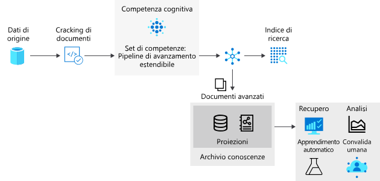

# <a name="introduction-to-knowledge-stores-in-azure-cognitive-search"></a>Introduzione agli archivi conoscenze in Ricerca cognitiva di Azure

> [!IMPORTANT] 
> L'archivio conoscenze è attualmente disponibile in anteprima pubblica. La funzionalità di anteprima viene fornita senza contratto di servizio e non è consigliata per i carichi di lavoro di produzione. Per altre informazioni, vedere [Condizioni supplementari per l'utilizzo delle anteprime di Microsoft Azure](https://azure.microsoft.com/support/legal/preview-supplemental-terms/). Queste funzionalità di anteprima vengono fornite dall'[API REST versione 2019-05-06-Preview](search-api-preview.md). Il supporto del portale è attualmente limitato e non è disponibile alcun supporto per .NET SDK.

Archivio informazioni è una funzionalità di Azure ricerca cognitiva che rende permanente l'output di una [pipeline di arricchimento ai](cognitive-search-concept-intro.md) per analisi successive o altre elaborazioni downstream. Un *documento arricchito* è l'output di una pipeline, creato da contenuto che è stato estratto, strutturato e analizzato tramite processi di intelligenza artificiale. In una pipeline di intelligenza artificiale standard, i documenti arricchiti sono temporanei, ovvero vengono usati solo durante l'indicizzazione per poi essere rimossi. Con l'archivio conoscenze, i documenti arricchiti vengono conservati. 

Se in passato sono state usate competenze cognitive con Ricerca cognitiva di Azure, si sa già che è possibile usare i *set di competenze* per spostare un documento attraverso una sequenza di arricchimenti. Il risultato può essere rappresentato da un indice di ricerca o (novità in questa anteprima) da proiezioni in un archivio conoscenze. I due output, l'indice di ricerca e l'archivio conoscenze condividono lo stesso contenuto, ma vengono archiviati e usati in modi molto diversi.

Fisicamente, un archivio conoscenze è una [risorsa di archiviazione di Azure](https://docs.microsoft.com/azure/storage/common/storage-account-overview), ad esempio una risorsa di archiviazione tabelle di Azure, di archiviazione BLOB di Azure o entrambe. Qualsiasi strumento o processo in grado di connettersi ad archiviazione di Azure può usare il contenuto di un archivio conoscenze.



Per usare il knowledge store, aggiungere un elemento `knowledgeStore` a un set di competenze che definisce le operazioni graduali in una pipeline di indicizzazione. Durante l'esecuzione, Ricerca cognitiva di Azure crea uno spazio nell'account di archiviazione di Azure e proietta i documenti arricchiti come BLOB o in tabelle, a seconda della configurazione.

## <a name="benefits-of-knowledge-store"></a>Vantaggi del knowledge store

Un knowledge store offre una struttura, un contesto e un contenuto reale, ricavato da file di dati non strutturati e semi-strutturati come BLOB, file di immagini che sono stati sottoposti ad analisi, o anche dati strutturati che vengono rimodellati in nuove forme. In una [procedura dettagliata](knowledge-store-howto.md)è possibile vedere in prima persona come partizionare un documento JSON denso in sottostrutture, ricostituito in nuove strutture e reso disponibile per i processi downstream come machine learning e Data Science carichi.

Sebbene sia utile per osservare il risultato generato da una pipeline di arricchimento tramite intelligenza artificiale, la vera forza dell'archivio conoscenze è la capacità di rimodellare i dati. È possibile iniziare con un set di competenze di base e quindi iterarlo per aggiungere livelli crescenti di struttura, che è possibile combinare in nuove strutture, utilizzabili in altre app oltre a Ricerca cognitiva di Azure.

Di seguito vengono elencati i vantaggi del knowledge store:

+ Utilizzare documenti arricchiti in [strumenti di analisi e creazione report](#tools-and-apps) diversi dalla ricerca. Power BI con Power Query è una scelta interessante, ma qualsiasi strumento o app che può connettersi all'archiviazione di Azure può eseguire il pull da un knowledge store creato.

+ Affinare una pipeline di indicizzazione basata su intelligenza artificiale mentre si eseguono il debug delle fasi e delle definizioni dei set di competenze. Un knowledge store mostra il prodotto di una definizione di set di competenze in una pipeline di indicizzazione basata su intelligenza artificiale. È possibile usare questi risultati per progettare un set di competenze migliori, perché è possibile vedere esattamente come sono gli arricchimenti. È possibile usare [Storage Explorer](https://docs.microsoft.com/azure/vs-azure-tools-storage-manage-with-storage-explorer?tabs=windows) nell'archiviazione di Azure per visualizzare il contenuto di un knowledge store.

+ Modellare i dati in nuove forme. Il rimodellamento è codificato in set di competenze, ma il punto è che un set di competenze può ora fornire questa funzionalità. La [competenza Shaper](cognitive-search-skill-shaper.md) in Ricerca cognitiva di Azure è stata estesa per supportare questa attività. Il rimodellamento consente di definire una proiezione che si allinea con l'uso previsto dei dati, preservando al tempo stesso le relazioni.

> [!Note]
> Nuove funzionalità di intelligenza artificiale e competenze cognitive? Ricerca cognitiva di Azure si integra con le funzionalità Visione artificiale e Lingua di Servizi cognitivi per estrarre e arricchire i dati di origine tramite il Riconoscimento ottico dei caratteri (OCR) su file di immagine, riconoscimento di entità ed estrazione di frasi chiave da file di testo e altro ancora. Per altre informazioni, vedere [Arricchimento tramite intelligenza artificiale in Ricerca cognitiva di Azure](cognitive-search-concept-intro.md).

## <a name="creating-a-knowledge-store"></a>Creazione di un archivio conoscenze

Un archivio conoscenze è parte di un [set di competenze](cognitive-search-working-with-skillsets.md), che a sua volta fa parte di un [indicizzatore](search-indexer-overview.md). 

In questa anteprima è possibile creare un archivio conoscenze usando l'API REST e `api-version=2019-05-06-Preview` o tramite l'**Importazione guidata dati** nel portale.

### <a name="json-representation-of-a-knowledge-store"></a>Rappresentazione JSON di un archivio conoscenze

Il codice JSON seguente specifica un oggetto `knowledgeStore`, che fa parte di un set di competenze, che viene richiamato da un indicizzatore (non mostrato). Se si ha già familiarità con l'arricchimento tramite intelligenza artificiale, un set di competenze determina la creazione, l'organizzazione e la sostanza di ogni documento arricchito. Un set di competenze deve contenere almeno una competenza, molto probabilmente una competenza Shaper se si stanno modulando strutture di dati.

Un `knowledgeStore` è costituito da una connessione e dalle proiezioni. 

+ La connessione è a un account di archiviazione nella stessa area del ricerca cognitiva di Azure. 

+ Le proiezioni possono essere oggetti tabulari, JSON o file. Le `Tables` definiscono l'espressione fisica dei documenti arricchiti nell'archiviazione tabelle di Azure. `Objects` definiscono gli oggetti JSON fisici nell'archivio BLOB di Azure. `Files` sono binari come le immagini estratte dal documento che verranno rese permanente.

+ Proiezioni è una raccolta di oggetti Projection, ogni oggetto proiezione può contenere `tables`, `objects` e `files`. Gli arricchimenti proiettati in una singola proiezione sono correlati anche quando vengono proiettati tra tipi (tabelle, oggetti o file). Le proiezioni negli oggetti di proiezione non sono correlate e sono indipendenti. La stessa forma può essere proiettata in AROS più oggetti di proiezione.

```json
{
  "name": "my-new-skillset",
  "description": "Example showing knowledgeStore placement in a skillset.",
  "skills":
  [
    {
    "@odata.type": "#Microsoft.Skills.Util.ShaperSkill",
    "context": "/document/content/phrases/*",
    "inputs": [
        {
        "name": "text",
        "source": "/document/content/phrases/*"
        },
        {
        "name": "sentiment",
        "source": "/document/content/phrases/*/sentiment"
        }
    ],
    "outputs": [
        {
        "name": "output",
        "targetName": "analyzedText"
        }
    ]
    },
  ],
  "cognitiveServices": 
    {
    "@odata.type": "#Microsoft.Azure.Search.CognitiveServicesByKey",
    "description": "mycogsvcs resource in West US 2",
    "key": "<your key goes here>"
    },
  "knowledgeStore": { 
    "storageConnectionString": "<your connection string goes here>", 
    "projections": [ 
        { 
            "tables": [  
            { "tableName": "Reviews", "generatedKeyName": "ReviewId", "source": "/document/Review" , "sourceContext": null, "inputs": []}, 
            { "tableName": "Sentences", "generatedKeyName": "SentenceId", "source": "/document/Review/Sentences/*", "sourceContext": null, "inputs": []}, 
            { "tableName": "KeyPhrases", "generatedKeyName": "KeyPhraseId", "source": "/document/Review/Sentences/*/KeyPhrases", "sourceContext": null, "inputs": []}, 
            { "tableName": "Entities", "generatedKeyName": "EntityId", "source": "/document/Review/Sentences/*/Entities/*" ,"sourceContext": null, "inputs": []} 

            ], 
            "objects": [ 
               
            ], 
            "files": [

            ]  
        },
        { 
            "tables": [ 
            ], 
            "objects": [ 
                { 
                "storageContainer": "Reviews", 
                "format": "json", 
                "source": "/document/Review", 
                "key": "/document/Review/Id" 
                } 
            ],
            "files": [
                
            ]  
        }        
    ]     
    } 
}
```

Questo esempio non contiene immagini. per un esempio di come utilizzare le proiezioni di file, vedere [utilizzo delle proiezioni](knowledge-store-projection-overview.md).
### <a name="sources-of-data-for-a-knowledge-store"></a>Origini dei dati per un archivio conoscenze

Se l'output di un archivio conoscenze viene generato da una pipeline di arricchimento tramite intelligenza artificiale, quali sono gli input? I dati originali da estrarre, arricchire e infine salvare in un archivio conoscenze possono provenire da qualsiasi origine dati di Azure supportata dagli indicizzatori di ricerca: 

* [Azure Cosmos DB](search-howto-index-cosmosdb.md)

* [Archivio BLOB di Azure](search-howto-indexing-azure-blob-storage.md)

* [Archivio tabelle di Azure](search-howto-indexing-azure-tables.md)

* [SQL di Azure](search-howto-connecting-azure-sql-database-to-azure-search-using-indexers.md)

Gli indicizzatori e i set di competenze creati consentono di estrarre e arricchire o trasformare il contenuto come parte di un carico di lavoro di indicizzazione e quindi salvare i risultati in un archivio conoscenze.

### <a name="rest-apis-used-in-creation-of-a-knowledge-store"></a>API REST usate per la creazione di un archivio conoscenze

Solo due API dispongono delle estensioni necessarie per la creazione di un archivio conoscenze (Create Skillset e Create Indexer). Le altre API vengono usate così come sono.

| Oggetto | API REST | Description |
|--------|----------|-------------|
| Origine dati | [Creare un'origine dati](https://docs.microsoft.com/rest/api/searchservice/create-data-source)  | Risorsa che identifica un'origine dati esterna di Azure che fornisce dati di origine usati per creare documenti arricchiti.  |
| Set di competenze | [Creare un set di competenze (api-version=2019-05-06-Preview)](https://docs.microsoft.com/rest/api/searchservice/create-skillset)  | Risorsa che coordina l'utilizzo di [competenze predefinite](cognitive-search-predefined-skills.md) e [competenze cognitive personalizzate](cognitive-search-custom-skill-interface.md) usate in una pipeline di arricchimento durante l'indicizzazione. Un set di competenze contiene una definizione `knowledgeStore` come elemento figlio. |
| index | [Creare un indice](https://docs.microsoft.com/rest/api/searchservice/create-index)  | Schema che esprime un indice di ricerca. Viene eseguito il mapping dei campi nell'indice con i campi nei dati di origine o i campi prodotti durante la fase di arricchimento (ad esempio, un campo per i nomi dell'organizzazione creati dal riconoscimento entità). |
| Indicizzatore | [Creare un indicizzatore (api-version=2019-05-06)](https://docs.microsoft.com/rest/api/searchservice/create-skillset)  | Risorsa che definisce i componenti usati durante l'indicizzazione, incluso un'origine dati, un set di competenze, associazioni di campi dalle strutture dei dati di origine e intermedie all'indice di destinazione, oltre all'indice stesso. L'esecuzione dell'indicizzatore è il trigger di inserimento dati e arricchimento. L'output è un indice di ricerca basato sullo schema dell'indice, popolato con dati di origine e arricchito da set di competenze.  |

### <a name="physical-composition-of-a-knowledge-store"></a>Composizione fisica di un archivio conoscenze

 Una *proiezione*, che è un elemento di una definizione di `knowledgeStore`, articola lo schema e la struttura dell'output in base all'utilizzo previsto. Se sono presenti applicazioni che utilizzano i dati in formati e forme diversi, è possibile definire più proiezioni. 

Le proiezioni possono essere articolate come oggetti o tabelle:

+ Come oggetto, la proiezione esegue il mapping all'archiviazione BLOB, in cui la proiezione viene salvata in un contenitore, all'interno del quale di trovano gli oggetti o le rappresentazioni gerarchiche in formato JSON per scenari come ad esempio una pipeline di data science.

+ Come tabella, la proiezione esegue il mapping all'archiviazione tabelle. Una rappresentazione tabulare mantiene le relazioni per scenari come l'analisi dei dati o l'esportazione come frame di dati per machine learning. Le proiezioni arricchite possono quindi essere facilmente importate in altri archivi di dati. 

È possibile creare più proiezioni in un knowledge store per supportare le varie categorie all'interno dell'organizzazione. Uno sviluppatore potrebbe aver bisogno di accedere alla rappresentazione JSON completa di un documento arricchito, mentre data scientists o analisti di dati potrebbero volere strutture di dati granulari o modulari modellati in base a un set di competenze.

Ad esempio, se uno degli obiettivi del processo di arricchimento consiste nel creare anche un set di dati usato per eseguire il training di un modello, proiettare i dati nell'archivio oggetti sarebbe un modo per usare i dati nelle pipeline di data science. In alternativa, se si vuole creare un dashboard di Power BI rapido basato sui documenti arricchiti, la proiezione tabulare funziona bene.

<a name="tools-and-apps"></a>

## <a name="connecting-with-tools-and-apps"></a>Connessione con strumenti e app

Una volta che gli arricchimenti sono presenti nell'archiviazione, è possibile usare qualsiasi strumento o tecnologia che si connette ad Archiviazione BLOB di Azure o da Archiviazione tabelle di Azure per esplorare, analizzare o utilizzare i contenuti. È possibile iniziare con l'elenco seguente:

+ [Storage Explorer](knowledge-store-view-storage-explorer.md) per visualizzare la struttura e il contenuto dei documenti arricchiti. Considerare questo strumento come lo strumento di base per visualizzare i contenuti del knowledge store.

+ [Power BI](knowledge-store-connect-power-bi.md) per gli strumenti di creazione di report e analisi se si usano di dati numerici.

+ [Azure Data Factory](https://docs.microsoft.com/azure/data-factory/) per ulteriori elaborazioni.

## <a name="next-steps"></a>Passaggi successivi

L'Archivio conoscenze offre la persistenza dei documenti arricchiti, utile durante la progettazione di un set di competenze o la creazione di nuove strutture e contenuto per l'utilizzo da parte di qualsiasi applicazione client in grado di accedere a un account di archiviazione di Azure.

L'approccio più semplice per la creazione di documenti arricchiti consiste nell'usare l'**Importazione guidata dati**, ma è anche possibile usare Postman e l'API REST, alternativa più utile se si desidera ottenere informazioni dettagliate su come vengono creati gli oggetti e su come viene fatto riferimento agli oggetti.

> [!div class="nextstepaction"]
> [Creare un archivio conoscenze con il portale](knowledge-store-create-portal.md)
> [Creare un archivio conoscenze usando Postman e l'API REST](knowledge-store-create-rest.md)
