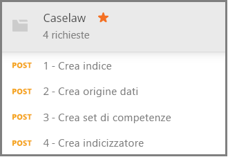

# <a name="how-to-get-started-with-knowledge-store-in-azure-search"></a>Introduzione al knowledge store in Ricerca di Azure

> [!Note]
> Il knowledge store è in anteprima e non ne è previsto l'uso in ambienti di produzione. Questa funzionalità viene fornita dall'[API REST versione 2019-05-06-Preview](search-api-preview.md). Non è attualmente disponibile alcun supporto di .NET SDK.
>
L'[archivio conoscenze](knowledge-store-concept-intro.md) consente di salvare i documenti arricchiti con intelligenza artificiale creati durante l'indicizzazione nell'account di archiviazione di Azure per il data mining downstream in altre app. È anche possibile usare gli arricchimenti salvati per comprendere e ottimizzare una pipeline di indicizzazione di Ricerca di Azure. 

Un archivio conoscenze è definito da un *set di competenze* e viene creato da un *indicizzatore*. L'espressione fisica di un archivio conoscenze viene specificato tramite *proiezioni* che determinano le strutture dei dati nell'archiviazione. In questa procedura dettagliata si creeranno tutti questi oggetti e si otterranno informazioni sulla loro interazione. 

In questo esercizio iniziare con dati di esempio, servizi e strumenti per apprendere il flusso di lavoro di base per la creazione e l'uso del primo knowledge store, prestando particolare attenzione alla definizione del set di competenze.

## <a name="prerequisites"></a>Prerequisiti

L'archivio conoscenze è il fulcro di numerosi servizi, tra cui Archiviazione BLOB di Azure e Archiviazione tabelle di Azure che forniscono l'archiviazione fisica e Ricerca di Azure e Servizi cognitivi che vengono usati per gli aggiornamenti e la creazione di oggetti. La conoscenza dell'[architettura di base](knowledge-store-concept-intro.md) costituisce un prerequisito di questa procedura dettagliata.

In questa guida di avvio rapido vengono usati i servizi e gli strumenti seguenti. 

+ [App desktop Get Postman](https://www.getpostman.com/), usata per l'invio di richieste HTTP a Ricerca di Azure.

+ [Creare un account di archiviazione di Azure](https://docs.microsoft.com/azure/storage/common/storage-quickstart-create-account) per l'archiviazione dei dati di esempio e dell'archivio conoscenze. Il knowledge store sarà disponibile nell'archiviazione di Azure.

+ [Creare una risorsa di Servizi cognitivi](https://docs.microsoft.com/azure/cognitive-services/cognitive-services-apis-create-account) al livello S0 con pagamento in base al consumo per un accesso più esteso all'intera gamma di competenze usate negli arricchimenti basati sull'intelligenza artificiale. Servizi cognitivi e il servizio Ricerca di Azure devono trovarsi nella stessa area.

+ [Creare un servizio Ricerca di Azure](search-create-service-portal.md) o [trovare un servizio esistente](https://ms.portal.azure.com/#blade/HubsExtension/BrowseResourceBlade/resourceType/Microsoft.Search%2FsearchServices) nella sottoscrizione corrente. È possibile usare un servizio gratuito per questa esercitazione. 

Sono inoltre necessari i documenti JSON di esempio e un file di raccolta Postman. Le istruzioni per l'individuazione e il caricamento dei file supplementari sono incluse nella sezione [Preparare i dati di esempio](#prepare-sample-data).

## <a name="get-a-key-and-url"></a>Ottenere una chiave e un URL

Le chiamate REST richiedono l'URL del servizio e una chiave di accesso per ogni richiesta. Con entrambi gli elementi viene creato un servizio di ricerca, quindi se si è aggiunto Ricerca di Azure alla sottoscrizione, seguire questi passaggi per ottenere le informazioni necessarie:

1. [Accedere al portale di Azure](https://portal.azure.com/) e ottenere l'URL nella pagina **Panoramica** del servizio di ricerca. Un endpoint di esempio potrebbe essere simile a `https://mydemo.search.windows.net`.

1. In **Impostazioni** > **Chiavi** ottenere una chiave amministratore per diritti completi sul servizio. Sono disponibili due chiavi amministratore interscambiabili, fornite per continuità aziendale nel caso in cui sia necessario eseguire il rollover di una di esse. È possibile usare la chiave primaria o secondaria nelle richieste per l'aggiunta, la modifica e l'eliminazione di oggetti.

    

Per ogni richiesta inviata al servizio è necessario specificare una chiave API. Nelle sezioni seguenti è necessario specificare il nome del servizio e la chiave API in ogni richiesta.

<a name="prepare-sample-data"></a>

## <a name="prepare-sample-data"></a>Preparare i dati di esempio

Un archivio conoscenze contiene l'output di una pipeline di arricchimento. Gli input sono costituiti da dati "inutilizzabili" che diventano "utilizzabili" via via che avanzano nella pipeline. Esempi di dati inutilizzabili possono includere file di immagine, di cui è necessario analizzare le caratteristiche di testo o immagine, oppure file di testo ad alta densità, che è possibile analizzare per individuare entità, frasi chiave o sentiment. 

In questo esercizio si usano file di testo ad alta densità (informazioni Caselaw) che provengono dalla pagina di download di [Caselaw Access Project](https://case.law/bulk/download/) di Public Bulk Data. Per questo esercizio è stato caricato un esempio con 10 documenti in GitHub. 

In questa attività si creerà un contenitore BLOB di Azure per questi documenti da usare come input per la pipeline. 

1. Scaricare ed estrarre il repository dei [dati di esempio di Ricerca di Azure](https://github.com/Azure-Samples/azure-search-sample-data/tree/master/caselaw) per ottenere il [set di dati Caselaw](https://github.com/Azure-Samples/azure-search-sample-data/tree/master/caselaw). 

1. [Accedere al portale di Azure](https://portal.azure.com), passare all'account di archiviazione di Azure, fare clic su **BLOB** e quindi su **+ Contenitore**.

1. [Creare un contenitore BLOB](https://docs.microsoft.com/azure/storage/blobs/storage-quickstart-blobs-portal) per i dati di esempio: 

   1. Assegnare al contenitore il nome `caselaw-test`. 
   
   1. Impostare il livello di accesso pubblico su uno qualsiasi dei relativi valori validi.

1. Dopo aver creato il contenitore, aprirlo e selezionare **Carica** nella barra dei comandi.

   

1. Passare alla cartella che contiene il file di esempio **caselaw-sample.json**. Selezionare il file e quindi fare clic su **Carica**.

1. Nell'archiviazione di Azure recuperare la stringa di connessione e il nome del contenitore.  Entrambe queste stringhe sono necessarie in [Creare un'origine dati](#create-data-source):

   1. Nella pagina della panoramica fare clic su **Chiavi di accesso** e copiare una *stringa di connessione*. Tale stringa inizia con `DefaultEndpointsProtocol=https;` e termina con `EndpointSuffix=core.windows.net`. Nella parte centrale della stringa sono indicati il nome e la chiave dell'account. 

   1. Il nome del contenitore deve essere `caselaw-test` o quello assegnato.


## <a name="set-up-postman"></a>Configurare Postman

Postman è l'app client che verrà usata per inviare richieste e documenti JSON a Ricerca di Azure. Per formulare alcune delle richieste, sono sufficienti le informazioni di questo articolo. Due delle richieste di dimensioni maggiori, relative alla creazione di un indice e di un set di competenze, includono però codice JSON dettagliato di dimensioni eccessive per essere incorporate in un articolo. 

Per rendere completamente disponibili tutti i documenti e le richieste JSON, è stato creato un file di raccolta Postman. La prima attività da eseguire per configurare il client consiste quindi nello scaricare e importare questo file.

1. Scaricare e decomprimere il repository degli [esempi Postman per Ricerca di Azure](https://github.com/Azure-Samples/azure-search-postman-samples).

1. Avviare Postman e importare la raccolta Postman per Caselaw:

   1. Fare clic su **Import** > **Import files** > **Choose files** (Importa > Importa file > Scegli file). 

   1. Passare alla cartella \azure-search-postman-samples-master\azure-search-postman-samples-master\Caselaw.

   1. Selezionare **Caselaw.postman_collection_v2.json**. Il file Collection contiene quattor richieste **POST**.

   
   

## <a name="create-an-index"></a>Creare un indice
    
Nella prima richiesta si usa l'[API di creazione dell'indice](https://docs.microsoft.com/rest/api/searchservice/create-data-source) per creare un indice di Ricerca di Azure che archivia tutti i dati ricercabili. Un indice specifica tutti i campi, i parametri e gli attributi.

Non è necessario usare un indice per il knowledge mining, ma, se non si specifica alcun indice, l'indicizzatore non verrà eseguito. 

1. Nell'URL `https://YOUR-AZURE-SEARCH-SERVICE-NAME.search.windows.net/indexes?api-version=2019-05-06-Preview` sostituire `YOUR-AZURE-SEARCH-SERVICE-NAME` con il nome del servizio di ricerca usato. 

1. Nella sezione Header sostituire `<YOUR AZURE SEARCH ADMIN API-KEY>` con una chiave API di amministrazione per Ricerca di Azure.

1. Nella sezione Body il documento JSON è uno schema di indice. Compressa per una migliore visibilità, la shell esterna di un indice è costituita dagli elementi seguenti. La raccolta fields corrisponde ai campi del set di dati Caselaw.

   ```json
   {
      "name": "caselaw",
      "defaultScoringProfile": null,
      "fields": [],
      "scoringProfiles": [],
      "corsOptions": null,
      "suggesters": [],
      "analyzers": [],
      "tokenizers": [],
      "tokenFilters": [],
      "charFilters": [],
      "encryptionKey": null
   }
   ```

1. Espandere la raccolta `fields`. Tale raccolta contiene la maggior parte della definizione di indice, composta da campi semplici, [campi complessi](search-howto-complex-data-types.md) con sottostrutture annidate e raccolte.

   Dedicare qualche minuto all'esame della definizione dei campi per il campo complesso `casebody` alle righe 302-384. Quando sono necessarie le rappresentazioni gerarchiche, un campo complesso può contenere altri campi complessi. È possibile modellare le strutture gerarchiche in un indice, come illustrato in questo articolo, nonché come proiezione in un set di competenze, creando in tal modo una struttura dei dati annidata nell'archivio conoscenze.

   ```json
   {
    "name": "casebody",
    "type": "Edm.ComplexType",
    "fields": [
        {
            "name": "status",
            "type": "Edm.String",
            "searchable": true,
            "filterable": true,
            "retrievable": true,
            "sortable": true,
            "facetable": true,
            "key": false,
            "indexAnalyzer": null,
            "searchAnalyzer": null,
            "analyzer": null,
            "synonymMaps": []
        },
        {
            "name": "data",
            "type": "Edm.ComplexType",
            "fields": [
                {
                    "name": "head_matter",
                    "type": "Edm.String",
                    "searchable": true,
                    "filterable": false,
                    "retrievable": true,
                    "sortable": false,
                    "facetable": false,
                    "key": false,
                    "indexAnalyzer": null,
                    "searchAnalyzer": null,
                    "analyzer": null,
                    "synonymMaps": []
                },
                {
                    "name": "opinions",
                    "type": "Collection(Edm.ComplexType)",
                    "fields": [
                        {
                            "name": "author",
                            "type": "Edm.String",
                            "searchable": true,
                            "filterable": true,
                            "retrievable": true,
                            "sortable": false,
                            "facetable": true,
                            "key": false,
                            "indexAnalyzer": null,
                            "searchAnalyzer": null,
                            "analyzer": null,
                            "synonymMaps": []
                        },
                        {
                            "name": "text",
                            "type": "Edm.String",
                            "searchable": true,
                            "filterable": false,
                            "retrievable": true,
                            "sortable": false,
                            "facetable": false,
                            "key": false,
                            "indexAnalyzer": null,
                            "searchAnalyzer": null,
                            "analyzer": null,
                            "synonymMaps": []
                        },
                        {
                            "name": "type",
                            "type": "Edm.String",
                            "searchable": true,
                            "filterable": true,
                            "retrievable": true,
                            "sortable": false,
                            "facetable": true,
                            "key": false,
                            "indexAnalyzer": null,
                            "searchAnalyzer": null,
                            "analyzer": null,
                            "synonymMaps": []
                        }
                    ]
                },
    . . .
   ```

1. Fare clic su **Send** (Invia) per inviare la richiesta.  La risposta dovrebbe essere un messaggio **Status: 201 Created** (Stato: 201 Creata).

<a name="create-data-source"></a>

## <a name="create-a-data-source"></a>Creare un'origine dati

Nella seconda richiesta si usa l'[API di creazione dell'origine dati](https://docs.microsoft.com/rest/api/searchservice/create-data-source) per la connessione all'archiviazione BLOB di Azure. 

1. Nell'URL `https://YOUR-AZURE-SEARCH-SERVICE-NAME.search.windows.net/datasources?api-version=2019-05-06-Preview` sostituire `YOUR-AZURE-SEARCH-SERVICE-NAME` con il nome del servizio di ricerca usato. 

1. Nella sezione Header sostituire `<YOUR AZURE SEARCH ADMIN API-KEY>` con una chiave API di amministrazione per Ricerca di Azure.

1. Nella sezione Body il documento JSON include la stringa di connessione dell'account di archiviazione e il nome del contenitore BLOB. La stringa di connessione è reperibile nel portale di Azure tra le **chiavi di accesso** dell'account di archiviazione. 

    ```json
    {
        "name": "caselaw-ds",
        "description": null,
        "type": "azureblob",
        "subtype": null,
        "credentials": {
            "connectionString": "DefaultEndpointsProtocol=https;AccountName=<YOUR-STORAGE-ACCOUNT>;AccountKey=<YOUR-STORAGE-KEY>;EndpointSuffix=core.windows.net"
        },
        "container": {
            "name": "<YOUR-BLOB-CONTAINER-NAME>",
            "query": null
        },
        "dataChangeDetectionPolicy": null,
        "dataDeletionDetectionPolicy": null
    }
    ```

1. Fare clic su **Send** (Invia) per inviare la richiesta.  La risposta dovrebbe essere un messaggio **Status: 201 Created** (Stato: 201 Creata).


<a name="create-skillset"></a>

## <a name="create-a-skillset-and-knowledge-store"></a>Creare un set di competenze e un knowledge store

Nella terza richiesta si usa l'[API di creazione set di competenze](https://docs.microsoft.com/rest/api/searchservice/create-skillset) per creare un oggetto di Ricerca di Azure che specifica quali sono le competenze cognitive da chiamare, come concatenare le competenze e, ancor più importante per questa procedura dettagliata, come specificare un archivio conoscenze.

1. Nell'URL `https://YOUR-AZURE-SEARCH-SERVICE-NAME.search.windows.net/skillsets?api-version=2019-05-06-Preview` sostituire `YOUR-AZURE-SEARCH-SERVICE-NAME` con il nome del servizio di ricerca usato. 

1. Nella sezione Header sostituire `<YOUR AZURE SEARCH ADMIN API-KEY>` con una chiave API di amministrazione per Ricerca di Azure.

1. Nella sezione Body il documento JSON è una definizione di set di competenze. Compressa per una migliore visibilità, la shell esterna di un set di competenze è costituita dagli elementi seguenti. La raccolta `skills` definisce gli arricchimenti in memoria, ma la definizione `knowledgeStore` specifica la modalità di archiviazione dell'output. La definizione `cognitiveServices` costituisce la connessione ai motori di arricchimento basato su intelligenza artificiale.

   ```json
   {
    "name": "caselaw-ss",
    "description": null,
    "skills": [],
    "cognitiveServices": [],
    "knowledgeStore": []
   }
   ```

1. Espandere `cognitiveServices` e `knowledgeStore` in modo da poter specificare le informazioni sulla connessione. Nell'esempio queste stringhe si trovano dopo la definizione di set di competenze, alla fine del corpo della richiesta. 

   Per `cognitiveServices` effettuare il provisioning di una risorsa al livello S0 che si trova nella stessa area di Ricerca di Azure. È possibile ottenere il nome e la chiave di cognitiveServices nella stessa pagina del portale di Azure. 
   
   Per `knowledgeStore` è possibile usare la stessa stringa di connessione usata per il contenitore BLOB Caselaw.

    ```json
    "cognitiveServices": {
        "@odata.type": "#Microsoft.Azure.Search.CognitiveServicesByKey",
        "description": "YOUR-SAME-REGION-S0-COGNITIVE-SERVICES-RESOURCE",
        "key": "YOUR-COGNITIVE-SERVICES-KEY"
    },
    "knowledgeStore": {
        "storageConnectionString": "YOUR-STORAGE-ACCOUNT-CONNECTION-STRING",
    ```

1. Espandere la raccolta di competenze, in particolare le competenze Shaper rispettivamente alle righe 85 e 179. La competenza Shaper è importante perché consente di assemblare le strutture dei dati desiderate per il knowledge mining. Durante l'esecuzione del set di competenze queste strutture si trovano solo in memoria, ma al passaggio successivo si vedrà come salvare questo output in un knowledge store per un'ulteriore analisi.

   Il frammento di codice seguente proviene dalla riga 217. 

    ```json
    "name": "Opinions",
    "source": null,
    "sourceContext": "/document/casebody/data/opinions/*",
    "inputs": [
        {
            "name": "Text",
            "source": "/document/casebody/data/opinions/*/text"
        },
        {
            "name": "Author",
            "source": "/document/casebody/data/opinions/*/author"
        },
        {
            "name": "Entities",
            "source": null,
            "sourceContext": "/document/casebody/data/opinions/*/text/pages/*/entities/*",
            "inputs": [
                {
                    "name": "Entity",
                    "source": "/document/casebody/data/opinions/*/text/pages/*/entities/*/value"
                },
                {
                    "name": "EntityType",
                    "source": "/document/casebody/data/opinions/*/text/pages/*/entities/*/category"
                }
            ]
        }
    ]
   . . .
   ```

1. Espandere l'elemento `projections` in `knowledgeStore`, a partire dalla riga 262. Le proiezioni consentono di specificare la composizione del knowledge store. Le proiezioni vengono specificate in coppie tabelle-oggetti, ma al momento solo una alla volta. Come si può notare nella prima proiezione, è specificato `tables`, ma non `objects`. Nella seconda è il contrario.

   Nell'archiviazione di Azure verranno create tabelle nell'archivio tabelle per ogni tabella creata e ogni oggetto ottiene un contenitore nell'archivio BLOB.

   Gli oggetti BLOB contengono in genere l'espressione completa di un arricchimento. Le tabelle contengono in genere arricchimenti parziali, in combinazioni definite per scopi specifici. In questo esempio viene mostrata una tabella Cases e una tabella Opinions, ma non altre tabelle come Entities, Attorneys, Judges e Parties.

    ```json
    "projections": [
        {
            "tables": [
                {
                    "tableName": "Cases",
                    "generatedKeyName": "CaseId",
                    "source": "/document/Case"
                },
                {
                    "tableName": "Opinions",
                    "generatedKeyName": "OpinionId",
                    "source": "/document/Case/OpinionsSnippets/*"
                }
            ],
            "objects": []
        },
        {
            "tables": [],
            "objects": [
                {
                    "storageContainer": "enrichedcases",
                    
                    "source": "/document/CaseFull"
                }
            ]
        }
    ]
    ```

1. Fare clic su **Send** (Invia) per inviare la richiesta. La risposta dovrebbe essere **201** ed essere simile all'esempio seguente, in cui è mostrata la prima parte della risposta.

    ```json
    {
    "name": "caselaw-ss",
    "description": null,
    "skills": [
        {
            "@odata.type": "#Microsoft.Skills.Text.SplitSkill",
            "name": "SplitSkill#1",
            "description": null,
            "context": "/document/casebody/data/opinions/*/text",
            "defaultLanguageCode": "en",
            "textSplitMode": "pages",
            "maximumPageLength": 5000,
            "inputs": [
                {
                    "name": "text",
                    "source": "/document/casebody/data/opinions/*/text
                }
            ],
            "outputs": [
                {
                    "name": "textItems",
                    "targetName": "pages"
                }
            ]
        },
        . . .
    ```

## <a name="create-and-run-an-indexer"></a>Creare ed eseguire un indicizzatore

Nella quarta richiesta si usa l'[API di creazione dell'indicizzatore](https://docs.microsoft.com/rest/api/searchservice/create-indexer) per creare un indicizzatore di Ricerca di Azure. Un indicizzatore è il motore di esecuzione della pipeline di indicizzazione. In questo passaggio entrano in gioco tutte le definizioni create fino a questo momento.

1. Nell'URL `https://YOUR-AZURE-SEARCH-SERVICE-NAME.search.windows.net/indexers?api-version=2019-05-06-Preview` sostituire `YOUR-AZURE-SEARCH-SERVICE-NAME` con il nome del servizio di ricerca usato. 

1. Nella sezione Header sostituire `<YOUR AZURE SEARCH ADMIN API-KEY>` con una chiave API di amministrazione per Ricerca di Azure.

1. Nella sezione Body il documento JSON specifica il nome dell'indicizzatore. L'indicizzatore richiede un'origine dati e un indice. Un set di competenze è facoltativo per un indicizzatore, ma obbligatorio per l'arricchimento basato su intelligenza artificiale.

    ```json
    {
        "name": "caselaw-idxr",
        "description": null,
        "dataSourceName": "caselaw-ds",
        "skillsetName": "caselaw-ss",
        "targetIndexName": "caselaw",
        "disabled": null,
        "schedule": null,
        "parameters": { },
        "fieldMappings": [],
        "outputFieldMappings": [ ]
    ```

1. Espandere outputFieldMappings. A differenza degli elementi fieldMappings, che vengono usati per il mapping personalizzato tra i campi di un'origine dati e i campi di un indice, gli elementi outputFieldMappings vengono usati per il mapping di campi arricchiti, creati e popolati dalla pipeline, ai campi di output in un indice o una proiezione.

    ```json
    "outputFieldMappings": [
        {
            "sourceFieldName": "/document/casebody/data/opinions/*/text/pages/*/people/*",
            "targetFieldName": "people",
            "mappingFunction": null
        },
        {
            "sourceFieldName": "/document/casebody/data/opinions/*/text/pages/*/organizations/*",
            "targetFieldName": "orginizations",
            "mappingFunction": null
        },
        {
            "sourceFieldName": "/document/casebody/data/opinions/*/text/pages/*/locations/*",
            "targetFieldName": "locations",
            "mappingFunction": null
        },
        {
            "sourceFieldName": "/document/Case/OpinionsSnippets/*/Entities/*",
            "targetFieldName": "entities",
            "mappingFunction": null
        },
        {
            "sourceFieldName": "/document/casebody/data/opinions/*/text/pages/*/keyPhrases/*",
            "targetFieldName": "keyPhrases",
            "mappingFunction": null
        }
    ]
    ```

1. Fare clic su **Send** (Invia) per inviare la richiesta. La risposta dovrebbe essere **201** e il corpo della risposta dovrebbe essere quasi identico al payload della richiesta specificato (tagliato per brevità).

    ```json
    {
        "name": "caselaw-idxr",
        "description": null,
        "dataSourceName": "caselaw-ds",
        "skillsetName": "caselaw-ss",
        "targetIndexName": "caselaw",
        "disabled": null,
        "schedule": null,
        "parameters": { },
        "fieldMappings": [],
        "outputFieldMappings": [ ]
    }
    ```

## <a name="explore-knowledge-store"></a>Esplorare il knowledge store

È possibile iniziare a esplorare il knowledge store subito dopo aver importato il primo documento. Per questa attività, usare [**Storage Explorer**](https://docs.microsoft.com/azure/storage/blobs/storage-quickstart-blobs-storage-explorer) nel portale.

È importante tenere presente che un knowledge store è completamente scollegato da Ricerca di Azure. L'indice e il knowledge store di Ricerca di Azure contengono entrambe la rappresentazione e il contenuto dei dati, ma divergono proprio a partire da quel punto. Usare l'indice per la ricerca full-text, la ricerca filtrata e tutti gli scenari supportati in Ricerca di Azure. In alternativa, procedere il solo knowledge store, collegando altri strumenti per analizzare i contenuti.

## <a name="takeaways"></a>Risultati

È stato creato il primo knowledge store nell'archiviazione di Azure ed è stato usato Storage Explorer per visualizzare gli arricchimenti. Si tratta dell'esperienza fondamentale per l'utilizzo di arricchimenti archiviati. 

## <a name="next-steps"></a>Passaggi successivi

La competenza Shaper svolge buona parte del lavoro di creazione di moduli dati granulari che è possibile combinare in nuove forme. Nel passaggio successivo esaminare la pagina di riferimento per questa competenza per informazioni dettagliate su come usarla.

> [!div class="nextstepaction"]
> [Informazioni di riferimento sulla competenza Shaper](cognitive-search-skill-shaper.md)


<!---
## Keep This

How to convert unformatted JSON into an indented JSON document structure that allows you to quickly identify nested structures. Useful for creating an index that includes complex types.

1. Use Visual Studio Code.
2. Open data.jsonl
--->
