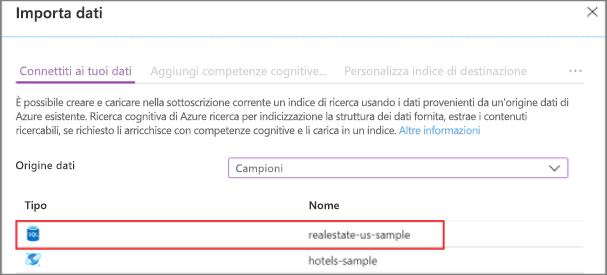
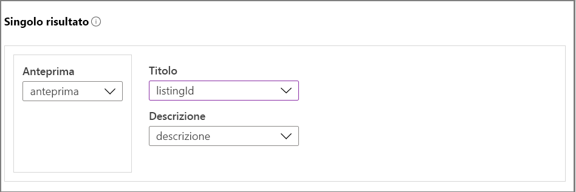
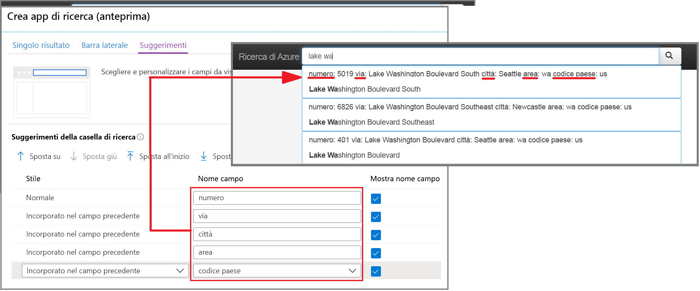
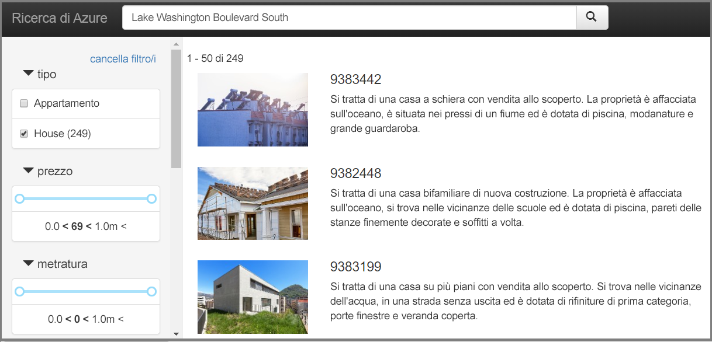

# Avvio rapido: Creare un'app demo nel portale di Azure (Ricerca cognitiva di Azure)

Usare la procedura guidata **Crea app demo** del portale di Azure per generare un'app Web di tipo "localhost" scaricabile che viene eseguita in un browser. A seconda della configurazione, l'app generata è operativa al primo utilizzo, con una connessione dinamica di sola lettura a un indice remoto. Un'app predefinita può includere una barra di ricerca, un'area dei risultati, i filtri della barra laterale e il supporto per il completamento automatico.

L'app demo può essere utile per verificare il funzionamento di un indice in un'app client, ma è consigliabile non usarla per gli scenari di produzione. Le app client devono includere la funzionalità di sicurezza, gestione degli errori e logica di hosting che non vengono fornite dalla pagina HTML generata. Quando si è pronti per creare un'app client, vedere [Creare la prima app di ricerca con .NET SDK](tutorial-csharp-create-first-app.md) per i passaggi successivi.

## Prerequisiti

Per eseguire le procedure descritte è necessario:

+ Un account Azure con una sottoscrizione attiva. [Creare un account gratuitamente](https://azure.microsoft.com/free/).

+ Un'istanza del servizio Ricerca cognitiva di Azure. [Creare un servizio](search-create-service-portal.md) o [trovarne uno esistente](https://ms.portal.azure.com/#blade/HubsExtension/BrowseResourceBlade/resourceType/Microsoft.Search%2FsearchServices) nella sottoscrizione corrente. È possibile usare un servizio gratuito per questo avvio rapido. 

+ [Microsoft Edge (ultima versione)](https://www.microsoft.com/edge) o Google Chrome.

+ Un [indice di ricerca](search-create-index-portal.md) da usare come base per l'applicazione generata. 

  Questo argomento di avvio rapido usa i dati e l'indice predefiniti dell'esempio per il mercato immobiliare perché contiene immagini di anteprima (la procedura guidata supporta l'aggiunta di immagini alla pagina dei risultati). Per creare l'indice usato in questo esercizio, eseguire la procedura guidata **Importa dati**, scegliendo l'origine dati *realestate-us-sample*.

  

Quando l'indice è pronto per l'uso, procedere al passaggio successivo.

## Avviare la procedura guidata

1. Accedere al [portale di Azure](https://portal.azure.com/) con il proprio account Azure.

1. [Trovare il servizio di ricerca](https://ms.portal.azure.com/#blade/HubsExtension/BrowseResourceBlade/resourceType/Microsoft.Storage%2storageAccounts/), quindi nella pagina Panoramica selezionare **Indici** nei collegamenti al centro della pagina. 

1. Scegliere *realestate-us-sample-index* dall'elenco degli indici esistenti.

1. Nella parte superiore della pagina di indice selezionare **Crea app demo (anteprima)** per avviare la procedura guidata.

1. Nella prima pagina della procedura guidata selezionare **Enable Cross Origin Resource Sharing (CORS)** (Abilita CORS (Cross Origin Resource Sharing)) per aggiungere il supporto di CORS alla definizione dell'indice. Questo passaggio è facoltativo, ma l'app Web locale non si connette all'indice remoto senza di esso.

## Configurare i risultati della ricerca

La procedura guidata fornisce un layout di base per i risultati della ricerca con rendering che include uno spazio per un'immagine di anteprima, un titolo e una descrizione. Ognuno di questi elementi è supportato da un campo nell'indice che fornisce i dati. 

1. In Anteprima scegliere il campo *thumbnail* nell'indice *realestate-us-sample*. Questo esempio include le anteprime delle immagini sotto forma di immagini con indirizzo URL archiviate in un campo denominato *thumbnail*. Se l'indice non contiene immagini, lasciare vuoto questo campo.

1. In Titolo scegliere un campo che indichi l'univocità di ogni documento. In questo esempio l'ID presentazione è una scelta appropriata.

1. In Descrizione scegliere un campo che fornisca dettagli che potrebbero aiutare gli utenti a decidere se fare clic su quel particolare documento.

   

## Aggiungere una barra laterale

Il servizio di ricerca supporta l'esplorazione in base a facet, che viene spesso visualizzata come barra laterale. I facet sono basati su campi filtrabili e con facet, espressi nello schema dell'indice.

In Ricerca cognitiva di Azure l'esplorazione in base a facet è un'esperienza di filtro cumulativa. All'interno di una categoria, la selezione di più filtri espande i risultati (ad esempio, selezionando Seattle e Bellevue in Città). Tra le categorie, la selezione di più filtri restringe i risultati.

> [!TIP]
> È possibile visualizzare lo schema dell'intero indice nel portale. Cercare il collegamento **Definizione di indice (JSON)** nella pagina Panoramica di ogni indice. I campi idonei per l'esplorazione in base a facet hanno gli attributi "filterable: true" e "facetable: true".

Accettare la selezione corrente dei facet e passare alla pagina successiva.

## Aggiungere il completamento automatico

La funzionalità di completamento automatico è disponibile sotto forma di completamento automatico e suggerimenti di query. La procedura guidata supporta i suggerimenti di query. In base agli input forniti dall'utente, il servizio di ricerca restituisce un elenco di stringhe di query "completate" che possono essere selezionate come input.

I suggerimenti sono abilitati per definizioni di campo specifiche. La procedura guidata offre le opzioni per configurare la quantità di informazioni da includere in un suggerimento. 

Lo screenshot seguente mostra le opzioni della procedura guidata, affiancate a una pagina con rendering nell'app. È possibile visualizzare il modo in cui vengono usate le selezioni dei campi e il modo in cui viene usato "Mostra nome campo" per includere o escludere l'etichettatura all'interno del suggerimento.

## Creare, scaricare ed eseguire

1. Selezionare **Crea app demo** per generare il file HTML.

1. Quando richiesto, selezionare **Scarica l'app** per scaricare il file.

1. Open the file. Verrà visualizzata una pagina simile a quella raffigurata nello screenshot seguente. Immettere un termine e usare i filtri per restringere i risultati. 

L'indice sottostante è costituito da dati fittizi generati che sono stati duplicati tra i documenti e le descrizioni talvolta non corrispondono all'immagine. Quando si crea un'app in base ai propri indici, è possibile aspettarsi un'esperienza più coerente.

## Pulire le risorse

Quando si lavora nella propria sottoscrizione, alla fine di un progetto è opportuno verificare se le risorse create sono ancora necessarie. L'esecuzione continua delle risorse può avere un costo. È possibile eliminare le singole risorse oppure il gruppo di risorse per eliminare l'intero set di risorse.

Per trovare e gestire le risorse nel portale, usare il collegamento **Tutte le risorse** o **Gruppi di risorse** nel riquadro di spostamento a sinistra.

Se si usa un servizio gratuito, tenere presente che il numero di indicizzatori e origini dati è limitato a tre. Per non superare il limite, è possibile eliminare i singoli elementi nel portale. 

## Passaggi successivi

Sebbene l'app predefinita sia utile per l'esplorazione iniziale e piccole attività, l'esame anticipato delle API consentirà di comprendere i concetti e il flusso di lavoro a un livello più approfondito:

> [!div class="nextstepaction"]
> [Creare un indice tramite .NET SDK](https://docs.microsoft.com/azure/search/search-create-index-dotnet)