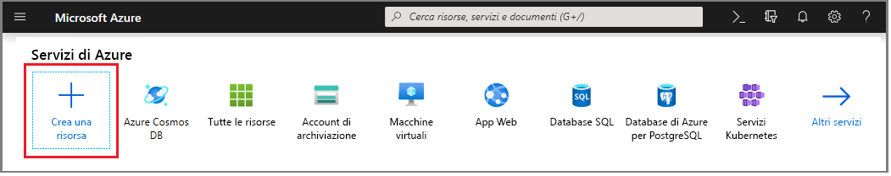
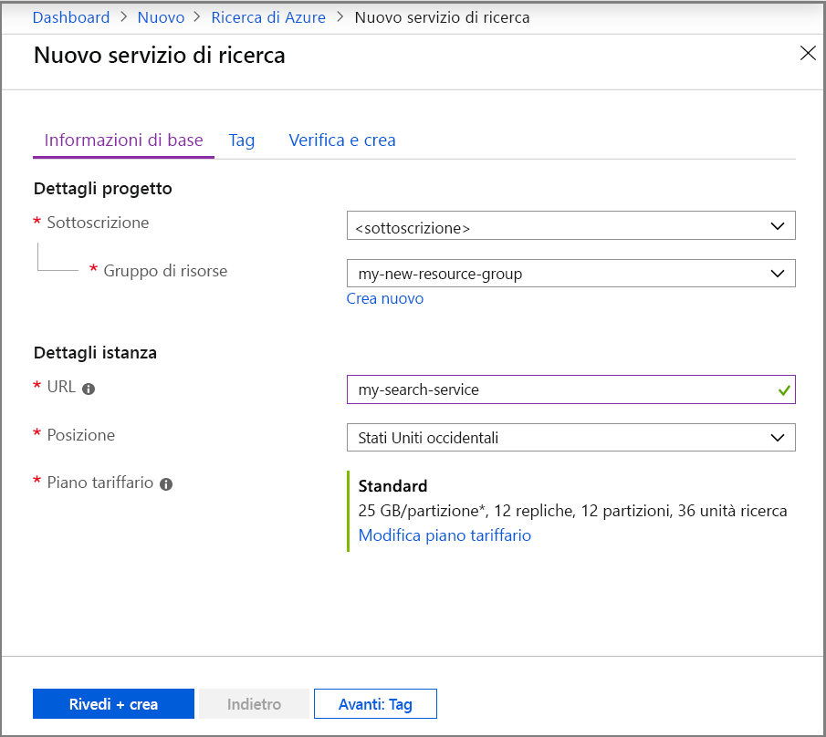
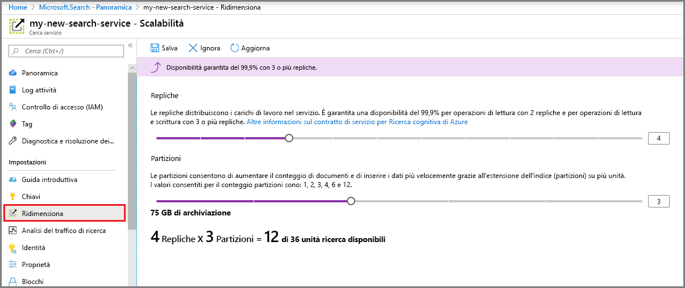

# Creare un servizio di Ricerca di Azure nel portale

Informazioni su come creare o effettuare il provisioning di un servizio Ricerca di Azure nel portale. 

Se si preferisce PowerShell, usare il [modello di servizio](https://azure.microsoft.com/resources/templates/101-azure-search-create/) di Azure Resource Manager. Per informazioni su come iniziare, vedere [Gestire il servizio Ricerca di Azure con PowerShell](search-manage-powershell.md).

## Sottoscrizione gratuita o a pagamento

[Aprire un account Azure gratuito](https://azure.microsoft.com/pricing/free-trial/?WT.mc_id=A261C142F) e usare i crediti per provare i servizi di Azure a pagamento. Dopo avere consumato i crediti, mantenere l'account e continuare a usare i servizi di Azure gratuiti, ad esempio Siti Web. Verranno applicati addebiti alla carta di credito solo se l'utente modifica le impostazioni e richiede esplicitamente l'addebito.

In alternativa, [attivare i benefici della sottoscrizione MSDN](https://azure.microsoft.com/pricing/member-offers/msdn-benefits-details/?WT.mc_id=A261C142F). Con la sottoscrizione MSDN ogni mese si accumulano crediti che è possibile usare per i servizi di Azure a pagamento. 

## Trovare Ricerca di Azure
1. Accedere al [portale di Azure](https://portal.azure.com/).
2. Fare clic sul segno più ("+") nell'angolo superiore sinistro.
3. Selezionare **Web e dispositivi mobili** > **Ricerca di Azure**.

## Assegnare un nome all'endpoint URL e al servizio

Il nome del servizio fa parte dell'endpoint dell'URL in cui vengono eseguite le chiamate API: `https://your-service-name.search.windows.net`. Immettere il nome del servizio nel campo **URL**. 

Requisiti per i nomi di servizio:
   * Deve essere univoco all'interno dello spazio dei nomi search.windows.net
   * lunghezza compresa tra 2 e 60 caratteri
   * È possibile usare lettere minuscole, cifre o trattini ("-")
   * Non può contenere un trattino ("-") nei primi 2 caratteri o nell'ultimo carattere
   * Non deve contenere trattini consecutivi ("--")

## Selezionare una sottoscrizione
Se sono disponibili più sottoscrizioni, sceglierne una che includa anche i servizi di archiviazione file o dati. Ricerca di Azure può rilevare automaticamente archiviazione BLOB e archiviazione tabelle di Azure, il database SQL e Azure Cosmos DB per l'indicizzazione tramite [*indicizzatori*](search-indexer-overview.md), ma solo per i servizi nella stessa sottoscrizione.

## Selezionare un gruppo di risorse
Un gruppo di risorse è una raccolta di servizi e risorse di Azure usati insieme. Se ad esempio si usa Ricerca di Azure per l'indicizzazione di un database SQL, entrambi i servizi devono far parte dello stesso gruppo di risorse.

> [!TIP]
> L'eliminazione di un gruppo di risorse elimina anche i servizi in esso contenuti. Per i progetti prototipo che usano più servizi, l'inserimento di tutti gli elementi nello stesso gruppo di risorse ne semplifica l'eliminazione al termine del progetto. 

## Selezionare un percorso di hosting 
Ricerca di Azure, in qualità di servizio di Azure, può essere ospitato nei data center di tutto il mondo. Tenere presente che i [prezzi possono variare](https://azure.microsoft.com/pricing/details/search/) in funzione dell'area geografica.

## Selezionare un piano tariffario (SKU)
[Ricerca di Azure attualmente è disponibile con vari piani tariffari](https://azure.microsoft.com/pricing/details/search/): Gratuito, Basic o Standard. Ogni piano tariffario prevede una specifica [capacità e limiti](search-limits-quotas-capacity.md). Per indicazioni, vedere [Scegliere uno SKU o un piano tariffario per Ricerca di Azure](search-sku-tier.md) .

In questa procedura dettagliata è stato scelto il piano tariffario Standard per il servizio.

Non è possibile modificare il piano tariffario dopo aver creato il servizio. Se in un secondo momento si vuole passare a un piano tariffario superiore o inferiore, è necessario creare nuovamente il servizio.

## Creare il servizio

Ricordarsi di aggiungere il servizio al dashboard per semplificare l'accesso.

## Ridimensionare il servizio
La creazione di un servizio può richiedere 15 minuti o più, a seconda del livello. Al termine del provisioning del servizio, è possibile ridimensionare il servizio per adattarlo alle proprie esigenze. Poiché è stato scelto il piano tariffario Standard per il servizio Ricerca di Azure, è possibile ridimensionare il servizio in due dimensioni, ovvero partizioni e repliche. Se fosse stato scelto il piano Basic, sarebbe stato possibile aggiungere solo le repliche. Se è stato effettuato il provisioning del servizio Gratuito, la scalabilità non è disponibile.

Le ***partizioni*** consentono di archiviare e di eseguire ricerche in un numero maggiore di documenti nel servizio.

***Repliche*** consentire al servizio gestire un carico superiore di query di ricerca.

> [!Important]
> Un servizio deve disporre di [2 repliche per ogni contratto di servizio di sola lettura e 3 repliche per ogni contratto di servizio di lettura/scrittura](https://azure.microsoft.com/support/legal/sla/search/v1_0/).

1. Passare alla pagina del servizio di ricerca nel portale di Azure.
2. Nel riquadro di navigazione a sinistra selezionare **Impostazioni** > **Scalabilità**.
3. Usare la barra di scorrimento per aggiungere repliche o partizioni.

> [!Note] 
> Ogni livello presenta [limiti](search-limits-quotas-capacity.md) diversi per il numero totale di unità di ricerca consentite in un singolo servizio (repliche * partizioni = unità di ricerca totali).

## Aggiunta di un secondo servizio

La maggior parte dei clienti usa un solo servizio su cui esegue il provisioning a un livello che offre il [giusto bilanciamento delle risorse](search-sku-tier.md). Un servizio può ospitare più indici, soggetto ai [limiti massimi del livello selezionato](search-capacity-planning.md), con ciascun indice isolato dall'altro. In Ricerca di Azure, le richieste possono essere indirizzate solo a un indice, riducendo al minimo la possibilità di recupero di dati accidentali o intenzionali da altri indici nello stesso servizio.

Sebbene la maggior parte dei clienti usi un solo servizio, la ridondanza del servizio potrebbe essere necessaria se i requisiti operativi includono i seguenti elementi:

+ Ripristino di emergenza (interruzione del data center). Ricerca di Azure non offre il failover immediato in caso di interruzione. Per consigli e informazioni aggiuntive, vedere [Amministrazione del servizio](search-manage.md).
+ L'analisi della modellazione multi-tenancy ha determinato che i servizi aggiuntivi siano la progettazione ottimale. Per altre informazioni, vedere [Progettazione per multi-tenancy](search-modeling-multitenant-saas-applications.md).
+ Per le applicazioni distribuite globalmente, è possibile richiedere un'istanza di Ricerca di Azure in più aree per ridurre al minimo la latenza del traffico internazionale dell'applicazione.

> [!NOTE]
> In Ricerca di Azure, non è possibile isolare i carichi di lavoro di indicizzazione ed esecuzione di query, pertanto, non è possibile creare più servizi per i carichi di lavoro isolati. Per un indice viene sempre eseguita una query sul servizio in cui è stato creato (non è possibile creare un indice in un servizio e copiarlo in un altro).
>

Non è necessario un secondo servizio per la disponibilità elevata. La disponibilità elevata per le query si raggiunge quando si usano 2 o più repliche nello stesso servizio. Gli aggiornamenti di replica sono sequenziali, il che significa che almeno uno è operativo quando viene implementato un aggiornamento del servizio. Per altre informazioni sul tempo di attività, vedere i [Contratti di servizio](https://azure.microsoft.com/support/legal/sla/search/v1_0/).

## Passaggi successivi
Dopo il provisioning di un servizio di Ricerca di Azure è possibile [definire un indice](search-what-is-an-index.md) per caricare e cercare i dati. 

> [!div class="nextstepaction"]
> [Come utilizzare Ricerca di Azure in .NET](search-howto-dotnet-sdk.md)
