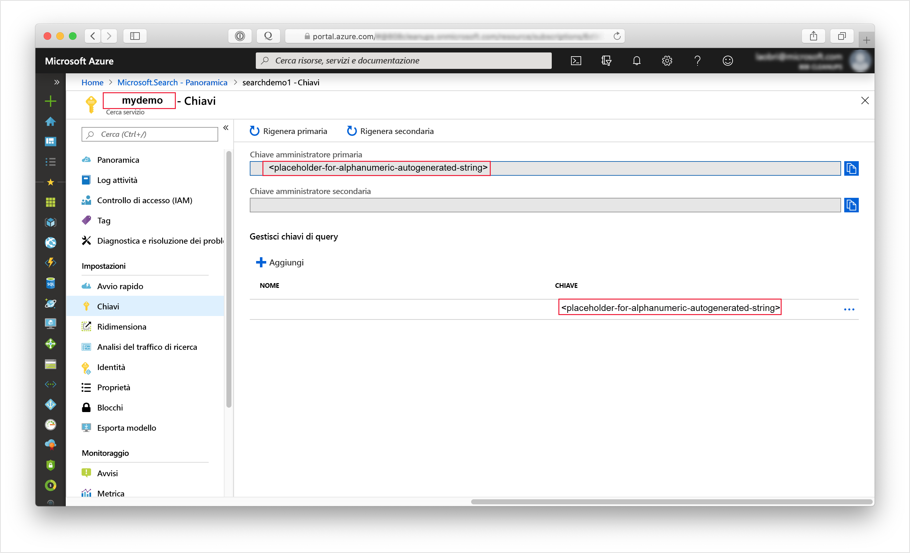

# <a name="quickstart-create-an-azure-search-index-in-nodejs"></a>Guida introduttiva: Creare un indice di Ricerca di Azure in Node.js
> [!div class="op_single_selector"]
> * [JavaScript](search-get-started-nodejs.md)
> * [C#](search-get-started-dotnet.md)
> * [Portale](search-get-started-portal.md)
> * [PowerShell](search-create-index-rest-api.md)
> * [Python](search-get-started-python.md)
> * [Postman](search-get-started-postman.md)

Creare un'applicazione Node.js che crea e carica un indice di Ricerca di Azure ed esegue query su di esso. Questo articolo illustra in modo dettagliato come creare l'applicazione. In alternativa, è possibile [scaricare il codice sorgente e i dati](https://github.com/Azure-Samples/azure-search-javascript-samples/quickstart/) ed eseguire l'applicazione dalla riga di comando.

Se non si ha una sottoscrizione di Azure, creare un [account gratuito](https://azure.microsoft.com/free/?WT.mc_id=A261C142F) prima di iniziare.

## <a name="prerequisites"></a>Prerequisiti

In questa guida di avvio rapido vengono usati i servizi, gli strumenti e i dati seguenti.

+ [Node.js](https://nodejs.org).
+ [NPM](https://www.npmjs.com) deve essere installato da Node.js.
+ In questo articolo o nel [repository](https://github.com/Azure-Samples/azure-search-javascript-samples/quickstart/) sono disponibili una struttura di indice di esempio e i documenti corrispondenti.
+ [Creare un servizio Ricerca di Azure](search-create-service-portal.md) o [trovare un servizio esistente](https://ms.portal.azure.com/#blade/HubsExtension/BrowseResourceBlade/resourceType/Microsoft.Search%2FsearchServices) nella sottoscrizione corrente. È possibile usare un servizio gratuito per questo avvio rapido.

Consigliato:

* [Visual Studio Code](https://code.visualstudio.com).
* Estensioni [Prettier](https://marketplace.visualstudio.com/items?itemName=esbenp.prettier-vscode) ed [ESLint](https://marketplace.visualstudio.com/items?itemName=dbaeumer.vscode-eslint) per Visual Studio Code.

<a name="get-service-info"></a>
## <a name="get-keys-and-urls"></a>Ottenere chiavi e URL

Le chiamate al servizio richiedono un URL endpoint e una chiave di accesso per ogni richiesta. Con entrambi gli elementi viene creato un servizio di ricerca, quindi se si è aggiunto Ricerca di Azure alla sottoscrizione, seguire questi passaggi per ottenere le informazioni necessarie:

1. [Accedere al portale di Azure](https://portal.azure.com/) e ottenere il nome del servizio di ricerca nella relativa pagina **Panoramica**. È possibile verificare il nome del servizio esaminando l'URL dell'endpoint. Se l'URL dell'endpoint fosse `https://mydemo.search.windows.net`, il nome del servizio sarebbe `mydemo`.

2. In **Impostazioni** > **Chiavi** ottenere una chiave amministratore per diritti completi sul servizio. Sono disponibili due chiavi amministratore interscambiabili, fornite per continuità aziendale nel caso in cui sia necessario eseguire il rollover di una di esse. È possibile usare la chiave primaria o secondaria nelle richieste per l'aggiunta, la modifica e l'eliminazione di oggetti.

    Ottenere anche la chiave di query. È consigliabile inviare richieste di query con accesso di sola lettura.



Nell'intestazione di ogni richiesta inviata al servizio è necessario specificare una chiave API (api-key). La presenza di una chiave valida stabilisce una relazione di trust, in base a singole richieste, tra l'applicazione che invia la richiesta e il servizio che la gestisce.

## <a name="set-up-your-environment"></a>Configurazione dell'ambiente

Per iniziare, aprire una console di PowerShell o un altro ambiente in cui è stato installato Node.js.

1. Creare una directory di sviluppo assegnandole il nome `quickstart`:

    ```powershell
    mkdir quickstart
    cd quickstart
    ```

2. Inizializzare un progetto vuoto con NPM eseguendo `npm init`. Accettare i valori predefiniti, ad eccezione della licenza (license), che deve essere impostata su "MIT". 

1. Aggiungere i pacchetti da cui dipenderà il codice per facilitare lo sviluppo:

    ```powershell
    npm install nconf node-fetch
    npm install --save-dev eslint eslint-config-prettier eslint-config-airbnb-base eslint-plugin-import prettier
    ```

4. Verificare di aver configurato i progetti e le relative dipendenze controllando che il file **package.json** sia simile al seguente:

    ```json
    {
      "name": "quickstart",
      "version": "1.0.0",
      "description": "Azure Search Quickstart",
      "main": "index.js",
      "scripts": {
        "test": "echo \"Error: no test specified\" && exit 1"
      },
      "keywords": [
        "Azure",
        "Azure_Search"
      ],
      "author": "Your Name",
      "license": "MIT",
      "dependencies": {
        "nconf": "^0.10.0",
        "node-fetch": "^2.6.0"
      },
      "devDependencies": {
        "eslint": "^6.1.0",
        "eslint-config-airbnb-base": "^13.2.0",
        "eslint-config-prettier": "^6.0.0",
        "eslint-plugin-import": "^2.18.2",
        "prettier": "^1.18.2"
      }
    }
    ```

<a name="configure"></a>

## <a name="1---define-and-create-index"></a>1 - Definire e creare l'indice 

Creare un file **azure_search_config.json** in cui conservare i dati del servizio di ricerca:

    ```json
    {
        "serviceName" : "[SERVICE_NAME]",
        "adminKey" : "[ADMIN_KEY]",
        "queryKey" : "[QUERY_KEY]",
        "indexName" : "hotels-quickstart"
    }
    ```

Sostituire il valore `[SERVICE_NAME]` con il nome del servizio di ricerca. Sostituire `[ADMIN_KEY]` e `[QUERY_KEY]` con i valori di chiavi registrati in precedenza. 

In Ricerca di Azure i documenti sono strutture dei dati che costituiscono sia l'input per l'indicizzazione che l'output restituito dalle query. Gli input dei documenti possono essere righe in un database, BLOB nell'archiviazione BLOB o, come in questo esempio, documenti JSON nel disco. È possibile scaricare [hotels.json](https://github.com/Azure-Samples/azure-search-javascript-samples/quickstart/blob/master/hotels.json) o creare il proprio file **hotels.json** con il contenuto seguente:

    ```json
    {
        "value": [
            {
                "HotelId": "1",
                "HotelName": "Secret Point Motel",
                "Description": "The hotel is ideally located on the main commercial artery of the city in the heart of New York. A few minutes away is Time's Square and the historic centre of the city, as well as other places of interest that make New York one of America's most attractive and cosmopolitan cities.",
                "Description_fr": "L'hôtel est idéalement situé sur la principale artère commerciale de la ville en plein cœur de New York. A quelques minutes se trouve la place du temps et le centre historique de la ville, ainsi que d'autres lieux d'intérêt qui font de New York l'une des villes les plus attractives et cosmopolites de l'Amérique.",
                "Category": "Boutique",
                "Tags": ["pool", "air conditioning", "concierge"],
                "ParkingIncluded": false,
                "LastRenovationDate": "1970-01-18T00:00:00Z",
                "Rating": 3.6,
                "Address": {
                    "StreetAddress": "677 5th Ave",
                    "City": "New York",
                    "StateProvince": "NY",
                    "PostalCode": "10022"
                }
            },
            {
                "HotelId": "2",
                "HotelName": "Twin Dome Motel",
                "Description": "The hotel is situated in a  nineteenth century plaza, which has been expanded and renovated to the highest architectural standards to create a modern, functional and first-class hotel in which art and unique historical elements coexist with the most modern comforts.",
                "Description_fr": "L'hôtel est situé dans une place du XIXe siècle, qui a été agrandie et rénovée aux plus hautes normes architecturales pour créer un hôtel moderne, fonctionnel et de première classe dans lequel l'art et les éléments historiques uniques coexistent avec le confort le plus moderne.",
                "Category": "Boutique",
                "Tags": ["pool", "free wifi", "concierge"],
                "ParkingIncluded": "false",
                "LastRenovationDate": "1979-02-18T00:00:00Z",
                "Rating": 3.6,
                "Address": {
                    "StreetAddress": "140 University Town Center Dr",
                    "City": "Sarasota",
                    "StateProvince": "FL",
                    "PostalCode": "34243"
                }
            },
            {
                "HotelId": "3",
                "HotelName": "Triple Landscape Hotel",
                "Description": "The Hotel stands out for its gastronomic excellence under the management of William Dough, who advises on and oversees all of the Hotel’s restaurant services.",
                "Description_fr": "L'hôtel est situé dans une place du XIXe siècle, qui a été agrandie et rénovée aux plus hautes normes architecturales pour créer un hôtel moderne, fonctionnel et de première classe dans lequel l'art et les éléments historiques uniques coexistent avec le confort le plus moderne.",
                "Category": "Resort and Spa",
                "Tags": ["air conditioning", "bar", "continental breakfast"],
                "ParkingIncluded": "true",
                "LastRenovationDate": "2015-09-20T00:00:00Z",
                "Rating": 4.8,
                "Address": {
                    "StreetAddress": "3393 Peachtree Rd",
                    "City": "Atlanta",
                    "StateProvince": "GA",
                    "PostalCode": "30326"
                }
            },
            {
                "HotelId": "4",
                "HotelName": "Sublime Cliff Hotel",
                "Description": "Sublime Cliff Hotel is located in the heart of the historic center of Sublime in an extremely vibrant and lively area within short walking distance to the sites and landmarks of the city and is surrounded by the extraordinary beauty of churches, buildings, shops and monuments. Sublime Cliff is part of a lovingly restored 1800 palace.",
                "Description_fr": "Le sublime Cliff Hotel est situé au coeur du centre historique de sublime dans un quartier extrêmement animé et vivant, à courte distance de marche des sites et monuments de la ville et est entouré par l'extraordinaire beauté des églises, des bâtiments, des commerces et Monuments. Sublime Cliff fait partie d'un Palace 1800 restauré avec amour.",
                "Category": "Boutique",
                "Tags": ["concierge", "view", "24-hour front desk service"],
                "ParkingIncluded": true,
                "LastRenovationDate": "1960-02-06T00:00:00Z",
                "Rating": 4.6,
                "Address": {
                    "StreetAddress": "7400 San Pedro Ave",
                    "City": "San Antonio",
                    "StateProvince": "TX",
                    "PostalCode": "78216"
                }
            }
        ]
    }
    
    ```

Creare un file **hotels_quickstart_index.json**.  Questo file definisce il funzionamento di Ricerca di Azure con i documenti creati in **hotels.json**. Ogni campo verrà identificato da un elemento `name` e avrà un elemento `type` specifico. Ogni campo dispone anche di una serie di attributi di indice che specificano se Ricerca di Azure può eseguire ricerche, applicare filtri, eseguire l'ordinamento e applicare facet nel campo. Quasi tutti i campi sono tipi di dati semplici, ma alcuni come `AddressType` sono tipi complessi che consentono di creare strutture di dati avanzate nell'indice.  È possibile leggere altre informazioni sui [tipi di dati supportati](https://docs.microsoft.com/rest/api/searchservice/supported-data-types) e sugli [attributi degli indici](https://docs.microsoft.com/azure/search/search-what-is-an-index#index-attributes). 

Aggiungere il codice seguente a **hotels_quickstart_index.json** oppure [scaricare il file](https://github.com/Azure-Samples/azure-search-javascript-samples/quickstart/blob/master/hotels_quickstart_index.json). 

    ```json
    {
        "name": "hotels-quickstart",
        "fields": [
            {
                "name": "HotelId",
                "type": "Edm.String",
                "key": true,
                "filterable": true
            },
            {
                "name": "HotelName",
                "type": "Edm.String",
                "searchable": true,
                "filterable": false,
                "sortable": true,
                "facetable": false
            },
            {
                "name": "Description",
                "type": "Edm.String",
                "searchable": true,
                "filterable": false,
                "sortable": false,
                "facetable": false,
                "analyzer": "en.lucene"
            },
            {
                "name": "Description_fr",
                "type": "Edm.String",
                "searchable": true,
                "filterable": false,
                "sortable": false,
                "facetable": false,
                "analyzer": "fr.lucene"
            },
            {
                "name": "Category",
                "type": "Edm.String",
                "searchable": true,
                "filterable": true,
                "sortable": true,
                "facetable": true
            },
            {
                "name": "Tags",
                "type": "Collection(Edm.String)",
                "searchable": true,
                "filterable": true,
                "sortable": false,
                "facetable": true
            },
            {
                "name": "ParkingIncluded",
                "type": "Edm.Boolean",
                "filterable": true,
                "sortable": true,
                "facetable": true
            },
            {
                "name": "LastRenovationDate",
                "type": "Edm.DateTimeOffset",
                "filterable": true,
                "sortable": true,
                "facetable": true
            },
            {
                "name": "Rating",
                "type": "Edm.Double",
                "filterable": true,
                "sortable": true,
                "facetable": true
            },
            {
                "name": "Address",
                "type": "Edm.ComplexType",
                "fields": [
                    {
                        "name": "StreetAddress",
                        "type": "Edm.String",
                        "filterable": false,
                        "sortable": false,
                        "facetable": false,
                        "searchable": true
                    },
                    {
                        "name": "City",
                        "type": "Edm.String",
                        "searchable": true,
                        "filterable": true,
                        "sortable": true,
                        "facetable": true
                    },
                    {
                        "name": "StateProvince",
                        "type": "Edm.String",
                        "searchable": true,
                        "filterable": true,
                        "sortable": true,
                        "facetable": true
                    },
                    {
                        "name": "PostalCode",
                        "type": "Edm.String",
                        "searchable": true,
                        "filterable": true,
                        "sortable": true,
                        "facetable": true
                    },
                    {
                        "name": "Country",
                        "type": "Edm.String",
                        "searchable": true,
                        "filterable": true,
                        "sortable": true,
                        "facetable": true
                    }
                ]
            }
        ],
        "suggesters": [
            {
                "name": "sg",
                "searchMode": "analyzingInfixMatching",
                "sourceFields": [
                    "HotelName"
                ]
            }
        ]
    }
    ```
    
## <a name="2---a-class-for-azure-search"></a>2 - Classe per Ricerca di Azure 

È consigliabile separare gli elementi specifici di un particolare scenario dal codice che potrà essere applicato su larga scala. La classe `AzureSearchClient` definita nel file **AzureSearchClient.js** saprà come costruire gli URL di richiesta, effettuare una richiesta usando l'API fetch e reagire al codice di stato della risposta.

Iniziare a usare **AzureSearchClient.js** importando il pacchetto **node-fetch** e creando una classe semplice. Isolare le parti modificabili della classe `AzureSearchClient` passando al relativo costruttore i vari valori di configurazione:

    ```javascript
    const fetch = require('node-fetch');
    
    class AzureSearchClient {
      constructor(searchServiceName, adminKey, queryKey, indexName) {
          this.searchServiceName = searchServiceName;
          this.adminKey = adminKey;
          // The query key is used for read-only requests and so can be distributed with less risk of abuse.
          this.queryKey = queryKey;
          this.indexName = indexName;
          this.apiVersion = '2019-05-06';
      }
    
      // All methods go inside class body here!
    }
    
    module.exports = AzureSearchClient;
    ```

Il primo compito della classe consiste nel sapere come costruire gli URL a cui inviare le varie richieste. Creare questi URL con metodi di istanza che usano i dati di configurazione passati al costruttore della classe. Si noti che l'URL che viene costruito è specifico di una versione API e deve avere un argomento che specifichi tale versione (in questa applicazione `2019-05-06`). 

Aggiungere i metodi seguenti nel corpo della classe:

    ```javascript
      getIndexUrl() { return `https://${this.searchServiceName}.search.windows.net/indexes/${this.indexName}?api-version=${this.apiVersion}`; }
      
      getPostDataUrl() { return `https://${this.searchServiceName}.search.windows.net/indexes/${this.indexName}/docs/index?api-version=${this.apiVersion}`;  }
    
      getSearchUrl(searchTerm) { return `https://${this.searchServiceName}.search.windows.net/indexes/${this.indexName}/docs?api-version=${this.apiVersion}&search=${searchTerm}&searchMode=all`; }
    ```

Il compito successivo consiste nel creare una richiesta asincrona con l'API fetch. Il metodo statico asincrono `request` accetta un URL, una stringa che specifica il metodo HTTP ("GET", "PUT", "POST", "DELETE"), la chiave da usare nella richiesta e un oggetto JSON facoltativo. La variabile `headers` esegue il mapping tra `queryKey` (chiave amministratore o chiave di query di sola lettura) e l'intestazione della richiesta HTTP "api-key". Le opzioni di richiesta contengono sempre l'elemento `method` da usare e `headers`. Se `bodyJson` non è `null`, il corpo della richiesta HTTP viene impostato sulla rappresentazione di stringa di `bodyJson`. L'elemento `request` restituisce la promessa (Promise) dell'API fetch di eseguire la richiesta HTTP.

    ```javascript
      static async request(url, method, apiKey, bodyJson = null) {
        // Uncomment the following for request details:
        /*
        console.log(`\n${method} ${url}`);
        console.log(`\n${apiKey}`);
        if (bodyJson !== null) {
            console.log(`\ncontent: ${JSON.stringify(bodyJson, null, 4)}`);
        }
        */
      
        const headers = {
            'content-type' : 'application/json',
            'api-key' : apiKey
        };
        const init = bodyJson === null ?
            { 
                method, 
                headers
            }
            : 
            {
                method, 
                headers,
                body : JSON.stringify(bodyJson)
            };
        return fetch(url, init);
      }
    ```

A scopo dimostrativo, verrà generata un'eccezione solo se la richiesta HTTP ha esito negativo. In un'applicazione reale è probabile che vengano eseguite alcune operazioni di registrazione e diagnosi del codice di stato HTTP nell'elemento `response` a partire dalla richiesta del servizio di ricerca. 
    
    ```javascript
      static throwOnHttpError(response) {
        const statusCode = response.status;
        if (statusCode >= 300){
            console.log(`Request failed: ${JSON.stringify(response, null, 4)}`);
            throw new Error(`Failure in request. HTTP Status was ${statusCode}`);
        }
      }
    ```

Aggiungere infine i metodi che funzionano con l'indice di Ricerca di Azure. Questi metodi hanno tutti la stessa struttura:

* Ottenere l'endpoint a cui verrà effettuata la richiesta.
* Generare la richiesta con l'endpoint, il verbo HTTP, la chiave API e il corpo appropriati. `queryAsync()` usa la chiave di query, in caso contrario viene usata la chiave amministratore.
* Attendere (`await`) la risposta alla richiesta.  
* Agire sul codice di stato della risposta.
* Restituire una promessa (Promise) di un valore appropriato (un valore booleano, `this` o i risultati della query). 

    ```javascript
      async indexExistsAsync() { 
          console.log("\n Checking if index exists...");
          const endpoint = this.getIndexUrl();
          const response = await AzureSearchClient.request(endpoint, "GET", this.queryKey);
          // Success has a few likely status codes: 200 or 204 (No Content), but accept all in 200 range...
          const exists = response.status >= 200 && response.status < 300;
          return exists;
      }
      
      async deleteIndexAsync() {
          console.log("\n Deleting existing index...");
          const endpoint = this.getIndexUrl();
          const response = await AzureSearchClient.request(endpoint, "DELETE", this.adminKey);
          AzureSearchClient.throwOnHttpError(response);
          return this;
      }
      
      async createIndexAsync(definition) {
          console.log("\n Creating index...");
          const endpoint = this.getIndexUrl();
          const response = await AzureSearchClient.request(endpoint, "PUT", this.adminKey, definition);
          AzureSearchClient.throwOnHttpError(response);
          return this;
      }
      
      async postDataAsync(hotelsData) {
          console.log("\n Adding hotel data...");
          const endpoint = this.getPostDataUrl();
          const response = await AzureSearchClient.request(endpoint,"POST", this.adminKey, hotelsData);
          AzureSearchClient.throwOnHttpError(response);
          return this;
      }
      
      async queryAsync(searchTerm) {
          console.log("\n Querying...")
          const endpoint = this.getSearchUrl(searchTerm);
          const response = await AzureSearchClient.request(endpoint, "GET", this.queryKey);
          AzureSearchClient.throwOnHttpError(response);
          return response;
      }
    ```

Verificare che i metodi si trovino all'interno della classe e che si stia esportando la classe. L'ambito più esterno **di AzureSearchClient.js** dovrebbe essere:

    ```javascript
    const fetch = require('node-fetch');
    
    class AzureSearchClient {
        // ... code here ...
    }
    
    module.exports = AzureSearchClient;
    ```

## <a name="3---create-a-program"></a>3 - Creare un programma

Una classe orientata a oggetti è stata una scelta ottimale per il modulo **AzureSearchClient.js** potenzialmente riutilizzabile, ma non è necessaria per il programma principale, che verrà inserito in un file denominato**index.js**. 

Creare **index.js** e iniziare inserendo:

* Il pacchetto **nconf**, che offre la flessibilità necessaria per specificare la configurazione con JSON, le variabili di ambiente o gli argomenti della riga di comando.
* I dati del file **hotels.json**.
* I dati del file **hotels_quickstart_index.json**.
* Il modulo `AzureSearchClient`

    ```javascript
    const nconf = require('nconf');
    
    const hotelData = require('./hotels.json');
    const indexDefinition = require('./hotels_quickstart_index.json');
    const AzureSearchClient = require('./AzureSearchClient.js');
    ```

Aggiungere ora alcune query di base: 

    ```javascript
    const queries = [
      "*&$count=true",
      "historic&$filter=Rating gt 4&"
    ];
    ```

La prima query restituirà tutti i dati (`*`) e un conteggio del numero di record restituiti. La seconda restituirà solo i documenti che contengono la parola "historic" in uno dei campi definiti come "searchable" in **hotels_quickstart_index.json** e il cui campo `Rating` contiene un valore maggiore di 4. Sono disponibili altre informazioni su [come comporre una query in Ricerca di Azure](https://docs.microsoft.com/azure/search/search-query-overview). 

Il [pacchetto **nconf**](https://github.com/indexzero/nconf) consente di specificare i dati di configurazione in un'ampia gamma di formati, ad esempio le variabili di ambiente o la riga di comando. Il pacchetto **nconf** verrà usato in modo semplice per leggere il file **azure_search_config.json** e restituire il contenuto del file come dizionario. Usando la funzione `get(key)` di **nconf**, è possibile controllare rapidamente che il passaggio di [configurazione delle informazioni del servizio Ricerca di Azure](#configure) non sia stato ignorato. Infine, viene restituita la configurazione:

    ```javascript
    function getAzureConfiguration() {
      const config = nconf.file({ file: 'azure_search_config.json' });
      if (config.get('serviceName') === '[SEARCH_SERVICE_NAME' ) {
        throw new Error("You have not set the values in your azure_search_config.json file. Change them to match your search service's values.");
      }
      return config;
    }
    ```

La funzione `sleep` crea una promessa (`Promise`) che si risolve dopo un periodo di tempo specificato. L'uso di questa funzione consente la sospensione dell'app mentre si attende che le operazioni di indice asincrone vengano completate e diventino disponibili. L'aggiunta di questo ritardo è in genere necessaria solo in demo, test e applicazioni di esempio.

    ```javascript
    function sleep(ms)
    {
      return(
          new Promise(function(resolve, reject)
          {
              setTimeout(function() { resolve(); }, ms);
          })
      );
    }
    ```

La funzione `doQueries()` accetta un oggetto `AzureSearchClient` e applica il metodo `AzureSearchClient.queryAsync` a ognuno dei valori nella matrice `queries`. Usa la funzione `Promise.all()` per restituire una singola promessa (`Promise`) che si risolve solo dopo che si sono risolte tutte le query. La chiamata a `JSON.stringify(body, null, 4)` formatta il risultato delle query in modo che sia più leggibile.

    ```javascript
    async function doQueriesAsync(client) {
      return Promise.all(
          queries.map( async query => {
              const result = await client.queryAsync(query);
              const body = await result.json();
              const str = JSON.stringify( body, null, 4);
              console.log(`Query: ${query} \n ${str}`);
          })
      );
    }
    ```

Infine, specificare e chiamare la funzione `run` asincrona principale. Questa funzione chiama le altre funzioni nell'ordine, attendendo di risolvere le promesse (`Promise`) in base alle necessità.

* Recuperare la configurazione con la funzione `getAzureConfiguration()` scritta in precedenza
* Creare una nuova istanza di `AzureSearchClient`, passando i valori dalla configurazione
* Controllare se l'indice esiste e, in caso affermativo, eliminarlo
* Creare un indice usando l'elemento `indexDefinition` caricato da **hotels_quickstart_index.json**
* Aggiungere i documenti sugli hotel caricati da **hotels.json**
* Eseguire query nell'indice di Ricerca di Azure usando il metodo `doQueriesAsync()` che è stato scritto

    ```javascript
    const run = async () => {
      try {
        const cfg = getAzureConfiguration();
        const client = new AzureSearchClient(cfg.get("serviceName"), cfg.get("adminKey"), cfg.get("queryKey"), cfg.get["serviceName"]);
        
        const exists = await client.indexExistsAsync();
        await exists ? client.deleteIndexAsync() : Promise.resolve();
        // Deleting index can take a few seconds
        await sleep(2000);
        const indexDefinition = require('./hotels_quickstart_index.json');
        await client.createIndexAsync(indexDefinition);
        // Index availability can take a few seconds
        await sleep(2000);
        await client.postDataAsync(hotelData);
        // Data availability can take a few seconds
        await sleep(5000);
        await doQueries(client);
      } catch (x) {
        console.log(x);
      }
    }
    
    run();
    ```

Ricordarsi della chiamata finale a `run()` poiché si tratta del punto di ingresso nel programma quando si esegue `node index.js` nel passaggio successivo.

### <a name="prepare-and-run-the-sample"></a>Preparare ed eseguire l'esempio

Usare una finestra del terminale per i comandi seguenti.

1. Passare alla cartella che contiene il file **package.json** e il resto del codice.
1. Installare i pacchetti dell'esempio con `npm install`.  Questo comando consente di scaricare i pacchetti da cui dipende il codice.
1. Eseguire il programma con `node index.js`.

Verrà visualizzata una serie di messaggi che descrivono le azioni eseguite dal programma e che terminano con i risultati di alcune query. Per visualizzare altri dettagli delle richieste, è possibile rimuovere il commento dalle righe [20-26](https://github.com/Azure-Samples/azure-search-javascript-samples/quickstart/blob/master/AzureSearchClient.js#LL20-LL26) del file **AzureSearchClient.js**. 

### <a name="about-the-sample"></a>Informazioni sull'esempio

Nell'esempio viene usata una piccola quantità di dati degli hotel, sufficiente per illustrare le nozioni di base per la creazione di un indice di Ricerca di Azure e l'esecuzione di query su di esso.

La classe **AzureSearchClient** incapsula la configurazione, gli URL e le richieste HTTP di base per il servizio di ricerca. Il file **index.js** carica i dati di configurazione per il servizio Ricerca di Azure e i dati degli hotel che verranno caricati per l'indicizzazione. Nella funzione `run` inoltre ordina ed esegue le varie operazioni.

Il comportamento generale della funzione `run` consiste nell'eliminare l'indice di Ricerca di Azure, se esistente, creare l'indice, aggiungere alcuni dati ed eseguire alcune query.  

## <a name="clean-up"></a>Eseguire la pulizia 

Quando si lavora nella propria sottoscrizione, alla fine di un progetto è opportuno verificare se le risorse create sono ancora necessarie. L'esecuzione continua delle risorse può avere un costo. È possibile eliminare le singole risorse oppure il gruppo di risorse per eliminare l'intero set di risorse.

Per trovare e gestire le risorse nel portale, usare il collegamento **Tutte le risorse** o **Gruppi di risorse** nel riquadro di spostamento a sinistra.
Se si usa un servizio gratuito, tenere presente che il numero di indicizzatori e origini dati è limitato a tre. Per non superare il limite, è possibile eliminare i singoli elementi nel portale. 

## <a name="next-steps"></a>Passaggi successivi

In questo argomento di avvio rapido per Node.js sono state eseguite le attività necessarie per creare un indice, caricarvi documenti ed eseguire query. Sono stati eseguiti alcuni passaggi, ad esempio la lettura della configurazione e la definizione delle query, nel modo più semplice possibile. In un'applicazione reale è opportuno inserire questi elementi in moduli distinti per garantire flessibilità e incapsulamento. 
 
Se si dispone già delle nozioni di base di Ricerca di Azure, è possibile usare questo esempio come base di prova per i suggerimenti di alternative (query di suggerimento per la digitazione e completamento automatico), filtri ed esplorazione basata su facet. Se non si ha familiarità con Ricerca di Azure, è consigliabile provare altre esercitazioni per acquisire consapevolezza di ciò che è possibile creare. Visitare la [pagina della documentazione](https://azure.microsoft.com/documentation/services/search/) per trovare ulteriori risorse. 

> [!div class="nextstepaction"]
> [Chiamare Ricerca di Azure da una pagina Web usando JavaScript](https://github.com/liamca/azure-search-javascript-samples)
