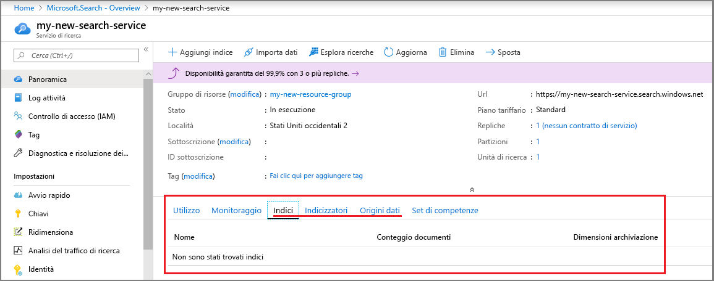
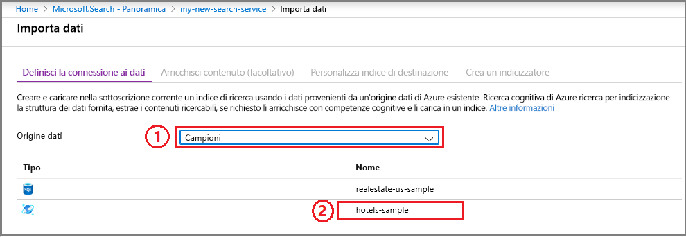
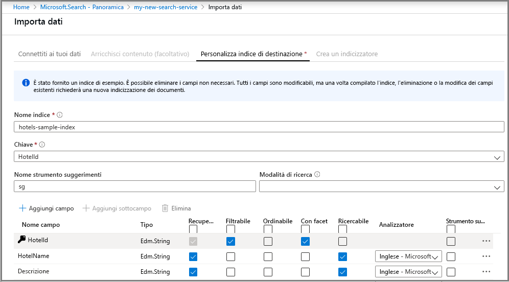
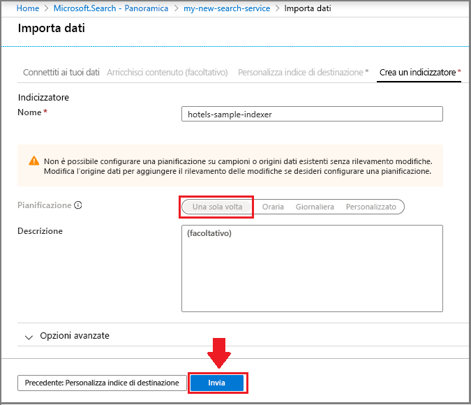
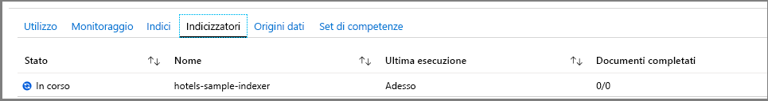
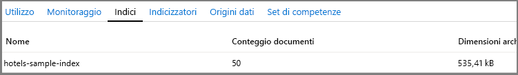
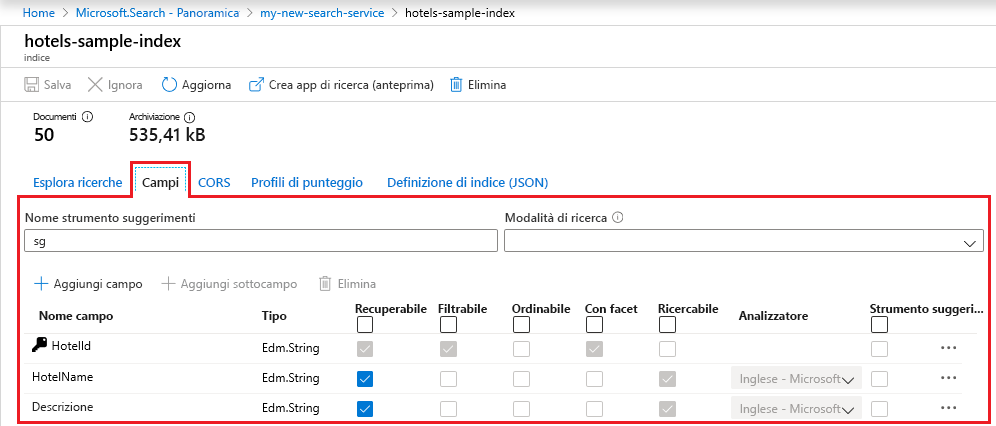
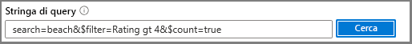

# Guida introduttiva: Creare un indice di Ricerca di Azure nel portale di Azure
> [!div class="op_single_selector"]
> * [Portale](search-get-started-portal.md)
> * [PowerShell](search-get-started-powershell.md)
> * [Postman](search-get-started-postman.md)
> * [Python](search-get-started-python.md)
> * [C#](search-get-started-dotnet.md)

Per approfondire rapidamente i concetti relativi a Ricerca di Azure, provare gli strumenti predefiniti nel portale di Azure. Procedure guidate ed editor non offrono esattamente le stesse funzionalità di .NET e delle API REST, ma è possibile iniziare rapidamente con un'introduzione senza codice, scrivendo query interessanti per i dati di esempio in pochi minuti.

> [!div class="checklist"]
> * Iniziare con un set di dati di esempio pubblico gratuito ospitato in Azure
> * Eseguire la procedura guidata **Importa dati** in Ricerca di Azure per caricare i dati e generare un indice
> * Monitorare l'avanzamento dell'indicizzazione nel portale
> * Visualizzare un indice esistente e le opzioni per modificarlo
> * Esplorare la ricerca full-text, i filtri, i facet, la ricerca fuzzy e la ricerca geografica con **Esplora ricerche**

Se gli strumenti sono troppo vincolanti, è possibile vedere un'[introduzione basata su codice alla programmazione di Ricerca di Azure in .NET](search-howto-dotnet-sdk.md) oppure usare [Postman per effettuare chiamate API REST](search-get-started-postman.md). È anche possibile guardare una dimostrazione della durata di sei minuti dei passaggi illustrati in questa esercitazione, partendo circa dal terzo minuto di questa [panoramica video su Ricerca di Azure](https://channel9.msdn.com/Events/Connect/2016/138).

Se non si ha una sottoscrizione di Azure, creare un [account gratuito](https://azure.microsoft.com/free/?WT.mc_id=A261C142F) prima di iniziare. 

## Prerequisiti

[Creare un servizio Ricerca di Azure](search-create-service-portal.md) o [trovare un servizio esistente](https://ms.portal.azure.com/#blade/HubsExtension/BrowseResourceBlade/resourceType/Microsoft.Search%2FsearchServices) nella sottoscrizione corrente. È possibile usare un servizio gratuito per questo avvio rapido. 

### Verificare lo spazio

Molti clienti iniziano con il servizio gratuito. Questa versione è limitata a tre indici, tre origini dati e tre gli indicizzatori. Assicurarsi di avere spazio per gli elementi aggiuntivi prima di iniziare, perché ne verrà creato uno per ogni oggetto.

Sezioni del dashboard del servizio mostrano il numero di indici, indicizzatori e origini dati già disponibili. 

##  Creare un indice e caricare i dati

Le query di ricerca eseguono iterazioni su un [*indice*](search-what-is-an-index.md) contenente dati ricercabili, metadati e costrutti aggiuntivi usati per l'ottimizzazione di determinati comportamenti di ricerca.

Ai fini di questa esercitazione, viene usato un set di dati di esempio predefinito su cui è possibile eseguire una ricerca per indicizzazione con un [*indicizzatore*](search-indexer-overview.md) tramite la procedura guidata **Importa dati**. Un indicizzatore è un crawler specifico dell'origine in grado di leggere i metadati e il contenuto da origini dati di Azure supportate. Gli indicizzatori in genere vengono usati a livello di codice, ma nel portale è possibile accedervi tramite la procedura guidata **Importa dati**. 

### Passaggio 1: Avviare la procedura guidata Importa dati e creare un'origine dati

1. Nel dashboard del servizio Ricerca di Azure fare clic su **Importa dati** sulla barra dei comandi per creare e popolare un indice di ricerca.

   

2. Nella procedura guidata fare clic su **Definisci la connessione ai dati** > **Esempi** > **hotels-sample**. Questa origine dati è predefinita. Se si crea un'origine dati personalizzata, è necessario specificare un nome, un tipo e le informazioni di connessione. Dopo la creazione, diventa una "origine dati esistente" che può essere riutilizzata in altre operazioni di importazione.

   

3. Passare alla pagina successiva.

   

### Passaggio 2: Ignorare le competenze cognitive

La procedura guidata supporta la creazione di una [pipeline di competenze cognitive](cognitive-search-concept-intro.md) per incorporare nell'indicizzazione gli algoritmi di intelligenza artificiale di Servizi cognitivi. 

Questo passaggio per il momento verrà ignorato e si passerà direttamente a **Personalizza indice di destinazione**.

   

> [!TIP]
> È possibile esaminare un esempio di indicizzazione basata su intelligenza artificiale in una [guida di avvio rapido](cognitive-search-quickstart-blob.md) o in un'[esercitazione](cognitive-search-tutorial-blob.md).

### Passaggio 3: Configurare l'indice

La creazione dell'indice è in genere un esercizio basato sul codice, completato prima del caricamento dei dati. Come suggerisce questa esercitazione, tuttavia, la procedura guidata può generare un indice di base per qualsiasi origine dati su cui è possibile eseguire ricerche per indicizzazione. Come minimo, un indice richiede un nome e una raccolta di campi, con un campo contrassegnato come chiave del documento per identificare in modo univoco ogni documento. È anche possibile specificare gli analizzatori di linguaggi o gli strumenti suggerimenti per completare automaticamente o suggerire le query.

I campi hanno tipi di dati e attributi. Le caselle di controllo nella parte superiore sono *attributi dell'indice* che controllano il modo in cui viene usato il campo.

* **Recuperabile** indica che viene visualizzato nell'elenco dei risultati della ricerca. Deselezionando questa casella di controllo è possibile contrassegnare i singoli campi perché siano esclusi dai risultati della ricerca, ad esempio per campi usati solo nelle espressioni di filtro.
* La **chiave** è l'identificatore univoco del documento. È sempre una stringa ed è obbligatoria.
* **Filtrabile**, **Ordinabile** e **Con facet** determinano se i campi sono usati in un filtro, un ordinamento o una struttura di esplorazione in base a facet.
* **Ricercabile** indica che un campo è incluso nella ricerca full-text. Le stringhe sono ricercabili. I campi numerici e i campi booleani sono spesso contrassegnati come non ricercabili.

I requisiti di archiviazione non cambiano a seconda della selezione. Se ad esempio si imposta l'attributo **Recuperabile** per più campi, i requisiti di archiviazione non aumentano.

Per impostazione predefinita, la procedura guidata analizza l'origine dati alla ricerca di identificatori univoci come base per il campo chiave. Le *stringhe* possono essere **recuperabili** e **ricercabili**. I *numeri interi* possono essere **recuperabili**, **filtrabili**, **ordinabili** e **con facet**.

1. Accettare i valori predefiniti. 

   Se si esegue la procedura guidata una seconda volta usando un'origine dati hotels esistente, l'indice non verrà configurato con attributi predefiniti. Sarà necessario selezionare manualmente gli attributi sulle importazioni future. 

   

2. Passare alla pagina successiva.

   

### Passaggio 4: Configurare l'indicizzatore

Sempre nella procedura guidata **Importa dati** fare clic su **Indicizzatore** > **Nome** e quindi digitare un nome per l'indicizzatore.

Questo oggetto definisce un processo eseguibile. È possibile inserirlo nella pianificazione ricorrente. Per il momento, tuttavia, usare l'opzione predefinita per eseguire l'indicizzatore una volta, immediatamente.

Fare clic su **Invia** per creare e contemporaneamente eseguire l'indicizzatore.

  

## Monitorare lo stato

La procedura guidata dovrebbe consentire di visualizzare l'elenco Indicizzatori in cui è possibile monitorarne lo stato. In caso contrario, passare alla pagina Panoramica e fare clic su **Indicizzatori**.

L'aggiornamento della pagina nel portale può richiedere alcuni minuti, ma l'indicizzatore appena creato verrà visualizzato nell'elenco con lo stato "in corso" oppure "operazione riuscita", insieme al numero di documenti indicizzati.

   

## Visualizzare l'indice

La pagina principale del servizio include i collegamenti alle risorse create nel servizio Ricerca di Azure.  Per visualizzare l'indice appena creato, fare clic su **Indici** nell'elenco di collegamenti. 

   

In questo elenco è possibile fare clic sull'indice *hotels-sample* appena creato, visualizzare il relativo schema e facoltativamente aggiungere nuovi campi. 

La scheda **Campi** visualizza lo schema dell'indice. Scorrere alla fine dell'elenco per immettere un nuovo campo. Nella maggior parte dei casi, non è possibile cambiare i campi esistenti. I campi esistenti hanno una rappresentazione fisica in Ricerca di Azure e pertanto non sono modificabili, nemmeno nel codice. Per modificare in modo sostanziale un campo esistente, creare un nuovo indice, eliminando l'originale.

   

Altri costrutti, ad esempio i profili di punteggio e le opzioni CORS, possono essere aggiunti in qualsiasi momento.

Per capire chiaramente cosa è possibile o meno modificare durante la progettazione di indici, prendersi un po' di tempo per controllare le opzioni di definizione dell'indice. Le opzioni di grigio indicano che un valore non può essere modificato o eliminato. 

##  Eseguire query usando Esplora ricerche

A questo punto dovrebbe essere disponibile un indice di ricerca pronto per le query tramite la pagina predefinita per le query [**Esplora ricerche**](search-explorer.md). In questa pagina è disponibile una casella di ricerca che consente di testare stringhe di query arbitrarie.

**Esplora ricerche** consente di gestire solo le [richieste dell'API REST](https://docs.microsoft.com/rest/api/searchservice/search-documents), ma accetta sia la [sintassi di query semplice](https://docs.microsoft.com/rest/api/searchservice/simple-query-syntax-in-azure-search) che la sintassi [completa del parser di query Lucene](https://docs.microsoft.com/rest/api/searchservice/lucene-query-syntax-in-azure-search), oltre a tutti i parametri di ricerca disponibili nelle [operazioni di ricerca nei documenti dell'API REST](https://docs.microsoft.com/rest/api/searchservice/search-documents#bkmk_examples).

> [!TIP]
> I passaggi seguenti vengono presentati al minuto 6.08 del [video della panoramica di Ricerca di Azure](https://channel9.msdn.com/Events/Connect/2016/138).
>

1. Fare clic su **Esplora ricerche** nella barra dei comandi.

   

2. Nell'elenco a discesa **Indice** selezionare *hotels-sample*. Fare clic sull'elenco a discesa **Versione API** per visualizzare le API REST disponibili. Per le query seguenti, usare la versione disponibile a livello generale (2019-05-06).

   

3. Nella barra di ricerca incollare le stringhe di query seguenti e fare clic su **Cerca**.

   

## Query di esempio

È possibile immettere termini e frasi, come si farebbe in una ricerca in Bing o Google, oppure espressioni di query complete. I risultati vengono restituiti come documenti JSON dettagliati.

### Query semplice con i primi N risultati

#### Esempio (stringa di query): `search=spa`

* Il parametro **search** permette di inserire una ricerca per parole chiave per la ricerca full-text. In questo caso la ricerca restituisce i dati relativi agli alberghi contenenti il termine *spa* in qualsiasi campo ricercabile del documento.

* **Esplora ricerche** restituisce i risultati in JSON, un formato dettagliato e difficile da leggere se i documenti hanno una struttura densa. Si tratta di una scelta intenzionale. La visibilità sull'intero documento è importante per finalità di sviluppo, in particolare durante i test. Per migliorare l'esperienza utente, è necessario scrivere codice che [gestisce i risultati della ricerca](search-pagination-page-layout.md) per mettere in evidenza gli elementi importanti.

* I documenti sono costituiti da tutti i campi contrassegnati come recuperabili nell'indice. Per visualizzare gli attributi dell'indice nel portale, fare clic su *hotels-sample* nell'elenco **Indici**.

#### Esempio (query con parametri): `search=spa&$count=true&$top=10`

* Il simbolo **&** permette di aggiungere parametri di ricerca, che possono essere specificati in qualsiasi ordine.

* Il parametro **$count=true** restituisce il conteggio totale dei documenti trovati. Questo valore viene visualizzato nella parte superiore dei risultati della ricerca. È possibile verificare le query filtro monitorando le modifiche segnalate da **$count=true**. La riduzione dei risultati indica che il filtro funziona.

* **$top=10** restituisce i 10 documenti con classificazione più alta nel totale. Per impostazione predefinita, Ricerca di Azure restituisce le 50 migliori corrispondenze. Per aumentare o diminuire la quantità è possibile usare **$top**.

###  Filtrare la query

Quando si aggiunge il parametro **$filter**, vengono inclusi filtri nelle richieste di ricerca. 

#### Esempio (con filtri): `search=beach&$filter=Rating gt 4`

* Il parametro **$filter** restituisce risultati corrispondenti ai criteri immessi. In questo caso, restituisce le valutazioni maggiori di 4.

* La sintassi del filtro è una costruzione OData. Per altre informazioni, vedere l'articolo relativo alla [sintassi OData per i filtri](https://docs.microsoft.com/rest/api/searchservice/odata-expression-syntax-for-azure-search).

###  Applicare un facet alla query

Nelle richieste di ricerca vengono inclusi filtri facet. È possibile usare il parametro facet per restituire un conteggio aggregato dei documenti che corrispondono a un valore facet specificato.

#### Esempio (con facet e riduzione dell'ambito): `search=*&facet=Category&$top=2`

* **search=** * è una ricerca vuota. Le ricerche vuote permettono di eseguire la ricerca su tutti gli elementi. Una query vuota permette di filtrare o esplorare in base a facet il set completo di documenti, ad esempio per ottenere una struttura di esplorazione con facet composta da tutti gli alberghi inclusi nell'indice.
* **facet** restituisce una struttura di esplorazione che è possibile passare a un controllo dell'interfaccia utente. Restituisce un conteggio e categorie. In questo caso le categorie sono basate su un campo denominato *Category* per comodità. Ricerca di Azure non prevede alcuna aggregazione, ma è possibile ottenere qualcosa di simile all'aggregazione usando `facet`, che restituisce un conteggio dei documenti in ogni categoria.

* **$top=2** restituisce due documenti, dimostrando che è possibile usare `top` sia per ridurre che per aumentare il numero di risultati.

#### Esempio (con facet su valori numerici): `search=spa&facet=Rating`

* Questa query consente l'esplorazione in base a facet e cerca Rating, ovvero valutazione, in una ricerca di testo di *spa*. È possibile specificare il termine *Rating* come facet perché il campo è contrassegnato come recuperabile, filtrabile e con facet nell'indice e i valori numerici che contiene, da 1 a 5, sono adatti alla categorizzazione degli elenchi in gruppi.

* Solo i campi filtrabili sono adatti all'esplorazione in base a facet. Solo i campi recuperabili possono essere restituiti nei risultati.

* Il campo *Rating* è un valore a virgola mobile e precisione doppia e il raggruppamento verrà effettuato in base a un valore preciso. Per altre informazioni sul raggruppamento in base a un intervallo, ad esempio valutazione 3 stelle o 4 stelle, vedere [Come implementare l'esplorazione in base a facet in Ricerca di Azure](https://docs.microsoft.com/azure/search/search-faceted-navigation#filter-based-on-a-range).

###  Evidenziare i risultati della ricerca

L'evidenziazione dei risultati si riferisce alla formattazione del testo corrispondente alla parola chiave, date le corrispondenze trovate in un campo specifico. Se il termine di ricerca si trova all'interno di una descrizione, è possibile aggiungere l'evidenziazione dei risultati per trovarli più facilmente.

#### Esempio (con evidenziazione): `search=beach&highlight=Description`

* In questo esempio la frase formattata *beach* è più facile da trovare nel campo della descrizione.

#### Esempio (con analisi linguistica): `search=beaches&highlight=Description`

* La ricerca full-text riconosce le varianti semplici nelle forme delle parole. In questo caso, i risultati della ricerca contengono testo evidenziato per "beach" (spiaggia), per gli alberghi che includono questa parola nei campi ricercabili, in risposta a una ricerca per parole chiave di "beaches" (spiagge). Nei risultati possono essere visualizzate diverse forme dello stesso termine a causa dell'analisi linguistica. 

* Ricerca di Azure supporta 56 analizzatori, sia Microsoft che Lucene. L'impostazione predefinita di Ricerca di Azure prevede l'uso dell'analizzatore Lucene standard.

###  Provare la ricerca fuzzy

Per impostazione predefinita, in una ricerca tipica i termini di query con errori di ortografia, ad esempio *seatle* invece di "Seattle", non restituiscono corrispondenze. L'esempio seguente non restituisce alcun risultato.

#### Esempio (termine con errori di ortografia, non gestito): `search=seatle`

Per gestire gli errori di ortografia, è possibile usare la ricerca fuzzy. La ricerca fuzzy viene abilitata quando si usa la sintassi di query Lucene completa e ciò avviene in due modi, impostando **queryType = full** nella query e aggiungendo **~** alla stringa di ricerca.

#### Esempio (termine con errori di ortografia, gestito): `search=seatle~&queryType=full`

Questo esempio restituisce ora i documenti che includono corrispondenze per "Seattle".

Se non si specifica **queryType**, viene usato il parser di query semplice predefinito. Il parser di query semplice è più veloce, ma per la ricerca fuzzy, le espressioni regolari, la ricerca per prossimità o altri tipi di query avanzate, è necessario usare la sintassi completa.

La ricerca fuzzy e la ricerca con caratteri jolly hanno implicazioni per l'output della ricerca. L'analisi linguistica non viene eseguita su questi formati di query. Prima di usare la ricerca fuzzy e la ricerca con caratteri jolly, vedere [Funzionamento della ricerca full-text in Ricerca di Azure](search-lucene-query-architecture.md#stage-2-lexical-analysis) e cercare la sezione sulle eccezioni per l'analisi lessicale.

Per altre informazioni sugli scenari di query abilitati dal parser di query completa, vedere [Lucene query syntax in Azure Search](https://docs.microsoft.com/rest/api/searchservice/lucene-query-syntax-in-azure-search) (Sintassi di query Lucene in Ricerca di Azure).

###  Provare la ricerca geospaziale

La ricerca geospaziale è supportata tramite il [tipo di dati edm.GeographyPoint](https://docs.microsoft.com/rest/api/searchservice/supported-data-types) in un campo che contiene coordinate. La ricerca geografica è un tipo di filtro, illustrato nell'articolo relativo alla [sintassi OData per i filtri](https://docs.microsoft.com/rest/api/searchservice/odata-expression-syntax-for-azure-search).

#### Esempio (filtri con coordinate geografiche): `search=*&$count=true&$filter=geo.distance(Location,geography'POINT(-122.12 47.67)') le 5`

La query di esempio filtra tutti i risultati in base a dati posizionali, restituendo i risultati a meno di 5 chilometri da un punto specificato, indicato mediante coordinate di latitudine e longitudine. Aggiungendo **$count** è possibile visualizzare il numero di risultati restituiti se si modifica la distanza o le coordinate.

La ricerca geospaziale risulta utile se l'applicazione di ricerca include una funzionalità di "ricerca nelle vicinanze" o usa l'esplorazione mappa. Non si tratta, tuttavia, di una ricerca full-text. Se i requisiti dell'utente prevedono la ricerca in una città, un paese o area in base al nome, oltre alle coordinate è necessario aggiungere campi contenenti nomi di città, di paesi o aree.

## Risultati

Questa esercitazione ha presentato una breve introduzione a Ricerca di Azure tramite il portale di Azure.

Si è appreso come creare un indice di ricerca tramite la procedura guidata **Importa dati**. È stata acquisita familiarità con gli [indicizzatori](search-indexer-overview.md), nonché con il flusso di lavoro di base per la progettazione di indici, tra cui le [modifiche supportate a un indice pubblicato](https://docs.microsoft.com/rest/api/searchservice/update-index).

Usando **Esplora ricerche** nel portale di Azure, è stata acquisita la sintassi di query di base tramite esempi pratici che hanno mostrato le principali funzionalità, come filtri, evidenziazione dei risultati, ricerca fuzzy e ricerca geografica.

È stato anche illustrato come trovare indici, indicizzatori e origini dati nel portale. Considerando qualsiasi nuova origine dati in futuro, è possibile usare il portale per controllarne rapidamente le definizioni o le raccolte di campi in modo semplice.

## Eseguire la pulizia

Quando si lavora nella propria sottoscrizione, alla fine di un progetto è opportuno verificare se le risorse create sono ancora necessarie. L'esecuzione continua delle risorse può avere un costo. È possibile eliminare le singole risorse oppure il gruppo di risorse per eliminare l'intero set di risorse.

Per trovare e gestire le risorse nel portale, usare il collegamento **Tutte le risorse** o **Gruppi di risorse** nel riquadro di spostamento a sinistra.

Se si usa un servizio gratuito, tenere presente che il numero di indicizzatori e origini dati è limitato a tre. Per non superare il limite, è possibile eliminare i singoli elementi nel portale. 

## Passaggi successivi

È possibile esplorare ancora Ricerca di Azure usando gli strumenti a livello di codice:

* [Creare un indice tramite .NET SDK](https://docs.microsoft.com/azure/search/search-create-index-dotnet)
* [Creare un indice tramite API REST](https://docs.microsoft.com/azure/search/search-create-index-rest-api)
* [Creare un indice usando Postman o Fiddler e le API REST di Ricerca di Azure](search-get-started-postman.md)
