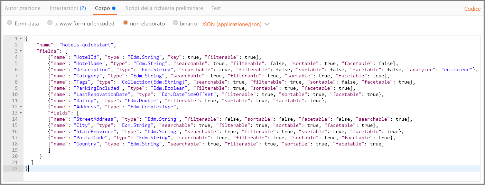
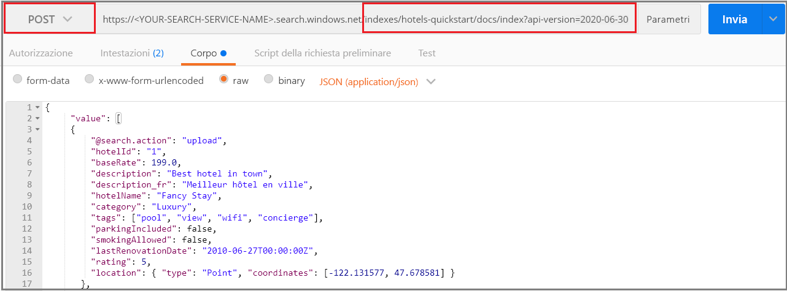
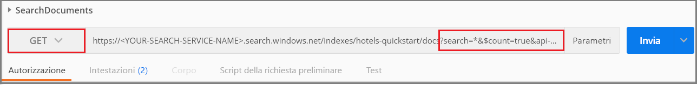
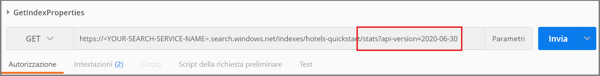

# <a name="quickstart-create-an-azure-cognitive-search-index-in-postman-using-rest-apis"></a>Guida introduttiva: Creare un indice di Ricerca cognitiva di Azure in Postman con le API REST
> [!div class="op_single_selector"]
> * [Postman](search-get-started-postman.md)
> * [C#](search-create-index-dotnet.md)
> * [Python](search-get-started-python.md)
> * [Portale](search-get-started-portal.md)
> * [PowerShell](search-howto-dotnet-sdk.md)
>*

Uno dei modi più semplici per esplorare le [API REST di Ricerca cognitiva di Azure](https://docs.microsoft.com/rest/api/searchservice) consiste nell'usare Postman o un altro strumento di test Web per formulare le richieste HTTP ed esaminare le risposte. Con gli strumenti corretti e con queste istruzioni è possibile inviare richieste e visualizzare le risposte prima di scrivere codice.

Questo articolo illustra come formulare le richieste in modo interattivo. In alternativa, è possibile [scaricare e importare una raccolta Postman](https://github.com/Azure-Samples/azure-search-postman-samples/tree/master/Quickstart) per usare le richieste predefinite.

Se non si ha una sottoscrizione di Azure, creare un [account gratuito](https://azure.microsoft.com/free/?WT.mc_id=A261C142F) prima di iniziare.

## <a name="prerequisites"></a>Prerequisiti

Per questa guida di avvio rapido sono richiesti i servizi e gli strumenti seguenti. 

+ L'[app desktop Postman](https://www.getpostman.com/) viene usata per inviare le richieste a Ricerca cognitiva di Azure.

+ [Creare un servizio di Ricerca cognitiva di Azure](search-create-service-portal.md) o [trovare un servizio esistente](https://ms.portal.azure.com/#blade/HubsExtension/BrowseResourceBlade/resourceType/Microsoft.Search%2FsearchServices) nella sottoscrizione corrente. È possibile usare un servizio gratuito per questo avvio rapido. 

## <a name="get-a-key-and-url"></a>Ottenere una chiave e un URL

Le chiamate REST richiedono l'URL del servizio e una chiave di accesso per ogni richiesta. Con entrambi gli elementi viene creato un servizio di ricerca, quindi se il servizio Ricerca cognitiva di Azure è stato aggiunto alla sottoscrizione, seguire questi passaggi per ottenere le informazioni necessarie:

1. [Accedere al portale di Azure](https://portal.azure.com/) e ottenere l'URL nella pagina **Panoramica** del servizio di ricerca. Un endpoint di esempio potrebbe essere simile a `https://mydemo.search.windows.net`.

1. In **Impostazioni** > **Chiavi** ottenere una chiave amministratore per diritti completi sul servizio. Sono disponibili due chiavi amministratore interscambiabili, fornite per continuità aziendale nel caso in cui sia necessario eseguire il rollover di una di esse. È possibile usare la chiave primaria o secondaria nelle richieste per l'aggiunta, la modifica e l'eliminazione di oggetti.


Per ogni richiesta inviata al servizio è necessario specificare una chiave API. La presenza di una chiave valida stabilisce una relazione di trust, in base alle singole richieste, tra l'applicazione che invia la richiesta e il servizio che la gestisce.

## <a name="connect-to-azure-cognitive-search"></a>Connettersi a Ricerca cognitiva di Azure

In questa sezione si usa lo strumento Web preferito per configurare le connessioni a Ricerca cognitiva di Azure. Ogni strumento conserva le informazioni dell'intestazione della richiesta per la sessione, quindi è necessario immettere la chiave API e il tipo di contenuto una sola volta.

Per ogni strumento è necessario scegliere un comando (GET, POST, PUT e così via), fornire un endpoint URL e per alcune attività fornire il codice JSON nel corpo della richiesta. Sostituire il nome del servizio di ricerca (YOUR-SEARCH-SERVICE-NAME) con un valore valido. Aggiungere `$select=name` per restituire solo il nome di ogni indice. 

    https://<YOUR-SEARCH-SERVICE-NAME>.search.windows.net/indexes?api-version=2019-05-06&$select=name

Si notino il prefisso HTTPS, il nome del servizio, il nome di un oggetto (in questo caso la raccolta di indici) e la [versione API](search-api-versions.md). La versione API è una stringa obbligatoria in caratteri minuscoli specificata come `?api-version=2019-05-06` per la versione corrente. Le versioni API vengono aggiornate regolarmente. Includendo l'elemento api-version in ogni richiesta, è possibile avere controllo completo sulla versione API usata.  

La composizione dell'intestazione della richiesta include due elementi, il tipo di contenuto e la chiave API usata per l'autenticazione in Ricerca cognitiva di Azure. Sostituire la chiave API di amministrazione (YOUR-AZURE-SEARCH-ADMIN-API-KEY) con un valore valido. 

    api-key: <YOUR-AZURE-SEARCH-ADMIN-API-KEY>
    Content-Type: application/json

In Postman formulare una richiesta simile allo screenshot seguente. Scegliere **GET** come verbo, specificare l'URL e fare clic su **Send** (Invia). Questo comando si connette a Ricerca cognitiva di Azure, legge la raccolta di indici e restituisce il codice di stato HTTP 200 se la connessione riesce. Se il servizio ha già indici, la risposta includerà anche le definizioni di indice.


## <a name="1---create-an-index"></a>1 - Creare un indice

In Ricerca cognitiva di Azure l'indice viene generalmente creato prima di caricarlo con i dati. Per questa attività viene usata l'[API REST di creazione dell'indice](https://docs.microsoft.com/rest/api/searchservice/create-index). 

L'URL è stato esteso per includere il nome dell'indice `hotels`.

Per eseguire questa operazione in Postman:

1. Modificare il verbo in **PUT**.

2. Copiare questo URL `https://<YOUR-SEARCH-SERVICE-NAME>.search.windows.net/indexes/hotels-quickstart?api-version=2019-05-06`.

3. Specificare la definizione dell'indice (di seguito è disponibile il codice pronto per la copia) nel corpo della richiesta.

4. Fare clic su **Send**.



### <a name="index-definition"></a>Definizione di indice

La raccolta campi (fields) definisce la struttura del documento. Ogni documento deve avere questi campi e ogni campo deve avere un tipo di dati. I campi stringa vengono usati nella ricerca full-text, quindi è consigliabile eseguire il cast dei dati numerici come stringhe se è necessario consentire l'esecuzione di ricerche nel contenuto.

Gli attributi nel campo determinano l'azione consentita. Le API REST consentono numerose azioni per impostazione predefinita. Tutte le stringhe, ad esempio, per impostazione predefinita consentono le ricerche, possono essere recuperate e filtrate e prevedono facet. Spesso è necessario impostare gli attributi solo per disattivare un comportamento.

```json
{
    "name": "hotels-quickstart",  
    "fields": [
        {"name": "HotelId", "type": "Edm.String", "key": true, "filterable": true},
        {"name": "HotelName", "type": "Edm.String", "searchable": true, "filterable": false, "sortable": true, "facetable": false},
        {"name": "Description", "type": "Edm.String", "searchable": true, "filterable": false, "sortable": false, "facetable": false, "analyzer": "en.lucene"},
        {"name": "Category", "type": "Edm.String", "searchable": true, "filterable": true, "sortable": true, "facetable": true},
        {"name": "Tags", "type": "Collection(Edm.String)", "searchable": true, "filterable": true, "sortable": false, "facetable": true},
        {"name": "ParkingIncluded", "type": "Edm.Boolean", "filterable": true, "sortable": true, "facetable": true},
        {"name": "LastRenovationDate", "type": "Edm.DateTimeOffset", "filterable": true, "sortable": true, "facetable": true},
        {"name": "Rating", "type": "Edm.Double", "filterable": true, "sortable": true, "facetable": true},
        {"name": "Address", "type": "Edm.ComplexType", 
        "fields": [
        {"name": "StreetAddress", "type": "Edm.String", "filterable": false, "sortable": false, "facetable": false, "searchable": true},
        {"name": "City", "type": "Edm.String", "searchable": true, "filterable": true, "sortable": true, "facetable": true},
        {"name": "StateProvince", "type": "Edm.String", "searchable": true, "filterable": true, "sortable": true, "facetable": true},
        {"name": "PostalCode", "type": "Edm.String", "searchable": true, "filterable": true, "sortable": true, "facetable": true},
        {"name": "Country", "type": "Edm.String", "searchable": true, "filterable": true, "sortable": true, "facetable": true}
        ]
     }
  ]
}
```

Quando si invia questa richiesta, si dovrebbe ottenere una risposta HTTP 201, che indica che l'indice è stato creato correttamente. È possibile verificare questa azione nel portale, ma si noti che, in base agli intervalli di aggiornamento della pagina del portale, potrebbero essere necessari uno o due minuti.

> [!TIP]
> Se viene restituita una risposta HTTP 504, verificare se nell'URL è specificato HTTPS. Se viene visualizzata la risposta HTTP 400 o 404, esaminare il corpo della richiesta per verificare che le operazioni di copia e incolla sono state eseguite correttamente. Una risposta HTTP 403 indica in genere che si è verificato un problema con la chiave API (chiave non valida o problema di sintassi nella specifica della chiave API).

## <a name="2---load-documents"></a>2 - Caricare i documenti

La creazione e il popolamento dell'indice sono passaggi distinti. In Ricerca cognitiva di Azure l'indice contiene tutti i dati in cui è possibile eseguire ricerche, che possono essere forniti come documenti JSON. Per questa attività viene usata l'[API REST di aggiunta, aggiornamento o eliminazione di documenti](https://docs.microsoft.com/rest/api/searchservice/addupdate-or-delete-documents). 

L'URL è stato esteso per includere le raccolte `docs` e l'operazione `index`.

Per eseguire questa operazione in Postman:

1. Modificare il verbo in **POST**.

2. Copiare questo URL `https://<YOUR-SEARCH-SERVICE-NAME>.search.windows.net/indexes/hotels-quickstart/docs/index?api-version=2019-05-06`.

3. Specificare i documenti JSON (il codice pronto per la copia è disponibile di seguito) nel corpo della richiesta.

4. Fare clic su **Send**.



### <a name="json-documents-to-load-into-the-index"></a>Documenti JSON da caricare nell'indice

Il corpo della richiesta contiene quattro documenti da aggiungere all'indice degli hotel.

```json
{
    "value": [
    {
    "@search.action": "upload",
    "HotelId": "1",
    "HotelName": "Secret Point Motel",
    "Description": "The hotel is ideally located on the main commercial artery of the city in the heart of New York. A few minutes away is Time's Square and the historic centre of the city, as well as other places of interest that make New York one of America's most attractive and cosmopolitan cities.",
    "Category": "Boutique",
    "Tags": [ "pool", "air conditioning", "concierge" ],
    "ParkingIncluded": false,
    "LastRenovationDate": "1970-01-18T00:00:00Z",
    "Rating": 3.60,
    "Address": 
        {
        "StreetAddress": "677 5th Ave",
        "City": "New York",
        "StateProvince": "NY",
        "PostalCode": "10022",
        "Country": "USA"
        } 
    },
    {
    "@search.action": "upload",
    "HotelId": "2",
    "HotelName": "Twin Dome Motel",
    "Description": "The hotel is situated in a  nineteenth century plaza, which has been expanded and renovated to the highest architectural standards to create a modern, functional and first-class hotel in which art and unique historical elements coexist with the most modern comforts.",
    "Category": "Boutique",
    "Tags": [ "pool", "free wifi", "concierge" ],
    "ParkingIncluded": false,
    "LastRenovationDate": "1979-02-18T00:00:00Z",
    "Rating": 3.60,
    "Address": 
        {
        "StreetAddress": "140 University Town Center Dr",
        "City": "Sarasota",
        "StateProvince": "FL",
        "PostalCode": "34243",
        "Country": "USA"
        } 
    },
    {
    "@search.action": "upload",
    "HotelId": "3",
    "HotelName": "Triple Landscape Hotel",
    "Description": "The Hotel stands out for its gastronomic excellence under the management of William Dough, who advises on and oversees all of the Hotel’s restaurant services.",
    "Category": "Resort and Spa",
    "Tags": [ "air conditioning", "bar", "continental breakfast" ],
    "ParkingIncluded": true,
    "LastRenovationDate": "2015-09-20T00:00:00Z",
    "Rating": 4.80,
    "Address": 
        {
        "StreetAddress": "3393 Peachtree Rd",
        "City": "Atlanta",
        "StateProvince": "GA",
        "PostalCode": "30326",
        "Country": "USA"
        } 
    },
    {
    "@search.action": "upload",
    "HotelId": "4",
    "HotelName": "Sublime Cliff Hotel",
    "Description": "Sublime Cliff Hotel is located in the heart of the historic center of Sublime in an extremely vibrant and lively area within short walking distance to the sites and landmarks of the city and is surrounded by the extraordinary beauty of churches, buildings, shops and monuments. Sublime Cliff is part of a lovingly restored 1800 palace.",
    "Category": "Boutique",
    "Tags": [ "concierge", "view", "24-hour front desk service" ],
    "ParkingIncluded": true,
    "LastRenovationDate": "1960-02-06T00:00:00Z",
    "Rating": 4.60,
    "Address": 
        {
        "StreetAddress": "7400 San Pedro Ave",
        "City": "San Antonio",
        "StateProvince": "TX",
        "PostalCode": "78216",
        "Country": "USA"
        }
    }
  ]
}
```

Entro pochi secondi si dovrebbe visualizzare una risposta HTTP 201 nell'elenco delle sessioni. Questo indica che i documenti sono stati creati correttamente. 

Se viene restituito un codice 207, significa che il caricamento di almeno uno dei documenti non è riuscito. Se viene restituito un codice 404, significa che è presente un errore di sintassi nell'intestazione o nel corpo della richiesta. Verificare di aver modificato l'endpoint per includere `/docs/index`.

> [!Tip]
> Per le origini dati selezionate, è possibile scegliere l'approccio alternativo tramite *indicizzatore*, che semplifica e riduce la quantità di codice necessario per l'indicizzazione. Per altre informazioni, vedere [Indexer operations](https://docs.microsoft.com/rest/api/searchservice/indexer-operations) (Operazioni dell'indicizzatore).


## <a name="3---search-an-index"></a>3 - Eseguire la ricerca in un indice

Ora che l'indice e i documenti sono stati caricati, è possibile eseguire query su di essi con l'[API REST di ricerca documenti](https://docs.microsoft.com/rest/api/searchservice/search-documents).

L'URL viene esteso per includere un'espressione di query, specificata usando l'operatore di ricerca.

Per eseguire questa operazione in Postman:

1. Cambiare il verbo in **GET**.

2. Copiare questo URL `https://<YOUR-SEARCH-SERVICE-NAME>.search.windows.net/indexes/hotels-quickstart/docs?search=*&$count=true&api-version=2019-05-06`.

3. Fare clic su **Send**.

Questa query è vuota e restituisce un conteggio dei documenti nei risultati della ricerca. La richiesta e la risposta dovrebbero essere simili allo screenshot seguente per Postman dopo avere fatto clic su **Send** (Invia). Il codice di stato dovrebbe essere 200.

 

Provare altri esempi di query per fare pratica con la sintassi. È possibile eseguire una ricerca di stringhe, query $filter verbatim, limitare il set di risultati, definire campi specifici come ambito della ricerca e altro ancora.

Sostituire l'URL corrente con quelli riportati di seguito, facendo clic su **Invia** ogni volta per visualizzare i risultati.

```
# Query example 1 - Search on restaurant and wifi
# Return only the HotelName, Description, and Tags fields
https://<YOUR-SEARCH-SERVICE>.search.windows.net/indexes/hotels-quickstart/docs?search=restaurant wifi&$count=true&$select=HotelName,Description,Tags&api-version=2019-05-06

# Query example 2 - Apply a filter to the index to find hotels rated 4 or highter
# Returns the HotelName and Rating. Two documents match
https://<YOUR-SEARCH-SERVICE>.search.windows.net/indexes/hotels-quickstart/docs?search=*&$filter=Rating gt 4&$select=HotelName,Rating&api-version=2019-05-06

# Query example 3 - Take the top two results, and show only HotelName and Category in the results
https://<YOUR-SEARCH-SERVICE>.search.windows.net/indexes/hotels-quickstart/docs?search=boutique&$top=2&$select=HotelName,Category&api-version=2019-05-06

# Query example 4 - Sort by a specific field (Address/City) in ascending order
https://<YOUR-SEARCH-SERVICE>.search.windows.net/indexes/hotels-quickstart/docs?search=pool&$orderby=Address/City asc&$select=HotelName, Address/City, Tags, Rating&api-version=2019-05-06
```

## <a name="get-index-properties"></a>Ottenere le proprietà dell'indice
È anche possibile usare [Get Index Statistics](https://docs.microsoft.com/rest/api/searchservice/get-index-statistics) per recuperare i conteggi dei documenti e le dimensioni dell'indice: 

```
https://<YOUR-SEARCH-SERVICE-NAME>.search.windows.net/indexes/hotels-quickstart/stats?api-version=2019-05-06
```

L'aggiunta di `/stats` all'URL restituisce informazioni sull'indice. In Postman la richiesta dovrebbe essere simile alla seguente e la risposta include il numero di documenti e lo spazio usato in byte.

 

Si noti che la sintassi relativa alla versione API è diversa. Per questa richiesta, usare `?` per aggiungere l'elemento api-version. `?` separa il percorso dell'URL dalla stringa di query, mentre & separa ogni coppia "nome=valore" nella stringa di query. Per questa query, api-version è il primo e unico elemento nella stringa di query.

## <a name="clean-up"></a>Eseguire la pulizia

Quando si lavora nella propria sottoscrizione, alla fine di un progetto è opportuno verificare se le risorse create sono ancora necessarie. L'esecuzione continua delle risorse può avere un costo. È possibile eliminare le singole risorse oppure il gruppo di risorse per eliminare l'intero set di risorse.

Per trovare e gestire le risorse nel portale, usare il collegamento **Tutte le risorse** o **Gruppi di risorse** nel riquadro di spostamento a sinistra.

Se si usa un servizio gratuito, tenere presente che il numero di indicizzatori e origini dati è limitato a tre. Per non superare il limite, è possibile eliminare i singoli elementi nel portale. 

## <a name="next-steps"></a>Passaggi successivi

Ora che si è appreso come eseguire le attività principali, è possibile procedere con chiamate ad API REST aggiuntive per funzionalità più avanzate, ad esempio gli indicizzatori o la [configurazione di una pipeline di ricerca cognitiva](cognitive-search-tutorial-blob.md). Per il passaggio successivo, vedere il collegamento seguente:

> [!div class="nextstepaction"]
> [Esercitazione REST: indicizzare e cercare dati semistrutturati (BLOB JSON) in Ricerca cognitiva di Azure](search-semi-structured-data.md)
