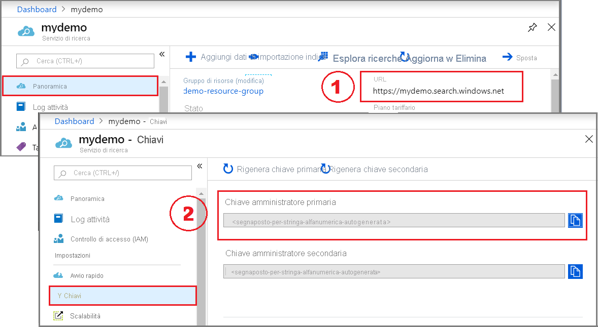

# <a name="quickstart-create-an-azure-cognitive-search-index-in-python-using-jupyter-notebooks"></a>Guida introduttiva: Creare un indice di Ricerca cognitiva di Azure in Python con Jupyter Notebook

> [!div class="op_single_selector"]
> * [Python](search-get-started-python.md)
> * [PowerShell (REST)](./search-get-started-powershell.md)
> * [C#](./search-get-started-dotnet.md)
> * [REST](search-get-started-rest.md)
> * [Portale](search-get-started-portal.md)
>

Creare un notebook di Jupyter che crea, carica ed esegue query su un indice di Ricerca cognitiva di Azure usando Python e la [libreria azure-search-documents](/python/api/overview/azure/search-documents-readme) di Azure SDK per Python. Questo articolo illustra in modo dettagliato come creare un notebook. In alternativa, è possibile [scaricare ed eseguire un notebook Python di Jupyter già completato](https://github.com/Azure-Samples/azure-search-python-samples).

Se non si ha una sottoscrizione di Azure, creare un [account gratuito](https://azure.microsoft.com/free/?WT.mc_id=A261C142F) prima di iniziare.

## <a name="prerequisites"></a>Prerequisiti

Per questa guida di avvio rapido sono richiesti i servizi e gli strumenti seguenti.

* [Anaconda 3.x](https://www.anaconda.com/distribution/#download-section), che fornisce Python 3.x e Jupyter Notebook.

* [Pacchetto azure-search-documents](https://pypi.org/project/azure-search-documents/)

* [Creare un servizio di Ricerca cognitiva di Azure](search-create-service-portal.md) o [trovare un servizio esistente](https://ms.portal.azure.com/#blade/HubsExtension/BrowseResourceBlade/resourceType/Microsoft.Search%2FsearchServices) nella sottoscrizione corrente. Per questa guida di avvio rapido è possibile usare il livello gratuito. 

## <a name="copy-a-key-and-url"></a>Copiare una chiave e un URL

Le chiamate REST richiedono l'URL del servizio e una chiave di accesso per ogni richiesta. Con entrambi gli elementi viene creato un servizio di ricerca, quindi se il servizio Ricerca cognitiva di Azure è stato aggiunto alla sottoscrizione, seguire questi passaggi per ottenere le informazioni necessarie:

1. [Accedere al portale di Azure](https://portal.azure.com/) e ottenere l'URL nella pagina **Panoramica** del servizio di ricerca. Un endpoint di esempio potrebbe essere simile a `https://mydemo.search.windows.net`.

1. In **Impostazioni** > **Chiavi** ottenere una chiave amministratore per diritti completi sul servizio. Sono disponibili due chiavi amministratore interscambiabili, fornite per continuità aziendale nel caso in cui sia necessario eseguire il rollover di una di esse. È possibile usare la chiave primaria o secondaria nelle richieste per l'aggiunta, la modifica e l'eliminazione di oggetti.



Per ogni richiesta inviata al servizio è necessario specificare una chiave API. La presenza di una chiave valida stabilisce una relazione di trust, in base alle singole richieste, tra l'applicazione che invia la richiesta e il servizio che la gestisce.

## <a name="connect-to-azure-cognitive-search"></a>Connettersi a Ricerca cognitiva di Azure

In questa attività avviare un notebook di Jupyter e verificare di potersi connettere a Ricerca cognitiva di Azure. A tale scopo, richiedere un elenco di indici dal servizio. In Windows con Anaconda 3 è possibile avviare un notebook usando Anaconda Navigator.

1. Creare un nuovo notebook Python 3.

1. Nella prima cella caricare le librerie di Azure SDK per Python, tra cui [azure-search-documents](/python/api/azure-search-documents).

   ```python
    !pip install azure-search-documents --pre
    !pip show azure-search-documents

    import os
    from azure.core.credentials import AzureKeyCredential
    from azure.search.documents.indexes import SearchIndexClient 
    from azure.search.documents import SearchClient
    from azure.search.documents.indexes.models import (
        ComplexField,
        CorsOptions,
        SearchIndex,
        ScoringProfile,
        SearchFieldDataType,
        SimpleField,
        SearchableField
    )
   ```

1. Nella seconda cella immettere gli elementi di richiesta che saranno costanti per ogni richiesta. Specificare il nome del servizio di ricerca, la chiave API di amministrazione e la chiave API di query, copiati in un passaggio precedente. Questa cella configura anche i client che verranno usati per specifiche operazioni: [SearchIndexClient](/python/api/azure-search-documents/azure.search.documents.indexes.searchindexclient) per creare un indice e [SearchClient](/python/api/azure-search-documents/azure.search.documents.searchclient) per eseguire query su un indice.

   ```python
    service_name = ["SEARCH_ENDPOINT - do not include search.windows.net"]
    admin_key = ["Cognitive Search Admin API Key"]

    index_name = "hotels-quickstart"

    # Create an SDK client
    endpoint = "https://{}.search.windows.net/".format(service_name)
    admin_client = SearchIndexClient(endpoint=endpoint,
                          index_name=index_name,
                          credential=AzureKeyCredential(admin_key))

    search_client = SearchClient(endpoint=endpoint,
                          index_name=index_name,
                          credential=AzureKeyCredential(admin_key))
   ```

1. Nella terza cella eseguire un'operazione delete_index per cancellare eventuali indici *hotels-quickstart* esistenti dal servizio. L'eliminazione dell'indice consente di creare un altro indice *hotels-quickstart* con lo stesso nome.

   ```python
    try:
        result = admin_client.delete_index(index_name)
        print ('Index', index_name, 'Deleted')
    except Exception as ex:
        print (ex)
   ```

1. Eseguire ogni passaggio.

## <a name="1---create-an-index"></a>1 - Creare un indice

Gli elementi obbligatori di un indice includono un nome, una raccolta di campi e una chiave. La raccolta di campi definisce la struttura di un *documento di ricerca* logico, usato per caricare i dati e per restituire i risultati. 

Ogni campo ha un nome, un tipo e attributi che determinano come viene usato, ad esempio se è compatibile con la ricerca full-text, filtrabile o recuperabile nei risultati della ricerca. All'interno di un indice, uno dei campi di tipo `Edm.String` deve essere designato come chiave (*key*) per l'identità del documento.

Questo indice è denominato "hotels-quickstart" e include le definizioni dei campi riportate di seguito. È un subset di un più esteso [indice hotels](https://github.com/Azure-Samples/azure-search-sample-data/blob/master/hotels/Hotels_IndexDefinition.JSON) usato in altre procedure dettagliate. In questa guida di avvio rapido è stato tagliato per brevità.

1. Nella cella successiva incollare l'esempio seguente per specificare lo schema.

    ```python
    name = index_name
    fields = [
            SimpleField(name="HotelId", type=SearchFieldDataType.String, key=True),
            SearchableField(name="HotelName", type=SearchFieldDataType.String, sortable=True),
            SearchableField(name="Description", type=SearchFieldDataType.String, analyzer_name="en.lucene"),
            SearchableField(name="Description_fr", type=SearchFieldDataType.String, analyzer_name="fr.lucene"),
            SearchableField(name="Category", type=SearchFieldDataType.String, facetable=True, filterable=True, sortable=True),

            SearchableField(name="Tags", collection=True, type=SearchFieldDataType.String, facetable=True, filterable=True),

            SimpleField(name="ParkingIncluded", type=SearchFieldDataType.Boolean, facetable=True, filterable=True, sortable=True),
            SimpleField(name="LastRenovationDate", type=SearchFieldDataType.DateTimeOffset, facetable=True, filterable=True, sortable=True),
            SimpleField(name="Rating", type=SearchFieldDataType.Double, facetable=True, filterable=True, sortable=True),

            ComplexField(name="Address", fields=[
                SearchableField(name="StreetAddress", type=SearchFieldDataType.String),
                SearchableField(name="City", type=SearchFieldDataType.String, facetable=True, filterable=True, sortable=True),
                SearchableField(name="StateProvince", type=SearchFieldDataType.String, facetable=True, filterable=True, sortable=True),
                SearchableField(name="PostalCode", type=SearchFieldDataType.String, facetable=True, filterable=True, sortable=True),
                SearchableField(name="Country", type=SearchFieldDataType.String, facetable=True, filterable=True, sortable=True),
            ])
        ]
    cors_options = CorsOptions(allowed_origins=["*"], max_age_in_seconds=60)
    scoring_profiles = []
    suggester = [{'name': 'sg', 'source_fields': ['Tags', 'Address/City', 'Address/Country']}]
    ```

1. In un'altra cella formulare la richiesta. Questa richiesta create_index ha come destinazione la raccolta di indici del servizio di ricerca e crea un oggetto [SearchIndex](/python/api/azure-search-documents/azure.search.documents.indexes.models.searchindex) basato sullo schema di indice inserito nella cella precedente.

   ```python
    index = SearchIndex(
        name=name,
        fields=fields,
        scoring_profiles=scoring_profiles,
        suggesters = suggester,
        cors_options=cors_options)

    try:
        result = admin_client.create_index(index)
        print ('Index', result.name, 'created')
    except Exception as ex:
        print (ex)
   ```

1. Eseguire ogni passaggio.

<a name="load-documents"></a>

## <a name="2---load-documents"></a>2 - Caricare i documenti

Per caricare documenti, creare una raccolta di documenti usando un'[azione di indice](/python/api/azure-search-documents/azure.search.documents.models.indexaction) per il tipo di operazione (caricamento, unione e caricamento e così via). I documenti provengono da [HotelsData](https://github.com/Azure-Samples/azure-search-sample-data/blob/master/hotels/HotelsData_toAzureSearch.JSON) in GitHub.

1. In una nuova cella fornire quattro documenti conformi allo schema di indice. Specificare un'azione di caricamento per ogni documento.

    ```python
    documents = {
        "value": [
        {
        "@search.action": "upload",
        "HotelId": "1",
        "HotelName": "Secret Point Motel",
        "Description": "The hotel is ideally located on the main commercial artery of the city in the heart of New York. A few minutes away is Time's Square and the historic centre of the city, as well as other places of interest that make New York one of America's most attractive and cosmopolitan cities.",
        "Description_fr": "L'hôtel est idéalement situé sur la principale artère commerciale de la ville en plein cœur de New York. A quelques minutes se trouve la place du temps et le centre historique de la ville, ainsi que d'autres lieux d'intérêt qui font de New York l'une des villes les plus attractives et cosmopolites de l'Amérique.",
        "Category": "Boutique",
        "Tags": [ "pool", "air conditioning", "concierge" ],
        "ParkingIncluded": "false",
        "LastRenovationDate": "1970-01-18T00:00:00Z",
        "Rating": 3.60,
        "Address": {
            "StreetAddress": "677 5th Ave",
            "City": "New York",
            "StateProvince": "NY",
            "PostalCode": "10022",
            "Country": "USA"
            }
        },
        {
        "@search.action": "upload",
        "HotelId": "2",
        "HotelName": "Twin Dome Motel",
        "Description": "The hotel is situated in a  nineteenth century plaza, which has been expanded and renovated to the highest architectural standards to create a modern, functional and first-class hotel in which art and unique historical elements coexist with the most modern comforts.",
        "Description_fr": "L'hôtel est situé dans une place du XIXe siècle, qui a été agrandie et rénovée aux plus hautes normes architecturales pour créer un hôtel moderne, fonctionnel et de première classe dans lequel l'art et les éléments historiques uniques coexistent avec le confort le plus moderne.",
        "Category": "Boutique",
        "Tags": [ "pool", "free wifi", "concierge" ],
        "ParkingIncluded": "false",
        "LastRenovationDate": "1979-02-18T00:00:00Z",
        "Rating": 3.60,
        "Address": {
            "StreetAddress": "140 University Town Center Dr",
            "City": "Sarasota",
            "StateProvince": "FL",
            "PostalCode": "34243",
            "Country": "USA"
            }
        },
        {
        "@search.action": "upload",
        "HotelId": "3",
        "HotelName": "Triple Landscape Hotel",
        "Description": "The Hotel stands out for its gastronomic excellence under the management of William Dough, who advises on and oversees all of the Hotel's restaurant services.",
        "Description_fr": "L'hôtel est situé dans une place du XIXe siècle, qui a été agrandie et rénovée aux plus hautes normes architecturales pour créer un hôtel moderne, fonctionnel et de première classe dans lequel l'art et les éléments historiques uniques coexistent avec le confort le plus moderne.",
        "Category": "Resort and Spa",
        "Tags": [ "air conditioning", "bar", "continental breakfast" ],
        "ParkingIncluded": "true",
        "LastRenovationDate": "2015-09-20T00:00:00Z",
        "Rating": 4.80,
        "Address": {
            "StreetAddress": "3393 Peachtree Rd",
            "City": "Atlanta",
            "StateProvince": "GA",
            "PostalCode": "30326",
            "Country": "USA"
            }
        },
        {
        "@search.action": "upload",
        "HotelId": "4",
        "HotelName": "Sublime Cliff Hotel",
        "Description": "Sublime Cliff Hotel is located in the heart of the historic center of Sublime in an extremely vibrant and lively area within short walking distance to the sites and landmarks of the city and is surrounded by the extraordinary beauty of churches, buildings, shops and monuments. Sublime Cliff is part of a lovingly restored 1800 palace.",
        "Description_fr": "Le sublime Cliff Hotel est situé au coeur du centre historique de sublime dans un quartier extrêmement animé et vivant, à courte distance de marche des sites et monuments de la ville et est entouré par l'extraordinaire beauté des églises, des bâtiments, des commerces et Monuments. Sublime Cliff fait partie d'un Palace 1800 restauré avec amour.",
        "Category": "Boutique",
        "Tags": [ "concierge", "view", "24-hour front desk service" ],
        "ParkingIncluded": "true",
        "LastRenovationDate": "1960-02-06T00:00:00Z",
        "Rating": 4.60,
        "Address": {
            "StreetAddress": "7400 San Pedro Ave",
            "City": "San Antonio",
            "StateProvince": "TX",
            "PostalCode": "78216",
            "Country": "USA"
            }
        }
    ]
    }
    ```  

1. In un'altra cella formulare la richiesta. Questa richiesta upload_documents ha come destinazione la raccolta di documenti dell'indice hotels-quickstart ed effettua il push dei documenti forniti nel passaggio precedente nell'indice di Ricerca cognitiva.


   ```python
    try:
        result = search_client.upload_documents(documents=documents)
        print("Upload of new document succeeded: {}".format(result[0].succeeded))
    except Exception as ex:
        print (ex.message)
   ```

1. Eseguire ogni passaggio per effettuare il push dei documenti in un indice nel servizio di ricerca.

## <a name="3---search-an-index"></a>3 - Eseguire la ricerca in un indice

Questo passaggio illustra come eseguire query su un indice con l'[API REST per la ricerca di documenti](/rest/api/searchservice/search-documents).

1. Per questa operazione, usare search_client. Questa query esegue una ricerca vuota (`search=*`), restituendo un elenco non classificato (con punteggio di ricerca uguale a 1) di documenti arbitrari. Non essendoci criteri, nei risultati vengono inclusi tutti i documenti. Questa query stampa solo due campi in ogni documento. Aggiunge inoltre `include_total_count=True` per ottenere il numero di tutti i documenti (4) inclusi nei risultati.

   ```python
    results =  search_client.search(search_text="*", include_total_count=True)

    print ('Total Documents Matching Query:', results.get_count())
    for result in results:
        print("{}: {}".format(result["HotelId"], result["HotelName"]))
   ```

1. La query successiva aggiunge parole intere all'espressione di ricerca ("wifi"). Questa query specifica che i risultati devono contenere solo i campi inclusi nell'istruzione `select`. Limitando i campi restituiti, è possibile ridurre la quantità di dati inviati tramite rete e di conseguenza la latenza della ricerca.

   ```python
    results =  search_client.search(search_text="wifi", include_total_count=True, select='HotelId,HotelName,Tags')

    print ('Total Documents Matching Query:', results.get_count())
    for result in results:
        print("{}: {}: {}".format(result["HotelId"], result["HotelName"], result["Tags"]))
   ```

1. Applicare quindi un'espressione di filtro per restituire solo gli hotel con una valutazione maggiore di 4, in ordine decrescente.

   ```python
    results =  search_client.search(search_text="hotels", select='HotelId,HotelName,Rating', filter='Rating gt 4', order_by='Rating desc')

    for result in results:
        print("{}: {} - {} rating".format(result["HotelId"], result["HotelName"], result["Rating"]))
   ```

1. Aggiungere `search_fields` per impostare l'ambito di corrispondenza della query su un singolo campo.

   ```python
    results =  search_client.search(search_text="sublime", search_fields='HotelName', select='HotelId,HotelName')

    for result in results:
        print("{}: {}".format(result["HotelId"], result["HotelName"]))
   ```

1. I facet sono etichette che è possibile usare per comporre una struttura di esplorazione in base a facet. Questa query restituisce facet e conteggi per la categoria.

   ```python
    results =  search_client.search(search_text="*", facets=["Category"])

    facets = results.get_facets()

    for facet in facets["Category"]:
        print("    {}".format(facet))
   ```

1. In questo esempio esaminare un documento specifico basato sulla relativa chiave. In genere, un documento dovrebbe essere restituito quando un utente lo seleziona nei risultati della ricerca.

   ```python
    result = search_client.get_document(key="3")

    print("Details for hotel '3' are:")
    print("        Name: {}".format(result["HotelName"]))
    print("      Rating: {}".format(result["Rating"]))
    print("    Category: {}".format(result["Category"]))
   ```

1. In questo esempio verrà usata la funzione di completamento automatico. Questa funzione viene in genere usata nelle caselle di ricerca per completare automaticamente possibili corrispondenze mentre l'utente digita i termini.

   Quando è stato creato l'indice, è stato anche creato uno strumento suggerimenti denominato "sg" come parte della richiesta. Una definizione dello strumento suggerimenti specifica i campi utilizzabili per trovare possibili corrispondenze con le richieste. In questo esempio tali campi sono 'Tags', 'Address/City', 'Address/Country'. Per simulare il completamento automatico passare le lettere "sa" come stringa parziale. Il metodo di completamento automatico di [SearchClient](/python/api/azure-search-documents/azure.search.documents.searchclient) restituisce le possibile corrispondenze del termine.

   ```python
    search_suggestion = 'sa'
    results = search_client.autocomplete(search_text=search_suggestion, suggester_name="sg", mode='twoTerms')

    print("Autocomplete for:", search_suggestion)
    for result in results:
        print (result['text'])
   ```

## <a name="clean-up"></a>Eseguire la pulizia

Quando si lavora nella propria sottoscrizione, al termine di un progetto è buona norma determinare se le risorse create sono ancora necessarie. Le risorse che rimangono in esecuzione hanno un costo. È possibile eliminare le singole risorse oppure il gruppo di risorse per eliminare l'intero set di risorse.

Per trovare e gestire le risorse nel portale, usare il collegamento **Tutte le risorse** o **Gruppi di risorse** nel riquadro di spostamento a sinistra.

Se si usa un servizio gratuito, tenere presente che il numero di indicizzatori e origini dati è limitato a tre. Per non superare il limite, è possibile eliminare i singoli elementi nel portale. 

## <a name="next-steps"></a>Passaggi successivi

Per semplificare, questa guida di avvio rapido usa una versione abbreviata dell'indice hotels. È possibile creare la versione completa per provare query più interessanti. Per ottenere la versione completa e tutti i 50 documenti, eseguire la procedura guidata **Importa dati** selezionando *hotels-sample* nelle origini dati di esempio predefinite.

> [!div class="nextstepaction"]
> [Avvio rapido: Creare un indice nel portale di Azure](search-get-started-portal.md)