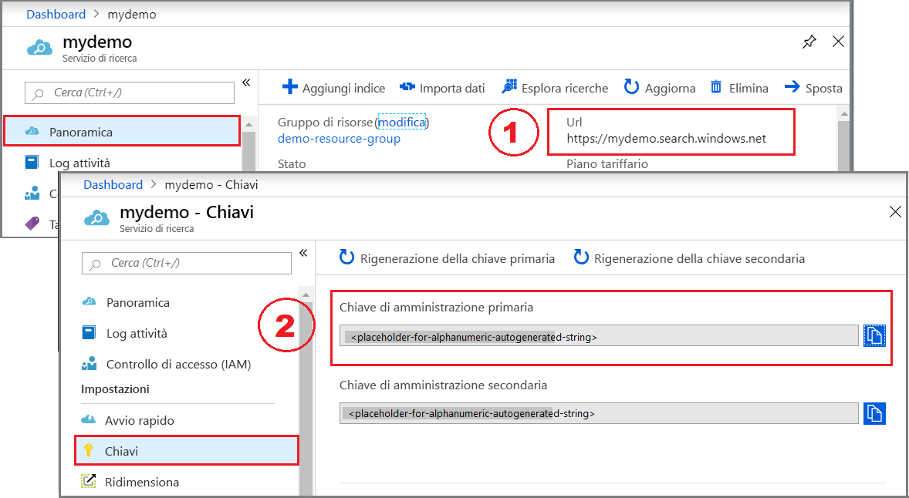

# <a name="rest-tutorial-index-and-search-semi-structured-data-json-blobs-in-azure-cognitive-search"></a>Esercitazione REST: indicizzare e cercare dati semi-strutturati (BLOB JSON) in Azure ricerca cognitiva

Ricerca cognitiva di Azure consente di indicizzare i documenti e le matrici JSON in archiviazione BLOB di Azure usando un [indicizzatore](search-indexer-overview.md) in grado di leggere dati semistrutturati. I dati semistrutturati contengono tag o contrassegni che separano il contenuto all'interno dei dati, Si differenziano dai dati non strutturati, che devono essere completamente indicizzati, e dai dati strutturati formalmente in base a un modello di dati, ad esempio uno schema di database relazionale, che può essere indicizzato campo per campo.

In questa esercitazione usare le [API REST di Ricerca cognitiva di Azure](https://docs.microsoft.com/rest/api/searchservice/) e un client REST per eseguire le attività seguenti:

> [!div class="checklist"]
> * Configurare un'origine dati di Ricerca cognitiva di Azure per un contenitore BLOB di Azure
> * Creare un indice di Ricerca cognitiva di Azure in cui includere contenuto ricercabile
> * Configurare ed eseguire un indicizzatore per leggere il contenitore ed estrarre contenuto ricercabile da archiviazione BLOB di Azure
> * Eseguire una ricerca nell'indice che appena creato

## <a name="prerequisites"></a>prerequisiti

In questa guida di avvio rapido vengono usati i servizi, gli strumenti e i dati seguenti. 

[Creare un servizio di Ricerca cognitiva di Azure](search-create-service-portal.md) o [trovare un servizio esistente](https://ms.portal.azure.com/#blade/HubsExtension/BrowseResourceBlade/resourceType/Microsoft.Search%2FsearchServices) nella sottoscrizione corrente. È possibile usare un servizio gratuito per questa esercitazione. 

[Creare un account di archiviazione di Azure](https://docs.microsoft.com/azure/storage/common/storage-quickstart-create-account) per l'archiviazione dei dati di esempio.

[App desktop Postman](https://www.getpostman.com/) per inviare le richieste a Ricerca cognitiva di Azure.

[Clinical-trials-json.zip](https://github.com/Azure-Samples/storage-blob-integration-with-cdn-search-hdi/raw/master/clinical-trials-json.zip) contiene i dati usati in questa esercitazione. Scaricare e decomprimere il file nella propria cartella. I dati provengono da [clinicaltrials.gov](https://clinicaltrials.gov/ct2/results) e sono stati convertiti in JSON per questa esercitazione.

## <a name="get-a-key-and-url"></a>Ottenere una chiave e un URL

Le chiamate REST richiedono l'URL del servizio e una chiave di accesso per ogni richiesta. Con entrambi gli elementi viene creato un servizio di ricerca, quindi se il servizio Ricerca cognitiva di Azure è stato aggiunto alla sottoscrizione, seguire questi passaggi per ottenere le informazioni necessarie:

1. [Accedere al portale di Azure](https://portal.azure.com/) e ottenere l'URL nella pagina **Panoramica** del servizio di ricerca. Un endpoint di esempio potrebbe essere simile a `https://mydemo.search.windows.net`.

1. In **Impostazioni** > **Chiavi** ottenere una chiave amministratore per diritti completi sul servizio. Sono disponibili due chiavi amministratore interscambiabili, fornite per continuità aziendale nel caso in cui sia necessario eseguire il rollover di una di esse. È possibile usare la chiave primaria o secondaria nelle richieste per l'aggiunta, la modifica e l'eliminazione di oggetti.



Per ogni richiesta inviata al servizio è necessario specificare una chiave API. La presenza di una chiave valida stabilisce una relazione di trust, in base alle singole richieste, tra l'applicazione che invia la richiesta e il servizio che la gestisce.

## <a name="prepare-sample-data"></a>Preparare i dati di esempio

1. [Accedere al portale di Azure](https://portal.azure.com), passare all'account di archiviazione di Azure, fare clic su **BLOB** e quindi su **+ Contenitore**.

1. [Creare un contenitore BLOB](https://docs.microsoft.com/azure/storage/blobs/storage-quickstart-blobs-portal) per i dati di esempio. È possibile impostare il livello di accesso pubblico su uno qualsiasi dei relativi valori validi.

1. Dopo aver creato il contenitore, aprirlo e selezionare **Carica** nella barra dei comandi.

   

1. Passare alla cartella contenente i file di esempio. Selezionare tutti i file e quindi fare clic su **Carica**.

   

Dopo aver completato il caricamento, i file dovrebbero essere visualizzati nella rispettiva sottocartella all'interno del contenitore dei dati.

## <a name="set-up-postman"></a>Impostare Postman

Avviare Postman e configurare una richiesta HTTP. Se non si ha familiarità con questo strumento, vedere [Esplorare le API REST di Ricerca cognitiva di Azure con Postman](search-get-started-postman.md) per altre informazioni.

Il metodo di richiesta per ogni chiamata in questa esercitazione è **POST**. Le chiavi di intestazione sono "Content-type" e "api-key". I valori delle chiavi di intestazione sono rispettivamente "application/json" e la chiave di amministrazione, ovvero un segnaposto per la chiave primaria di ricerca. Il corpo è l'area in cui si posiziona il contenuto effettivo della chiamata. A seconda del client in uso, la procedura per la creazione della query potrebbe essere leggermente diversa, ma questi sono i criteri di base.

  

Viene usato Postman per effettuare tre chiamate API al servizio di ricerca per creare un'origine dati, un indice e un indicizzatore. L'origine dati include un puntatore all'account di archiviazione e ai dati JSON. Il servizio di ricerca stabilisce la connessione durante il caricamento dei dati.

Le stringhe di query devono specificare una versione API e ogni chiamata deve restituire **201 Creato**. La versione API disponibile a livello generale per l'uso delle matrici JSON è `2019-05-06`.

Eseguire le tre chiamate dell'API seguenti dal client REST.

## <a name="create-a-data-source"></a>Creare un'origine dati

L'[API di creazione dell'origine dati](https://docs.microsoft.com/rest/api/searchservice/create-data-source) crea un'origine di Ricerca cognitiva di Azure che specifica quali dati indicizzare.

L'endpoint di questa chiamata è `https://[service name].search.windows.net/datasources?api-version=2019-05-06`. Sostituire `[service name]` con il nome del servizio di ricerca. 

Per questa chiamata, il corpo della richiesta deve includere il nome dell'account di archiviazione, la chiave dell'account di archiviazione e il nome del contenitore BLOB. La chiave dell'account di archiviazione è reperibile nel portale di Azure tra le **chiavi di accesso** dell'account di archiviazione. La posizione è indicata nell'immagine seguente:

  

Assicurarsi di sostituire `[storage account name]`, `[storage account key]` e `[blob container name]` nel corpo della chiamata prima di eseguire la chiamata.

```json
{
    "name" : "clinical-trials-json",
    "type" : "azureblob",
    "credentials" : { "connectionString" : "DefaultEndpointsProtocol=https;AccountName=[storage account name];AccountKey=[storage account key];" },
    "container" : { "name" : "[blob container name]"}
}
```

La risposta dovrebbe essere simile alla seguente:

```json
{
    "@odata.context": "https://exampleurl.search.windows.net/$metadata#datasources/$entity",
    "@odata.etag": "\"0x8D505FBC3856C9E\"",
    "name": "clinical-trials-json",
    "description": null,
    "type": "azureblob",
    "subtype": null,
    "credentials": {
        "connectionString": "DefaultEndpointsProtocol=https;AccountName=[mystorageaccounthere];AccountKey=[[myaccountkeyhere]]];"
    },
    "container": {
        "name": "[mycontainernamehere]",
        "query": null
    },
    "dataChangeDetectionPolicy": null,
    "dataDeletionDetectionPolicy": null
}
```

## <a name="create-an-index"></a>Creare un indice
    
La seconda chiamata è l'[API di creazione dell'indice](https://docs.microsoft.com/rest/api/searchservice/create-indexer) che crea un indice di Ricerca cognitiva di Azure che archivia tutti i dati ricercabili. Un indice specifica tutti i parametri e i relativi attributi.

L'URL per questa chiamata è `https://[service name].search.windows.net/indexes?api-version=2019-05-06`. Sostituire `[service name]` con il nome del servizio di ricerca.

Sostituire prima di tutto l'URL, quindi copiare e incollare il codice seguente nel corpo ed eseguire la query.

```json
{
  "name": "clinical-trials-json-index",  
  "fields": [
  {"name": "FileName", "type": "Edm.String", "searchable": false, "retrievable": true, "facetable": false, "filterable": false, "sortable": true},
  {"name": "Description", "type": "Edm.String", "searchable": true, "retrievable": false, "facetable": false, "filterable": false, "sortable": false},
  {"name": "MinimumAge", "type": "Edm.Int32", "searchable": false, "retrievable": true, "facetable": true, "filterable": true, "sortable": true},
  {"name": "Title", "type": "Edm.String", "searchable": true, "retrievable": true, "facetable": false, "filterable": true, "sortable": true},
  {"name": "URL", "type": "Edm.String", "searchable": false, "retrievable": false, "facetable": false, "filterable": false, "sortable": false},
  {"name": "MyURL", "type": "Edm.String", "searchable": false, "retrievable": true, "facetable": false, "filterable": false, "sortable": false},
  {"name": "Gender", "type": "Edm.String", "searchable": false, "retrievable": true, "facetable": true, "filterable": true, "sortable": false},
  {"name": "MaximumAge", "type": "Edm.Int32", "searchable": false, "retrievable": true, "facetable": true, "filterable": true, "sortable": true},
  {"name": "Summary", "type": "Edm.String", "searchable": true, "retrievable": true, "facetable": false, "filterable": false, "sortable": false},
  {"name": "NCTID", "type": "Edm.String", "key": true, "searchable": true, "retrievable": true, "facetable": false, "filterable": true, "sortable": true},
  {"name": "Phase", "type": "Edm.String", "searchable": false, "retrievable": true, "facetable": true, "filterable": true, "sortable": false},
  {"name": "Date", "type": "Edm.String", "searchable": false, "retrievable": true, "facetable": false, "filterable": false, "sortable": true},
  {"name": "OverallStatus", "type": "Edm.String", "searchable": false, "retrievable": true, "facetable": true, "filterable": true, "sortable": false},
  {"name": "OrgStudyId", "type": "Edm.String", "searchable": true, "retrievable": true, "facetable": false, "filterable": true, "sortable": false},
  {"name": "HealthyVolunteers", "type": "Edm.String", "searchable": false, "retrievable": true, "facetable": true, "filterable": true, "sortable": false},
  {"name": "Keywords", "type": "Collection(Edm.String)", "searchable": true, "retrievable": true, "facetable": true, "filterable": false, "sortable": false},
  {"name": "metadata_storage_last_modified", "type":"Edm.DateTimeOffset", "searchable": false, "retrievable": true, "filterable": true, "sortable": false},
  {"name": "metadata_storage_size", "type":"Edm.String", "searchable": false, "retrievable": true, "filterable": true, "sortable": false},
  {"name": "metadata_content_type", "type":"Edm.String", "searchable": true, "retrievable": true, "filterable": true, "sortable": false}
  ],
  "suggesters": [
  {
    "name": "sg",
    "searchMode": "analyzingInfixMatching",
    "sourceFields": ["Title"]
  }
  ]
}
```

La risposta dovrebbe essere simile alla seguente:

```json
{
    "@odata.context": "https://exampleurl.search.windows.net/$metadata#indexes/$entity",
    "@odata.etag": "\"0x8D505FC00EDD5FA\"",
    "name": "clinical-trials-json-index",
    "fields": [
        {
            "name": "FileName",
            "type": "Edm.String",
            "searchable": false,
            "filterable": false,
            "retrievable": true,
            "sortable": true,
            "facetable": false,
            "key": false,
            "indexAnalyzer": null,
            "searchAnalyzer": null,
            "analyzer": null,
            "synonymMaps": []
        },
        {
            "name": "Description",
            "type": "Edm.String",
            "searchable": true,
            "filterable": false,
            "retrievable": false,
            "sortable": false,
            "facetable": false,
            "key": false,
            "indexAnalyzer": null,
            "searchAnalyzer": null,
            "analyzer": null,
            "synonymMaps": []
        },
        ...
          "scoringProfiles": [],
    "defaultScoringProfile": null,
    "corsOptions": null,
    "suggesters": [],
    "analyzers": [],
    "tokenizers": [],
    "tokenFilters": [],
    "charFilters": []
}
```

## <a name="create-and-run-an-indexer"></a>Creare ed eseguire un indicizzatore

Un indicizzatore connette l'origine dati, importa i dati nell'indice di ricerca di destinazione e facoltativamente fornisce una pianificazione per automatizzare l'aggiornamento dei dati. L'API REST è [Creare un indicizzatore](https://docs.microsoft.com/rest/api/searchservice/create-indexer).

L'URL per questa chiamata è `https://[service name].search.windows.net/indexers?api-version=2019-05-06`. Sostituire `[service name]` con il nome del servizio di ricerca.

Sostituire prima di tutto l'URL, quindi copiare e incollare il codice seguente nel corpo e inviare la richiesta. La richiesta viene elaborata immediatamente. Quando viene restituita la risposta, si avrà un indice da usare per la ricerca full-text.

```json
{
  "name" : "clinical-trials-json-indexer",
  "dataSourceName" : "clinical-trials-json",
  "targetIndexName" : "clinical-trials-json-index",
  "parameters" : { "configuration" : { "parsingMode" : "jsonArray" } }
}
```

La risposta dovrebbe essere simile alla seguente:

```json
{
    "@odata.context": "https://exampleurl.search.windows.net/$metadata#indexers/$entity",
    "@odata.etag": "\"0x8D505FDE143D164\"",
    "name": "clinical-trials-json-indexer",
    "description": null,
    "dataSourceName": "clinical-trials-json",
    "targetIndexName": "clinical-trials-json-index",
    "schedule": null,
    "parameters": {
        "batchSize": null,
        "maxFailedItems": null,
        "maxFailedItemsPerBatch": null,
        "base64EncodeKeys": null,
        "configuration": {
            "parsingMode": "jsonArray"
        }
    },
    "fieldMappings": [],
    "enrichers": [],
    "disabled": null
}
```

## <a name="search-your-json-files"></a>Cercare i file JSON

È possibile iniziare a eseguire ricerche subito dopo aver caricato il primo documento. Per questa attività, usare [**Esplora ricerche** ](search-explorer.md)nel portale.

Nel portale di Azure aprire la pagina **Panoramica** del servizio di ricerca e trovare l'indice creato nell'elenco **Indici**.

Assicurarsi di scegliere l'indice appena creato. 

  

### <a name="user-defined-metadata-search"></a>Ricerca nei metadati definiti dall'utente

Come in precedenza, è possibile eseguire ricerche nei dati in vari modi: ricerca full-text, proprietà di sistema o metadati definiti dall'utente. Le ricerche nelle proprietà di sistema e nei metadati definiti dall'utente possono essere eseguite solo con il parametro `$select` se questi elementi sono stati contrassegnati come **recuperabili** durante la creazione dell'indice di destinazione. I parametri nell'indice non possono essere modificati dopo la creazione. È comunque possibile aggiungere ulteriori parametri.

Un esempio di query semplice è `$select=Gender,metadata_storage_size`, che limita i risultati a questi due parametri.

  

Un esempio di query più complessa può essere `$filter=MinimumAge ge 30 and MaximumAge lt 75`, che restituisce solo i risultati in cui il parametro MinimumAge è maggiore o uguale a 30 e il parametro MaximumAge è minore di 75.

  

È possibile sperimentare e provare altre query in autonomia, se lo si desidera. Tenere presente che è possibile usare gli operatori logici (and, or e not) e gli operatori di confronto (eq, ne, gt, lt, ge e le). Per i confronti tra stringhe viene fatta distinzione tra maiuscole e minuscole.

Il parametro `$filter` funziona solo con i metadati contrassegnati come filtrabili al momento della creazione dell'indice.

## <a name="clean-up-resources"></a>Pulire le risorse

Il modo più veloce per pulire le risorse dopo un'esercitazione consiste nell'eliminare il gruppo di risorse contenente il servizio Ricerca cognitiva di Azure. È possibile eliminare ora il gruppo di risorse per eliminare definitivamente tutti gli elementi in esso contenuti. Nel portale il nome del gruppo di risorse è indicato nella pagina Panoramica del servizio Ricerca cognitiva di Azure.

## <a name="next-steps"></a>Passaggi successivi

Esistono diversi approcci e più opzioni all'indicizzazione dei BLOB JSON. Nel passaggio successivo si esamineranno e testeranno le varie opzioni per determinare quale si adatta meglio al proprio scenario.

> [!div class="nextstepaction"]
> [Come indicizzare i BLOB JSON con l'indicizzatore BLOB di Ricerca cognitiva di Azure](search-howto-index-json-blobs.md)
